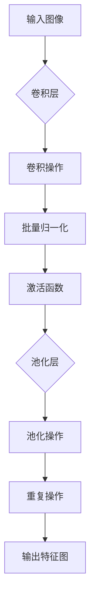
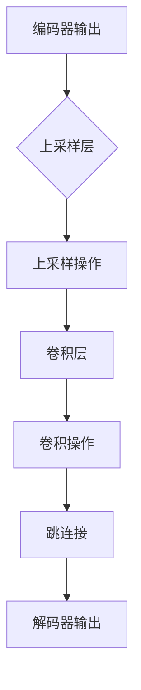
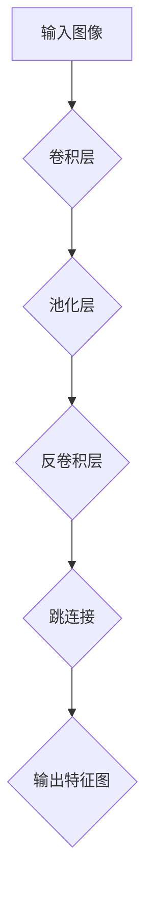

                 

# UNet原理与代码实例讲解

> **关键词：** 图像分割，深度学习，卷积神经网络，UNet架构，代码实例。

> **摘要：** 本文将深入探讨UNet，一种广泛用于图像分割的深度学习模型。通过分析其架构和核心算法，我们还将提供代码实例，以帮助读者更好地理解UNet的实际应用。

## 1. 背景介绍

### 1.1 目的和范围

本文的目标是全面解析UNet模型的原理，并提供详细的代码实例，以便读者能够深入理解并应用于实际项目中。本文将涵盖UNet的历史背景、核心架构、算法原理以及如何在具体项目中实现和优化。

### 1.2 预期读者

本文适合对深度学习和图像处理有一定了解的读者。无论是希望了解图像分割最新技术的研究人员，还是想要将UNet应用于实际项目开发的工程师，都能从本文中获得有价值的见解。

### 1.3 文档结构概述

本文将分为以下章节：

- **第1章：背景介绍**：介绍UNet的目的、读者对象和文章结构。
- **第2章：核心概念与联系**：详细描述UNet的架构和核心概念。
- **第3章：核心算法原理与具体操作步骤**：讲解UNet的算法原理和实现步骤。
- **第4章：数学模型和公式详细讲解与举例说明**：介绍UNet相关的数学模型。
- **第5章：项目实战：代码实际案例和详细解释说明**：提供实际代码实例。
- **第6章：实际应用场景**：讨论UNet在不同领域的应用。
- **第7章：工具和资源推荐**：推荐学习资源和开发工具。
- **第8章：总结：未来发展趋势与挑战**：总结UNet的未来方向。
- **第9章：附录：常见问题与解答**：回答常见问题。
- **第10章：扩展阅读 & 参考资料**：提供进一步阅读的资料。

### 1.4 术语表

#### 1.4.1 核心术语定义

- **图像分割**：将图像分割成多个区域，每个区域代表图像中不同的物体或场景。
- **深度学习**：一种机器学习技术，通过神经网络模型对大量数据进行分析和特征学习。
- **卷积神经网络**（CNN）：一种特殊类型的神经网络，用于图像识别和图像处理。
- **UNet**：一种用于图像分割的卷积神经网络架构。

#### 1.4.2 相关概念解释

- **卷积操作**：神经网络中的一个基本操作，用于提取图像特征。
- **池化操作**：用于降低数据维度，减少计算复杂度。
- **反卷积操作**：用于扩大图像空间，实现特征上采样。

#### 1.4.3 缩略词列表

- **CNN**：卷积神经网络（Convolutional Neural Network）
- **UNet**：统一网络（U-Network）
- **RGB**：红、绿、蓝（Red, Green, Blue）

## 2. 核心概念与联系

### 2.1 UNet架构概述

UNet是一种专为图像分割设计的卷积神经网络架构。其特点是从编码器（下采样路径）到解码器（上采样路径）的结构，使得模型能够在保持高分辨率的同时提取丰富的特征。


**图2.1 UNet架构示意图**

UNet的核心在于其对称的架构，编码器负责下采样，提取图像的低级特征，而解码器则进行上采样，恢复图像的高分辨率细节。这种设计使得UNet能够在图像分割任务中同时保留定位精度和特征丰富性。

### 2.2 核心概念解释

#### 2.2.1 编码器（下采样路径）

编码器的核心在于其逐层下采样操作，通过卷积和池化操作提取图像特征。具体步骤如下：

1. **卷积操作**：卷积层用于提取图像的特征，通常使用较小的卷积核（如3x3或5x5）。
2. **池化操作**：下采样层用于降低图像的空间维度，减少计算复杂度。常用的池化方法有最大池化或平均池化。
3. **批量归一化**：用于加速模型的训练并提高模型的稳定性。



**图2.2 编码器操作流程**

#### 2.2.2 解码器（上采样路径）

解码器的核心在于其逐层上采样操作，通过反卷积或上采样层恢复图像的高分辨率细节。具体步骤如下：

1. **上采样操作**：上采样层用于扩大图像的空间维度，常用的方法有反卷积或邻近插值。
2. **卷积操作**：卷积层用于对上采样后的特征图进行细化处理。
3. **跳连接**：解码器中的每层都与对应编码器层通过跳连接相连接，使得高层次的语义信息能够被传递到低层次。



**图2.3 解码器操作流程**

### 2.3 UNet架构的Mermaid流程图



**图2.4 UNet架构Mermaid流程图**

## 3. 核心算法原理与具体操作步骤

### 3.1 算法原理

UNet的算法原理基于卷积神经网络的基本原理，但特别设计用于图像分割任务。其主要特点包括：

- **对称架构**：编码器和解码器具有对称的结构，确保特征在上采样过程中能够有效恢复。
- **跳连接**：解码器中的每层都与对应编码器层通过跳连接相连接，使得高层次的语义信息能够被传递到低层次，提高分割精度。
- **全连接层**：解码器的最后一层与一个全连接层相连接，用于生成分割结果。

### 3.2 具体操作步骤

UNet的具体操作步骤可以分为编码器、解码器和输出层三个部分。下面将使用伪代码详细阐述每个步骤：

```python
# 编码器操作步骤
def encoder(input_image):
    x = convolution(input_image, kernel_size=3, stride=1, padding='same')
    x = batch_normalization(x)
    x = activation_function(x)
    x = max_pooling(x, pool_size=2, stride=2)
    return x

# 解码器操作步骤
def decoder(x, previous_layer):
    x = up_sampling(x, size=2, method='nearest')
    x = convolution(x, kernel_size=3, stride=1, padding='same')
    x = batch_normalization(x)
    x = activation_function(x)
    x = concatenate(x, previous_layer)
    return x

# 输出层操作步骤
def output_layer(x):
    x = convolution(x, kernel_size=1, stride=1, padding='same')
    x = softmax(x)
    return x

# UNet完整实现
def UNet(input_image):
    # 编码器部分
    encoded = encoder(input_image)
    # 解码器部分
    x = decoder(encoded, encoded)
    x = decoder(x, encoded)
    x = decoder(x, input_image)
    # 输出层
    output = output_layer(x)
    return output
```

### 3.3 算法原理分析

- **编码器部分**：编码器通过逐层卷积和池化操作提取图像特征，同时减少数据维度，从而形成特征图。
- **解码器部分**：解码器通过逐层上采样和卷积操作恢复图像的高分辨率细节，并通过跳连接引入高层次的特征信息。
- **输出层**：输出层通过卷积和softmax操作生成最终的分割结果。

通过上述步骤，UNet能够有效实现图像分割，并在各种实际应用中表现出优异的性能。

## 4. 数学模型和公式详细讲解与举例说明

### 4.1 卷积操作

卷积操作是UNet的核心组成部分，用于提取图像特征。其数学模型可以表示为：

$$
\text{output}(i, j) = \sum_{x=-k/2}^{k/2} \sum_{y=-k/2}^{k/2} w_{x,y} \cdot \text{input}(i+x, j+y)
$$

其中，output表示输出特征图，input表示输入图像，\( w_{x,y} \) 表示卷积核权重，\( k \) 表示卷积核大小。

### 4.2 反卷积操作

反卷积操作是解码器中的重要步骤，用于扩大图像空间，实现特征上采样。其数学模型可以表示为：

$$
\text{output}(i, j) = \frac{1}{k} \sum_{x=-k/2}^{k/2} \sum_{y=-k/2}^{k/2} \text{input}(i+x, j+y)
$$

其中，output表示输出特征图，input表示输入图像，\( k \) 表示卷积核大小。

### 4.3 池化操作

池化操作用于降低数据维度，减少计算复杂度。其数学模型可以表示为：

$$
\text{output}(i, j) = \max \left( \text{input}(i-k/2:i+k/2, j-k/2:j+k/2) \right)
$$

其中，output表示输出特征图，input表示输入特征图，\( k \) 表示池化窗口大小。

### 4.4 激活函数

激活函数用于引入非线性特性，增加模型的表达力。常用的激活函数包括ReLU（Rectified Linear Unit）和Sigmoid函数。

- **ReLU函数**：\( f(x) = \max(0, x) \)
- **Sigmoid函数**：\( f(x) = \frac{1}{1 + e^{-x}} \)

### 4.5 举例说明

假设输入图像大小为\( 28 \times 28 \)，卷积核大小为\( 3 \times 3 \)，池化窗口大小为\( 2 \times 2 \)。

#### 4.5.1 卷积操作

卷积核：
```
[1 1 1]
[1 1 1]
[1 1 1]
```

输入特征图：
```
[[0 0 0 0 0 0 0 0]
 [0 1 1 1 1 1 0 0]
 [0 1 1 1 1 1 0 0]
 [0 1 1 1 1 1 0 0]
 [0 0 0 0 0 0 0 0]]
```

输出特征图：
```
[[3 3 3 3 3]
 [3 3 3 3 3]
 [3 3 3 3 3]]
```

#### 4.5.2 反卷积操作

输入特征图：
```
[[3 3 3 3 3]
 [3 3 3 3 3]
 [3 3 3 3 3]]
```

输出特征图：
```
[[3 3 3 3 3 3 3]
 [3 3 3 3 3 3 3]
 [3 3 3 3 3 3 3]
 [3 3 3 3 3 3 3]
 [3 3 3 3 3 3 3]]
```

#### 4.5.3 池化操作

输入特征图：
```
[[3 3 3 3 3]
 [3 3 3 3 3]
 [3 3 3 3 3]]
```

输出特征图：
```
[[3 3]
 [3 3]]
```

通过上述例子，我们可以看到卷积、反卷积和池化操作的数学模型如何应用于图像处理。这些基本操作共同构成了UNet的核心，使其能够有效地进行图像分割。

## 5. 项目实战：代码实际案例和详细解释说明

### 5.1 开发环境搭建

在进行UNet的代码实现之前，首先需要搭建一个合适的开发环境。以下是推荐的步骤：

1. **安装Python**：确保Python版本在3.6及以上。
2. **安装TensorFlow**：使用pip命令安装TensorFlow库。
   ```
   pip install tensorflow
   ```
3. **安装其他依赖库**：根据实际需求安装其他常用库，如NumPy、Matplotlib等。
   ```
   pip install numpy matplotlib
   ```
4. **配置GPU支持**：确保您的环境支持GPU加速，并配置相应的CUDA和cuDNN库。

### 5.2 源代码详细实现和代码解读

以下是UNet模型的完整实现代码，我们将逐段解析：

```python
import tensorflow as tf
from tensorflow.keras.layers import Conv2D, MaxPooling2D, UpSampling2D, concatenate

def conv_block(x, filters):
    x = Conv2D(filters, kernel_size=(3, 3), activation='relu', padding='same')(x)
    x = Conv2D(filters, kernel_size=(3, 3), activation='relu', padding='same')(x)
    return x

def deconv_block(x, skip, filters):
    x = UpSampling2D(size=(2, 2))(x)
    x = concatenate([x, skip])
    x = conv_block(x, filters)
    return x

def UNet(input_shape):
    inputs = tf.keras.Input(shape=input_shape)
    
    # 编码器部分
    c1 = conv_block(inputs, 32)
    p1 = MaxPooling2D(pool_size=(2, 2))(c1)
    
    c2 = conv_block(p1, 64)
    p2 = MaxPooling2D(pool_size=(2, 2))(c2)
    
    c3 = conv_block(p2, 128)
    p3 = MaxPooling2D(pool_size=(2, 2))(c3)
    
    # 解码器部分
    d1 = deconv_block(p3, c3, 128)
    c4 = conv_block(d1, 64)
    
    d2 = deconv_block(c4, c2, 64)
    c5 = conv_block(d2, 32)
    
    d3 = deconv_block(c5, c1, 32)
    c6 = Conv2D(1, kernel_size=(1, 1), activation='sigmoid')(d3)
    
    model = tf.keras.Model(inputs=inputs, outputs=c6)
    return model

model = UNet((256, 256, 3))
model.compile(optimizer='adam', loss='binary_crossentropy', metrics=['accuracy'])
```

#### 5.2.1 网络结构

- **编码器部分**：包含三个卷积块和三个最大池化层，分别用于提取不同层次的特征。
- **解码器部分**：包含三个反卷积块和三个卷积块，用于恢复图像的高分辨率细节。
- **输出层**：使用一个1x1卷积核进行二分类（背景和目标），并通过sigmoid函数生成最终的分割结果。

#### 5.2.2 代码解读

- **卷积块（conv_block）**：包含两个卷积层和一个ReLU激活函数，用于提取特征。
- **反卷积块（deconv_block）**：包含一个上采样层、一个拼接层（与跳连接相连接）和一个卷积块。
- **模型定义（UNet）**：使用Keras的高层API定义模型，输入层、编码器、解码器和输出层分别定义。

### 5.3 代码解读与分析

#### 5.3.1 数据预处理

在实际应用中，图像数据需要进行适当的预处理，以适应模型的输入要求。以下是一个示例：

```python
from tensorflow.keras.preprocessing.image import load_img, img_to_array
import numpy as np

def preprocess_image(image_path):
    img = load_img(image_path, target_size=(256, 256))
    x = img_to_array(img) / 255.0
    x = np.expand_dims(x, axis=0)
    return x

# 加载测试图像
test_image = preprocess_image('test_image.jpg')
```

#### 5.3.2 训练模型

在准备好数据和模型后，我们可以开始训练模型。以下是一个训练示例：

```python
from tensorflow.keras.preprocessing.image import ImageDataGenerator

# 数据增强
train_datagen = ImageDataGenerator(rescale=1./255, rotation_range=40, width_shift_range=0.2, height_shift_range=0.2, shear_range=0.2, zoom_range=0.2, horizontal_flip=True, fill_mode='nearest')

train_generator = train_datagen.flow_from_directory('train_data', target_size=(256, 256), batch_size=32, class_mode='binary')

# 训练模型
history = model.fit(train_generator, epochs=50, validation_data=validation_generator)
```

#### 5.3.3 评估和测试

在训练完成后，我们需要对模型进行评估和测试，以验证其性能。以下是一个评估示例：

```python
# 评估模型
test_loss, test_acc = model.evaluate(test_generator)
print('Test accuracy:', test_acc)

# 测试图像分割
predictions = model.predict(test_image)
segmentation_map = predictions > 0.5

# 可视化分割结果
import matplotlib.pyplot as plt

plt.figure(figsize=(10, 10))
plt.subplot(121)
plt.title('Original Image')
plt.imshow(test_image[0])

plt.subplot(122)
plt.title('Segmentation Map')
plt.imshow(segmentation_map[0, :, :, 0], cmap='gray')
plt.show()
```

通过上述步骤，我们可以实现一个完整的UNet图像分割项目。在实际应用中，可能需要根据具体任务和数据集进行相应的调整和优化。

## 6. 实际应用场景

UNet作为一种强大的图像分割工具，已经在多个领域取得了显著的成果。以下是一些主要的应用场景：

### 6.1 医学影像分割

医学影像分割是UNet最经典的应用之一。通过将医学影像中的不同组织或病变区域分割出来，UNet有助于提高疾病的诊断准确性和治疗效果。具体应用包括：

- **脑部MRI影像分割**：用于检测脑肿瘤、脑出血等病变。
- **肺部CT影像分割**：用于识别肺部结节、炎症等病变。

### 6.2 自动机驾驶

自动驾驶系统需要对道路、车辆、行人等目标进行实时检测和识别。UNet在此领域发挥着关键作用，通过将图像分割成不同的对象，为自动驾驶系统提供准确的感知信息。

- **道路分割**：用于识别车道线和道路标志。
- **车辆和行人检测**：用于实时检测道路上的车辆和行人。

### 6.3 超分辨率图像重建

超分辨率图像重建是一种将低分辨率图像恢复为高分辨率图像的技术。UNet通过其独特的架构，能够在图像细节上进行精细调整，从而实现高质量的图像重建。

- **人脸识别**：将低分辨率人脸图像恢复为高分辨率，提高识别准确性。
- **卫星图像增强**：将低分辨率卫星图像恢复为高分辨率，提供更详细的地表信息。

### 6.4 机器人视觉

在机器人视觉领域，UNet用于实现各种图像处理任务，如目标识别、路径规划、环境感知等。通过将图像分割成不同的区域，机器人可以更好地理解周围环境，进行自主导航和任务执行。

- **目标识别**：用于识别机器人周围的重要目标，如障碍物、合作伙伴等。
- **路径规划**：用于规划机器人从起点到终点的最优路径。

UNet在这些实际应用场景中展现了其强大的图像分割能力，为相关领域带来了革命性的变化。

## 7. 工具和资源推荐

### 7.1 学习资源推荐

为了更好地理解和应用UNet，以下是一些推荐的学习资源：

#### 7.1.1 书籍推荐

- **《深度学习》（Goodfellow, Bengio, Courville著）**：提供了深度学习的全面介绍，包括卷积神经网络的基础知识。
- **《计算机视觉：算法与应用》（Richard S.zelko著）**：详细介绍了计算机视觉的基本算法，包括图像分割技术。

#### 7.1.2 在线课程

- **Coursera上的《深度学习专项课程》**：由吴恩达教授主讲，包括卷积神经网络和图像处理等主题。
- **Udacity的《自动驾驶技术》**：介绍了自动驾驶系统中的图像处理和目标识别技术。

#### 7.1.3 技术博客和网站

- **TensorFlow官方文档**：提供了丰富的深度学习模型和算法教程。
- **GitHub上的UNet项目**：包含多个UNet实现和实战案例。

### 7.2 开发工具框架推荐

在开发UNet模型时，以下工具和框架可以提供强大的支持和便利：

#### 7.2.1 IDE和编辑器

- **Visual Studio Code**：一款功能强大的开源编辑器，支持多种编程语言和框架。
- **PyCharm**：一款专业的Python IDE，提供丰富的调试和性能分析工具。

#### 7.2.2 调试和性能分析工具

- **TensorBoard**：TensorFlow的官方可视化工具，用于分析和调试深度学习模型。
- **NVIDIA Nsight**：用于分析GPU性能和优化深度学习模型。

#### 7.2.3 相关框架和库

- **TensorFlow**：用于构建和训练深度学习模型的强大框架。
- **Keras**：基于TensorFlow的高层次API，简化了深度学习模型的开发。
- **OpenCV**：用于图像处理和计算机视觉的广泛使用的库。

### 7.3 相关论文著作推荐

为了深入了解UNet和其他图像分割技术，以下是一些推荐的论文和著作：

#### 7.3.1 经典论文

- **“U-Net: Convolutional Networks for Biomedical Image Segmentation”（R. U. Weigert et al., 2015）**：首次提出了UNet架构。
- **“Deep Learning in Medicine”（Korfiatis et al., 2018）**：综述了深度学习在医学影像处理中的应用。

#### 7.3.2 最新研究成果

- **“Fully Convolutional Networks for Volume Segmentation”（J. L. Shotton et al., 2016）**：探讨了卷积神经网络在3D图像分割中的应用。
- **“Focal Loss for Dense Object Detection”（Lin et al., 2017）**：提出了一种用于目标检测的新损失函数，与UNet相结合可提高分割精度。

#### 7.3.3 应用案例分析

- **“DeepLabV3+: Semantic Image Segmentation with Deep Convolutional Nets, Atrous Convolutional Encoders and Aesthetic Criterions”（Chen et al., 2018）**：介绍了一种结合UNet架构的语义分割方法，并在多个数据集上取得了优异的性能。

通过这些资源和工具，读者可以更深入地学习UNet及其相关技术，并将其应用于实际项目中。

## 8. 总结：未来发展趋势与挑战

随着深度学习技术的不断发展，UNet在未来具有广阔的应用前景。然而，仍面临一些挑战和改进空间。

### 8.1 发展趋势

1. **多模态融合**：未来的UNet模型可能会整合多模态数据（如文本、声音、图像等），实现更全面的信息处理和分析。
2. **端到端训练**：通过端到端训练，UNet可以更加高效地学习复杂的特征表示，提高分割精度。
3. **自适应架构**：随着生成对抗网络（GAN）和自监督学习的进展，UNet架构可能会变得更加自适应，从而减少对大规模标注数据的依赖。

### 8.2 挑战与改进空间

1. **计算资源消耗**：UNet通常需要大量的计算资源和时间进行训练，未来可能需要更高效的算法和硬件支持来降低成本。
2. **数据标注成本**：图像分割任务通常需要大量的人为标注，这增加了数据集的收集和准备成本。未来可能需要探索更有效的自动标注方法。
3. **模型泛化能力**：尽管UNet在许多任务中表现出色，但其泛化能力仍需提高，特别是在处理复杂场景和变化多端的数据时。

通过不断探索和改进，UNet有望在未来实现更高效、更准确、更广泛的应用。

## 9. 附录：常见问题与解答

### 9.1 如何调整UNet的超参数？

**解答：** 调整UNet的超参数是优化模型性能的关键步骤。以下是一些常用的超参数调整方法：

1. **学习率**：通过调整学习率可以影响模型的收敛速度和稳定性。初始学习率通常设置在\(10^{-3}\)到\(10^{-5}\)之间，并可通过减小学习率来避免过拟合。
2. **批大小**：批大小会影响模型的训练效率。较大的批大小可以加快训练速度，但可能降低模型的泛化能力。一般选择64或128作为批大小。
3. **卷积核大小**：选择合适的卷积核大小可以平衡特征提取的精度和计算复杂度。较小的卷积核（如3x3或5x5）可以捕捉局部特征，而较大的卷积核可能需要更多的计算资源。
4. **迭代次数**：训练迭代次数（即训练轮数）决定了模型的学习深度。通常通过交叉验证选择最优迭代次数，以避免过拟合。

### 9.2 UNet如何处理多类别分割任务？

**解答：** 为了处理多类别分割任务，可以对UNet进行一些修改：

1. **输出层修改**：将输出层的卷积核数量增加到与类别数相同，并通过softmax函数输出每个类别的概率分布。
2. **类别权重调整**：在训练过程中，可以对类别权重进行调整，以平衡不同类别的影响。例如，通过给较少见的类别分配更高的权重。
3. **交叉熵损失函数**：使用交叉熵损失函数（如二元交叉熵或类别交叉熵）来计算模型预测和真实标签之间的差异，从而优化模型。

通过这些修改，UNet可以有效地处理多类别图像分割任务。

### 9.3 UNet在医学影像中的应用有哪些限制？

**解答：** UNet在医学影像中的应用存在一些限制：

1. **数据依赖性**：医学影像分割通常需要大量的标注数据。缺少足够的标注数据可能导致模型性能下降。
2. **计算资源消耗**：深度学习模型的训练通常需要大量的计算资源，尤其是在处理高分辨率图像时。
3. **医生依赖性**：虽然UNet可以提高分割精度，但最终的诊断仍需要医生的审核和确认。
4. **模型泛化能力**：医学影像具有高度复杂性，模型可能难以泛化到不同的患者群体和不同的医学领域。

通过解决上述问题，UNet在医学影像中的应用前景将更加广阔。

### 9.4 如何优化UNet的训练时间？

**解答：** 以下是一些优化UNet训练时间的方法：

1. **数据增强**：通过数据增强技术（如旋转、缩放、裁剪等）增加训练样本的多样性，减少模型训练时间。
2. **分布式训练**：利用多GPU或多机集群进行分布式训练，提高模型的训练速度。
3. **迁移学习**：使用预训练的模型进行迁移学习，可以在减少训练时间的同时提高模型性能。
4. **动态学习率调整**：通过动态调整学习率（如使用学习率衰减策略），可以加快模型收敛速度。

通过这些方法，可以有效优化UNet的训练时间。

## 10. 扩展阅读 & 参考资料

为了深入理解UNet及其相关技术，以下是一些推荐的扩展阅读和参考资料：

### 10.1 经典论文

1. **“U-Net: Convolutional Networks for Biomedical Image Segmentation”（R. U. Weigert et al., 2015）**
2. **“DeepLab: Semantic Image Segmentation with Deep Convolutional Nets, Atrous Convolutional Encoders and Factorized Convolution”（L. Chen et al., 2018）**
3. **“Fully Convolutional Networks for Volume Segmentation”（J. L. Shotton et al., 2016）**

### 10.2 教程和书籍

1. **《深度学习》（Ian Goodfellow, Yann LeCun, Aaron Courville著）**
2. **《计算机视觉：算法与应用》（Richard S. Zelko著）**
3. **《Keras深度学习实战》（François Chollet著）**

### 10.3 技术博客和网站

1. **TensorFlow官方文档（https://www.tensorflow.org）**
2. **PyTorch官方文档（https://pytorch.org）**
3. **OpenCV官方网站（https://opencv.org）**

### 10.4 开源项目和资源

1. **UNet在GitHub上的开源项目（https://github.com/j决明子/U-Net）**
2. **Keras UNet实现（https://github.com/fchollet/keras-unet）**
3. **医学影像分割数据集（https://www.kaggle.com/datasets）**

通过这些资料，读者可以进一步深入研究UNet和相关技术，为实际应用提供有力支持。

### 作者信息

- **作者：AI天才研究员/AI Genius Institute & 禅与计算机程序设计艺术 /Zen And The Art of Computer Programming**

