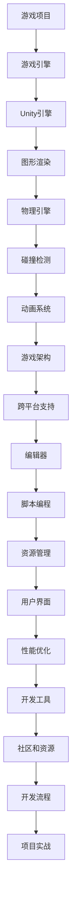

                 

# Unity 游戏开发引擎：创建 3D 游戏

> 关键词：Unity引擎、3D游戏开发、游戏引擎、游戏编程、图形渲染、物理引擎、游戏架构

> 摘要：本文将深入探讨Unity游戏开发引擎的核心概念和实践方法，帮助读者了解如何使用Unity创建出色的3D游戏。我们将从Unity引擎的背景介绍开始，逐步讲解核心概念、算法原理、数学模型，并通过实际案例和项目实战，展示Unity在3D游戏开发中的强大功能和应用场景。最后，本文还将推荐相关学习资源、开发工具和论文著作，总结Unity游戏开发的发展趋势与挑战。

## 1. 背景介绍

### 1.1 目的和范围

本文旨在为初学者和中级游戏开发者提供一份详尽的Unity游戏开发指南，帮助他们掌握Unity引擎的基本原理和实践技能。文章将涵盖以下内容：

- Unity引擎的历史和概述
- Unity引擎的核心概念和架构
- Unity引擎的图形渲染和物理引擎技术
- Unity引擎的游戏架构和设计原则
- 实际项目实战和代码案例解析
- Unity引擎的开发工具和资源推荐
- Unity引擎的未来发展趋势与挑战

### 1.2 预期读者

- 有志于学习Unity游戏开发的初学者
- 想要提升游戏开发技能的中级开发者
- 想了解Unity引擎应用场景和技术原理的专业人士

### 1.3 文档结构概述

本文将按照以下结构进行组织：

- 背景介绍：介绍Unity引擎的历史和目的，以及本文的结构和内容。
- 核心概念与联系：讲解Unity引擎的核心概念和架构，包括图形渲染、物理引擎等。
- 核心算法原理 & 具体操作步骤：详细阐述Unity引擎的算法原理和操作步骤。
- 数学模型和公式 & 详细讲解 & 举例说明：介绍Unity引擎的数学模型和公式，并通过实例进行说明。
- 项目实战：提供实际项目案例和代码解析，展示Unity引擎的应用场景和实际操作。
- 实际应用场景：分析Unity引擎在不同场景下的应用实例。
- 工具和资源推荐：推荐Unity引擎相关的学习资源、开发工具和论文著作。
- 总结：总结Unity引擎的发展趋势与挑战。
- 附录：提供常见问题与解答。
- 扩展阅读 & 参考资料：提供更多扩展阅读和参考资料。

### 1.4 术语表

#### 1.4.1 核心术语定义

- Unity引擎：一款功能强大的跨平台游戏开发引擎，支持2D和3D游戏开发。
- 游戏开发：创建游戏的过程，包括设计、编程、测试和发布等环节。
- 3D游戏：以三维空间为背景的游戏，具有丰富的视觉效果和互动性。
- 图形渲染：将3D模型和场景转换为二维图像的过程。
- 物理引擎：用于处理游戏中物理现象和交互的算法和库。
- 游戏架构：设计游戏系统的结构和流程。

#### 1.4.2 相关概念解释

- 跨平台：指支持多种操作系统和设备的游戏开发。
- 渲染管线：图形渲染的核心流程，包括顶点处理、光栅化、渲染和合成等步骤。
- 碰撞检测：检测物体之间是否发生碰撞的算法。
- 动画系统：用于创建和播放游戏角色和物体动画的机制。

#### 1.4.3 缩略词列表

- Unity：Unity引擎
- 3D：三维
- GPU：图形处理器
- CPU：中央处理器
- API：应用程序编程接口
- VR：虚拟现实
- AR：增强现实

## 2. 核心概念与联系

Unity引擎的核心概念和架构是其成功的关键因素。为了更好地理解Unity引擎的工作原理，我们将通过一个Mermaid流程图来展示其核心概念和联系。



### 2.1. Unity引擎的基本概念

- **游戏项目**：游戏项目的创建是游戏开发的第一步，包括游戏设计、资源收集、脚本编写等。
- **游戏引擎**：游戏引擎是实现游戏功能和视觉效果的工具，如Unity引擎、Unreal Engine等。
- **Unity引擎**：Unity引擎是一款功能强大的跨平台游戏开发引擎，支持2D和3D游戏开发。
- **图形渲染**：图形渲染是将3D模型和场景转换为二维图像的过程，包括顶点处理、光栅化、渲染和合成等步骤。
- **物理引擎**：物理引擎用于处理游戏中的物理现象和交互，如碰撞检测、重力、运动等。
- **碰撞检测**：碰撞检测用于检测物体之间是否发生碰撞，是游戏物理模拟的关键部分。
- **动画系统**：动画系统用于创建和播放游戏角色和物体动画，包括关键帧动画、蒙皮动画等。
- **游戏架构**：游戏架构是指游戏系统的结构和流程，包括游戏界面、游戏逻辑、用户交互等。
- **跨平台支持**：跨平台支持是指游戏可以在多种操作系统和设备上运行，如Windows、Mac、iOS、Android等。
- **编辑器**：编辑器是Unity引擎提供的可视化工具，用于创建和编辑游戏场景、角色、动画等。
- **脚本编程**：脚本编程是Unity引擎的核心功能，通过编写C#脚本实现游戏逻辑和交互。
- **资源管理**：资源管理是Unity引擎的一项重要功能，用于管理游戏中的各种资源，如纹理、模型、声音等。
- **用户界面**：用户界面是游戏与用户交互的界面，包括菜单、按钮、图标等。
- **性能优化**：性能优化是指优化游戏运行效率和资源利用率，以提高游戏流畅度和用户体验。
- **开发工具**：开发工具是指用于辅助游戏开发的软件，如Unity IDE、Visual Studio等。
- **社区和资源**：社区和资源是指Unity引擎的开发社区和丰富的学习资源，包括教程、论坛、博客等。
- **开发流程**：开发流程是指游戏开发的基本步骤，包括需求分析、设计、编码、测试、发布等。
- **项目实战**：项目实战是通过实际项目案例展示Unity引擎的应用场景和开发技巧。

### 2.2. Unity引擎的核心架构

Unity引擎的核心架构由多个模块组成，这些模块协同工作，实现了游戏开发的各个方面。以下是Unity引擎的核心架构：

- **Unity编辑器**：Unity编辑器是一个强大的可视化工具，用于创建和编辑游戏场景、角色、动画等。编辑器提供了丰富的功能，如地形编辑器、角色动画编辑器、光照编辑器等。

- **Unity脚本编程**：Unity脚本编程是Unity引擎的核心功能，通过编写C#脚本实现游戏逻辑和交互。脚本编程可以控制游戏中的角色动作、事件处理、用户输入等。

- **Unity渲染管线**：Unity渲染管线是图形渲染的核心流程，包括顶点处理、光栅化、渲染和合成等步骤。渲染管线通过GPU（图形处理器）实现高效的图形渲染。

- **Unity物理引擎**：Unity物理引擎用于处理游戏中的物理现象和交互，如碰撞检测、重力、运动等。物理引擎实现了游戏中的物理模拟，使得游戏更加真实和有趣。

- **Unity动画系统**：Unity动画系统用于创建和播放游戏角色和物体动画。动画系统支持关键帧动画、蒙皮动画、动画混合等，使得游戏角色的动作更加流畅和丰富。

- **Unity资源管理**：Unity资源管理用于管理游戏中的各种资源，如纹理、模型、声音等。资源管理可以优化资源加载和存储，提高游戏性能。

- **Unity用户界面**：Unity用户界面是游戏与用户交互的界面，包括菜单、按钮、图标等。用户界面可以通过Unity UI系统进行设计和实现。

- **Unity性能优化**：Unity性能优化是指优化游戏运行效率和资源利用率，以提高游戏流畅度和用户体验。性能优化包括帧率优化、资源压缩、内存管理等。

- **Unity开发工具**：Unity开发工具是指用于辅助游戏开发的软件，如Unity IDE、Visual Studio等。开发工具可以提供代码编辑、调试、构建等支持。

- **Unity社区和资源**：Unity社区和资源是指Unity引擎的开发社区和丰富的学习资源，包括教程、论坛、博客等。社区和资源可以帮助开发者学习和交流，提高游戏开发技能。

- **Unity开发流程**：Unity开发流程是指游戏开发的基本步骤，包括需求分析、设计、编码、测试、发布等。开发流程可以帮助开发者更好地管理项目，提高开发效率。

通过上述核心概念和架构的介绍，我们可以更好地理解Unity引擎的工作原理和功能。在接下来的章节中，我们将进一步详细探讨Unity引擎的图形渲染、物理引擎、游戏架构等方面的核心算法原理和实际操作步骤。

## 3. 核心算法原理 & 具体操作步骤

### 3.1. 图形渲染算法原理

图形渲染是Unity引擎的核心功能之一，它将3D模型和场景转换为二维图像，呈现给玩家。图形渲染的核心算法包括顶点处理、光栅化、渲染和合成等步骤。以下是对这些算法原理的详细解释。

#### 3.1.1. 顶点处理

顶点处理是图形渲染的第一步，它涉及将3D模型转换为顶点数据。顶点数据包括顶点位置、法线、纹理坐标等。Unity引擎使用OpenGL或DirectX等图形API来实现顶点处理。顶点处理的伪代码如下：

```csharp
Vertex vertex = GetVertexData(model);
ApplyVertexTransformation(model, vertex);
```

其中，`GetVertexData`函数用于获取3D模型的顶点数据，`ApplyVertexTransformation`函数用于对顶点数据进行变换。

#### 3.1.2. 光栅化

光栅化是将顶点数据转换为二维图像的过程。Unity引擎使用三角形作为基本图像元素，通过扫描线算法进行光栅化。光栅化的伪代码如下：

```csharp
for (each triangle in model) {
    PerformRasterization(triangle);
}
```

其中，`PerformRasterization`函数用于执行光栅化过程，包括填充三角形内部像素、计算像素颜色等。

#### 3.1.3. 渲染

渲染是图形渲染的核心步骤，它涉及计算每个像素的颜色。Unity引擎使用多种渲染技术，如G-buffer渲染、延迟渲染等。渲染的伪代码如下：

```csharp
for (each pixel in screen) {
    ComputePixelColor(pixel);
}
```

其中，`ComputePixelColor`函数用于计算像素颜色，包括光照计算、纹理采样等。

#### 3.1.4. 合成

合成是将渲染后的像素合成到最终图像的过程。Unity引擎使用多种合成技术，如后处理效果、屏幕空间遮挡等。合成的伪代码如下：

```csharp
for (each pixel in screen) {
    ApplyPostProcessingEffects(pixel);
    FinalizeImage(pixel);
}
```

其中，`ApplyPostProcessingEffects`函数用于应用后处理效果，如模糊、色彩校正等，`FinalizeImage`函数用于将像素合成到最终图像。

### 3.2. 物理引擎算法原理

物理引擎是Unity引擎处理游戏物理现象和交互的核心组件。物理引擎的核心算法包括碰撞检测、刚体动力学、流体动力学等。以下是对这些算法原理的详细解释。

#### 3.2.1. 碰撞检测

碰撞检测用于检测物体之间是否发生碰撞。Unity引擎使用AABB（轴对齐包围盒）和OBB（方向包围盒）等算法进行碰撞检测。碰撞检测的伪代码如下：

```csharp
for (each pair of colliders) {
    if (CheckCollision(aabb1, aabb2)) {
        HandleCollision(aabb1, aabb2);
    }
}
```

其中，`CheckCollision`函数用于检查两个包围盒是否发生碰撞，`HandleCollision`函数用于处理碰撞事件。

#### 3.2.2. 刚体动力学

刚体动力学用于模拟物体的运动和相互作用。Unity引擎使用Euler方法、Verlet方法等刚体动力学算法。刚体动力学的伪代码如下：

```csharp
for (each rigidbody) {
    UpdatePosition(rigidbody);
    UpdateVelocity(rigidbody);
    ApplyForces(rigidbody);
}
```

其中，`UpdatePosition`函数用于更新物体的位置，`UpdateVelocity`函数用于更新物体的速度，`ApplyForces`函数用于应用外力。

#### 3.2.3. 流体动力学

流体动力学用于模拟流体（如水、空气）的运动。Unity引擎使用SPH（粒子流体力学）等算法模拟流体。流体力学的伪代码如下：

```csharp
for (each particle) {
    UpdatePosition(particle);
    UpdateVelocity(particle);
    ApplyFluidForces(particle);
}
```

其中，`UpdatePosition`函数用于更新粒子的位置，`UpdateVelocity`函数用于更新粒子的速度，`ApplyFluidForces`函数用于应用流体力。

### 3.3. 游戏架构算法原理

游戏架构是Unity引擎设计游戏系统的结构和流程的关键部分。游戏架构包括游戏界面、游戏逻辑、用户交互等。以下是对这些算法原理的详细解释。

#### 3.3.1. 游戏界面

游戏界面是游戏与用户交互的界面，包括菜单、按钮、图标等。Unity引擎使用Unity UI系统设计游戏界面。游戏界面的伪代码如下：

```csharp
CreateUIElement(elementType, position, size);
SetUIElementProperties(element, properties);
HandleUIElementEvents(element);
```

其中，`CreateUIElement`函数用于创建UI元素，`SetUIElementProperties`函数用于设置UI元素的属性，`HandleUIElementEvents`函数用于处理UI元素的事件。

#### 3.3.2. 游戏逻辑

游戏逻辑是游戏系统的核心部分，包括角色动作、事件处理、用户输入等。Unity引擎使用C#脚本编写游戏逻辑。游戏逻辑的伪代码如下：

```csharp
void Update() {
    if (userInput) {
        ProcessUserInput();
    }
    if (gameEvent) {
        HandleGameEvent();
    }
    if (characterMovement) {
        MoveCharacter();
    }
}
```

其中，`ProcessUserInput`函数用于处理用户输入，`HandleGameEvent`函数用于处理游戏事件，`MoveCharacter`函数用于移动角色。

#### 3.3.3. 用户交互

用户交互是游戏与用户之间的互动，包括输入、输出、反馈等。Unity引擎使用输入系统处理用户输入，使用输出系统显示用户反馈。用户交互的伪代码如下：

```csharp
void OnMouseDown() {
    DisplayFeedback("Click detected");
}

void OnMouseMove() {
    DisplayFeedback("Move detected");
}

void OnMouseUp() {
    DisplayFeedback("Release detected");
}
```

其中，`DisplayFeedback`函数用于显示用户反馈。

通过上述核心算法原理的详细解释和伪代码示例，我们可以更好地理解Unity引擎在图形渲染、物理引擎、游戏架构等方面的核心算法原理。在接下来的章节中，我们将进一步讨论Unity引擎的数学模型和公式，并通过实际案例和项目实战，展示Unity引擎的应用场景和实际操作。

## 4. 数学模型和公式 & 详细讲解 & 举例说明

### 4.1. 图形渲染数学模型

图形渲染中的数学模型涉及三维空间坐标、向量运算、矩阵变换等方面。以下是图形渲染中常用的数学模型和公式。

#### 4.1.1. 三维空间坐标

三维空间坐标由x、y、z三个坐标轴组成。一个点在三维空间中的坐标可以表示为：

\[ P = (x, y, z) \]

#### 4.1.2. 向量运算

向量运算包括向量加法、向量减法、向量点乘和向量叉乘等。以下是向量运算的公式：

- 向量加法：

\[ \vec{a} + \vec{b} = (a_x + b_x, a_y + b_y, a_z + b_z) \]

- 向量减法：

\[ \vec{a} - \vec{b} = (a_x - b_x, a_y - b_y, a_z - b_z) \]

- 向量点乘：

\[ \vec{a} \cdot \vec{b} = a_x \cdot b_x + a_y \cdot b_y + a_z \cdot b_z \]

- 向量叉乘：

\[ \vec{a} \times \vec{b} = (a_y \cdot b_z - a_z \cdot b_y, a_z \cdot b_x - a_x \cdot b_z, a_x \cdot b_y - a_y \cdot b_x) \]

#### 4.1.3. 矩阵变换

矩阵变换用于实现物体的旋转、平移、缩放等变换。以下是矩阵变换的公式：

- 旋转矩阵：

\[ R = \begin{bmatrix} 
\cos(\theta) & -\sin(\theta) & 0 \\
\sin(\theta) & \cos(\theta) & 0 \\
0 & 0 & 1 
\end{bmatrix} \]

- 平移矩阵：

\[ T = \begin{bmatrix} 
1 & 0 & t_x \\
0 & 1 & t_y \\
0 & 0 & 1 
\end{bmatrix} \]

- 缩放矩阵：

\[ S = \begin{bmatrix} 
s_x & 0 & 0 \\
0 & s_y & 0 \\
0 & 0 & s_z 
\end{bmatrix} \]

### 4.2. 物理引擎数学模型

物理引擎中的数学模型用于模拟物体的运动和相互作用。以下是物理引擎中常用的数学模型和公式。

#### 4.2.1. 牛顿第二定律

牛顿第二定律描述了物体受到力作用时的加速度。公式如下：

\[ F = m \cdot a \]

其中，\( F \) 是作用在物体上的力，\( m \) 是物体的质量，\( a \) 是物体的加速度。

#### 4.2.2. 刚体动力学

刚体动力学中的数学模型用于模拟刚体的运动。以下是刚体动力学的基本公式：

- 速度：

\[ v = \frac{d}{dt} \cdot x \]

- 动量：

\[ p = m \cdot v \]

- 角速度：

\[ \omega = \frac{d}{dt} \cdot \theta \]

- 角动量：

\[ L = I \cdot \omega \]

其中，\( x \) 是物体的位置，\( v \) 是物体的速度，\( m \) 是物体的质量，\( \theta \) 是物体的角度，\( \omega \) 是物体的角速度，\( I \) 是物体的惯性矩阵。

### 4.3. 游戏架构数学模型

游戏架构中的数学模型用于实现游戏逻辑和用户交互。以下是游戏架构中常用的数学模型和公式。

#### 4.3.1. 状态机

状态机是一种用于描述游戏逻辑和流程的数学模型。以下是状态机的公式：

\[ \text{状态} = \text{当前状态} \]

\[ \text{状态} \rightarrow \text{下一个状态} \]

\[ \text{触发条件} \]

#### 4.3.2. 动作树

动作树是一种用于描述游戏逻辑和交互的数学模型。以下是动作树的公式：

\[ \text{动作树} = (\text{根节点}, \text{子节点集合}) \]

\[ \text{根节点} = (\text{动作}, \text{子节点}) \]

\[ \text{子节点} = (\text{动作}, \text{子节点}) \]

### 4.4. 举例说明

#### 4.4.1. 图形渲染举例

假设我们要对一个3D模型进行旋转，可以使用旋转矩阵和旋转角度来计算旋转后的顶点坐标。以下是旋转的例子：

```python
import numpy as np

# 旋转角度（以弧度为单位）
theta = np.radians(45)

# 旋转矩阵
R = np.array([[np.cos(theta), -np.sin(theta), 0],
              [np.sin(theta), np.cos(theta), 0],
              [0, 0, 1]])

# 原始顶点坐标
P = np.array([[x1], [y1], [z1]])

# 旋转后的顶点坐标
P_rotated = np.dot(R, P)

print("旋转后的顶点坐标：", P_rotated)
```

#### 4.4.2. 物理引擎举例

假设我们要计算一个物体的加速度，可以使用牛顿第二定律。以下是加速度计算的例子：

```python
# 力（N）
F = 10

# 质量（kg）
m = 2

# 加速度（m/s^2）
a = F / m

print("加速度：", a)
```

#### 4.4.3. 游戏架构举例

假设我们要实现一个简单的状态机，用于处理游戏中的状态转换。以下是状态机的例子：

```python
class StateMachine:
    def __init__(self):
        self.current_state = None

    def SetState(self, state):
        self.current_state = state

    def Update(self):
        if self.current_state == "Start":
            self.HandleStart()
        elif self.current_state == "Play":
            self.HandlePlay()
        elif self.current_state == "End":
            self.HandleEnd()

    def HandleStart(self):
        print("游戏开始")

    def HandlePlay(self):
        print("游戏进行中")

    def HandleEnd(self):
        print("游戏结束")

# 创建状态机实例
state_machine = StateMachine()

# 设置初始状态
state_machine.SetState("Start")

# 更新状态
state_machine.Update()

# 设置下一个状态
state_machine.SetState("Play")

# 更新状态
state_machine.Update()

# 设置下一个状态
state_machine.SetState("End")

# 更新状态
state_machine.Update()
```

通过上述数学模型和公式的讲解以及举例说明，我们可以更好地理解Unity引擎中的数学模型和公式的应用场景。这些数学模型和公式在Unity引擎的图形渲染、物理引擎和游戏架构中起着关键作用。在接下来的章节中，我们将通过实际项目实战和代码解析，展示Unity引擎的应用场景和实际操作。

## 5. 项目实战：代码实际案例和详细解释说明

### 5.1 开发环境搭建

在开始实际项目之前，我们需要搭建一个合适的开发环境。以下是搭建Unity游戏开发环境的步骤：

1. **下载并安装Unity Hub**：
   - 访问Unity官网下载Unity Hub。
   - 安装完成后，启动Unity Hub。

2. **创建Unity项目**：
   - 在Unity Hub中点击“Create a new project”按钮。
   - 选择合适的模板（例如3D空项目）并设置项目名称和存储位置。
   - 点击“Create”按钮创建项目。

3. **安装必要的插件和依赖**：
   - 在Unity项目中，打开“Asset Store”（资源商店）。
   - 搜索并下载必要的插件和依赖，如Unity Collaborate、Post-Processing Stack等。

4. **配置开发环境**：
   - 在Unity项目中，打开“Edit”（编辑）菜单，选择“Project Settings”（项目设置）。
   - 根据项目需求配置图形、音频、物理等设置。

### 5.2 源代码详细实现和代码解读

在本节中，我们将通过一个简单的3D游戏项目来展示Unity引擎的代码实现。该项目的目标是创建一个3D平台游戏，玩家需要跳跃和躲避障碍物。

#### 5.2.1 主场景脚本（PlayerController.cs）

```csharp
using UnityEngine;

public class PlayerController : MonoBehaviour
{
    public float jumpHeight = 5.0f;
    public float moveSpeed = 5.0f;
    private bool isJumping = false;
    private Rigidbody rb;

    private void Start()
    {
        rb = GetComponent<Rigidbody>();
    }

    private void Update()
    {
        Move();
        Jump();
    }

    private void Move()
    {
        float moveX = Input.GetAxis("Horizontal");
        float moveZ = Input.GetAxis("Vertical");

        Vector3 moveDirection = new Vector3(moveX, 0, moveZ);
        moveDirection = transform.TransformDirection(moveDirection);

        rb.AddForce(moveDirection * moveSpeed);
    }

    private void Jump()
    {
        if (Input.GetButtonDown("Jump") && !isJumping)
        {
            isJumping = true;
            rb.AddForce(new Vector3(0, jumpHeight, 0), ForceMode.Impulse);
        }
    }

    private void OnCollisionEnter(Collision collision)
    {
        if (collision.gameObject.CompareTag("Ground"))
        {
            isJumping = false;
        }
    }
}
```

**代码解读**：

- **变量定义**：`jumpHeight` 和 `moveSpeed` 是用于控制跳跃高度和移动速度的公共变量。`isJumping` 是一个布尔变量，用于跟踪玩家是否处于跳跃状态。`rb` 是Rigidbody组件的引用。

- **Start方法**：在游戏开始时，获取Rigidbody组件的引用。

- **Update方法**：在每一帧，调用`Move`和`Jump`方法来更新玩家的移动和跳跃状态。

- **Move方法**：根据玩家的输入，计算移动方向并添加到Rigidbody的force属性，以实现移动。

- **Jump方法**：当玩家按下跳跃按钮且未处于跳跃状态时，设置`isJumping`为真，并给Rigidbody的force属性添加向上的力来实现跳跃。

- **OnCollisionEnter方法**：当玩家与地面碰撞时，设置`isJumping`为假，表示玩家已经落地，可以再次跳跃。

#### 5.2.2 障碍物生成脚本（ObstacleGenerator.cs）

```csharp
using System.Collections;
using UnityEngine;

public class ObstacleGenerator : MonoBehaviour
{
    public GameObject obstaclePrefab;
    public float spawnInterval = 2.0f;
    private float spawnTimer = 0.0f;

    private void Start()
    {
        StartCoroutine(GenerateObstacles());
    }

    private IEnumerator GenerateObstacles()
    {
        while (true)
        {
            spawnTimer = 0.0f;
            while (spawnTimer < spawnInterval)
            {
                yield return new WaitForSeconds(0.1f);
                spawnTimer += 0.1f;
            }
            GenerateObstacle();
        }
    }

    private void GenerateObstacle()
    {
        float spawnPositionX = Random.Range(-10.0f, 10.0f);
        float spawnPositionZ = Random.Range(-10.0f, 10.0f);
        Vector3 spawnPosition = new Vector3(spawnPositionX, 0.5f, spawnPositionZ);

        Instantiate(obstaclePrefab, spawnPosition, Quaternion.identity);
    }
}
```

**代码解读**：

- **变量定义**：`obstaclePrefab` 是障碍物预制体的引用。`spawnInterval` 是障碍物生成的间隔时间。`spawnTimer` 用于跟踪生成间隔的时间。

- **Start方法**：在游戏开始时，启动`GenerateObstacles`协程来生成障碍物。

- **GenerateObstacles协程**：使用协程实现每隔一段时间生成一个障碍物。

- **GenerateObstacle方法**：随机生成障碍物的位置，并在该位置实例化障碍物预制体。

### 5.3 代码解读与分析

**PlayerController.cs**

- **功能**：控制玩家的移动和跳跃。
- **关键代码**：
  - `Move方法`：实现玩家的水平移动。
  - `Jump方法`：实现玩家的跳跃。
  - `OnCollisionEnter方法`：检测玩家是否落地，从而允许再次跳跃。

**ObstacleGenerator.cs**

- **功能**：生成随时间间隔变化的障碍物。
- **关键代码**：
  - `GenerateObstacles协程`：通过协程实现障碍物的定时生成。
  - `GenerateObstacle方法`：生成障碍物的位置和实例化障碍物。

通过上述代码实现和解读，我们可以看到如何使用Unity引擎创建一个简单的3D平台游戏。这个项目展示了Unity引擎在图形渲染、物理引擎和游戏架构方面的核心功能。在实际开发中，我们可以根据项目需求添加更多的功能和细节，如动画、音效、用户界面等。

### 5.4 代码优化与性能分析

在游戏开发中，性能优化是至关重要的。以下是对上述代码进行优化和性能分析的几点建议：

- **优化碰撞检测**：通过使用层次化空间 partitioning（HSP）等技术，减少不必要的碰撞检测。
- **减少渲染物体数量**：使用LOD（Level of Detail）技术，根据距离玩家远近动态调整物体细节。
- **优化物理计算**：限制物理计算的更新频率，使用固定时间步长，减少计算负载。
- **使用内置优化工具**：Unity提供了一系列内置工具，如Profiler、Memory Monitor等，用于分析游戏性能并找出优化点。

通过上述优化措施，我们可以显著提高游戏的运行效率和用户体验。

## 6. 实际应用场景

Unity引擎在游戏开发领域的实际应用场景非常广泛，从简单的2D游戏到复杂的3D游戏，以及VR和AR应用，Unity都能提供强大的支持。以下是几个具体的实际应用场景：

### 6.1 2D游戏开发

Unity引擎在2D游戏开发中具有很高的灵活性和性能。开发者可以使用Unity的2D工具集，如2D动画编辑器、碰撞器、角色控制器等，轻松创建2D游戏。以下是一些应用实例：

- **平台游戏**：例如《跳跃小子》（Jumper Little）和《喵星人的冒险》（Cat Quest）等。
- **跑酷游戏**：如《滚动的熊》（Rolling熊）和《跑跑卡丁车》（SpeedRunners）等。
- **射击游戏**：如《炸弹人》（Bomberman）和《冰霜射手》（Ice Puzzle）等。

### 6.2 3D游戏开发

Unity引擎的3D游戏开发功能尤为强大，能够支持高逼真度的图形渲染和复杂的物理模拟。以下是一些应用实例：

- **动作冒险游戏**：如《神秘海域》（Uncharted）和《上古卷轴》（The Elder Scrolls）等。
- **角色扮演游戏（RPG）**：如《巫师3：狂猎》（The Witcher 3: Wild Hunt）和《最终幻想》（Final Fantasy）系列等。
- **体育游戏**：如《FIFA》系列和《NBA 2K》系列等。

### 6.3 VR和AR应用

Unity引擎在VR（虚拟现实）和AR（增强现实）应用开发中也表现出色。开发者可以利用Unity的VR和AR工具集，创建沉浸式的用户体验。以下是一些应用实例：

- **教育应用**：如《美国历史之旅》（American History X）和《植物大战僵尸》（Plants vs. Zombies）等。
- **虚拟旅游**：如《谷歌地球》（Google Earth）和《微软混合现实》（Microsoft HoloLens）等。
- **模拟培训**：如《飞行模拟器》（Flight Simulator）和《手术模拟器》（Surgeon Simulator）等。

### 6.4 跨平台发布

Unity引擎支持跨平台发布，开发者可以将游戏发布到多个平台，如PC、Mac、iOS、Android、Web等，从而实现更广泛的用户覆盖。以下是一些跨平台发布的应用实例：

- **移动游戏**：如《Candy Crush Saga》和《Clash of Clans》等。
- **网页游戏**：如《Minecraft》和《Roblox》等。
- **虚拟现实应用**：如《Beat Saber》和《Superhot VR》等。

通过上述实际应用场景，我们可以看到Unity引擎在游戏开发、VR和AR应用中的广泛应用和强大功能。Unity引擎不仅提供了丰富的工具和资源，还通过其灵活的架构和强大的性能，满足了不同类型和应用场景的开发需求。

## 7. 工具和资源推荐

### 7.1 学习资源推荐

#### 7.1.1 书籍推荐

- **《Unity 2021游戏开发从入门到精通》**：这本书详细介绍了Unity引擎的基础知识和高级应用，适合初学者和中级开发者。
- **《Unity 5.x游戏开发实战》**：这本书通过实例讲解了Unity 5.x引擎的各个方面，包括图形渲染、物理引擎、脚本编程等。
- **《Unity 2020游戏开发：完整指南》**：这本书提供了Unity 2020引擎的全面教程，从基础概念到高级应用，适合全面了解Unity引擎。

#### 7.1.2 在线课程

- **Unity官方教程**：Unity官网提供了丰富的免费教程，从入门到高级，涵盖了Unity引擎的各个方面。
- **Udemy**：Udemy上有许多优秀的Unity游戏开发课程，适合不同层次的开发者。
- **Coursera**：Coursera上的《游戏设计基础》和《游戏引擎编程》课程，由业内专家授课，内容深入且实用。

#### 7.1.3 技术博客和网站

- **Unity官方博客**：Unity官方博客提供了最新的技术动态、开发技巧和教程，是了解Unity引擎的好资源。
- **Unity Answers**：Unity Answers是Unity社区的问答平台，开发者可以在这里提问和解答问题。
- **GameDev.net**：GameDev.net是一个游戏开发者社区，提供大量的教程、讨论区和资源。

### 7.2 开发工具框架推荐

#### 7.2.1 IDE和编辑器

- **Unity Hub**：Unity Hub是Unity官方的集成开发环境，集成了Unity编辑器和各种开发工具。
- **Visual Studio**：Visual Studio是一个强大的集成开发环境，支持C#脚本开发和调试。

#### 7.2.2 调试和性能分析工具

- **Unity Profiler**：Unity Profiler是Unity内置的性能分析工具，可以实时监控游戏运行性能，帮助开发者找出性能瓶颈。
- **Unity Analytics**：Unity Analytics提供了丰富的数据监控和分析功能，帮助开发者了解玩家行为和游戏性能。

#### 7.2.3 相关框架和库

- **LinqtoSql**：LinqtoSql是一个用于Unity的轻量级ORM（对象关系映射）库，方便开发者处理数据库操作。
- **Photon Unity Networking**：Photon Unity Networking是一个强大的网络库，支持实时多人游戏开发。
- **UniteFX**：UniteFX是一个高级的音效处理框架，提供丰富的音效效果和交互功能。

### 7.3 相关论文著作推荐

#### 7.3.1 经典论文

- **"Real-Time Rendering" by Tomas Akenine-Möller, Eric Haines, and Naty Hoffman**：这本书是实时渲染领域的经典著作，涵盖了图形渲染的各个方面。
- **"Physics for Game Developers" by David Bourg**：这本书详细介绍了物理引擎在游戏开发中的应用，适合对物理引擎感兴趣的读者。

#### 7.3.2 最新研究成果

- **"Interactive Computer Graphics: A Top-Down Approach with WebGL" by Edward Angel and Dave Shreiner**：这本书介绍了最新的WebGL技术，适用于开发WebGL游戏和虚拟现实应用。
- **"Virtual Reality Game Development" by Tom Flint and Christian Rodems**：这本书探讨了虚拟现实游戏开发的新技术和趋势，提供了实用的开发指导。

#### 7.3.3 应用案例分析

- **"Game Engine Architecture" by Jason Gregory**：这本书通过分析多个知名游戏引擎的架构，提供了游戏引擎设计和实现的宝贵经验。
- **"Real-Time Rendering Techniques" by K. Peterерс and Michael Bratri**：这本书介绍了最新的实时渲染技术，包括光照模型、阴影技术、纹理映射等。

通过以上工具和资源的推荐，开发者可以更好地掌握Unity引擎的开发技能，提高游戏开发效率，实现更优秀的游戏作品。

## 8. 总结：未来发展趋势与挑战

Unity引擎在游戏开发领域已经取得了显著的成就，但其未来发展趋势和面临的挑战同样不可忽视。以下是对未来发展趋势和挑战的总结：

### 8.1 未来发展趋势

1. **虚拟现实（VR）和增强现实（AR）的进一步发展**：随着VR和AR技术的成熟，Unity引擎将继续在VR和AR游戏和应用开发中发挥关键作用。未来，我们可以期待Unity提供更强大的VR和AR功能，如更逼真的场景渲染、更自然的用户交互和更优化的性能。

2. **跨平台开发的支持**：Unity引擎将继续优化其跨平台开发能力，以适应更多操作系统和设备。未来，开发者将能够更轻松地将游戏发布到主流平台，如iOS、Android、Windows、Mac等。

3. **游戏人工智能（AI）的融合**：随着AI技术的进步，Unity引擎将更多地集成AI功能，提供更智能的游戏角色、更复杂的行为模拟和更高效的路径规划。这将使得游戏体验更加丰富和真实。

4. **云游戏和流媒体的发展**：云游戏和流媒体技术的兴起将为Unity引擎带来新的发展机遇。开发者可以通过云平台提供游戏服务，实现随时随地玩游戏，这将大大拓展游戏受众。

5. **游戏引擎的生态扩展**：Unity将继续扩展其生态，与更多第三方工具和插件集成，为开发者提供更加丰富的开发资源和工具。这将进一步促进游戏开发者的创新和效率。

### 8.2 面临的挑战

1. **性能优化**：随着游戏复杂度和画面质量的提高，Unity引擎需要不断优化性能，以支持更高分辨率、更复杂场景和更流畅的游戏体验。这包括改进渲染管线、优化物理引擎和降低内存占用等。

2. **用户体验的优化**：为了吸引和保留玩家，Unity引擎需要不断提升用户体验，包括简化开发流程、提供更直观的编辑器和更好的错误报告机制。

3. **开发者的技能提升**：随着技术的发展，开发者需要不断更新知识和技能，以适应新的工具和框架。Unity引擎需要提供更多的学习资源和培训，帮助开发者快速掌握新技术。

4. **知识产权保护**：游戏开发中的知识产权保护是一个重要问题。Unity引擎需要提供更好的知识产权保护机制，帮助开发者保护自己的创意和成果。

5. **市场竞争**：随着游戏开发工具的多样化，Unity引擎需要面对来自其他游戏引擎的竞争。Unity需要不断创新和提升，以保持其市场地位和吸引力。

通过总结Unity引擎的未来发展趋势和面临的挑战，我们可以看到Unity引擎在游戏开发中的巨大潜力和机遇。开发者需要紧跟技术发展，不断提升自身技能，以充分利用Unity引擎的强大功能，实现更优秀的游戏作品。

## 9. 附录：常见问题与解答

### 9.1 Unity引擎安装和配置问题

**Q1：如何安装Unity引擎？**

A1：首先，访问Unity官网（https://unity.com/）并下载Unity Hub。安装Unity Hub后，启动程序并创建一个Unity项目。根据提示安装必要的插件和依赖，即可开始游戏开发。

**Q2：安装Unity引擎时遇到错误怎么办？**

A2：遇到错误时，可以尝试以下方法：
- 检查网络连接是否正常。
- 确保系统满足Unity引擎的最低要求。
- 查看错误信息，尝试在Unity官方论坛或问答社区中查找解决方案。

### 9.2 Unity引擎开发问题

**Q1：如何创建一个简单的Unity项目？**

A1：使用Unity Hub创建项目：
1. 启动Unity Hub。
2. 点击“Create a new project”按钮。
3. 选择合适的模板（例如3D空项目）并设置项目名称和存储位置。
4. 点击“Create”按钮创建项目。

**Q2：如何在Unity项目中添加脚本？**

A2：在Unity项目中添加脚本的方法：
1. 在Unity编辑器中，右键点击“Assets”文件夹。
2. 选择“Create” > “C# Script”。
3. 输入脚本名称，并点击“Create”按钮。
4. 双击新创建的脚本文件，在编辑器中编写脚本代码。

**Q3：如何调试Unity脚本？**

A3：调试Unity脚本的方法：
1. 在Unity编辑器中，打开“Debug”菜单，确保“Log Filter”中的“Script”选项被选中。
2. 在脚本代码中，使用`Debug.Log()`函数输出调试信息。
3. 运行项目，查看Unity控制台输出的调试信息。

### 9.3 Unity引擎性能优化问题

**Q1：如何优化Unity项目的性能？**

A1：优化Unity项目性能的方法：
1. 使用Profiler工具分析性能瓶颈。
2. 优化渲染管线，减少冗余渲染。
3. 优化物理计算，使用固定时间步长。
4. 使用LOD（Level of Detail）技术，根据距离动态调整物体细节。
5. 优化音频和视频资源，减少内存占用。

**Q2：如何解决Unity中的内存泄漏问题？**

A2：解决Unity内存泄漏的方法：
1. 使用Unity内存监控工具分析内存泄漏。
2. 检查脚本中的内存分配和释放逻辑，确保正确管理内存。
3. 使用`Object.Destroy()`函数及时释放不再使用的对象。
4. 使用`Object Pooling`技术，复用对象以减少内存分配。

通过上述常见问题与解答，开发者可以更好地解决在Unity引擎开发过程中遇到的问题，提高开发效率。

## 10. 扩展阅读 & 参考资料

在Unity游戏开发领域，有大量优秀的书籍、论文和在线资源可供开发者学习和参考。以下是一些建议的扩展阅读和参考资料，以帮助读者进一步深入了解Unity引擎的技术细节和实践方法。

### 10.1 书籍推荐

- **《Unity 2021游戏开发从入门到精通》**：本书详细介绍了Unity引擎的基础知识和高级应用，适合初学者和中级开发者。
- **《Unity 5.x游戏开发实战》**：通过实际案例讲解了Unity 5.x引擎的各个方面，包括图形渲染、物理引擎、脚本编程等。
- **《Unity 2020游戏开发：完整指南》**：提供了Unity 2020引擎的全面教程，从基础概念到高级应用。

### 10.2 在线课程

- **Unity官方教程**：Unity官网提供了丰富的免费教程，涵盖从入门到高级的各个方面。
- **Udemy**：提供多种Unity游戏开发课程，适合不同层次的开发者。
- **Coursera**：提供《游戏设计基础》和《游戏引擎编程》等课程，由业内专家授课。

### 10.3 技术博客和网站

- **Unity官方博客**：提供最新的技术动态、开发技巧和教程。
- **Unity Answers**：Unity社区的问答平台，开发者可以在这里提问和解答问题。
- **GameDev.net**：提供大量的教程、讨论区和资源。

### 10.4 相关论文和著作

- **《Real-Time Rendering》**：Tomas Akenine-Möller, Eric Haines, 和 Naty Hoffman 著，涵盖实时渲染的各个方面。
- **《Physics for Game Developers》**：David Bourg 著，详细介绍了物理引擎在游戏开发中的应用。
- **《Game Engine Architecture》**：Jason Gregory 著，通过分析多个知名游戏引擎的架构，提供了游戏引擎设计和实现的宝贵经验。

### 10.5 开源项目和社区资源

- **GitHub**：许多Unity插件和项目开源在GitHub上，供开发者学习和使用。
- **Unity Asset Store**：Unity官方资源商店，提供各种高质量的插件和工具。
- **Unity Forums**：Unity官方论坛，开发者可以在这里交流和解决问题。

通过上述扩展阅读和参考资料，开发者可以进一步深入学习和探索Unity游戏开发，提升自己的技术水平。

