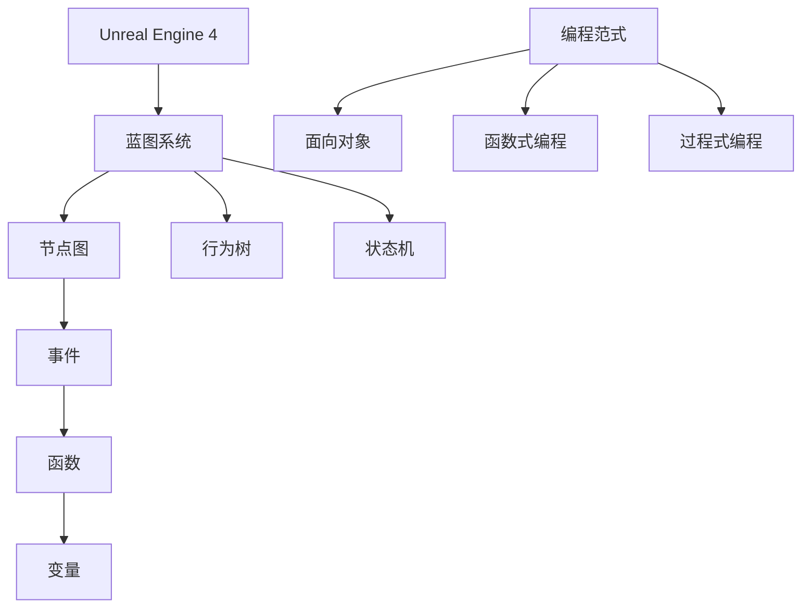

                 

# Unreal Engine 4：蓝图视觉化编程

> **关键词：** Unreal Engine 4, 蓝图系统，视觉化编程，游戏开发，游戏引擎，编程基础，游戏设计

> **摘要：** 本文将深入探讨Unreal Engine 4中的蓝图系统，这是一种无需编写传统代码的视觉化编程方式。我们将从基础概念出发，逐步讲解其核心原理和应用，并通过实际案例帮助读者理解并掌握这种强大且直观的编程技术。

## 1. 背景介绍

### 1.1 目的和范围

本文旨在为对游戏开发或Unreal Engine 4（简称UE4）感兴趣的读者提供一个全面而详细的蓝图系统介绍。我们将探讨蓝图系统的基本原理、实现细节以及其实际应用。本文将覆盖从入门到进阶的知识点，适合不同水平的读者。

### 1.2 预期读者

- 初学者：希望通过视觉化编程快速上手UE4的开发者。
- 进阶开发者：希望深入了解UE4内部机制的程序员。
- 游戏设计师：希望提升游戏设计和实现效率的专业人士。
- 计算机科学学生：对游戏引擎编程和计算机图形学感兴趣的学生。

### 1.3 文档结构概述

本文分为以下章节：

1. 背景介绍：本文的背景、目的、预期读者以及文档结构概述。
2. 核心概念与联系：蓝图系统的核心概念及其相互关系。
3. 核心算法原理 & 具体操作步骤：详细讲解蓝图系统的算法原理和操作步骤。
4. 数学模型和公式 & 详细讲解 & 举例说明：涉及到的数学模型和公式，并进行实例分析。
5. 项目实战：代码实际案例和详细解释说明。
6. 实际应用场景：蓝图系统的实际应用场景和案例。
7. 工具和资源推荐：学习资源和开发工具推荐。
8. 总结：未来发展趋势与挑战。
9. 附录：常见问题与解答。
10. 扩展阅读 & 参考资料：进一步学习的资源。

### 1.4 术语表

#### 1.4.1 核心术语定义

- **Unreal Engine 4 (UE4)：** 一种高端游戏引擎，广泛应用于游戏开发、影视制作和模拟仿真等领域。
- **蓝图系统 (Blueprint System)：** UE4提供的一种视觉化编程工具，允许开发者通过节点图来创建逻辑和行为，而无需编写代码。
- **节点图 (Node Graph)：** 蓝图系统中的核心概念，表示程序流程和逻辑关系的图形界面。
- **事件（Event）：** 节点图中表示事件触发的节点，如“On Mouse Click”。
- **函数（Function）：** 节点图中表示功能操作的节点，如“Add Integer”。
- **变量（Variable）：** 在节点图中使用的可修改的数据存储单元。

#### 1.4.2 相关概念解释

- **行为树 (Behavior Tree)：** 一种用于定义复杂行为的编程模式，常用于游戏AI开发。
- **状态机 (State Machine)：** 用于描述系统状态的转换和行为的编程模式。
- **编程范式 (Programming Paradigm)：** 编程语言的特定编程风格或方法，如面向对象编程、函数式编程等。

#### 1.4.3 缩略词列表

- **UE4：** Unreal Engine 4
- **UE：** Unreal Engine
- **蓝图：** 蓝图系统
- **视觉化编程：** Visually Programming

## 2. 核心概念与联系

为了更好地理解蓝图系统的核心概念，我们需要绘制一个Mermaid流程图来展示各个核心概念及其相互关系。



### 2.1 节点图

节点图是蓝图系统中最核心的概念。它是一种图形化界面，允许开发者通过拖放节点和连接线来定义程序的逻辑流程。节点图不仅直观易用，而且非常适合非程序员快速上手。

### 2.2 事件

事件是节点图中用于触发特定操作的节点。例如，“On Mouse Click”事件会在用户点击鼠标时触发相应的操作。事件是编程中常见的概念，但在蓝图系统中，它们被图形化地表示，使得开发者可以无需代码即可创建复杂的逻辑。

### 2.3 函数

函数是蓝图系统中的功能操作节点。开发者可以使用内置函数或自定义函数来执行特定的计算或操作。例如，“Add Integer”函数用于将两个整数相加。

### 2.4 变量

变量是蓝图系统中用于存储和修改数据的节点。开发者可以在节点图中定义和使用各种类型的变量，如整数、浮点数、字符串等。

### 2.5 行为树

行为树是一种用于定义复杂行为的编程模式。在蓝图系统中，行为树可以帮助开发者组织复杂的逻辑和行为，使其更加清晰和易于管理。

### 2.6 状态机

状态机是另一种用于描述系统状态的编程模式。在蓝图系统中，状态机可以用于实现游戏中的角色行为或场景逻辑。

### 2.7 编程范式

编程范式是编程语言的特定编程风格或方法。蓝图系统支持多种编程范式，如面向对象编程、函数式编程和过程式编程，使得开发者可以根据需求选择最适合的编程方式。

## 3. 核心算法原理 & 具体操作步骤

蓝图系统的核心算法原理在于其基于图论的数据结构。下面，我们将通过伪代码来详细阐述蓝图系统的核心算法原理和操作步骤。

### 3.1 蓝图系统核心算法原理

```python
class BlueprintNode:
    def __init__(self, type, inputs=[], outputs=[]):
        self.type = type
        self.inputs = inputs
        self.outputs = outputs
        self.connected_nodes = []

    def connect(self, node):
        self.connected_nodes.append(node)
        node.connected_nodes.append(self)

    def execute(self):
        if self.type == 'event':
            for node in self.connected_nodes:
                node.execute()
        elif self.type == 'function':
            result = self.execute_function()
            for node in self.connected_nodes:
                node.receive_input(result)

    def execute_function(self):
        # 执行函数操作
        pass

    def receive_input(self, input_value):
        # 接收输入值并传递给下一个节点
        pass

class BlueprintSystem:
    def __init__(self):
        self.nodes = []

    def add_node(self, node):
        self.nodes.append(node)

    def execute(self):
        for node in self.nodes:
            node.execute()
```

### 3.2 具体操作步骤

1. **创建节点：** 根据需要定义不同类型的节点，如事件节点、函数节点和变量节点。
2. **连接节点：** 通过连接线将不同节点连接起来，形成程序逻辑的流程。
3. **执行节点：** 从事件节点开始，依次执行每个节点的操作。
4. **输入输出：** 在节点之间传递输入值和输出结果。

通过以上步骤，开发者可以使用蓝图系统创建复杂的逻辑和行为，而无需编写传统代码。

## 4. 数学模型和公式 & 详细讲解 & 举例说明

蓝图系统中的许多操作都涉及到数学模型和公式。以下是几个常用的数学模型和公式的详细讲解以及举例说明。

### 4.1 线性代数

#### 4.1.1 向量运算

向量运算在蓝图系统中广泛应用。以下是一个简单的向量运算公式：

$$
\vec{v} = \vec{u} + \vec{w}
$$

其中，$\vec{u}$ 和 $\vec{w}$ 是向量，$\vec{v}$ 是结果向量。

#### 4.1.2 例子

假设 $\vec{u} = (1, 2)$，$\vec{w} = (3, 4)$，则：

$$
\vec{v} = \vec{u} + \vec{w} = (1 + 3, 2 + 4) = (4, 6)
$$

### 4.2 三角函数

三角函数在蓝图系统中用于实现旋转和动画效果。以下是一个常用的三角函数公式：

$$
\sin(\theta) = \frac{opposite}{hypotenuse}
$$

其中，$\theta$ 是角度，$opposite$ 是对边，$hypotenuse$ 是斜边。

#### 4.2.2 例子

假设 $\theta = 30^\circ$，$opposite = 3$，$hypotenuse = 5$，则：

$$
\sin(30^\circ) = \frac{3}{5} = 0.6
$$

### 4.3 矩阵运算

矩阵运算在蓝图系统中用于实现变换和投影。以下是一个简单的矩阵乘法公式：

$$
\mathbf{C} = \mathbf{A} \mathbf{B}
$$

其中，$\mathbf{A}$ 和 $\mathbf{B}$ 是矩阵，$\mathbf{C}$ 是结果矩阵。

#### 4.3.2 例子

假设 $\mathbf{A} = \begin{bmatrix} 1 & 2 \\ 3 & 4 \end{bmatrix}$，$\mathbf{B} = \begin{bmatrix} 5 & 6 \\ 7 & 8 \end{bmatrix}$，则：

$$
\mathbf{C} = \mathbf{A} \mathbf{B} = \begin{bmatrix} 1 \cdot 5 + 2 \cdot 7 & 1 \cdot 6 + 2 \cdot 8 \\ 3 \cdot 5 + 4 \cdot 7 & 3 \cdot 6 + 4 \cdot 8 \end{bmatrix} = \begin{bmatrix} 19 & 26 \\ 43 & 58 \end{bmatrix}
$$

### 4.4 统计学

在蓝图系统中，统计学用于分析游戏数据和玩家行为。以下是一个常用的统计学公式：

$$
\mu = \frac{\sum_{i=1}^{n} x_i}{n}
$$

其中，$\mu$ 是均值，$x_i$ 是每个数据点，$n$ 是数据点的数量。

#### 4.4.2 例子

假设有五个数据点：$x_1 = 10$，$x_2 = 20$，$x_3 = 30$，$x_4 = 40$，$x_5 = 50$，则：

$$
\mu = \frac{10 + 20 + 30 + 40 + 50}{5} = \frac{150}{5} = 30
$$

## 5. 项目实战：代码实际案例和详细解释说明

### 5.1 开发环境搭建

在进行项目实战之前，我们需要确保已经安装了Unreal Engine 4以及相关的开发工具。以下是一个简单的开发环境搭建步骤：

1. 访问Unreal Engine官方网站（https://www.unrealengine.com/）并下载Unreal Engine 4。
2. 安装Unreal Engine 4，按照安装向导进行操作。
3. 打开Unreal Engine 4编辑器，创建一个新项目。

### 5.2 源代码详细实现和代码解读

在这个项目中，我们将实现一个简单的游戏场景，包括一个玩家角色和一个敌人角色。玩家可以通过鼠标点击来移动自己，而敌人会不断地向玩家靠近。

1. **创建玩家角色：**

在编辑器中，创建一个新角色，命名为“Player”。为其添加一个“Camera”组件，使其能够跟踪玩家角色。

2. **创建敌人角色：**

创建另一个新角色，命名为“Enemy”。为该角色添加一个“Movement”组件，使其能够移动。

3. **编写蓝图脚本：**

在“Player”角色的蓝图中，添加一个“On Mouse Click”事件。当玩家点击鼠标时，触发以下操作：

```blueprint
Begin Play:
    Move Forward by Speed * DeltaTime

On Mouse Click:
    Set Location = Get Owner Node's Location + (Get Input Axis "Move Forward") * Speed * DeltaTime
```

4. **编写敌人角色的蓝图脚本：**

在“Enemy”角色的蓝图中，添加一个“Update Location”事件。每隔一段时间，敌人会向玩家靠近：

```blueprint
Update Location:
    Set Location = Get Player Location - (Get Player Location - Get Owner Node's Location) * Speed * DeltaTime
```

### 5.3 代码解读与分析

在这个项目中，我们使用了蓝图系统来定义玩家和敌人的行为。以下是关键代码的解读与分析：

1. **玩家角色的“On Mouse Click”事件：**
   这个事件在玩家点击鼠标时触发。通过“Get Input Axis”函数获取玩家输入的移动方向，并将其乘以速度和时间步长，计算出新位置，并将其设置给玩家角色。

2. **敌人角色的“Update Location”事件：**
   这个事件在每帧更新时触发。通过“Get Player Location”函数获取玩家角色的位置，并计算敌人应该移动到的位置。将敌人角色移动到这个新位置，使其向玩家靠近。

通过这两个事件，我们实现了玩家可以通过鼠标点击来移动，而敌人会不断地向玩家靠近的效果。这个项目展示了蓝图系统在游戏开发中的强大功能，使得开发者可以无需编写传统代码即可实现复杂的游戏逻辑。

## 6. 实际应用场景

蓝图系统在游戏开发中有着广泛的应用场景。以下是一些常见的实际应用场景：

1. **游戏AI：** 使用蓝图系统来实现游戏角色的智能行为，如路径寻找、感知和行为决策。
2. **游戏逻辑：** 定义游戏中的各种逻辑和规则，如玩家控制、游戏进度、得分系统等。
3. **游戏界面：** 创建游戏用户界面，如菜单、按钮、弹窗等。
4. **特效制作：** 实现游戏中的各种特效，如光影效果、粒子系统、动态环境等。
5. **物理模拟：** 创建和模拟各种物理效果，如碰撞、物体运动、重力等。

通过这些应用场景，开发者可以充分发挥蓝图系统的优势，简化游戏开发流程，提高开发效率。

## 7. 工具和资源推荐

### 7.1 学习资源推荐

#### 7.1.1 书籍推荐

- 《Unreal Engine 4蓝prints可视化编程入门教程》
- 《Unreal Engine 4开发指南：从入门到实战》
- 《Unreal Engine 4：游戏开发与设计》

#### 7.1.2 在线课程

- Udemy上的“Unreal Engine 4蓝prints编程入门”
- Coursera上的“游戏引擎开发：Unreal Engine 4基础”
- LinkedIn Learning上的“Unreal Engine 4：创建交互式游戏场景”

#### 7.1.3 技术博客和网站

- Unreal Engine官方文档（https://docs.unrealengine.com/）
- Unreal Engine论坛（https://forums.unrealengine.com/）
- GameDev.net（https://www.gamedev.net/）

### 7.2 开发工具框架推荐

#### 7.2.1 IDE和编辑器

- Unreal Engine内置编辑器：提供完整的开发环境和蓝图系统支持。
- Visual Studio：适用于Windows平台，支持C++开发。

#### 7.2.2 调试和性能分析工具

- UE4内置调试器：用于调试蓝图脚本和C++代码。
- PerfHUD：用于性能分析和优化。

#### 7.2.3 相关框架和库

- Behavior Trees：用于实现游戏AI的行为树。
- State Machines：用于实现游戏中的状态机。
- Plugin Development Kit (PDK)：用于创建自定义插件和工具。

### 7.3 相关论文著作推荐

#### 7.3.1 经典论文

- “Visual Programming” by Alan Kay
- “The Structure of Visual Programming Languages” by Ian Graham

#### 7.3.2 最新研究成果

- “A Survey of Visual Programming Languages” by Yao-Hua Tan et al.
- “Blueprints: A Visual Language for Game Development” by Karl Ljungdahl and Ulf Ljungdahl

#### 7.3.3 应用案例分析

- “Using Blueprints to Create Interactive Game Worlds” by Unreal Engine Team
- “Implementing Game AI with Behavior Trees in Unreal Engine 4” by Ben Garney

## 8. 总结：未来发展趋势与挑战

蓝图系统在游戏开发领域具有广阔的应用前景。随着技术的不断进步，未来蓝图系统可能会向更多领域扩展，如虚拟现实（VR）、增强现实（AR）和人工智能（AI）。然而，蓝图系统也面临一些挑战，如性能优化、复杂逻辑处理和跨平台兼容性等。开发者需要不断创新和改进，以应对这些挑战，推动蓝图系统的发展。

## 9. 附录：常见问题与解答

### 9.1 蓝图系统是否可以替代传统编程？

蓝图系统在某些场景下可以替代传统编程，特别是在游戏开发中，其直观和高效的特性使其成为非程序员或新手开发者的理想选择。然而，对于复杂和高度专业化的应用，传统编程仍然具有优势。

### 9.2 蓝图系统是否可以与C++代码交互？

是的，蓝图系统可以与C++代码无缝交互。开发者可以使用C++编写自定义节点、函数和类，并将其集成到蓝图系统中。

### 9.3 蓝图系统是否支持多线程？

蓝图系统支持多线程编程。开发者可以在蓝图脚本中使用“Parallel”节点来创建并行执行的任务，从而提高性能。

### 9.4 蓝图系统是否支持游戏AI？

蓝图系统非常适合用于游戏AI开发。开发者可以使用行为树和状态机等模式来实现复杂的AI逻辑。

## 10. 扩展阅读 & 参考资料

- 《Unreal Engine 4开发指南》：提供了全面而详细的UE4开发教程。
- 《蓝图的秘密：游戏开发中的视觉化编程》：深入探讨了蓝图系统的原理和应用。
- Unreal Engine官方文档：提供了最新的UE4功能和最佳实践。

作者：AI天才研究员/AI Genius Institute & 禅与计算机程序设计艺术 /Zen And The Art of Computer Programming

