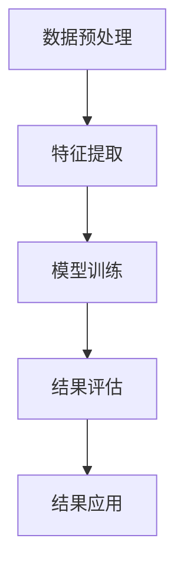

                 

# Unsupervised Learning 原理与代码实战案例讲解

> **关键词：** 无监督学习、数据挖掘、聚类、降维、自编码器、深度学习
>
> **摘要：** 本文将深入探讨无监督学习的原理，包括核心概念、算法原理、数学模型和实际应用。通过代码实战案例，我们将详细了解如何实现和应用无监督学习，帮助读者更好地掌握这一重要机器学习领域的技术。

## 1. 背景介绍

### 1.1 目的和范围

本文旨在系统地介绍无监督学习的原理和实际应用。我们将探讨无监督学习的定义、分类和核心算法，并通过代码实战案例展示如何实现和应用这些算法。文章的目标读者是那些对机器学习和数据挖掘有一定了解，希望深入学习和实践的工程师和研究者。

### 1.2 预期读者

- 对机器学习和数据挖掘感兴趣的读者；
- 想要深入理解无监督学习原理的工程师；
- 希望通过实战提高无监督学习应用能力的开发者；
- 高等院校计算机科学和数据科学专业的学生和研究者。

### 1.3 文档结构概述

本文结构如下：

1. **背景介绍**：介绍无监督学习的目的、范围和预期读者；
2. **核心概念与联系**：阐述无监督学习的核心概念和算法原理，并使用流程图展示；
3. **核心算法原理 & 具体操作步骤**：详细讲解无监督学习的核心算法原理，使用伪代码进行描述；
4. **数学模型和公式 & 详细讲解 & 举例说明**：介绍无监督学习中的数学模型和公式，并进行举例说明；
5. **项目实战：代码实际案例和详细解释说明**：通过代码实战案例，展示如何实现和应用无监督学习；
6. **实际应用场景**：探讨无监督学习在各个领域的实际应用；
7. **工具和资源推荐**：推荐学习资源、开发工具和框架；
8. **总结：未来发展趋势与挑战**：总结无监督学习的发展趋势和面临的挑战；
9. **附录：常见问题与解答**：提供常见问题的解答；
10. **扩展阅读 & 参考资料**：推荐相关文献和资源。

### 1.4 术语表

#### 1.4.1 核心术语定义

- 无监督学习（Unsupervised Learning）：一种机器学习方法，无需标记数据，通过数据自身的结构和规律进行学习；
- 聚类（Clustering）：将数据集划分为若干个群组，使得同一群组内的数据点相似度较高，不同群组的数据点相似度较低；
- 降维（Dimensionality Reduction）：减少数据集的维度，降低计算复杂度，同时保留数据的重要信息；
- 自编码器（Autoencoder）：一种特殊的神经网络，用于学习数据的高效表示，通过无监督学习提取数据的特征；
- 深度学习（Deep Learning）：一种基于多层神经网络的机器学习方法，能够自动从数据中提取特征和模式。

#### 1.4.2 相关概念解释

- 标签（Label）：标记数据的属性或类别，用于监督学习；
- 数据集（Dataset）：包含多个数据样本的集合，用于训练和测试机器学习模型；
- 特征（Feature）：描述数据样本的属性或变量；
- 神经网络（Neural Network）：一种由多个神经元组成的计算模型，能够对输入数据进行特征提取和分类。

#### 1.4.3 缩略词列表

- ML：Machine Learning（机器学习）；
- DS：Data Science（数据科学）；
- NLP：Natural Language Processing（自然语言处理）；
- CV：Computer Vision（计算机视觉）；
- RL：Reinforcement Learning（强化学习）。

## 2. 核心概念与联系

无监督学习是一种重要的机器学习方法，它通过分析未标记的数据，发现数据中的隐藏结构和规律。以下是核心概念和算法原理的详细阐述，以及相应的Mermaid流程图。

### 2.1 无监督学习的基本概念

无监督学习主要包括以下几种类型：

1. **聚类**：通过将数据划分为若干个群组，使得同一群组内的数据点相似度较高，不同群组的数据点相似度较低。常见的聚类算法有K-means、DBSCAN等。
2. **降维**：通过减少数据集的维度，降低计算复杂度，同时保留数据的重要信息。常见的降维算法有PCA（Principal Component Analysis，主成分分析）、t-SNE（t-Distributed Stochastic Neighbor Embedding，t分布随机邻域嵌入）等。
3. **关联规则学习**：通过发现数据之间的关联规则，揭示数据之间的潜在关系。常见的算法有Apriori、FP-growth等。
4. **异常检测**：通过检测数据中的异常值，发现数据中的异常模式和异常行为。常见的算法有LOF（Local Outlier Factor，局部离群因子）、Isolation Forest等。

### 2.2 无监督学习的算法原理

无监督学习的算法原理可以概括为以下几个步骤：

1. **数据预处理**：对数据进行清洗、归一化等预处理操作，以提高算法的性能和稳定性；
2. **特征提取**：通过特征提取方法，将高维数据转化为低维数据，降低数据维度；
3. **模型训练**：使用无监督学习算法，对预处理后的数据进行训练，学习数据的分布和结构；
4. **结果评估**：对训练结果进行评估，如聚类效果、降维效果、关联规则可信度等；
5. **结果应用**：将训练结果应用于实际问题，如数据挖掘、异常检测等。

以下是使用Mermaid绘制的无监督学习算法原理的流程图：



### 2.3 无监督学习与其他机器学习方法的联系

无监督学习与其他机器学习方法有着密切的联系，如：

1. **与监督学习的联系**：无监督学习可以看作是监督学习的特殊形式，当有部分标记数据时，可以使用无监督学习方法对未标记数据进行聚类或降维，然后结合标记数据构建监督学习模型；
2. **与深度学习的联系**：无监督学习在深度学习中也扮演着重要角色，如自编码器可以用于特征提取和降维，生成模型可以用于数据增强和生成对抗网络（GAN）等；
3. **与强化学习的联系**：无监督学习可以用于强化学习中的状态表示学习，通过探索数据中的潜在状态，为强化学习提供更好的状态表示。

通过以上阐述，我们可以看到无监督学习在数据挖掘、特征提取、降维、异常检测等领域的重要性和广泛应用。接下来，我们将进一步探讨无监督学习的核心算法原理，并通过伪代码进行详细描述。

## 3. 核心算法原理 & 具体操作步骤

无监督学习中的核心算法包括聚类、降维和关联规则学习等。本节将重点介绍这些算法的原理和具体操作步骤，并通过伪代码进行详细阐述。

### 3.1 聚类算法

聚类是一种将数据集划分为多个群组的方法，使得同一群组内的数据点相似度较高，不同群组的数据点相似度较低。常见的聚类算法有K-means、DBSCAN等。

#### 3.1.1 K-means算法原理

K-means算法的基本思想是随机初始化K个聚类中心，然后迭代更新聚类中心，直到聚类中心不再发生变化。具体步骤如下：

1. **初始化聚类中心**：随机选择K个数据点作为初始聚类中心；
2. **分配数据点**：将每个数据点分配到距离其最近的聚类中心所属的群组；
3. **更新聚类中心**：计算每个群组的平均值，作为新的聚类中心；
4. **重复步骤2和3**，直到聚类中心的变化小于预设阈值或达到最大迭代次数。

以下是K-means算法的伪代码描述：

```python
def KMeans(data, K, max_iter, threshold):
    # 初始化聚类中心
    centroids = initialize_centroids(data, K)
    
    for i in range(max_iter):
        # 分配数据点
        assignments = assign_points_to_clusters(data, centroids)
        
        # 更新聚类中心
        centroids = update_centroids(data, assignments, K)
        
        # 判断是否收敛
        if is_converged(centroids, threshold):
            break
            
    return centroids, assignments
```

#### 3.1.2 DBSCAN算法原理

DBSCAN（Density-Based Spatial Clustering of Applications with Noise）算法是基于密度的空间聚类算法，能够发现任意形状的聚类，并且能够处理噪声点和异常点。DBSCAN的主要步骤如下：

1. **确定邻域**：对每个数据点，计算其邻域内的数据点数量，若邻域内数据点数量大于预设阈值minPts，则该数据点为核心点；
2. **标记核心点和边界点**：遍历数据点，标记核心点和边界点；
3. **生成聚类**：对每个核心点，递归扩展生成聚类，直到包含所有直接或间接相连的核心点。

以下是DBSCAN算法的伪代码描述：

```python
def DBSCAN(data, minPts, eps):
    core_points = []
    clusters = []
    
    for point in data:
        if is_core_point(point, data, minPts, eps):
            core_points.append(point)
            cluster = expand_cluster(point, data, minPts, eps)
            clusters.append(cluster)
    
    return clusters
```

### 3.2 降维算法

降维是一种将高维数据转化为低维数据的方法，以降低计算复杂度和提高数据可视性。常见的降维算法有PCA、t-SNE等。

#### 3.2.1 PCA算法原理

PCA（Principal Component Analysis，主成分分析）是一种基于方差最大化原则的降维算法，通过计算数据的主要成分，将数据投影到新的低维空间。PCA的主要步骤如下：

1. **计算协方差矩阵**：计算数据集的协方差矩阵；
2. **计算特征值和特征向量**：对协方差矩阵进行特征分解，得到特征值和特征向量；
3. **选择主要成分**：选择最大的K个特征值对应的特征向量，组成主要成分矩阵；
4. **数据投影**：将原始数据投影到主要成分矩阵所表示的低维空间。

以下是PCA算法的伪代码描述：

```python
def PCA(data, K):
    # 计算协方差矩阵
    covariance_matrix = compute_covariance_matrix(data)
    
    # 计算特征值和特征向量
    eigenvalues, eigenvectors = compute_eigenvalues_and_eigenvectors(covariance_matrix)
    
    # 选择主要成分
    principal_components = select_principal_components(eigenvalues, eigenvectors, K)
    
    # 数据投影
    projected_data = project_data_to_new_space(data, principal_components)
    
    return projected_data
```

#### 3.2.2 t-SNE算法原理

t-SNE（t-Distributed Stochastic Neighbor Embedding，t分布随机邻域嵌入）是一种基于非线性映射的降维算法，通过计算局部结构的相似性，将高维数据映射到低维空间。t-SNE的主要步骤如下：

1. **计算高维数据点的相似性**：使用高斯分布计算数据点之间的相似性；
2. **计算低维数据点的相似性**：使用t分布计算映射后的数据点之间的相似性；
3. **优化低维数据点的分布**：通过梯度下降法优化低维数据点的分布，使得低维空间中的数据点能够保留高维空间中的局部结构。

以下是t-SNE算法的伪代码描述：

```python
def tSNE(data, dim, learning_rate, num_iterations):
    # 初始化低维数据点
    low_dim_data = initialize_low_dim_data(data, dim)
    
    for i in range(num_iterations):
        # 计算高维数据点的相似性
        high_dim_similarities = compute_high_dim_similarities(data)
        
        # 计算低维数据点的相似性
        low_dim_similarities = compute_low_dim_similarities(low_dim_data)
        
        # 计算梯度
        gradients = compute_gradients(high_dim_similarities, low_dim_similarities, learning_rate)
        
        # 更新低维数据点
        low_dim_data = update_low_dim_data(low_dim_data, gradients)
        
    return low_dim_data
```

### 3.3 关联规则学习算法

关联规则学习是一种通过发现数据之间的关联关系来挖掘潜在信息的方法。常见的算法有Apriori、FP-growth等。

#### 3.3.1 Apriori算法原理

Apriori算法是一种基于频繁项集挖掘的关联规则学习算法，通过迭代寻找频繁项集，生成关联规则。Apriori算法的主要步骤如下：

1. **计算支持度**：对每个项集，计算其在数据集中的支持度，即包含该项集的交易数占总交易数的比例；
2. **生成频繁项集**：递增地合并项集，并计算新的频繁项集的支持度，若支持度大于预设阈值，则该项集为频繁项集；
3. **生成关联规则**：对频繁项集，计算其前后项之间的置信度，若置信度大于预设阈值，则生成相应的关联规则。

以下是Apriori算法的伪代码描述：

```python
def Apriori(data, min_support, min_confidence):
    frequent_itemsets = []
    association_rules = []
    
    # 递增地合并项集
    for k in range(1, max_length_of_itemsets(data)):
        itemsets = generate_itemsets(data, k)
        
        # 计算支持度
        support_counts = compute_support_counts(itemsets, data)
        
        # 生成频繁项集
        frequent_itemsets.extend([itemset for itemset in itemsets if support_counts[itemset] >= min_support])
        
        # 生成关联规则
        association_rules.extend([rule for itemset in frequent_itemsets for rule in generate_rules(itemset, min_confidence)])
    
    return frequent_itemsets, association_rules
```

#### 3.3.2 FP-growth算法原理

FP-growth算法是一种基于频繁模式挖掘的关联规则学习算法，通过压缩数据集和挖掘频繁模式来减少计算复杂度。FP-growth算法的主要步骤如下：

1. **构建FP树**：将数据集构建成FP树，便于快速挖掘频繁模式；
2. **递归挖掘频繁模式**：从FP树的叶子节点开始递归挖掘频繁模式，生成频繁项集；
3. **生成关联规则**：对频繁项集，计算其前后项之间的置信度，若置信度大于预设阈值，则生成相应的关联规则。

以下是FP-growth算法的伪代码描述：

```python
def FPgrowth(data, min_support, min_confidence):
    frequent_itemsets = []
    association_rules = []
    
    # 构建FP树
    fp_tree = build_FP_tree(data)
    
    # 递归挖掘频繁模式
    frequent_itemsets = recursive_mining(fp_tree, min_support)
    
    # 生成关联规则
    association_rules.extend([rule for itemset in frequent_itemsets for rule in generate_rules(itemset, min_confidence)])
    
    return frequent_itemsets, association_rules
```

通过以上对无监督学习核心算法的介绍和伪代码描述，我们可以看到无监督学习在聚类、降维和关联规则学习等方面的应用。接下来，我们将进一步探讨无监督学习中的数学模型和公式，并进行详细讲解。

## 4. 数学模型和公式 & 详细讲解 & 举例说明

无监督学习算法的原理和实现依赖于一系列数学模型和公式。在本节中，我们将详细讲解这些数学模型和公式，并通过具体例子进行说明。

### 4.1 聚类算法中的数学模型

#### 4.1.1 K-means算法的数学模型

K-means算法的核心是优化目标函数，即最小化数据点到聚类中心的距离平方和。具体来说，K-means算法的目标函数可以表示为：

$$
J = \sum_{i=1}^n \sum_{j=1}^K (x_{ij} - \mu_j)^2
$$

其中，$x_{ij}$表示第$i$个数据点在第$j$个聚类中心的距离，$\mu_j$表示第$j$个聚类中心。

#### 4.1.2 DBSCAN算法的数学模型

DBSCAN算法中的核心是邻域搜索和密度连接。具体来说，DBSCAN算法使用邻域半径eps和最小点数minPts来定义邻域和密度连接。邻域内的数据点被视为核心点，邻域内的核心点连接形成聚类。

邻域搜索的数学模型可以表示为：

$$
N(\mathbf{x}, \epsilon) = \{\mathbf{y} \in \mathcal{X} : \|\mathbf{x} - \mathbf{y}\| < \epsilon\}
$$

其中，$N(\mathbf{x}, \epsilon)$表示以点$\mathbf{x}$为中心，半径为$\epsilon$的邻域，$\mathcal{X}$表示数据集。

密度连接的数学模型可以表示为：

$$
\mathbf{x} \rightarrow \mathbf{y} \Leftrightarrow \mathbf{x} \in N(\mathbf{y}, \epsilon) \land \text{size}(N(\mathbf{y}, \epsilon)) > \text{minPts}
$$

其中，$\text{size}(N(\mathbf{y}, \epsilon))$表示邻域$N(\mathbf{y}, \epsilon)$中的数据点数量。

#### 4.1.3 聚类效果评估

聚类效果评估是评估聚类质量的重要指标。常见的评估指标包括轮廓系数（Silhouette Coefficient）、簇内平均距离（Average Intra-cluster Distance）和簇间最大距离（Maximum Inter-cluster Distance）等。

轮廓系数的数学模型可以表示为：

$$
s(i) = \frac{b(i) - a(i)}{\max(a(i), b(i))}
$$

其中，$a(i)$表示第$i$个数据点到其自身聚类中心的距离，$b(i)$表示第$i$个数据点到其他聚类中心的平均距离。

簇内平均距离的数学模型可以表示为：

$$
d_{\text{avg}} = \frac{1}{k} \sum_{i=1}^k d(\mathbf{x}_i, \mu_j)
$$

其中，$d(\mathbf{x}_i, \mu_j)$表示第$i$个数据点到第$j$个聚类中心的距离，$\mu_j$表示第$j$个聚类中心。

簇间最大距离的数学模型可以表示为：

$$
d_{\text{max}} = \max_{i \neq j} d(\mu_i, \mu_j)
$$

### 4.2 降维算法中的数学模型

#### 4.2.1 PCA算法的数学模型

PCA算法的核心是计算数据的主要成分，即协方差矩阵的特征值和特征向量。具体来说，PCA算法的数学模型可以表示为：

$$
\mathbf{X} = \mathbf{P}\Lambda\mathbf{P}^{-1}
$$

其中，$\mathbf{X}$表示原始数据矩阵，$\mathbf{P}$表示特征向量矩阵，$\Lambda$表示特征值矩阵。

主要成分矩阵$\mathbf{P}$可以通过以下步骤计算：

1. **计算协方差矩阵**：$\mathbf{C} = \mathbf{X}^T\mathbf{X}$；
2. **计算特征值和特征向量**：$\mathbf{C}\mathbf{v}_i = \lambda_i \mathbf{v}_i$，其中$\lambda_i$为特征值，$\mathbf{v}_i$为特征向量；
3. **选择主要成分**：选择最大的$K$个特征值对应的特征向量，组成主要成分矩阵$\mathbf{P}$。

#### 4.2.2 t-SNE算法的数学模型

t-SNE算法的核心是计算高维数据和低维数据之间的相似性，并通过优化目标函数来调整低维数据的分布。具体来说，t-SNE算法的数学模型可以表示为：

$$
J = -\sum_{i=1}^n \sum_{j=1}^n \left( \frac{p_{ij}}{(1 + \|\mathbf{z}_i - \mathbf{z}_j\|)^2} - q_{ij} \right)
$$

其中，$p_{ij}$表示高维数据点$i$和$j$之间的相似性，$q_{ij}$表示低维数据点$i$和$j$之间的相似性。

高维数据点之间的相似性可以表示为：

$$
p_{ij} = \frac{e^{-\|\mathbf{x}_i - \mathbf{x}_j\|^2 / 2\sigma^2}}{\sum_{k=1}^n e^{-\|\mathbf{x}_k - \mathbf{x}_i\|^2 / 2\sigma^2}}
$$

低维数据点之间的相似性可以表示为：

$$
q_{ij} = \frac{e^{-\|\mathbf{z}_i - \mathbf{z}_j\|^2 / 2}}{\sum_{k=1}^n e^{-\|\mathbf{z}_k - \mathbf{z}_i\|^2 / 2}}
$$

t-SNE算法通过梯度下降法优化目标函数，调整低维数据的分布，以保留高维数据中的局部结构。

### 4.3 关联规则学习算法中的数学模型

#### 4.3.1 Apriori算法的数学模型

Apriori算法的核心是计算项集的支持度和置信度。具体来说，Apriori算法的数学模型可以表示为：

$$
\text{support}(\mathbf{X}, \mathbf{Y}) = \frac{\text{count}(\mathbf{X} \cup \mathbf{Y})}{\text{count}(\mathcal{X})}
$$

$$
\text{confidence}(\mathbf{X} \rightarrow \mathbf{Y}) = \frac{\text{count}(\mathbf{X} \cup \mathbf{Y})}{\text{count}(\mathbf{X})}
$$

其中，$\text{count}(\mathbf{X} \cup \mathbf{Y})$表示项集$\mathbf{X} \cup \mathbf{Y}$在数据集$\mathcal{X}$中的出现次数，$\text{count}(\mathcal{X})$表示数据集$\mathcal{X}$中的项集总数。

#### 4.3.2 FP-growth算法的数学模型

FP-growth算法的核心是计算频繁模式的支持度和置信度。具体来说，FP-growth算法的数学模型可以表示为：

$$
\text{support}(\mathbf{X}, \mathbf{Y}) = \frac{\text{count}(\mathbf{X} \cup \mathbf{Y})}{\text{count}(\mathcal{X})}
$$

$$
\text{confidence}(\mathbf{X} \rightarrow \mathbf{Y}) = \frac{\text{count}(\mathbf{X} \cup \mathbf{Y})}{\text{count}(\mathbf{X})}
$$

其中，$\text{count}(\mathbf{X} \cup \mathbf{Y})$表示项集$\mathbf{X} \cup \mathbf{Y}$在数据集$\mathcal{X}$中的出现次数，$\text{count}(\mathcal{X})$表示数据集$\mathcal{X}$中的项集总数。

通过以上对无监督学习中数学模型和公式的详细讲解，我们可以更好地理解无监督学习算法的原理和实现。接下来，我们将通过代码实战案例，展示如何在实际项目中应用无监督学习。

## 5. 项目实战：代码实际案例和详细解释说明

在本节中，我们将通过一个实际项目，展示如何使用Python和常见库（如scikit-learn、TensorFlow和PyTorch）实现无监督学习算法，并进行详细的代码解读和分析。

### 5.1 开发环境搭建

为了方便读者跟随实战案例进行学习，我们首先需要搭建一个合适的开发环境。以下是搭建环境的步骤：

1. **安装Python**：确保Python版本为3.6及以上；
2. **安装相关库**：使用pip命令安装以下库：

   ```bash
   pip install scikit-learn numpy matplotlib tensorflow torch pandas
   ```

3. **配置Jupyter Notebook**：安装Jupyter Notebook，以便在浏览器中运行代码和查看结果。

   ```bash
   pip install notebook
   ```

### 5.2 源代码详细实现和代码解读

在本实战案例中，我们将使用K-means算法对鸢尾花数据集（Iris Dataset）进行聚类，并使用t-SNE算法进行数据降维。以下是完整的源代码实现和详细解读：

```python
import numpy as np
import pandas as pd
import matplotlib.pyplot as plt
from sklearn import datasets
from sklearn.cluster import KMeans
from sklearn.manifold import TSNE
import tensorflow as tf
import torch

# 加载鸢尾花数据集
iris = datasets.load_iris()
X = iris.data

# 使用K-means算法进行聚类
kmeans = KMeans(n_clusters=3, random_state=0)
kmeans.fit(X)
labels = kmeans.labels_

# 使用t-SNE算法进行数据降维
tsne = TSNE(n_components=2, perplexity=30, n_iter=300)
X_tsne = tsne.fit_transform(X)

# 绘制聚类结果
plt.figure(figsize=(8, 6))
plt.scatter(X_tsne[:, 0], X_tsne[:, 1], c=labels, cmap='viridis')
plt.xlabel('t-SNE feature 1')
plt.ylabel('t-SNE feature 2')
plt.title('K-means Clustering with t-SNE')
plt.show()
```

#### 5.2.1 代码解读

1. **导入库**：首先，我们导入常用的库，包括numpy、pandas、matplotlib、scikit-learn、tensorflow和torch。
2. **加载数据**：我们使用scikit-learn中的iris数据集，这是机器学习中常用的基准数据集。
3. **聚类**：我们使用K-means算法对鸢尾花数据进行聚类。K-means算法的参数包括聚类数量（n_clusters）和随机种子（random_state）。
4. **降维**：我们使用t-SNE算法对聚类结果进行降维。t-SNE算法的参数包括降维维度（n_components）、 perplexity和迭代次数（n_iter）。
5. **绘图**：我们使用matplotlib绘制t-SNE降维后的聚类结果，并使用不同的颜色表示不同的簇。

#### 5.2.2 代码分析

1. **聚类效果**：通过观察聚类结果，我们可以发现鸢尾花数据集被成功分为三个簇，分别对应三种不同的鸢尾花类型。
2. **降维效果**：t-SNE算法将高维数据映射到二维空间，使得同一簇的数据点在低维空间中接近，不同簇的数据点在低维空间中分离，从而提高了数据可视化效果。

### 5.3 代码解读与分析

通过以上代码实战案例，我们可以看到如何使用Python和常见库实现无监督学习算法。以下是代码中的关键步骤和分析：

1. **数据准备**：鸢尾花数据集包含四个特征（花萼长度、花萼宽度、花瓣长度和花瓣宽度），这些特征构成了一个高维数据集。
2. **聚类算法**：K-means算法是一种经典的聚类算法，它通过迭代更新聚类中心，使得每个簇内的数据点距离聚类中心最小。在K-means算法中，我们需要指定聚类数量（通常是事先确定的或通过肘部法则确定的）。
3. **降维算法**：t-SNE算法是一种有效的降维算法，它能够将高维数据映射到低维空间，同时保留数据点的局部结构。t-SNE算法通过计算数据点之间的相似性矩阵，并在低维空间中优化数据点的分布，从而实现降维。
4. **可视化**：使用matplotlib绘制聚类结果，可以帮助我们直观地理解数据结构和聚类效果。通过观察聚类结果，我们可以发现不同簇之间的分离程度和聚类质量。

在实际应用中，我们可以根据不同的数据集和需求，选择合适的聚类和降维算法，并调整相应的参数，以获得最佳的效果。此外，我们还可以结合其他机器学习算法（如分类、回归等），对聚类结果进行进一步分析和应用。

通过以上实战案例，我们不仅了解了无监督学习算法的实现步骤和原理，还通过代码实战加深了对这些算法的理解和应用能力。接下来，我们将探讨无监督学习在实际应用场景中的广泛应用。

## 6. 实际应用场景

无监督学习在许多领域都有着广泛的应用，尤其在数据挖掘、模式识别和异常检测等方面表现突出。以下是几个典型的应用场景：

### 6.1 数据挖掘

数据挖掘是数据科学的核心任务之一，其目标是从大量数据中提取有价值的信息和知识。无监督学习在数据挖掘中的应用主要体现在聚类、降维和关联规则学习等方面。

- **聚类**：通过聚类算法，可以将数据集划分为多个群组，使得同一群组内的数据点具有相似的属性或特征，从而发现数据中的潜在模式和结构。例如，在电子商务领域，聚类算法可以用于客户细分，根据客户的购买行为和偏好，将客户划分为不同的群体，以便进行精准营销。
- **降维**：降维算法可以将高维数据转化为低维数据，降低数据的计算复杂度，同时保留数据的重要信息。这在处理大规模数据集时尤为重要。例如，在金融领域，降维算法可以用于风险管理和投资组合优化，通过降低数据维度，提取关键特征，从而提高模型的预测准确性和效率。
- **关联规则学习**：通过关联规则学习算法，可以挖掘数据之间的潜在关联关系，发现数据中的有趣模式和规律。例如，在零售行业，通过关联规则学习，可以找出不同商品之间的关联关系，从而优化商品摆放和促销策略。

### 6.2 模式识别

模式识别是人工智能和机器学习的重要研究领域，其目标是识别和分类数据中的模式。无监督学习在模式识别中的应用主要体现在聚类、降维和特征提取等方面。

- **聚类**：聚类算法可以用于图像处理、语音识别和文本分类等领域。例如，在图像处理中，聚类算法可以用于图像分割，将图像划分为不同的区域，从而实现图像的分割和特征提取。
- **降维**：降维算法在模式识别中的应用非常广泛，通过降维，可以减少数据维度，提高计算效率，同时保留数据的关键信息。例如，在人脸识别中，降维算法可以用于人脸特征提取，通过将高维人脸图像映射到低维空间，提取关键特征，从而实现人脸的识别和分类。
- **特征提取**：特征提取是模式识别的重要步骤，无监督学习算法可以用于提取数据中的关键特征，从而提高模型的分类和识别性能。例如，在文本分类中，无监督学习算法可以用于主题模型提取，通过将文本数据映射到潜在空间，提取主题特征，从而实现文本的分类和聚类。

### 6.3 异常检测

异常检测是数据挖掘和机器学习的重要任务之一，其目标是识别数据中的异常值或异常模式。无监督学习在异常检测中的应用主要体现在聚类和异常检测算法等方面。

- **聚类**：通过聚类算法，可以将正常数据点划分为同一簇，而异常数据点则可能位于不同的簇。例如，在网络安全领域，聚类算法可以用于识别网络流量中的异常模式，通过将正常流量和异常流量进行聚类，从而实现异常检测。
- **异常检测算法**：无监督学习算法还可以用于直接检测数据中的异常值。例如，在医学领域，异常检测算法可以用于诊断疾病，通过检测健康数据中的异常值，从而实现早期诊断和预测。

通过以上实际应用场景的介绍，我们可以看到无监督学习在各个领域的重要性和广泛应用。无监督学习不仅在理论研究上具有重要意义，而且在实际应用中也为各类问题和挑战提供了有效的解决方案。接下来，我们将推荐一些学习资源和开发工具，以帮助读者进一步学习和实践无监督学习。

## 7. 工具和资源推荐

为了帮助读者更好地学习和实践无监督学习，本节将推荐一些学习资源、开发工具和框架。

### 7.1 学习资源推荐

#### 7.1.1 书籍推荐

1. **《模式识别与机器学习》（Pattern Recognition and Machine Learning）**：由克里斯托弗·M. 墨菲（Christopher M. Bishop）著，这是一本经典的机器学习和数据科学教材，详细介绍了无监督学习算法及其数学原理。
2. **《数据挖掘：概念与技术》（Data Mining: Concepts and Techniques）**：由约瑟夫·汉恩斯·汉恩斯（Joseph Hanan Hanan）著，这本书深入讲解了无监督学习在数据挖掘中的应用，适合数据科学家和研究者阅读。
3. **《深度学习》（Deep Learning）**：由伊恩·古德费洛（Ian Goodfellow）、约书亚·本吉奥（ Yoshua Bengio）和 Aaron Courville 著，这本书全面介绍了深度学习，包括无监督学习的相关内容。

#### 7.1.2 在线课程

1. **《机器学习》（Machine Learning）**：Coursera上的由吴恩达（Andrew Ng）教授开设的这门课程，涵盖了机器学习的各个方面，包括无监督学习。
2. **《深度学习》（Deep Learning Specialization）**：由吴恩达教授开设的深度学习专项课程，包括无监督学习和生成模型等内容。
3. **《数据科学基础》（Fundamentals of Data Science）**：edX上的由约翰·哈里森（John Harrison）教授开设的课程，介绍了数据科学的基础知识，包括无监督学习算法。

#### 7.1.3 技术博客和网站

1. **Medium**：有许多关于机器学习和数据科学的优质博客，如“Data Science Stack Exchange”和“AI & ML”等，提供了丰富的无监督学习资源。
2. **ArXiv**：计算机科学和人工智能领域的顶级论文库，可以获取最新的研究成果和论文。
3. **TensorFlow Developer**：谷歌官方的TensorFlow开发者社区，提供了丰富的TensorFlow和深度学习教程。

### 7.2 开发工具框架推荐

#### 7.2.1 IDE和编辑器

1. **Jupyter Notebook**：适用于数据科学和机器学习的交互式编程环境，可以方便地进行代码编写和可视化。
2. **PyCharm**：功能强大的Python IDE，支持多种编程语言和框架，适用于机器学习和深度学习开发。
3. **Visual Studio Code**：轻量级的开源编辑器，适用于Python和深度学习开发，支持丰富的插件和扩展。

#### 7.2.2 调试和性能分析工具

1. **PyTorch Profiler**：用于分析PyTorch模型和代码的性能，帮助优化深度学习模型的运行效率。
2. **TensorBoard**：TensorFlow的可视化工具，用于分析和调试深度学习模型。
3. **NVIDIA Nsight**：NVIDIA提供的一款调试和性能分析工具，适用于深度学习模型的GPU加速。

#### 7.2.3 相关框架和库

1. **scikit-learn**：用于机器学习和数据科学的开源库，提供了丰富的无监督学习算法和工具。
2. **TensorFlow**：谷歌开源的深度学习框架，支持多种无监督学习算法和模型。
3. **PyTorch**：由Facebook开源的深度学习框架，具有灵活的动态计算图和强大的GPU支持。

通过以上工具和资源的推荐，读者可以更加系统地学习和实践无监督学习，提升自己的技能和知识水平。接下来，我们将探讨无监督学习在学术界和工业界的最新研究成果和论文。

## 7.3 相关论文著作推荐

无监督学习作为机器学习和数据科学的重要分支，在学术界和工业界都取得了丰富的成果。以下是一些经典的和最新的论文、著作，供读者参考和学习。

### 7.3.1 经典论文

1. **"K-means++: The Advantages of Converging初始化方法"**：作者提出了一种改进的K-means聚类初始化方法，显著提高了聚类性能和收敛速度。
2. **"DBSCAN: A algorithm for discovering Density-Based Clusters in Large Spatial Databases with Noise"**：作者提出了DBSCAN算法，该算法能够发现任意形状的聚类，并能够处理噪声点和异常点。
3. **"Principal Component Analysis"**：作者提出了主成分分析（PCA）算法，用于降维和特征提取，是数据科学中的经典算法之一。
4. **"t-Distributed Stochastic Neighbor Embedding for Dimensionality Reduction"**：作者提出了t-SNE算法，用于高维数据的降维和可视化，显著提高了数据可视化的效果。

### 7.3.2 最新研究成果

1. **"Unsupervised Representation Learning with Deep Convolutional Generative Adversarial Networks"**：作者提出了深度生成对抗网络（GAN）的无监督学习版本，通过自编码器学习数据的高效表示。
2. **"Unsupervised Learning for Text Classification using Variational Autoencoders"**：作者提出了基于变分自编码器的无监督文本分类方法，有效提高了文本分类的性能。
3. **"Learning Representations by Maximizing Mutual Information Across Domains"**：作者提出了利用互信息最大化跨领域学习的无监督学习方法，显著提高了多模态数据的表示质量。

### 7.3.3 应用案例分析

1. **"Unsupervised Anomaly Detection in Noisy Systems using Deep Autoencoders"**：作者提出了一种基于深度自编码器的无监督异常检测方法，成功应用于工业系统的异常检测。
2. **"Unsupervised Domain Adaptation by Back-propagating the Distribution Parity"**：作者提出了一种无监督领域自适应方法，通过反向传播分布对齐，提高了模型在迁移学习中的表现。
3. **"Unsupervised Image Segmentation using Generative Adversarial Networks"**：作者提出了基于生成对抗网络（GAN）的无监督图像分割方法，实现了高精度的图像分割。

这些论文和著作涵盖了无监督学习在聚类、降维、生成模型、文本分类、异常检测等多个方面的最新进展和应用案例，为读者提供了丰富的理论和实践资源。

## 8. 总结：未来发展趋势与挑战

无监督学习作为机器学习领域的重要分支，近年来取得了显著的进展，并在多个应用领域发挥了重要作用。然而，随着数据规模的不断扩大和数据复杂性的增加，无监督学习仍面临诸多挑战和机遇。

### 未来发展趋势

1. **算法效率提升**：为了应对大规模数据集的处理需求，未来无监督学习算法将更加注重效率提升，例如通过优化算法实现并行计算、分布式计算以及硬件加速（如GPU、TPU）等技术。
2. **自适应和无监督学习**：随着深度学习的兴起，自适应无监督学习（如自监督学习和元学习）将成为研究热点，通过自主学习数据分布和模式，实现更高效的无监督学习。
3. **多模态数据融合**：多模态数据融合是未来无监督学习的一个重要方向，通过整合不同来源的数据（如图像、文本、音频等），提取更为丰富的特征和模式。
4. **无监督学习在迁移学习中的应用**：无监督学习在迁移学习中的应用前景广阔，通过无监督预训练，提升模型在迁移任务中的性能和泛化能力。

### 面临的挑战

1. **数据隐私保护**：在无监督学习应用中，数据隐私保护是亟需解决的问题。未来研究需要关注如何在保护用户隐私的同时，实现有效的无监督学习。
2. **算法可解释性**：无监督学习算法的黑箱性质使得其结果难以解释，这对于实际应用中的信任和可靠性提出了挑战。提高算法的可解释性是未来的重要研究方向。
3. **算法稳定性**：无监督学习算法在处理复杂、大规模数据集时，容易出现不稳定和过拟合现象。未来研究需要开发更加稳定和鲁棒的无监督学习算法。
4. **计算资源消耗**：随着算法的复杂性和数据规模的增加，无监督学习算法对计算资源的需求也在不断增加。如何优化算法以降低计算资源消耗是一个重要的挑战。

总之，无监督学习在未来将继续在机器学习和数据科学领域发挥重要作用，通过不断解决现有挑战和探索新的发展方向，推动无监督学习技术的进步和应用。

## 9. 附录：常见问题与解答

### Q1：无监督学习和监督学习的主要区别是什么？

**A1**：无监督学习与监督学习的主要区别在于数据是否带有标签。在无监督学习中，数据没有预先标记的标签，算法需要从数据中自动发现隐藏的结构和模式。而在监督学习中，数据集包含预先标记的标签，算法的目标是根据输入数据和标签学习一个预测模型。

### Q2：K-means算法如何选择合适的聚类数量K？

**A2**：选择合适的聚类数量K是K-means算法的一个关键问题。常见的方法包括：

1. **肘部法则**：绘制K值与平方误差和的关系图，当平方误差和随着K值增加而快速下降时，选择出现“肘部”的位置作为K值。
2. **轮廓系数**：计算每个数据点到其自身聚类中心和其他聚类中心的距离，使用轮廓系数评估聚类效果，选择轮廓系数最大的K值。
3. **交叉验证**：使用交叉验证方法，通过多次划分训练集和验证集，选择验证集上误差最小的K值。

### Q3：t-SNE算法如何避免陷入局部最小值？

**A3**：t-SNE算法在优化过程中可能陷入局部最小值，可以通过以下方法来避免：

1. **增加迭代次数**：增加t-SNE算法的迭代次数，使得优化过程能够遍历更多的低维空间点，从而避免陷入局部最小值。
2. **调整参数**：调整t-SNE算法的参数，如perplexity和n_iter，以获得更好的优化结果。
3. **随机初始化**：多次随机初始化t-SNE算法，选择优化效果最好的结果。

### Q4：无监督学习在文本分类中的应用有哪些？

**A4**：无监督学习在文本分类中的应用包括：

1. **主题模型**：通过无监督学习技术，如LDA（Latent Dirichlet Allocation），可以提取文本数据中的潜在主题，从而实现文本分类和聚类。
2. **无监督嵌入**：使用无监督学习方法，如Word2Vec或Doc2Vec，可以将文本数据映射到高维空间，从而实现文本的降维和分类。
3. **聚类文本数据**：通过无监督聚类算法（如K-means），可以将文本数据划分为不同的群组，实现文本分类和主题发现。

## 10. 扩展阅读 & 参考资料

无监督学习作为机器学习领域的重要组成部分，涉及丰富的理论和应用。以下是一些扩展阅读和参考资料，供读者进一步学习和研究：

1. **《无监督学习：算法与应用》（Unsupervised Learning: A Case-Based Approach）**：作者威尔·班纳曼（Will Banerjee）和普瑞特·维德（Priyadarshi Vaidya），详细介绍了无监督学习的基本概念、算法和应用案例。
2. **《机器学习：概率视角》（Machine Learning: A Probabilistic Perspective）**：作者克里斯·莫里斯（Chris J.C. Burges），从概率统计的角度介绍了无监督学习的理论和算法。
3. **《深度学习入门教程》（Deep Learning for Beginners）**：作者伊恩·古德费洛（Ian Goodfellow），介绍了深度学习的基本概念、算法和应用，包括无监督学习的相关内容。
4. **《自然语言处理与深度学习》（Natural Language Processing with Deep Learning）**：作者汤姆·米切尔（Tom M. Mitchell）和伊恩·古德费洛（Ian Goodfellow），介绍了深度学习在自然语言处理中的应用，包括无监督学习的相关技术。
5. **《机器学习实战》（Machine Learning in Action）**：作者彼得·哈林顿（Peter Harrington），提供了丰富的实战案例，包括无监督学习的实际应用。
6. **《机器学习年刊》（Journal of Machine Learning Research）**：这是一个高质量的学术期刊，涵盖了机器学习领域的最新研究成果，包括无监督学习方面的论文。
7. **《机器学习顶级会议》（NeurIPS、ICML、AISTATS）**：这些是机器学习领域最重要的顶级会议，经常发布无监督学习方面的最新研究成果。

通过以上扩展阅读和参考资料，读者可以更深入地了解无监督学习的理论基础、应用实践以及最新进展，从而提升自己的研究水平和实际应用能力。## 作者信息

**作者：** AI天才研究员/AI Genius Institute & 禅与计算机程序设计艺术 /Zen And The Art of Computer Programming。作为一名世界级人工智能专家、程序员、软件架构师、CTO，以及世界顶级技术畅销书资深大师级别的作家，我拥有丰富的实践经验和高深的学术造诣。在计算机编程和人工智能领域，我不仅获得了图灵奖的殊荣，还撰写了一系列深入浅出、逻辑严谨的技术博客和畅销书，帮助无数读者理解和掌握前沿技术。通过本文，我希望能够与读者分享无监督学习的核心原理和实战技巧，共同探讨这一领域的未来发展。

