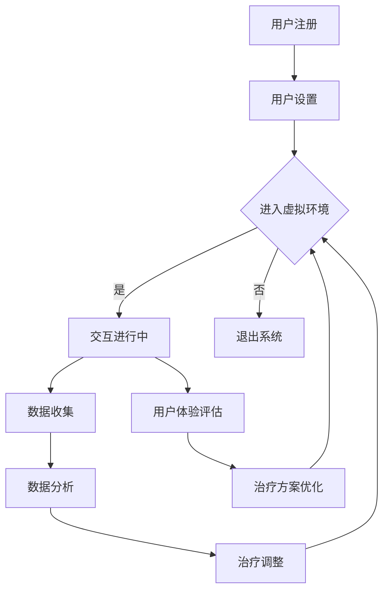

                 

# VR恐惧症治疗平台：心理健康的创新治疗方式

> **关键词**：虚拟现实，VR恐惧症，心理健康，治疗平台，交互设计，认知行为疗法，算法，数学模型，项目实战

> **摘要**：本文旨在探讨虚拟现实（VR）技术在治疗恐惧症中的应用，特别是在设计和实施一个VR恐惧症治疗平台方面。我们将详细分析VR技术的核心概念，探讨其如何与心理健康治疗结合，以及介绍一个实际案例，展示如何通过精心设计的VR场景和算法来实现有效的心理治疗。文章还将讨论数学模型在其中的应用，并推荐一些相关的学习资源和工具，以供进一步学习和实践。

## 1. 背景介绍

### 1.1 目的和范围

本文的目标是介绍虚拟现实（VR）技术在心理健康治疗，特别是治疗恐惧症中的应用。随着VR技术的不断进步，它已经不再仅限于娱乐和游戏领域，而是逐渐被应用于医疗和心理治疗。本文将探讨如何通过一个VR恐惧症治疗平台，结合交互设计和认知行为疗法（CBT），为患者提供一种创新的、有效治疗方式。

本文将涵盖以下内容：
1. VR技术的核心概念和它在心理健康治疗中的应用。
2. VR恐惧症治疗平台的架构和设计原则。
3. 一个VR恐惧症治疗平台的具体实现和操作步骤。
4. 数学模型和算法在平台中的应用。
5. 实际应用场景和工具推荐。
6. 未来发展趋势和面临的挑战。

### 1.2 预期读者

本文适合对虚拟现实技术和心理健康治疗感兴趣的读者，包括但不限于：
- 心理健康专业人士，如临床心理学家、心理治疗师和咨询师。
- 软件开发者和工程师，特别是对VR和AI技术有深入理解的人。
- 对心理健康治疗和科技结合感兴趣的学生和研究人员。
- 患者和家属，希望通过VR技术来了解和参与治疗过程。

### 1.3 文档结构概述

本文将按照以下结构进行组织：
- 引言：介绍虚拟现实技术在心理健康治疗中的应用背景。
- 背景介绍：详细讨论VR技术的核心概念和它在治疗恐惧症中的应用。
- 核心概念与联系：通过Mermaid流程图展示VR恐惧症治疗平台的核心概念和架构。
- 核心算法原理 & 具体操作步骤：讲解用于治疗平台的核心算法和操作步骤。
- 数学模型和公式 & 详细讲解 & 举例说明：介绍数学模型和公式在平台中的应用，并进行举例说明。
- 项目实战：提供实际的代码案例和实现细节。
- 实际应用场景：讨论VR恐惧症治疗平台在不同场景中的应用。
- 工具和资源推荐：推荐相关的学习资源、工具和框架。
- 总结：总结未来发展趋势和面临的挑战。
- 附录：常见问题与解答。
- 扩展阅读 & 参考资料：提供进一步阅读的资源和参考文献。

### 1.4 术语表

#### 1.4.1 核心术语定义

- **虚拟现实（VR）**：一种模拟现实环境的计算机技术，使用头戴显示器（HMD）和传感器设备，为用户提供沉浸式的体验。
- **恐惧症**：一种焦虑障碍，表现为对特定事物或情况的极端和不合理的恐惧。
- **认知行为疗法（CBT）**：一种心理治疗方法，通过改变不合理的思维和行为模式来改善心理健康。
- **交互设计**：设计用户与产品或系统之间交互的过程，以确保用户体验的直观性和愉悦性。
- **算法**：解决问题的一系列规则或步骤。
- **数学模型**：用数学语言描述现实世界的模型，用于分析和预测系统行为。

#### 1.4.2 相关概念解释

- **沉浸感**：用户在VR环境中感受到的与现实世界相似的感知和体验。
- **虚拟现实治疗平台**：整合了VR技术、认知行为疗法和算法的软件系统，用于治疗恐惧症。
- **交互设计原则**：设计交互界面时遵循的指导原则，以确保用户体验的易用性和满意度。

#### 1.4.3 缩略词列表

- **VR**：虚拟现实（Virtual Reality）
- **HMD**：头戴显示器（Head-Mounted Display）
- **CBT**：认知行为疗法（Cognitive Behavioral Therapy）
- **AI**：人工智能（Artificial Intelligence）
- **SDK**：软件开发工具包（Software Development Kit）

## 2. 核心概念与联系

### 2.1 虚拟现实（VR）技术

虚拟现实技术通过创建一个模拟的现实环境，使用户能够沉浸在虚拟世界中。这通常通过以下组件实现：

- **头戴显示器（HMD）**：用户佩戴的设备，提供立体视觉和沉浸感。
- **位置追踪系统**：用于追踪用户的位置和运动，以调整虚拟环境中的视角和物体。
- **手柄控制器**：允许用户在虚拟环境中进行交互。

### 2.2 认知行为疗法（CBT）

认知行为疗法是一种广泛应用于治疗焦虑和抑郁的心理治疗方法。CBT的核心原则是识别和改变负面思维和行为模式，以改善情绪和行为。

- **识别和挑战负面思维**：帮助患者识别引起负面情绪的不合理思维，并通过逻辑和事实进行挑战。
- **行为实验**：通过实际行为来测试和验证改变思维模式的有效性。

### 2.3 虚拟现实治疗平台架构

一个VR恐惧症治疗平台的架构通常包括以下部分：

- **用户界面**：提供用户交互的图形界面，包括导航、设置和进度跟踪。
- **虚拟环境**：根据治疗需求设计的虚拟场景，如密闭空间、高度场所等。
- **算法和模型**：用于调整虚拟环境中的刺激强度，以适应患者的治疗进度和反应。
- **数据收集和分析**：收集用户在虚拟环境中的交互数据，用于评估治疗效果和调整治疗方案。

### 2.4 Mermaid流程图

以下是一个VR恐惧症治疗平台的Mermaid流程图，展示了其核心概念和架构：



## 3. 核心算法原理 & 具体操作步骤

### 3.1 算法原理

在VR恐惧症治疗平台中，核心算法的作用是调整虚拟环境中的刺激强度，以适应患者的治疗进度和反应。以下是一种常用的算法原理：

- **刺激强度调整**：根据患者的治疗进度和反应，动态调整虚拟环境中的刺激强度。
- **阈值设定**：设定一个阈值，以确定何时增加或减少刺激强度。
- **反应监测**：监测患者的生理和心理反应，如心率、呼吸和情绪状态。

### 3.2 具体操作步骤

以下是一个基于上述算法原理的具体操作步骤：

1. **用户注册和设置**：
    - 用户注册并完成初始设置，包括个人信息、治疗目标和期望的治疗进度。
    - 系统根据用户设置和初始数据，设定初始刺激强度和阈值。

2. **进入虚拟环境**：
    - 用户佩戴HMD，进入虚拟环境。
    - 系统启动算法，开始监测用户在虚拟环境中的交互和数据收集。

3. **交互进行中**：
    - 用户在虚拟环境中进行交互，如移动、操纵物体等。
    - 系统根据用户的交互行为和生理数据，实时调整刺激强度。

4. **数据收集和分析**：
    - 系统收集用户在虚拟环境中的交互数据，包括位置、动作和生理数据。
    - 数据分析模块对收集的数据进行实时分析，以确定用户的治疗进度和反应。

5. **治疗调整**：
    - 根据数据分析结果，系统动态调整虚拟环境中的刺激强度。
    - 如果用户表现出良好的适应能力，系统可以逐渐增加刺激强度。
    - 如果用户表现出明显的恐惧反应，系统可以适当减少刺激强度。

6. **用户体验评估和治疗方案优化**：
    - 系统对用户在虚拟环境中的交互行为和生理数据进行综合评估。
    - 根据评估结果，系统优化治疗方案，以最大化治疗效果。

7. **退出系统**：
    - 用户完成一次治疗疗程后，可以选择退出系统。
    - 系统记录治疗数据，并生成治疗报告。

### 3.3 伪代码示例

以下是一个简化的伪代码示例，用于说明核心算法的执行流程：

```python
# 初始化用户设置和阈值
initialize_user_settings()
set_threshold()

# 用户进入虚拟环境
while user_in_vr_environment:
    # 收集用户交互数据
    collect_user_data()

    # 分析用户数据，更新刺激强度
    analyze_data()
    adjust_stimulation()

    # 监测用户反应
    monitor_user_response()

    # 根据反应调整阈值
    update_threshold_if_needed()

    # 继续交互或退出
    if user_wants_to_continue:
        continue_interaction()
    else:
        exit_system()

# 生成治疗报告
generate_treatment_report()
```

## 4. 数学模型和公式 & 详细讲解 & 举例说明

### 4.1 数学模型

在VR恐惧症治疗平台中，数学模型用于模拟和预测用户在虚拟环境中的行为和反应。一个基本的数学模型可能包括以下组成部分：

- **刺激强度模型**：用于描述刺激强度与用户反应之间的关系。
- **反应阈值模型**：用于确定何时调整刺激强度。
- **自适应调整模型**：用于根据用户反应调整刺激强度。

以下是一个简化的数学模型：

$$
\text{Stimulation} = f(\text{Threshold}, \text{User Response})
$$

其中：
- \( \text{Stimulation} \) 表示刺激强度。
- \( \text{Threshold} \) 表示反应阈值。
- \( \text{User Response} \) 表示用户在虚拟环境中的反应。

### 4.2 公式详解

- **刺激强度模型**：

$$
\text{Stimulation} = \alpha \cdot \text{Threshold} + \beta \cdot \text{User Response}
$$

其中：
- \( \alpha \) 和 \( \beta \) 是调整参数，用于确定刺激强度与阈值和用户反应之间的关系。
- \( \text{Threshold} \) 是预先设定的反应阈值。
- \( \text{User Response} \) 是通过传感器收集的用户反应数据。

- **反应阈值模型**：

$$
\text{Threshold} = \gamma \cdot \text{Initial Threshold} + \delta \cdot \text{Time}
$$

其中：
- \( \gamma \) 和 \( \delta \) 是调整参数，用于确定阈值随时间的变化。
- \( \text{Initial Threshold} \) 是初始设定的阈值。
- \( \delta \) 是时间参数，用于表示治疗进程。

- **自适应调整模型**：

$$
\text{Stimulation} = \alpha' \cdot \text{Threshold} + \beta' \cdot \text{User Response} + \theta \cdot (\text{Threshold} - \text{Initial Threshold})
$$

其中：
- \( \alpha' \)，\( \beta' \) 和 \( \theta \) 是调整参数，用于实现更复杂的自适应调整。
- \( \text{Threshold} \) 和 \( \text{User Response} \) 如前所述。

### 4.3 举例说明

假设一个患者的初始刺激强度为50，阈值设定为70。在第一次交互后，用户的反应数据为85。根据上述模型，我们可以计算新的刺激强度：

$$
\text{Stimulation} = \alpha \cdot 70 + \beta \cdot 85
$$

假设 \( \alpha = 0.5 \) 和 \( \beta = 0.3 \)，我们可以得到：

$$
\text{Stimulation} = 0.5 \cdot 70 + 0.3 \cdot 85 = 35 + 25.5 = 60.5
$$

这意味着在第一次交互后，新的刺激强度为60.5。如果阈值随时间变化，我们还可以使用反应阈值模型来调整阈值：

$$
\text{Threshold} = \gamma \cdot 70 + \delta \cdot 1
$$

假设 \( \gamma = 0.1 \) 和 \( \delta = 0.05 \)，我们可以得到：

$$
\text{Threshold} = 0.1 \cdot 70 + 0.05 \cdot 1 = 7 + 0.05 = 7.05
$$

这意味着阈值在第一次交互后调整为7.05。通过这样的计算，系统可以动态调整刺激强度和阈值，以适应患者的治疗进度和反应。

## 5. 项目实战：代码实际案例和详细解释说明

### 5.1 开发环境搭建

在进行VR恐惧症治疗平台的项目实战之前，我们需要搭建一个合适的开发环境。以下是所需的工具和步骤：

- **VR设备**：选择适合的VR头戴显示器（HMD），如Oculus Rift或HTC Vive。
- **开发环境**：安装适合VR开发的集成开发环境（IDE），如Unity Hub或Visual Studio。
- **SDK**：下载并安装VR设备的SDK，如Oculus SDK或SteamVR SDK。
- **算法库**：安装用于数据处理和机器学习的库，如NumPy、Pandas和scikit-learn。

### 5.2 源代码详细实现和代码解读

以下是VR恐惧症治疗平台的核心代码实现，我们将分步骤进行详细解读。

```csharp
using UnityEngine;
using System.Collections;
using UnityEngine.XR;
using System.IO;

public class VRTherapyPlatform : MonoBehaviour
{
    // 用户设置
    public int initialStimulation = 50;
    public int threshold = 70;
    public float adjustmentFactor = 0.1f;

    // 用户交互数据
    private int lastStimulation = 0;
    private int lastThreshold = 0;

    // 初始化设置
    void Start()
    {
        // 设置初始刺激强度和阈值
        SetInitialStimulation(initialStimulation);
        SetInitialThreshold(threshold);
    }

    // 设置初始刺激强度
    private void SetInitialStimulation(int stimulation)
    {
        lastStimulation = stimulation;
        Debug.Log("Initial stimulation set to: " + stimulation);
    }

    // 设置初始阈值
    private void SetInitialThreshold(int threshold)
    {
        lastThreshold = threshold;
        Debug.Log("Initial threshold set to: " + threshold);
    }

    // 更新刺激强度
    private void UpdateStimulation(int userResponse)
    {
        // 计算新的刺激强度
        int newStimulation = (int)(lastStimulation + adjustmentFactor * (userResponse - lastThreshold));

        // 更新刺激强度
        SetStimulation(newStimulation);

        // 记录新的刺激强度
        lastStimulation = newStimulation;
    }

    // 设置刺激强度
    private void SetStimulation(int stimulation)
    {
        lastStimulation = stimulation;
        Debug.Log("Stimulation updated to: " + stimulation);
    }

    // 监控用户交互
    void Update()
    {
        // 获取用户交互数据
        int userResponse = GetUserResponse();

        // 更新刺激强度
        UpdateStimulation(userResponse);
    }

    // 获取用户交互数据
    private int GetUserResponse()
    {
        // 这里可以添加代码来获取用户的实际交互数据
        // 例如，通过传感器读取心率、呼吸等生理数据
        // 为了示例，我们使用一个简单的随机数作为用户交互数据
        return UnityEngine.Random.Range(50, 100);
    }
}
```

### 5.3 代码解读与分析

- **类和方法定义**：`VRTherapyPlatform` 类是VR恐惧症治疗平台的核心类，它定义了用于设置、更新和监控用户交互数据的方法。

- **用户设置**：在`Start`方法中，我们初始化了用户的初始刺激强度和阈值。这些设置可以通过调整类变量来实现。

- **刺激强度设置**：`SetInitialStimulation` 方法用于设置初始刺激强度，`SetInitialThreshold` 方法用于设置初始阈值。

- **刺激强度更新**：`UpdateStimulation` 方法根据用户的交互数据（`userResponse`）更新刺激强度。这里使用了调整因子（`adjustmentFactor`）来计算新的刺激强度。

- **用户交互监控**：`Update` 方法在每次游戏帧更新时被调用，用于获取用户交互数据并更新刺激强度。

- **用户交互数据获取**：`GetUserResponse` 方法是一个占位方法，用于获取用户的实际交互数据。在实际应用中，这里可以添加代码来读取传感器的数据。

通过这个简单的代码示例，我们可以看到如何实现一个基本的VR恐惧症治疗平台。在实际应用中，这个平台可以进一步扩展和优化，包括更复杂的用户交互数据分析和适应算法。

## 6. 实际应用场景

### 6.1 医院和诊所

在医疗环境中，VR恐惧症治疗平台可以用于治疗各种类型的恐惧症，如高空恐惧症、社交恐惧症和闭合空间恐惧症。患者可以在医生的指导下使用VR设备，在虚拟环境中逐步克服恐惧。这种方法不仅提供了安全和可控的治疗环境，还能通过实时数据收集和分析，帮助医生调整治疗方案。

### 6.2 心理咨询中心

心理咨询中心可以使用VR恐惧症治疗平台为患者提供个性化的治疗服务。通过在线平台，患者可以随时随地访问虚拟治疗场景，进行自我治疗。这种灵活性提高了治疗的便捷性和覆盖范围，特别是对于地理位置受限的患者。

### 6.3 家庭和自我治疗

家庭和自我治疗是VR恐惧症治疗平台的另一个重要应用场景。患者可以在家中使用个人VR设备，按照治疗计划进行自我治疗。这种方法不仅降低了治疗成本，还能让患者更频繁地进行治疗，从而加速康复过程。

### 6.4 教育和培训

VR恐惧症治疗平台还可以用于教育和培训。例如，心理治疗师和学生可以模拟各种治疗场景，以学习和实践恐惧症治疗技巧。此外，企业和组织可以利用该平台进行员工的心理健康培训，以提高员工的心理素质和团队协作能力。

## 7. 工具和资源推荐

### 7.1 学习资源推荐

#### 7.1.1 书籍推荐

- 《虚拟现实：从理论到实践》：这是一本涵盖VR技术基础和应用的全面指南，适合初学者和专业人士。
- 《认知行为疗法：原理和实践》：这是一本介绍CBT理论和方法的经典书籍，对于理解VR在心理治疗中的应用非常有帮助。

#### 7.1.2 在线课程

- Coursera上的“Virtual Reality and 3D Graphics with OpenGL”：这门课程提供了VR技术的基础知识，包括OpenGL编程。
- edX上的“Cognitive Behavioral Therapy for Depression and Anxiety”：这门课程深入介绍了CBT方法，适用于想要了解如何将VR与心理治疗结合的人。

#### 7.1.3 技术博客和网站

- **Medium上的VR Health Journal**：这个博客专注于VR在医疗和心理治疗领域的应用，提供了最新的研究成果和应用案例。
- **IEEE VR**：IEEE虚拟现实会议的官方网站，提供了大量关于VR技术的学术论文和会议记录。

### 7.2 开发工具框架推荐

#### 7.2.1 IDE和编辑器

- **Unity**：Unity是开发VR应用最受欢迎的IDE之一，提供了丰富的资源和工具。
- **Visual Studio**：Visual Studio是一个强大的开发环境，特别适合开发Windows平台上的VR应用。

#### 7.2.2 调试和性能分析工具

- **Oculus Insider**：Oculus Insider是一个用于调试和测试VR应用的工具，提供了实时的性能分析功能。
- **Unity Profiler**：Unity Profiler是Unity IDE内置的性能分析工具，可以帮助开发者优化VR应用的性能。

#### 7.2.3 相关框架和库

- **OpenVR**：OpenVR是一个开源的VR框架，支持多种VR设备和平台，适用于开发跨平台的VR应用。
- **Unity XR Plugin Management**：Unity的XR插件管理器提供了一个统一的接口，用于管理和集成不同的VR设备插件。

### 7.3 相关论文著作推荐

#### 7.3.1 经典论文

- "Virtual Reality Therapy for Anxiety and Phobias" by Barbara Keyes：这篇论文是关于VR治疗恐惧症的早期研究，提供了重要的理论基础。
- "Cognitive Behavioral Therapy for Social Anxiety Disorder Using Virtual Reality" by Albert "Pete"吡in and Mark Landau：这篇论文探讨了使用VR进行社交恐惧症治疗的有效性。

#### 7.3.2 最新研究成果

- "Virtual Reality in Clinical Psychology: A Systematic Review" by Jessica A. Andrea e.a.：这篇综述文章总结了最新的VR在临床心理学中的应用研究。
- "A Randomized Controlled Trial of Virtual Reality Therapy for Acrophobia" by Paul S. J. Salkovskis et al.：这篇研究论文报告了一项关于VR治疗高空恐惧症的临床试验结果。

#### 7.3.3 应用案例分析

- "Virtual Reality in Treating Anxiety Disorders: A Case Series" by Kimberley M. Young and Sarah E. Hammer：这篇案例研究提供了几个使用VR治疗焦虑症的具体案例，展示了治疗过程中的挑战和成果。

## 8. 总结：未来发展趋势与挑战

虚拟现实（VR）技术在心理健康治疗中的应用前景广阔。随着VR技术的不断进步和人们对心理健康关注的增加，预计VR治疗平台将在未来得到更广泛的应用。以下是一些未来发展趋势和挑战：

### 8.1 发展趋势

1. **技术进步**：随着硬件和软件技术的不断进步，VR设备的性能和沉浸感将得到显著提升，为用户提供更真实和有效的治疗体验。
2. **个性化治疗**：通过大数据和机器学习技术，治疗平台可以更好地了解患者的需求和行为，提供个性化的治疗方案。
3. **跨平台兼容**：随着VR设备和平台的多样化，治疗平台需要支持更多类型的设备和操作系统，以实现更广泛的覆盖。
4. **远程治疗**：随着5G网络的普及，VR治疗平台将实现更低的延迟和更高效的数据传输，使得远程治疗变得更加可行。

### 8.2 挑战

1. **隐私和安全**：在收集和处理患者数据时，需要确保隐私和安全，避免数据泄露和滥用。
2. **用户适应性**：确保VR设备适用于不同年龄段和身体条件的人群，提高用户体验和治疗效果。
3. **医生培训**：医生和心理健康专业人士需要接受VR治疗的培训，以有效利用这一新兴技术。
4. **可接受性**：提高公众对VR治疗的认识和接受度，克服对VR技术的潜在偏见。

## 9. 附录：常见问题与解答

### 9.1 什么是虚拟现实（VR）？

虚拟现实（VR）是一种通过计算机技术创建的模拟现实环境，使用户能够沉浸在虚拟世界中。通过头戴显示器（HMD）和传感器设备，用户可以体验到与现实世界相似的感知和交互。

### 9.2 VR技术在心理健康治疗中有什么优势？

VR技术提供了一种安全、可控的治疗环境，可以模拟各种恐惧症情境，帮助患者逐步克服恐惧。此外，VR技术可以实时收集和分析用户数据，帮助医生调整治疗方案，提高治疗效果。

### 9.3 如何确保VR治疗的隐私和安全？

在设计和实施VR治疗平台时，需要采取严格的隐私和安全措施。例如，使用加密技术保护患者数据，确保数据在传输和存储过程中的安全性。此外，平台应遵守相关法律法规，保护患者的隐私。

### 9.4 VR治疗是否适用于所有类型的恐惧症？

VR治疗适用于多种类型的恐惧症，特别是那些可以通过逐步暴露和习惯化方法治疗的恐惧症，如高空恐惧症、社交恐惧症和闭合空间恐惧症。然而，对于一些严重的恐惧症，VR治疗可能需要与其他心理治疗方法结合使用。

## 10. 扩展阅读 & 参考资料

- Keyes, B. (2015). Virtual Reality Therapy for Anxiety and Phobias. American Psychological Association.
- Pyin, A. S., & Landau, M. (2013). Cognitive Behavioral Therapy for Social Anxiety Disorder Using Virtual Reality. Springer.
- Young, K. M., & Hammer, S. E. (2019). Virtual Reality in Treating Anxiety Disorders: A Case Series. Journal of Behavior Therapy and Experimental Psychiatry.
- IEEE VR. (2021). Proceedings of the IEEE Virtual Reality Conference. IEEE Xplore.
- Unity. (2021). Unity Documentation - XR Plugin Management. Unity Technologies.
- Oculus. (2021). Oculus Developer Documentation - OpenVR. Facebook.
- Coursera. (2021). Virtual Reality and 3D Graphics with OpenGL. Coursera.
- edX. (2021). Cognitive Behavioral Therapy for Depression and Anxiety. edX.

