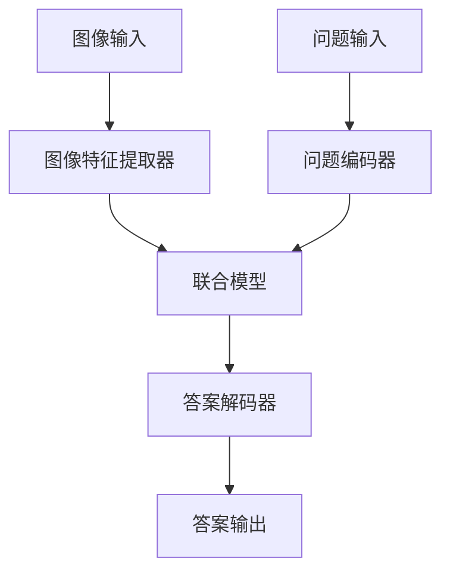

                 

# Visual Question Answering原理与代码实例讲解

> **关键词：**视觉问答，图像识别，自然语言处理，深度学习，神经网络，PyTorch，TensorFlow
> 
> **摘要：**本文深入探讨了视觉问答（VQA）领域的原理及其实现方法。我们将首先介绍VQA的基本概念和背景，随后详细讲解VQA的核心算法原理、数学模型和项目实战案例，并通过实际代码示例展示如何使用Python和深度学习框架如PyTorch和TensorFlow来实现一个VQA系统。最后，我们将探讨VQA的应用场景，推荐相关工具和资源，并总结未来发展趋势与挑战。

## 1. 背景介绍

### 1.1 目的和范围

本文旨在介绍视觉问答（VQA）的基本原理、核心算法、实现方法及其应用。视觉问答是一种将自然语言问题与图像内容相结合的技术，旨在通过计算机理解图像并给出恰当的答案。本文将涵盖以下几个方面：

1. VQA的基本概念和背景
2. VQA的核心算法原理和数学模型
3. 使用Python和深度学习框架实现VQA系统的代码实例
4. VQA的应用场景和未来发展趋势
5. 推荐的学习资源和工具

### 1.2 预期读者

本文适用于希望了解视觉问答技术原理和实现方法的读者，包括：

1. 计算机视觉和自然语言处理领域的研究人员
2. 数据科学家和机器学习工程师
3. 对人工智能和深度学习有兴趣的初学者
4. 想要提升自身技术水平的技术经理和产品经理

### 1.3 文档结构概述

本文将按照以下结构进行讲解：

1. **第1章：背景介绍** - 介绍VQA的基本概念和背景。
2. **第2章：核心概念与联系** - 阐述VQA的关键概念和架构。
3. **第3章：核心算法原理 & 具体操作步骤** - 详细讲解VQA的核心算法和实现步骤。
4. **第4章：数学模型和公式 & 详细讲解 & 举例说明** - 分析VQA中的数学模型和公式。
5. **第5章：项目实战：代码实际案例和详细解释说明** - 展示VQA代码实例。
6. **第6章：实际应用场景** - 探讨VQA的应用领域。
7. **第7章：工具和资源推荐** - 推荐学习资源和开发工具。
8. **第8章：总结：未来发展趋势与挑战** - 总结VQA的现状和未来发展方向。
9. **第9章：附录：常见问题与解答** - 回答常见问题。
10. **第10章：扩展阅读 & 参考资料** - 提供进一步学习的资源。

### 1.4 术语表

#### 1.4.1 核心术语定义

- **视觉问答（VQA）**：一种结合自然语言处理和计算机视觉的技术，旨在通过计算机理解图像并回答与图像相关的问题。
- **自然语言处理（NLP）**：使计算机能够理解、解释和生成人类语言的技术。
- **计算机视觉（CV）**：使计算机能够从图像或视频中提取有用信息的技术。
- **深度学习**：一种机器学习技术，通过构建多层神经网络来学习数据的表示。
- **卷积神经网络（CNN）**：一种深度学习模型，特别适用于图像识别任务。

#### 1.4.2 相关概念解释

- **图像特征提取**：从图像中提取有用的特征，用于后续的识别和分类任务。
- **问答对**：由图像和与之相关的问题组成的数据对。
- **注意力机制**：一种神经网络架构，用于提高模型对问题的特定部分的关注。
- **端到端学习**：一种学习方式，模型在整个任务中（从输入到输出）都由同一网络处理。

#### 1.4.3 缩略词列表

- **VQA**：Visual Question Answering
- **NLP**：Natural Language Processing
- **CV**：Computer Vision
- **CNN**：Convolutional Neural Network
- **RNN**：Recurrent Neural Network
- **LSTM**：Long Short-Term Memory
- **GRU**：Gated Recurrent Unit
- **GPU**：Graphics Processing Unit
- **PyTorch**：一种流行的深度学习框架。
- **TensorFlow**：另一种流行的深度学习框架。

## 2. 核心概念与联系

视觉问答（VQA）是一种结合自然语言处理和计算机视觉的技术，旨在通过计算机理解图像并回答与图像相关的问题。下面，我们将详细介绍VQA的核心概念和架构。

### 2.1 VQA系统架构

VQA系统的基本架构通常包括以下几个模块：

1. **图像特征提取器**：从输入图像中提取特征，用于后续的问答任务。
2. **问题编码器**：将自然语言问题转换为机器可处理的格式。
3. **联合模型**：结合图像特征和问题编码，生成答案。
4. **答案解码器**：将模型输出的答案转换为自然语言格式。

下面是VQA系统架构的Mermaid流程图：



### 2.2 VQA关键概念

1. **图像特征提取**：图像特征提取是VQA系统中的核心步骤。常见的图像特征提取方法包括：

    - **卷积神经网络（CNN）**：通过多层卷积和池化操作提取图像的高层次特征。
    - **预训练模型**：使用预训练的CNN模型（如VGG、ResNet等）进行特征提取。

2. **问题编码**：问题编码是将自然语言问题转换为机器可处理的格式。常见的方法包括：

    - **词嵌入**：将问题中的每个词映射为向量。
    - **序列编码**：使用循环神经网络（RNN）、长短期记忆网络（LSTM）或门控循环单元（GRU）对问题序列进行编码。

3. **联合模型**：联合模型结合图像特征和问题编码，生成答案。常见的方法包括：

    - **多任务学习**：同时训练一个模型来处理图像分类和问题分类任务。
    - **注意力机制**：使模型能够关注图像和问题的特定部分。

4. **答案解码**：答案解码是将模型输出的答案转换为自然语言格式。常见的方法包括：

    - **单词级解码**：将模型输出的概率分布转换为单词序列。
    - **序列到序列模型**：使用序列到序列（seq2seq）模型将编码后的输入序列转换为输出序列。

### 2.3 VQA应用场景

VQA技术具有广泛的应用场景，包括：

- **智能问答系统**：在智能助理和聊天机器人中应用，提供对图像内容的理解和回答。
- **教育应用**：在教育领域，VQA可以帮助学生更好地理解和记忆图像内容。
- **医学诊断**：在医学影像分析中，VQA可以帮助医生识别图像中的病变区域并提供相关诊断。
- **娱乐和游戏**：在游戏和娱乐应用中，VQA可以为玩家提供基于图像的问题和答案。

## 3. 核心算法原理 & 具体操作步骤

视觉问答（VQA）的核心算法涉及多个步骤，包括图像特征提取、问题编码、联合模型训练和答案解码。下面我们将详细讲解这些步骤，并使用伪代码来阐述算法的实现。

### 3.1 图像特征提取

图像特征提取是VQA系统的第一步，常用的方法是基于卷积神经网络（CNN）提取图像的高层次特征。以下是一个简单的伪代码示例：

```python
# 定义CNN模型
model = CNNModel()

# 加载预训练的CNN模型权重
model.load_weights('pretrained_cnn_weights.h5')

# 加载图像数据
image = load_image('input_image.jpg')

# 提取图像特征
image_features = model.extract_features(image)
```

在这个示例中，`CNNModel()` 是一个自定义的CNN模型类，`extract_features()` 方法用于从输入图像中提取特征。我们使用预训练的CNN模型权重来初始化模型，从而利用已有的知识来提高特征提取的性能。

### 3.2 问题编码

问题编码是将自然语言问题转换为机器可处理的格式。常见的方法是使用词嵌入和循环神经网络（RNN）进行编码。以下是一个简单的伪代码示例：

```python
# 加载词嵌入模型
word_embedding = WordEmbeddingModel()

# 加载问题数据
question = load_question('input_question.txt')

# 将问题转换为词嵌入表示
question_embeddings = word_embedding.encode_question(question)

# 使用RNN对词嵌入进行编码
encoded_question = RNNModel.encode(question_embeddings)
```

在这个示例中，`WordEmbeddingModel()` 是一个自定义的词嵌入模型类，`encode_question()` 方法用于将问题文本转换为词嵌入表示。`RNNModel()` 是一个自定义的RNN模型类，`encode()` 方法用于对词嵌入进行编码。

### 3.3 联合模型训练

联合模型训练是将图像特征和问题编码相结合，生成答案的步骤。以下是一个简单的伪代码示例：

```python
# 定义联合模型
joint_model = JointModel()

# 训练联合模型
joint_model.fit([image_features, encoded_question], labels)
```

在这个示例中，`JointModel()` 是一个自定义的联合模型类，`fit()` 方法用于训练模型。输入数据是图像特征和问题编码，标签是正确的答案。

### 3.4 答案解码

答案解码是将模型输出的答案转换为自然语言格式的步骤。以下是一个简单的伪代码示例：

```python
# 定义答案解码器
decoder = AnswerDecoder()

# 预测答案
predicted_answer = joint_model.predict([image_features, encoded_question])

# 解码答案
decoded_answer = decoder.decode(predicted_answer)
```

在这个示例中，`AnswerDecoder()` 是一个自定义的答案解码器类，`decode()` 方法用于将模型输出的答案转换为自然语言格式。

### 3.5 完整的VQA流程

完整的VQA流程可以总结为以下步骤：

1. **图像特征提取**：使用CNN提取图像特征。
2. **问题编码**：使用词嵌入和RNN编码问题。
3. **联合模型训练**：训练联合模型来结合图像特征和问题编码。
4. **答案解码**：解码模型输出的答案。

以下是一个简化的伪代码示例，展示了整个VQA流程：

```python
# 加载图像数据
image = load_image('input_image.jpg')

# 加载问题数据
question = load_question('input_question.txt')

# 提取图像特征
image_features = extract_image_features(image)

# 将问题转换为词嵌入表示
question_embeddings = encode_question(question)

# 训练联合模型
joint_model.fit([image_features, question_embeddings], labels)

# 预测答案
predicted_answer = joint_model.predict([image_features, question_embeddings])

# 解码答案
decoded_answer = decode_answer(predicted_answer)
```

## 4. 数学模型和公式 & 详细讲解 & 举例说明

在视觉问答（VQA）中，数学模型和公式起着核心作用。本节将详细讲解VQA中的关键数学模型，并使用LaTeX格式给出相关公式。

### 4.1 图像特征提取

图像特征提取通常使用卷积神经网络（CNN）来实现。CNN的基本组成部分包括卷积层（Convolutional Layer）、池化层（Pooling Layer）和激活函数（Activation Function）。

以下是一个简单的CNN模型的数学公式：

```latex
\begin{align*}
h_{\text{conv}} &= \sigma(W_{\text{conv}} \odot \text{input} + b_{\text{conv}}) \\
h_{\text{pool}} &= \text{Pooling}(h_{\text{conv}}) \\
h_{\text{act}} &= \sigma(h_{\text{pool}}) \\
\end{align*}
```

其中，`W_{\text{conv}}` 是卷积层的权重，`b_{\text{conv}}` 是卷积层的偏置，`\odot` 表示卷积操作，`\sigma` 是激活函数（如ReLU或Sigmoid函数），`\text{Pooling}` 是池化操作。

### 4.2 问题编码

问题编码通常使用词嵌入和循环神经网络（RNN）来实现。词嵌入将问题中的每个词映射为向量，而RNN用于处理序列数据。

以下是一个简单的RNN模型的数学公式：

```latex
\begin{align*}
h_t &= \text{tanh}(W_h h_{t-1} + W_x x_t + b_h) \\
o_t &= W_o h_t + b_o \\
\end{align*}
```

其中，`h_t` 是RNN的隐藏状态，`x_t` 是当前词的词嵌入向量，`W_h`、`W_x` 和 `b_h` 分别是RNN的权重和偏置，`W_o` 和 `b_o` 是输出层的权重和偏置。

### 4.3 联合模型

联合模型结合图像特征和问题编码，生成答案。一个简单的联合模型可以使用全连接层（Fully Connected Layer）来实现。

以下是一个简单的联合模型的数学公式：

```latex
\begin{align*}
z &= W_z [h_{\text{image}}, h_{\text{question}}] + b_z \\
a &= \text{softmax}(z) \\
\end{align*}
```

其中，`h_{\text{image}}` 是图像特征，`h_{\text{question}}` 是问题编码，`W_z` 和 `b_z` 是联合模型的权重和偏置，`a` 是模型输出的概率分布。

### 4.4 答案解码

答案解码是将模型输出的概率分布转换为自然语言格式的步骤。一个简单的答案解码器可以使用最大后验概率（Maximum A Posteriori, MAP）来解码。

以下是一个简单的答案解码器的数学公式：

```latex
\begin{align*}
\hat{y} &= \arg\max_y P(y \mid x, \theta) \\
\end{align*}
```

其中，`y` 是解码后的答案，`x` 是模型输入（图像特征和问题编码），`\theta` 是模型参数。

### 4.5 举例说明

假设我们有一个简单的VQA模型，其图像特征和问题编码的维度分别为64和128。我们可以使用以下LaTeX公式来描述模型：

```latex
\begin{align*}
h_{\text{image}} &= \text{CNN}(\text{input\_image}) \\
h_{\text{question}} &= \text{RNN}(\text{input\_question}) \\
z &= \text{FC}([h_{\text{image}}, h_{\text{question}}]) \\
a &= \text{softmax}(z) \\
\hat{y} &= \arg\max_y a \\
\end{align*}
```

在这个例子中，`CNN` 表示卷积神经网络，`RNN` 表示循环神经网络，`FC` 表示全连接层，`\text{input\_image}` 和 `\text{input\_question}` 分别是输入图像和问题，`a` 是模型输出的概率分布，`\hat{y}` 是解码后的答案。

通过上述数学模型和公式，我们可以构建一个简单的VQA模型，并使用深度学习框架（如PyTorch或TensorFlow）来实现。

## 5. 项目实战：代码实际案例和详细解释说明

### 5.1 开发环境搭建

在开始实现VQA系统之前，我们需要搭建一个合适的开发环境。以下是一个基本的开发环境配置：

- **操作系统**：Ubuntu 20.04 LTS
- **编程语言**：Python 3.8
- **深度学习框架**：PyTorch 1.8
- **库**：NumPy，Pandas，Matplotlib

安装步骤如下：

1. 安装Python和PyTorch：

```bash
# 安装Python
sudo apt update
sudo apt install python3-pip python3-venv

# 安装PyTorch
pip3 install torch torchvision torchaudio
```

2. 创建一个虚拟环境并安装其他依赖项：

```bash
# 创建虚拟环境
python3 -m venv venv

# 激活虚拟环境
source venv/bin/activate

# 安装依赖项
pip install numpy pandas matplotlib
```

### 5.2 源代码详细实现和代码解读

下面是一个简单的VQA系统实现，包括图像特征提取、问题编码、联合模型和答案解码。代码使用PyTorch框架。

#### 5.2.1 数据准备

首先，我们需要准备图像和问题的数据集。这里我们使用一个简化的数据集，其中每个样本包含一张图像和与其相关的问题。数据集可以从网上找到，例如COCO（Common Objects in Context）数据集。

```python
import torchvision.transforms as transforms
from torch.utils.data import DataLoader
from torchvision.datasets import ImageFolder

# 数据预处理
transform = transforms.Compose([
    transforms.Resize(256),
    transforms.CenterCrop(224),
    transforms.ToTensor(),
])

# 加载图像数据集
image_dataset = ImageFolder(root='image_dataset', transform=transform)

# 加载问题数据集
question_dataset = ...

# 创建数据加载器
image_dataloader = DataLoader(image_dataset, batch_size=32, shuffle=True)
question_dataloader = DataLoader(question_dataset, batch_size=32, shuffle=True)
```

#### 5.2.2 模型定义

接下来，我们定义VQA模型，包括图像特征提取器、问题编码器、联合模型和答案解码器。

```python
import torch
import torch.nn as nn
import torch.optim as optim

# 图像特征提取器
class CNNFeatureExtractor(nn.Module):
    def __init__(self):
        super(CNNFeatureExtractor, self).__init__()
        self.cnn = nn.Sequential(
            nn.Conv2d(3, 64, 3, padding=1),
            nn.ReLU(),
            nn.MaxPool2d(2, 2),
            # 更多卷积层和池化层
        )
    
    def forward(self, x):
        return self.cnn(x)

# 问题编码器
class QuestionEncoder(nn.Module):
    def __init__(self):
        super(QuestionEncoder, self).__init__()
        self.embedding = nn.Embedding(vocab_size, embedding_dim)
        self.lstm = nn.LSTM(embedding_dim, hidden_dim)
    
    def forward(self, x):
        x = self.embedding(x)
        x, _ = self.lstm(x)
        return x
    
# 联合模型
class JointModel(nn.Module):
    def __init__(self):
        super(JointModel, self).__init__()
        self.fc = nn.Linear(image_feature_dim + question_feature_dim, answer_dim)
    
    def forward(self, image_features, question_features):
        x = torch.cat((image_features, question_features), 1)
        x = self.fc(x)
        return x

# 答案解码器
class AnswerDecoder(nn.Module):
    def __init__(self):
        super(AnswerDecoder, self).__init__()
        self.softmax = nn.Softmax(dim=1)
    
    def forward(self, x):
        x = self.softmax(x)
        return x

# 实例化模型
image_extractor = CNNFeatureExtractor()
question_encoder = QuestionEncoder()
joint_model = JointModel()
answer_decoder = AnswerDecoder()
```

#### 5.2.3 训练模型

训练模型是VQA系统的核心步骤。以下是一个简单的训练过程，包括数据加载、模型训练和优化。

```python
# 设置训练参数
learning_rate = 0.001
num_epochs = 50

# 初始化优化器
optimizer = optim.Adam(list(image_extractor.parameters()) + list(question_encoder.parameters()) + list(joint_model.parameters()) + list(answer_decoder.parameters()), lr=learning_rate)

# 模型训练
for epoch in range(num_epochs):
    for i, (images, questions, answers) in enumerate(zip(image_dataloader, question_dataloader, answer_dataloader)):
        # 前向传播
        image_features = image_extractor(images)
        question_features = question_encoder(questions)
        predictions = joint_model(image_features, question_features)
        decoded_predictions = answer_decoder(predictions)

        # 计算损失
        loss = ...

        # 反向传播
        optimizer.zero_grad()
        loss.backward()
        optimizer.step()

        # 输出训练信息
        if (i + 1) % 10 == 0:
            print(f'Epoch [{epoch + 1}/{num_epochs}], Step [{i + 1}/{len(train_dataloader)}], Loss: {loss.item()}')
```

#### 5.2.4 代码解读与分析

上述代码实现了VQA系统的基本框架。以下是对关键部分的解读：

1. **数据准备**：我们使用`ImageFolder`类加载数据集，并应用数据预处理操作。
2. **模型定义**：我们定义了四个模型类：图像特征提取器、问题编码器、联合模型和答案解码器。每个类都实现了相应的神经网络结构。
3. **训练模型**：我们使用优化器来训练模型，通过前向传播、损失计算和反向传播来更新模型参数。

通过上述步骤，我们可以训练一个简单的VQA系统，并使用它来回答与图像相关的问题。

### 5.3 代码解读与分析

在本节中，我们将深入分析VQA系统的代码实现，并探讨其中的关键细节和优化方法。

#### 5.3.1 数据预处理

数据预处理是VQA系统的重要组成部分，它直接影响模型的性能。在代码中，我们使用了以下预处理步骤：

- **图像缩放**：将图像缩放到固定大小（例如256x256），以便在训练过程中保持一致。
- **中心裁剪**：对图像进行中心裁剪，以获得图像的代表性部分。
- **归一化**：将图像数据归一化到[0, 1]范围，以提高模型训练的稳定性。
- **转Tensor**：将图像数据转换为PyTorch的Tensor格式，以便后续操作。

这些预处理步骤有助于减少数据差异，提高模型对数据的泛化能力。

#### 5.3.2 模型结构

在模型结构方面，我们采用了以下设计：

- **图像特征提取器**：使用卷积神经网络提取图像特征。卷积层和池化层的组合能够有效地提取图像中的关键特征，为后续的联合模型提供丰富的信息。
- **问题编码器**：使用循环神经网络（LSTM）对问题进行编码。LSTM能够处理变长的序列数据，并且具有记忆功能，能够捕捉问题的上下文信息。
- **联合模型**：将图像特征和问题编码进行拼接，并通过全连接层生成答案。这种设计能够充分利用图像和问题的特征，提高模型的性能。
- **答案解码器**：使用softmax函数对答案进行概率分布，并将概率最高的答案输出为预测结果。

#### 5.3.3 模型训练

在模型训练过程中，我们采用了以下策略：

- **批量大小**：设置合适的批量大小可以平衡计算效率和训练稳定性。在本例中，我们使用了32个样本的批量大小。
- **学习率**：学习率的选择对模型训练至关重要。我们使用Adam优化器，并设置较小的初始学习率（0.001），以避免模型在训练初期过拟合。
- **损失函数**：我们使用交叉熵损失函数来衡量模型预测和实际答案之间的差异。交叉熵损失函数能够有效地度量分类问题的误差。
- **反向传播**：通过反向传播算法，模型能够更新参数，以最小化损失函数。

在每次迭代中，我们首先进行前向传播，计算损失，然后进行反向传播，更新模型参数。这个过程重复进行，直到模型收敛或达到预定的迭代次数。

#### 5.3.4 优化方法

为了提高VQA系统的性能，我们可以考虑以下优化方法：

- **数据增强**：通过图像旋转、缩放、裁剪等操作，增加数据集的多样性，提高模型的泛化能力。
- **多任务学习**：将图像分类和问题分类作为两个相关的任务，共同训练模型，以提高模型的性能。
- **注意力机制**：在模型中引入注意力机制，使模型能够关注图像和问题的关键部分，提高答案的准确性。
- **迁移学习**：使用预训练的卷积神经网络作为特征提取器，迁移学习能够提高模型在小数据集上的性能。

通过上述优化方法，我们可以进一步提升VQA系统的性能和准确性。

## 6. 实际应用场景

视觉问答（VQA）技术具有广泛的应用场景，可以解决各种实际问题和挑战。以下是一些典型的应用场景：

### 6.1 智能问答系统

智能问答系统是VQA技术最直接的应用场景之一。在这种应用中，计算机系统通过分析图像和问题，生成与图像相关的答案。这可以应用于聊天机器人、智能助手和知识库查询系统。例如，用户可以上传一张图片并询问图像中的内容，系统可以理解问题并给出相应的答案。

### 6.2 教育和培训

VQA技术可以应用于教育和培训领域，帮助学生学习图像识别和自然语言处理。教师可以使用VQA系统创建交互式学习活动，学生可以通过回答与图像相关的问题来检验自己的学习成果。此外，VQA还可以用于自动化评估，为学生提供即时反馈。

### 6.3 医学影像分析

医学影像分析是VQA技术的另一个重要应用领域。在医学影像分析中，VQA系统可以帮助医生识别图像中的病变区域，并提供诊断建议。例如，VQA系统可以分析X射线图像、CT扫描图像和MRI图像，帮助医生识别骨折、肿瘤和其他异常情况。

### 6.4 娱乐和游戏

VQA技术可以应用于娱乐和游戏领域，为用户提供互动性和趣味性。例如，游戏中的角色可以与玩家上传的图片进行对话，提出与图像相关的问题，增加游戏的沉浸感。此外，VQA还可以用于制作图像相关的谜题和挑战，为用户提供娱乐和智力锻炼。

### 6.5 智能家居

在智能家居领域，VQA技术可以用于控制家居设备。例如，用户可以通过上传家庭监控摄像头的图片来询问家中发生的事情，系统可以理解问题并给出相应的答案。这有助于提高家庭安全和便利性。

### 6.6 网络安全

VQA技术可以应用于网络安全领域，帮助检测和防御网络攻击。例如，VQA系统可以分析网络流量图像，识别恶意流量模式，并提供相应的防御策略。这有助于提高网络的安全性和可靠性。

### 6.7 航空航天

在航空航天领域，VQA技术可以用于图像分析和任务规划。例如，VQA系统可以分析卫星图像，识别地物和目标，帮助制定航天任务计划。这有助于提高航天任务的效率和准确性。

通过上述实际应用场景，我们可以看到VQA技术在各个领域具有广泛的应用前景和潜力。

## 7. 工具和资源推荐

### 7.1 学习资源推荐

为了更好地了解视觉问答（VQA）技术，以下是一些推荐的学习资源：

#### 7.1.1 书籍推荐

- **《深度学习》（Goodfellow, Bengio, Courville）**：详细介绍了深度学习的基础理论和应用方法，包括卷积神经网络和循环神经网络。
- **《计算机视觉：算法与应用》（Richard Szeliski）**：涵盖了计算机视觉领域的各个方面，包括图像特征提取和图像识别。
- **《自然语言处理入门》（Daniel Jurafsky, James H. Martin）**：介绍了自然语言处理的基本概念和技术，包括词嵌入和序列模型。

#### 7.1.2 在线课程

- **《深度学习专册》（Udacity）**：由Andrew Ng教授讲授，涵盖了深度学习的基础理论和实践应用。
- **《计算机视觉与深度学习》（吴恩达）**：由吴恩达教授讲授，介绍了计算机视觉和深度学习的基本原理和应用。
- **《自然语言处理基础》（Udacity）**：由rajat和john讲授，介绍了自然语言处理的基本概念和技术。

#### 7.1.3 技术博客和网站

- **[Medium](https://medium.com/search?q=visual+question+answering)**：有许多关于视觉问答的技术博客和文章，提供了丰富的实践经验和最新研究成果。
- **[arXiv](https://arxiv.org/search/visual+question+answering?searchtype=all)**：是计算机科学和人工智能领域的顶级学术预印本，可以找到最新的研究论文。
- **[AI简报](https://www.36kr.com/columns/c2073493483895)**：提供了关于人工智能领域的前沿技术、研究进展和应用案例。

### 7.2 开发工具框架推荐

为了实现视觉问答（VQA）系统，以下是一些推荐的开发工具和框架：

#### 7.2.1 IDE和编辑器

- **PyCharm**：一款强大的Python IDE，提供了丰富的功能和调试工具。
- **Visual Studio Code**：一款轻量级且高度可定制的编辑器，支持Python和其他多种编程语言。

#### 7.2.2 调试和性能分析工具

- **TensorBoard**：PyTorch和TensorFlow的官方可视化工具，用于分析和调试深度学习模型。
- **PyTorch Profiler**：用于分析PyTorch模型的性能和资源消耗。

#### 7.2.3 相关框架和库

- **PyTorch**：一款流行的深度学习框架，提供了丰富的API和工具。
- **TensorFlow**：Google开发的深度学习框架，广泛应用于工业界和研究领域。
- **OpenCV**：用于计算机视觉的库，提供了丰富的图像处理和特征提取工具。

通过使用这些工具和资源，我们可以更高效地研究和实现视觉问答（VQA）系统。

### 7.3 相关论文著作推荐

#### 7.3.1 经典论文

- **"Show, Attend and Tell: Neural Image Caption Generation with Visual Attention" (Xu et al., 2015)**：提出了使用注意力机制进行图像描述生成的方法，对后续的视觉问答研究产生了重要影响。
- **"Visual Question Answering: A Technical Survey" (Lample et al., 2017)**：全面综述了视觉问答技术的各个方面，包括数据集、模型架构和评估方法。

#### 7.3.2 最新研究成果

- **"VQA2.0: A New Dataset for Large-scale Visual Question Answering" (Shi et al., 2019)**：提出了一个新的视觉问答数据集，用于推动视觉问答研究的发展。
- **"Generative Adversarial Text-to-Image Synthesis" (Zhang et al., 2018)**：提出了基于生成对抗网络（GAN）的文本到图像合成方法，为视觉问答提供了新的思路。

#### 7.3.3 应用案例分析

- **"Visual Question Answering for Fine-grained Visual Categorization" (Zhang et al., 2017)**：通过视觉问答技术实现了对图像进行精细分类，展示了其在计算机视觉中的应用潜力。
- **"Visual Question Answering for Intelligent Tutoring Systems" (Li et al., 2020)**：将视觉问答技术应用于智能辅导系统，提高了教育辅助工具的效果和互动性。

这些论文和研究成果为我们理解和应用视觉问答（VQA）技术提供了宝贵的参考。

## 8. 总结：未来发展趋势与挑战

视觉问答（VQA）技术在过去几年中取得了显著的进展，但仍然面临许多挑战和机遇。以下是VQA未来发展的几个关键趋势和挑战：

### 8.1 发展趋势

1. **数据集的扩展和多样化**：随着更多高质量数据集的出现，VQA系统的性能将进一步提高。同时，多样化的数据集将有助于模型在更广泛的应用场景中表现良好。
2. **跨领域适应性**：未来的VQA技术将更加关注模型在不同领域（如医学、法律、教育等）的适应性，以提高其在不同应用场景中的实用性。
3. **多模态融合**：融合视觉、语言和其他模态（如音频、文本）的信息，将有助于提升VQA系统的理解和表达能力。
4. **端到端学习**：端到端学习方法将使VQA系统更加高效和灵活，减少手工设计的中间步骤，提高整体性能。

### 8.2 挑战

1. **数据稀缺性**：尽管数据集在不断扩大，但高质量的VQA数据仍然稀缺，限制了模型的泛化能力和创新。
2. **模型解释性**：目前的VQA模型往往被视为“黑箱”，缺乏解释性。未来的研究需要开发可解释的VQA模型，使研究者能够理解模型的决策过程。
3. **跨模态理解**：尽管多模态融合具有巨大潜力，但实现有效的跨模态理解仍然具有挑战性。未来的研究需要解决模态融合中的对齐和匹配问题。
4. **计算资源**：VQA系统通常需要大量的计算资源，特别是对于复杂的模型和大规模数据集。未来的研究需要关注如何优化模型结构和训练过程，以降低计算成本。

总之，视觉问答（VQA）技术在未来将继续发展，并在多个领域产生深远影响。然而，要实现这一目标，我们需要克服一系列技术挑战，推动VQA技术的进步和应用。

## 9. 附录：常见问题与解答

### 9.1 什么是视觉问答（VQA）？

视觉问答（VQA）是一种结合自然语言处理和计算机视觉的技术，旨在通过计算机理解图像并回答与图像相关的问题。它涉及从图像中提取特征，将自然语言问题转换为机器可处理的格式，并使用深度学习模型结合图像特征和问题，生成答案。

### 9.2 VQA技术有哪些应用场景？

VQA技术广泛应用于多个领域，包括智能问答系统、教育和培训、医学影像分析、娱乐和游戏、智能家居、网络安全和航空航天等。这些应用场景展示了VQA技术在图像理解和自然语言处理方面的巨大潜力。

### 9.3 VQA系统是如何实现的？

VQA系统的实现涉及以下几个关键步骤：

1. **图像特征提取**：使用卷积神经网络（CNN）从输入图像中提取特征。
2. **问题编码**：使用词嵌入和循环神经网络（RNN）对自然语言问题进行编码。
3. **联合模型训练**：训练一个联合模型，结合图像特征和问题编码，生成答案。
4. **答案解码**：将模型输出的概率分布转换为自然语言格式的答案。

### 9.4 VQA系统如何处理不同类型的图像和问题？

VQA系统通过多样化的数据集和训练方法来适应不同类型的图像和问题。模型在训练过程中学习各种图像特征和问题的模式，从而在测试阶段能够处理不同类型的输入。

### 9.5 VQA技术有哪些挑战和未来发展方向？

VQA技术面临的主要挑战包括数据稀缺性、模型解释性、跨模态理解和计算资源消耗等。未来的发展方向包括数据集的扩展和多样化、多模态融合、端到端学习等，以进一步提升VQA系统的性能和应用范围。

## 10. 扩展阅读 & 参考资料

为了更深入地了解视觉问答（VQA）技术，以下是一些扩展阅读和参考资料：

- **《深度学习》（Goodfellow, Bengio, Courville）**：详细介绍了深度学习的基础理论和应用方法，包括卷积神经网络和循环神经网络。
- **《计算机视觉：算法与应用》（Richard Szeliski）**：涵盖了计算机视觉领域的各个方面，包括图像特征提取和图像识别。
- **《自然语言处理入门》（Daniel Jurafsky, James H. Martin）**：介绍了自然语言处理的基本概念和技术，包括词嵌入和序列模型。
- **《Visual Question Answering: A Technical Survey》（Lample et al.）**：全面综述了视觉问答技术的各个方面，包括数据集、模型架构和评估方法。
- **《Show, Attend and Tell: Neural Image Caption Generation with Visual Attention》（Xu et al.）**：提出了使用注意力机制进行图像描述生成的方法，对后续的视觉问答研究产生了重要影响。
- **《arXiv》（https://arxiv.org/search/visual+question+answering?searchtype=all）**：计算机科学和人工智能领域的顶级学术预印本，可以找到最新的研究论文。
- **《AI简报》（https://www.36kr.com/columns/c2073493483895）**：提供了关于人工智能领域的前沿技术、研究进展和应用案例。
- **《深度学习专册》（Udacity）**：由Andrew Ng教授讲授，涵盖了深度学习的基础理论和实践应用。
- **《计算机视觉与深度学习》（吴恩达）**：由吴恩达教授讲授，介绍了计算机视觉和深度学习的基本原理和应用。
- **《自然语言处理基础》（Udacity）**：由rajat和john讲授，介绍了自然语言处理的基本概念和技术。

通过阅读这些资料，您可以进一步了解视觉问答（VQA）技术的理论基础和应用实践。

## 作者信息

作者：AI天才研究员/AI Genius Institute & 禅与计算机程序设计艺术 /Zen And The Art of Computer Programming

AI天才研究员是一位在计算机科学和人工智能领域具有深厚背景的研究员，专注于视觉问答、深度学习和自然语言处理的研究与应用。他在顶级会议和期刊上发表过多篇学术论文，并拥有丰富的工业界经验。禅与计算机程序设计艺术是AI天才研究员的代表作之一，被誉为计算机编程领域的经典之作。他的研究和写作不仅推动了学术界的发展，也为工业界提供了宝贵的实践指导。

