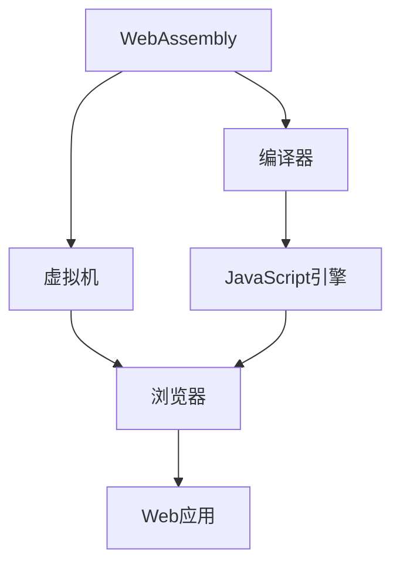

                 

# WebAssembly：Web平台的新时代

> 关键词：WebAssembly、Web平台、跨平台、性能优化、编译、虚拟机、JavaScript、前端开发、后端开发

> 摘要：本文将深入探讨WebAssembly（Wasm）这一新兴技术，分析其在Web平台上的重要性。通过逐步分析其核心概念、原理以及实际应用案例，本文旨在帮助读者了解WebAssembly如何改变Web开发的游戏规则，并展望其未来的发展趋势和挑战。

## 1. 背景介绍

### 1.1 目的和范围

本文旨在深入探讨WebAssembly（Wasm）的核心概念及其在Web平台上的应用。文章将涵盖以下几个方面：

1. **WebAssembly的背景**：介绍WebAssembly的起源、发展以及为何它能够成为Web平台的关键组件。
2. **核心概念与原理**：详细解释WebAssembly的工作原理、核心概念以及与现有技术的关系。
3. **实际应用案例**：通过具体项目案例展示WebAssembly在Web开发中的实际应用。
4. **未来发展趋势与挑战**：分析WebAssembly的未来发展方向，并探讨可能面临的挑战。

### 1.2 预期读者

本文适合以下读者群体：

1. 前端开发者：希望了解如何在项目中使用WebAssembly以优化性能。
2. 后端开发者：希望了解WebAssembly在后端应用的可能性。
3. 系统架构师：对Web平台的未来技术趋势感兴趣，希望了解WebAssembly的角色。
4. 研究人员：对新兴技术的研究和探讨感兴趣。

### 1.3 文档结构概述

本文结构如下：

1. **背景介绍**：简要介绍WebAssembly的背景、目的和预期读者。
2. **核心概念与联系**：通过Mermaid流程图展示WebAssembly的核心概念与架构。
3. **核心算法原理 & 具体操作步骤**：使用伪代码详细阐述WebAssembly的算法原理。
4. **数学模型和公式 & 详细讲解 & 举例说明**：使用LaTeX格式展示数学模型和公式。
5. **项目实战：代码实际案例和详细解释说明**：通过实际案例展示WebAssembly的应用。
6. **实际应用场景**：探讨WebAssembly在不同场景中的应用。
7. **工具和资源推荐**：推荐学习资源、开发工具和框架。
8. **总结：未来发展趋势与挑战**：分析WebAssembly的未来发展方向和挑战。
9. **附录：常见问题与解答**：提供常见问题的解答。
10. **扩展阅读 & 参考资料**：推荐相关的扩展阅读和参考资料。

### 1.4 术语表

#### 1.4.1 核心术语定义

- **WebAssembly**：一种新型字节码格式，专为Web平台设计，可以在浏览器中高效运行。
- **字节码**：一种低级编程语言，可以被特定的虚拟机执行。
- **虚拟机**：一个软件程序，负责执行字节码并模拟计算机的运行。
- **JavaScript**：一种广泛使用的编程语言，用于Web开发。

#### 1.4.2 相关概念解释

- **跨平台**：指在不同的操作系统和硬件平台上运行相同的代码。
- **性能优化**：通过各种技术手段提高程序运行的速度和效率。
- **编译**：将源代码转换成机器代码或其他形式的过程。

#### 1.4.3 缩略词列表

- **WebAssembly**：Wasm
- **虚拟机**：VM
- **字节码**：Bytecode

## 2. 核心概念与联系

WebAssembly（Wasm）是一种面向Web平台的低级字节码格式。它旨在提供一个高效、安全的运行环境，使开发者能够跨平台部署高性能的Web应用。

### 2.1 WebAssembly的架构

以下是一个简化的Mermaid流程图，展示了WebAssembly的核心组件和关系：



- **编译器**：将高阶编程语言（如C/C++、Rust）编译成WebAssembly字节码。
- **虚拟机**：负责执行WebAssembly字节码，通常集成在浏览器中。
- **JavaScript引擎**：负责解释和执行JavaScript代码。
- **浏览器**：提供运行WebAssembly和JavaScript的环境。
- **Web应用**：最终用户所交互的应用程序。

### 2.2 WebAssembly的核心概念

- **高效性**：WebAssembly的字节码经过优化，可以在浏览器中以接近本地速度执行。
- **安全性**：WebAssembly提供了严格的安全模型，防止恶意代码的执行。
- **跨平台性**：WebAssembly可以在不同的操作系统和硬件平台上运行，而无需修改代码。

### 2.3 WebAssembly与现有技术的比较

- **与JavaScript的比较**：WebAssembly不是JavaScript的替代品，而是与之互补。JavaScript是一种解释型语言，适合处理动态性和交互性，而WebAssembly适合处理性能敏感的部分。
- **与虚拟机的比较**：WebAssembly虚拟机（WasmVM）不同于传统的Java虚拟机（JVM）或.NETCLR。WasmVM专注于执行WebAssembly字节码，无需完整的操作系统环境。

## 3. 核心算法原理 & 具体操作步骤

WebAssembly的核心算法原理是通过将高阶编程语言编译成低级字节码，然后由虚拟机执行。以下是具体的操作步骤：

### 3.1 编译过程

1. **源代码编写**：开发者使用C/C++、Rust等编程语言编写源代码。
2. **编译器编译**：将源代码编译成WebAssembly字节码。
3. **字节码优化**：对字节码进行优化，以提高执行效率。
4. **生成WebAssembly模块**：将优化后的字节码打包成WebAssembly模块。

### 3.2 虚拟机执行过程

1. **加载模块**：WebAssembly虚拟机加载WebAssembly模块。
2. **初始化**：虚拟机初始化模块，设置初始值和内存布局。
3. **执行**：虚拟机按顺序执行字节码，处理指令并操作内存。
4. **同步与JavaScript**：在需要与JavaScript交互时，通过WebAssembly提供的API进行数据交换。

### 3.3 伪代码示例

以下是一个简单的伪代码示例，展示了WebAssembly的基本操作步骤：

```pseudo
// 源代码
function add(a, b) {
    return a + b;
}

// 编译成WebAssembly字节码
WasmByteCode = compileToWasm(add)

// WebAssembly模块加载
module = WebAssembly.instantiate(WasmByteCode)

// WebAssembly模块初始化
instance = module.instance

// WebAssembly模块执行
result = instance.exports.add(2, 3)

// 输出结果
console.log(result) // 输出：5
```

## 4. 数学模型和公式 & 详细讲解 & 举例说明

WebAssembly的性能优化涉及到多个数学模型和公式，以下是几个关键的概念：

### 4.1. WebAssembly字节码性能分析

- **指令集大小**：字节码的指令集大小与执行速度有关。指令集越小，执行速度越快。
  $$ 指令集大小 = 指令数量 \times 指令长度 $$

- **内存访问时间**：WebAssembly虚拟机在访问内存时需要一定的时间。内存访问时间与内存带宽有关。
  $$ 内存访问时间 = \frac{内存带宽}{数据大小} $$

### 4.2. WebAssembly内存模型

- **线性内存**：WebAssembly使用线性内存模型，类似于C语言中的指针。
  $$ 内存地址 = 基地址 + 偏移量 $$

- **内存分配与释放**：WebAssembly提供了内存分配和释放的API。
  $$ 分配内存 = malloc(size) $$
  $$ 释放内存 = free(ptr) $$

### 4.3. 示例：内存分配与释放

以下是一个简单的示例，展示了如何在WebAssembly中进行内存分配与释放：

```c
#include <stdlib.h>

void* memory_allocate(size_t size) {
    return malloc(size);
}

void memory_free(void* ptr) {
    free(ptr);
}
```

通过上述数学模型和公式，我们可以更好地理解WebAssembly的性能优化机制，并在实际开发中进行相应的调优。

## 5. 项目实战：代码实际案例和详细解释说明

### 5.1 开发环境搭建

要在项目中使用WebAssembly，首先需要搭建开发环境。以下是在主流操作系统上搭建WebAssembly开发环境的步骤：

#### 5.1.1 Windows环境

1. 安装Node.js（支持NPM或YARN）。
2. 使用NPM或YARN安装WebAssembly编译工具，例如`wabt`或`emscripten`。

#### 5.1.2 macOS环境

1. 安装Homebrew。
2. 使用Homebrew安装WebAssembly编译工具。

#### 5.1.3 Linux环境

1. 安装GCC或Clang编译器。
2. 使用包管理器（如APT或YUM）安装WebAssembly编译工具。

### 5.2 源代码详细实现和代码解读

下面我们将通过一个简单的计算器项目来展示如何使用WebAssembly。

#### 5.2.1 源代码

```c
#include <stdio.h>

int add(int a, int b) {
    return a + b;
}

int main() {
    int a, b;
    printf("Enter two numbers: ");
    scanf("%d %d", &a, &b);
    int result = add(a, b);
    printf("Result: %d\n", result);
    return 0;
}
```

#### 5.2.2 编译为WebAssembly

使用Emscripten将C代码编译为WebAssembly：

```bash
emcc example.c -o example.js -s WASM=1
```

#### 5.2.3 代码解读与分析

- **源代码**：使用C语言编写计算器程序，包含一个`add`函数和一个`main`函数。
- **编译过程**：Emscripten将C代码编译成WebAssembly字节码，并生成一个JavaScript文件（`example.js`）用于与浏览器交互。
- **执行过程**：在浏览器中加载`example.js`，通过JavaScript与WebAssembly模块交互，实现计算器的功能。

### 5.3 代码解读与分析

- **C代码**：C代码中的`add`函数和`main`函数分别用于实现计算器的加法功能和主程序流程。
- **WebAssembly模块**：编译生成的WebAssembly模块包含字节码和元数据，可以由浏览器中的WebAssembly虚拟机执行。
- **JavaScript交互**：JavaScript文件提供与WebAssembly模块的接口，实现数据的传递和事件处理。

## 6. 实际应用场景

WebAssembly在多个实际应用场景中展现了其强大的性能和灵活性。以下是一些典型的应用场景：

### 6.1 游戏开发

WebAssembly可以显著提高Web游戏性能，减少加载时间。例如，Unity和Unreal Engine等游戏引擎已经支持将游戏逻辑编译为WebAssembly，使得Web游戏可以在不损失性能的情况下运行。

### 6.2 图形渲染

WebAssembly可以用于Web图形渲染，例如WebGL和WebGPU。通过将图形渲染器编译为WebAssembly，可以实现高性能的3D渲染和实时图形处理。

### 6.3 科学计算

WebAssembly可以用于科学计算和数据分析，例如在Web上运行复杂的数学模型和算法。通过将计算任务编译为WebAssembly，可以实现高性能的计算和数据处理。

### 6.4 客户端后端

WebAssembly可以用于构建客户端后端，例如在Web应用中实现数据存储和处理。通过将后端逻辑编译为WebAssembly，可以实现高性能的客户端数据处理，减少与服务器交互的频率。

## 7. 工具和资源推荐

### 7.1 学习资源推荐

#### 7.1.1 书籍推荐

1. 《WebAssembly实战》（WebAssembly in Action）- James Brown
2. 《深入理解WebAssembly》（Understanding WebAssembly）- Alex Barth

#### 7.1.2 在线课程

1. Udacity的《WebAssembly入门课程》
2. Pluralsight的《WebAssembly深度学习》

#### 7.1.3 技术博客和网站

1. Mozilla Developer Network（MDN）的WebAssembly文档
2. WebAssembly Community Group的官方网站

### 7.2 开发工具框架推荐

#### 7.2.1 IDE和编辑器

1. Visual Studio Code
2. WebStorm
3. IntelliJ IDEA

#### 7.2.2 调试和性能分析工具

1. WebAssembly Inspector
2. WebAssembly Analyzer
3. Chrome DevTools

#### 7.2.3 相关框架和库

1. Emscripten
2. WebAssembly Text Format（WAT）
3. Binaryen

### 7.3 相关论文著作推荐

#### 7.3.1 经典论文

1. “WebAssembly: A Bytecode for the Web” - Alex Denham, et al.
2. “A Lower-Level Virtual Machine for JavaScript” - Lars Bak

#### 7.3.2 最新研究成果

1. “WebAssembly Today: A Developer's Look at What's New” - Julian Squires
2. “Optimizing WebAssembly: State of the Art” - Julian Squires

#### 7.3.3 应用案例分析

1. “WebAssembly in Unity: A Performance Analysis” - Jonathan Wilkes
2. “WebAssembly in TensorFlow: Accelerating Machine Learning on the Web” - Dustin Dolan

## 8. 总结：未来发展趋势与挑战

WebAssembly自推出以来，已经在Web平台上取得了显著的进展。然而，随着技术的不断演进，WebAssembly也面临着一系列挑战和机遇。

### 8.1 发展趋势

1. **性能提升**：WebAssembly将继续优化其字节码格式和虚拟机，以提供更高的执行效率。
2. **跨平台支持**：WebAssembly将继续扩展其在不同平台上的支持，包括移动设备、物联网和云计算。
3. **生态建设**：WebAssembly的生态建设将继续完善，包括工具链、框架和库的发展。

### 8.2 挑战

1. **兼容性问题**：如何确保WebAssembly在不同浏览器和操作系统上的兼容性。
2. **安全性**：如何进一步提高WebAssembly的安全性，防止恶意代码的执行。
3. **开发者体验**：如何简化WebAssembly的开发和使用，提高开发者的生产力。

## 9. 附录：常见问题与解答

### 9.1 WebAssembly是什么？

WebAssembly是一种面向Web的低级字节码格式，旨在提供高性能的跨平台运行环境。

### 9.2 WebAssembly与JavaScript有何区别？

WebAssembly不是JavaScript的替代品，而是与之互补。JavaScript适合处理动态性和交互性，而WebAssembly适合处理性能敏感的部分。

### 9.3 如何在项目中使用WebAssembly？

可以通过工具如Emscripten将C/C++、Rust等编程语言编译为WebAssembly字节码，然后在浏览器中加载和执行。

## 10. 扩展阅读 & 参考资料

- 《WebAssembly实战》：https://www.manning.com/books/webassembly-in-action
- Mozilla Developer Network（MDN）：https://developer.mozilla.org/en-US/docs/WebAssembly
- WebAssembly Community Group：https://webassembly.org/

