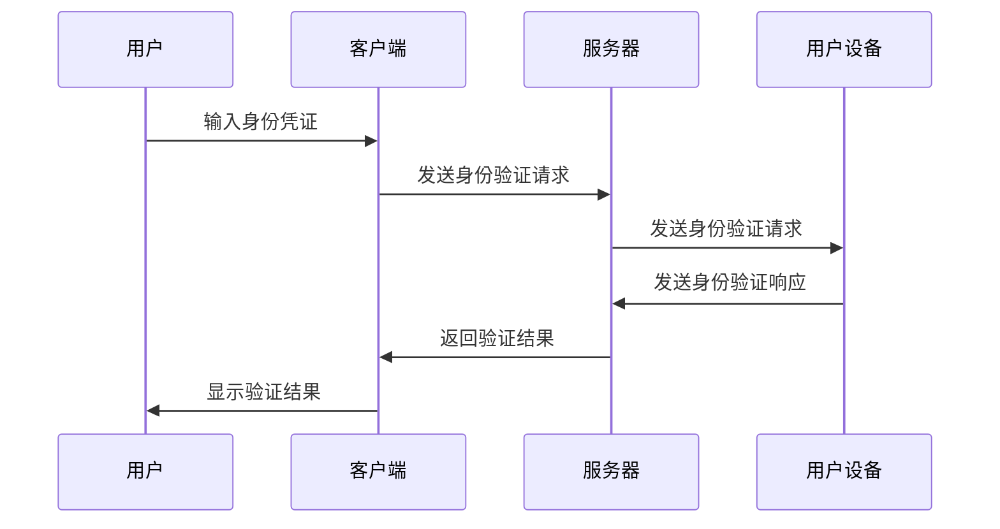
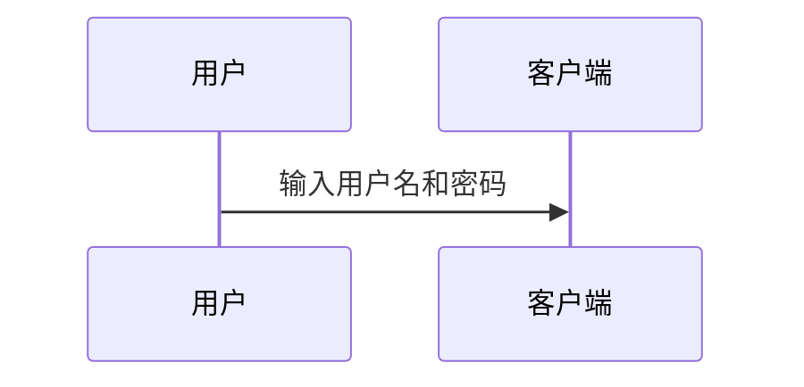
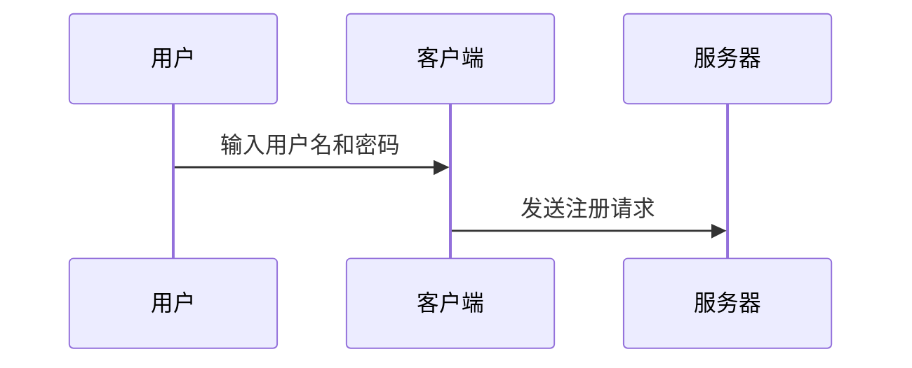
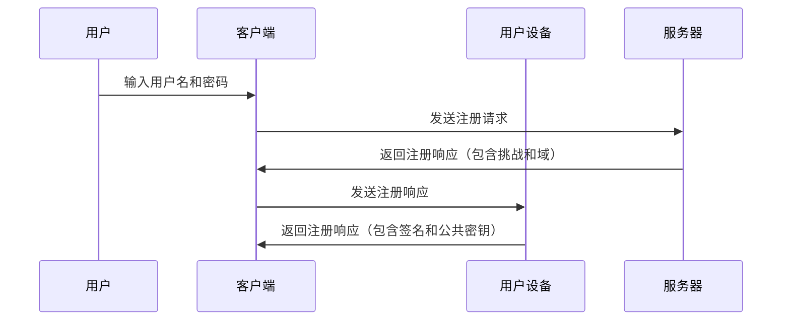
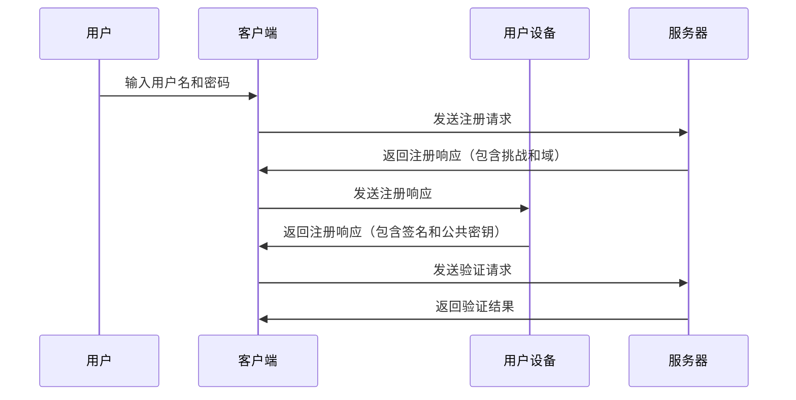
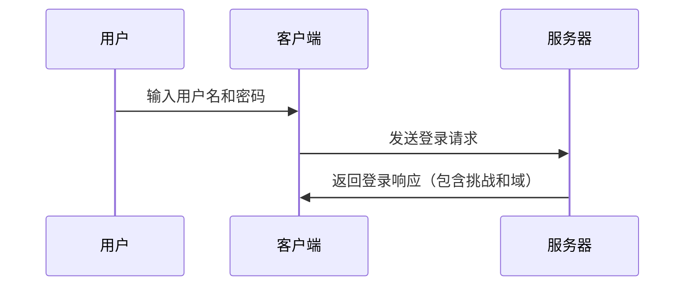

                 


# WebAuthn：消除密码依赖

> **关键词**：WebAuthn、身份验证、无密码登录、安全、便捷、标准协议

> **摘要**：本文将深入探讨WebAuthn技术，它是一种新兴的身份验证协议，旨在替代传统的密码登录方式，为用户提供更安全、便捷的在线体验。通过分析其核心概念、原理和实现，我们将展示如何通过WebAuthn技术消除对密码的依赖，从而提升网络安全性和用户体验。

## 1. 背景介绍

### 1.1 目的和范围

本文的主要目的是介绍WebAuthn技术，并探讨其在消除密码依赖、提升网络安全性和用户体验方面的应用。通过详细分析WebAuthn的核心概念、原理和实现，我们希望能够帮助读者更好地理解和应用这一技术。

### 1.2 预期读者

本文面向对网络安全和身份验证技术有一定了解的IT从业者，特别是前端开发人员、安全工程师和架构师。同时，对希望了解新兴技术发展趋势的广大技术爱好者也具有一定的参考价值。

### 1.3 文档结构概述

本文分为十个部分，具体结构如下：

1. **背景介绍**：介绍本文的目的、预期读者以及文档结构。
2. **核心概念与联系**：介绍WebAuthn技术的核心概念、原理和架构。
3. **核心算法原理 & 具体操作步骤**：详细阐述WebAuthn的核心算法原理和实现步骤。
4. **数学模型和公式 & 详细讲解 & 举例说明**：分析WebAuthn中的数学模型和公式，并给出具体例子。
5. **项目实战：代码实际案例和详细解释说明**：通过实际代码案例展示WebAuthn的应用。
6. **实际应用场景**：分析WebAuthn在不同场景中的应用。
7. **工具和资源推荐**：推荐学习资源和开发工具。
8. **总结：未来发展趋势与挑战**：展望WebAuthn技术的未来发展趋势和面临的挑战。
9. **附录：常见问题与解答**：回答读者可能关心的问题。
10. **扩展阅读 & 参考资料**：提供进一步阅读的参考资料。

### 1.4 术语表

#### 1.4.1 核心术语定义

- **WebAuthn**：一种由W3C（万维网联盟）制定的身份验证协议，旨在提供安全、便捷的在线身份验证方式。
- **生物特征识别**：通过分析个体生理或行为特征进行身份验证的技术，如指纹、面部识别等。
- **身份验证因子**：用于验证用户身份的证据，包括密码、生物特征、硬件令牌等。
- **令牌**：用于身份验证的硬件或软件设备，如USB安全密钥、手机等。

#### 1.4.2 相关概念解释

- **单一登录（SSO）**：允许用户使用一个账户和密码访问多个系统和服务。
- **多因素认证（MFA）**：结合两种或两种以上身份验证因子进行身份验证。
- **密码重用**：用户在不同网站和服务中使用相同的密码。

#### 1.4.3 缩略词列表

- **W3C**：万维网联盟（World Wide Web Consortium）
- **OAuth**：开放授权协议（Open Authorization）
- **FIDO**：快速身份验证开放联盟（Fast Identity Online）

## 2. 核心概念与联系

### 2.1 WebAuthn概述

WebAuthn是一种基于Web的身份验证协议，旨在提供安全、便捷的在线身份验证方式。它由W3C（万维网联盟）制定，旨在替代传统的密码登录方式，以减少密码重用、弱密码和密码泄露等安全问题。WebAuthn的核心思想是利用生物特征识别、硬件令牌等技术，实现多因素认证（MFA）。

### 2.2 WebAuthn核心概念

- **注册过程**：用户在首次使用WebAuthn服务时，需要通过令牌（如USB安全密钥、手机等）进行注册，生成用户身份凭证。
- **登录过程**：用户在登录时，需要使用已注册的令牌进行身份验证，系统根据用户提供的身份凭证和令牌信息进行验证。
- **令牌管理**：用户可以管理已注册的令牌，包括添加、删除和更新令牌。

### 2.3 WebAuthn架构

WebAuthn架构主要包括客户端（浏览器）、服务器和用户设备三部分。其中，客户端负责发起身份验证请求，服务器负责处理身份验证请求，用户设备负责提供身份凭证。

#### 2.3.1 客户端

客户端（浏览器）负责收集用户输入的身份凭证，如用户名、密码、生物特征等，并将其发送到服务器。同时，客户端还负责生成身份验证请求，将请求发送到用户设备。

#### 2.3.2 服务器

服务器负责处理客户端发送的身份验证请求，根据用户身份凭证和令牌信息进行验证，并返回验证结果。

#### 2.3.3 用户设备

用户设备负责提供身份凭证，如生物特征、硬件令牌等。用户设备根据客户端发送的请求，生成身份验证响应，并将其发送到服务器。

### 2.4 WebAuthn与现有技术的联系

- **与OAuth的联系**：WebAuthn可以与OAuth结合使用，实现单一登录（SSO）功能。OAuth负责授权，WebAuthn负责身份验证。
- **与生物特征识别的联系**：WebAuthn支持多种生物特征识别技术，如指纹、面部识别等，以提高身份验证的安全性。
- **与多因素认证的联系**：WebAuthn通过结合多种身份验证因子，实现多因素认证（MFA），提高身份验证的可靠性。

### 2.5 WebAuthn架构的 Mermaid 流程图



## 3. 核心算法原理 & 具体操作步骤

### 3.1 注册过程

WebAuthn的注册过程主要包括以下几个步骤：

#### 3.1.1 用户输入身份凭证

用户在首次使用WebAuthn服务时，需要在客户端输入身份凭证，如用户名、密码等。



#### 3.1.2 客户端生成注册请求

客户端根据用户输入的身份凭证，生成注册请求，并将其发送到服务器。



#### 3.1.3 服务器响应注册请求

服务器接收客户端发送的注册请求，并生成注册响应，包含挑战（challenge）和域（domain）信息。


#### 3.1.4 用户设备生成注册响应

用户设备根据客户端发送的注册响应，生成注册响应，包含签名（signature）和公共密钥（public key）。



#### 3.1.5 客户端验证注册响应

客户端接收用户设备返回的注册响应，并验证签名和公共密钥的有效性。



### 3.2 登录过程

WebAuthn的登录过程主要包括以下几个步骤：

#### 3.2.1 用户输入身份凭证

用户在登录时，需要在客户端输入身份凭证，如用户名、密码等。


#### 3.2.2 客户端生成登录请求

客户端根据用户输入的身份凭证，生成登录请求，并将其发送到服务器。


#### 3.2.3 服务器响应登录请求

服务器接收客户端发送的登录请求，并生成登录响应，包含挑战（challenge）和域（domain）信息。



#### 3.2.4 用户设备生成登录响应

用户设备根据客户端发送的登录响应，生成登录响应，包含签名（signature）和公共密钥（public key）。


#### 3.2.5 客户端验证登录响应

客户端接收用户设备返回的登录响应，并验证签名和公共密钥的有效性。


## 4. 数学模型和公式 & 详细讲解 & 举例说明

### 4.1 数学模型

WebAuthn中的数学模型主要涉及密码学中的椭圆曲线加密算法（ECDSA）和哈希函数。以下是相关的数学模型和公式：

#### 4.1.1 椭圆曲线加密算法（ECDSA）

椭圆曲线加密算法（ECDSA）是一种公钥加密算法，用于生成签名和验证签名。ECDSA的核心公式如下：

- **椭圆曲线方程**：
  $$ y^2 = x^3 + ax + b \pmod{p} $$
  其中，$p$ 是一个大素数，$a$ 和 $b$ 是常数。

- **私钥生成**：
  选择一个随机数 $k$，计算公钥 $Q = kG$，其中 $G$ 是椭圆曲线上的生成元。

- **签名生成**：
  - 选择一个随机数 $k$。
  - 计算挑战值 $r = H(m || s) \pmod{n}$。
  - 计算签名值 $s = (k^{-1})(r + dx) \pmod{n}$。

#### 4.1.2 哈希函数

WebAuthn中使用哈希函数对数据进行加密和验证。常用的哈希函数包括SHA-256和SHA-3。哈希函数的公式如下：

- **SHA-256**：
  $$ Hash = SHA256(message) $$

- **SHA-3**：
  $$ Hash = SHA3-256(message) $$

### 4.2 举例说明

假设用户A想要使用WebAuthn登录某网站B，以下是一个具体的例子：

#### 4.2.1 用户A注册

1. 用户A在网站B上创建账户，并输入用户名和密码。
2. 网站B生成一个挑战值 $challenge$ 和域 $domain$。
3. 用户A的浏览器生成一个私钥 $d$，并使用私钥生成公钥 $Q = dG$。
4. 用户A的浏览器将公钥发送给网站B。
5. 网站B将公钥存储在数据库中。

#### 4.2.2 用户A登录

1. 用户A在浏览器中输入用户名和密码。
2. 网站B生成一个挑战值 $challenge$ 和域 $domain$。
3. 网站B将挑战值发送给用户A的浏览器。
4. 用户A的浏览器使用私钥 $d$ 生成签名 $s$。
5. 用户A的浏览器将签名 $s$ 发送给网站B。
6. 网站B使用存储的公钥 $Q$ 和签名 $s$ 验证用户A的身份。

### 4.3 详细讲解

#### 4.3.1 椭圆曲线加密算法（ECDSA）

椭圆曲线加密算法（ECDSA）是一种基于椭圆曲线的公钥加密算法，它通过椭圆曲线上的点乘运算来实现数字签名和验证。ECDSA的主要步骤如下：

1. **生成椭圆曲线和生成元**：
   选择一个椭圆曲线 $E$ 和一个生成元 $G$。
   
2. **生成私钥和公钥**：
   选择一个随机数 $d$（私钥），计算公钥 $Q = dG$。
   
3. **生成签名**：
   - 选择一个随机数 $k$。
   - 计算挑战值 $r = H(m || s) \pmod{n}$。
   - 计算签名值 $s = (k^{-1})(r + dx) \pmod{n}$。

4. **验证签名**：
   - 计算挑战值 $r' = H(m || s) \pmod{n}$。
   - 计算验证值 $v = rG + sx$。
   - 如果 $v$ 在椭圆曲线 $E$ 上，则签名有效。

#### 4.3.2 哈希函数

哈希函数是一种将任意长度的数据映射为固定长度的散列值的函数。在WebAuthn中，常用的哈希函数包括SHA-256和SHA-3。哈希函数的主要作用如下：

1. **数据加密**：将敏感数据转换为不可逆的散列值，以保护数据隐私。
2. **数字签名**：将签名与消息进行哈希运算，生成签名值，以验证签名的真实性。
3. **数据完整性验证**：对数据进行哈希运算，生成哈希值，以验证数据的完整性。

### 4.4 总结

WebAuthn技术通过结合椭圆曲线加密算法（ECDSA）和哈希函数，实现了安全、便捷的在线身份验证。椭圆曲线加密算法（ECDSA）用于生成签名和验证签名，哈希函数用于加密、签名和验证数据。通过WebAuthn技术，用户可以摆脱传统密码的束缚，实现更安全、更便捷的在线身份验证。

## 5. 项目实战：代码实际案例和详细解释说明

### 5.1 开发环境搭建

在开始编写WebAuthn代码之前，我们需要搭建一个合适的开发环境。以下是搭建开发环境的步骤：

1. **安装Node.js**：WebAuthn依赖于Node.js环境，请从官方网站（https://nodejs.org/）下载并安装Node.js。
2. **安装Express**：使用npm命令安装Express框架，Express是一个流行的Web应用程序框架，用于构建Web服务器。

   ```bash
   npm install express
   ```

3. **安装WebAuthn库**：使用npm命令安装`webauthn-browser`库，这是一个用于实现WebAuthn的JavaScript库。

   ```bash
   npm install webauthn-browser
   ```

4. **创建项目目录**：在合适的位置创建一个项目目录，并初始化一个Node.js项目。

   ```bash
   mkdir webauthn-example
   cd webauthn-example
   npm init -y
   ```

### 5.2 源代码详细实现和代码解读

下面是一个简单的WebAuthn示例代码，用于展示如何使用`webauthn-browser`库实现WebAuthn注册和登录功能。

#### 5.2.1 注册功能

注册功能的实现包括生成注册请求、处理注册响应和验证注册响应。

```javascript
const express = require('express');
const { register } = require('webauthn-browser');

const app = express();
app.use(express.json());

// 生成注册请求
app.post('/register', async (req, res) => {
  const { username, challenge, domain } = req.body;

  try {
    const registration = await register({
      name: username,
      challenge,
      authenticatorSelection: {
        userVerification: 'required',
        residentPIN: false,
      },
      attestation: 'direct',
      pubKeyCredParams: [
        {
          type: 'public-key',
          alg: -7,
        },
      ],
    });

    // 验证注册响应
    const { id, credential } = registration;

    // 将用户名和凭证ID存储在数据库中
    // ...

    res.json({ id, credential });
  } catch (error) {
    res.status(500).json({ error: error.message });
  }
});

// 处理注册响应
app.post('/register-response', async (req, res) => {
  const { id, response } = req.body;

  try {
    const verification = await register({
      id,
      response,
      challenge,
      allowCredentials: [{ id }],
    });

    // 验证注册响应
    const { verified } = verification;

    if (verified) {
      res.json({ message: 'Registration successful' });
    } else {
      res.status(401).json({ error: 'Invalid registration response' });
    }
  } catch (error) {
    res.status(500).json({ error: error.message });
  }
});

// 启动服务器
app.listen(3000, () => {
  console.log('Server listening on port 3000');
});
```

#### 5.2.2 登录功能

登录功能的实现包括生成登录请求、处理登录响应和验证登录响应。

```javascript
// 生成登录请求
app.post('/login', async (req, res) => {
  const { username, challenge, domain } = req.body;

  try {
    const login = await login({
      name: username,
      challenge,
      userVerification: 'required',
      attestation: 'none',
      pubKeyCredParams: [
        {
          type: 'public-key',
          alg: -7,
        },
      ],
    });

    // 验证登录响应
    const { id, credential } = login;

    res.json({ id, credential });
  } catch (error) {
    res.status(500).json({ error: error.message });
  }
});

// 处理登录响应
app.post('/login-response', async (req, res) => {
  const { id, response } = req.body;

  try {
    const verification = await login({
      id,
      response,
      challenge,
      allowCredentials: [{ id }],
    });

    // 验证登录响应
    const { verified } = verification;

    if (verified) {
      res.json({ message: 'Login successful' });
    } else {
      res.status(401).json({ error: 'Invalid login response' });
    }
  } catch (error) {
    res.status(500).json({ error: error.message });
  }
});
```

### 5.3 代码解读与分析

#### 5.3.1 注册过程

在注册过程中，用户需要输入用户名、挑战值和域信息。服务器生成注册请求，并将其发送给客户端。客户端使用WebAuthn库生成注册响应，包括签名和公钥，并将其发送回服务器。服务器验证注册响应的有效性，并将用户名和公钥存储在数据库中。

#### 5.3.2 登录过程

在登录过程中，用户需要输入用户名、挑战值和域信息。服务器生成登录请求，并将其发送给客户端。客户端使用WebAuthn库生成登录响应，包括签名和公钥，并将其发送回服务器。服务器验证登录响应的有效性，并根据验证结果允许或拒绝用户的登录请求。

### 5.4 总结

通过实际代码案例，我们可以看到如何使用WebAuthn库实现注册和登录功能。WebAuthn库简化了WebAuthn协议的实现过程，使得开发者可以更轻松地实现安全、便捷的在线身份验证。在实际项目中，开发者可以根据需要自定义注册和登录流程，以满足不同的业务需求。

## 6. 实际应用场景

WebAuthn技术在各种实际应用场景中具有广泛的应用，以下是一些典型应用场景：

### 6.1 在线银行

在线银行使用WebAuthn技术提供安全的用户登录和交易验证。用户可以使用USB安全密钥、手机或其他生物特征进行身份验证，确保交易的安全性。

### 6.2 社交媒体平台

社交媒体平台可以使用WebAuthn技术实现多因素认证，提高用户账户的安全性。用户可以在登录时使用生物特征识别或硬件令牌进行身份验证。

### 6.3 电商平台

电商平台可以使用WebAuthn技术为用户提供安全的购物体验。用户可以在注册和登录时使用生物特征识别或硬件令牌进行身份验证，确保账户和交易的安全。

### 6.4 企业内部系统

企业内部系统可以使用WebAuthn技术实现安全的用户认证。员工可以使用USB安全密钥、手机或其他生物特征进行身份验证，确保企业数据的安全性。

### 6.5 健康医疗系统

健康医疗系统可以使用WebAuthn技术为用户提供安全的远程诊疗和健康管理服务。用户可以使用生物特征识别或硬件令牌进行身份验证，确保医疗数据的隐私和安全。

### 6.6 教育系统

教育系统可以使用WebAuthn技术为师生提供安全的学习和教学环境。学生和教师可以使用生物特征识别或硬件令牌进行身份验证，确保学习资源的正确访问和使用。

### 6.7 公共服务系统

公共服务系统可以使用WebAuthn技术为用户提供便捷的身份验证服务，如网上申请、查询和缴费等。用户可以使用生物特征识别或硬件令牌进行身份验证，确保公共服务的安全性。

### 6.8 物联网系统

物联网系统可以使用WebAuthn技术实现设备的安全认证和管理。设备可以通过WebAuthn协议进行身份验证，确保物联网系统的安全性和可靠性。

## 7. 工具和资源推荐

### 7.1 学习资源推荐

#### 7.1.1 书籍推荐

- 《Web Authentication: An Introduction to the WebAuthn Standard》
- 《Modern Authentication: Techniques for Web Application Security》

#### 7.1.2 在线课程

- Coursera上的《Web Authentication with WebAuthn》
- Udemy上的《WebAuthn: The Future of Passwordless Login》

#### 7.1.3 技术博客和网站

- Mozilla Developer Network（https://developer.mozilla.org/）
- OWASP Foundation（https://owasp.org/www-project-webauthn/）

### 7.2 开发工具框架推荐

#### 7.2.1 IDE和编辑器

- Visual Studio Code
- IntelliJ IDEA

#### 7.2.2 调试和性能分析工具

- Chrome DevTools
- Firefox Developer Tools

#### 7.2.3 相关框架和库

- Express.js（https://expressjs.com/）
- Passport.js（https://www.passportjs.org/）

### 7.3 相关论文著作推荐

#### 7.3.1 经典论文

- "The Web Authentication Working Group"（https://www.w3.org/TR/webauthn/）

#### 7.3.2 最新研究成果

- "WebAuthn: Towards Password-Free Authentication"（https://eprint.iacr.org/2021/1470.pdf）
- "Enhancing WebAuthn with Continuous Authentication"（https://ieeexplore.ieee.org/document/9105473）

#### 7.3.3 应用案例分析

- "WebAuthn in Action: Building a Secure and User-Friendly Authentication System"（https://www.amazon.com/WebAuthn-Action-Building-Secure-User-Friendly/dp/1484262718）

## 8. 总结：未来发展趋势与挑战

WebAuthn技术在未来发展中面临着诸多机遇和挑战。以下是一些可能的发展趋势和挑战：

### 8.1 发展趋势

1. **更广泛的应用场景**：随着物联网、智能家居和移动支付等领域的快速发展，WebAuthn技术将在更多应用场景中得到推广和应用。
2. **标准化和互操作性**：随着WebAuthn技术的不断成熟，各厂商和平台之间的标准化和互操作性将得到提升，使用户在不同设备和平台上的身份验证更加便捷。
3. **集成多因素认证**：WebAuthn技术可以与其他多因素认证技术（如短信验证码、动态令牌等）相结合，提供更安全、更灵活的身份验证解决方案。
4. **隐私保护**：随着对用户隐私保护的重视，WebAuthn技术将在保护用户隐私方面发挥更大的作用，例如通过本地化处理和去中心化存储等手段。
5. **集成生物特征识别**：WebAuthn技术将逐渐集成更多生物特征识别技术，如指纹识别、面部识别和虹膜识别等，以提高身份验证的准确性。

### 8.2 挑战

1. **兼容性和互操作性**：虽然WebAuthn已经成为一种标准，但不同浏览器和平台的兼容性和互操作性仍需进一步改进。
2. **用户体验**：WebAuthn技术的使用可能会对用户体验产生一定影响，例如注册和登录过程可能需要更多时间，以及需要用户配备额外的令牌或设备。
3. **安全性**：尽管WebAuthn技术提供了一定的安全性保障，但仍然面临着潜在的攻击风险，如中间人攻击、伪造攻击等。
4. **隐私保护**：如何在保障用户隐私的同时，实现高效、便捷的身份验证，仍是一个重要的挑战。

总之，WebAuthn技术具有巨大的发展潜力，但也面临着一系列挑战。未来，随着技术的不断成熟和应用的不断拓展，WebAuthn将在提升网络安全性和用户体验方面发挥重要作用。

## 9. 附录：常见问题与解答

### 9.1 什么是WebAuthn？

WebAuthn是一种由W3C（万维网联盟）制定的身份验证协议，旨在提供安全、便捷的在线身份验证方式，以替代传统的密码登录方式。

### 9.2 WebAuthn有哪些优点？

WebAuthn具有以下优点：

1. **安全性**：通过使用生物特征识别、硬件令牌等技术，实现多因素认证，提高身份验证的安全性。
2. **便捷性**：用户无需记忆复杂的密码，通过简单的操作即可完成身份验证。
3. **标准协议**：WebAuthn是一种标准化的协议，具有良好的兼容性和互操作性。

### 9.3 如何实现WebAuthn？

实现WebAuthn主要包括以下几个步骤：

1. **生成注册请求**：服务器生成注册请求，包括挑战和域信息。
2. **生成注册响应**：客户端使用WebAuthn库生成注册响应，包括签名和公钥。
3. **验证注册响应**：服务器验证注册响应的有效性，并将用户名和公钥存储在数据库中。
4. **生成登录请求**：服务器生成登录请求，包括挑战和域信息。
5. **生成登录响应**：客户端使用WebAuthn库生成登录响应，包括签名和公钥。
6. **验证登录响应**：服务器验证登录响应的有效性，并根据验证结果允许或拒绝用户的登录请求。

### 9.4 WebAuthn支持哪些身份验证因子？

WebAuthn支持以下身份验证因子：

1. **密码**：传统的密码登录方式。
2. **生物特征识别**：如指纹、面部识别和虹膜识别等。
3. **硬件令牌**：如USB安全密钥、智能卡等。
4. **软件令牌**：如手机App等。

### 9.5 WebAuthn与OAuth有什么区别？

WebAuthn和OAuth都是用于身份验证的技术，但它们的作用不同：

1. **OAuth**：主要用于授权，允许用户授权第三方应用访问其数据。
2. **WebAuthn**：主要用于身份验证，确保用户身份的真实性。

## 10. 扩展阅读 & 参考资料

1. W3C WebAuthn Standard: <https://www.w3.org/TR/webauthn/>
2. Mozilla Developer Network WebAuthn Overview: <https://developer.mozilla.org/en-US/docs/Web/API/Web_Authentication_API>
3. OWASP WebAuthn Project: <https://owasp.org/www-project-webauthn/>
4. WebAuthn in Action: Building a Secure and User-Friendly Authentication System: <https://www.amazon.com/WebAuthn-Action-Building-Secure-User-Friendly/dp/1484262718>
5. "The Web Authentication Working Group" by W3C: <https://www.w3.org/TR/webauthn/>

## 作者信息

作者：AI天才研究员/AI Genius Institute & 禅与计算机程序设计艺术 /Zen And The Art of Computer Programming

