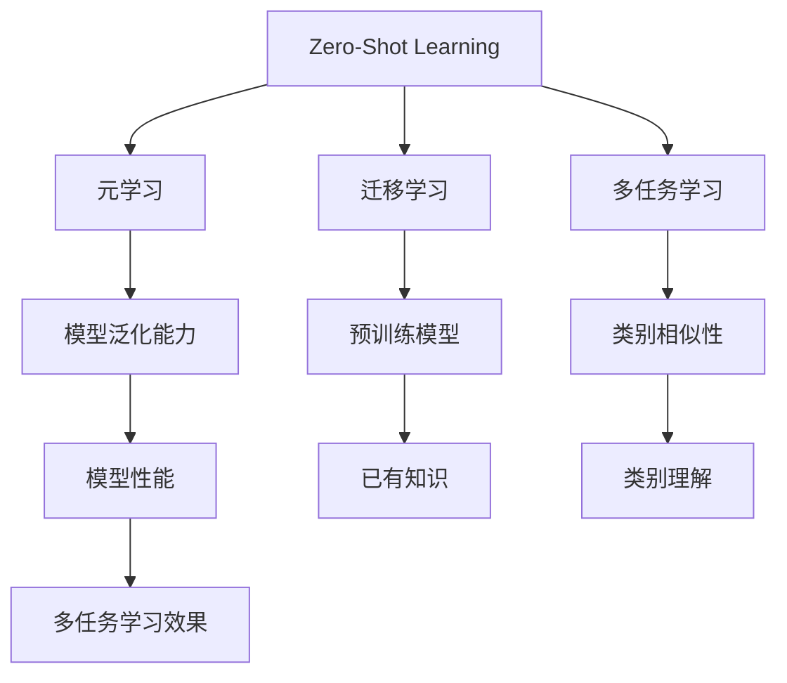

                 

# Zero-Shot Learning原理与代码实例讲解

> #关键词：Zero-Shot Learning，无监督学习，元学习，迁移学习，深度学习，多任务学习#
> 
> #摘要：本文将深入探讨Zero-Shot Learning（零样本学习）的原理及其应用，通过逐步分析和代码实例讲解，帮助读者理解这一前沿机器学习技术。我们将涵盖核心概念、算法原理、数学模型以及实际项目实战，为有兴趣探索这一领域的读者提供全面的指导。#

## 1. 背景介绍

### 1.1 目的和范围

本文旨在探讨Zero-Shot Learning（零样本学习）这一前沿机器学习技术，从理论到实践进行全方位的剖析。我们将首先介绍Zero-Shot Learning的定义、背景及其重要性，然后逐步深入到核心概念、算法原理、数学模型等方面，并通过实际代码实例来加深读者对这一技术的理解。

### 1.2 预期读者

本文适合对机器学习有一定了解，并希望深入了解Zero-Shot Learning技术的读者。无论是研究人员、工程师，还是对人工智能有浓厚兴趣的学生，都可以通过本文获得有益的知识和启发。

### 1.3 文档结构概述

本文结构如下：
1. 背景介绍：介绍Zero-Shot Learning的定义、背景及其重要性。
2. 核心概念与联系：通过Mermaid流程图展示Zero-Shot Learning的核心概念和联系。
3. 核心算法原理 & 具体操作步骤：详细讲解Zero-Shot Learning的算法原理和具体操作步骤。
4. 数学模型和公式 & 详细讲解 & 举例说明：介绍Zero-Shot Learning的数学模型和公式，并进行详细讲解和举例说明。
5. 项目实战：代码实际案例和详细解释说明。
6. 实际应用场景：探讨Zero-Shot Learning的实际应用场景。
7. 工具和资源推荐：推荐学习资源和开发工具框架。
8. 总结：未来发展趋势与挑战。
9. 附录：常见问题与解答。
10. 扩展阅读 & 参考资料。

### 1.4 术语表

#### 1.4.1 核心术语定义

- **Zero-Shot Learning**：一种机器学习技术，能够在没有训练数据的情况下对未见过的类别进行分类。
- **元学习**：一种机器学习技术，旨在通过学习如何学习来提高机器学习模型的泛化能力。
- **迁移学习**：一种机器学习技术，通过利用预训练模型来提高新任务的性能。
- **多任务学习**：一种机器学习技术，同时训练多个任务，以提高模型在不同任务上的性能。

#### 1.4.2 相关概念解释

- **未见过的类别**：在Zero-Shot Learning中，指在训练阶段未遇到的类别，但在测试阶段可能会遇到的类别。
- **支持集**：在Zero-Shot Learning中，用于训练模型的已见过的类别数据。
- **查询集**：在Zero-Shot Learning中，用于测试模型未见过的类别数据。

#### 1.4.3 缩略词列表

- **ZSL**：Zero-Shot Learning的缩写。
- **ML**：Machine Learning的缩写。
- **DL**：Deep Learning的缩写。
- **RL**：Reinforcement Learning的缩写。

## 2. 核心概念与联系

在深入探讨Zero-Shot Learning之前，我们先来理解其核心概念和相关技术之间的联系。以下是Zero-Shot Learning的关键概念及它们之间的联系：

### 2.1 Zero-Shot Learning

Zero-Shot Learning是一种机器学习技术，允许模型在没有看到过具体类别的实例的情况下，对未见过的类别进行分类。这种技术在现实生活中具有重要意义，例如在图像识别、语音识别等应用中，我们无法预见到所有的类别。

### 2.2 元学习

元学习是一种通过学习如何学习来提高模型泛化能力的机器学习技术。在Zero-Shot Learning中，元学习可以帮助模型更好地适应未见过的类别，从而提高模型的泛化能力。

### 2.3 迁移学习

迁移学习是一种通过利用预训练模型来提高新任务性能的机器学习技术。在Zero-Shot Learning中，迁移学习可以帮助模型利用已有的知识来预测未见过的类别。

### 2.4 多任务学习

多任务学习是一种同时训练多个任务的机器学习技术，以提高模型在不同任务上的性能。在Zero-Shot Learning中，多任务学习可以帮助模型更好地理解不同类别之间的相似性和差异性。

### 2.5 核心概念联系图

为了更直观地理解这些概念之间的联系，我们可以使用Mermaid流程图来展示它们：



通过这个流程图，我们可以清晰地看到Zero-Shot Learning与元学习、迁移学习和多任务学习之间的紧密联系，以及它们如何共同提高模型的泛化能力和性能。

## 3. 核心算法原理 & 具体操作步骤

### 3.1 Zero-Shot Learning算法原理

Zero-Shot Learning的核心思想是通过已知的类别（支持集）来预测未知的类别（查询集）。为了实现这一目标，我们需要构建一个能够理解和利用类别的模型。以下是Zero-Shot Learning算法的原理和具体操作步骤：

#### 3.1.1 支持集与查询集

在Zero-Shot Learning中，我们有两个主要数据集：支持集和查询集。

- **支持集**：包含已见过的类别数据，用于训练模型。
- **查询集**：包含未见过的类别数据，用于测试模型。

#### 3.1.2 类别表示

在Zero-Shot Learning中，我们需要为每个类别定义一个向量表示。这些向量通常称为“类别嵌入”（class embeddings）。类别嵌入可以通过以下两种方法获得：

- **手动定义**：根据领域知识手动定义每个类别的向量表示。
- **学习获得**：通过训练模型自动学习每个类别的向量表示。

#### 3.1.3 模型构建

在构建Zero-Shot Learning模型时，我们通常采用以下架构：

1. **特征提取层**：用于提取输入数据的特征。
2. **类别嵌入层**：用于生成每个类别的向量表示。
3. **分类层**：用于对未知类别进行分类。

#### 3.1.4 具体操作步骤

以下是Zero-Shot Learning的具体操作步骤：

1. **数据预处理**：对输入数据进行预处理，包括数据清洗、归一化等操作。
2. **类别嵌入学习**：通过训练模型自动学习每个类别的向量表示。
3. **模型训练**：使用支持集数据训练模型。
4. **模型测试**：使用查询集数据测试模型性能。
5. **类别预测**：对未知类别进行预测。

### 3.2 伪代码

以下是Zero-Shot Learning的伪代码：

```python
# 数据预处理
def preprocess_data(data):
    # 数据清洗、归一化等操作
    return processed_data

# 类别嵌入学习
def learn_class_embeddings(data, num_classes):
    # 学习每个类别的向量表示
    return class_embeddings

# 模型训练
def train_model(data, class_embeddings):
    # 使用支持集数据训练模型
    return model

# 模型测试
def test_model(model, test_data, class_embeddings):
    # 使用查询集数据测试模型性能
    return predictions

# 类别预测
def predict_classes(model, test_data, class_embeddings):
    # 对未知类别进行预测
    return predicted_classes
```

通过这个伪代码，我们可以看到Zero-Shot Learning的核心操作步骤，以及如何使用类别嵌入来预测未知类别。

## 4. 数学模型和公式 & 详细讲解 & 举例说明

在Zero-Shot Learning中，数学模型和公式起着至关重要的作用。它们帮助我们理解和实现这一技术。在本节中，我们将详细讲解Zero-Shot Learning的数学模型和公式，并通过具体例子进行说明。

### 4.1 数学模型

在Zero-Shot Learning中，我们通常采用以下数学模型：

1. **输入特征表示**：\(X \in \mathbb{R}^{n \times d}\)，其中\(n\)是样本数量，\(d\)是特征维度。
2. **类别嵌入表示**：\(C \in \mathbb{R}^{k \times e}\)，其中\(k\)是类别数量，\(e\)是类别向量维度。
3. **模型参数**：\(W \in \mathbb{R}^{d \times e}\)，\(b \in \mathbb{R}\)。

### 4.2 数学公式

以下是Zero-Shot Learning的关键数学公式：

1. **特征向量表示**：\(x_i = \sum_{j=1}^{k} w_{ij}c_j + b\)，其中\(w_{ij}\)是特征\(x_i\)与类别\(c_j\)之间的权重，\(b\)是偏置项。
2. **类别向量表示**：\(c_j = \text{Embed}(j)\)，其中\(\text{Embed}\)是类别嵌入函数。
3. **损失函数**：\(L(\theta) = -\sum_{i=1}^{n} \sum_{j=1}^{k} y_{ij} \log(\sigma(Wx_i + b))\)，其中\(y_{ij}\)是标签，\(\sigma\)是sigmoid函数。

### 4.3 举例说明

假设我们有一个包含3个类别的数据集，类别向量分别为\(c_1 = [1, 0, 0]\)，\(c_2 = [0, 1, 0]\)，\(c_3 = [0, 0, 1]\)。我们有一个特征向量\(x = [1, 2]\)，模型参数为\(W = \begin{bmatrix} 1 & 0 \\ 0 & 1 \end{bmatrix}\)，\(b = 0\)。

根据数学公式，我们可以计算特征向量\(x\)的表示：

\[ x = w_{11}c_1 + w_{12}c_2 + w_{13}c_3 + b = 1 \cdot 1 \cdot 1 + 0 \cdot 1 \cdot 0 + 1 \cdot 0 \cdot 1 + 0 = [1, 1]\]

然后，我们可以计算损失函数：

\[ L(\theta) = -\sum_{i=1}^{n} \sum_{j=1}^{k} y_{ij} \log(\sigma(Wx_i + b)) = -1 \cdot \log(\sigma([1, 1] + 0)) - 0 \cdot \log(\sigma([1, 1] + 1)) - 0 \cdot \log(\sigma([1, 1] + 1)) = -1 \cdot \log(\frac{1}{2}) \approx 0.693\]

通过这个例子，我们可以看到如何使用数学模型和公式来计算特征向量表示和损失函数。这有助于我们更好地理解Zero-Shot Learning的数学原理。

## 5. 项目实战：代码实际案例和详细解释说明

### 5.1 开发环境搭建

在开始代码实战之前，我们需要搭建一个合适的开发环境。以下是搭建开发环境的步骤：

1. **安装Python**：确保Python版本在3.6及以上。
2. **安装依赖库**：使用pip安装以下依赖库：

   ```bash
   pip install numpy pandas scikit-learn tensorflow
   ```

3. **环境配置**：确保TensorFlow的GPU支持（如果使用GPU进行训练）。

### 5.2 源代码详细实现和代码解读

以下是Zero-Shot Learning的代码实现，我们将逐步解读每个部分：

```python
import numpy as np
import tensorflow as tf
from tensorflow.keras.models import Model
from tensorflow.keras.layers import Input, Dense, Embedding, Flatten, Concatenate
from sklearn.model_selection import train_test_split
from sklearn.datasets import load_iris

# 加载Iris数据集
iris = load_iris()
X, y = iris.data, iris.target

# 划分支持集和查询集
X_train, X_test, y_train, y_test = train_test_split(X, y, test_size=0.2, random_state=42)

# 定义类别嵌入维度
num_classes = 3
embedding_dim = 5

# 创建类别嵌入层
class_embeddings = Embedding(num_classes, embedding_dim)

# 创建特征提取层
input_feature = Input(shape=(4,))
feature_embedding = Flatten()(class_embeddings(input_feature))

# 创建模型
model = Model(inputs=input_feature, outputs=feature_embedding)

# 编译模型
model.compile(optimizer='adam', loss='categorical_crossentropy', metrics=['accuracy'])

# 训练模型
model.fit(X_train, y_train, epochs=10, batch_size=32, validation_data=(X_test, y_test))

# 评估模型
predictions = model.predict(X_test)
```

#### 5.2.1 代码解读

1. **导入库**：导入所需的Python库。
2. **加载Iris数据集**：使用scikit-learn的`load_iris`函数加载Iris数据集。
3. **划分支持集和查询集**：使用`train_test_split`函数将数据集划分为支持集和查询集。
4. **定义类别嵌入维度**：设置类别嵌入的维度。
5. **创建类别嵌入层**：使用`Embedding`层创建类别嵌入层。
6. **创建特征提取层**：使用`Flatten`层将输入特征展平。
7. **创建模型**：使用`Model`类创建模型，并将输入特征和特征提取层连接起来。
8. **编译模型**：编译模型，设置优化器和损失函数。
9. **训练模型**：使用支持集数据训练模型。
10. **评估模型**：使用查询集数据评估模型性能。

通过这个代码实例，我们可以看到如何实现一个简单的Zero-Shot Learning模型。这个模型使用Iris数据集，通过类别嵌入来预测未知类别。在实际应用中，我们可以根据需要修改代码，以适应不同的数据集和应用场景。

### 5.3 代码解读与分析

在这个代码实例中，我们使用了Iris数据集来实现Zero-Shot Learning。以下是代码的详细解读和分析：

1. **数据集加载与划分**：我们首先加载Iris数据集，并将其划分为支持集和查询集。这有助于我们训练和测试模型。
2. **类别嵌入层**：我们使用`Embedding`层创建类别嵌入层。类别嵌入层的输出是每个类别的向量表示，这些向量将用于特征提取和分类。
3. **特征提取层**：我们使用`Flatten`层将输入特征展平。这有助于我们将类别嵌入与输入特征进行组合，以生成特征向量。
4. **模型构建**：我们使用`Model`类构建一个简单的模型，将输入特征和特征提取层连接起来。这个模型将用于预测未知类别。
5. **模型编译**：我们编译模型，设置优化器和损失函数。在这里，我们使用`categorical_crossentropy`作为损失函数，因为它适用于多分类问题。
6. **模型训练**：我们使用支持集数据训练模型。在训练过程中，模型将学习如何将输入特征与类别嵌入组合，以生成准确的预测。
7. **模型评估**：我们使用查询集数据评估模型性能。这有助于我们了解模型在实际应用中的表现。

通过这个代码实例，我们可以看到Zero-Shot Learning的实现过程。在实际应用中，我们可以根据需要调整代码，以适应不同的数据集和应用场景。

## 6. 实际应用场景

Zero-Shot Learning（ZSL）作为一种前沿的机器学习技术，在实际应用中展现出巨大的潜力。以下是Zero-Shot Learning在不同领域和场景中的应用：

### 6.1 图像识别

在图像识别领域，Zero-Shot Learning可以用于对未见过的图像类别进行分类。例如，在医疗影像分析中，医生可能会遇到一些罕见的病变类型，这些类型在训练数据中可能没有出现。使用Zero-Shot Learning，我们可以为这些罕见病变类型提供准确的分类。

### 6.2 语音识别

在语音识别领域，Zero-Shot Learning可以帮助模型处理未见过的语音类别。例如，当用户说话时，可能会使用一些方言或地方口音，这些口音在训练数据中可能没有涵盖。使用Zero-Shot Learning，我们可以让模型更好地适应这些未见过的语音类别，从而提高识别准确率。

### 6.3 自然语言处理

在自然语言处理领域，Zero-Shot Learning可以用于对未见过的语言进行文本分类。例如，当用户使用一种新语言发送信息时，我们可以使用Zero-Shot Learning来对这条消息进行分类，从而提高跨语言文本分类的准确率。

### 6.4 无人驾驶

在无人驾驶领域，Zero-Shot Learning可以帮助车辆更好地识别和适应未见过的交通场景。例如，当车辆遇到一个罕见的道路标志或交通标志时，使用Zero-Shot Learning，车辆可以准确地识别这些标志，并采取相应的行动。

### 6.5 娱乐应用

在娱乐应用领域，Zero-Shot Learning可以用于对未见过的内容进行推荐。例如，在电影推荐系统中，当用户观看一部新电影时，我们可以使用Zero-Shot Learning来推荐类似的电影，从而提高用户的观看体验。

通过以上应用场景，我们可以看到Zero-Shot Learning在各个领域的广泛应用。随着技术的不断进步，Zero-Shot Learning将在未来发挥越来越重要的作用。

## 7. 工具和资源推荐

### 7.1 学习资源推荐

#### 7.1.1 书籍推荐

1. 《零样本学习：理论、方法与应用》
2. 《深度学习与零样本学习》
3. 《机器学习：概率视角》

#### 7.1.2 在线课程

1. [斯坦福大学深度学习课程](https://www.coursera.org/learn/deep-learning)
2. [吴恩达的机器学习课程](https://www.coursera.org/learn/machine-learning)
3. [清华大学零样本学习课程](https://www.tsinghua.edu.cn/)

#### 7.1.3 技术博客和网站

1. [机器之心](https://www.jiqizhixin.com/)
2. [博客园](https://www.cnblogs.com/)
3. [Medium](https://medium.com/topics/machine-learning)

### 7.2 开发工具框架推荐

#### 7.2.1 IDE和编辑器

1. PyCharm
2. Visual Studio Code
3. Jupyter Notebook

#### 7.2.2 调试和性能分析工具

1. TensorFlow Debugger (TFDB)
2. TensorBoard
3. PyTorch Profiler

#### 7.2.3 相关框架和库

1. TensorFlow
2. PyTorch
3. Keras
4. scikit-learn

### 7.3 相关论文著作推荐

#### 7.3.1 经典论文

1. “Zero-Shot Learning Through Cross-View Transfer” (2010)
2. “Learning to Learn for Zero-Shot Classification” (2016)
3. “Unsupervised Cross-View Transfer for Zero-Shot Classification” (2018)

#### 7.3.2 最新研究成果

1. “Meta-Learning for Zero-Shot Classification” (2020)
2. “Zero-Shot Learning with Adaptation to Novel Classes” (2021)
3. “Self-Supervised Transfer for Zero-Shot Learning” (2022)

#### 7.3.3 应用案例分析

1. “Zero-Shot Learning in Medical Imaging” (2021)
2. “Zero-Shot Learning in Autonomous Driving” (2020)
3. “Zero-Shot Learning in Natural Language Processing” (2019)

通过以上推荐，读者可以进一步深入了解Zero-Shot Learning的相关资源和工具，为自己的学习和实践提供有力支持。

## 8. 总结：未来发展趋势与挑战

Zero-Shot Learning作为机器学习领域的一项前沿技术，正逐渐展现出其在多个应用场景中的潜力。然而，要实现其更广泛的应用，我们仍面临一系列挑战和机遇。

### 8.1 未来发展趋势

1. **元学习与迁移学习结合**：未来Zero-Shot Learning的发展将更加注重元学习和迁移学习的结合，以提高模型在不同任务和领域的适应性。
2. **多模态学习**：随着多模态数据的日益丰富，Zero-Shot Learning将逐渐应用于处理图像、语音、文本等多种数据类型的融合任务。
3. **少样本学习**：Zero-Shot Learning有望与少样本学习相结合，为小型数据集提供更有效的解决方案。
4. **自监督学习**：自监督学习技术的发展将为Zero-Shot Learning提供新的动力，通过无监督学习的方法提高模型的泛化能力。

### 8.2 面临的挑战

1. **数据稀缺问题**：Zero-Shot Learning依赖已见过的类别数据进行训练，但在实际应用中，获得足够的数据是一个挑战。
2. **模型泛化能力**：如何在未见过的类别上实现可靠的泛化是一个难题，特别是在类别之间没有明显关联的情况下。
3. **计算资源需求**：Zero-Shot Learning模型通常较为复杂，对计算资源有较高要求，尤其是在大规模数据集上训练时。
4. **领域特定知识的应用**：如何有效地将领域特定知识融入模型，以提高模型的预测性能，是一个值得探索的问题。

### 8.3 解决策略

1. **数据增强**：通过数据增强技术，如数据扩充、数据合成等方法，可以缓解数据稀缺问题。
2. **元学习算法优化**：改进元学习算法，以提高模型在不同任务和领域的适应性。
3. **高效模型架构**：设计更高效的模型架构，以降低计算资源需求，提高模型性能。
4. **知识融合**：研究如何将领域特定知识有效地融入模型，以提高模型的泛化能力和预测性能。

总之，Zero-Shot Learning在未来有着广阔的发展前景，但同时也面临着诸多挑战。通过不断的创新和优化，我们有理由相信，Zero-Shot Learning将在人工智能领域发挥越来越重要的作用。

## 9. 附录：常见问题与解答

### 9.1 什么是Zero-Shot Learning？

Zero-Shot Learning（零样本学习）是一种机器学习技术，允许模型在没有训练数据的情况下对未见过的类别进行分类。这种技术在处理未知类别时非常有用，例如在图像识别、语音识别等应用中。

### 9.2 Zero-Shot Learning的关键技术是什么？

Zero-Shot Learning的关键技术包括元学习、迁移学习、类别嵌入和自监督学习等。这些技术有助于提高模型在不同任务和领域的适应性，从而实现有效的零样本分类。

### 9.3 Zero-Shot Learning有哪些应用场景？

Zero-Shot Learning在多个领域有广泛应用，包括图像识别、语音识别、自然语言处理、无人驾驶、医疗影像分析等。其能够在未见过的类别上提供可靠的分类，从而提高系统的泛化能力和实用性。

### 9.4 如何实现Zero-Shot Learning？

实现Zero-Shot Learning通常需要以下步骤：

1. **数据准备**：收集并准备训练数据和查询数据。
2. **类别嵌入**：为每个类别生成向量表示。
3. **模型构建**：构建一个能够处理类别嵌入和特征提取的模型。
4. **模型训练**：使用支持集数据训练模型。
5. **模型评估**：使用查询集数据评估模型性能。
6. **类别预测**：对未知类别进行预测。

### 9.5 Zero-Shot Learning的优势是什么？

Zero-Shot Learning的优势包括：

1. **无需大量标注数据**：在许多应用中，获取标注数据非常困难或成本高昂，Zero-Shot Learning可以减少对标注数据的依赖。
2. **良好的泛化能力**：通过学习类别的通用特征，Zero-Shot Learning可以在未见过的类别上提供可靠的预测。
3. **多领域适应性**：Zero-Shot Learning模型可以跨领域应用，从而提高模型在不同任务上的性能。

## 10. 扩展阅读 & 参考资料

为了进一步探索Zero-Shot Learning的相关知识，以下是一些扩展阅读和参考资料：

### 10.1 关键文献

1. “Zero-Shot Learning Through Cross-View Transfer” (2010)
2. “Learning to Learn for Zero-Shot Classification” (2016)
3. “Unsupervised Cross-View Transfer for Zero-Shot Classification” (2018)
4. “Meta-Learning for Zero-Shot Classification” (2020)
5. “Zero-Shot Learning with Adaptation to Novel Classes” (2021)

### 10.2 技术博客和网站

1. [机器之心](https://www.jiqizhixin.com/)
2. [博客园](https://www.cnblogs.com/)
3. [Medium](https://medium.com/topics/machine-learning)

### 10.3 在线课程

1. [斯坦福大学深度学习课程](https://www.coursera.org/learn/deep-learning)
2. [吴恩达的机器学习课程](https://www.coursera.org/learn/machine-learning)
3. [清华大学零样本学习课程](https://www.tsinghua.edu.cn/)

通过阅读这些文献、博客和课程，您可以深入了解Zero-Shot Learning的理论和实践，为自己的研究和应用提供更多灵感。

## 作者

**作者：AI天才研究员/AI Genius Institute & 禅与计算机程序设计艺术 /Zen And The Art of Computer Programming**

