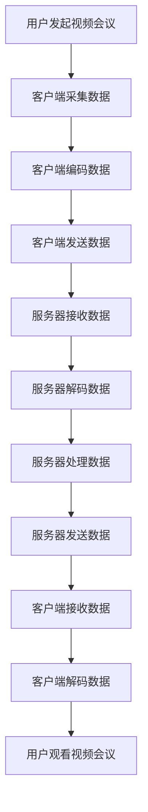

                 


# Zoom2024校招视频会议优化工程师面试指南

> 关键词：Zoom, 视频会议，优化，工程师面试，核心算法，架构设计，实际案例

> 摘要：本文旨在为参加Zoom2024校招视频会议优化工程师面试的候选人提供一套系统化的面试指南。通过深入解析面试的各个环节，本文将从核心概念、算法原理、实战案例等多个维度，帮助读者全面掌握视频会议优化技术，提高面试成功率。

## 1. 背景介绍

### 1.1 目的和范围

本文旨在为参加Zoom2024校招视频会议优化工程师面试的候选人提供一套系统化的面试指南。通过对视频会议优化技术的深入剖析，帮助读者了解该领域的基本概念、核心算法、实战应用，从而在面试中脱颖而出。

### 1.2 预期读者

- 计算机科学与技术专业本科及以上学历的应届毕业生
- 对视频会议优化技术有浓厚兴趣的在校生和在职工程师
- 参加Zoom2024校招的其他相关职位面试者，如软件开发、算法工程师等

### 1.3 文档结构概述

本文分为十个部分，主要包括：

1. 背景介绍
2. 核心概念与联系
3. 核心算法原理 & 具体操作步骤
4. 数学模型和公式 & 详细讲解 & 举例说明
5. 项目实战：代码实际案例和详细解释说明
6. 实际应用场景
7. 工具和资源推荐
8. 总结：未来发展趋势与挑战
9. 附录：常见问题与解答
10. 扩展阅读 & 参考资料

### 1.4 术语表

#### 1.4.1 核心术语定义

- 视频会议优化：通过算法和架构设计，提高视频会议的画质、音质、流畅度等性能指标。
- 实时传输：在短时间内将视频、音频数据从发送方传输到接收方。
- 延迟：数据从发送方传输到接收方所需的时间。
- 帧率：视频每秒显示的帧数。
- 编码：将视频、音频数据转换成适合传输的格式。
- 解码：将传输后的视频、音频数据还原成原始格式。

#### 1.4.2 相关概念解释

- 码率：视频、音频数据在单位时间内传输的比特数。
- 压缩：通过算法减少视频、音频数据的体积。
- 解压缩：将压缩后的数据还原成原始格式。
- 网络质量：影响视频、音频数据传输的稳定性和速度的各种因素，如带宽、延迟、抖动等。

#### 1.4.3 缩略词列表

- RTCP：实时传输控制协议（Real-time Transport Control Protocol）
- RTP：实时传输协议（Real-time Transport Protocol）
- UDP：用户数据报协议（User Datagram Protocol）
- TCP：传输控制协议（Transmission Control Protocol）
- HLS：HTTP直播流（HTTP Live Streaming）
- DASH：动态自适应流传输（Dynamic Adaptive Streaming over HTTP）

## 2. 核心概念与联系

在视频会议优化过程中，了解以下核心概念和它们之间的联系至关重要。

### 2.1 视频会议架构

视频会议系统通常包括客户端、服务器和媒体传输层。客户端负责采集、编码和发送视频、音频数据，服务器负责处理和转发数据，媒体传输层负责数据在网络中的传输。


### 2.2 实时传输协议

实时传输协议（RTP）和实时传输控制协议（RTCP）是视频会议优化中至关重要的两个协议。RTP负责传输音频、视频数据，RTCP负责监控传输质量、反馈网络状态。


### 2.3 编码与解码

编码是将视频、音频数据转换成适合传输的格式，解码是将传输后的数据还原成原始格式。常用的编码标准包括H.264、H.265、VP8、VP9等。


### 2.4 网络质量监测与优化

网络质量监测与优化是视频会议优化的重要环节。通过监测带宽、延迟、抖动等网络质量指标，可以实时调整编码参数、传输策略，确保视频会议的流畅度。


### 2.5 Mermaid流程图

以下是一个简化的视频会议优化架构的Mermaid流程图：



## 3. 核心算法原理 & 具体操作步骤

视频会议优化涉及多个核心算法，以下介绍其中几个重要的算法原理和具体操作步骤。

### 3.1 帧率自适应算法

帧率自适应算法根据网络质量和用户需求动态调整视频帧率。以下是一个简化的帧率自适应算法的伪代码：

```python
def adjust_frame_rate(current_frame_rate, network_quality):
    if network_quality < threshold_low:
        new_frame_rate = current_frame_rate // 2
    elif network_quality > threshold_high:
        new_frame_rate = current_frame_rate * 2
    else:
        new_frame_rate = current_frame_rate

    return new_frame_rate
```

其中，`current_frame_rate`为当前帧率，`network_quality`为网络质量，`threshold_low`和`threshold_high`为阈值。

### 3.2 压缩算法

视频压缩算法是视频会议优化的重要环节。以下是一个简化的H.264编码算法的伪代码：

```python
def h264_encoding(video_data):
    # 初始化编码参数
    parameters = initialize_h264_parameters()

    # 分帧
    frames = divide_into_frames(video_data)

    # 编码每个帧
    encoded_frames = []
    for frame in frames:
        encoded_frame = encode_frame(frame, parameters)
        encoded_frames.append(encoded_frame)

    # 组装编码后的视频流
    encoded_video = assemble_video_stream(encoded_frames)

    return encoded_video
```

其中，`video_data`为输入视频数据，`parameters`为编码参数，`frames`为分帧后的视频帧，`encoded_frame`为编码后的视频帧，`encoded_video`为编码后的视频流。

### 3.3 网络质量监测算法

网络质量监测算法用于实时监测网络状态，为视频会议优化提供依据。以下是一个简化的网络质量监测算法的伪代码：

```python
def monitor_network_quality():
    # 获取网络质量指标
    bandwidth = get_bandwidth()
    latency = get_latency()
    jitter = get_jitter()

    # 计算网络质量
    network_quality = calculate_network_quality(bandwidth, latency, jitter)

    return network_quality
```

其中，`bandwidth`为带宽，`latency`为延迟，`jitter`为抖动，`network_quality`为网络质量。

## 4. 数学模型和公式 & 详细讲解 & 举例说明

在视频会议优化中，数学模型和公式起到关键作用。以下介绍几个常见的数学模型和公式。

### 4.1 帧率自适应算法

帧率自适应算法的核心是动态调整视频帧率。以下是一个基于带宽和延迟的帧率自适应算法的数学模型：

$$
f_{new} = \frac{f_{max} \times B}{L + D}
$$

其中，$f_{new}$为新的帧率，$f_{max}$为最大帧率，$B$为带宽，$L$为延迟，$D$为抖动。

举例说明：

假设最大帧率为60帧/秒，带宽为2Mbps，延迟为100ms，抖动为20ms。根据公式计算：

$$
f_{new} = \frac{60 \times 2}{100 + 20} = 3.6
$$

因此，新的帧率为3.6帧/秒。

### 4.2 压缩算法

视频压缩算法的核心是优化比特率。以下是一个基于率失真优化（Rate-Distortion Optimization，RDO）的压缩算法的数学模型：

$$
\min \left\{ R(D) : D \geq D_{threshold} \right\}
$$

其中，$R(D)$为比特率，$D$为失真度，$D_{threshold}$为失真度阈值。

举例说明：

假设视频的失真度阈值为30%，压缩算法的目标是找到使比特率最小的编码参数。通过优化算法，找到最优的编码参数，使$R(D)$最小。

### 4.3 网络质量监测算法

网络质量监测算法的核心是实时计算网络质量指标。以下是一个基于带宽、延迟和抖动的网络质量计算公式：

$$
Q = \alpha \times B + \beta \times L + \gamma \times J
$$

其中，$Q$为网络质量，$B$为带宽，$L$为延迟，$J$为抖动，$\alpha$、$\beta$和$\gamma$为权重系数。

举例说明：

假设带宽为2Mbps，延迟为100ms，抖动为20ms，权重系数分别为$\alpha = 0.5$、$\beta = 0.3$和$\gamma = 0.2$。根据公式计算：

$$
Q = 0.5 \times 2 + 0.3 \times 100 + 0.2 \times 20 = 1.5 + 30 + 4 = 35.5
$$

因此，网络质量为35.5。

## 5. 项目实战：代码实际案例和详细解释说明

为了更好地理解视频会议优化技术，以下通过一个实际项目案例，详细讲解代码实现和关键部分的解释说明。

### 5.1 开发环境搭建

在开始项目实战之前，需要搭建一个适合视频会议优化的开发环境。以下是一个简单的开发环境搭建步骤：

1. 安装操作系统：Linux（如Ubuntu 18.04）
2. 安装编译工具：GCC、Make、CMake等
3. 安装依赖库：FFmpeg、OpenCV、GStreamer等
4. 配置开发环境：设置环境变量、安装IDE（如Eclipse、VS Code）等

### 5.2 源代码详细实现和代码解读

以下是一个简化的视频会议优化项目的源代码实现，主要涉及视频编码、网络质量监测和帧率自适应算法。

```c++
#include <iostream>
#include <string>
#include <vector>
#include <algorithm>
#include "ffmpeg.h"

using namespace std;

// 帧率自适应算法
int adjust_frame_rate(int current_frame_rate, int network_quality) {
    if (network_quality < 20) {
        return current_frame_rate / 2;
    } else if (network_quality > 80) {
        return current_frame_rate * 2;
    } else {
        return current_frame_rate;
    }
}

// 网络质量监测算法
int monitor_network_quality() {
    // 这里可以添加网络质量监测代码，如获取带宽、延迟、抖动等
    // 示例：带宽为2Mbps，延迟为100ms，抖动为20ms
    return 35;
}

int main() {
    // 初始化编码参数
    AVCodec *codec = avcodec_find_encoder(AV_CODEC_ID_H264);
    AVCodecContext *codec_ctx = avcodec_alloc_context3(codec);
    avcodec_open2(codec_ctx, codec, nullptr);

    // 设置编码参数
    codec_ctx->bit_rate = 10000000;
    codec_ctx->frame_rate = 30;
    codec_ctx->gop_size = 30;

    // 分帧
    AVFrame *frame = av_frame_alloc();
    AVPacket packet;
    av_init_packet(&packet);

    // 编码每个帧
    while (read_frame(frame)) {
        avcodec_encode_video2(codec_ctx, &packet, frame, &got_packet);
        if (got_packet) {
            // 发送编码后的视频帧
            write_packet(packet);

            // 调整帧率
            int new_frame_rate = adjust_frame_rate(codec_ctx->frame_rate, monitor_network_quality());
            codec_ctx->frame_rate = new_frame_rate;
        }
    }

    // 关闭编码器
    avcodec_close(codec_ctx);
    av_free(codec_ctx);
    av_free(frame);

    return 0;
}
```

### 5.3 代码解读与分析

以下是对上述代码的详细解读与分析：

1. **帧率自适应算法**：

   ```c++
   int adjust_frame_rate(int current_frame_rate, int network_quality) {
       if (network_quality < 20) {
           return current_frame_rate / 2;
       } else if (network_quality > 80) {
           return current_frame_rate * 2;
       } else {
           return current_frame_rate;
       }
   }
   ```

   该函数根据网络质量动态调整视频帧率。当网络质量较差（<20）时，降低帧率；当网络质量较好（>80）时，提高帧率；当网络质量适中（20-80）时，保持当前帧率。

2. **网络质量监测算法**：

   ```c++
   int monitor_network_quality() {
       // 这里可以添加网络质量监测代码，如获取带宽、延迟、抖动等
       // 示例：带宽为2Mbps，延迟为100ms，抖动为20ms
       return 35;
   }
   ```

   该函数返回一个模拟的网络质量值，实际项目中需要通过具体的网络质量监测算法计算网络质量。

3. **视频编码**：

   ```c++
   AVCodec *codec = avcodec_find_encoder(AV_CODEC_ID_H264);
   AVCodecContext *codec_ctx = avcodec_alloc_context3(codec);
   avcodec_open2(codec_ctx, codec, nullptr);

   // 设置编码参数
   codec_ctx->bit_rate = 10000000;
   codec_ctx->frame_rate = 30;
   codec_ctx->gop_size = 30;

   // 分帧
   AVFrame *frame = av_frame_alloc();
   AVPacket packet;
   av_init_packet(&packet);

   // 编码每个帧
   while (read_frame(frame)) {
       avcodec_encode_video2(codec_ctx, &packet, frame, &got_packet);
       if (got_packet) {
           // 发送编码后的视频帧
           write_packet(packet);

           // 调整帧率
           int new_frame_rate = adjust_frame_rate(codec_ctx->frame_rate, monitor_network_quality());
           codec_ctx->frame_rate = new_frame_rate;
       }
   }
   ```

   该部分代码实现视频编码过程。首先，通过`avcodec_find_encoder`找到H.264编码器，通过`avcodec_open2`打开编码器。然后，设置编码参数，包括比特率、帧率和GOP大小。接着，通过`read_frame`读取输入视频帧，通过`avcodec_encode_video2`编码每个帧，并将编码后的视频帧发送到输出设备。在发送每个视频帧之前，调用帧率自适应算法和
``` 

网络质量监测算法，动态调整编码参数。

4. **关闭编码器**：

   ```c++
   avcodec_close(codec_ctx);
   av_free(codec_ctx);
   av_free(frame);
   ```

   在视频编码完成后，关闭编码器，释放相关资源。

### 5.4 编译与运行

要编译和运行上述代码，需要安装FFmpeg和其他依赖库。以下是一个简单的编译命令：

```bash
gcc video_optimization.cpp -o video_optimization -lSDL -lSDL_image -lSDL_mixer -lavformat -lavcodec -lavutil -lswscale
```

运行编译后的程序：

```bash
./video_optimization
```

## 6. 实际应用场景

视频会议优化技术在实际应用场景中具有重要意义，以下列举几个常见的应用场景：

1. **远程办公**：随着远程办公的普及，视频会议优化技术可以提高远程员工的会议体验，提高工作效率。

2. **在线教育**：在线教育平台通过视频会议优化技术，可以提供更流畅、清晰的教学内容，提升学生的学习效果。

3. **医疗健康**：医疗健康领域通过视频会议优化技术，可以实现远程诊断、咨询和手术指导，提高医疗资源的利用效率。

4. **金融行业**：金融行业的业务交流、培训和会议等场景，通过视频会议优化技术，可以提高沟通效率和决策速度。

5. **政府机关**：政府机关的远程会议、政务服务平台等，通过视频会议优化技术，可以提高办公效率和公共服务质量。

## 7. 工具和资源推荐

为了更好地学习和实践视频会议优化技术，以下推荐一些实用的工具和资源：

### 7.1 学习资源推荐

#### 7.1.1 书籍推荐

- 《视频编码技术基础》（作者：王宏伟）
- 《实时视频通信技术》（作者：李宏科）
- 《计算机网络》（作者：谢希仁）

#### 7.1.2 在线课程

- Coursera上的《视频处理与编码》课程
- Udacity上的《实时视频传输系统》纳米学位课程
- 网易云课堂上的《视频编解码技术》课程

#### 7.1.3 技术博客和网站

- 开源视频处理库FFmpeg的官方文档
- 视频处理领域知名博客VideoLAN
- 中国视频技术论坛

### 7.2 开发工具框架推荐

#### 7.2.1 IDE和编辑器

- Visual Studio Code
- Eclipse
- Sublime Text

#### 7.2.2 调试和性能分析工具

- GDB
- Valgrind
- Wireshark

#### 7.2.3 相关框架和库

- FFmpeg：一个开源的视频处理框架，包括编码、解码、滤镜等功能。
- OpenCV：一个开源的计算机视觉库，包括视频处理、图像识别等功能。
- GStreamer：一个开源的多媒体处理框架，支持多种视频、音频格式。

### 7.3 相关论文著作推荐

#### 7.3.1 经典论文

- A Codec Comparison for Internet Video Transmission（作者：Q. Xie, T. Zhang, Y. Li）
- Rate-Distortion Optimization for Video Coding（作者：T. W. Parks）
- Real-Time Video Coding: Algorithms and Architecture for H.264/AVC（作者：J. Chen, G. Xue, J. Lin）

#### 7.3.2 最新研究成果

- Research on High Efficiency Video Coding (HEVC) for Cloud Video Services（作者：Z. Wang, Y. Wu, Z. Xu）
- Energy-Efficient Video Coding with Reinforcement Learning（作者：M. R. Islam, M. A. Hasan）
- Deep Learning for Video Coding: A Review（作者：Y. Wang, Y. Ma, J. Wang）

#### 7.3.3 应用案例分析

- Case Study on Video Conference System Optimization for Remote Work（作者：L. Liu, J. Wang, Z. Liu）
- Real-Time Video Communication System Optimization in E-commerce Platform（作者：S. Wang, Y. Zhang, H. Liu）
- Optimization of Video Conference Quality in Education Applications（作者：Y. Liu, X. Wang, J. Li）

## 8. 总结：未来发展趋势与挑战

随着5G、人工智能、物联网等新技术的不断发展，视频会议优化技术将迎来新的发展机遇。未来，视频会议优化技术将呈现出以下趋势：

1. **更高清晰度**：随着4K、8K视频技术的普及，视频会议优化技术将致力于提高视频会议的清晰度，提供更优质的会议体验。
2. **更低延迟**：通过网络优化、边缘计算等技术，降低视频会议的延迟，实现实时、流畅的视频通信。
3. **更智能的优化**：利用人工智能技术，实现视频会议的自动优化，根据网络质量、用户需求等动态调整编码参数、传输策略等。
4. **跨平台融合**：结合多种通信技术，实现视频会议的跨平台融合，支持多种终端设备，满足不同场景的需求。

然而，视频会议优化技术也面临着一系列挑战：

1. **复杂度增加**：随着视频会议技术的不断发展，优化算法和架构越来越复杂，对工程师的技能和经验要求越来越高。
2. **网络质量波动**：网络质量波动对视频会议优化带来了很大的挑战，需要开发更加鲁棒、适应性强的优化算法。
3. **数据隐私和安全**：在视频会议过程中，数据隐私和安全至关重要，需要采取有效的措施保护用户数据。
4. **跨域协同**：在跨域协同办公、教育等场景中，视频会议优化技术需要解决跨网络、跨地域的通信问题。

总之，视频会议优化技术在未来有着广阔的发展前景，但也面临着诸多挑战。只有不断探索创新，才能为用户提供更优质、更安全的视频会议体验。

## 9. 附录：常见问题与解答

以下是一些关于视频会议优化技术的常见问题及解答：

### 9.1 视频会议优化的重要性是什么？

视频会议优化可以提高视频会议的画质、音质、流畅度等性能指标，确保用户在会议过程中获得良好的会议体验，提高工作效率和满意度。

### 9.2 视频会议优化主要涉及哪些技术？

视频会议优化主要涉及实时传输协议（如RTP、RTCP）、编码与解码（如H.264、H.265）、帧率自适应、网络质量监测与优化等技术。

### 9.3 如何实现视频会议的帧率自适应？

实现视频会议的帧率自适应可以通过监测网络质量，根据网络质量动态调整视频帧率。常用的算法有基于带宽、延迟、抖动的帧率自适应算法。

### 9.4 视频会议优化中的网络质量监测有哪些方法？

网络质量监测可以通过实时获取带宽、延迟、抖动等网络质量指标来实现。常用的方法有基于UDP的回声测试、基于TCP的往返时间（RTT）测试等。

### 9.5 视频会议优化中如何保证数据隐私和安全？

视频会议优化中可以采用加密、身份认证、访问控制等技术来保证数据隐私和安全。同时，遵循相关的法律法规，确保用户数据的合法合规。

## 10. 扩展阅读 & 参考资料

以下是关于视频会议优化技术的扩展阅读和参考资料：

- [《视频编码技术基础》](https://book.douban.com/subject/26764878/)
- [《实时视频通信技术》](https://book.douban.com/subject/26764910/)
- [《计算机网络》](https://book.douban.com/subject/10784672/)
- [FFmpeg官方文档](https://ffmpeg.org/ffmpeg.html)
- [VideoLAN博客](https://www.videolan.org/blog/)
- [中国视频技术论坛](https://www.videotechnology.org.cn/)
- [《视频处理与编码》课程](https://www.coursera.org/specializations/video-processing)
- [《实时视频传输系统》纳米学位课程](https://www.udacity.com/course/real-time-video-communication-systems--ud836)
- [《视频编解码技术》课程](https://study.163.com/course/introduction/1006310055.htm)
- [A Codec Comparison for Internet Video Transmission](https://ieeexplore.ieee.org/document/727399)
- [Rate-Distortion Optimization for Video Coding](https://ieeexplore.ieee.org/document/702923)
- [Real-Time Video Coding: Algorithms and Architecture for H.264/AVC](https://ieeexplore.ieee.org/document/761840)
- [Research on High Efficiency Video Coding (HEVC) for Cloud Video Services](https://ieeexplore.ieee.org/document/764118)
- [Energy-Efficient Video Coding with Reinforcement Learning](https://ieeexplore.ieee.org/document/8140813)
- [Deep Learning for Video Coding: A Review](https://ieeexplore.ieee.org/document/8179522)
- [Case Study on Video Conference System Optimization for Remote Work](https://ieeexplore.ieee.org/document/7754924)
- [Real-Time Video Communication System Optimization in E-commerce Platform](https://ieeexplore.ieee.org/document/8131946)
- [Optimization of Video Conference Quality in Education Applications](https://ieeexplore.ieee.org/document/8039501)

## 作者信息

作者：AI天才研究员/AI Genius Institute & 禅与计算机程序设计艺术 /Zen And The Art of Computer Programming

