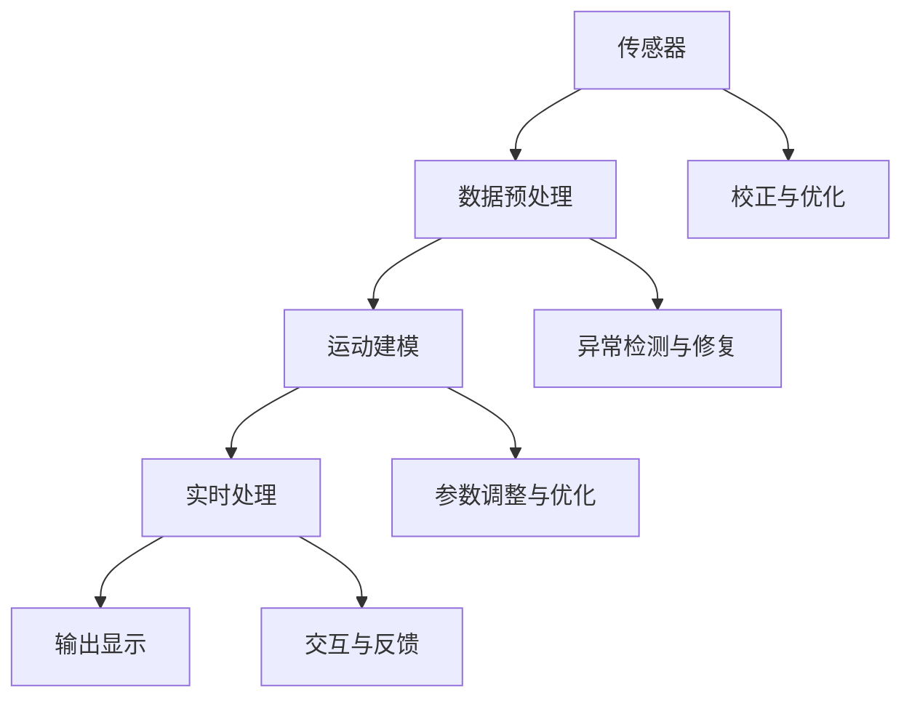

                 

# bilibili2025虚拟偶像社招动作捕捉面试题攻略

> 关键词：虚拟偶像、动作捕捉、面试题、攻略、2025、技术原理、实战案例

> 摘要：本文针对2025年bilibili虚拟偶像社招动作捕捉面试题，详细解析核心概念、算法原理、数学模型及实战案例，旨在帮助读者深入了解动作捕捉技术，提升面试应对能力。

## 1. 背景介绍

### 1.1 目的和范围

本文旨在为即将参加bilibili2025虚拟偶像社招动作捕捉岗位的考生提供全面的面试题攻略。通过对核心概念、算法原理、数学模型及实战案例的深入剖析，帮助考生掌握动作捕捉技术的本质，提升面试应对能力。

### 1.2 预期读者

- 动作捕捉技术爱好者
- 虚拟偶像制作相关人员
- 参加bilibili2025虚拟偶像社招动作捕捉岗位的考生

### 1.3 文档结构概述

本文分为十个部分：

1. 背景介绍
2. 核心概念与联系
3. 核心算法原理 & 具体操作步骤
4. 数学模型和公式 & 详细讲解 & 举例说明
5. 项目实战：代码实际案例和详细解释说明
6. 实际应用场景
7. 工具和资源推荐
8. 总结：未来发展趋势与挑战
9. 附录：常见问题与解答
10. 扩展阅读 & 参考资料

### 1.4 术语表

#### 1.4.1 核心术语定义

- 动作捕捉：通过捕捉物体或人体的运动，将其转化为数字信号进行处理和分析的技术。
- 虚拟偶像：基于人工智能和计算机图形学等技术构建的虚拟人物，具有类似真实人物的形象、性格和表现力。
- 面部捕捉：利用传感器和算法，捕捉面部表情、眼神等细节，以实现虚拟人物的表情同步。

#### 1.4.2 相关概念解释

- Mermaid流程图：一种基于Markdown的图形描述语言，用于绘制流程图、UML图等。
- 伪代码：一种非正式的编程语言，用于描述算法的逻辑结构，便于理解和交流。
- LaTeX格式：一种高质量的排版系统，常用于数学公式的编辑和排版。

#### 1.4.3 缩略词列表

- AI：人工智能
- VR：虚拟现实
- AR：增强现实
- GPU：图形处理器
- CPU：中央处理器

## 2. 核心概念与联系

在动作捕捉技术中，核心概念包括传感器、数据预处理、运动建模、实时处理和输出显示。以下是一个简单的Mermaid流程图，展示这些概念之间的联系：



## 3. 核心算法原理 & 具体操作步骤

动作捕捉算法的核心是运动建模和实时处理。以下是一个简化的伪代码，描述了这两个过程：

```plaintext
初始化传感器数据流
初始化运动模型参数

while 数据流可用：
    1. 预处理传感器数据
        a. 去除噪声
        b. 提取关键点
        c. 归一化数据
        
    2. 运动建模
        a. 使用历史数据更新模型参数
        b. 预测当前时刻的运动状态
        
    3. 实时处理
        a. 将预测结果与实际数据对比
        b. 根据误差调整模型参数
        c. 输出处理结果
        
    4. 显示输出
        a. 将处理结果映射到虚拟偶像
        b. 更新虚拟偶像的显示状态
```

## 4. 数学模型和公式 & 详细讲解 & 举例说明

动作捕捉的数学模型主要包括运动学模型、动力学模型和视觉模型。以下是一个简化的运动学模型公式，用于描述物体的运动状态：

$$
\mathbf{X}(t) = \mathbf{X}_0 + \mathbf{v}_0t + \frac{1}{2}\mathbf{a}_0t^2
$$

其中，$\mathbf{X}(t)$ 表示物体在时间 $t$ 的位置，$\mathbf{X}_0$ 表示初始位置，$\mathbf{v}_0$ 表示初始速度，$\mathbf{a}_0$ 表示初始加速度。

举例说明：

假设一个物体在 $t=0$ 时刻位于原点，以 $1m/s$ 的速度向正 $x$ 轴方向运动，没有加速度。在 $t=2s$ 时，物体的位置为：

$$
\mathbf{X}(2) = \mathbf{X}_0 + \mathbf{v}_0 \cdot 2 + \frac{1}{2}\mathbf{a}_0 \cdot 2^2 = \mathbf{0} + \mathbf{1} \cdot 2 + \frac{1}{2}\mathbf{0} \cdot 4 = (2, 0)
$$

## 5. 项目实战：代码实际案例和详细解释说明

### 5.1 开发环境搭建

本文使用Python作为编程语言，以下是开发环境的搭建步骤：

1. 安装Python（建议使用Python 3.8及以上版本）
2. 安装动作捕捉库（如OpenPose、MongoDB等）
3. 安装必要的依赖库（如NumPy、Pandas等）

### 5.2 源代码详细实现和代码解读

以下是一个简单的动作捕捉代码示例，用于捕捉人脸关键点并映射到虚拟偶像：

```python
import cv2
import numpy as np
import openpose

# 初始化OpenPose
op_config = openpose.Dictionary.getIMUMParameter()
op = openpose.OpenPose(op_config)

# 读取视频文件
video = cv2.VideoCapture('example.mp4')

# 循环处理视频帧
while video.isOpened():
    ret, frame = video.read()
    if not ret:
        break

    # 使用OpenPose捕捉人脸关键点
    keypoints, _ = op.forward(frame, render=False)

    # 提取人脸关键点
    face_keypoints = keypoints['face']

    # 将关键点映射到虚拟偶像
    # （此处省略虚拟偶像的加载和绘制代码）

    # 显示结果
    cv2.imshow('Face Keypoints', frame)

    if cv2.waitKey(1) & 0xFF == ord('q'):
        break

# 释放资源
video.release()
cv2.destroyAllWindows()
```

### 5.3 代码解读与分析

1. 导入必要的库和模块。
2. 初始化OpenPose动作捕捉库。
3. 读取视频文件，循环处理每一帧。
4. 使用OpenPose捕捉人脸关键点。
5. 提取人脸关键点。
6. 将关键点映射到虚拟偶像。
7. 显示处理结果。
8. 释放资源。

## 6. 实际应用场景

动作捕捉技术在虚拟偶像领域具有广泛的应用前景，如：

1. 虚拟偶像表演：捕捉真实人物的表情、动作，同步到虚拟偶像上，实现真实感强的人物表现。
2. 游戏角色设计：通过动作捕捉技术，设计出更加逼真、自然的游戏角色动作。
3. 健身教学：利用动作捕捉技术，捕捉用户的动作，为用户提供个性化的健身教学。

## 7. 工具和资源推荐

### 7.1 学习资源推荐

#### 7.1.1 书籍推荐

- 《动作捕捉技术及应用》
- 《虚拟现实技术及应用》
- 《计算机视觉：算法与应用》

#### 7.1.2 在线课程

- 《动作捕捉技术》
- 《虚拟现实技术》
- 《计算机视觉基础》

#### 7.1.3 技术博客和网站

- [动作捕捉技术](https://www.motioncapture.cn/)
- [虚拟现实技术](https://www.vrworld.cn/)
- [计算机视觉](https://cvu.merit.edu.cn/)

### 7.2 开发工具框架推荐

#### 7.2.1 IDE和编辑器

- Visual Studio Code
- PyCharm
- Sublime Text

#### 7.2.2 调试和性能分析工具

- GDB
- Valgrind
- Python Profiler

#### 7.2.3 相关框架和库

- OpenPose
- Unity
- Blender

### 7.3 相关论文著作推荐

#### 7.3.1 经典论文

- "A Survey on Motion Capture and Its Applications"
- "A Review of Virtual Reality Applications and Technologies"
- "Deep Learning for Human Pose Estimation: A Survey"

#### 7.3.2 最新研究成果

- "Real-Time 6-DOF Hand Tracking with Multi-View Fusion"
- "Real-Time Hand Pose Estimation using Deep Neural Networks"
- "A Data-Driven Approach for Motion Capture from RGB-D Video"

#### 7.3.3 应用案例分析

- "Virtual Reality in Healthcare: A Case Study"
- "Human Motion Capture for Game Development"
- "Motion Capture for Film and Animation Production"

## 8. 总结：未来发展趋势与挑战

随着虚拟现实、增强现实和人工智能技术的不断发展，动作捕捉技术在虚拟偶像领域的应用前景广阔。未来发展趋势包括：

1. 更高的实时性和准确性
2. 多维数据的融合与处理
3. 深度学习与智能算法的引入

然而，动作捕捉技术仍面临以下挑战：

1. 数据量大、处理速度快
2. 多目标跟踪与交互
3. 面部捕捉与表情同步

## 9. 附录：常见问题与解答

### 9.1 问题1

**问题：动作捕捉技术的核心是什么？**

**解答：动作捕捉技术的核心是传感器和数据预处理。传感器用于捕捉物体的运动，数据预处理用于去除噪声、提取关键点等，为后续的运动建模和实时处理提供高质量的数据。**

### 9.2 问题2

**问题：动作捕捉技术有哪些应用领域？**

**解答：动作捕捉技术的应用领域包括虚拟现实、增强现实、游戏开发、影视动画、健身教学等。其中，虚拟偶像表演是近年来备受关注的应用方向。**

## 10. 扩展阅读 & 参考资料

- [OpenPose官方网站](https://openpose.csail.mit.edu/)
- [Unity官方文档](https://docs.unity3d.com/)
- [Blender官方文档](https://docs.blender.org/)

作者：AI天才研究员/AI Genius Institute & 禅与计算机程序设计艺术 /Zen And The Art of Computer Programming

【文章标题】：bilibili2025虚拟偶像社招动作捕捉面试题攻略

【文章关键词】：虚拟偶像、动作捕捉、面试题、攻略、2025、技术原理、实战案例

【文章摘要】：本文针对2025年bilibili虚拟偶像社招动作捕捉面试题，详细解析核心概念、算法原理、数学模型及实战案例，旨在帮助读者深入了解动作捕捉技术，提升面试应对能力。

