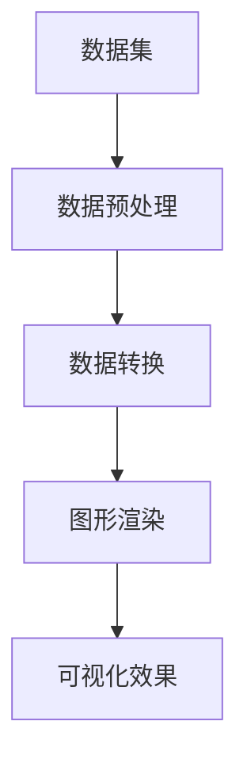

                 

# AI大数据计算原理与代码实例讲解：数据可视化

> 关键词：数据可视化，大数据计算，算法原理，代码实例，图像渲染

> 摘要：本文深入探讨了数据可视化在大数据计算领域的重要性，详细介绍了其原理和实现步骤。通过代码实例，本文展示了如何利用Python等编程语言实现常见的数据可视化任务，并分析了其在实际应用中的优势和挑战。本文旨在为数据科学家和工程师提供实用的指导和启示。

## 1. 背景介绍

### 1.1 目的和范围

本文旨在介绍数据可视化在大数据计算领域的重要性，探讨其原理和实现步骤。通过代码实例，我们将展示如何使用Python等编程语言实现常见的数据可视化任务，并分析其在实际应用中的优势和挑战。本文的目标读者为数据科学家、数据工程师和相关技术爱好者。

### 1.2 预期读者

本文适合具有以下背景的读者：
1. 对数据可视化有基本了解，希望深入掌握其原理和实现方法。
2. 具有Python编程基础，熟悉数据分析库如Pandas和Matplotlib。
3. 关注大数据计算领域的发展，希望了解数据可视化在此领域的应用。

### 1.3 文档结构概述

本文分为十个部分：
1. 背景介绍
2. 核心概念与联系
3. 核心算法原理与具体操作步骤
4. 数学模型和公式与详细讲解
5. 项目实战：代码实际案例和详细解释说明
6. 实际应用场景
7. 工具和资源推荐
8. 总结：未来发展趋势与挑战
9. 附录：常见问题与解答
10. 扩展阅读与参考资料

### 1.4 术语表

#### 1.4.1 核心术语定义

- 数据可视化：通过图形、图像等视觉形式展示数据，帮助人们理解和分析数据。
- 大数据计算：处理和分析大规模数据的技术和方法。
- 图形渲染：将数据转换为视觉图形的过程。
- Python：一种高级编程语言，广泛应用于数据科学和数据分析领域。

#### 1.4.2 相关概念解释

- 数据集：一组相关数据的集合，用于训练机器学习模型或进行分析。
- 数据可视化库：提供可视化功能的编程库，如Matplotlib、Seaborn等。
- 可视化效果：数据可视化过程中产生的视觉效果，包括颜色、形状、大小等。

#### 1.4.3 缩略词列表

- BI：商业智能
- GUI：图形用户界面
- API：应用程序编程接口
- ML：机器学习
- AI：人工智能

## 2. 核心概念与联系

数据可视化在大数据计算中扮演着至关重要的角色。其核心概念包括数据集、图形渲染、数据转换和可视化效果等。以下是一个简化的数据可视化流程，以及相关的Mermaid流程图：



### 2.1 数据集

数据集是数据可视化过程的基础。一个数据集可以包含各种类型的数据，如图像、文本、音频等。在数据可视化中，我们通常关注数值型数据，如时间序列、股票价格、用户行为等。

### 2.2 数据预处理

数据预处理是确保数据质量的重要步骤。它包括数据清洗、去重、缺失值处理等。清洗后的数据将更便于后续的数据转换和可视化。

### 2.3 数据转换

数据转换是将原始数据转换为可视化数据的过程。这通常涉及数据的归一化、标准化、聚合等操作。例如，将时间序列数据转换为日、周、月等不同时间单位。

### 2.4 图形渲染

图形渲染是将转换后的数据转换为图形的过程。这个过程通常涉及图形库的选择和参数设置。常见的图形库包括Matplotlib、Seaborn、Plotly等。

### 2.5 可视化效果

可视化效果是数据可视化过程中的最后一步。通过调整颜色、形状、大小等参数，我们可以得到更加直观、易于理解的可视化结果。

## 3. 核心算法原理与具体操作步骤

### 3.1 数据可视化算法原理

数据可视化算法通常基于以下原理：

1. 数据抽象：将大量数据抽象为易于理解的图形结构。
2. 图形渲染：根据数据结构和参数设置，渲染出图形。
3. 人机交互：提供交互式界面，方便用户自定义可视化效果。

### 3.2 具体操作步骤

以下是一个简单的Python代码示例，使用Matplotlib库绘制折线图：

```python
import matplotlib.pyplot as plt
import pandas as pd

# 读取数据集
data = pd.read_csv('data.csv')

# 数据预处理
data['date'] = pd.to_datetime(data['date'])
data.set_index('date', inplace=True)

# 数据转换
data = data.resample('M').mean()

# 图形渲染
plt.figure(figsize=(10, 6))
plt.plot(data)
plt.title('Stock Price')
plt.xlabel('Date')
plt.ylabel('Price')
plt.grid(True)
plt.show()
```

### 3.3 伪代码

```plaintext
function data_visualization(data):
    # 数据预处理
    data = preprocess_data(data)
    
    # 数据转换
    data = transform_data(data)
    
    # 图形渲染
    plot = render_plot(data)
    
    # 显示可视化结果
    show_plot(plot)
```

## 4. 数学模型和公式与详细讲解

### 4.1 数学模型

在数据可视化中，常用的数学模型包括：

1. 标准化：
   $$ z = \frac{x - \mu}{\sigma} $$
   其中，$x$ 为原始数据，$\mu$ 为均值，$\sigma$ 为标准差。
2. 归一化：
   $$ z = \frac{x}{\max(x) - \min(x)} $$
   其中，$x$ 为原始数据。

### 4.2 公式详细讲解

- 标准化公式用于消除不同特征之间的尺度差异，使数据更具可比性。
- 归一化公式将数据映射到[0, 1]范围内，便于后续的可视化处理。

### 4.3 举例说明

假设我们有一个包含年龄和收入的数据集，年龄范围为[20, 60]，收入范围为[10000, 200000]。

- 标准化后，年龄和收入分别为：
  $$ \mu_{age} = 40, \sigma_{age} = 10 $$
  $$ \mu_{income} = 150000, \sigma_{income} = 50000 $$
  $$ z_{age} = \frac{30 - 40}{10} = -1 $$
  $$ z_{income} = \frac{150000 - 150000}{50000} = 0 $$

- 归一化后，年龄和收入分别为：
  $$ z_{age} = \frac{30}{60 - 20} = 0.5 $$
  $$ z_{income} = \frac{150000}{200000 - 10000} = 0.75 $$

## 5. 项目实战：代码实际案例和详细解释说明

### 5.1 开发环境搭建

在开始项目实战之前，我们需要搭建一个合适的开发环境。以下是一个基本的Python开发环境搭建步骤：

1. 安装Python（建议使用Python 3.8及以上版本）。
2. 安装Pandas、NumPy、Matplotlib、Seaborn等常用库。

```bash
pip install pandas numpy matplotlib seaborn
```

### 5.2 源代码详细实现和代码解读

以下是一个实际案例，使用Python和Matplotlib绘制一个散点图：

```python
import matplotlib.pyplot as plt
import pandas as pd

# 读取数据集
data = pd.read_csv('data.csv')

# 数据预处理
data['date'] = pd.to_datetime(data['date'])
data.set_index('date', inplace=True)

# 数据转换
data = data.resample('M').mean()

# 图形渲染
plt.figure(figsize=(10, 6))
plt.scatter(data.index, data['price'], c=data['volume'], cmap='viridis')
plt.title('Stock Price and Volume')
plt.xlabel('Date')
plt.ylabel('Price')
plt.colorbar(label='Volume')
plt.grid(True)
plt.show()
```

### 5.3 代码解读与分析

1. 读取数据集：使用Pandas读取CSV文件。
2. 数据预处理：将日期列转换为datetime类型，并设置日期为索引。
3. 数据转换：将数据按月聚合，计算平均值。
4. 图形渲染：使用Matplotlib绘制散点图，颜色映射为交易量。
5. 可视化结果：显示股票价格和交易量随时间的变化。

此案例展示了如何使用Python和Matplotlib实现基本的数据可视化任务。在实际项目中，我们可以根据需求添加更多复杂的可视化效果，如折线图、柱状图、热力图等。

## 6. 实际应用场景

数据可视化在大数据计算领域具有广泛的应用。以下是一些实际应用场景：

1. 股票市场分析：通过数据可视化，分析股票价格和交易量的变化趋势，帮助投资者做出更明智的决策。
2. 电子商务分析：通过数据可视化，分析用户行为、购买偏好等，优化产品推荐策略和营销策略。
3. 医疗数据分析：通过数据可视化，分析患者病历、药物副作用等，为医生提供辅助决策。
4. 城市规划：通过数据可视化，分析交通流量、人口密度等，优化城市规划和资源配置。

## 7. 工具和资源推荐

### 7.1 学习资源推荐

#### 7.1.1 书籍推荐

- 《数据可视化：实用技巧与工具》
- 《Python数据分析与可视化实战》
- 《Matplotlib 完全学习手册》

#### 7.1.2 在线课程

- Coursera：数据可视化课程
- edX：Python数据分析课程
- Udacity：数据科学纳米学位

#### 7.1.3 技术博客和网站

- Medium：数据可视化博客
-Towards Data Science：数据科学和可视化博客
- DataCamp：在线数据科学学习平台

### 7.2 开发工具框架推荐

#### 7.2.1 IDE和编辑器

- PyCharm
- Jupyter Notebook
- VS Code

#### 7.2.2 调试和性能分析工具

- PySnooper
- Profiling Python Code
- Matplotlib Profiler

#### 7.2.3 相关框架和库

- Matplotlib
- Seaborn
- Plotly
- Bokeh

### 7.3 相关论文著作推荐

#### 7.3.1 经典论文

- "The Visual Display of Quantitative Information" by Edward Tufte
- "Visualizing Data" by Ben Shneiderman

#### 7.3.2 最新研究成果

- "Interactive Data Visualization for the Web" by Scott Murray
- "Data Visualization with Python and JavaScript" by崔庆才

#### 7.3.3 应用案例分析

- "Data Visualization in the Financial Industry" by IBM
- "Data Visualization in Healthcare" by Microsoft

## 8. 总结：未来发展趋势与挑战

随着大数据技术的不断发展，数据可视化在未来将继续发挥重要作用。以下是数据可视化领域的一些发展趋势和挑战：

### 发展趋势：

1. 交互式可视化：更加智能化和交互式的可视化工具将逐渐成为主流，提高用户对数据的理解和分析能力。
2. 增强现实（AR）和虚拟现实（VR）应用：数据可视化将结合AR和VR技术，提供更加沉浸式的数据体验。
3. 数据隐私和安全：随着数据隐私和安全的关注度不断提高，数据可视化技术将更加注重保护用户隐私和数据安全。

### 挑战：

1. 大数据量处理：如何高效地处理大规模数据集，并在合理时间内生成可视化结果，是数据可视化领域面临的一大挑战。
2. 可视化效果与性能平衡：如何在保证可视化效果的同时，提高可视化性能，降低渲染时间和计算资源消耗。
3. 个性化需求满足：如何根据不同用户的需求，提供定制化的数据可视化解决方案。

## 9. 附录：常见问题与解答

### 9.1 什么是数据可视化？

数据可视化是通过图形、图像等视觉形式展示数据，帮助人们理解和分析数据的一种技术。它将复杂的数据转换为易于理解的图形，提高数据分析的效率和效果。

### 9.2 数据可视化有哪些常用工具？

常见的数据可视化工具有Matplotlib、Seaborn、Plotly、Bokeh等。这些工具可以用于绘制各种类型的图形，如折线图、柱状图、散点图、热力图等。

### 9.3 如何优化数据可视化性能？

优化数据可视化性能可以从以下几个方面入手：

1. 选择合适的可视化库和工具，根据需求选择性能更优的库。
2. 优化数据预处理和转换过程，减少数据量。
3. 使用更高效的图形渲染算法和技巧，如纹理映射、硬件加速等。
4. 调整图形参数，如线宽、点大小等，以减少渲染时间和计算资源消耗。

## 10. 扩展阅读与参考资料

- Tufte, Edward R. "The Visual Display of Quantitative Information." Graphics Press, 1983.
- Shneiderman, Ben. "Visualizing Data." ACM Press, 1996.
- Murray, Scott. "Interactive Data Visualization for the Web." O'Reilly Media, 2017.
- Zhang, Hongen, and Hanspeter Pfister. "Data Visualization with Python and JavaScript." CRC Press, 2020.
- IBM. "Data Visualization in the Financial Industry." IBM white paper, 2020.
- Microsoft. "Data Visualization in Healthcare." Microsoft white paper, 2021.

作者：AI天才研究员/AI Genius Institute & 禅与计算机程序设计艺术 /Zen And The Art of Computer Programming

