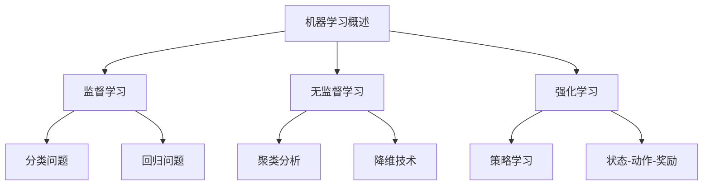
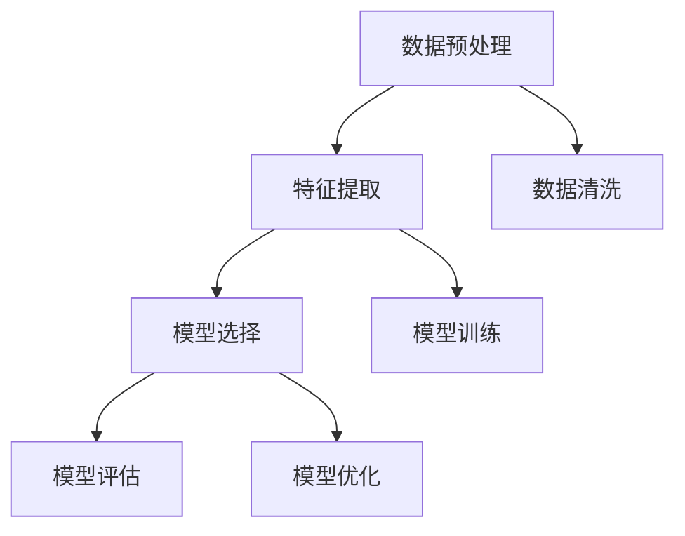

                 

# 【AI大数据计算原理与代码实例讲解】机器学习

> 关键词：机器学习、大数据、算法原理、Python实现、深度学习

> 摘要：本文将深入探讨机器学习的原理及其在大数据环境中的应用。我们将从基础的机器学习概念出发，逐步深入到大数据处理的挑战和解决方案，并以Python代码实例的形式进行详细讲解。通过本文的学习，读者将能够理解机器学习算法的工作机制，掌握利用大数据进行模型训练和预测的技巧。

## 1. 背景介绍

### 1.1 目的和范围

本文旨在向读者介绍机器学习的基本原理及其在大数据场景中的应用。我们将覆盖以下几个主要部分：

- 机器学习基础概念和算法介绍
- 大数据处理中机器学习的挑战
- 大数据环境中机器学习的解决方案
- Python代码实例讲解

### 1.2 预期读者

本文适合对机器学习和大数据处理有一定基础的读者，包括但不限于：

- 计算机科学专业本科生和研究生的课程学习
- 机器学习和数据科学领域的从业者
- 对人工智能技术感兴趣的普通读者

### 1.3 文档结构概述

本文结构如下：

1. **背景介绍**：简要介绍机器学习与大数据的关系及文章目的。
2. **核心概念与联系**：通过Mermaid流程图展示机器学习的核心概念和架构。
3. **核心算法原理与具体操作步骤**：详细讲解机器学习算法的原理和伪代码实现。
4. **数学模型和公式**：介绍机器学习的数学基础，包括公式和例子。
5. **项目实战**：通过Python代码实例展示机器学习在数据集上的应用。
6. **实际应用场景**：探讨机器学习在工业界和学术界的应用案例。
7. **工具和资源推荐**：推荐学习资源、开发工具和框架。
8. **总结**：预测机器学习领域的未来发展趋势和挑战。
9. **附录**：常见问题与解答。
10. **扩展阅读**：提供进一步学习的参考资料。

### 1.4 术语表

#### 1.4.1 核心术语定义

- **机器学习**：一种使计算机具备自我学习和改进能力的技术。
- **大数据**：数据量巨大，数据类型多样，数据生成速度快。
- **深度学习**：一种特殊的机器学习技术，使用多层神经网络进行训练。

#### 1.4.2 相关概念解释

- **监督学习**：有标注的数据训练模型。
- **无监督学习**：无标注的数据发现数据分布。
- **强化学习**：通过与环境交互学习最优策略。

#### 1.4.3 缩略词列表

- **ML**：Machine Learning（机器学习）
- **AI**：Artificial Intelligence（人工智能）
- **DL**：Deep Learning（深度学习）
- **GPU**：Graphics Processing Unit（图形处理单元）

## 2. 核心概念与联系

首先，我们通过Mermaid流程图来展示机器学习的核心概念和架构。



### 2.1 机器学习基本概念

机器学习（Machine Learning，ML）是人工智能（Artificial Intelligence，AI）的一个重要分支，旨在通过数据学习并改进算法性能。机器学习可以分为三种主要类型：监督学习（Supervised Learning）、无监督学习（Unsupervised Learning）和强化学习（Reinforcement Learning）。

- **监督学习**：有标签的数据进行训练，例如分类和回归问题。
- **无监督学习**：没有标签的数据进行训练，例如聚类分析和降维技术。
- **强化学习**：通过与环境的交互进行学习，例如策略学习和状态-动作-奖励模型。

### 2.2 机器学习架构

机器学习架构通常包括数据预处理、模型选择、训练和评估等步骤。下面是一个简化的Mermaid流程图，展示了机器学习的基本架构。



## 3. 核心算法原理与具体操作步骤

### 3.1 监督学习算法

监督学习算法包括分类问题和回归问题。以下是线性回归的伪代码实现。

```python
# 线性回归伪代码
def linear_regression(x, y):
    # 求斜率和截距
    n = len(x)
    mean_x = sum(x) / n
    mean_y = sum(y) / n
    numerator = 0
    denominator = 0
    
    for i in range(n):
        numerator += (x[i] - mean_x) * (y[i] - mean_y)
        denominator += (x[i] - mean_x) ** 2
    
    slope = numerator / denominator
    intercept = mean_y - slope * mean_x
    
    # 预测
    for i in range(n):
        y_pred = slope * x[i] + intercept
        print(f"预测值: {y_pred}, 实际值: {y[i]}")
```

### 3.2 无监督学习算法

无监督学习算法包括聚类分析和降维技术。以下为K均值聚类的伪代码实现。

```python
# K均值聚类伪代码
def k_means(data, k):
    # 初始化中心点
    centroids = initialize_centroids(data, k)
    
    while not_converged(centroids):
        # 分配数据点
        clusters = assign_clusters(data, centroids)
        
        # 更新中心点
        centroids = update_centroids(clusters, k)
    
    return centroids, clusters
```

### 3.3 强化学习算法

强化学习算法的核心是策略学习。以下是Q学习的伪代码实现。

```python
# Q学习伪代码
def q_learning(state, action, reward, next_state, learning_rate, discount_factor):
    # 更新Q值
    current_q_value = q_value[state][action]
    next_q_value = max(q_value[next_state].values())
    
    # 计算更新量
    td_target = reward + discount_factor * next_q_value
    update = td_target - current_q_value
    
    # 应用更新
    q_value[state][action] += learning_rate * update
```

## 4. 数学模型和公式

### 4.1 线性回归

线性回归的数学公式如下：

$$
y = \beta_0 + \beta_1x + \epsilon
$$

其中，\(y\) 为因变量，\(x\) 为自变量，\(\beta_0\) 为截距，\(\beta_1\) 为斜率，\(\epsilon\) 为误差项。

### 4.2 K均值聚类

K均值聚类的目标是最小化目标函数，公式如下：

$$
J = \sum_{i=1}^{k} \sum_{x_j \in S_i} ||x_j - \mu_i||^2
$$

其中，\(k\) 为聚类个数，\(S_i\) 为第 \(i\) 个聚类，\(\mu_i\) 为聚类中心。

### 4.3 Q学习

Q学习的目标是最小化预期误差，公式如下：

$$
Q(s, a) = r + \gamma \max_{a'} Q(s', a')
$$

其中，\(s\) 为状态，\(a\) 为动作，\(r\) 为即时奖励，\(\gamma\) 为折扣因子，\(s'\) 为下一状态，\(a'\) 为下一动作。

## 5. 项目实战：代码实际案例和详细解释说明

### 5.1 开发环境搭建

在开始实际案例之前，我们需要搭建一个合适的Python开发环境。以下是一个基本的安装步骤：

1. 安装Python 3.x版本。
2. 安装Jupyter Notebook，用于编写和运行代码。
3. 安装机器学习库，如scikit-learn、TensorFlow和PyTorch。

### 5.2 源代码详细实现和代码解读

以下是一个简单的线性回归模型的Python代码实例。

```python
import numpy as np
from sklearn.linear_model import LinearRegression

# 生成训练数据
np.random.seed(0)
x = np.random.rand(100)
y = 2 * x + 1 + np.random.randn(100)

# 创建线性回归模型
model = LinearRegression()

# 训练模型
model.fit(x.reshape(-1, 1), y)

# 输出模型参数
print(f"斜率: {model.coef_}, 截距: {model.intercept_}")

# 进行预测
x_test = np.random.rand(10)
y_pred = model.predict(x_test.reshape(-1, 1))
print(f"预测值: {y_pred}")
```

### 5.3 代码解读与分析

- **生成训练数据**：我们使用numpy库生成100个随机样本，其中 \(y\) 的表达式为 \(y = 2x + 1 + \epsilon\)，其中 \(\epsilon\) 为随机误差。
- **创建线性回归模型**：我们使用scikit-learn库的LinearRegression类创建线性回归模型。
- **训练模型**：我们使用`fit`方法将模型训练在训练数据上。
- **输出模型参数**：我们使用`coef_`和`intercept_`属性输出模型的斜率和截距。
- **进行预测**：我们使用`predict`方法对新的测试数据进行预测。

## 6. 实际应用场景

### 6.1 金融风险预测

机器学习在金融领域的应用广泛，尤其是在风险预测方面。例如，银行可以使用机器学习算法来预测客户是否会违约，从而采取相应的预防措施。

### 6.2 医疗诊断

医疗诊断是一个典型的机器学习应用场景。通过分析患者的病史、检查结果等数据，机器学习模型可以帮助医生快速准确地诊断疾病。

### 6.3 电商推荐系统

电商推荐系统利用机器学习算法分析用户的购买历史和行为，为用户提供个性化的商品推荐。

## 7. 工具和资源推荐

### 7.1 学习资源推荐

#### 7.1.1 书籍推荐

- 《Python机器学习》
- 《深度学习》
- 《统计学习方法》

#### 7.1.2 在线课程

- Coursera的《机器学习》
- edX的《深度学习》
- Udacity的《机器学习工程师纳米学位》

#### 7.1.3 技术博客和网站

- Medium上的机器学习专题
- 知乎上的机器学习话题
- Analytics Vidhya

### 7.2 开发工具框架推荐

#### 7.2.1 IDE和编辑器

- PyCharm
- Jupyter Notebook
- VSCode

#### 7.2.2 调试和性能分析工具

- PySnooper
- LineProfiler
- Numba

#### 7.2.3 相关框架和库

- scikit-learn
- TensorFlow
- PyTorch

### 7.3 相关论文著作推荐

#### 7.3.1 经典论文

- "A Course in Machine Learning"
- "Deep Learning"
- "Learning Representations for Visual Recognition"

#### 7.3.2 最新研究成果

- NeurIPS、ICML、JMLR等顶级会议的最新论文
- ArXiv上的最新研究成果

#### 7.3.3 应用案例分析

- Google的深度学习技术在搜索中的应用
- Amazon的机器学习在电商推荐系统中的应用

## 8. 总结：未来发展趋势与挑战

### 8.1 发展趋势

- **硬件加速**：GPU和TPU等硬件的快速发展，使得机器学习计算更加高效。
- **模型压缩**：针对大型模型进行压缩和优化，以适应有限的计算资源。
- **可解释性**：提高模型的可解释性，使其更加透明和可信。
- **多模态学习**：融合不同类型的数据，如文本、图像和语音。

### 8.2 挑战

- **数据隐私**：如何保护用户数据隐私成为重要问题。
- **模型安全**：如何确保模型的安全性，防止恶意攻击。
- **资源分配**：如何优化资源分配，提高机器学习任务的处理效率。

## 9. 附录：常见问题与解答

### 9.1 问题1

**Q：如何选择合适的机器学习算法？**

**A：选择合适的机器学习算法需要考虑多个因素，包括数据类型、数据量、业务需求和计算资源等。常见的算法选择策略包括：**
- **数据量较小且无标签数据**：使用无监督学习算法，如K均值聚类。
- **数据量较大且有标签数据**：选择有监督学习算法，如线性回归或决策树。
- **需要快速预测且资源有限**：选择轻量级算法，如逻辑回归或随机森林。

### 9.2 问题2

**Q：如何优化机器学习模型性能？**

**A：优化机器学习模型性能可以从以下几个方面入手：**
- **数据预处理**：进行数据清洗、特征提取和降维，提高数据质量。
- **模型选择**：根据业务需求和数据特征选择合适的算法。
- **参数调优**：使用网格搜索或贝叶斯优化等方法进行参数调优。
- **特征工程**：通过构建新的特征或调整现有特征，提高模型性能。

## 10. 扩展阅读 & 参考资料

- [机器学习教科书](https://www.manning.com/books/machine-learning-book)
- [深度学习专项课程](https://www.coursera.org/specializations/deeplearning)
- [机器学习在线课程](https://www.udacity.com/course/machine-learning-engineer-nanodegree--nd101)
- [大数据技术导论](https://www.morgankaufmann.com/books/details.aspx?isbn=0123814890)

