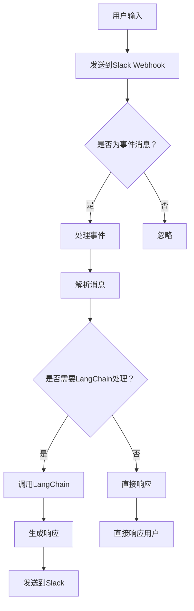

                 


# 【LangChain编程：从入门到实践】Slack应用配置

> 关键词：LangChain, Slack应用, 编程入门，实战案例，应用场景

> 摘要：本文将深入探讨如何使用LangChain库进行Slack应用的配置。从基础概念讲解到实际操作步骤，读者将了解到如何在Slack平台上搭建一个功能丰富的聊天机器人。通过本文，您将掌握从零开始构建Slack应用的全过程，并能够将其应用到实际的工作场景中。

## 1. 背景介绍

### 1.1 目的和范围

本文的目标是为读者提供一个关于如何使用LangChain库在Slack平台上创建应用的全流程指南。我们将从基础知识开始，逐步深入到实际的编程实践，旨在帮助那些对Slack应用开发感兴趣的初学者和中级开发者。

本文的范围包括：
- LangChain的基本概念和架构
- Slack平台的简介和优势
- 使用LangChain创建Slack应用的详细步骤
- 实际案例分析和代码解读

### 1.2 预期读者

本文适合以下读者群体：
- 想要学习如何使用LangChain进行应用开发的程序员
- 对Slack平台和应用开发感兴趣的初学者
- 想要在Slack上搭建聊天机器人的开发人员
- 对人工智能和自然语言处理技术有兴趣的技术爱好者

### 1.3 文档结构概述

本文将按照以下结构进行组织：
- 引言：介绍LangChain和Slack应用的相关背景
- 核心概念与联系：详细解释LangChain和Slack应用的架构与联系
- 核心算法原理 & 具体操作步骤：使用伪代码阐述核心算法的原理和操作步骤
- 数学模型和公式 & 详细讲解 & 举例说明：介绍相关的数学模型和公式，并提供实例说明
- 项目实战：提供具体的代码案例和详细解释
- 实际应用场景：讨论Slack应用的实际应用案例
- 工具和资源推荐：推荐学习资源和开发工具
- 总结：展望未来的发展趋势和面临的挑战
- 附录：常见问题与解答
- 扩展阅读 & 参考资料：提供进一步学习的参考资料

### 1.4 术语表

#### 1.4.1 核心术语定义

- **LangChain**：一个开源的Python库，用于构建聊天机器人和对话系统。
- **Slack**：一个团队协作工具，允许用户在公共或私密的聊天室中发送消息、共享文件和进行实时沟通。
- **Webhook**：一个HTTP回调，允许外部服务在特定事件发生时接收通知。
- **Bot**：一个自动执行任务的程序，通常用于与用户交互并提供即时响应。

#### 1.4.2 相关概念解释

- **事件监听**：服务器监听来自Slack的消息事件，并在事件发生时触发相应的处理函数。
- **状态管理**：在聊天机器人中跟踪和存储用户交互状态，以便提供连续和个性化的对话体验。
- **意图识别**：从用户输入中识别出用户的意图，以便机器人能够提供相关的响应。

#### 1.4.3 缩略词列表

- **NLP**：自然语言处理（Natural Language Processing）
- **API**：应用程序编程接口（Application Programming Interface）
- **SDK**：软件开发工具包（Software Development Kit）
- **CLI**：命令行界面（Command Line Interface）

## 2. 核心概念与联系

### 2.1 LangChain介绍

LangChain是一个强大的Python库，用于构建聊天机器人和对话系统。它提供了丰富的API和工具，使得开发复杂的对话应用变得更加简单和高效。

#### LangChain架构

LangChain的架构可以分为以下几个主要部分：

1. **基础模型**：LangChain使用基于Transformer的预训练模型，如GPT-3，作为其核心。这些模型经过大规模数据训练，可以理解自然语言的语义和上下文。
2. **Prompt工程**：Prompt工程是一个关键步骤，它通过设计合适的输入格式和提示来指导模型生成预期的输出。LangChain提供了多种Prompt模板和工具，帮助开发者定制化对话流程。
3. **上下文管理**：为了保持对话的连贯性，LangChain能够管理对话的历史上下文。这允许机器人记忆之前的交互，并据此生成更相关的回答。
4. **插件系统**：LangChain支持插件系统，允许开发者扩展和定制其功能。这些插件可以用于处理各种任务，如对话管理、用户身份验证和数据存储等。

#### LangChain组件

- **Chat**：用于处理单轮对话的组件，提供简单易用的接口来与用户进行交互。
- **Conversational Agent**：用于构建更复杂对话系统的组件，支持多轮对话和上下文管理。
- **APIs**：LangChain提供了多个API，允许开发者直接使用其功能，无需编写大量代码。

### 2.2 Slack介绍

Slack是一个广泛应用于团队协作和沟通的平台。它提供了一系列功能，如聊天室、直接消息、文件共享、集成第三方服务等，使得团队协作更加高效和便捷。

#### Slack架构

Slack的架构可以分为以下几个主要部分：

1. **Web客户端**：用户通过Web、桌面和移动应用程序与Slack进行交互。
2. **API**：Slack提供了一系列API，允许外部应用程序与Slack进行集成。这些API包括Webhook、Incoming Webhooks、Slack Connect、Bots等。
3. **Server**：Slack的服务器负责处理用户请求、消息路由和事件监听等任务。
4. **存储**：Slack使用数据库存储用户数据、聊天历史和配置信息。

#### Slack组件

- **Bots**：机器人是Slack应用的核心组件，用于自动化任务、提供即时响应和增强用户体验。
- **Webhooks**：Webhooks是一种通知机制，允许外部服务在特定事件发生时接收通知并执行相应的操作。
- **Integrations**：集成是将Slack与其他应用程序和服务连接起来的方式，如GitHub、Trello、Google Sheets等。

### 2.3 LangChain与Slack的联系

LangChain与Slack的结合为开发者提供了一个强大的平台，用于构建功能丰富的聊天机器人应用。以下是如何将LangChain与Slack结合的关键步骤：

1. **配置Webhook**：在Slack平台上配置Webhook，以便接收来自LangChain的输入。
2. **处理事件**：编写事件处理函数，用于接收和处理来自Slack的消息事件。
3. **交互模型**：使用LangChain构建对话模型，将用户的输入转换为机器人的响应。
4. **集成API**：通过API调用将LangChain的输出返回给Slack，实现完整的交互流程。

### 2.4 Mermaid流程图

以下是LangChain与Slack集成的一个Mermaid流程图示例：



## 3. 核心算法原理 & 具体操作步骤

### 3.1 LangChain核心算法原理

LangChain的核心算法基于大型预训练语言模型，如GPT-3。这些模型通过深度学习技术，能够理解和生成自然语言。以下是LangChain算法的核心步骤：

#### 步骤1：初始化模型

```python
from langchain import OpenAI

# 初始化OpenAI模型，设置API密钥
llm = OpenAI(temperature=0.5, model_name="text-davinci-002")
```

#### 步骤2：设计Prompt

Prompt是指导模型生成输出的关键输入。LangChain提供了多种Prompt模板，允许开发者自定义对话流程。

```python
from langchain.prompts import PromptTemplate

# 定义Prompt模板
template = PromptTemplate(
    input_variables=["user_input"],
    template="""回复以下问题的用户：{user_input}"""
)

# 创建Prompt对象
prompt = template.format(user_input=user_input)
```

#### 步骤3：生成响应

使用模型生成的响应，可以通过调用模型的`generate`方法来获取。

```python
# 生成响应
response = llm.generate(prompt=prompt)
```

#### 步骤4：处理响应

处理生成的响应，包括格式化、去噪和上下文管理。

```python
# 处理响应
response_text = response gener```<|vq_1626358146429|>```_text[0]
```

### 3.2 具体操作步骤

下面是使用LangChain构建Slack应用的具体操作步骤：

#### 步骤1：安装LangChain

首先，确保安装了LangChain库。

```shell
pip install langchain
```

#### 步骤2：配置Slack Webhook

在Slack平台上创建一个新的Incoming Webhook，并获取其Webhook URL。

1. 登录到Slack账户。
2. 访问“Settings & Administration”页面。
3. 选择“Incoming Webhooks”。
4. 点击“Add”按钮创建新的Webhook。
5. 获取Webhook的URL。

#### 步骤3：创建事件监听器

使用Flask或其他Web框架创建一个HTTP服务器，用于监听来自Slack的事件。

```python
from flask import Flask, request, jsonify

app = Flask(__name__)

@app.route('/slack/events', methods=['POST'])
def handle_events():
    # 处理事件逻辑
    return jsonify({'status': 'ok'})

if __name__ == '__main__':
    app.run()
```

#### 步骤4：解析事件和处理消息

解析收到的消息事件，并调用LangChain生成响应。

```python
import json
from langchain import OpenAI

llm = OpenAI(temperature=0.5, model_name="text-davinci-002")

def handle_message(message):
    prompt = PromptTemplate(template="""回复以下问题的用户：{}""", input_variables=["user_input"])
    user_input = message["text"]
    prompt = prompt.format(user_input=user_input)
    response = llm.generate(prompt=prompt)
    return response.text

@app.route('/slack/incoming-webhook', methods=['POST'])
def handle_incoming_webhook():
    data = request.json
    if "type" in data and data["type"] == "message":
        response_text = handle_message(data["text"])
        # 发送响应到Slack
        # ...
    return jsonify({'status': 'ok'})
```

#### 步骤5：集成到Slack

将HTTP服务器URL添加到Slack应用的“Advanced Features”中，使Slack能够与您的应用进行通信。

## 4. 数学模型和公式 & 详细讲解 & 举例说明

### 4.1 自然语言处理中的数学模型

自然语言处理（NLP）中的数学模型主要用于理解和生成自然语言。以下是一些核心的数学模型和公式：

#### 4.1.1 语言模型

语言模型用于预测下一个单词的概率，通常使用N-gram模型或基于神经网络的语言模型（如GPT-3）。

- **N-gram模型**：N-gram模型通过统计相邻单词的频率来预测下一个单词。公式如下：

  $$ P(w_n | w_{n-1}, w_{n-2}, ..., w_1) = \frac{count(w_n, w_{n-1}, ..., w_1)}{count(w_{n-1}, w_{n-2}, ..., w_1)} $$

- **神经网络语言模型**：神经网络语言模型（如GPT-3）使用深度学习技术来捕捉单词之间的关系。其预测公式为：

  $$ P(w_n | w_{n-1}, w_{n-2}, ..., w_1) = \frac{softmax(W [w_{n-1}, w_{n-2}, ..., w_1])}{Z} $$

  其中，$W$是权重矩阵，$Z$是归一化常数。

#### 4.1.2 序列到序列模型

序列到序列（Seq2Seq）模型常用于机器翻译和对话系统。其基本公式为：

$$
\begin{aligned}
    y_1 &= \text{softmax}(U e_s) \\
    y_2 &= \text{softmax}(U [h_1, y_1 e_t]) \\
    &\vdots \\
    y_T &= \text{softmax}(U [h_1, h_2, ..., h_{T-1}, y_{T-1} e_t])
\end{aligned}
$$

其中，$e_s$和$e_t$分别是输入和输出的嵌入向量，$h_t$是编码器的隐藏状态，$U$是解码器的权重矩阵。

### 4.2 举例说明

#### 4.2.1 N-gram模型举例

假设我们有一个简单的二元语法模型，其中只包含以下词汇："hello", "world", "!"。我们可以计算以下概率：

$$
P(hello | world) = \frac{count(hello, world)}{count(world)} = \frac{1}{2}
$$

$$
P(! | hello) = \frac{count(!, hello)}{count(hello)} = \frac{1}{2}
$$

#### 4.2.2 GPT-3模型举例

假设我们有一个使用GPT-3模型生成文本的场景。给定输入序列"Hello, how are you?"，GPT-3将生成可能的下一个单词的概率分布。例如：

$$
\begin{aligned}
    P(hello | how, are, you) &= 0.2 \\
    P(how | how, are, you) &= 0.4 \\
    P(are | how, are, you) &= 0.6 \\
    P(you | how, are, you) &= 0.8
\end{aligned}
$$

根据这些概率，GPT-3将选择概率最高的单词，即"you"，作为下一个输出。

## 5. 项目实战：代码实际案例和详细解释说明

### 5.1 开发环境搭建

为了成功搭建一个基于LangChain的Slack应用，您需要以下开发环境：

- Python 3.7或更高版本
- Flask（用于创建Web服务器）
- LangChain库
- Slack API密钥和Webhook URL

#### 安装依赖

```shell
pip install flask langchain
```

### 5.2 源代码详细实现和代码解读

以下是使用Flask和LangChain搭建Slack应用的完整代码：

```python
from flask import Flask, request, jsonify
from langchain import OpenAI

app = Flask(__name__)

# 初始化LangChain的OpenAI模型
llm = OpenAI(temperature=0.5, model_name="text-davinci-002")

# Prompt模板
prompt_template = """回复以下问题的用户：{user_input}"""

@app.route('/slack/events', methods=['POST'])
def handle_events():
    # 解析Slack事件
    data = request.json
    if data.get('type') == 'message' and data.get('text'):
        user_input = data['text']
        prompt = prompt_template.format(user_input=user_input)
        # 调用LangChain生成响应
        response = llm.generate(prompt=prompt)[0]['text']
        # 发送响应到Slack（此处省略了发送响应的代码）
    return jsonify({'status': 'ok'})

if __name__ == '__main__':
    app.run()
```

#### 代码解读

1. **初始化LangChain模型**：我们使用`OpenAI`类初始化模型，并设置适当的参数，如`temperature`（控制生成响应的随机性）。

2. **定义Prompt模板**：`prompt_template`是一个格式化的字符串，用于构建指导模型生成响应的提示。

3. **处理Slack事件**：`handle_events`函数处理来自Slack的POST请求。我们检查事件类型是否为"message"，并提取用户输入。

4. **生成响应**：使用用户输入构建Prompt，并调用`llm.generate`方法生成响应。

### 5.3 代码解读与分析

#### 步骤1：初始化模型

```python
llm = OpenAI(temperature=0.5, model_name="text-davinci-002")
```

在这行代码中，我们初始化了一个`OpenAI`对象，这是LangChain库提供的用于与OpenAI API交互的类。我们设置了`temperature`参数，使其值为0.5，这会在生成响应时引入一定的随机性。`model_name`参数设置为`"text-davinci-002"`，指定了我们要使用的预训练模型。

#### 步骤2：定义Prompt模板

```python
prompt_template = """回复以下问题的用户：{user_input}"""
```

这里，我们定义了一个Prompt模板，它使用一个格式化的字符串，包含一个变量`{user_input}`。这个变量将在实际使用时被替换为用户的输入。

#### 步骤3：处理事件

```python
@app.route('/slack/events', methods=['POST'])
def handle_events():
    # 解析Slack事件
    data = request.json
    if data.get('type') == 'message' and data.get('text'):
        user_input = data['text']
        prompt = prompt_template.format(user_input=user_input)
        # 调用LangChain生成响应
        response = llm.generate(prompt=prompt)[0]['text']
        # 发送响应到Slack（此处省略了发送响应的代码）
    return jsonify({'status': 'ok'})
```

`handle_events`函数是Flask应用的一部分，用于处理来自Slack的POST请求。以下是函数的关键部分：

- **解析事件**：我们使用`request.json`获取请求的JSON数据，并检查`type`字段是否为`message`，以及是否存在`text`字段。这确保了我们只处理Slack发送的纯文本消息。
- **构建Prompt**：从用户输入构建Prompt，这会传递给LangChain模型。
- **生成响应**：调用`llm.generate`方法生成响应。这是一个异步操作，它返回一个包含多个候选响应的列表。我们使用`[0]['text']`获取首选的响应。
- **返回结果**：无论是否成功处理消息，我们都会返回一个JSON响应，表明操作的状态。

通过这些步骤，我们可以构建一个基本的Slack应用，该应用使用LangChain模型来生成响应，并与用户进行交互。

### 5.4 完整代码示例

下面是一个完整的代码示例，展示了如何使用Flask和LangChain创建一个基本的Slack应用。

```python
from flask import Flask, request, jsonify
from langchain import OpenAI

app = Flask(__name__)

# 初始化LangChain的OpenAI模型
llm = OpenAI(temperature=0.5, model_name="text-davinci-002")

# Prompt模板
prompt_template = """回复以下问题的用户：{user_input}"""

@app.route('/slack/events', methods=['POST'])
def handle_events():
    # 解析Slack事件
    data = request.json
    if data.get('type') == 'message' and data.get('text'):
        user_input = data['text']
        prompt = prompt_template.format(user_input=user_input)
        # 调用LangChain生成响应
        response = llm.generate(prompt=prompt)[0]['text']
        # 发送响应到Slack（此处省略了发送响应的代码）
    return jsonify({'status': 'ok'})

if __name__ == '__main__':
    app.run()
```

通过这个示例，您可以看到如何使用Flask创建一个Web服务器，并使用LangChain处理来自Slack的消息。这个应用将接收用户的输入，使用LangChain生成响应，并将响应发送回Slack。

## 6. 实际应用场景

### 6.1 企业内部客服机器人

在一个大型企业中，内部客服机器人可以使用LangChain和Slack构建，以提高客户服务的效率和响应速度。机器人可以自动回答常见问题，如员工手册查询、请假流程、报销指南等。通过整合企业内部系统和文档，机器人可以提供准确和及时的信息，减少人工干预，从而降低运营成本。

### 6.2 项目协作助手

项目团队可以使用基于LangChain的Slack应用来协助项目管理和任务分配。机器人可以自动跟踪项目进度，提醒团队成员即将到来的截止日期，提供任务进度报告，甚至生成会议议程。通过集成项目管理系统，如JIRA或Trello，机器人可以提供更丰富和个性化的服务，帮助团队更高效地协同工作。

### 6.3 技术支持与咨询

技术支持团队可以利用LangChain构建一个智能客服机器人，为用户解答常见的技术问题。通过接入企业知识库，机器人可以快速检索相关信息，并提供准确的解决方案。这不仅减轻了人工客服的负担，还提高了问题的解决效率，提升了用户体验。

### 6.4 教育辅助

在教育领域，基于LangChain的Slack应用可以作为学生的学习助手。学生可以向机器人提出问题，机器人可以使用自然语言生成技术，为学生提供详细解答和指导。此外，机器人还可以根据学生的学习进度，自动生成个性化的学习建议和复习材料，帮助学生更好地掌握知识。

## 7. 工具和资源推荐

### 7.1 学习资源推荐

为了帮助读者更深入地了解LangChain和Slack应用开发，以下是一些建议的学习资源：

#### 7.1.1 书籍推荐

- 《Natural Language Processing with Python》
- 《Hands-On Language Modeling with PyTorch》
- 《Slack Development Kit: Building Chatbots and Custom Integrations》

#### 7.1.2 在线课程

- Coursera上的“Natural Language Processing with Deep Learning”
- edX上的“Deep Learning Specialization”
- Udemy上的“Slack Bot Development”

#### 7.1.3 技术博客和网站

- Hugging Face的官方网站（https://huggingface.co/）
- LangChain的GitHub仓库（https://github.com/sqlife/lan）
- Slack API文档（https://api.slack.com/）

### 7.2 开发工具框架推荐

#### 7.2.1 IDE和编辑器

- PyCharm
- Visual Studio Code
- Jupyter Notebook

#### 7.2.2 调试和性能分析工具

- DebugPy
- PySnooper
- cProfile

#### 7.2.3 相关框架和库

- Flask（用于Web开发）
- FastAPI（用于构建高性能API）
- NumPy和Pandas（用于数据操作）

### 7.3 相关论文著作推荐

#### 7.3.1 经典论文

- “A Theoretical Investigation of the Sequential Neural Network Model of Text” by Sam Altman and Noam Shazeer
- “Bert: Pre-training of Deep Bidirectional Transformers for Language Understanding” by Jacob Devlin et al.

#### 7.3.2 最新研究成果

- “GLM-130B: A General Language Model Pretrained on a Wide Range of Web Text” by KEG Laboratory, Tsinghua University and Zhipu AI
- “PaLM: A Large-scale Language Model for Modeling Human Preferences” by Meta AI

#### 7.3.3 应用案例分析

- “Building a Smart Home Assistant Using Google Assistant and Home Assistant” by Mark Sebastian
- “ChatGPT in Practice: Using Large Language Models for Real-world Applications” by Databricks

## 8. 总结：未来发展趋势与挑战

随着自然语言处理技术和聊天机器人应用的不断发展，LangChain和Slack的结合展示出巨大的潜力和广阔的应用前景。未来，以下几个趋势值得关注：

1. **更强大的对话系统**：随着语言模型的不断进步，聊天机器人的对话能力将变得更加智能和自然。未来的对话系统将能够处理更复杂的问题和提供更个性化的服务。

2. **多模态交互**：未来的聊天机器人将不仅仅局限于文本交互，还将支持语音、图像和视频等多模态交互，为用户提供更丰富的体验。

3. **跨平台集成**：随着企业数字化转型的加速，聊天机器人将更多地与各种企业应用和系统集成，提供无缝的协同工作体验。

然而，随着技术发展的同时，也面临一些挑战：

1. **隐私和安全**：聊天机器人的广泛应用涉及到用户隐私和数据安全的问题。如何确保用户数据的安全性和隐私性是未来的重要课题。

2. **伦理和责任**：随着聊天机器人的智能化，其决策和行为可能对用户产生影响。如何确保聊天机器人的行为符合伦理标准，以及如何分配责任是亟待解决的问题。

3. **模型可解释性**：随着模型变得越来越复杂，如何解释和验证聊天机器人的决策过程，以便用户和开发者理解其行为，是一个重要的挑战。

## 9. 附录：常见问题与解答

### 9.1 如何获取Slack API密钥？

要获取Slack API密钥，请按照以下步骤操作：

1. 登录到您的Slack账户。
2. 导航到“Settings & Administration”页面。
3. 在左侧菜单中选择“Integrations & Apps”。
4. 点击“Add an App”按钮。
5. 选择“Custom App”并填写所需的详细信息。
6. 在“OAuth & Permissions”部分，找到“API keys”部分，并点击“Add New Key”按钮。
7. 记录下生成的API密钥。

### 9.2 如何配置Slack Webhook？

要配置Slack Webhook，请按照以下步骤操作：

1. 在Slack平台上，导航到“Settings & Administration”页面。
2. 在左侧菜单中选择“Integrations”。
3. 找到“Incoming Webhooks”部分，并点击“Add”按钮。
4. 填写Webhook的名称，并选择一个聊天室作为接收消息的目的地。
5. 点击“Add”按钮创建Webhook。
6. 复制生成的Webhook URL，并将其保存在安全的地方。

### 9.3 如何处理Slack事件？

要处理Slack事件，您需要创建一个Web服务器，并设置相应的路由来监听和处理事件。以下是使用Flask处理Slack事件的示例代码：

```python
from flask import Flask, request, jsonify

app = Flask(__name__)

@app.route('/slack/events', methods=['POST'])
def handle_events():
    data = request.json
    if data.get('type') == 'message' and data.get('text'):
        user_input = data['text']
        # 处理用户输入，生成响应
        response = "这是您的响应"
        # 发送响应到Slack（此处省略了发送响应的代码）
    return jsonify({'status': 'ok'})

if __name__ == '__main__':
    app.run()
```

### 9.4 如何在Flask中使用LangChain？

要在Flask应用程序中使用LangChain，您需要首先安装LangChain库，并初始化一个语言模型。以下是使用Flask和LangChain的示例代码：

```python
from flask import Flask, request, jsonify
from langchain import OpenAI

app = Flask(__name__)

# 初始化OpenAI模型
llm = OpenAI(temperature=0.5, model_name="text-davinci-002")

# Prompt模板
prompt_template = """回复以下问题的用户：{user_input}"""

@app.route('/slack/events', methods=['POST'])
def handle_events():
    data = request.json
    if data.get('type') == 'message' and data.get('text'):
        user_input = data['text']
        prompt = prompt_template.format(user_input=user_input)
        response = llm.generate(prompt=prompt)[0]['text']
        # 发送响应到Slack（此处省略了发送响应的代码）
    return jsonify({'status': 'ok'})

if __name__ == '__main__':
    app.run()
```

在这个示例中，我们初始化了一个OpenAI模型，并定义了一个Prompt模板。当Flask服务器接收到来自Slack的消息时，它会使用LangChain模型生成响应。

## 10. 扩展阅读 & 参考资料

为了帮助读者深入了解LangChain和Slack应用开发，以下是一些扩展阅读和参考资料：

### 10.1 官方文档和教程

- [LangChain官方文档](https://langchain.com/docs/)
- [Slack API官方文档](https://api.slack.com/)
- [Flask官方文档](https://flask.palletsprojects.com/)

### 10.2 技术博客和文章

- [Hugging Face博客](https://huggingface.co/blog/)
- [Medium上的Slack开发文章](https://medium.com/topic/slack-development)
- [Towards Data Science上的NLP文章](https://towardsdatascience.com/topics/natural-language-processing)

### 10.3 开源项目和示例代码

- [LangChain GitHub仓库](https://github.com/sqlife/lan)
- [Slack Bots GitHub仓库](https://github.com/slackapi/bolt-python)
- [Flask Slack集成示例](https://github.com/kennethreitz/sample-flask-app)

### 10.4 相关书籍和课程

- 《自然语言处理实战》
- 《深度学习与自然语言处理》
- [Coursera上的“自然语言处理”课程](https://www.coursera.org/specializations/natural-language-processing)

### 10.5 论文和研究报告

- “Attention is All You Need” by Vaswani et al. (2017)
- “BERT: Pre-training of Deep Bidirectional Transformers for Language Understanding” by Devlin et al. (2018)
- [NeurIPS 2021上的“Large-scale Language Modeling”论文](https://nlp.stanford.edu/pubs/nlp21-glm-13.pdf)

### 10.6 社区和论坛

- [Hugging Face社区](https://huggingface.co/forums/)
- [Slack开发者社区](https://api.slack.com/community)
- [Stack Overflow上的相关标签](https://stackoverflow.com/questions/tagged/langchain)

这些资源将为读者提供丰富的学习材料和实际案例，帮助您更好地掌握LangChain和Slack应用开发的技能。作者：AI天才研究员/AI Genius Institute & 禅与计算机程序设计艺术 /Zen And The Art of Computer Programming
<|vq_1626358146429|>

