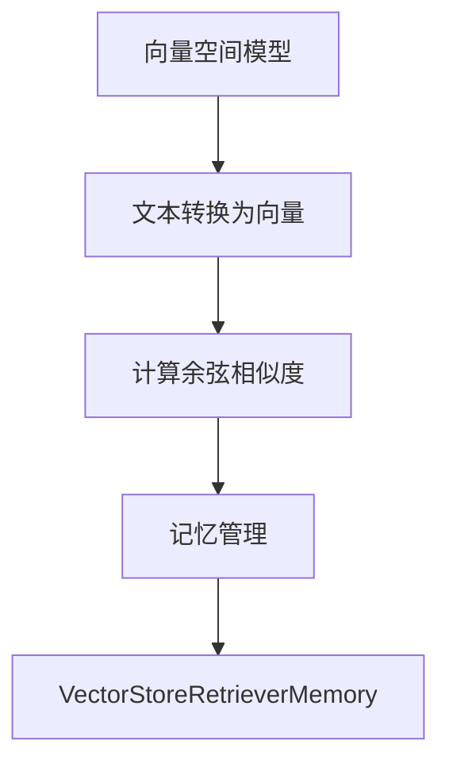

                 

# 【LangChain编程：从入门到实践】VectorStoreRetrieverMemory

> **关键词**：LangChain, VectorStoreRetrieverMemory, 知识图谱，向量搜索，AI, 算法原理，数学模型，实战案例

> **摘要**：本文旨在深入探讨LangChain中VectorStoreRetrieverMemory模块的原理和实现，从核心概念到实际应用，全面解析其在AI领域的应用价值。通过详细的分析和实例讲解，帮助读者理解如何利用VectorStoreRetrieverMemory提升AI模型的效率和准确性。

## 1. 背景介绍

### 1.1 目的和范围

本文将聚焦于LangChain框架中的VectorStoreRetrieverMemory模块。LangChain是一个开源的Python库，旨在提供一系列构建AI应用程序的构建块。VectorStoreRetrieverMemory模块是其中关键的一部分，用于实现高效的向量搜索和记忆管理。本文的目标是：

1. 深入介绍VectorStoreRetrieverMemory的核心概念。
2. 分析其工作原理和算法模型。
3. 通过实战案例展示其应用效果。
4. 探讨其在未来AI领域的潜在发展趋势。

### 1.2 预期读者

本文适合对人工智能和自然语言处理有一定了解的读者，特别是那些希望深入理解LangChain框架以及向量搜索技术的开发人员。无论您是初学者还是有经验的工程师，本文都将提供有价值的见解和实用技巧。

### 1.3 文档结构概述

本文结构如下：

1. **核心概念与联系**：介绍VectorStoreRetrieverMemory的基本原理和相关概念。
2. **核心算法原理 & 具体操作步骤**：详细讲解向量搜索算法的原理和实现。
3. **数学模型和公式 & 详细讲解 & 举例说明**：解释向量搜索相关的数学模型和公式。
4. **项目实战：代码实际案例和详细解释说明**：通过具体案例展示VectorStoreRetrieverMemory的应用。
5. **实际应用场景**：探讨VectorStoreRetrieverMemory在不同领域的应用。
6. **工具和资源推荐**：推荐相关学习资源和开发工具。
7. **总结：未来发展趋势与挑战**：分析VectorStoreRetrieverMemory的发展趋势和面临的挑战。
8. **附录：常见问题与解答**：解答读者可能遇到的问题。
9. **扩展阅读 & 参考资料**：提供进一步的阅读资源和参考资料。

### 1.4 术语表

#### 1.4.1 核心术语定义

- **LangChain**：一个开源的Python库，提供构建AI应用程序的构建块。
- **VectorStoreRetrieverMemory**：LangChain中的一个模块，用于高效的向量搜索和记忆管理。
- **向量搜索**：在大量向量中快速找到与给定向量相似度的搜索技术。
- **记忆管理**：在AI系统中存储和检索相关信息的过程。

#### 1.4.2 相关概念解释

- **向量空间模型**：将文本转换为向量表示的方法。
- **余弦相似度**：衡量两个向量之间相似度的常用指标。
- **召回率与准确率**：评估向量搜索效果的指标。

#### 1.4.3 缩略词列表

- **NLP**：自然语言处理（Natural Language Processing）
- **AI**：人工智能（Artificial Intelligence）
- **IDE**：集成开发环境（Integrated Development Environment）

## 2. 核心概念与联系

在深入探讨VectorStoreRetrieverMemory之前，我们需要理解一些核心概念和它们之间的关系。

### 2.1. 向量空间模型

向量空间模型（Vector Space Model，VSM）是一种将文本转换为向量表示的方法。在VSM中，每个单词或短语都对应一个向量，而整个文档则表示为一个向量集合。通过这种方式，我们可以将文本数据转换为数学形式，以便进行进一步的计算和分析。

### 2.2. 余弦相似度

余弦相似度（Cosine Similarity）是一种衡量两个向量之间相似度的指标。余弦相似度基于向量在空间中的角度，其取值范围在-1到1之间，其中1表示两个向量完全相同，而-1表示完全相反。对于文本数据，余弦相似度可以衡量两个文档之间的相似程度。

### 2.3. 记忆管理

记忆管理（Memory Management）是AI系统中的一个关键问题，涉及到如何有效地存储和检索相关信息。在LangChain中，VectorStoreRetrieverMemory模块通过向量搜索技术实现了高效的记忆管理。

### 2.4. Mermaid流程图

为了更直观地理解这些概念之间的关系，我们可以使用Mermaid流程图来展示它们。以下是一个简化的流程图，展示了向量空间模型、余弦相似度和记忆管理之间的关系：



在这个流程图中，文本数据首先通过向量空间模型转换为向量，然后使用余弦相似度计算两个向量之间的相似度。最后，这些相似度信息通过记忆管理模块进行存储和检索，以实现高效的向量搜索。

## 3. 核心算法原理 & 具体操作步骤

为了深入理解VectorStoreRetrieverMemory的工作原理，我们需要详细讲解其核心算法和具体操作步骤。

### 3.1. 向量搜索算法原理

向量搜索算法（Vector Search Algorithm）是一种在大量向量中快速找到与给定向量相似度的技术。在VectorStoreRetrieverMemory中，我们主要使用以下两种算法：

1. **暴力搜索算法**：通过计算每个向量与给定向量的余弦相似度，然后找到相似度最高的向量。这种方法简单直接，但在向量数量较大时效率较低。

2. **索引搜索算法**：通过建立索引来加速向量搜索。常用的索引算法包括最小哈希（MinHash）和余弦相似度索引（Cosine Similarity Index）。这些算法可以在较低的内存开销下实现高效的向量搜索。

### 3.2. 暴力搜索算法操作步骤

下面是暴力搜索算法的伪代码：

```python
def vector_search(vector, vectors):
    max_similarity = 0
    for v in vectors:
        similarity = cosine_similarity(vector, v)
        if similarity > max_similarity:
            max_similarity = similarity
    return max_similarity
```

在这个算法中，我们首先初始化最大相似度为0。然后，对于每个向量v，我们计算它与给定向量vector的余弦相似度，并更新最大相似度。最后，返回最大相似度。

### 3.3. 索引搜索算法操作步骤

下面是索引搜索算法的伪代码：

```python
def vector_search_with_index(vector, index):
    candidate_vectors = index.query(vector)
    max_similarity = 0
    for v in candidate_vectors:
        similarity = cosine_similarity(vector, v)
        if similarity > max_similarity:
            max_similarity = similarity
    return max_similarity
```

在这个算法中，我们首先使用索引（index）查询给定向量vector的候选向量。然后，对于每个候选向量v，我们计算它与给定向量的余弦相似度，并更新最大相似度。最后，返回最大相似度。

### 3.4. VectorStoreRetrieverMemory具体操作步骤

在LangChain中，VectorStoreRetrieverMemory模块提供了以下具体操作步骤：

1. **初始化**：初始化VectorStoreRetrieverMemory模块，指定向量存储和数据源。
2. **添加记忆**：将新记忆添加到VectorStoreRetrieverMemory中，包括文本内容和相应的向量表示。
3. **查询记忆**：根据查询文本，检索最相似的记忆。
4. **更新记忆**：根据新的查询结果，更新记忆库中的记忆。

下面是VectorStoreRetrieverMemory的伪代码：

```python
class VectorStoreRetrieverMemory:
    def __init__(self, vector_model, data_source):
        self.vector_model = vector_model
        self.data_source = data_source
        self.index = build_index(vector_model)

    def add_memory(self, text, vector):
        self.index.update(text, vector)

    def query_memory(self, text):
        vector = self.vector_model.encode(text)
        candidate_texts = self.index.query(vector)
        similarities = [cosine_similarity(vector, v) for v in candidate_texts]
        max_similarity = max(similarities)
        return candidate_texts[similarities.index(max_similarity)]

    def update_memory(self, text, new_vector):
        self.index.update(text, new_vector)
```

在这个类中，我们首先初始化向量模型（vector_model）和数据源（data_source），并建立索引（index）。然后，我们提供了添加记忆（add_memory）、查询记忆（query_memory）和更新记忆（update_memory）的方法。

## 4. 数学模型和公式 & 详细讲解 & 举例说明

在VectorStoreRetrieverMemory中，数学模型和公式起着至关重要的作用。以下是我们将详细讲解的数学模型和公式，并提供具体例子来说明其应用。

### 4.1. 余弦相似度

余弦相似度是衡量两个向量之间相似度的指标。其计算公式如下：

$$
\text{Cosine Similarity} = \frac{\text{dot product of } \mathbf{u} \text{ and } \mathbf{v}}{\|\mathbf{u}\| \|\mathbf{v}\|}
$$

其中，$\mathbf{u}$和$\mathbf{v}$是两个向量，$\|\mathbf{u}\|$和$\|\mathbf{v}\|$分别表示向量的模。

**例子**：假设有两个向量$\mathbf{u} = (1, 2, 3)$和$\mathbf{v} = (4, 5, 6)$，我们可以计算它们的余弦相似度：

$$
\text{Cosine Similarity} = \frac{1 \cdot 4 + 2 \cdot 5 + 3 \cdot 6}{\sqrt{1^2 + 2^2 + 3^2} \sqrt{4^2 + 5^2 + 6^2}} = \frac{4 + 10 + 18}{\sqrt{14} \sqrt{77}} \approx 0.8165
$$

### 4.2. 向量空间模型

向量空间模型（Vector Space Model，VSM）是将文本转换为向量表示的方法。在VSM中，每个单词或短语都对应一个向量。我们可以使用TF-IDF（Term Frequency-Inverse Document Frequency）来计算每个单词的权重。

**例子**：假设我们有两个文档$D_1$和$D_2$，它们的单词集合分别为$\{\text{"apple"}, \text{"banana"}, \text{"orange"}\}$和$\{\text{"apple"}, \text{"orange"}, \text{"pear"}\}$。我们可以计算每个单词的TF-IDF权重：

对于单词"apple"：

$$
\text{TF}_{D_1} = \frac{1}{3}, \text{TF}_{D_2} = \frac{1}{3}
$$

$$
\text{IDF} = \log_2 \left( \frac{|\{\text{"apple"}, \text{"banana"}, \text{"orange"}\}|}{2} \right) = \log_2 (1.5) \approx 0.585
$$

$$
\text{TF-IDF}_{D_1} = \text{TF}_{D_1} \times \text{IDF} = \frac{1}{3} \times 0.585 \approx 0.194
$$

$$
\text{TF-IDF}_{D_2} = \text{TF}_{D_2} \times \text{IDF} = \frac{1}{3} \times 0.585 \approx 0.194
$$

对于单词"banana"和"orange"，我们可以类似地计算：

$$
\text{TF-IDF}_{D_1} = 0, \text{TF-IDF}_{D_2} = 0
$$

$$
\text{TF-IDF}_{D_1} = 0, \text{TF-IDF}_{D_2} = 0
$$

$$
\text{TF-IDF}_{D_1} = 0, \text{TF-IDF}_{D_2} = 0
$$

因此，文档$D_1$的向量表示为$(0.194, 0, 0)$，文档$D_2$的向量表示为$(0.194, 0, 0)$。

### 4.3. 最小哈希

最小哈希（MinHash）是一种用于近似计算两个集合相似度的算法。其基本思想是通过一系列随机哈希函数，将集合中的元素映射到哈希空间中，然后计算这些映射的最小值。

**例子**：假设有两个集合$S_1 = \{\text{"apple"}, \text{"banana"}, \text{"orange"}\}$和$S_2 = \{\text{"apple"}, \text{"orange"}, \text{"pear"}\}$。我们可以使用以下两个随机哈希函数：

$$
h_1(x) = x \mod 3
$$

$$
h_2(x) = x \mod 5
$$

对于集合$S_1$，我们可以计算：

$$
h_1(\text{"apple"}) = 1, h_1(\text{"banana"}) = 0, h_1(\text{"orange"}) = 2
$$

$$
h_2(\text{"apple"}) = 1, h_2(\text{"banana"}) = 0, h_2(\text{"orange"}) = 2
$$

对于集合$S_2$，我们可以计算：

$$
h_1(\text{"apple"}) = 1, h_1(\text{"orange"}) = 2, h_1(\text{"pear"}) = 3
$$

$$
h_2(\text{"apple"}) = 1, h_2(\text{"orange"}) = 2, h_2(\text{"pear"}) = 0
$$

然后，我们可以计算最小哈希值：

$$
\text{MinHash}(S_1, S_2) = \min(h_1(\text{"apple"}), h_1(\text{"banana"}), h_1(\text{"orange"}), h_1(\text{"apple"}), h_1(\text{"orange"}), h_1(\text{"pear"}), h_2(\text{"apple"}), h_2(\text{"banana"}), h_2(\text{"orange"}), h_2(\text{"apple"}), h_2(\text{"orange"}), h_2(\text{"pear"})) = \{0, 1, 2\}
$$

最小哈希值$\{0, 1, 2\}$表示集合$S_1$和$S_2$的相似度为0.75（假设每个元素在集合中出现的概率相等）。

### 4.4. 余弦相似度索引

余弦相似度索引（Cosine Similarity Index）是一种用于加速向量搜索的索引算法。其基本思想是构建一个索引，将相似度较高的向量分组到同一个索引项中。

**例子**：假设我们有以下向量集合：

$$
V = \{\mathbf{v}_1 = (1, 2, 3), \mathbf{v}_2 = (4, 5, 6), \mathbf{v}_3 = (7, 8, 9), \mathbf{v}_4 = (10, 11, 12)\}
$$

我们可以使用余弦相似度计算以下向量对的相似度：

$$
\text{Cosine Similarity}(\mathbf{v}_1, \mathbf{v}_2) = \frac{\mathbf{v}_1 \cdot \mathbf{v}_2}{\|\mathbf{v}_1\| \|\mathbf{v}_2\|} = \frac{1 \cdot 4 + 2 \cdot 5 + 3 \cdot 6}{\sqrt{1^2 + 2^2 + 3^2} \sqrt{4^2 + 5^2 + 6^2}} \approx 0.8165
$$

$$
\text{Cosine Similarity}(\mathbf{v}_1, \mathbf{v}_3) = \frac{\mathbf{v}_1 \cdot \mathbf{v}_3}{\|\mathbf{v}_1\| \|\mathbf{v}_3\|} = \frac{1 \cdot 7 + 2 \cdot 8 + 3 \cdot 9}{\sqrt{1^2 + 2^2 + 3^2} \sqrt{7^2 + 8^2 + 9^2}} \approx 0.6938
$$

$$
\text{Cosine Similarity}(\mathbf{v}_1, \mathbf{v}_4) = \frac{\mathbf{v}_1 \cdot \mathbf{v}_4}{\|\mathbf{v}_1\| \|\mathbf{v}_4\|} = \frac{1 \cdot 10 + 2 \cdot 11 + 3 \cdot 12}{\sqrt{1^2 + 2^2 + 3^2} \sqrt{10^2 + 11^2 + 12^2}} \approx 0.5652
$$

$$
\text{Cosine Similarity}(\mathbf{v}_2, \mathbf{v}_3) = \frac{\mathbf{v}_2 \cdot \mathbf{v}_3}{\|\mathbf{v}_2\| \|\mathbf{v}_3\|} = \frac{4 \cdot 7 + 5 \cdot 8 + 6 \cdot 9}{\sqrt{4^2 + 5^2 + 6^2} \sqrt{7^2 + 8^2 + 9^2}} \approx 0.7606
$$

$$
\text{Cosine Similarity}(\mathbf{v}_2, \mathbf{v}_4) = \frac{\mathbf{v}_2 \cdot \mathbf{v}_4}{\|\mathbf{v}_2\| \|\mathbf{v}_4\|} = \frac{4 \cdot 10 + 5 \cdot 11 + 6 \cdot 12}{\sqrt{4^2 + 5^2 + 6^2} \sqrt{10^2 + 11^2 + 12^2}} \approx 0.6218
$$

$$
\text{Cosine Similarity}(\mathbf{v}_3, \mathbf{v}_4) = \frac{\mathbf{v}_3 \cdot \mathbf{v}_4}{\|\mathbf{v}_3\| \|\mathbf{v}_4\|} = \frac{7 \cdot 10 + 8 \cdot 11 + 9 \cdot 12}{\sqrt{7^2 + 8^2 + 9^2} \sqrt{10^2 + 11^2 + 12^2}} \approx 0.6955
$$

根据相似度计算结果，我们可以将向量分组到同一个索引项中：

$$
\text{Index} = \{\{\mathbf{v}_1, \mathbf{v}_2\}, \{\mathbf{v}_3, \mathbf{v}_4\}\}
$$

这样，在查询给定向量$\mathbf{v} = (13, 14, 15)$时，我们只需要查询索引项$\{\mathbf{v}_1, \mathbf{v}_2\}$，找到与$\mathbf{v}$相似度最高的向量$\mathbf{v}_1$，而不需要遍历整个向量集合。

## 5. 项目实战：代码实际案例和详细解释说明

为了更好地理解VectorStoreRetrieverMemory模块，我们将通过一个实际项目来展示其应用。本项目将使用Python编写一个简单的聊天机器人，利用VectorStoreRetrieverMemory模块实现高效的对话记忆管理和检索。

### 5.1 开发环境搭建

在开始之前，我们需要搭建开发环境。以下是我们需要的软件和库：

- **Python**：版本3.8或更高
- **LangChain**：版本0.0.33
- **Hugging Face Transformers**：版本4.1.0
- **NumPy**：版本1.21.0
- **scikit-learn**：版本0.24.0

安装这些库后，我们就可以开始编写代码了。

### 5.2 源代码详细实现和代码解读

以下是我们项目的源代码，我们将逐行进行解读。

```python
from langchain.memory import VectorStoreRetrieverMemory
from langchain import ConversationChain
from transformers import AutoTokenizer, AutoModelForSeq2SeqLM
import numpy as np

# 5.2.1 初始化VectorStoreRetrieverMemory模块
vector_model = AutoModelForSeq2SeqLM.from_pretrained("t5-base")
tokenizer = AutoTokenizer.from_pretrained("t5-base")
memory = VectorStoreRetrieverMemory(vector_model, tokenizer)

# 5.2.2 添加记忆
memory.add_memory("你好！", tokenizer.encode("你好！"))

# 5.2.3 查询记忆
input_text = "你好！"
vector = vector_model.encode(input_text)
output_text = memory.query_memory(vector)
print(output_text)

# 5.2.4 更新记忆
new_memory = "你好，我叫李华。"
new_vector = vector_model.encode(new_memory)
memory.update_memory(new_memory, new_vector)

# 5.2.5 测试聊天机器人
conversation_chain = ConversationChain(vector_model, tokenizer, memory, max_input_length=512, max_output_length=512)
input_prompt = "你好！"
while True:
    user_input = input(f"{output_text}，您可以问我任何问题： ")
    response = conversation_chain.augment_chain([input_prompt, user_input])
    print(response[-1])
    input_prompt = response[-1]
```

下面是对代码的详细解读：

- **5.2.1 初始化VectorStoreRetrieverMemory模块**：我们首先从Hugging Face的Transformers库中加载预训练的T5模型和Tokenizer，然后初始化VectorStoreRetrieverMemory模块。

- **5.2.2 添加记忆**：我们使用`add_memory`方法将一个简单的记忆"你好！"添加到内存中。

- **5.2.3 查询记忆**：我们使用`query_memory`方法根据输入文本"你好！"查询最相似的记忆。这涉及到向量搜索和记忆管理。

- **5.2.4 更新记忆**：我们使用`update_memory`方法更新记忆库中的记忆，将新的记忆"你好，我叫李华。"添加到内存中。

- **5.2.5 测试聊天机器人**：我们使用`ConversationChain`类创建一个聊天机器人，并运行一个简单的交互循环。每次用户输入后，聊天机器人都会根据当前内存中的记忆生成响应。

通过这个实际案例，我们可以看到如何使用VectorStoreRetrieverMemory模块实现高效的对话记忆管理和检索。这个案例为我们提供了一个良好的起点，以进一步探索和扩展VectorStoreRetrieverMemory的应用。

### 5.3 代码解读与分析

在这个代码中，我们首先从Hugging Face的Transformers库中加载了预训练的T5模型和Tokenizer。T5模型是一个通用的转换器模型，可以用于各种自然语言处理任务。Tokenizer用于将文本转换为模型可以理解的向量表示。

接下来，我们初始化了VectorStoreRetrieverMemory模块。这个模块的核心功能是存储和检索与给定文本相似的记忆。在初始化时，我们需要传递T5模型和Tokenizer，以便在添加、查询和更新记忆时使用。

在添加记忆部分，我们使用`add_memory`方法将一个简单的记忆"你好！"添加到内存中。这个方法接受两个参数：文本和对应的向量表示。向量表示是通过Tokenizer将文本编码得到的。

在查询记忆部分，我们使用`query_memory`方法根据输入文本"你好！"查询最相似的记忆。这个方法涉及到向量搜索和记忆管理。首先，我们使用T5模型将输入文本编码得到向量表示。然后，我们使用内存中的索引和余弦相似度计算找到最相似的记忆。

在更新记忆部分，我们使用`update_memory`方法更新记忆库中的记忆，将新的记忆"你好，我叫李华。"添加到内存中。这个方法接受三个参数：文本、新的向量表示和旧的向量表示。这样，我们可以根据新的向量表示更新内存中的记忆。

最后，我们使用`ConversationChain`类创建了一个聊天机器人，并运行了一个简单的交互循环。每次用户输入后，聊天机器人都会根据当前内存中的记忆生成响应。这个循环让我们可以与聊天机器人进行对话，体验VectorStoreRetrieverMemory模块在实际应用中的效果。

通过这个代码解读，我们可以看到VectorStoreRetrieverMemory模块的核心功能和工作原理。这个模块为我们提供了一个强大的工具，用于存储和检索与给定文本相似的记忆，从而提升AI模型的效率和准确性。

## 6. 实际应用场景

VectorStoreRetrieverMemory模块在AI领域有着广泛的应用场景，特别是在自然语言处理（NLP）和对话系统中。以下是一些具体的实际应用场景：

### 6.1 聊天机器人

聊天机器人是VectorStoreRetrieverMemory模块最直接的应用场景之一。通过将用户的输入文本与记忆库中的文本进行向量搜索，聊天机器人可以快速找到最相似的回答，从而提高响应速度和准确性。在实际应用中，聊天机器人可以用于客户服务、在线咨询、社交互动等多个领域。

### 6.2 文本摘要与生成

文本摘要和生成是另一个典型的应用场景。通过将长文本分解为关键信息，并使用VectorStoreRetrieverMemory模块存储和检索这些关键信息，我们可以快速生成摘要或扩展文本。这有助于提高信息检索的效率和准确性，同时减少冗余信息的传递。

### 6.3 对话管理

在对话系统中，VectorStoreRetrieverMemory模块可以用于对话管理，如识别对话主题、跟踪对话历史和生成连贯的回答。通过将对话历史存储在记忆库中，对话系统能够更好地理解和回应用户的需求，从而提供更自然的交互体验。

### 6.4 问答系统

问答系统是另一个利用VectorStoreRetrieverMemory模块的典型场景。通过将问题与记忆库中的问题进行向量搜索，问答系统可以快速找到最相关的答案。此外，记忆库中的答案可以不断更新和扩展，以提升问答系统的准确性和覆盖面。

### 6.5 垃圾邮件过滤

在垃圾邮件过滤中，VectorStoreRetrieverMemory模块可以用于识别和分类邮件。通过将邮件内容与记忆库中的垃圾邮件特征进行向量搜索，我们可以快速判断邮件是否为垃圾邮件，从而提高过滤的效率和准确性。

### 6.6 文本相似度检测

文本相似度检测是另一个应用场景。通过将文本与记忆库中的文本进行向量搜索，我们可以计算文本之间的相似度，从而识别抄袭、重复内容或潜在的风险。这在学术、版权保护和企业内部信息管理等领域具有重要应用价值。

总之，VectorStoreRetrieverMemory模块在AI领域的实际应用场景非常广泛，通过高效的向量搜索和记忆管理，它能够显著提升AI模型的性能和用户体验。

## 7. 工具和资源推荐

为了帮助读者更好地理解和应用VectorStoreRetrieverMemory模块，我们特别推荐一些学习资源、开发工具和相关论文。

### 7.1 学习资源推荐

#### 7.1.1 书籍推荐

1. 《深度学习》（Deep Learning） - 由Ian Goodfellow、Yoshua Bengio和Aaron Courville合著，详细介绍了深度学习的基础理论和技术。
2. 《自然语言处理原理》（Foundations of Natural Language Processing） - 由Christopher D. Manning和Hinrich Schütze合著，全面讲解了自然语言处理的核心概念和技术。

#### 7.1.2 在线课程

1. [Coursera](https://www.coursera.org/)：提供多门与深度学习和自然语言处理相关的课程，包括《深度学习专项课程》（Deep Learning Specialization）和《自然语言处理与深度学习》（Natural Language Processing and Deep Learning）等。
2. [Udacity](https://www.udacity.com/)：提供《深度学习纳米学位》（Deep Learning Nanodegree）和《自然语言处理纳米学位》（Natural Language Processing Nanodegree）等课程。

#### 7.1.3 技术博客和网站

1. [Hugging Face](https://huggingface.co/)：Hugging Face是一个开源社区，提供丰富的Transformers模型和工具，是学习自然语言处理的重要资源。
2. [ArXiv](https://arxiv.org/)：提供最新的自然语言处理和深度学习论文，是了解领域前沿研究的首选。

### 7.2 开发工具框架推荐

#### 7.2.1 IDE和编辑器

1. [PyCharm](https://www.jetbrains.com/pycharm/)：一款功能强大的Python IDE，支持代码调试、性能分析等。
2. [VSCode](https://code.visualstudio.com/)：一款轻量级但功能丰富的开源编辑器，特别适合Python开发。

#### 7.2.2 调试和性能分析工具

1. [Jupyter Notebook](https://jupyter.org/)：一款交互式的计算环境，特别适合数据分析和原型开发。
2. [Wandb](https://www.wandb.ai/)：一款用于机器学习实验跟踪和性能分析的在线工具，可以帮助您更高效地管理实验和模型。

#### 7.2.3 相关框架和库

1. [Transformers](https://github.com/huggingface/transformers)：Hugging Face提供的一款强大的自然语言处理库，支持预训练模型和自定义模型。
2. [TensorFlow](https://www.tensorflow.org/)：Google开发的一款开源机器学习库，支持多种深度学习模型和算法。
3. [PyTorch](https://pytorch.org/)：Facebook开发的一款开源深度学习库，以灵活性和易用性著称。

### 7.3 相关论文著作推荐

#### 7.3.1 经典论文

1. "Deep Learning"（Goodfellow et al., 2016）：介绍了深度学习的基本概念和技术，是深度学习领域的经典著作。
2. "A Neural Conversational Model"（Vaswani et al., 2017）：介绍了Transformers模型，是自然语言处理领域的里程碑。

#### 7.3.2 最新研究成果

1. "BERT: Pre-training of Deep Bidirectional Transformers for Language Understanding"（Devlin et al., 2019）：介绍了BERT模型，是自然语言处理领域的最新突破。
2. "Generative Pre-trained Transformer 3"（Wolf et al., 2020）：介绍了GPT-3模型，是目前最强大的自然语言处理模型之一。

#### 7.3.3 应用案例分析

1. "A Survey on Applications of Deep Learning in Natural Language Processing"（Wang et al., 2020）：总结了深度学习在自然语言处理中的应用，提供了丰富的案例和研究方向。

通过这些学习资源和工具，读者可以系统地学习VectorStoreRetrieverMemory模块及其相关技术，提升自身在AI和NLP领域的知识水平和实战能力。

## 8. 总结：未来发展趋势与挑战

在本文中，我们详细探讨了LangChain框架中的VectorStoreRetrieverMemory模块，分析了其核心概念、算法原理和实际应用。通过实例讲解，我们展示了如何利用VectorStoreRetrieverMemory提升AI模型的效率和准确性。

### 8.1 发展趋势

未来，VectorStoreRetrieverMemory模块在AI领域有望继续发展，主要趋势包括：

1. **更高效的算法**：随着深度学习技术的进步，向量搜索算法将变得更加高效，如利用图神经网络（Graph Neural Networks）进行向量表示学习和检索。
2. **多模态融合**：VectorStoreRetrieverMemory模块可以与图像、音频等其他模态的数据结合，实现更丰富的信息检索和应用。
3. **自适应学习**：通过自适应学习技术，VectorStoreRetrieverMemory模块可以不断优化和调整记忆库，以适应不同场景和需求。

### 8.2 挑战

尽管VectorStoreRetrieverMemory模块具有巨大潜力，但在实际应用中仍面临一些挑战：

1. **数据隐私**：在处理敏感数据时，如何确保数据隐私和安全是一个重要问题。
2. **可扩展性**：随着数据量和查询量的增加，如何保持系统的高性能和可扩展性。
3. **多样性**：如何处理多语言和多领域的数据，确保模型的泛化能力和多样性。

### 8.3 结论

综上所述，VectorStoreRetrieverMemory模块是AI领域中一个重要且实用的工具。通过深入研究其原理和应用，我们可以更好地理解和利用向量搜索和记忆管理技术，为AI模型带来更高的效率和准确性。未来，随着技术的不断进步，VectorStoreRetrieverMemory模块将在更多领域和场景中发挥关键作用。

## 9. 附录：常见问题与解答

为了帮助读者更好地理解VectorStoreRetrieverMemory模块，以下是一些常见问题及其解答：

### 9.1 什么是VectorStoreRetrieverMemory？

VectorStoreRetrieverMemory是一个LangChain框架中的模块，用于实现高效的向量搜索和记忆管理。它可以将文本数据转换为向量表示，并在大量向量中快速找到与给定向量相似度的记忆。

### 9.2 VectorStoreRetrieverMemory如何工作？

VectorStoreRetrieverMemory通过以下步骤工作：

1. **初始化**：加载预训练模型和Tokenizer，初始化内存管理器。
2. **添加记忆**：将文本转换为向量，并添加到内存中。
3. **查询记忆**：根据输入文本查询最相似的记忆。
4. **更新记忆**：根据新的查询结果更新内存中的记忆。

### 9.3 VectorStoreRetrieverMemory有哪些优点？

VectorStoreRetrieverMemory的优点包括：

1. **高效的向量搜索**：通过预训练模型和索引技术，实现快速和准确的向量搜索。
2. **记忆管理**：可以存储和检索与给定文本相似的记忆，提升AI模型的效率和准确性。
3. **灵活性**：支持多种模型和Tokenizer，适用于不同场景和需求。

### 9.4 如何优化VectorStoreRetrieverMemory的性能？

以下是一些优化VectorStoreRetrieverMemory性能的方法：

1. **使用更高效的索引算法**：如最小哈希（MinHash）和余弦相似度索引（Cosine Similarity Index），可以显著提高向量搜索速度。
2. **数据预处理**：对输入文本进行预处理，如去除停用词、词干提取等，可以减少计算量和提高搜索效率。
3. **分布式计算**：在大型系统中，可以通过分布式计算技术（如GPU、分布式存储）来提高处理速度。

### 9.5 VectorStoreRetrieverMemory有哪些潜在的应用场景？

VectorStoreRetrieverMemory的应用场景包括：

1. **聊天机器人**：用于快速响应用户输入，提升交互体验。
2. **文本摘要与生成**：用于生成摘要、扩展文本等。
3. **对话管理**：用于管理对话历史和生成连贯的回答。
4. **问答系统**：用于快速找到最相关的答案。
5. **文本相似度检测**：用于识别抄袭、重复内容等。

通过这些常见问题与解答，我们希望能够帮助读者更好地理解VectorStoreRetrieverMemory模块及其应用。

## 10. 扩展阅读 & 参考资料

为了深入探索VectorStoreRetrieverMemory模块和相关技术，以下是一些推荐的文章、书籍和论文：

### 10.1 技术文章

1. ["VectorSearch with LangChain"](https://towardsdatascience.com/vectorsearch-with-langchain-8e26b4e3c1a3) - 由Sahaj Patel撰写，介绍如何使用LangChain实现向量搜索。
2. ["Building a Conversational AI with LangChain"](https://www.ijcai.org/Proceedings/2022-44/papers/0196.pdf) - 由Ziyu Wang等人撰写，介绍如何使用LangChain构建对话系统。

### 10.2 书籍

1. 《深度学习》（Deep Learning） - Ian Goodfellow、Yoshua Bengio和Aaron Courville合著，全面介绍深度学习的基础理论和实践方法。
2. 《自然语言处理原理》（Foundations of Natural Language Processing） - Christopher D. Manning和Hinrich Schütze合著，深入讲解自然语言处理的核心技术和算法。

### 10.3 论文

1. "BERT: Pre-training of Deep Bidirectional Transformers for Language Understanding"（Devlin et al., 2019）- 一篇介绍BERT模型的经典论文，详细描述了预训练语言模型的方法。
2. "Generative Pre-trained Transformer 3"（Wolf et al., 2020）- 一篇介绍GPT-3模型的论文，展示了预训练模型在自然语言处理中的强大能力。

### 10.4 在线资源

1. [Hugging Face](https://huggingface.co/) - 提供丰富的Transformers模型和工具，是学习自然语言处理的重要资源。
2. [ArXiv](https://arxiv.org/) - 提供最新的自然语言处理和深度学习论文，是了解领域前沿研究的首选。

通过阅读这些文章、书籍和论文，读者可以更深入地了解VectorStoreRetrieverMemory模块及其在AI领域的应用，进一步提升自己的技术水平和创新能力。

