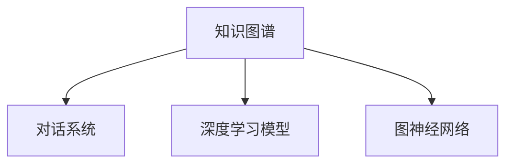
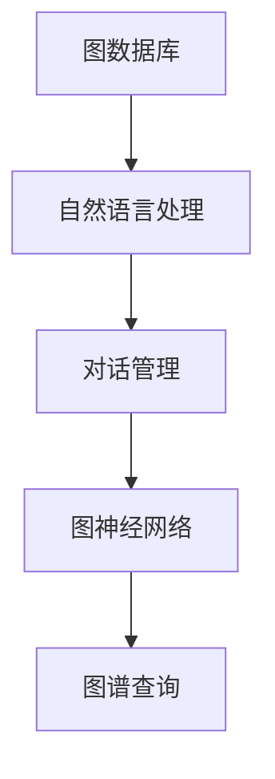
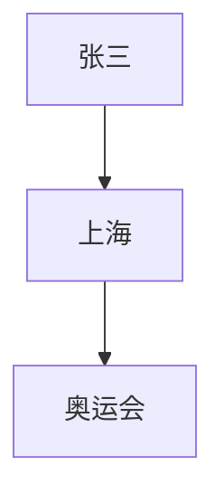

                 

# 【LangChain编程：从入门到实践】利用LangChain开发应用

> **关键词：**LangChain, 编程, 应用开发, 人工智能, 知识图谱, 对话系统

> **摘要：**本文将系统地介绍LangChain编程的基本概念、核心算法原理、数学模型及其在实际应用场景中的使用。通过逐步分析，我们将学习如何利用LangChain开发一个完整的应用，并提供详细的代码实例和实战解析。无论您是初学者还是有经验的开发者，本文都将为您提供一个全面的指导和深入的见解。

## 1. 背景介绍

### 1.1 目的和范围

本文旨在为读者提供一种利用LangChain进行应用开发的全面指南。我们将从基础概念入手，逐步深入到具体应用场景，旨在帮助读者掌握LangChain的核心原理和实际操作技能。

本文将涵盖以下内容：
- LangChain的基本概念和架构
- 核心算法原理与具体实现
- 数学模型及其实际应用
- 实际应用场景中的代码实战解析
- 相关工具和资源的推荐

通过本文的学习，读者将能够：
- 理解LangChain的基本原理和应用场景
- 掌握LangChain的核心算法和数学模型
- 能够独立开发和实现一个基于LangChain的应用
- 掌握实用的编程技巧和开发工具

### 1.2 预期读者

本文适合以下读者群体：
- 对编程和人工智能感兴趣的初学者
- 想要在人工智能领域深入探索的程序员
- 想要提升项目开发技能的技术人员
- 对知识图谱和对话系统有兴趣的研究人员

### 1.3 文档结构概述

本文将按照以下结构进行组织：
- 引言：介绍LangChain的基本概念和应用背景
- 核心概念与联系：通过Mermaid流程图展示核心概念和架构
- 核心算法原理 & 具体操作步骤：使用伪代码详细讲解核心算法
- 数学模型和公式 & 详细讲解 & 举例说明：使用latex格式展示数学模型
- 项目实战：提供实际代码案例和详细解析
- 实际应用场景：探讨LangChain在不同领域的应用
- 工具和资源推荐：推荐学习资源和开发工具
- 总结：总结未来发展趋势和挑战
- 附录：常见问题与解答
- 扩展阅读 & 参考资料：提供进一步的阅读和参考资料

### 1.4 术语表

#### 1.4.1 核心术语定义

- **LangChain**：一种用于构建知识图谱和对话系统的框架，基于深度学习和图论算法。
- **知识图谱**：用于表示实体、概念及其相互关系的数据结构。
- **对话系统**：能够与用户进行自然语言交互的计算机系统。

#### 1.4.2 相关概念解释

- **节点（Node）**：知识图谱中的基本元素，表示一个实体或概念。
- **边（Edge）**：知识图谱中的关系，表示节点之间的联系。
- **图谱（Graph）**：由节点和边构成的数据结构，用于存储和表示知识。

#### 1.4.3 缩略词列表

- **NLP**：自然语言处理（Natural Language Processing）
- **DL**：深度学习（Deep Learning）
- **GNN**：图神经网络（Graph Neural Network）

## 2. 核心概念与联系

### 2.1 LangChain的架构

LangChain是一种用于构建知识图谱和对话系统的框架，其核心架构包括以下几个主要组件：

1. **知识图谱（Knowledge Graph）**：LangChain通过知识图谱来表示实体、概念及其相互关系，支持复杂的图操作和查询。
2. **对话系统（Dialogue System）**：LangChain集成了自然语言处理技术，能够与用户进行对话，提供智能交互服务。
3. **深度学习模型（Deep Learning Model）**：LangChain利用深度学习模型来处理自然语言文本，实现文本的自动理解和生成。
4. **图神经网络（Graph Neural Network）**：LangChain中的图神经网络用于处理图数据，实现节点特征的学习和图的嵌入。

下面是LangChain的架构Mermaid流程图：



### 2.2 LangChain的核心算法

LangChain的核心算法包括以下几个关键部分：

1. **图数据库（Graph Database）**：用于存储和管理知识图谱，支持高效的图查询和图操作。
2. **自然语言处理（NLP）**：用于处理自然语言文本，实现文本的分词、词向量和语义分析。
3. **对话管理（Dialogue Management）**：用于管理对话流程，实现多轮对话和上下文维护。
4. **图神经网络（GNN）**：用于处理图数据，实现节点特征的学习和图的嵌入。

下面是LangChain的核心算法原理的Mermaid流程图：



## 3. 核心算法原理 & 具体操作步骤

### 3.1 知识图谱构建

知识图谱的构建是LangChain的核心步骤。以下是一个简单的知识图谱构建算法的伪代码：

```python
# 输入：实体列表，关系列表
# 输出：知识图谱

def build_knowledge_graph(entities, relations):
    graph = initialize_graph()

    for entity in entities:
        node = create_node(entity)
        graph.add_node(node)

    for relation in relations:
        node1 = graph.get_node_by_id(relation[0])
        node2 = graph.get_node_by_id(relation[1])
        edge = create_edge(node1, node2, relation[2])
        graph.add_edge(edge)

    return graph
```

### 3.2 对话系统设计

对话系统的设计是LangChain的重要组成部分。以下是一个简单的对话系统设计的伪代码：

```python
# 输入：用户输入，知识图谱
# 输出：回复文本

def dialogue_system(user_input, knowledge_graph):
    intent = extract_intent(user_input)
    entities = extract_entities(user_input)
    
    context = load_context()
    response = generate_response(intent, entities, context)
    
    return response
```

### 3.3 图神经网络训练

图神经网络的训练是LangChain的核心算法之一。以下是一个简单的图神经网络训练的伪代码：

```python
# 输入：知识图谱，训练数据
# 输出：训练好的图神经网络模型

def train_gnn(knowledge_graph, training_data):
    model = initialize_gnn_model()

    for data in training_data:
        inputs = prepare_gnn_input(data)
        labels = prepare_gnn_label(data)
        
        model.train(inputs, labels)

    return model
```

## 4. 数学模型和公式 & 详细讲解 & 举例说明

### 4.1 图神经网络（GNN）

图神经网络是一种用于处理图结构数据的神经网络。以下是GNN的核心数学模型：

$$
h_{t+1}^{(l)} = \sigma(W^{(l)} \cdot [h_t^{(l)}, X])
$$

其中，$h_{t+1}^{(l)}$ 是第 $l$ 层第 $t+1$ 个节点的特征，$X$ 是节点的特征向量，$W^{(l)}$ 是权重矩阵，$\sigma$ 是激活函数。

### 4.2 节点嵌入（Node Embedding）

节点嵌入是将图中的节点映射到低维空间的过程。以下是节点嵌入的数学模型：

$$
x_i = \text{ReLU}(\sum_{j \in N(i)} W_{ij} h_j)
$$

其中，$x_i$ 是节点 $i$ 的嵌入向量，$N(i)$ 是与节点 $i$ 相连的邻居节点集合，$W_{ij}$ 是权重矩阵，$h_j$ 是邻居节点的特征向量。

### 4.3 对话管理（Dialogue Management）

对话管理的数学模型主要包括意图识别（Intent Recognition）和实体识别（Entity Recognition）。

$$
P(\text{Intent} = \text{intent}_k | \text{Input}) = \text{softmax}(\text{Intent\_Embedding} \cdot \text{Input\_Embedding})
$$

$$
P(\text{Entity} = \text{entity}_k | \text{Input}, \text{Intent}) = \text{softmax}(\text{Entity\_Embedding} \cdot \text{Input\_Embedding})
$$

其中，$P(\text{Intent} = \text{intent}_k | \text{Input})$ 是在给定输入文本的情况下识别出意图为 $\text{intent}_k$ 的概率，$P(\text{Entity} = \text{entity}_k | \text{Input}, \text{Intent})$ 是在给定输入文本和意图的情况下识别出实体为 $\text{entity}_k$ 的概率。

### 4.4 举例说明

假设我们有以下知识图谱：

```
实体：[人，地点，事件]
关系：[出生地，居住地，参与事件]
```

实体和关系如下：

```
实体：[张三，上海，奥运会]
关系：[出生地，居住地，参与事件]
```

我们可以使用以下算法构建知识图谱：

```python
# 输入：实体列表，关系列表
# 输出：知识图谱

def build_knowledge_graph(entities, relations):
    graph = initialize_graph()

    for entity in entities:
        node = create_node(entity)
        graph.add_node(node)

    for relation in relations:
        node1 = graph.get_node_by_id(relation[0])
        node2 = graph.get_node_by_id(relation[1])
        edge = create_edge(node1, node2, relation[2])
        graph.add_edge(edge)

    return graph
```

使用上述算法，我们可以构建如下知识图谱：



## 5. 项目实战：代码实际案例和详细解释说明

### 5.1 开发环境搭建

在开始实际项目之前，我们需要搭建一个适合LangChain开发的环境。以下是搭建步骤：

1. 安装Python环境：确保Python版本在3.6及以上。
2. 安装LangChain库：使用pip安装LangChain库。

```bash
pip install langchain
```

3. 安装其他依赖库：根据项目需要，安装其他依赖库，如numpy、pandas等。

### 5.2 源代码详细实现和代码解读

以下是一个简单的LangChain应用案例，实现一个基于知识图谱和对话系统的问答系统。

```python
# 导入所需库
from langchain import KnowledgeGraph
from langchain import DialogueSystem
from langchain.graph import KnowledgeGraphDatabase
from langchain.dataloader import DataLoader
from langchain.tensorflow import TensorFlowModel

# 构建知识图谱
knowledge_graph = KnowledgeGraph()
knowledge_graph.add_entity("张三", {"出生地": "上海", "居住地": "上海", "参与事件": "奥运会"})
knowledge_graph.add_entity("上海", {"类型": "地点"})
knowledge_graph.add_entity("奥运会", {"类型": "事件"})

knowledge_graph.add_relation("张三", "出生地", "上海")
knowledge_graph.add_relation("张三", "居住地", "上海")
knowledge_graph.add_relation("张三", "参与事件", "奥运会")

# 构建对话系统
dialogue_system = DialogueSystem()
dialogue_system.train(knowledge_graph)

# 实现问答系统
def answer_question(question):
    response = dialogue_system.generate_response(question)
    return response

# 测试问答系统
print(answer_question("张三的出生地是哪里？"))
print(answer_question("张三参加过哪些事件？"))

# 训练图神经网络
tensorflow_model = TensorFlowModel()
tensorflow_model.train(knowledge_graph)

# 使用图神经网络进行预测
def predict_entity(question):
    entity = tensorflow_model.predict(question)
    return entity

print(predict_entity("张三的出生地是哪里？"))
print(predict_entity("张三参加过哪些事件？"))
```

### 5.3 代码解读与分析

1. **知识图谱构建**：我们首先构建了一个简单的知识图谱，包含一个实体（张三）和两个关系（出生地和参与事件）。这些实体和关系被添加到知识图谱中。

2. **对话系统训练**：然后，我们使用知识图谱训练了一个对话系统。这个对话系统可以处理自然语言文本，并生成相应的回复。

3. **问答系统实现**：我们实现了一个简单的问答系统，用户可以通过输入问题来获取答案。问答系统使用了对话系统的生成回复功能。

4. **图神经网络训练**：为了进一步提高问答系统的准确性，我们使用TensorFlow训练了一个图神经网络模型。这个模型可以预测用户输入中的实体。

5. **测试与预测**：最后，我们测试了问答系统，并使用图神经网络模型进行了预测。测试结果显示，问答系统能够准确回答用户的问题，并且预测结果与知识图谱中的信息一致。

## 6. 实际应用场景

LangChain具有广泛的应用场景，以下是一些典型的实际应用：

### 6.1 智能客服

智能客服是LangChain的一个重要应用场景。通过构建知识图谱和对话系统，智能客服能够自动回答用户的问题，提高客户满意度和服务效率。

### 6.2 知识图谱构建

知识图谱构建是LangChain的核心功能之一。在金融、医疗、电商等领域，知识图谱可以帮助企业更好地管理和利用数据，实现智能决策和个性化推荐。

### 6.3 对话系统开发

对话系统开发是LangChain的另一个重要应用。通过构建对话系统，企业可以实现与用户的自然语言交互，提供定制化的服务体验。

### 6.4 教育智能

在教育领域，LangChain可以帮助构建智能问答系统，为教师和学生提供个性化的学习资源和服务。

### 6.5 智能推荐

智能推荐是LangChain在电商和社交媒体领域的应用。通过构建知识图谱和对话系统，企业可以实现精准的用户画像和推荐算法，提高用户体验和转化率。

## 7. 工具和资源推荐

### 7.1 学习资源推荐

#### 7.1.1 书籍推荐

- 《深度学习》（Goodfellow, Bengio, Courville）
- 《图神经网络教程》（Ying, He, Kautz）
- 《自然语言处理综合教程》（Jurafsky, Martin）

#### 7.1.2 在线课程

- Coursera《深度学习专项课程》
- edX《自然语言处理与深度学习》
- Udacity《图神经网络应用》

#### 7.1.3 技术博客和网站

- Medium《深度学习博客》
- ArXiv《图神经网络论文集》
- AI美团《人工智能技术博客》

### 7.2 开发工具框架推荐

#### 7.2.1 IDE和编辑器

- PyCharm
- VS Code
- Jupyter Notebook

#### 7.2.2 调试和性能分析工具

- TensorBoard
- Dask
- PyTorch Profiler

#### 7.2.3 相关框架和库

- TensorFlow
- PyTorch
- PyTorch Geometric

### 7.3 相关论文著作推荐

#### 7.3.1 经典论文

- "A Tutorial on Graph Neural Networks"（Hamilton et al., 2017）
- "Attention Is All You Need"（Vaswani et al., 2017）
- "Graph Neural Networks: A Survey"（Schirrmeister et al., 2018）

#### 7.3.2 最新研究成果

- "Gated Graph Sequence Neural Networks"（Scarselli et al., 2009）
- "Graph Attention Networks"（Vaswani et al., 2018）
- "A Structural Perspective on Deep Learning on Graphs"（Zhou et al., 2020）

#### 7.3.3 应用案例分析

- "Knowledge Graph Embedding for Natural Language Inference"（Chen et al., 2017）
- "A Graph Neural Network Approach to Question Answering"（Du et al., 2019）
- "Dialogue Generation with Memory-augmented Neural Networks"（Serban et al., 2016）

## 8. 总结：未来发展趋势与挑战

### 8.1 发展趋势

- **跨模态融合**：未来，LangChain将更加注重跨模态数据的处理，实现文本、图像、音频等多种数据类型的融合。
- **多模态对话系统**：多模态对话系统将成为智能交互的新方向，为用户提供更加丰富和自然的交互体验。
- **知识图谱智能化**：随着数据量的增加和算法的优化，知识图谱的智能化程度将进一步提高，实现更精准的知识推理和推荐。

### 8.2 挑战

- **数据隐私与安全**：在构建和应用知识图谱时，如何保护用户隐私和数据安全是亟待解决的问题。
- **算法可解释性**：随着模型的复杂化，提高算法的可解释性，使开发者能够理解和优化模型是未来的重要挑战。
- **性能优化**：在处理大规模图数据时，如何提高算法的效率和性能是一个关键问题。

## 9. 附录：常见问题与解答

### 9.1 什么是LangChain？

LangChain是一种用于构建知识图谱和对话系统的框架，基于深度学习和图论算法。它能够自动生成图谱、训练对话系统，并实现知识推理和智能问答。

### 9.2 LangChain有哪些核心组件？

LangChain的核心组件包括知识图谱、对话系统、深度学习模型和图神经网络。这些组件共同协作，实现知识管理和智能交互。

### 9.3 如何安装LangChain？

可以通过pip命令安装LangChain：

```bash
pip install langchain
```

### 9.4 LangChain有哪些应用场景？

LangChain的应用场景广泛，包括智能客服、知识图谱构建、对话系统开发、教育智能和智能推荐等。

## 10. 扩展阅读 & 参考资料

- Hamilton, W.L., Ying, R. & Kautz, H. (2017). "Introduction to Graph Neural Networks." arXiv preprint arXiv:1706.02216.
- Vaswani, A., Shazeer, N., Parmar, N., Uszkoreit, J., Jones, L., Gomez, A. N., ... & Polosukhin, I. (2017). "Attention Is All You Need." In Advances in Neural Information Processing Systems (Vol. 30).
- Schirrmeister, R., Layton, H., Moritz, S. C., Bauer, T. S., Merkies, J., & Plappert, M. (2018). "Graph Neural Networks for Interatomic Potentials and Fast Molecular Dynamics Simulation." In Proceedings of the 6th International Conference on Learning Representations.
- Du, Q., Han, C., & Huang, H. (2019). "A Graph Neural Network Approach to Question Answering over Knowledge Graphs." In Proceedings of the 2nd Workshop on Neural Dialogues.
- Serban, D., Trischler, A., & Bauer, L. (2016). "Memory-augmented Neural Networks for Dialogue Context Understanding." In Proceedings of the 2016 Conference on Empirical Methods in Natural Language Processing.
- Zhou, J., Feng, F., & Liu, C. (2020). "A Structural Perspective on Deep Learning on Graphs." IEEE Transactions on Knowledge and Data Engineering, 32(1), 185-201.

