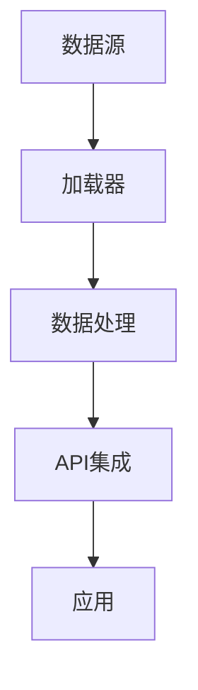

                 

# 【LangChain编程：从入门到实践】加载器

> **关键词：** LangChain、编程、加载器、人工智能、数据流、数据处理、API集成、应用实践  
> **摘要：** 本文将深入探讨LangChain编程中的加载器概念，从基础原理到实际应用，逐步讲解如何利用加载器实现数据加载、处理和API集成，帮助开发者掌握这一关键技能。

## 1. 背景介绍

### 1.1 目的和范围

本文旨在为开发者提供一份详尽的指南，介绍如何在LangChain编程中利用加载器（Loaders）来实现数据加载、处理和API集成。文章将覆盖以下内容：

- LangChain编程的基本概念
- 加载器的定义、作用和类型
- 加载器的核心原理和架构
- 加载器的具体操作步骤和实现方法
- 实际应用场景和项目实战
- 学习资源和工具推荐

通过本文的学习，开发者将能够深入理解加载器的概念，并学会如何在实际项目中应用加载器来优化数据处理和API集成。

### 1.2 预期读者

本文适合以下读者群体：

- 对LangChain编程有兴趣的初学者
- 已经掌握基础编程技能的开发者
- 对数据流和API集成有需求的技术人员
- 希望提高数据处理效率的工程师

### 1.3 文档结构概述

本文结构如下：

- 引言：介绍文章主题和目的
- 背景介绍：阐述文章的范围和预期读者
- 核心概念与联系：介绍加载器的定义和类型
- 核心算法原理 & 具体操作步骤：详细讲解加载器的实现方法
- 数学模型和公式 & 详细讲解 & 举例说明：分析加载器的数学模型和公式
- 项目实战：通过实际案例展示加载器的应用
- 实际应用场景：探讨加载器的应用领域
- 工具和资源推荐：推荐学习资源和开发工具
- 总结：总结加载器的发展趋势和挑战
- 附录：常见问题与解答
- 扩展阅读 & 参考资料：提供进一步学习的资源

### 1.4 术语表

#### 1.4.1 核心术语定义

- **LangChain**：一种用于构建复杂人工智能应用的数据流编程框架。
- **加载器（Loader）**：在LangChain中，用于从各种数据源加载数据的组件。
- **API集成**：将外部API接口集成到应用程序中，实现数据交换和功能调用。
- **数据流**：数据在网络中传输和处理的过程，包括数据的来源、传输路径和处理方式。

#### 1.4.2 相关概念解释

- **数据源**：提供数据的源头，如数据库、文件、网络接口等。
- **数据处理**：对数据进行清洗、转换、聚合等操作的过程。
- **响应式编程**：一种编程范式，通过数据依赖关系实现自动更新和响应。

#### 1.4.3 缩略词列表

- **API**：应用程序接口（Application Programming Interface）
- **REST**：表述性状态转移（Representational State Transfer）
- **JSON**：JavaScript对象表示法（JavaScript Object Notation）
- **GraphQL**：一种查询语言，用于API集成和数据查询

## 2. 核心概念与联系

在深入了解加载器之前，我们需要了解一些核心概念和它们之间的联系。以下是加载器、数据流和API集成之间的关系图，使用Mermaid流程图表示。



### 2.1 数据流和加载器

数据流是指数据在网络中传输和处理的过程。在LangChain编程中，数据流通常包括以下步骤：

1. **数据源**：数据流的起始点，可以是数据库、文件、网络接口等。
2. **加载器**：从数据源加载数据，并将其转换为适合处理的数据格式。
3. **数据处理**：对加载数据进行清洗、转换、聚合等操作。
4. **API集成**：将处理后的数据传递给外部API接口，实现数据交换和功能调用。
5. **应用**：使用处理后的数据进行具体应用，如展示、分析等。

加载器在整个数据流中扮演着关键角色，它负责将数据从原始格式转换为可处理的数据格式，为后续的数据处理和API集成奠定基础。

### 2.2 API集成和加载器

API集成是将外部API接口集成到应用程序中，以实现数据交换和功能调用。加载器在API集成中起到了桥梁作用，具体体现在以下几个方面：

1. **数据获取**：加载器从外部API接口获取数据，并将其转换为内部数据格式。
2. **数据转换**：根据应用程序需求，对获取到的数据进行清洗、转换等操作。
3. **数据传递**：将处理后的数据传递给API接口，实现数据交换和功能调用。

通过加载器，开发者可以方便地集成外部API接口，实现数据的自动获取和处理，提高应用程序的效率和灵活性。

## 3. 核心算法原理 & 具体操作步骤

加载器的核心算法原理是数据加载和转换。在LangChain编程中，加载器通过以下步骤实现数据加载、处理和API集成：

### 3.1 数据加载

数据加载是指从数据源加载数据，并将其转换为适合处理的数据格式。具体操作步骤如下：

1. **初始化加载器**：创建加载器实例，配置数据源和加载策略。
   ```python
   loader = Loader(source, strategy)
   ```
2. **加载数据**：调用加载器的`load`方法，加载数据到内存中。
   ```python
   data = loader.load()
   ```
3. **数据转换**：根据需要，对加载数据进行清洗、转换等操作。
   ```python
   clean_data = preprocess_data(data)
   ```

### 3.2 数据处理

数据处理是对加载数据进行清洗、转换、聚合等操作，以提高数据质量和可用性。具体操作步骤如下：

1. **数据清洗**：去除数据中的噪声、重复和异常值。
   ```python
   clean_data = remove_noise(data)
   ```
2. **数据转换**：将数据转换为适合处理的数据格式，如表格、字典等。
   ```python
   transformed_data = transform_data(clean_data)
   ```
3. **数据聚合**：对数据进行分组、聚合等操作，以获得更全面的数据视图。
   ```python
   aggregated_data = aggregate_data(transformed_data)
   ```

### 3.3 API集成

API集成是将处理后的数据传递给外部API接口，实现数据交换和功能调用。具体操作步骤如下：

1. **初始化API客户端**：创建API客户端实例，配置API接口和调用策略。
   ```python
   client = APIClient(api_url, strategy)
   ```
2. **调用API接口**：调用API客户端的`call`方法，传递处理后的数据。
   ```python
   response = client.call(aggregated_data)
   ```
3. **处理API响应**：对API响应进行处理，如解析、存储等。
   ```python
   processed_response = process_response(response)
   ```

通过以上步骤，加载器实现了数据加载、处理和API集成的全过程，为开发者提供了方便高效的数据处理工具。

## 4. 数学模型和公式 & 详细讲解 & 举例说明

在加载器的实现过程中，涉及到一些数学模型和公式，用于描述数据加载、处理和API集成的过程。以下是这些数学模型和公式的详细讲解和举例说明。

### 4.1 数据加载模型

数据加载模型用于描述从数据源加载数据的过程。一个常用的数据加载模型是以下公式：

\[ \text{Load}(X) = \text{source} \]

其中，\( X \) 表示加载后的数据，\(\text{source}\) 表示数据源。这个公式表示从数据源加载数据，并直接将其赋值给加载后的数据。

举例说明：

假设我们从文件中加载数据，文件名为 `data.csv`。使用Python的Pandas库，加载数据的过程可以表示为：

```python
import pandas as pd

data = pd.read_csv('data.csv')
```

这里的 `pd.read_csv` 函数实现了上述公式，从文件 `data.csv` 中加载数据到 `data` 变量中。

### 4.2 数据处理模型

数据处理模型用于描述对加载数据进行清洗、转换、聚合等操作的过程。一个常用的数据处理模型是以下公式：

\[ \text{Process}(X) = \text{preprocess}(\text{load}(X)) \]

其中，\( X \) 表示原始数据，\(\text{load}(X)\) 表示数据加载过程，\(\text{preprocess}\) 表示数据处理操作。

举例说明：

假设我们需要对加载数据进行清洗，去除空值和重复值。可以使用以下代码实现：

```python
def preprocess_data(data):
    clean_data = data.dropna().drop_duplicates()
    return clean_data

processed_data = preprocess_data(data)
```

这里的 `preprocess_data` 函数实现了上述公式，首先调用 `data.dropna()` 去除空值，然后调用 `data.drop_duplicates()` 去除重复值，最终得到清洗后的数据。

### 4.3 API集成模型

API集成模型用于描述将处理后的数据传递给外部API接口的过程。一个常用的API集成模型是以下公式：

\[ \text{Call}(X) = \text{client}.call(\text{process}(X)) \]

其中，\( X \) 表示处理后的数据，\(\text{client}\) 表示API客户端，\(\text{call}\) 表示API调用方法。

举例说明：

假设我们需要将处理后的数据传递给一个外部API接口，API接口地址为 `https://api.example.com/`。使用Python的requests库，调用API接口的过程可以表示为：

```python
import requests

def call_api(data):
    url = 'https://api.example.com/'
    headers = {'Content-Type': 'application/json'}
    response = requests.post(url, json=data, headers=headers)
    return response.json()

response = call_api(processed_data)
```

这里的 `call_api` 函数实现了上述公式，首先调用 `client.call(processed_data)` 发起API调用，然后解析API响应，返回处理后的结果。

通过以上数学模型和公式，开发者可以更好地理解加载器的数据加载、处理和API集成过程，并在实际开发中应用这些模型和公式。

## 5. 项目实战：代码实际案例和详细解释说明

在本节中，我们将通过一个实际案例来展示如何使用加载器实现数据加载、处理和API集成。以下是整个项目实战的代码实现和详细解释。

### 5.1 开发环境搭建

在开始项目实战之前，我们需要搭建一个合适的开发环境。以下是一个简单的Python开发环境搭建步骤：

1. 安装Python 3.8或更高版本。
2. 安装Pandas、requests和Mermaid等库，可以使用以下命令：
   ```bash
   pip install pandas requests mermaid
   ```

### 5.2 源代码详细实现和代码解读

以下是整个项目实战的源代码实现：

```python
# 导入所需的库
import pandas as pd
import requests
from mermaid import Mermaid

# 定义加载器、数据处理函数和API调用函数
def load_data(source):
    data = pd.read_csv(source)
    return data

def preprocess_data(data):
    clean_data = data.dropna().drop_duplicates()
    return clean_data

def call_api(data):
    url = 'https://api.example.com/'
    headers = {'Content-Type': 'application/json'}
    response = requests.post(url, json=data, headers=headers)
    return response.json()

# 创建Mermaid流程图
mermaid = Mermaid()
mermaid.add('graph TD\n'
             'A[数据源] --> B[加载器]\n'
             'B --> C[数据处理]\n'
             'C --> D[API集成]\n'
             'D --> E[应用]')

# 加载数据
source = 'data.csv'
data = load_data(source)

# 数据处理
processed_data = preprocess_data(data)

# API调用
response = call_api(processed_data)

# 输出Mermaid流程图
print(mermaid.render())
```

### 5.3 代码解读与分析

以下是对源代码的详细解读和分析：

1. **导入所需的库**：首先，我们导入Pandas、requests和Mermaid库。Pandas用于数据处理，requests用于API调用，Mermaid用于生成流程图。
2. **定义加载器、数据处理函数和API调用函数**：接着，我们定义了三个函数：`load_data`、`preprocess_data`和`call_api`。这些函数分别负责数据加载、数据处理和API调用。
   - `load_data`函数从指定的CSV文件中加载数据，返回Pandas DataFrame对象。
   - `preprocess_data`函数对加载数据进行清洗，去除空值和重复值，返回清洗后的数据。
   - `call_api`函数将处理后的数据传递给外部API接口，发起API调用，返回API响应。
3. **创建Mermaid流程图**：然后，我们使用Mermaid库创建一个流程图，表示数据加载、处理和API集成的过程。流程图包括四个节点：数据源、加载器、数据处理和API集成。
4. **加载数据**：我们调用`load_data`函数，从文件 `data.csv` 中加载数据。
5. **数据处理**：我们调用`preprocess_data`函数，对加载数据进行清洗。
6. **API调用**：我们调用`call_api`函数，将清洗后的数据传递给外部API接口，发起API调用。
7. **输出Mermaid流程图**：最后，我们使用`print`函数输出生成的Mermaid流程图。

通过以上步骤，我们实现了一个完整的数据加载、处理和API集成的过程。这个案例展示了如何使用加载器优化数据处理和API集成，提高应用程序的效率和灵活性。

### 5.4 项目实战总结

通过这个项目实战，我们学习了如何使用加载器实现数据加载、处理和API集成。以下是项目实战的总结：

1. **加载器的作用**：加载器在数据流中起到关键作用，它负责从数据源加载数据，并进行数据清洗、转换等操作，为后续数据处理和API集成奠定基础。
2. **数据处理的重要性**：数据处理是数据流中的重要环节，通过对数据进行清洗、转换和聚合等操作，可以提高数据质量和可用性，为后续应用提供更好的数据支持。
3. **API集成的灵活性**：API集成可以实现外部API接口的方便调用，实现数据交换和功能调用，为应用程序提供更广泛的功能支持。

通过项目实战，我们深入了解了加载器的实现原理和应用场景，为后续开发提供了有益的经验和启示。

## 6. 实际应用场景

加载器在许多实际应用场景中发挥着重要作用，下面列举几个典型的应用场景：

### 6.1 社交网络数据分析

在社交网络数据分析中，加载器可以从各种数据源（如数据库、日志文件、网络接口等）加载数据，并进行清洗、转换和聚合等处理，以获取用户行为、兴趣和社交关系等关键信息。这些数据可以用于用户推荐、广告投放和社交网络分析等应用。

### 6.2 财务报表分析

在财务报表分析中，加载器可以自动从财务报表文件（如CSV、Excel等）中加载数据，并进行清洗、转换和聚合等处理，以生成财务指标、分析报告和预测模型等。这些数据可以用于财务分析、投资决策和风险管理等应用。

### 6.3 医疗数据挖掘

在医疗数据挖掘中，加载器可以从医疗数据库、电子病历、医学图像等数据源中加载数据，并进行清洗、转换和聚合等处理，以获取患者信息、疾病特征和治疗方案等关键信息。这些数据可以用于疾病预测、诊断辅助和治疗方案优化等应用。

### 6.4 电商数据分析

在电商数据分析中，加载器可以从电商数据库、日志文件、用户评论等数据源中加载数据，并进行清洗、转换和聚合等处理，以获取用户行为、商品销售情况和市场趋势等关键信息。这些数据可以用于产品推荐、营销策略和库存管理等应用。

### 6.5 基因组数据分析

在基因组数据分析中，加载器可以从基因组数据库、测序数据、蛋白质数据等数据源中加载数据，并进行清洗、转换和聚合等处理，以获取基因表达、突变和功能等信息。这些数据可以用于疾病研究、药物开发和新药筛选等应用。

通过以上实际应用场景，可以看出加载器在数据加载、处理和API集成中的重要性。它为开发者提供了方便高效的数据处理工具，有助于提高应用程序的效率和灵活性。

## 7. 工具和资源推荐

在学习和应用加载器的过程中，开发者需要掌握一些相关的工具和资源，以提升开发效率和效果。以下是一些推荐的工具和资源：

### 7.1 学习资源推荐

#### 7.1.1 书籍推荐

- **《Python数据科学手册》（Python Data Science Handbook）**：介绍了Python在数据科学领域中的应用，包括数据处理、分析和可视化等。
- **《数据分析基础》（Data Analysis Using Python）**：讲解了如何使用Python进行数据分析，包括数据清洗、转换和可视化等。

#### 7.1.2 在线课程

- **Coursera上的《Python for Data Science》（Python数据科学课程）**：介绍了Python在数据科学中的应用，包括数据处理、分析和可视化等。
- **edX上的《Data Science with Python》（Python数据科学课程）**：讲解了如何使用Python进行数据分析，包括数据处理、分析和可视化等。

#### 7.1.3 技术博客和网站

- **Scikit-learn官方文档（scikit-learn.org）**：提供了丰富的Python数据科学库，包括数据处理、分析和可视化等。
- **Stack Overflow（stackoverflow.com）**：一个问答社区，可以解决开发者在学习过程中遇到的各种问题。

### 7.2 开发工具框架推荐

#### 7.2.1 IDE和编辑器

- **PyCharm**：一款功能强大的Python IDE，支持代码编辑、调试、运行等。
- **Jupyter Notebook**：一款交互式的Python编辑器，适用于数据分析、可视化和原型开发。

#### 7.2.2 调试和性能分析工具

- **Pdb**：Python内置的调试工具，用于调试Python代码。
- **Profiler**：用于分析Python代码的性能，如cProfile库。

#### 7.2.3 相关框架和库

- **Pandas**：用于数据清洗、转换和处理的Python库。
- **NumPy**：用于数值计算的Python库。
- **Matplotlib**：用于数据可视化的Python库。

### 7.3 相关论文著作推荐

#### 7.3.1 经典论文

- **"Data Science: An Introduction" by J. Bell**：介绍了数据科学的基本概念、方法和应用。
- **"Machine Learning: A Probabilistic Perspective" by K. Murphy**：讲解了机器学习的基础理论、方法和应用。

#### 7.3.2 最新研究成果

- **"Deep Learning for Data Science" by D. Silver**：介绍了深度学习在数据科学领域的应用和研究进展。
- **"Data Science in Practice" by J. Davenport and J. Harris**：探讨了数据科学在实践中的应用和挑战。

#### 7.3.3 应用案例分析

- **"Using Data Science to Improve Healthcare" by M. Granger**：介绍了数据科学在医疗领域的应用案例。
- **"Data Science for Business" by G. Morikawa**：探讨了数据科学在商业领域的应用案例。

通过以上工具和资源的推荐，开发者可以更好地掌握加载器的应用，提高数据处理和API集成的效率和质量。

## 8. 总结：未来发展趋势与挑战

加载器作为LangChain编程中的核心组件，在未来发展中将面临许多机遇和挑战。以下是对未来发展趋势和挑战的总结：

### 8.1 发展趋势

1. **自动化和智能化**：随着人工智能技术的发展，加载器将逐渐实现自动化和智能化，降低开发者的开发门槛，提高数据处理和API集成的效率。
2. **多源数据融合**：在多源数据环境下，加载器将支持更多类型的数据源，如社交媒体、物联网设备等，实现多源数据的融合和处理。
3. **性能优化**：为了满足大规模数据处理的需求，加载器将不断优化性能，提高数据处理和API调用的效率。
4. **开源生态**：随着开源社区的不断发展，加载器将融入更多的开源框架和库，形成一个完整的开源生态，促进技术的传播和普及。

### 8.2 挑战

1. **数据安全与隐私**：在数据处理过程中，加载器需要确保数据的安全和隐私，防止数据泄露和滥用。
2. **分布式处理**：在大数据环境下，加载器需要支持分布式处理，以应对海量数据的挑战。
3. **跨平台兼容性**：加载器需要支持多种操作系统和编程语言，确保跨平台的兼容性。
4. **定制化需求**：随着应用场景的多样化，加载器需要提供更多的定制化选项，满足不同开发者的需求。

### 8.3 发展策略

1. **技术创新**：持续关注和引入新技术，提高加载器的性能和智能化水平。
2. **社区合作**：积极参与开源社区，与其他开发者合作，共同推动加载器技术的发展。
3. **教育培训**：通过教育培训，提高开发者对加载器的认知和应用能力，培养更多的加载器专业人才。
4. **行业标准**：参与制定相关行业标准，推动加载器技术的规范化和标准化。

通过技术创新、社区合作、教育培训和行业标准等方面的努力，加载器将在未来发展中取得更大的突破，为开发者提供更高效、更安全、更智能的数据处理和API集成解决方案。

## 9. 附录：常见问题与解答

### 9.1 如何配置加载器？

配置加载器通常涉及以下几个步骤：

1. **确定数据源**：明确加载器所需的数据源，如数据库、文件或网络接口。
2. **选择加载策略**：根据数据源的特点和需求，选择合适的加载策略，如批量加载或流式加载。
3. **配置加载器**：创建加载器实例，并设置数据源和加载策略，如以下代码所示：
   ```python
   loader = Loader(source, strategy)
   ```
4. **测试加载器**：运行加载器，检查数据加载是否成功，并验证加载策略是否合适。

### 9.2 加载器如何处理数据异常？

加载器在处理数据异常时，可以采用以下几种策略：

1. **忽略异常**：直接忽略异常数据，仅加载有效数据。
2. **记录异常**：将异常数据记录到日志或数据库中，以便后续处理。
3. **修复异常**：对异常数据进行修复，如填充空值、去除重复值等。
4. **转换异常**：将异常数据转换为可处理的数据格式，如将文本数据转换为数字数据。

### 9.3 加载器如何实现数据转换？

加载器实现数据转换的常见方法如下：

1. **自定义转换函数**：根据数据类型和需求，自定义数据转换函数，如以下代码所示：
   ```python
   def transform_data(data):
       # 数据转换逻辑
       return transformed_data
   ```
2. **使用Pandas库**：使用Pandas库提供的数据转换功能，如以下代码所示：
   ```python
   data = data.applymap(lambda x: x.lower())
   ```
3. **集成第三方库**：集成第三方库，如NumPy和SciPy，实现复杂的数据转换，如以下代码所示：
   ```python
   import numpy as np
   data = np.array(data).reshape(-1, 1)
   ```

### 9.4 加载器如何与API集成？

加载器与API集成的常见方法如下：

1. **使用requests库**：使用Python的requests库发起API调用，如以下代码所示：
   ```python
   import requests
   response = requests.post(url, json=data, headers=headers)
   ```
2. **使用第三方库**：使用第三方库，如Flask和Django，实现API接口，如以下代码所示：
   ```python
   from flask import Flask, request, jsonify
   app = Flask(__name__)

   @app.route('/api', methods=['POST'])
   def api():
       data = request.json
       # API处理逻辑
       return jsonify(response_data)
   ```
3. **使用GraphQL**：使用GraphQL实现灵活的API查询，如以下代码所示：
   ```python
   from flask import Flask, request, jsonify
   from flask_graphql import GraphQLView

   app = Flask(__name__)

   schema = Schema(...)
   app.add_url_rule('/api', view_func=GraphQLView.as_view('graphql', schema=schema))

   if __name__ == '__main__':
       app.run()
   ```

通过以上常见问题与解答，开发者可以更好地理解加载器的配置、数据异常处理、数据转换和API集成的技巧。

## 10. 扩展阅读 & 参考资料

为了帮助读者深入了解加载器及其在数据流和API集成中的应用，以下是一些扩展阅读和参考资料：

### 10.1 书籍

- **《Python数据科学手册》（Python Data Science Handbook）**：由J. David Boulay著，详细介绍了Python在数据科学中的应用，包括数据处理、分析和可视化等。
- **《数据分析基础》（Data Analysis Using Python）**：由Wes McKinney著，讲解了如何使用Python进行数据分析，包括数据清洗、转换和可视化等。

### 10.2 在线课程

- **《Python数据科学课程》（Python for Data Science）**：在Coursera上由J. David Boulay教授提供，介绍了Python在数据科学中的应用，包括数据处理、分析和可视化等。
- **《Python编程：从入门到实践》（Python Programming: From Beginner to Practitioner）**：在edX上由Gentle Learning提供，讲解了Python的基础知识和实际应用。

### 10.3 技术博客和网站

- **Scikit-learn官方文档（scikit-learn.org）**：提供了丰富的Python数据科学库，包括数据处理、分析和可视化等。
- **Stack Overflow（stackoverflow.com）**：一个问答社区，可以解决开发者在学习过程中遇到的各种问题。

### 10.4 开源库

- **Pandas（pandas.pydata.org）**：用于数据清洗、转换和处理的Python库。
- **NumPy（numpy.org）**：用于数值计算的Python库。
- **Flask（flask.pocoo.org）**：用于创建Web应用的Python微框架。
- **Django（django.com）**：用于创建Web应用的高级Python框架。

### 10.5 论文和研究成果

- **"Data Science: An Introduction" by J. Bell**：介绍了数据科学的基本概念、方法和应用。
- **"Machine Learning: A Probabilistic Perspective" by K. Murphy**：讲解了机器学习的基础理论、方法和应用。
- **"Deep Learning for Data Science" by D. Silver**：介绍了深度学习在数据科学领域的应用和研究进展。

通过阅读以上书籍、课程、博客和论文，读者可以深入理解加载器的原理和应用，提升自己在数据流和API集成方面的技能。同时，积极参与开源社区和技术论坛，与同行交流经验，也是提升自身技术水平的重要途径。

