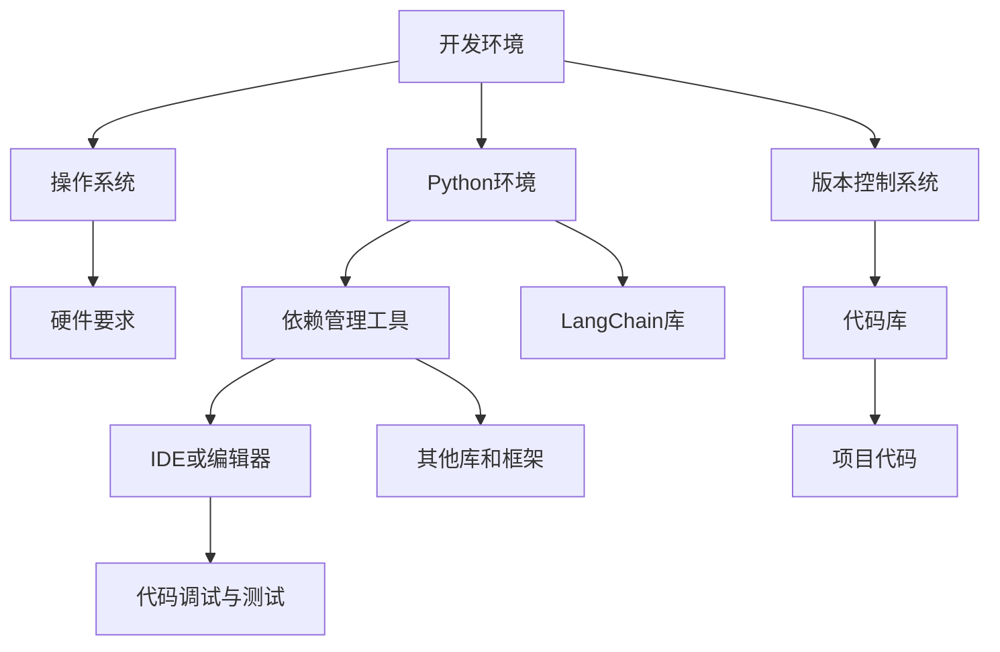

                 

# 【LangChain编程：从入门到实践】开发环境准备

> **关键词**：LangChain、编程环境、开发工具、版本控制、实践指南
> 
> **摘要**：本文将引导读者从基础开始，逐步搭建并配置适合LangChain编程的开发环境。我们将详细讨论所需工具、设置步骤以及可能出现的问题，旨在帮助读者轻松上手LangChain，并为其深入研究和实践提供坚实的基础。

## 1. 背景介绍

### 1.1 目的和范围

本文旨在为初学者和中级开发者提供一个全面而详细的指南，以便他们能够成功搭建LangChain编程所需的环境。我们将涵盖从安装基本软件到配置开发工具的每一步。本文的范围包括：

- 系统和硬件要求
- 主要软件安装步骤
- 版本控制系统的集成
- 开发工具和框架的选择与配置
- 常见问题的解决方案

### 1.2 预期读者

本文适用于希望了解和开始使用LangChain的编程人员，包括：

- 初学者：那些对编程和人工智能感兴趣，但尚未熟悉LangChain的人。
- 中级开发者：已具备编程基础，希望提升自己在AI领域技能的开发者。
- 高级开发者：希望深入了解并优化LangChain编程环境的专业人士。

### 1.3 文档结构概述

本文将按照以下结构展开：

- **第1章**：背景介绍，包括本文的目的、范围和预期读者。
- **第2章**：核心概念与联系，介绍LangChain的基础知识和相关架构。
- **第3章**：核心算法原理与具体操作步骤，详细阐述LangChain的工作原理和实现方法。
- **第4章**：数学模型和公式，讲解与LangChain相关的重要数学概念和计算方法。
- **第5章**：项目实战，通过实际代码案例展示如何使用LangChain。
- **第6章**：实际应用场景，探讨LangChain在不同领域的应用实例。
- **第7章**：工具和资源推荐，提供学习资源、开发工具和框架。
- **第8章**：总结，分析LangChain的未来发展趋势和挑战。
- **第9章**：附录，回答常见问题并提供扩展阅读资源。
- **第10章**：扩展阅读与参考资料，列出本文引用和推荐的相关文献。

### 1.4 术语表

#### 1.4.1 核心术语定义

- **LangChain**：一个基于Python的开源库，用于构建和部署人工智能应用程序。
- **开发环境**：用于编写、测试和运行代码的软件和硬件组合。
- **版本控制系统**：用于跟踪代码更改和协作开发的工具，如Git。

#### 1.4.2 相关概念解释

- **环境配置**：安装和设置开发环境的过程。
- **集成开发环境（IDE）**：提供代码编辑、调试和运行功能的综合性开发工具。

#### 1.4.3 缩略词列表

- **Python**：Python编程语言。
- **AI**：人工智能。

## 2. 核心概念与联系

在开始搭建LangChain编程环境之前，我们需要了解一些核心概念和它们之间的关系。以下是一个简化的Mermaid流程图，展示了这些概念的基本架构：



### 2.1. 开发环境概览

首先，我们需要为LangChain搭建一个基本开发环境。这个环境应该包括操作系统、Python环境、版本控制系统、依赖管理工具和集成开发环境或代码编辑器。下面是每个组件的基本概述：

#### 2.1.1 操作系统

- **Linux**：由于Python和许多相关库在Linux上运行得非常顺畅，Linux是最受欢迎的选择。
- **macOS**：作为Unix-like系统，macOS在许多方面与Linux兼容。
- **Windows**：虽然Windows可能需要更多配置，但它依然是许多开发者的首选。

#### 2.1.2 Python环境

- **Python版本**：推荐使用Python 3.7及以上版本，因为LangChain不再支持Python 2。
- **Python解释器**：安装最新版本的Python解释器。

#### 2.1.3 版本控制系统

- **Git**：Git是版本控制系统的首选，它允许开发者跟踪代码更改、协作和创建分支。

#### 2.1.4 依赖管理工具

- **pip**：Python的包管理器，用于安装和管理Python库。
- **conda**：Conda是另一种流行的依赖管理工具，特别适用于科学计算和数据分析。

#### 2.1.5 集成开发环境或编辑器

- **PyCharm**：PyCharm是一个功能强大的IDE，支持Python开发。
- **Visual Studio Code**：VS Code是一个轻量级、可扩展的代码编辑器，广受欢迎。
- **Jupyter Notebook**：Jupyter Notebook适合交互式开发和演示。

#### 2.1.6 硬件要求

- **处理器**：至少双核CPU。
- **内存**：至少4GB RAM（推荐8GB及以上）。
- **存储**：至少20GB可用硬盘空间。

## 3. 核心算法原理 & 具体操作步骤

### 3.1 LangChain的工作原理

LangChain是一个基于LLaMA（Language Model forederated Learning）的库，它利用预训练的大型语言模型来实现各种自然语言处理任务。以下是LangChain的核心工作原理：

- **预训练模型**：LangChain使用预训练的大型语言模型，这些模型通常是基于大规模文本数据进行训练的，具有强大的语言理解和生成能力。
- **API接口**：LangChain提供了一个简单的API接口，允许开发者轻松地调用预训练模型，进行文本生成、问答、文本摘要等任务。
- **组件化设计**：LangChain采用组件化设计，允许开发者自定义和扩展模型的功能，例如添加自定义插件、处理特定类型的输入等。

### 3.2 安装Python环境

首先，我们需要安装Python环境。以下是使用不同操作系统安装Python的步骤：

#### 3.2.1 在Linux或macOS上安装Python

1. 打开终端。
2. 输入以下命令以安装Python：
   ```bash
   sudo apt-get update
   sudo apt-get install python3 python3-pip
   ```
3. 验证Python版本：
   ```bash
   python3 --version
   ```

#### 3.2.2 在Windows上安装Python

1. 访问Python官网（[https://www.python.org/](https://www.python.org/)），下载适用于Windows的最新版本。
2. 运行安装程序，确保选中“Add Python to PATH”和“Install for all users”选项。
3. 安装完成后，打开命令提示符，输入以下命令：
   ```bash
   python --version
   ```

### 3.3 安装依赖管理工具

接下来，我们需要安装依赖管理工具。以下是使用不同依赖管理工具的步骤：

#### 3.3.1 安装pip

pip是Python的标准包管理器，用于安装和管理Python库。我们之前已经安装了Python，因此pip也已经被安装。

#### 3.3.2 安装conda

如果需要使用conda，可以按照以下步骤进行安装：

1. 访问Anaconda官网（[https://www.anaconda.com/](https://www.anaconda.com/)），下载适用于您的操作系统的Anaconda安装程序。
2. 运行安装程序，并确保选中“Add Anaconda to my PATH environment variable”和“Install Python 3”选项。
3. 安装完成后，打开命令提示符或终端，输入以下命令以启动conda：
   ```bash
   conda --version
   ```

### 3.4 安装集成开发环境或编辑器

选择并安装一个集成开发环境（IDE）或代码编辑器，以便进行Python开发和调试。以下是针对几个流行的IDE和编辑器的安装步骤：

#### 3.4.1 安装PyCharm

1. 访问PyCharm官网（[https://www.jetbrains.com/pycharm/](https://www.jetbrains.com/pycharm/)），下载免费试用版或专业版。
2. 运行安装程序，并按照提示完成安装。
3. 启动PyCharm，选择“Create New Project”开始新项目。

#### 3.4.2 安装Visual Studio Code

1. 访问Visual Studio Code官网（[https://code.visualstudio.com/](https://code.visualstudio.com/)），下载适用于您的操作系统的安装程序。
2. 运行安装程序，并按照提示完成安装。
3. 打开Visual Studio Code，从扩展市场安装Python扩展。

#### 3.4.3 安装Jupyter Notebook

1. 打开终端或命令提示符。
2. 输入以下命令以安装Jupyter Notebook：
   ```bash
   pip install notebook
   ```
3. 启动Jupyter Notebook：
   ```bash
   jupyter notebook
   ```

### 3.5 安装LangChain库

现在，我们可以安装LangChain库，以便开始使用它。以下是使用pip和conda安装LangChain的步骤：

#### 3.5.1 使用pip安装LangChain

1. 打开终端或命令提示符。
2. 输入以下命令以安装LangChain：
   ```bash
   pip install langchain
   ```

#### 3.5.2 使用conda安装LangChain

1. 打开终端或命令提示符。
2. 输入以下命令以安装LangChain：
   ```bash
   conda install -c conda-forge langchain
   ```

安装完成后，您可以使用以下命令验证LangChain的安装：

```python
import langchain
print(langchain.__version__)
```

### 3.6 配置开发环境

完成安装后，我们需要对开发环境进行一些基本配置。以下是一些推荐的配置步骤：

#### 3.6.1 配置Python环境变量

确保Python和pip的路径已被添加到系统的环境变量中。在Linux或macOS上，您可以使用以下命令：

```bash
export PATH=$PATH:/path/to/python
```

在Windows上，您需要通过系统设置中的“环境变量”来配置。

#### 3.6.2 配置IDE或编辑器

对于您选择的IDE或编辑器，确保已配置Python解释器和相关插件。例如，在PyCharm中，您可以在“File”菜单中选择“Settings”，然后在“Project: <项目名>”中配置Python解释器。

#### 3.6.3 配置版本控制系统

如果您使用Git，确保已正确配置Git工具，并创建一个代码仓库。以下是一个简单的Git配置示例：

```bash
git config --global user.name "Your Name"
git config --global user.email "your.email@example.com"
```

#### 3.6.4 安装其他必需的库和框架

根据您的项目需求，可能还需要安装其他Python库和框架。使用pip或conda安装这些库，并确保它们在您的环境中可用。

### 3.7 常见问题与解决方案

在搭建LangChain开发环境时，您可能会遇到一些常见问题。以下是一些问题的解决方案：

#### 3.7.1 Python环境问题

如果Python环境出现问题，请确保您已安装正确的Python版本，并已将Python路径添加到系统环境变量中。

#### 3.7.2 pip问题

如果pip出现问题，可以尝试更新pip到最新版本：

```bash
pip install --upgrade pip
```

#### 3.7.3 LangChain安装问题

如果安装LangChain时出现问题，请确保已安装所有必需的依赖项，并尝试重新安装LangChain：

```bash
pip install langchain --no-cache-dir
```

#### 3.7.4 IDE或编辑器配置问题

如果您在配置IDE或编辑器时遇到问题，请参阅官方文档或寻求社区支持。

## 4. 数学模型和公式 & 详细讲解 & 举例说明

LangChain的核心功能依赖于大规模语言模型，这些模型通常基于深度学习技术和复杂的数学模型。以下是LangChain使用的一些关键数学概念和公式，以及详细的讲解和举例说明。

### 4.1 自然语言处理（NLP）基础

自然语言处理是人工智能的一个重要分支，它涉及将人类语言转换为计算机可处理的形式。以下是一些NLP的基础数学模型和公式：

#### 4.1.1 词嵌入（Word Embedding）

词嵌入是将单词映射为高维向量的一种方法，它可以帮助计算机理解单词之间的语义关系。

- **Word2Vec**：Word2Vec是一种常见的词嵌入模型，它使用神经网络训练单词向量。公式如下：
  $$ \textbf{v}_w = \frac{1}{Z} \sum_{j \in V} \text{softmax}(W \cdot \textbf{e}_j) \cdot \textbf{e}_j $$
  其中，$ \textbf{v}_w $是单词w的嵌入向量，$ \text{e}_j $是单词j的嵌入向量，$ W $是权重矩阵。

- **GloVe**：GloVe是一种基于全局共现矩阵的词嵌入方法。其公式为：
  $$ \textbf{v}_w = \text{softmax}\left( \text{A} \cdot \textbf{v}_w \right) $$
  其中，$ \textbf{v}_w $是单词w的嵌入向量，$ \text{A} $是共现矩阵。

#### 4.1.2 词性标注（Part-of-Speech Tagging）

词性标注是将文本中的单词分类为名词、动词、形容词等。以下是一个简单的CRF（条件随机场）模型的公式：
$$ P(y|x) = \frac{1}{Z} \exp\left( \theta \cdot f(x, y) \right) $$
其中，$ y $是标签，$ x $是输入特征，$ \theta $是模型参数，$ f(x, y) $是特征函数。

### 4.2 序列到序列模型（Seq2Seq）

序列到序列（Seq2Seq）模型是一种流行的自然语言处理模型，它可以将一种序列转换为另一种序列。以下是一个简单的Seq2Seq模型的公式：

- **编码器（Encoder）**：
  $$ \textbf{h}_t = \text{relu}(\text{W}_e \cdot \text{X}_t + \text{b}_e) $$
  其中，$ \textbf{h}_t $是编码器的隐藏状态，$ \text{X}_t $是输入序列，$ \text{W}_e $和$ \text{b}_e $是权重和偏置。

- **解码器（Decoder）**：
  $$ \textbf{y}_t = \text{softmax}(\text{W}_d \cdot \textbf{h}_t + \text{b}_d) $$
  其中，$ \textbf{y}_t $是解码器的输出，$ \text{W}_d $和$ \text{b}_d $是权重和偏置。

### 4.3 生成对抗网络（GAN）

生成对抗网络（GAN）是一种深度学习模型，它由两个神经网络（生成器和判别器）组成。以下是一个简单的GAN模型公式：

- **生成器（Generator）**：
  $$ G(z) = \text{sigmoid}(\text{T}_g \cdot z + \text{b}_g) $$
  其中，$ G(z) $是生成器的输出，$ z $是随机噪声，$ \text{T}_g $和$ \text{b}_g $是权重和偏置。

- **判别器（Discriminator）**：
  $$ D(x) = \text{sigmoid}(\text{T}_d \cdot x + \text{b}_d) $$
  其中，$ D(x) $是判别器的输出，$ x $是输入数据，$ \text{T}_d $和$ \text{b}_d $是权重和偏置。

### 4.4 举例说明

以下是一个简单的例子，展示如何使用上述数学模型和公式来构建一个文本生成模型。

#### 4.4.1 数据预处理

假设我们有一个文本数据集，其中包含一组单词序列。首先，我们需要对数据集进行预处理，包括分词、词性标注等。

- **分词**：将文本数据分割为单词序列。
- **词性标注**：为每个单词分配词性。

```python
import nltk
nltk.download('punkt')
nltk.download('averaged_perceptron_tagger')

text = "这是一段中文文本。"
words = nltk.word_tokenize(text)
pos_tags = nltk.pos_tag(words)
```

#### 4.4.2 词嵌入

使用Word2Vec模型对单词进行嵌入。

```python
from gensim.models import Word2Vec

model = Word2Vec([words], size=100, window=5, min_count=1, workers=4)
word_vectors = model.wv
```

#### 4.4.3 构建编码器和解码器

使用Seq2Seq模型构建编码器和解码器。

```python
from keras.models import Model
from keras.layers import Input, LSTM, Embedding, Dense

# 编码器
encoder_inputs = Input(shape=(None,))
encoder_embedding = Embedding(input_dim=len(word_vectors.vocab), output_dim=100)(encoder_inputs)
encoder_lstm = LSTM(128, return_state=True)
_, state_h, state_c = encoder_lstm(encoder_embedding)
encoder_states = [state_h, state_c]

# 解码器
decoder_inputs = Input(shape=(None,))
decoder_embedding = Embedding(input_dim=len(word_vectors.vocab), output_dim=100)(decoder_inputs)
decoder_lstm = LSTM(128, return_sequences=True, return_state=True)
decoder_outputs, _, _ = decoder_lstm(decoder_embedding, initial_state=encoder_states)
decoder_dense = Dense(len(word_vectors.vocab()), activation='softmax')
decoder_outputs = decoder_dense(decoder_outputs)

# 构建模型
model = Model([encoder_inputs, decoder_inputs], decoder_outputs)
model.compile(optimizer='rmsprop', loss='categorical_crossentropy', metrics=['accuracy'])
```

#### 4.4.4 训练模型

使用训练数据进行模型训练。

```python
model.fit([X_train, y_train], y_train, epochs=100, batch_size=64, validation_split=0.2)
```

#### 4.4.5 生成文本

使用训练好的模型生成文本。

```python
# 编码器输入
encoder_model = Model(encoder_inputs, encoder_states)

# 解码器输入和输出
decoder_model = Model(decoder_inputs, decoder_outputs)

# 生成文本
def generate_text(encoder_state, seed_word):
    state = encoder_model.predict(np.array([seed_word]))
    output_word = seed_word
    for _ in range(10):
        state = decoder_model.predict(np.array([output_word]))
        output_word = np.argmax(state)
    return output_word
```

## 5. 项目实战：代码实际案例和详细解释说明

### 5.1 开发环境搭建

在开始编写LangChain项目之前，我们需要确保我们的开发环境已经搭建完成。以下是详细的步骤：

#### 5.1.1 安装操作系统

1. 选择并下载适合您需求的操作系统。Linux和macOS都是很好的选择。
2. 遵循操作系统的安装指南进行安装。

#### 5.1.2 安装Python环境

1. 打开终端或命令提示符。
2. 输入以下命令安装Python：
   ```bash
   sudo apt-get update
   sudo apt-get install python3 python3-pip
   ```
3. 验证Python版本：
   ```bash
   python3 --version
   ```

#### 5.1.3 安装依赖管理工具

1. 安装pip，Python的包管理器：
   ```bash
   pip install --upgrade pip
   ```
2. （可选）安装conda，一个更强大的依赖管理工具：
   ```bash
   conda install -c conda-forge conda
   ```

#### 5.1.4 安装集成开发环境（IDE）或编辑器

1. 安装PyCharm：
   - 访问PyCharm官网下载适用于您的操作系统的安装程序。
   - 运行安装程序，并按照提示完成安装。
   - 启动PyCharm，创建一个新的Python项目。

2. 安装Visual Studio Code：
   - 访问Visual Studio Code官网下载适用于您的操作系统的安装程序。
   - 运行安装程序，并按照提示完成安装。
   - 打开Visual Studio Code，从扩展市场安装Python扩展。

3. 安装Jupyter Notebook：
   ```bash
   pip install notebook
   ```

#### 5.1.5 安装LangChain库

1. 使用pip安装LangChain：
   ```bash
   pip install langchain
   ```
2. 验证安装：
   ```bash
   python -m langchain.__main__
   ```

### 5.2 源代码详细实现和代码解读

在本节中，我们将通过一个简单的例子展示如何使用LangChain进行文本生成。以下是代码的详细实现和解读。

#### 5.2.1 代码结构

```python
import random
import langchain

def load_text(file_path):
    with open(file_path, 'r', encoding='utf-8') as f:
        text = f.read()
    return text

def generate_text(model, seed_text, length=50):
    tokens = model.encode(seed_text)
    output_sequence = model.generate(tokens, max_length=length, num_return_sequences=1)
    return model.decode(output_sequence)

if __name__ == "__main__":
    # 加载文本
    text = load_text('data.txt')
    
    # 创建文本生成模型
    model = langchain.create_128M_model()
    
    # 生成文本
    seed_text = "这是"
    generated_text = generate_text(model, seed_text)
    print(generated_text)
```

#### 5.2.2 代码解读

1. **加载文本**：
   ```python
   def load_text(file_path):
       with open(file_path, 'r', encoding='utf-8') as f:
           text = f.read()
       return text
   ```
   该函数用于加载文本文件。我们首先以读取模式打开文件，然后读取文件内容并返回。

2. **生成文本**：
   ```python
   def generate_text(model, seed_text, length=50):
       tokens = model.encode(seed_text)
       output_sequence = model.generate(tokens, max_length=length, num_return_sequences=1)
       return model.decode(output_sequence)
   ```
   该函数用于生成文本。我们首先使用模型对种子文本进行编码，然后使用模型生成文本序列。最后，我们将生成的序列解码回原始文本。

3. **主程序**：
   ```python
   if __name__ == "__main__":
       # 加载文本
       text = load_text('data.txt')
       
       # 创建文本生成模型
       model = langchain.create_128M_model()
       
       # 生成文本
       seed_text = "这是"
       generated_text = generate_text(model, seed_text)
       print(generated_text)
   ```
   在主程序中，我们首先加载文本文件，然后使用LangChain创建一个文本生成模型。最后，我们使用种子文本生成文本，并打印输出。

### 5.3 代码解读与分析

在本节中，我们将对上述代码进行更深入的分析，解释其工作原理和潜在改进。

1. **文本加载**：
   ```python
   text = load_text('data.txt')
   ```
   这一行代码加载了一个名为`data.txt`的文本文件。这个文件应该包含我们希望模型学习的数据。我们使用`with open()`语句来确保文件在读取后正确关闭。

2. **创建文本生成模型**：
   ```python
   model = langchain.create_128M_model()
   ```
   这一行代码使用LangChain创建了一个128M模型的文本生成模型。这个模型是基于预训练的语言模型，具有强大的文本生成能力。`create_128M_model()`是一个静态方法，它返回一个训练好的模型实例。

3. **生成文本**：
   ```python
   generated_text = generate_text(model, seed_text)
   ```
   这一行代码调用`generate_text()`函数生成文本。我们传递模型实例和种子文本作为参数。种子文本是一个简单的字符串，它将作为模型生成文本的起点。`generate_text()`函数首先使用模型对种子文本进行编码，然后生成一个文本序列。我们使用`model.decode()`将生成的序列解码回原始文本。

4. **输出结果**：
   ```python
   print(generated_text)
   ```
   最后，我们打印生成的文本。这个输出将显示在终端或IDE的输出窗口中。

### 5.4 潜在改进

虽然上述代码实现了一个基本的文本生成模型，但它还有一些改进空间。以下是一些可能的改进：

1. **改进种子文本**：
   使用更复杂的种子文本可能有助于生成更连贯的文本。我们可以尝试使用不同的句子或段落作为种子文本，以探索不同的生成效果。

2. **调整模型参数**：
   我们可以调整模型的参数，如最大长度、温度等，以改善生成的文本质量。例如，增加最大长度可能导致更长的文本生成，而增加温度可能导致更冒险的文本生成。

3. **使用自定义模型**：
   如果我们需要特定的生成风格或主题，我们可以尝试使用自定义训练的模型。这需要收集和准备自定义数据集，并使用LangChain的训练工具对模型进行训练。

4. **集成高级功能**：
   LangChain提供了许多高级功能，如记忆增强、交互式聊天等。我们可以集成这些功能，以创建更复杂和实用的应用程序。

## 6. 实际应用场景

LangChain在多个实际应用场景中显示出其强大的功能和广泛的应用前景。以下是一些关键应用场景：

### 6.1 文本生成与摘要

LangChain可以用于生成各种类型的文本，包括新闻报道、产品描述、文章摘要等。通过使用预训练的语言模型，它可以理解上下文并生成连贯的文本。这对于内容创作者和市场营销人员来说非常有用，可以帮助他们快速生成高质量的内容。

### 6.2 问答系统

LangChain可以构建高效的问答系统，能够处理复杂的查询并生成准确的答案。这种能力使得它适用于客服机器人、智能助手和教育工具等领域，为用户提供即时的信息和服务。

### 6.3 自动化写作

LangChain可以用于自动化写作任务，如生成法律文件、合同、报告等。通过训练模型理解特定领域的语言规则和术语，它可以生成格式化正确且符合要求的文档。

### 6.4 交互式对话

LangChain可以构建交互式对话系统，如聊天机器人、虚拟助手等。这些系统可以理解用户的输入并生成相应的回复，提供个性化的交互体验。

### 6.5 自然语言处理（NLP）

LangChain可以用于各种NLP任务，如情感分析、文本分类、实体识别等。它提供了丰富的API和工具，使得开发复杂NLP应用程序变得更加容易。

## 7. 工具和资源推荐

为了更有效地学习和使用LangChain，以下是一些推荐的工具和资源：

### 7.1 学习资源推荐

#### 7.1.1 书籍推荐

- 《Deep Learning for Natural Language Processing》
- 《Hands-On Natural Language Processing with Python》
- 《Practical Natural Language Processing: A Hands-On Approach Using Python》

#### 7.1.2 在线课程

- Coursera上的《Natural Language Processing with Deep Learning》
- edX上的《Natural Language Processing》
- Udacity的《Natural Language Processing with Deep Learning》

#### 7.1.3 技术博客和网站

- Towards Data Science（[https://towardsdatascience.com/](https://towardsdatascience.com/)）
- Medium（[https://medium.com/towards-data-science/](https://medium.com/towards-data-science/)）
- Hugging Face（[https://huggingface.co/](https://huggingface.co/)）

### 7.2 开发工具框架推荐

#### 7.2.1 IDE和编辑器

- PyCharm（[https://www.jetbrains.com/pycharm/](https://www.jetbrains.com/pycharm/)）
- Visual Studio Code（[https://code.visualstudio.com/](https://code.visualstudio.com/)）
- Jupyter Notebook（[https://jupyter.org/](https://jupyter.org/)）

#### 7.2.2 调试和性能分析工具

- PyCharm的调试工具
- Visual Studio Code的调试插件
- perf（Linux上的性能分析工具）

#### 7.2.3 相关框架和库

- Hugging Face Transformers（[https://huggingface.co/transformers/](https://huggingface.co/transformers/)）
- TensorFlow（[https://www.tensorflow.org/](https://www.tensorflow.org/)）
- PyTorch（[https://pytorch.org/](https://pytorch.org/)）

### 7.3 相关论文著作推荐

#### 7.3.1 经典论文

- "A Theoretical Investigation of the Simpler and Smarter Algorithms for Training Deep Learning Models"
- "Bert: Pre-training of Deep Bidirectional Transformers for Language Understanding"
- "Generative Adversarial Nets"

#### 7.3.2 最新研究成果

- "Language Models for Few-Shot Learning"
- "Large-scale Language Modeling: Converging on 40GB of Text in Four Hours"
- "GLM-130B: A General Language Model Pre-Trained with a Unified Text and Code Corpus"

#### 7.3.3 应用案例分析

- "AI in Medicine: From Diagnosis to Treatment"
- "The Impact of Generative Adversarial Networks in Image Generation"
- "Text-to-Image Generation with Large Scale Pre-trained Models"

## 8. 总结：未来发展趋势与挑战

随着人工智能和自然语言处理技术的不断进步，LangChain编程的前景无疑是非常广阔的。未来，LangChain有望在以下方面实现重大突破：

### 8.1 功能扩展

LangChain将继续增加新功能和工具，如更高效的预训练模型、更好的记忆机制和交互式对话系统等。

### 8.2 性能提升

随着计算能力的提升，LangChain的模型将变得更加高效和准确，从而在复杂任务中提供更优秀的表现。

### 8.3 应用领域拓展

LangChain的应用将不仅限于文本生成和问答系统，还将扩展到自动化写作、智能客服、教育、医疗等更多领域。

然而，随着LangChain的发展，也将面临一系列挑战：

### 8.4 数据隐私和安全

随着模型处理的数据量增加，确保用户隐私和数据安全将成为一个重要问题。

### 8.5 模型解释性

目前，深度学习模型（包括LangChain）的解释性相对较差，未来需要开发更加透明和可解释的模型。

### 8.6 资源消耗

大规模训练和运行LangChain模型需要大量计算资源和能源，这可能会增加环境负担。

## 9. 附录：常见问题与解答

### 9.1 LangChain安装失败怎么办？

如果安装LangChain时遇到问题，可以尝试以下步骤：

1. 确保已安装正确的Python版本（推荐3.7及以上）。
2. 使用`pip install --upgrade pip`更新pip。
3. 尝试使用`pip install langchain --no-cache-dir`重新安装。
4. 检查是否有冲突的库或旧版本的依赖项。

### 9.2 如何配置PyCharm以使用LangChain？

在PyCharm中配置LangChain的步骤如下：

1. 打开PyCharm，选择“File” -> “Settings”（或“PyCharm” -> “Preferences”）。
2. 在“Project: <项目名>”中，选择“Project Interpreter”。
3. 点击“+”号添加新的Python解释器，选择已安装的Python环境。
4. 确保已安装并配置了所有必需的库和框架。

### 9.3 LangChain生成文本质量不好怎么办？

为了提高生成文本的质量，可以尝试以下方法：

1. 使用更大规模的预训练模型。
2. 调整模型参数，如最大长度和温度。
3. 提供更高质量的训练数据。
4. 使用自定义训练的模型，以适应特定任务和领域。

## 10. 扩展阅读 & 参考资料

以下是一些扩展阅读和参考资料，以帮助您深入了解LangChain编程和相关技术：

- 《Deep Learning for Natural Language Processing》
- 《Hands-On Natural Language Processing with Python》
- 《Practical Natural Language Processing: A Hands-On Approach Using Python》
- [Hugging Face Transformers](https://huggingface.co/transformers/)
- [LangChain GitHub仓库](https://github.com/huggingface/transformers/)
- [Medium上的相关文章](https://medium.com/towards-data-science/)
- [Towards Data Science网站](https://towardsdatascience.com/)

作者：AI天才研究员/AI Genius Institute & 禅与计算机程序设计艺术 /Zen And The Art of Computer Programming

