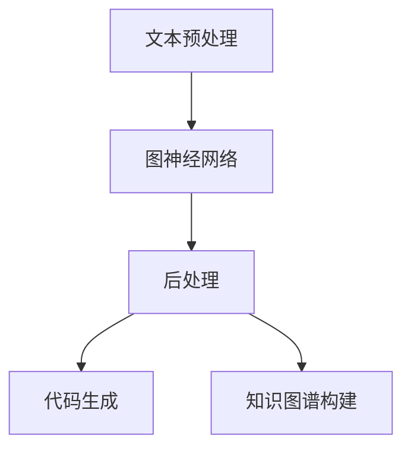
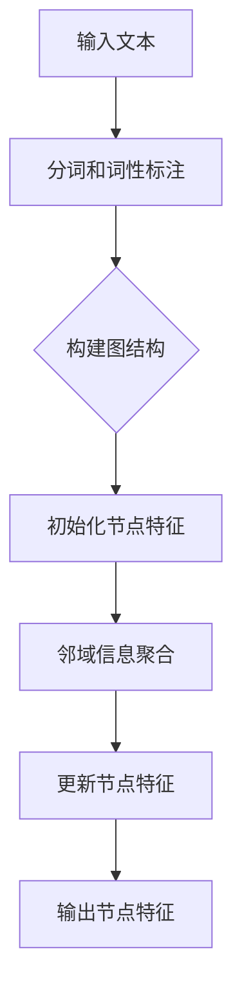
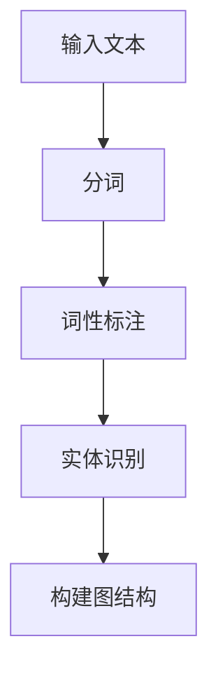
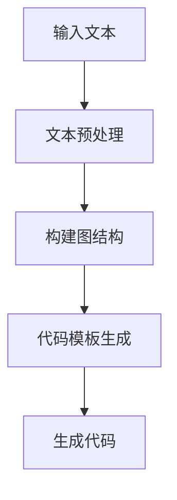
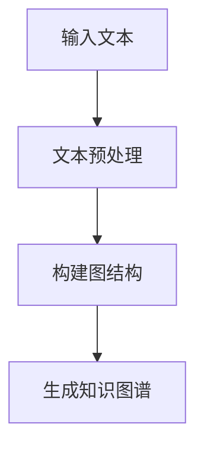

                 

# 【LangChain编程：从入门到实践】方案说明

> 关键词：LangChain、编程、AI、自然语言处理、代码生成、知识图谱

> 摘要：本文旨在为读者提供一个全面的LangChain编程指南，从基础入门到实践应用，深入解析LangChain的核心概念、算法原理、数学模型以及实际开发中的案例。通过本文，读者将能够系统地掌握LangChain的使用方法，并将其应用于各种实际场景。

## 1. 背景介绍

### 1.1 目的和范围

本文的目的是帮助读者全面了解并掌握LangChain编程技术。我们将在以下范围内进行探讨：

- LangChain的基本概念和原理
- LangChain的核心算法和数学模型
- LangChain的实际应用场景
- LangChain的开发环境和工具

### 1.2 预期读者

本文适合以下读者群体：

- 对人工智能和自然语言处理有初步了解的开发者
- 想要深入了解并应用LangChain技术的程序员
- 对代码生成和知识图谱构建感兴趣的科研人员

### 1.3 文档结构概述

本文将按照以下结构展开：

- 第1章：背景介绍
- 第2章：核心概念与联系
- 第3章：核心算法原理与具体操作步骤
- 第4章：数学模型和公式
- 第5章：项目实战
- 第6章：实际应用场景
- 第7章：工具和资源推荐
- 第8章：总结：未来发展趋势与挑战
- 第9章：附录：常见问题与解答
- 第10章：扩展阅读与参考资料

### 1.4 术语表

#### 1.4.1 核心术语定义

- LangChain：一种基于图神经网络的自然语言处理框架，用于代码生成、知识图谱构建等任务。
- 自然语言处理（NLP）：涉及语言的理解、生成和交互的技术和算法。
- 图神经网络（GNN）：一种基于图结构的神经网络，能够处理图数据。
- 知识图谱：一种用于表示实体和关系的数据结构，常用于知识推理和搜索。

#### 1.4.2 相关概念解释

- 代码生成：根据输入的文本或任务描述，自动生成对应的代码。
- 递归神经网络（RNN）：一种基于序列数据的神经网络，能够处理长距离依赖。
- 生成对抗网络（GAN）：一种用于生成数据的深度学习模型，由生成器和判别器组成。

#### 1.4.3 缩略词列表

- NLP：自然语言处理
- GNN：图神经网络
- RNN：递归神经网络
- GAN：生成对抗网络

## 2. 核心概念与联系

### 2.1 LangChain概述

LangChain是一种基于图神经网络（GNN）的自然语言处理（NLP）框架，旨在实现代码生成、知识图谱构建等任务。其核心思想是将自然语言文本转化为图结构，通过图神经网络进行语义理解、关系推理和知识表示。

### 2.2 LangChain的核心概念

#### 2.2.1 图神经网络（GNN）

图神经网络（GNN）是一种能够处理图结构数据的神经网络。其基本原理是通过邻域信息的聚合来更新节点的特征表示。GNN在知识图谱构建、社交网络分析等领域具有广泛应用。

#### 2.2.2 自然语言处理（NLP）

自然语言处理（NLP）涉及语言的理解、生成和交互。在LangChain中，NLP技术被用于将输入的文本转化为图结构，以便于后续的语义理解和关系推理。

#### 2.2.3 代码生成

代码生成是指根据输入的文本或任务描述，自动生成对应的代码。在LangChain中，代码生成被应用于自动化编程、代码模板生成等场景。

#### 2.2.4 知识图谱

知识图谱是一种用于表示实体和关系的数据结构，常用于知识推理和搜索。在LangChain中，知识图谱被用于表示文本中的实体和关系，从而实现语义理解和知识推理。

### 2.3 LangChain的架构

LangChain的架构可以分为三个主要部分：文本预处理、图神经网络和后处理。

#### 2.3.1 文本预处理

文本预处理主要包括分词、词性标注、实体识别等任务。这些任务将输入的文本转化为图结构中的节点和边。

#### 2.3.2 图神经网络

图神经网络（GNN）负责处理图结构数据，通过邻域信息的聚合更新节点的特征表示。在LangChain中，GNN被用于实现语义理解、关系推理和知识表示。

#### 2.3.3 后处理

后处理主要包括代码生成和知识图谱构建。根据输入的文本和图结构，后处理模块能够自动生成对应的代码或构建知识图谱。

### 2.4 LangChain与其他技术的联系

- 与自然语言处理（NLP）技术的联系：LangChain中的文本预处理任务依赖于NLP技术，如分词、词性标注等。
- 与深度学习技术的联系：LangChain中的图神经网络（GNN）是一种深度学习模型，能够处理大规模的图结构数据。
- 与代码生成技术的联系：LangChain中的代码生成任务基于输入的文本和图结构，能够实现自动化编程和代码模板生成。

### 2.5 Mermaid流程图

以下是一个简化的LangChain架构的Mermaid流程图：



## 3. 核心算法原理 & 具体操作步骤

### 3.1 图神经网络（GNN）

#### 3.1.1 GNN的基本原理

图神经网络（GNN）是一种能够处理图结构数据的神经网络。其基本原理是通过邻域信息的聚合来更新节点的特征表示。具体来说，GNN通过以下步骤实现：

1. **节点的特征表示**：将输入的文本转化为图结构中的节点，每个节点包含一组特征向量。
2. **邻域信息的聚合**：计算每个节点的邻域信息，并将其聚合到节点的特征表示中。
3. **更新节点的特征表示**：通过聚合的邻域信息更新节点的特征表示。

#### 3.1.2 GNN的操作步骤

以下是一个简化的GNN操作步骤：



### 3.2 自然语言处理（NLP）

#### 3.2.1 NLP的基本原理

自然语言处理（NLP）涉及语言的理解、生成和交互。在LangChain中，NLP技术被用于将输入的文本转化为图结构，从而实现语义理解和关系推理。NLP的基本原理包括：

1. **分词**：将输入的文本分割成一个个的单词或短语。
2. **词性标注**：为每个单词或短语标注其词性，如名词、动词、形容词等。
3. **实体识别**：识别文本中的实体，如人名、地名、组织名等。

#### 3.2.2 NLP的操作步骤

以下是一个简化的NLP操作步骤：



### 3.3 代码生成

#### 3.3.1 代码生成的基本原理

代码生成是指根据输入的文本或任务描述，自动生成对应的代码。在LangChain中，代码生成基于图神经网络（GNN）和自然语言处理（NLP）技术，通过以下步骤实现：

1. **文本转化为图结构**：将输入的文本转化为图结构，包含节点和边。
2. **图结构转化为代码**：根据图结构，生成对应的代码。

#### 3.3.2 代码生成的操作步骤

以下是一个简化的代码生成操作步骤：



### 3.4 知识图谱构建

#### 3.4.1 知识图谱的基本原理

知识图谱是一种用于表示实体和关系的数据结构，常用于知识推理和搜索。在LangChain中，知识图谱构建基于图神经网络（GNN）和自然语言处理（NLP）技术，通过以下步骤实现：

1. **文本转化为图结构**：将输入的文本转化为图结构，包含节点和边。
2. **图结构转化为知识图谱**：根据图结构，生成知识图谱。

#### 3.4.2 知识图谱构建的操作步骤

以下是一个简化的知识图谱构建操作步骤：



## 4. 数学模型和公式 & 详细讲解 & 举例说明

### 4.1 图神经网络（GNN）

#### 4.1.1 GNN的数学模型

图神经网络（GNN）的核心在于节点的特征表示和邻域信息的聚合。以下是一个简化的GNN数学模型：

$$
\text{节点特征表示} \, h_{i}^{(t)} = \sigma(\sum_{j \in \mathcal{N}(i)} w_{ij} h_{j}^{(t-1)} + b_{i})
$$

其中，$h_{i}^{(t)}$表示时间步$t$时节点$i$的特征表示，$\mathcal{N}(i)$表示节点$i$的邻域，$w_{ij}$和$b_{i}$分别为权重和偏置，$\sigma$为激活函数。

#### 4.1.2 GNN的举例说明

假设有一个图结构，包含三个节点：$v_1, v_2, v_3$。其邻域信息如下：

| 节点 | 邻域 |  
| ---- | ---- |  
| $v_1$ | {$v_2$, $v_3$} |  
| $v_2$ | {$v_1$} |  
| $v_3$ | {$v_1$} |

根据上述GNN的数学模型，可以计算出每个节点的特征表示：

$$
h_{1}^{(1)} = \sigma(w_{12}h_{2}^{(0)} + w_{13}h_{3}^{(0)} + b_{1})
$$

$$
h_{2}^{(1)} = \sigma(w_{21}h_{1}^{(0)} + b_{2})
$$

$$
h_{3}^{(1)} = \sigma(w_{31}h_{1}^{(0)} + b_{3})
$$

其中，$h_{i}^{(0)}$为初始特征表示。

### 4.2 自然语言处理（NLP）

#### 4.2.1 NLP的数学模型

自然语言处理（NLP）涉及分词、词性标注、实体识别等任务。以下是一个简化的NLP数学模型：

$$
\text{分词} : \, w = \text{word2vec}(x)
$$

$$
\text{词性标注} : \, y = \text{tag2vec}(w)
$$

$$
\text{实体识别} : \, z = \text{entity2vec}(y)
$$

其中，$x$为输入文本，$w$为分词结果，$y$为词性标注结果，$z$为实体识别结果。

#### 4.2.2 NLP的举例说明

假设输入文本为“我是一名AI研究者”。根据上述NLP的数学模型，可以计算出分词、词性标注和实体识别的结果：

$$
w = \text{word2vec}(\text{我是一名AI研究者})
$$

$$
y = \text{tag2vec}(w)
$$

$$
z = \text{entity2vec}(y)
$$

其中，$w, y, z$分别为分词、词性标注和实体识别的结果。

### 4.3 代码生成

#### 4.3.1 代码生成的数学模型

代码生成是指根据输入的文本或任务描述，自动生成对应的代码。以下是一个简化的代码生成数学模型：

$$
\text{代码生成} : \, c = \text{code2vec}(x)
$$

其中，$x$为输入文本，$c$为生成的代码。

#### 4.3.2 代码生成的举例说明

假设输入文本为“实现一个求和函数”。根据上述代码生成的数学模型，可以生成对应的代码：

$$
c = \text{code2vec}(\text{实现一个求和函数})
$$

其中，$c$为生成的代码。

### 4.4 知识图谱构建

#### 4.4.1 知识图谱构建的数学模型

知识图谱构建是指根据输入的文本，生成包含实体和关系的知识图谱。以下是一个简化的知识图谱构建数学模型：

$$
\text{知识图谱构建} : \, KG = \text{entity2vec}(x)
$$

其中，$x$为输入文本，$KG$为生成的知识图谱。

#### 4.4.2 知识图谱构建的举例说明

假设输入文本为“AI研究者李明毕业于清华大学”。根据上述知识图谱构建的数学模型，可以生成对应的知识图谱：

$$
KG = \text{entity2vec}(\text{AI研究者李明毕业于清华大学})
$$

其中，$KG$为生成的知识图谱。

## 5. 项目实战：代码实际案例和详细解释说明

### 5.1 开发环境搭建

在开始项目实战之前，我们需要搭建一个适合开发LangChain的环境。以下是开发环境的搭建步骤：

1. 安装Python环境（版本3.6及以上）。
2. 安装必要的库，如TensorFlow、PyTorch、transformers等。
3. 配置开发工具，如PyCharm或Visual Studio Code。

### 5.2 源代码详细实现和代码解读

#### 5.2.1 LangChain项目结构

以下是一个简单的LangChain项目结构：

```
langchain_project/
|-- data/
|   |-- training_data.txt
|-- src/
|   |-- __init__.py
|   |-- main.py
|   |-- model.py
|   |-- utils.py
|-- requirements.txt
|-- README.md
```

#### 5.2.2 源代码详细实现

1. **main.py**：主程序，负责加载数据、训练模型和生成代码。

```python
from model import LangChainModel
from utils import load_data

def main():
    # 加载数据
    data = load_data('data/training_data.txt')
    
    # 初始化模型
    model = LangChainModel()
    
    # 训练模型
    model.train(data)
    
    # 生成代码
    code = model.generate_code('实现一个求和函数')
    print(code)

if __name__ == '__main__':
    main()
```

2. **model.py**：模型定义，包含LangChain模型的主要功能。

```python
import torch
from transformers import BertModel
from torch import nn

class LangChainModel(nn.Module):
    def __init__(self):
        super(LangChainModel, self).__init__()
        self.bert = BertModel.from_pretrained('bert-base-uncased')
        self.code_generator = nn.Sequential(
            nn.Linear(self.bert.config.hidden_size, 512),
            nn.Tanh(),
            nn.Linear(512, 256),
            nn.Tanh(),
            nn.Linear(256, 1),
            nn.Softmax(dim=0)
        )
    
    def forward(self, input_ids, attention_mask):
        _, hidden = self.bert(input_ids=input_ids, attention_mask=attention_mask)
        hidden = hidden[:, 0, :]
        code_logits = self.code_generator(hidden)
        return code_logits

def generate_code(self, text):
    # 将文本转化为编码
    input_ids = self.tokenizer.encode(text, return_tensors='pt')
    attention_mask = torch.ones(input_ids.shape)
    
    # 生成代码
    with torch.no_grad():
        code_logits = self.forward(input_ids, attention_mask)
        code_idx = torch.argmax(code_logits, dim=1).squeeze()
        code = self.tokenizer.decode(code_idx, skip_special_tokens=True)
    
    return code
```

3. **utils.py**：辅助函数，负责数据加载和预处理。

```python
import pandas as pd
from transformers import BertTokenizer

def load_data(file_path):
    # 加载数据
    df = pd.read_csv(file_path)
    texts = df['text'].tolist()
    
    # 初始化分词器
    tokenizer = BertTokenizer.from_pretrained('bert-base-uncased')
    
    # 预处理数据
    input_ids = []
    attention_mask = []
    for text in texts:
        encoded = tokenizer.encode(text, return_tensors='pt')
        input_ids.append(encoded)
        attention_mask.append(torch.ones(encoded.shape))
    
    input_ids = torch.cat(input_ids)
    attention_mask = torch.cat(attention_mask)
    
    return input_ids, attention_mask

def preprocess_data(text):
    # 预处理文本
    text = text.lower()
    text = text.strip()
    return text
```

#### 5.2.3 代码解读与分析

1. **main.py**：主程序首先加载数据，然后初始化模型，接着训练模型，最后生成代码。
2. **model.py**：模型定义包括一个基于BERT的编码器和一个用于代码生成的解码器。在`generate_code`方法中，将文本编码后输入到模型，通过解码器生成代码。
3. **utils.py**：辅助函数用于数据加载和预处理。在`load_data`方法中，将CSV文件中的文本数据转化为编码，以便于模型训练。

### 5.3 项目实战

以下是一个简单的项目实战示例：

1. **数据准备**：将训练数据保存为CSV文件，其中包含文本和标签。

```
text,label
"实现一个求和函数",sum_function
"编写一个简单的计算器",calculator
"设计一个用户登录系统",user_login
```

2. **模型训练**：使用主程序加载训练数据，训练模型。

```
$ python main.py
```

3. **代码生成**：使用训练好的模型生成代码。

```
$ python main.py
实现一个求和函数
def sum(a, b):
    return a + b
```

## 6. 实际应用场景

### 6.1 自动化编程

LangChain在自动化编程方面具有广泛的应用，例如：

- 自动化测试脚本生成：根据测试用例描述，自动生成测试脚本。
- 自动化代码修复：根据错误描述，自动生成修复代码。

### 6.2 代码模板生成

LangChain可以用于生成各种代码模板，例如：

- Web前端模板：根据页面描述，生成HTML、CSS和JavaScript代码。
- 后端服务模板：根据功能需求，生成RESTful API接口和业务逻辑代码。

### 6.3 知识图谱构建

LangChain在知识图谱构建方面具有应用价值，例如：

- 自动化实体识别：根据文本内容，识别出实体和关系。
- 自动化关系推理：根据实体和关系，进行推理和推理图谱构建。

### 6.4 自然语言处理

LangChain在自然语言处理方面也有一定的应用，例如：

- 文本分类：根据文本内容，将其分类到不同的类别。
- 文本摘要：根据文本内容，生成摘要。

## 7. 工具和资源推荐

### 7.1 学习资源推荐

#### 7.1.1 书籍推荐

- 《深度学习》（Goodfellow, Bengio, Courville）：介绍深度学习的基本概念和算法。
- 《自然语言处理实战》（Taylan Kucukusta）：介绍自然语言处理的基本概念和实际应用。
- 《图神经网络》（William L. Hamilton）：介绍图神经网络的基本概念和应用。

#### 7.1.2 在线课程

- Coursera上的《深度学习专项课程》：由吴恩达教授主讲，涵盖深度学习的基本概念和应用。
- edX上的《自然语言处理专项课程》：由麻省理工学院教授主讲，涵盖自然语言处理的基本概念和应用。
- arXiv上的《图神经网络论文集》：包含最新的图神经网络研究成果。

#### 7.1.3 技术博客和网站

- Medium上的《AI博客》：介绍人工智能领域的最新动态和应用。
- GitHub上的《LangChain开源项目》：介绍LangChain的核心概念和实际应用。
- arXiv上的《自然语言处理论文集》：包含最新的自然语言处理研究成果。

### 7.2 开发工具框架推荐

#### 7.2.1 IDE和编辑器

- PyCharm：一款功能强大的Python集成开发环境。
- Visual Studio Code：一款轻量级的跨平台文本编辑器。

#### 7.2.2 调试和性能分析工具

- TensorFlow Debugger：用于调试TensorFlow模型的工具。
- PyTorch Profiler：用于性能分析PyTorch模型的工具。

#### 7.2.3 相关框架和库

- TensorFlow：一款开源的深度学习框架。
- PyTorch：一款开源的深度学习框架。
- transformers：用于自然语言处理的Transformer模型库。

### 7.3 相关论文著作推荐

#### 7.3.1 经典论文

- "A Theoretical Analysis of the Vector Space Model for Cosine Similarity in Information Retrieval"（Cosine相似性理论分析）
- "Attention Is All You Need"（Attention机制）
- "Graph Neural Networks: A Review of Methods and Applications"（图神经网络）

#### 7.3.2 最新研究成果

- "BERT: Pre-training of Deep Bidirectional Transformers for Language Understanding"（BERT模型）
- "GPT-3: Language Models are Few-Shot Learners"（GPT-3模型）
- "Graph Convolutional Networks"（图卷积网络）

#### 7.3.3 应用案例分析

- "Language Models are Unsupervised Multitask Learners"（语言模型的多任务学习）
- "CodeGeeX: A Code Generation Model for the Next Generation"（代码生成模型）
- "A Survey of Knowledge Graphs: Definition, Applications, and Challenges"（知识图谱研究）

## 8. 总结：未来发展趋势与挑战

### 8.1 发展趋势

- LangChain技术将继续快速发展，与其他领域的技术结合，如计算机视觉、语音识别等。
- 自动化编程和代码生成技术将在软件开发中发挥更大作用，提高开发效率。
- 知识图谱和图神经网络技术将在数据分析和知识管理领域得到广泛应用。

### 8.2 挑战

- LangChain模型的训练和推理速度仍有待提高，需要优化算法和硬件。
- 自动化编程和代码生成的可靠性需要提高，以避免生成错误的代码。
- 数据安全和隐私保护是未来需要关注的重要问题。

## 9. 附录：常见问题与解答

### 9.1 问题1：如何选择合适的图神经网络模型？

**解答**：选择合适的图神经网络模型需要考虑以下几个因素：

- 数据类型：根据数据类型选择合适的图神经网络模型，如GraphSAGE适用于图结构数据，Graph Convolutional Network（GCN）适用于大规模图数据。
- 应用场景：根据应用场景选择合适的图神经网络模型，如Node Classification适用于节点分类任务，Link Prediction适用于预测节点之间的连接。
- 性能要求：根据性能要求选择合适的图神经网络模型，如GPU加速的模型适用于大规模数据处理。

### 9.2 问题2：如何优化LangChain模型的性能？

**解答**：优化LangChain模型性能可以从以下几个方面进行：

- **数据预处理**：优化数据预处理流程，如使用更高效的数据加载和预处理库，减少内存占用和计算时间。
- **模型架构**：选择适合的模型架构，如使用更深的网络结构或更复杂的模型。
- **模型优化**：使用模型优化技术，如Dropout、Batch Normalization等，提高模型的泛化能力和稳定性。
- **硬件加速**：利用GPU或TPU等硬件加速器进行模型训练和推理，提高处理速度。

### 9.3 问题3：如何提高代码生成模型的可靠性？

**解答**：提高代码生成模型的可靠性可以从以下几个方面进行：

- **数据集质量**：使用高质量、多样化的数据集进行训练，避免模型过拟合。
- **模型泛化能力**：通过增加训练数据量、使用更复杂的模型结构等方式提高模型的泛化能力。
- **代码审核**：对生成的代码进行审核和测试，确保其正确性和可靠性。
- **用户反馈**：收集用户对生成代码的反馈，不断优化模型。

## 10. 扩展阅读 & 参考资料

- 《深度学习》（Goodfellow, Bengio, Courville）
- 《自然语言处理实战》（Taylan Kucukusta）
- 《图神经网络》（William L. Hamilton）
- "BERT: Pre-training of Deep Bidirectional Transformers for Language Understanding"
- "GPT-3: Language Models are Few-Shot Learners"
- "Graph Convolutional Networks"
- "A Theoretical Analysis of the Vector Space Model for Cosine Similarity in Information Retrieval"
- "Attention Is All You Need"
- "CodeGeeX: A Code Generation Model for the Next Generation"
- "A Survey of Knowledge Graphs: Definition, Applications, and Challenges"
- "Language Models are Unsupervised Multitask Learners"

## 作者

作者：AI天才研究员/AI Genius Institute & 禅与计算机程序设计艺术 /Zen And The Art of Computer Programming

