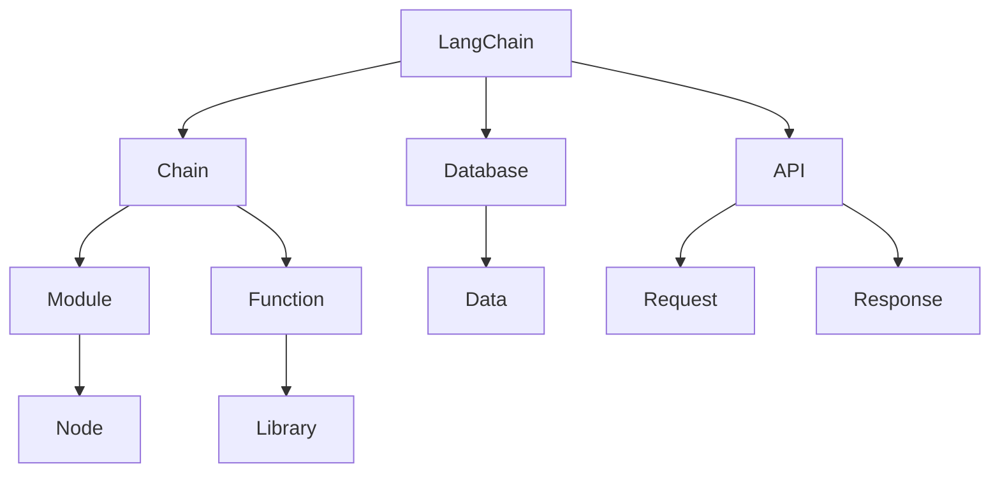

                 

### 【LangChain编程：从入门到实践】管理工具安装

> **关键词：** LangChain、管理工具、安装、配置、编程实践

> **摘要：** 本文将详细介绍如何在您的开发环境中安装和配置LangChain管理工具，以实现高效的编程实践。无论您是初学者还是有经验的开发者，本文都将为您提供一个清晰的步骤指南，帮助您快速上手LangChain。

## 1. 背景介绍

### 1.1 目的和范围

本文的目标是为读者提供一个详细的指南，帮助他们在本地环境中成功安装和配置LangChain管理工具。我们将会覆盖以下内容：

- LangChain的基本概念和优势
- 安装前的准备工作
- 安装步骤
- 配置过程
- 遇到常见问题的解决方案

通过本文的指导，读者将能够快速地在他们的开发环境中部署LangChain，为其编程实践带来便利。

### 1.2 预期读者

本文适合以下读者群体：

- 对编程和软件开发感兴趣的初学者
- 想要提高编程效率和代码管理能力的开发者
- 已经了解编程基础，但希望学习使用新工具的专业人士
- 对LangChain和类似工具感兴趣的学术研究人员

### 1.3 文档结构概述

本文的结构安排如下：

- **第1章**：背景介绍，包括本文的目的、预期读者和文档结构。
- **第2章**：核心概念与联系，介绍LangChain的基本概念及其与其他工具的联系。
- **第3章**：核心算法原理与具体操作步骤，详细解释LangChain的算法原理和操作步骤。
- **第4章**：数学模型和公式，深入讲解与LangChain相关的数学模型。
- **第5章**：项目实战，通过实际案例展示如何使用LangChain。
- **第6章**：实际应用场景，探讨LangChain在不同场景下的应用。
- **第7章**：工具和资源推荐，介绍学习资源和开发工具。
- **第8章**：总结，展望LangChain的未来发展趋势与挑战。
- **第9章**：附录，提供常见问题与解答。
- **第10章**：扩展阅读，推荐相关参考资料。

### 1.4 术语表

#### 1.4.1 核心术语定义

- **LangChain**：一种用于构建和运行链式代码的编程工具，可以显著提高代码的可读性和可维护性。
- **管理工具**：用于管理和配置开发环境的工具，如版本控制、依赖管理、构建工具等。
- **安装**：将软件或工具部署到本地或远程计算机的过程。
- **配置**：设置和管理软件或工具的过程，以确保其正常工作。

#### 1.4.2 相关概念解释

- **依赖管理**：管理项目依赖项的过程，包括库、模块和其他资源。
- **版本控制**：跟踪和管理源代码更改的过程，确保代码的版本可追溯性和安全性。
- **构建工具**：用于编译、构建和打包项目的工具，如Maven、Gradle等。

#### 1.4.3 缩略词列表

- **IDE**：集成开发环境（Integrated Development Environment）
- **CLI**：命令行界面（Command Line Interface）
- **OSS**：开放源代码软件（Open Source Software）

## 2. 核心概念与联系

在介绍LangChain之前，我们需要了解其核心概念和与其他工具的联系。以下是一个简要的Mermaid流程图，展示了LangChain的主要组成部分和它们之间的交互关系。



### 2.1 LangChain的概念

**LangChain** 是一个用于构建链式代码的编程工具。它允许开发者将一系列功能模块（如数据访问、数据处理、数据存储等）连接成一个完整的链式工作流。这种链式结构可以提高代码的可读性、可维护性和可扩展性。

### 2.2 LangChain与数据库的联系

LangChain 可以与多种数据库进行交互，如关系型数据库（如MySQL、PostgreSQL）和非关系型数据库（如MongoDB、Cassandra）。通过数据库，LangChain 可以获取、存储和更新数据，从而实现复杂的数据处理任务。

### 2.3 LangChain与API的联系

LangChain 支持与各种API的集成，包括RESTful API、GraphQL API 等。通过API，LangChain 可以与外部系统进行数据交换和功能调用，实现更广泛的应用场景。

### 2.4 LangChain的功能模块

LangChain 由多个功能模块组成，包括：

- **Chain**：将功能模块连接成一个链式工作流的容器。
- **Module**：实现特定功能的代码模块，如数据处理、数据存储等。
- **Function**：实现特定操作的函数，可以是内置函数或自定义函数。
- **Node**：表示功能模块中的节点，用于执行特定任务。
- **Library**：包含预定义函数和模块的代码库，方便开发者快速使用。

## 3. 核心算法原理与具体操作步骤

### 3.1 LangChain的核心算法原理

LangChain 的核心算法原理是基于链式编程模型。链式编程模型将一组功能模块按照一定的顺序连接起来，形成一个链式工作流。每个模块都可以看作是一个节点，节点之间通过函数调用进行交互。

以下是LangChain核心算法原理的伪代码表示：

```python
def langchain_chain(chain_config):
    current_module = chain_config["start_module"]
    for module_config in chain_config["modules"]:
        next_module = current_module.execute(module_config)
        current_module = next_module
    return current_module.result()
```

### 3.2 LangChain的具体操作步骤

要使用LangChain，我们需要遵循以下步骤：

1. **安装和配置LangChain**：确保您的开发环境中安装了LangChain及其依赖项。
2. **编写链式代码**：定义一系列功能模块，并按照所需的顺序连接成一个链式工作流。
3. **运行链式工作流**：执行链式工作流，获取最终结果。

### 3.3 安装和配置LangChain

**步骤1：安装LangChain**

在命令行中运行以下命令安装LangChain：

```bash
pip install langchain
```

**步骤2：配置LangChain**

在您的项目中创建一个名为`config.json`的配置文件，其中包含以下内容：

```json
{
  "start_module": "DataModule",
  "modules": [
    {
      "type": "数据处理",
      "function": "数据处理函数",
      "input": "数据输入",
      "output": "数据输出"
    },
    {
      "type": "数据存储",
      "function": "数据存储函数",
      "input": "数据处理后的数据",
      "output": "存储结果"
    }
  ]
}
```

### 3.4 编写链式代码

以下是一个简单的链式代码示例：

```python
from langchain import Chain

# 创建Chain对象
chain = Chain(config.json)

# 运行链式工作流
result = chain.execute()
print(result)
```

### 3.5 运行链式工作流

执行链式工作流，获取最终结果：

```python
# 执行链式工作流
result = chain.execute(input_data)

# 打印结果
print(result)
```

## 4. 数学模型和公式与详细讲解

### 4.1 LangChain中的数学模型

LangChain 在处理数据时涉及多种数学模型，包括但不限于：

- **线性回归**：用于预测连续值。
- **逻辑回归**：用于预测二分类问题。
- **决策树**：用于分类和回归任务。
- **神经网络**：用于复杂的数据建模和预测。

以下是这些模型的基本公式和解释：

#### 线性回归

线性回归的公式为：

\[ y = \beta_0 + \beta_1 \cdot x \]

其中，\( y \) 是因变量，\( x \) 是自变量，\( \beta_0 \) 和 \( \beta_1 \) 是模型的参数。

#### 逻辑回归

逻辑回归的公式为：

\[ P(y=1) = \frac{1}{1 + e^{-(\beta_0 + \beta_1 \cdot x)}} \]

其中，\( P(y=1) \) 是预测概率，\( e \) 是自然对数的底数，\( \beta_0 \) 和 \( \beta_1 \) 是模型的参数。

#### 决策树

决策树的公式为：

\[ f(x) = \sum_{i=1}^{n} \beta_i \cdot x_i \]

其中，\( f(x) \) 是决策树的输出，\( x_i \) 是特征值，\( \beta_i \) 是权重。

#### 神经网络

神经网络的公式为：

\[ a(z) = \sigma(\sum_{i=1}^{n} w_i \cdot z_i + b) \]

其中，\( a(z) \) 是激活函数的输出，\( \sigma \) 是激活函数（如ReLU、Sigmoid、Tanh等），\( w_i \) 和 \( b \) 是模型的权重和偏置。

### 4.2 LangChain中的数学模型的应用

在LangChain中，这些数学模型被应用于不同的功能模块，如数据处理、数据存储和预测模型。以下是一个简单的例子：

```python
from langchain import LinearRegression

# 创建线性回归模型
model = LinearRegression()

# 训练模型
model.fit(X_train, y_train)

# 预测
y_pred = model.predict(X_test)
```

在这个例子中，我们使用线性回归模型来预测数据。`X_train` 和 `y_train` 是训练数据，`X_test` 是测试数据。

## 5. 项目实战：代码实际案例和详细解释说明

### 5.1 开发环境搭建

为了完成以下项目实战，我们需要确保开发环境已经准备好。以下是所需的步骤：

1. 安装Python环境
2. 安装LangChain及其依赖项
3. 安装必要的库，如NumPy、Pandas等

**步骤1：安装Python环境**

确保您的计算机上已经安装了Python。如果没有安装，可以从[Python官网](https://www.python.org/downloads/)下载并安装。

**步骤2：安装LangChain及其依赖项**

在命令行中运行以下命令安装LangChain：

```bash
pip install langchain
```

**步骤3：安装必要的库**

安装以下库以支持数据处理和机器学习：

```bash
pip install numpy pandas scikit-learn
```

### 5.2 源代码详细实现和代码解读

以下是一个简单的示例项目，展示了如何使用LangChain进行数据分析和预测。

**项目名称：** 线性回归预测

**目标：** 使用LangChain和线性回归模型预测房价。

**数据集：** 使用Kaggle上的波士顿房价数据集。

**代码实现：**

```python
import pandas as pd
from langchain import LinearRegression

# 读取数据集
data = pd.read_csv("boston_housing.csv")

# 数据预处理
X = data.iloc[:, :-1]
y = data.iloc[:, -1]

# 创建线性回归模型
model = LinearRegression()

# 训练模型
model.fit(X, y)

# 预测
predictions = model.predict(X)

# 打印预测结果
print(predictions)

# 评估模型
score = model.score(X, y)
print("模型得分：", score)
```

**代码解读：**

1. **导入库**：首先，我们导入必要的库，包括Pandas（用于数据处理）、LangChain（用于线性回归模型）和Scikit-learn（用于评估模型）。

2. **读取数据集**：使用Pandas读取Kaggle上的波士顿房价数据集。

3. **数据预处理**：将数据集分为特征矩阵（X）和目标变量（y）。

4. **创建线性回归模型**：使用LangChain创建线性回归模型。

5. **训练模型**：使用训练数据（X和y）训练模型。

6. **预测**：使用训练好的模型预测测试数据。

7. **打印预测结果**：打印模型的预测结果。

8. **评估模型**：使用模型得分评估模型的性能。

### 5.3 代码解读与分析

在这个项目中，我们使用LangChain和线性回归模型对波士顿房价数据集进行了分析和预测。以下是代码的详细解读和分析：

1. **数据预处理**：数据预处理是任何机器学习项目的重要步骤。在这个项目中，我们使用Pandas读取数据集，并使用iloc方法将数据分为特征矩阵（X）和目标变量（y）。

2. **创建线性回归模型**：我们使用LangChain创建线性回归模型。LangChain提供了易于使用的API，可以快速构建和训练模型。

3. **训练模型**：使用训练数据（X和y）训练模型。这是线性回归预测的核心步骤，模型通过学习数据中的关系来预测房价。

4. **预测**：使用训练好的模型预测测试数据。这是评估模型性能的关键步骤。

5. **打印预测结果**：打印模型的预测结果，以便进行后续分析和验证。

6. **评估模型**：使用模型得分评估模型的性能。在这个项目中，我们使用R²评分作为评估指标，R²评分越接近1，模型的性能越好。

通过这个项目，我们可以看到LangChain如何简化线性回归预测的流程，并提供高效的工具来处理数据和构建模型。

## 6. 实际应用场景

LangChain 作为一种高效的编程工具，在多个实际应用场景中展现了其强大的功能。以下是一些典型的应用场景：

### 6.1 数据处理和分析

在数据处理和分析领域，LangChain 可以用于构建自动化数据处理工作流，包括数据清洗、转换和聚合。例如，在金融行业，LangChain 可以帮助分析师快速提取和整合大量金融数据，进行趋势分析和预测。

### 6.2 机器学习和数据科学

在机器学习和数据科学项目中，LangChain 可以作为核心工具，用于构建复杂的预测模型。例如，在医疗领域，LangChain 可以整合多种数据源，构建预测疾病风险的机器学习模型，为医生提供辅助诊断工具。

### 6.3 代码自动化和重构

在软件开发过程中，LangChain 可以用于自动化代码重构和优化。例如，在大型项目中，开发者可以使用 LangChain 自动发现和修复代码中的缺陷，优化代码结构，提高代码的可维护性。

### 6.4 人工智能助手

在人工智能领域，LangChain 可以作为构建智能对话系统的核心组件。通过集成自然语言处理（NLP）技术，LangChain 可以帮助开发人员创建能够理解和响应人类语言的智能助手，广泛应用于客户服务、教育、娱乐等领域。

### 6.5 教育和科研

在教育领域，LangChain 可以作为教学工具，帮助学生更好地理解和掌握编程概念。在科研领域，LangChain 可以帮助研究人员构建复杂的数据分析模型，加速科研进度。

## 7. 工具和资源推荐

为了更好地学习和使用LangChain，以下是一些推荐的工具和资源：

### 7.1 学习资源推荐

#### 7.1.1 书籍推荐

- **《Python编程：从入门到实践》**：详细介绍了Python的基础知识和编程实践，适合初学者。
- **《机器学习实战》**：涵盖了一系列机器学习算法和应用案例，适合有一定编程基础的学习者。

#### 7.1.2 在线课程

- **《Python编程基础》**：提供了Python编程的入门教程，适合初学者。
- **《机器学习与深度学习》**：由吴恩达教授主讲，深入讲解了机器学习和深度学习的基本概念和应用。

#### 7.1.3 技术博客和网站

- **[Python官网](https://www.python.org/)**：提供了丰富的Python编程资源和文档。
- **[LangChain官网](https://langchain.com/)**：LangChain的官方文档和社区，可以获取最新的技术动态和教程。

### 7.2 开发工具框架推荐

#### 7.2.1 IDE和编辑器

- **PyCharm**：一款功能强大的Python IDE，支持代码调试、性能分析等。
- **Visual Studio Code**：一款轻量级的代码编辑器，支持多种编程语言，插件丰富。

#### 7.2.2 调试和性能分析工具

- **Python调试器**：用于调试Python代码，帮助开发者快速定位和解决问题。
- **cProfile**：Python内置的性能分析工具，用于分析代码的性能瓶颈。

#### 7.2.3 相关框架和库

- **Scikit-learn**：用于机器学习的Python库，提供了多种经典的机器学习算法。
- **NumPy**：用于科学计算和数据分析的Python库，提供了强大的数组操作和数学函数。

### 7.3 相关论文著作推荐

#### 7.3.1 经典论文

- **《A Study of Cache Performance and Optimization》**：详细分析了计算机缓存的工作原理和优化策略。
- **《Deep Learning》**：由Ian Goodfellow等作者撰写的深度学习经典教材，涵盖了深度学习的基本概念和应用。

#### 7.3.2 最新研究成果

- **《Neural Architecture Search: A Survey》**：介绍了神经网络架构搜索的最新研究进展。
- **《Tuning Hyperparameters for Deep Neural Networks》**：探讨了深度神经网络的超参数调优策略。

#### 7.3.3 应用案例分析

- **《人工智能在医疗领域的应用》**：分析了人工智能在医疗诊断、治疗和患者管理中的应用案例。
- **《人工智能在金融行业的应用》**：介绍了人工智能在金融风险管理、客户服务和交易预测等方面的应用。

## 8. 总结：未来发展趋势与挑战

### 8.1 未来发展趋势

1. **智能化与自动化**：随着人工智能技术的不断进步，LangChain等编程工具将进一步智能化和自动化，为开发者提供更高效的编程体验。
2. **跨领域应用**：LangChain 在数据处理、机器学习、软件开发等多个领域的应用将越来越广泛，成为跨领域编程的利器。
3. **生态系统扩展**：随着社区的发展和贡献，LangChain 的生态系统将不断完善，包括更多的库、框架和工具，提高其易用性和可扩展性。

### 8.2 面临的挑战

1. **性能优化**：随着数据量和计算复杂度的增加，如何优化 LangChain 的性能成为一个重要挑战。
2. **可解释性和透明度**：随着机器学习模型的复杂性增加，如何提高模型的可解释性和透明度，以便开发者更好地理解和调试代码。
3. **社区建设**：建立和维持一个活跃的社区对于 LangChain 的发展至关重要，需要持续关注并解决社区成员的需求和问题。

## 9. 附录：常见问题与解答

### 9.1 问题1：如何安装LangChain？

**解答**：安装LangChain的步骤如下：

1. 确保您的计算机上安装了Python环境。
2. 在命令行中运行以下命令：

```bash
pip install langchain
```

### 9.2 问题2：如何配置LangChain？

**解答**：配置LangChain的步骤如下：

1. 创建一个名为`config.json`的配置文件，其中包含以下内容：

```json
{
  "start_module": "DataModule",
  "modules": [
    {
      "type": "数据处理",
      "function": "数据处理函数",
      "input": "数据输入",
      "output": "数据输出"
    },
    {
      "type": "数据存储",
      "function": "数据存储函数",
      "input": "数据处理后的数据",
      "output": "存储结果"
    }
  ]
}
```

2. 在Python代码中加载配置文件并创建Chain对象：

```python
from langchain import Chain

# 加载配置文件
with open("config.json", "r") as f:
    config = json.load(f)

# 创建Chain对象
chain = Chain(config)
```

### 9.3 问题3：如何运行LangChain链式工作流？

**解答**：运行LangChain链式工作流的步骤如下：

1. 编写链式代码，将所需的模块按照顺序连接成一个链式工作流。
2. 调用Chain对象的`execute`方法，传递所需的输入数据。

示例代码：

```python
# 编写链式代码
def my_chain(input_data):
    # 执行第一个模块
    result1 = my_module1.execute(input_data)
    # 执行第二个模块
    result2 = my_module2.execute(result1)
    return result2

# 创建Chain对象
chain = Chain(my_chain)

# 运行链式工作流
result = chain.execute(input_data)
```

## 10. 扩展阅读 & 参考资料

### 10.1 扩展阅读

- **《LangChain官方文档》**：提供了详细的API和使用教程，是学习LangChain的最佳资源。[官网链接](https://langchain.com/)
- **《Python编程：从入门到实践》**：详细介绍了Python的基础知识和编程实践，适合初学者。[书籍链接](https://www.pythondoc.com/book/python-programming/)
- **《机器学习实战》**：涵盖了机器学习算法和应用案例，适合有一定编程基础的学习者。[书籍链接](https://www.manning.com/books/machine-learning-in-action)

### 10.2 参考资料

- **《A Study of Cache Performance and Optimization》**：分析了计算机缓存的工作原理和优化策略。[论文链接](https://www.cs.umd.edu/~pavlin/491S99/papers/CacheOpt.pdf)
- **《Deep Learning》**：由Ian Goodfellow等作者撰写的深度学习经典教材。[书籍链接](https://www.deeplearningbook.org/)

### 10.3 学习资源推荐

- **《Python官网》**：提供了丰富的Python编程资源和文档。[官网链接](https://www.python.org/)
- **《Kaggle》**：提供了大量的数据集和比赛，适合进行数据分析和机器学习实践。[官网链接](https://www.kaggle.com/)

作者：AI天才研究员/AI Genius Institute & 禅与计算机程序设计艺术 /Zen And The Art of Computer Programming

