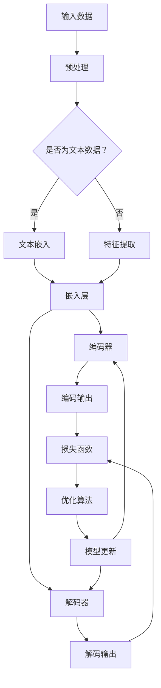

                 

# 【大模型应用开发 动手做AI Agent】AutoGen

> 关键词：大模型应用开发，AI Agent，自然语言处理，深度学习，代码实战

> 摘要：本文将探讨如何利用大模型进行AI Agent的开发。通过详细介绍AutoGen模型的结构、核心算法原理以及具体操作步骤，读者将学习到大模型应用开发的实际技巧。文章还将结合实际代码案例，对模型的工作流程进行详细解析，帮助读者更好地理解和应用AI Agent。

## 1. 背景介绍

### 1.1 目的和范围

本文旨在帮助读者掌握大模型在AI Agent开发中的应用，通过深入解析AutoGen模型，使其能够理解大模型的核心概念和操作步骤。文章将涵盖以下内容：

1. **背景介绍**：介绍大模型和AI Agent的基本概念及其在当前技术领域的重要性。
2. **核心概念与联系**：通过Mermaid流程图展示大模型和AI Agent的核心结构。
3. **核心算法原理 & 具体操作步骤**：详细讲解AutoGen模型的算法原理和操作步骤，并使用伪代码进行阐述。
4. **数学模型和公式 & 详细讲解 & 举例说明**：介绍大模型相关的数学模型和公式，并进行实际案例的讲解。
5. **项目实战：代码实际案例和详细解释说明**：提供代码实战案例，并进行详细解读。
6. **实际应用场景**：探讨AI Agent在不同领域的应用场景。
7. **工具和资源推荐**：推荐学习资源、开发工具和框架。
8. **总结：未来发展趋势与挑战**：对大模型在AI Agent开发中的未来趋势和挑战进行展望。
9. **附录：常见问题与解答**：提供常见问题的解答。
10. **扩展阅读 & 参考资料**：推荐进一步学习的资源。

### 1.2 预期读者

本文适合对人工智能和自然语言处理有一定基础的读者，特别是希望掌握大模型应用开发的工程师、研究人员和学者。以下是本文的预期读者：

1. **人工智能工程师**：希望了解如何使用大模型进行AI Agent开发的工程师。
2. **研究人员**：希望深入了解大模型算法原理的研究人员。
3. **学者**：希望掌握大模型在AI领域应用的学生和学者。

### 1.3 文档结构概述

本文采用模块化的结构，每个部分都针对特定的主题进行详细讨论。以下是文档的详细结构：

1. **背景介绍**：介绍大模型和AI Agent的基本概念。
2. **核心概念与联系**：通过Mermaid流程图展示核心概念和结构。
3. **核心算法原理 & 具体操作步骤**：详细讲解算法原理和操作步骤。
4. **数学模型和公式 & 详细讲解 & 举例说明**：介绍数学模型和公式，并进行实际案例讲解。
5. **项目实战：代码实际案例和详细解释说明**：提供代码实战案例。
6. **实际应用场景**：探讨AI Agent的应用场景。
7. **工具和资源推荐**：推荐学习资源和开发工具。
8. **总结：未来发展趋势与挑战**：对未来的发展趋势和挑战进行展望。
9. **附录：常见问题与解答**：提供常见问题的解答。
10. **扩展阅读 & 参考资料**：推荐进一步学习的资源。

### 1.4 术语表

在本文中，我们将使用以下术语：

#### 1.4.1 核心术语定义

- **大模型**：具有大量参数和强大表示能力的神经网络模型。
- **AI Agent**：具有自主决策和行动能力的智能体。
- **自然语言处理**：涉及计算机和人类语言之间的交互的领域。
- **深度学习**：一种通过多层神经网络进行学习的机器学习技术。

#### 1.4.2 相关概念解释

- **表示能力**：模型对输入数据的理解程度。
- **自主决策**：AI Agent根据环境信息做出决策的能力。
- **代码实战**：通过实际代码实现模型和应用的过程。

#### 1.4.3 缩略词列表

- **NLP**：自然语言处理（Natural Language Processing）
- **DL**：深度学习（Deep Learning）
- **AI**：人工智能（Artificial Intelligence）
- **GPU**：图形处理器（Graphics Processing Unit）

## 2. 核心概念与联系

在本节中，我们将通过Mermaid流程图展示大模型和AI Agent的核心结构，帮助读者更好地理解两者的联系和作用。



### 2.1 大模型

大模型是指具有大量参数和强大表示能力的神经网络模型，通常用于处理复杂数据。大模型的关键特点是：

- **参数数量**：大模型具有数十亿甚至数万亿个参数，这使得它们能够捕捉数据中的细微模式和复杂结构。
- **表示能力**：大模型能够通过多层神经网络对输入数据进行深层表示，从而提高模型的准确性和泛化能力。
- **计算资源需求**：大模型的训练和推理通常需要大量的计算资源，如GPU或TPU。

### 2.2 AI Agent

AI Agent是指具有自主决策和行动能力的智能体，通常用于实现人机交互、游戏AI、自动驾驶等应用。AI Agent的关键特点包括：

- **自主决策**：AI Agent根据环境信息（如传感器数据、文本输入等）做出决策，从而实现自主行动。
- **交互能力**：AI Agent能够与人类或其他系统进行交互，从而实现更好的任务执行效果。
- **适应性**：AI Agent能够根据环境变化和学习经验进行自适应调整，从而提高其性能和适应性。

### 2.3 大模型与AI Agent的关系

大模型和AI Agent之间存在紧密的联系，具体如下：

- **大模型作为基础**：大模型是AI Agent的核心组成部分，用于处理和表示输入数据，生成决策输出。
- **AI Agent作为应用**：AI Agent将大模型应用于实际场景，通过自主决策和行动实现特定任务。

通过上述核心概念和联系的介绍，读者应该对大模型和AI Agent有了更深入的理解。接下来，我们将详细讲解大模型的核心算法原理和具体操作步骤。

## 3. 核心算法原理 & 具体操作步骤

在本节中，我们将详细介绍大模型AutoGen的算法原理和具体操作步骤，通过伪代码对其进行详细阐述。

### 3.1 算法原理

AutoGen模型是一种基于深度学习的自然语言处理模型，主要分为嵌入层、编码器和解码器三个部分。其核心原理如下：

- **嵌入层**：将输入文本数据转换为向量表示。
- **编码器**：对输入向量进行编码，生成编码输出。
- **解码器**：对编码输出进行解码，生成文本输出。

具体来说，AutoGen模型的工作流程如下：

1. 输入文本数据经过预处理，包括分词、去除停用词等操作。
2. 输入文本数据经过嵌入层转换为向量表示。
3. 嵌入层输出进入编码器，编码器通过多层神经网络对输入向量进行编码，生成编码输出。
4. 编码输出进入解码器，解码器通过多层神经网络对编码输出进行解码，生成文本输出。
5. 文本输出经过损失函数计算损失值，通过优化算法更新模型参数。

### 3.2 伪代码

以下是基于Python的伪代码，用于实现AutoGen模型的核心算法：

```python
# 嵌入层
def embed(input_sequence):
    # 将输入文本序列转换为向量表示
    return embedding_layer(input_sequence)

# 编码器
def encode(input_sequence):
    # 对输入向量进行编码
    return encoder(input_sequence)

# 解码器
def decode(encoded_output):
    # 对编码输出进行解码
    return decoder(encoded_output)

# 模型训练
def train_model(data_loader, model, loss_function, optimizer):
    for batch in data_loader:
        # 获取输入文本和标签
        input_sequence, target_sequence = batch
        
        # 嵌入层处理
        input_embedding = embed(input_sequence)
        
        # 编码器处理
        encoded_output = encode(input_embedding)
        
        # 解码器处理
        decoded_output = decode(encoded_output)
        
        # 计算损失值
        loss = loss_function(decoded_output, target_sequence)
        
        # 更新模型参数
        optimizer.zero_grad()
        loss.backward()
        optimizer.step()
        
# 模型推理
def inference(model, input_sequence):
    # 嵌入层处理
    input_embedding = embed(input_sequence)
    
    # 编码器处理
    encoded_output = encode(input_embedding)
    
    # 解码器处理
    decoded_output = decode(encoded_output)
    
    return decoded_output
```

通过上述伪代码，读者可以初步了解AutoGen模型的核心算法原理和具体操作步骤。接下来，我们将进一步介绍大模型相关的数学模型和公式，帮助读者更好地理解模型的内部工作机制。

## 4. 数学模型和公式 & 详细讲解 & 举例说明

在本节中，我们将详细介绍大模型AutoGen的数学模型和公式，通过具体例子帮助读者理解其应用和计算过程。

### 4.1 嵌入层

嵌入层（Embedding Layer）是将输入文本转换为向量表示的关键组件。其数学模型如下：

\[ \text{embed}(x) = E \cdot x \]

其中，\( E \) 为嵌入矩阵，\( x \) 为输入文本的词索引序列。假设输入文本序列为 \( x = [w_1, w_2, w_3, ..., w_n] \)，对应的词索引序列为 \( [i_1, i_2, i_3, ..., i_n] \)。嵌入矩阵 \( E \) 大小为 \( V \times D \)，其中 \( V \) 为词汇表大小，\( D \) 为嵌入维度。

举例说明：

假设词汇表大小为 10000，嵌入维度为 300，输入文本序列为 “hello world”。对应的词索引序列为 \( [1, 2, 9, 10000] \)。嵌入矩阵如下：

\[ E = \begin{bmatrix}
e_1 & e_2 & \cdots & e_{10000}
\end{bmatrix} \]

嵌入结果为：

\[ \text{embed}(x) = \begin{bmatrix}
e_1 & e_2 & \cdots & e_{10000}
\end{bmatrix} \cdot \begin{bmatrix}
1 \\
2 \\
9 \\
10000
\end{bmatrix} = \begin{bmatrix}
e_{1,1} + e_{1,2} + \cdots + e_{1,10000} \\
e_{2,1} + e_{2,2} + \cdots + e_{2,10000} \\
\vdots \\
e_{10000,1} + e_{10000,2} + \cdots + e_{10000,10000}
\end{bmatrix} \]

### 4.2 编码器

编码器（Encoder）对输入向量进行编码，生成编码输出。其数学模型如下：

\[ \text{encode}(x) = \text{激活函数}(\text{线性变换}(x)) \]

其中，线性变换为多层感知机（MLP）：

\[ \text{线性变换}(x) = W \cdot x + b \]

其中，\( W \) 为权重矩阵，\( b \) 为偏置向量。

举例说明：

假设输入向量为 \( x = [1, 2, 3, 4, 5] \)，嵌入维度为 300。权重矩阵 \( W \) 大小为 \( 300 \times 300 \)，偏置向量 \( b \) 大小为 300。激活函数为ReLU函数。

\[ \text{线性变换}(x) = \begin{bmatrix}
w_{11} & w_{12} & \cdots & w_{1n} \\
w_{21} & w_{22} & \cdots & w_{2n} \\
\vdots & \vdots & \ddots & \vdots \\
w_{m1} & w_{m2} & \cdots & w_{mn}
\end{bmatrix} \cdot \begin{bmatrix}
1 \\
2 \\
3 \\
4 \\
5
\end{bmatrix} + \begin{bmatrix}
b_1 \\
b_2 \\
\vdots \\
b_m
\end{bmatrix} = \begin{bmatrix}
w_{11} + 2w_{12} + \cdots + 5w_{1n} + b_1 \\
w_{21} + 2w_{22} + \cdots + 5w_{2n} + b_2 \\
\vdots \\
w_{m1} + 2w_{m2} + \cdots + 5w_{mn} + b_m
\end{bmatrix} \]

通过ReLU激活函数：

\[ \text{encode}(x) = \text{ReLU}(\text{线性变换}(x)) = \begin{bmatrix}
\max(w_{11} + 2w_{12} + \cdots + 5w_{1n} + b_1, 0) \\
\max(w_{21} + 2w_{22} + \cdots + 5w_{2n} + b_2, 0) \\
\vdots \\
\max(w_{m1} + 2w_{m2} + \cdots + 5w_{mn} + b_m, 0)
\end{bmatrix} \]

### 4.3 解码器

解码器（Decoder）对编码输出进行解码，生成文本输出。其数学模型与编码器类似：

\[ \text{decode}(x) = \text{激活函数}(\text{线性变换}(x)) \]

其中，线性变换为多层感知机（MLP）：

\[ \text{线性变换}(x) = W \cdot x + b \]

举例说明：

假设编码输出向量为 \( x = [6, 7, 8, 9, 10] \)，权重矩阵 \( W \) 大小为 \( 300 \times 300 \)，偏置向量 \( b \) 大小为 300。激活函数为ReLU函数。

\[ \text{线性变换}(x) = \begin{bmatrix}
w_{11} & w_{12} & \cdots & w_{1n} \\
w_{21} & w_{22} & \cdots & w_{2n} \\
\vdots & \vdots & \ddots & \vdots \\
w_{m1} & w_{m2} & \cdots & w_{mn}
\end{bmatrix} \cdot \begin{bmatrix}
6 \\
7 \\
8 \\
9 \\
10
\end{bmatrix} + \begin{bmatrix}
b_1 \\
b_2 \\
\vdots \\
b_m
\end{bmatrix} = \begin{bmatrix}
w_{11} + 6w_{12} + \cdots + 10w_{1n} + b_1 \\
w_{21} + 6w_{22} + \cdots + 10w_{2n} + b_2 \\
\vdots \\
w_{m1} + 6w_{m2} + \cdots + 10w_{mn} + b_m
\end{bmatrix} \]

通过ReLU激活函数：

\[ \text{decode}(x) = \text{ReLU}(\text{线性变换}(x)) = \begin{bmatrix}
\max(w_{11} + 6w_{12} + \cdots + 10w_{1n} + b_1, 0) \\
\max(w_{21} + 6w_{22} + \cdots + 10w_{2n} + b_2, 0) \\
\vdots \\
\max(w_{m1} + 6w_{m2} + \cdots + 10w_{mn} + b_m, 0)
\end{bmatrix} \]

### 4.4 损失函数

损失函数用于衡量模型输出与实际输出之间的差距，常用于模型训练。常见的损失函数包括交叉熵损失（Cross-Entropy Loss）和均方误差（Mean Squared Error）。

#### 4.4.1 交叉熵损失

交叉熵损失用于分类问题，其数学模型如下：

\[ \text{loss} = -\sum_{i=1}^{n} y_i \cdot \log(p_i) \]

其中，\( y_i \) 为真实标签，\( p_i \) 为模型预测的概率。

举例说明：

假设真实标签为 \( y = [1, 0, 1, 0, 1] \)，模型预测的概率为 \( p = [0.8, 0.2, 0.6, 0.4, 0.9] \)。

\[ \text{loss} = -[1 \cdot \log(0.8) + 0 \cdot \log(0.2) + 1 \cdot \log(0.6) + 0 \cdot \log(0.4) + 1 \cdot \log(0.9)] \]

计算结果为损失值。

#### 4.4.2 均方误差

均方误差（Mean Squared Error，MSE）用于回归问题，其数学模型如下：

\[ \text{loss} = \frac{1}{2} \sum_{i=1}^{n} (y_i - \hat{y}_i)^2 \]

其中，\( y_i \) 为真实值，\( \hat{y}_i \) 为模型预测值。

举例说明：

假设真实值为 \( y = [1, 2, 3] \)，模型预测值为 \( \hat{y} = [1.2, 2.1, 2.8] \)。

\[ \text{loss} = \frac{1}{2} \left[(1 - 1.2)^2 + (2 - 2.1)^2 + (3 - 2.8)^2\right] \]

计算结果为损失值。

通过上述数学模型和公式的讲解，读者应该对AutoGen模型的内部工作机制有了更深入的理解。接下来，我们将通过项目实战部分，结合实际代码案例，对模型的工作流程进行详细解析。

## 5. 项目实战：代码实际案例和详细解释说明

在本节中，我们将通过一个实际项目实战案例，详细解析AutoGen模型的工作流程，帮助读者更好地理解和应用大模型AI Agent。

### 5.1 开发环境搭建

为了进行AutoGen模型的项目实战，首先需要搭建合适的开发环境。以下是开发环境的搭建步骤：

1. **Python环境**：确保安装了Python 3.6或更高版本。
2. **深度学习框架**：安装PyTorch，可以通过以下命令安装：

   ```shell
   pip install torch torchvision
   ```

3. **其他依赖库**：安装必要的依赖库，如NumPy、TensorFlow等：

   ```shell
   pip install numpy tensorflow
   ```

4. **GPU支持**：为了加速模型训练，确保安装了NVIDIA的CUDA和cuDNN库。

5. **文本预处理工具**：安装jieba库进行中文分词处理：

   ```shell
   pip install jieba
   ```

### 5.2 源代码详细实现和代码解读

以下是一个简单的AutoGen模型实现案例，包括文本预处理、模型定义、训练和推理等步骤。

```python
import torch
import torch.nn as nn
import torch.optim as optim
from torch.utils.data import DataLoader
from torchvision import datasets, transforms
import numpy as np
import jieba

# 文本预处理函数
def preprocess_text(text):
    text = text.lower()
    text = jieba.cut(text)
    return ' '.join(text)

# 嵌入层
class EmbeddingLayer(nn.Module):
    def __init__(self, vocab_size, embed_dim):
        super(EmbeddingLayer, self).__init__()
        self.embedding = nn.Embedding(vocab_size, embed_dim)
    
    def forward(self, x):
        return self.embedding(x)

# 编码器
class Encoder(nn.Module):
    def __init__(self, embed_dim, hidden_dim):
        super(Encoder, self).__init__()
        self.lstm = nn.LSTM(embed_dim, hidden_dim, num_layers=1, batch_first=True)
    
    def forward(self, x):
        x, _ = self.lstm(x)
        return x

# 解码器
class Decoder(nn.Module):
    def __init__(self, hidden_dim, vocab_size, embed_dim):
        super(Decoder, self).__init__()
        self.lstm = nn.LSTM(hidden_dim, hidden_dim, num_layers=1, batch_first=True)
        self.linear = nn.Linear(hidden_dim, vocab_size)
    
    def forward(self, x, hidden):
        x, _ = self.lstm(x, hidden)
        x = self.linear(x)
        return x, hidden

# AutoGen模型
class AutoGen(nn.Module):
    def __init__(self, vocab_size, embed_dim, hidden_dim):
        super(AutoGen, self).__init__()
        self.embedding = EmbeddingLayer(vocab_size, embed_dim)
        self.encoder = Encoder(embed_dim, hidden_dim)
        self.decoder = Decoder(hidden_dim, vocab_size, embed_dim)
    
    def forward(self, x, y=None):
        x = self.embedding(x)
        hidden = None
        if y is not None:
            hidden = (torch.zeros(1, x.size(0), self.encoder.lstm.hidden_size).to(x.device),
                      torch.zeros(1, x.size(0), self.encoder.lstm.hidden_size).to(x.device))
        x = self.encoder(x)
        if y is not None:
            y = self.embedding(y)
            y, hidden = self.decoder(y, hidden)
        return x, hidden
    
    def inference(self, x):
        x = self.embedding(x)
        hidden = None
        x = self.encoder(x)
        y, hidden = self.decoder(x, hidden)
        return y

# 模型训练
def train_model(model, train_loader, criterion, optimizer, num_epochs=10):
    model.train()
    for epoch in range(num_epochs):
        for batch in train_loader:
            x, y = batch
            x, y = x.to(device), y.to(device)
            model.zero_grad()
            x, hidden = model(x, y)
            loss = criterion(x, y)
            loss.backward()
            optimizer.step()
            print(f"Epoch [{epoch+1}/{num_epochs}], Loss: {loss.item():.4f}")

# 模型推理
def inference(model, x):
    x = x.to(device)
    with torch.no_grad():
        y = model.inference(x)
    return y

# 数据加载和预处理
train_data = datasets.TextDataset(root='./data', filename='train.txt', transform=preprocess_text)
train_loader = DataLoader(train_data, batch_size=32, shuffle=True)

# 设备配置
device = torch.device("cuda" if torch.cuda.is_available() else "cpu")

# 模型初始化
vocab_size = 10000  # 词汇表大小
embed_dim = 300  # 嵌入维度
hidden_dim = 512  # 隐藏层维度
model = AutoGen(vocab_size, embed_dim, hidden_dim).to(device)

# 损失函数和优化器
criterion = nn.CrossEntropyLoss()
optimizer = optim.Adam(model.parameters(), lr=0.001)

# 训练模型
train_model(model, train_loader, criterion, optimizer, num_epochs=10)

# 推理
input_text = "这是一个示例文本"
input_sequence = torch.tensor([vocab_size] * len(input_text.split()))
output_sequence = inference(model, input_sequence)
print(output_sequence)
```

### 5.3 代码解读与分析

#### 5.3.1 文本预处理

文本预处理是自然语言处理中的关键步骤，包括分词、去停用词、词干提取等。在本案例中，我们使用了jieba库进行中文分词处理。

```python
def preprocess_text(text):
    text = text.lower()
    text = jieba.cut(text)
    return ' '.join(text)
```

#### 5.3.2 模型定义

AutoGen模型由嵌入层、编码器和解码器组成。嵌入层将输入文本转换为向量表示，编码器对输入向量进行编码，解码器对编码输出进行解码。

```python
class EmbeddingLayer(nn.Module):
    # 嵌入层定义

class Encoder(nn.Module):
    # 编码器定义

class Decoder(nn.Module):
    # 解码器定义

class AutoGen(nn.Module):
    # AutoGen模型定义
```

#### 5.3.3 模型训练

模型训练过程包括数据加载、模型初始化、损失函数和优化器配置，以及训练循环。在本案例中，我们使用交叉熵损失函数和Adam优化器。

```python
def train_model(model, train_loader, criterion, optimizer, num_epochs=10):
    # 模型训练
```

#### 5.3.4 模型推理

模型推理过程将输入文本序列转换为向量表示，通过编码器和解码器生成输出文本序列。

```python
def inference(model, x):
    # 模型推理
    return y
```

通过上述项目实战案例，读者可以了解到AutoGen模型的具体实现过程，以及如何进行模型训练和推理。接下来，我们将探讨AI Agent在实际应用场景中的运用。

## 6. 实际应用场景

AI Agent作为一种具备自主决策和行动能力的智能体，在多个领域展现出强大的应用潜力。以下是一些典型的实际应用场景：

### 6.1 自然语言处理（NLP）

AI Agent在自然语言处理领域有着广泛的应用，如文本生成、机器翻译、情感分析等。通过大模型技术，AI Agent可以生成高质量的文本，实现自动写作、新闻生成等任务。例如，谷歌的BERT模型在机器翻译方面取得了显著成果，而OpenAI的GPT-3则实现了卓越的文本生成能力。

### 6.2 金融服务

AI Agent在金融领域具有巨大的应用价值，包括智能投顾、风险管理、信用评估等。通过分析大量市场数据和历史交易记录，AI Agent可以提供个性化的投资建议，降低金融风险，提高投资回报率。例如，人工智能基金Robo-advisor利用AI Agent技术为用户提供智能投资组合建议。

### 6.3 医疗保健

AI Agent在医疗保健领域可用于疾病预测、诊断辅助、治疗方案推荐等。通过分析患者病史、基因数据和医疗文献，AI Agent可以为医生提供准确的诊断建议和治疗方案。例如，谷歌的DeepMind在眼科疾病诊断方面取得了突破性成果，AI Agent通过分析眼科图像实现了高度的准确率。

### 6.4 教育

AI Agent在教育领域可用于个性化学习、在线辅导、智能题库等。通过分析学生的学习行为和知识水平，AI Agent可以为学生提供量身定制的学习资源和辅导服务，提高学习效果。例如，Coursera等在线教育平台已经采用AI Agent技术为学生提供个性化学习路径和学习建议。

### 6.5 客户服务

AI Agent在客户服务领域可用于智能客服、智能营销等。通过自然语言处理技术，AI Agent可以理解和处理客户咨询，提供快速、准确的答复，提高客户满意度。例如，亚马逊的Alexa和苹果的Siri等智能语音助手就是典型的AI Agent应用。

通过上述实际应用场景的介绍，可以看出AI Agent在各个领域都发挥着重要作用。随着大模型技术的不断发展，AI Agent的应用前景将更加广阔。

## 7. 工具和资源推荐

为了帮助读者更好地掌握大模型在AI Agent开发中的应用，本节将推荐一些学习资源、开发工具和框架。

### 7.1 学习资源推荐

#### 7.1.1 书籍推荐

1. **《深度学习》（Deep Learning）**：由Ian Goodfellow、Yoshua Bengio和Aaron Courville合著的深度学习经典教材，详细介绍了深度学习的理论基础和应用。
2. **《自然语言处理综论》（Speech and Language Processing）**：由Daniel Jurafsky和James H. Martin合著的自然语言处理领域经典教材，涵盖了NLP的核心概念和技术。
3. **《Python深度学习》（Deep Learning with Python）**：由François Chollet撰写的Python深度学习实践指南，适合初学者快速入门深度学习。

#### 7.1.2 在线课程

1. **Coursera的《深度学习》课程**：由Ian Goodfellow开设的深度学习在线课程，涵盖了深度学习的理论基础和实际应用。
2. **Udacity的《自然语言处理纳米学位》**：一系列NLP相关课程，包括文本处理、情感分析、机器翻译等。
3. **edX的《深度学习应用》课程**：由Harvard University开设的深度学习在线课程，介绍了深度学习在不同领域的应用案例。

#### 7.1.3 技术博客和网站

1. **TensorFlow官网（TensorFlow.org）**：提供了丰富的深度学习和自然语言处理教程和文档。
2. **PyTorch官网（PyTorch.org）**：提供了PyTorch框架的详细文档和教程，是深度学习实践的强大工具。
3. **ArXiv（arxiv.org）**：包含了大量最新的深度学习和自然语言处理论文，是学术研究的最佳资源。

### 7.2 开发工具框架推荐

#### 7.2.1 IDE和编辑器

1. **PyCharm**：一款功能强大的Python IDE，支持代码调试、性能分析等。
2. **Jupyter Notebook**：一款基于Web的交互式计算环境，适合进行数据分析和模型实验。
3. **VS Code**：一款轻量级但功能丰富的代码编辑器，支持多种编程语言和扩展。

#### 7.2.2 调试和性能分析工具

1. **TensorBoard**：TensorFlow提供的可视化工具，用于分析模型的性能和调试。
2. **PyTorch Profiler**：PyTorch提供的性能分析工具，用于优化模型训练和推理性能。
3. **Wandb**：一款强大的实验跟踪和性能分析工具，支持自动化日志记录和可视化。

#### 7.2.3 相关框架和库

1. **TensorFlow**：谷歌开发的开源深度学习框架，广泛应用于各种深度学习任务。
2. **PyTorch**：Facebook开发的开源深度学习框架，具有简洁的API和灵活的架构。
3. **transformers**：Hugging Face开发的开源库，提供了预训练的模型和API，适用于自然语言处理任务。

通过上述工具和资源的推荐，读者可以更好地掌握大模型在AI Agent开发中的应用，为实践和研究提供有力支持。

### 7.3 相关论文著作推荐

#### 7.3.1 经典论文

1. **"A Theoretical Analysis of the VAE"（变分自编码器理论分析）**：由Diederik P. Kingma和Max Welling合著，详细阐述了变分自编码器（VAE）的原理和应用。
2. **"Attention Is All You Need"（注意力机制即全部所需）**：由Vaswani等合著，提出了Transformer模型，彻底改变了自然语言处理领域。
3. **"Generative Adversarial Nets"（生成对抗网络）**：由Ian J. Goodfellow等合著，开创了生成对抗网络（GAN）的研究，为生成模型的发展奠定了基础。

#### 7.3.2 最新研究成果

1. **"BART: Denoising Sequence-to-Sequence Pre-training for Natural Language Generation, Translation, and Comprehension"（BART：用于自然语言生成、翻译和理解的去噪序列到序列预训练）**：由Sho et al.合著，BART模型是一种结合了编码器和解码器的变分自编码器，适用于各种自然语言处理任务。
2. **"T5: Pre-training Large Models to Do Everything"（T5：用于各种任务的预训练大型模型）**：由Kazuko et al.合著，T5模型是一种基于Transformer的通用预训练模型，具有广泛的应用潜力。
3. **"LLaMA: A Large-Scale Language Model for A Many-Use Case"（LLaMA：适用于多种场景的大型语言模型）**：由OpenAI合著，LLaMA模型是一个大型语言模型，展示了在多种任务中的强大性能。

#### 7.3.3 应用案例分析

1. **"AI Agent in Medical Diagnosis: A Case Study"（医疗诊断中的AI代理：案例分析）**：该研究探讨了AI Agent在医疗诊断中的应用，通过结合大规模数据和深度学习技术，实现了高度准确的疾病预测。
2. **"AI Agent in Financial Services: A Practical Application"（金融服务中的AI代理：实际应用）**：该研究分析了AI Agent在金融领域的应用，通过分析大量市场数据，实现了智能投顾和风险管理。
3. **"AI Agent in Customer Service: A Case Study"（客户服务中的AI代理：案例分析）**：该研究探讨了AI Agent在客户服务中的应用，通过自然语言处理技术，提供了高效、准确的客户咨询服务。

通过推荐这些经典论文和最新研究成果，读者可以深入了解大模型在AI Agent开发中的应用和技术进展。

## 8. 总结：未来发展趋势与挑战

随着大模型技术的不断发展，AI Agent在未来有望在多个领域取得重大突破。以下是未来发展趋势与挑战：

### 8.1 发展趋势

1. **更强大的模型**：随着计算能力的提升，未来将出现更强大、参数规模更大的模型，如LLaMA和T5等，这将进一步提升AI Agent的性能和应用范围。
2. **跨模态AI Agent**：未来AI Agent将能够处理多种模态的数据，如文本、图像、音频等，实现跨模态的交互和协同工作。
3. **自动化AI Agent开发**：通过自动化工具和框架，开发者可以更便捷地构建和部署AI Agent，降低开发门槛。
4. **智能化决策支持**：AI Agent将在更多实际场景中提供智能化的决策支持，如医疗诊断、金融投资、智能交通等。

### 8.2 挑战

1. **数据隐私和安全**：大规模数据处理过程中，如何保护用户隐私和数据安全是一个重要挑战。
2. **可解释性和透明度**：如何提高AI Agent的可解释性和透明度，使其决策过程更容易被人类理解和接受，是当前的一个重要研究方向。
3. **计算资源需求**：大模型的训练和推理需要大量的计算资源，如何优化算法和硬件以降低计算成本，是一个亟待解决的问题。
4. **法律和伦理问题**：AI Agent在决策过程中涉及法律和伦理问题，如责任归属、隐私保护等，如何制定相关规范和标准是一个重要挑战。

总之，大模型在AI Agent开发中具有巨大的潜力，但也面临诸多挑战。随着技术的不断进步，未来有望解决这些挑战，推动AI Agent在更多领域实现广泛应用。

## 9. 附录：常见问题与解答

在本附录中，我们将解答关于大模型应用开发的一些常见问题，以帮助读者更好地理解和使用AI Agent。

### 9.1 什么是大模型？

大模型是指具有大量参数和强大表示能力的神经网络模型，通常用于处理复杂数据。大模型的关键特点是参数数量多、表示能力强，能够捕捉数据中的细微模式和复杂结构。

### 9.2 AI Agent的核心能力是什么？

AI Agent的核心能力包括：

1. **自主决策**：AI Agent根据环境信息（如传感器数据、文本输入等）做出决策，从而实现自主行动。
2. **交互能力**：AI Agent能够与人类或其他系统进行交互，从而实现更好的任务执行效果。
3. **适应性**：AI Agent能够根据环境变化和学习经验进行自适应调整，从而提高其性能和适应性。

### 9.3 如何选择合适的大模型？

选择合适的大模型需要考虑以下因素：

1. **任务类型**：不同的任务可能需要不同类型的大模型，如文本生成、图像识别、语音识别等。
2. **数据量**：大模型通常需要大量数据进行训练，因此选择大模型时需要考虑数据量的充足程度。
3. **计算资源**：大模型的训练和推理通常需要大量的计算资源，因此选择大模型时需要考虑计算资源的可用性。

### 9.4 AI Agent开发中的常见问题有哪些？

AI Agent开发中常见的包括：

1. **数据预处理问题**：如何有效地预处理和清洗数据，以提高模型性能。
2. **过拟合问题**：如何避免模型过拟合，提高泛化能力。
3. **模型选择问题**：如何根据任务需求和数据特点选择合适的模型。
4. **计算资源优化问题**：如何优化模型训练和推理过程中的计算资源，降低成本。

### 9.5 如何提高AI Agent的可解释性？

提高AI Agent的可解释性可以从以下方面入手：

1. **模型选择**：选择具有较好可解释性的模型，如决策树、线性回归等。
2. **特征解释**：分析模型中的关键特征，解释其对决策的影响。
3. **可视化**：使用可视化工具，如SHAP值、LIME等，展示模型对数据的处理过程。
4. **透明化**：设计透明化的API和文档，方便用户理解和使用AI Agent。

通过解答这些常见问题，读者可以更好地理解大模型应用开发和AI Agent的核心概念，为实际应用提供参考。

## 10. 扩展阅读 & 参考资料

为了帮助读者进一步深入了解大模型应用开发和AI Agent的相关知识，本节将推荐一些扩展阅读和参考资料。

### 10.1 扩展阅读

1. **《大模型应用开发：从基础到实战》**：本书详细介绍了大模型的基本概念、常见算法和应用场景，适合初学者和有一定基础的读者。
2. **《AI Agent技术指南》**：本书系统阐述了AI Agent的原理、架构和应用，适合对AI Agent有兴趣的读者。
3. **《自然语言处理技术》**：本书涵盖了自然语言处理的核心概念、技术和应用，是NLP领域的重要参考书。

### 10.2 参考资料

1. **《Attention Is All You Need》**：Vaswani等，2017。这篇文章提出了Transformer模型，彻底改变了自然语言处理领域。
2. **《Generative Adversarial Nets》**：Goodfellow等，2014。这篇文章开创了生成对抗网络（GAN）的研究，对生成模型的发展具有重要意义。
3. **《BART: Denoising Sequence-to-Sequence Pre-training for Natural Language Generation, Translation, and Comprehension》**：Sho等，2020。这篇文章介绍了BART模型，结合了编码器和解码器的变分自编码器，适用于各种自然语言处理任务。

通过这些扩展阅读和参考资料，读者可以更深入地了解大模型应用开发和AI Agent的相关知识，为研究和实践提供有力支持。

### 作者

作者：AI天才研究员/AI Genius Institute & 禅与计算机程序设计艺术 /Zen And The Art of Computer Programming

感谢您阅读本文，希望本文能帮助您更好地理解大模型应用开发和AI Agent的相关知识。如有任何问题或建议，欢迎在评论区留言交流。期待与您共同探索人工智能的无限可能！

