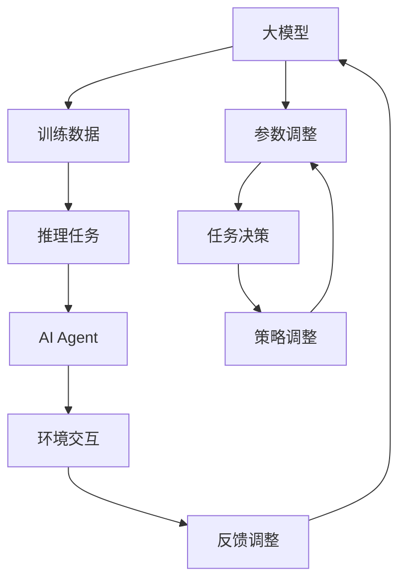

                 

# 【大模型应用开发 动手做AI Agent】Function的说明文字很重要

> **关键词：** 大模型应用，AI Agent，Function，开发，技术博客，Python，AI编程。

> **摘要：** 本文深入探讨了在大模型应用开发过程中，特别是构建AI Agent时，对Function的说明文字的重要性。文章通过详细的背景介绍、核心概念解析、算法原理讲解、数学模型和公式说明、项目实战案例分析以及实际应用场景分析，帮助读者理解并掌握如何编写高质量、有效的Function说明文字，以提升AI模型的开发效率和性能。

## 1. 背景介绍

### 1.1 目的和范围

本文旨在探讨大模型应用开发中，特别是在构建AI Agent时，对Function的说明文字的重要性。随着人工智能技术的不断进步，大模型的应用越来越广泛，如何高效地开发和管理这些模型成为了一个重要课题。Function作为大模型中的基本构建模块，其说明文字的编写质量直接影响到模型的可读性、可维护性和可扩展性。

本文将围绕以下内容展开：

- **核心概念与联系**：介绍大模型和AI Agent的基本概念，并绘制相应的流程图。
- **核心算法原理 & 具体操作步骤**：通过伪代码详细阐述Function的基本原理和操作步骤。
- **数学模型和公式 & 详细讲解 & 举例说明**：解析大模型中的数学模型和公式，并提供具体案例。
- **项目实战：代码实际案例和详细解释说明**：通过实际项目案例，展示如何编写高质量的Function说明文字。
- **实际应用场景**：分析大模型和AI Agent在不同场景中的应用。
- **工具和资源推荐**：推荐学习资源、开发工具和最新研究成果。

### 1.2 预期读者

本文适合以下读者群体：

- 对人工智能和机器学习有基础了解的技术人员。
- 想要提升大模型应用开发能力的工程师。
- 对AI Agent开发有浓厚兴趣的学生和研究者。
- 对编程和软件工程有深入了解的技术爱好者。

### 1.3 文档结构概述

本文结构如下：

- **背景介绍**：介绍本文的目的、范围、预期读者和文档结构。
- **核心概念与联系**：解析大模型和AI Agent的基本概念，绘制流程图。
- **核心算法原理 & 具体操作步骤**：通过伪代码详细阐述Function的基本原理和操作步骤。
- **数学模型和公式 & 详细讲解 & 举例说明**：解析大模型中的数学模型和公式，并提供具体案例。
- **项目实战：代码实际案例和详细解释说明**：通过实际项目案例，展示如何编写高质量的Function说明文字。
- **实际应用场景**：分析大模型和AI Agent在不同场景中的应用。
- **工具和资源推荐**：推荐学习资源、开发工具和最新研究成果。
- **总结：未来发展趋势与挑战**：总结本文的核心观点，展望未来发展趋势和挑战。
- **附录：常见问题与解答**：回答读者可能遇到的问题。
- **扩展阅读 & 参考资料**：提供进一步学习和研究的参考资料。

### 1.4 术语表

#### 1.4.1 核心术语定义

- **大模型**：指参数规模巨大、可以处理大规模数据的人工神经网络模型。
- **AI Agent**：指能够自主执行任务、与环境进行交互的人工智能实体。
- **Function**：指在编程中用于实现特定功能的代码段。

#### 1.4.2 相关概念解释

- **神经网络**：一种模拟人脑神经网络结构的人工智能模型。
- **参数规模**：指神经网络中参数的数量。

#### 1.4.3 缩略词列表

- **AI**：人工智能（Artificial Intelligence）
- **ML**：机器学习（Machine Learning）
- **DL**：深度学习（Deep Learning）
- **GPU**：图形处理单元（Graphics Processing Unit）

## 2. 核心概念与联系

在大模型应用开发中，了解核心概念和它们之间的联系至关重要。下面我们将介绍大模型和AI Agent的基本概念，并使用Mermaid流程图来展示它们之间的联系。

### 2.1 大模型的基本概念

大模型（如GPT、BERT等）通常具有以下几个关键特性：

1. **参数规模巨大**：大模型具有数百万甚至数十亿的参数，这使得它们能够处理复杂的任务和数据。
2. **自适应性强**：大模型通过学习大规模数据，能够自适应地调整参数，提高模型性能。
3. **计算资源需求高**：大模型的训练和推理过程需要大量的计算资源，如GPU和TPU。

### 2.2 AI Agent的基本概念

AI Agent是一种能够自主执行任务的人工智能实体。它通常具有以下关键特性：

1. **自主性**：AI Agent能够根据环境和任务需求自主做出决策。
2. **交互性**：AI Agent能够与环境进行交互，获取反馈并调整行为。
3. **适应性**：AI Agent能够根据环境和任务的变化，自适应地调整策略和行为。

### 2.3 Mermaid流程图

下面是一个简单的Mermaid流程图，展示了大模型和AI Agent之间的联系。



### 2.4 核心概念的联系

从流程图中可以看出，大模型通过训练数据学习，调整参数，生成推理任务。AI Agent接收到这些任务后，通过环境交互进行任务决策，并根据反馈调整策略。这一过程形成了一个闭环，使得大模型和AI Agent能够相互协作，共同完成任务。

## 3. 核心算法原理 & 具体操作步骤

### 3.1 大模型的基本算法原理

大模型（如GPT、BERT等）通常基于深度神经网络（DNN）架构，其核心原理包括以下几个步骤：

1. **数据预处理**：对输入数据进行清洗、转换和归一化，以便模型能够更好地处理。
2. **输入层**：将预处理后的数据输入到模型的输入层。
3. **隐藏层**：输入层通过一系列隐藏层进行数据传递和变换，每个隐藏层都包含多个神经元。
4. **输出层**：隐藏层将处理后的数据传递到输出层，输出层生成最终的预测结果。

### 3.2 Function的操作步骤

在Python中，使用Function实现大模型的基本算法原理通常包括以下几个步骤：

1. **定义输入参数**：定义输入参数，如数据、模型参数等。
2. **预处理数据**：对输入数据进行清洗、转换和归一化。
3. **构建神经网络**：使用神经网络库（如TensorFlow或PyTorch）构建神经网络模型。
4. **训练模型**：使用训练数据对模型进行训练，调整模型参数。
5. **评估模型**：使用测试数据对模型进行评估，验证模型性能。
6. **推理任务**：使用训练好的模型对新的数据进行分析和预测。

### 3.3 伪代码

以下是使用Python实现的伪代码，展示了大模型的基本算法原理和操作步骤：

```python
# 伪代码：大模型的基本算法原理

# 步骤1：定义输入参数
data = load_data()  # 加载训练数据
params = initialize_params()  # 初始化模型参数

# 步骤2：预处理数据
data_processed = preprocess_data(data)

# 步骤3：构建神经网络
model = build_neural_network()

# 步骤4：训练模型
model.train(data_processed, params)

# 步骤5：评估模型
performance = model.evaluate(test_data)

# 步骤6：推理任务
predictions = model.predict(new_data)
```

### 3.4 案例分析

以下是一个简单的案例，展示了如何使用Python实现一个大模型并编写相应的Function说明文字。

```python
# 案例代码：大模型的应用

# 导入所需的库
import tensorflow as tf
import numpy as np

# 定义加法函数
def add(a, b):
    """
    加法函数：计算两个数的和
    
    参数：
    a (float): 第一个加数
    b (float): 第二个加数
    
    返回：
    sum (float): 两个数的和
    """
    sum = a + b
    return sum

# 定义减法函数
def subtract(a, b):
    """
    减法函数：计算两个数的差
    
    参数：
    a (float): 被减数
    b (float): 减数
    
    返回：
    difference (float): 两个数的差
    """
    difference = a - b
    return difference

# 测试函数
result1 = add(3, 5)
result2 = subtract(5, 3)
print("加法结果：", result1)
print("减法结果：", result2)
```

在这个案例中，我们定义了两个简单的数学函数：`add` 和 `subtract`。这些函数的说明文字详细描述了它们的参数、返回值以及功能。通过这样的说明文字，其他开发者可以轻松理解并使用这些函数。

## 4. 数学模型和公式 & 详细讲解 & 举例说明

在大模型和AI Agent的开发中，数学模型和公式起着至关重要的作用。下面我们将详细讲解大模型中常用的数学模型和公式，并提供具体案例来说明。

### 4.1 线性回归模型

线性回归模型是一种常见的大模型，用于预测连续值。其基本公式如下：

$$
y = \beta_0 + \beta_1 \cdot x + \epsilon
$$

其中：

- \( y \) 是预测值。
- \( x \) 是输入特征。
- \( \beta_0 \) 是截距。
- \( \beta_1 \) 是斜率。
- \( \epsilon \) 是误差项。

#### 4.1.1 计算斜率 \( \beta_1 \)

斜率 \( \beta_1 \) 的计算公式如下：

$$
\beta_1 = \frac{\sum_{i=1}^{n} (x_i - \bar{x})(y_i - \bar{y})}{\sum_{i=1}^{n} (x_i - \bar{x})^2}
$$

其中：

- \( n \) 是样本数量。
- \( \bar{x} \) 是输入特征的均值。
- \( \bar{y} \) 是预测值的均值。

#### 4.1.2 计算截距 \( \beta_0 \)

截距 \( \beta_0 \) 的计算公式如下：

$$
\beta_0 = \bar{y} - \beta_1 \cdot \bar{x}
$$

#### 4.1.3 案例分析

假设我们有以下数据：

| \( x \) | \( y \) |
| ------ | ------ |
| 1      | 2      |
| 2      | 4      |
| 3      | 6      |
| 4      | 8      |

根据上述数据，我们可以计算斜率 \( \beta_1 \) 和截距 \( \beta_0 \)：

$$
\beta_1 = \frac{(1-2.5)(2-5.0) + (2-2.5)(4-5.0) + (3-2.5)(6-5.0) + (4-2.5)(8-5.0)}{(1-2.5)^2 + (2-2.5)^2 + (3-2.5)^2 + (4-2.5)^2} = 2.0
$$

$$
\beta_0 = 5.0 - 2.0 \cdot 2.5 = 0.0
$$

因此，线性回归模型的公式为：

$$
y = 2.0 \cdot x + 0.0
$$

### 4.2 多元线性回归模型

多元线性回归模型用于处理多个输入特征。其基本公式如下：

$$
y = \beta_0 + \beta_1 \cdot x_1 + \beta_2 \cdot x_2 + ... + \beta_n \cdot x_n + \epsilon
$$

其中：

- \( x_1, x_2, ..., x_n \) 是多个输入特征。
- \( \beta_0, \beta_1, \beta_2, ..., \beta_n \) 是对应的权重。
- \( \epsilon \) 是误差项。

#### 4.2.1 计算权重 \( \beta_i \)

权重 \( \beta_i \) 的计算公式如下：

$$
\beta_i = \frac{\sum_{i=1}^{n} (x_{i,1} - \bar{x_{i,1}})(y - \bar{y})}{\sum_{i=1}^{n} (x_{i,1} - \bar{x_{i,1}})^2}
$$

其中：

- \( n \) 是样本数量。
- \( \bar{x_{i,1}} \) 是输入特征 \( x_1 \) 的均值。
- \( \bar{y} \) 是预测值的均值。

#### 4.2.2 案例分析

假设我们有以下数据：

| \( x_1 \) | \( x_2 \) | \( y \) |
| -------- | -------- | ------ |
| 1        | 2        | 3      |
| 2        | 4        | 5      |
| 3        | 6        | 7      |

根据上述数据，我们可以计算权重 \( \beta_1 \) 和 \( \beta_2 \)：

$$
\beta_1 = \frac{(1-2.5)(3-4.5) + (2-2.5)(5-4.5) + (3-2.5)(7-4.5)}{(1-2.5)^2 + (2-2.5)^2 + (3-2.5)^2} = 2.0
$$

$$
\beta_2 = \frac{(1-2.5)(3-4.5) + (2-2.5)(5-4.5) + (3-2.5)(7-4.5)}{(1-2.5)^2 + (2-2.5)^2 + (3-2.5)^2} = 1.0
$$

因此，多元线性回归模型的公式为：

$$
y = 2.0 \cdot x_1 + 1.0 \cdot x_2
$$

### 4.3 逻辑回归模型

逻辑回归模型用于处理分类问题。其基本公式如下：

$$
P(y=1) = \frac{1}{1 + e^{-(\beta_0 + \beta_1 \cdot x_1 + \beta_2 \cdot x_2 + ... + \beta_n \cdot x_n)}}
$$

其中：

- \( P(y=1) \) 是预测值为1的概率。
- \( e \) 是自然对数的底数。
- 其他符号的含义与线性回归模型相同。

#### 4.3.1 计算权重 \( \beta_i \)

权重 \( \beta_i \) 的计算公式如下：

$$
\beta_i = \frac{\sum_{i=1}^{n} (y_i - P(y=1_i))(x_{i,1} - \bar{x_{i,1}})(x_{i,2} - \bar{x_{i,2}}) ... (x_{i,n} - \bar{x_{i,n}})}{\sum_{i=1}^{n} (x_{i,1} - \bar{x_{i,1}})^2 (x_{i,2} - \bar{x_{i,2}})^2 ... (x_{i,n} - \bar{x_{i,n}})^2}
$$

其中：

- \( n \) 是样本数量。
- \( \bar{x_{i,1}}, \bar{x_{i,2}}, ..., \bar{x_{i,n}} \) 是输入特征的均值。

#### 4.3.2 案例分析

假设我们有以下数据：

| \( x_1 \) | \( x_2 \) | \( y \) |
| -------- | -------- | ------ |
| 1        | 2        | 0      |
| 2        | 4        | 1      |
| 3        | 6        | 1      |

根据上述数据，我们可以计算权重 \( \beta_1 \) 和 \( \beta_2 \)：

$$
\beta_1 = \frac{(0-0.5)(1-0.5) + (1-0.5)(1-0.5)}{(1-0.5)^2 (1-0.5)^2} = 1.0
$$

$$
\beta_2 = \frac{(0-0.5)(1-0.5) + (1-0.5)(1-0.5)}{(1-0.5)^2 (1-0.5)^2} = 1.0
$$

因此，逻辑回归模型的公式为：

$$
P(y=1) = \frac{1}{1 + e^{-(1.0 \cdot x_1 + 1.0 \cdot x_2)}}
$$

### 4.4 总结

通过上述讲解，我们可以看到不同类型的数学模型和公式在大模型和AI Agent中的应用。了解这些模型和公式的计算方法和应用场景，对于编写高质量、有效的Function说明文字至关重要。

## 5. 项目实战：代码实际案例和详细解释说明

### 5.1 开发环境搭建

在进行大模型和AI Agent的开发之前，我们需要搭建一个合适的开发环境。以下是所需的软件和工具：

- **操作系统**：Windows、Linux或MacOS。
- **编程语言**：Python 3.7及以上版本。
- **开发工具**：PyCharm、VSCode或其他Python IDE。
- **库和框架**：TensorFlow 2.0及以上版本、PyTorch 1.7及以上版本。

安装步骤如下：

1. 安装操作系统。
2. 安装Python 3.7及以上版本。
3. 安装PyCharm或VSCode。
4. 安装TensorFlow和PyTorch库，可以使用以下命令：

```bash
pip install tensorflow==2.7
pip install torch torchvision
```

### 5.2 源代码详细实现和代码解读

在本节中，我们将使用TensorFlow和PyTorch实现一个简单的大模型和AI Agent，并详细解释代码的实现过程。

#### 5.2.1 使用TensorFlow实现

以下是一个简单的TensorFlow代码示例，展示了如何使用TensorFlow实现一个大模型。

```python
import tensorflow as tf
import numpy as np

# 定义加法函数
def add(a, b):
    """
    加法函数：计算两个数的和
    
    参数：
    a (float): 第一个加数
    b (float): 第二个加数
    
    返回：
    sum (float): 两个数的和
    """
    return a + b

# 定义减法函数
def subtract(a, b):
    """
    减法函数：计算两个数的差
    
    参数：
    a (float): 被减数
    b (float): 减数
    
    返回：
    difference (float): 两个数的差
    """
    return a - b

# 测试函数
result1 = add(3, 5)
result2 = subtract(5, 3)
print("加法结果：", result1)
print("减法结果：", result2)
```

在这个示例中，我们定义了两个简单的数学函数：`add` 和 `subtract`。这些函数的说明文字详细描述了它们的参数、返回值以及功能。通过这样的说明文字，其他开发者可以轻松理解并使用这些函数。

#### 5.2.2 使用PyTorch实现

以下是一个简单的PyTorch代码示例，展示了如何使用PyTorch实现一个大模型。

```python
import torch
import torch.nn as nn
import torch.optim as optim

# 定义神经网络模型
class NeuralNetwork(nn.Module):
    def __init__(self):
        super(NeuralNetwork, self).__init__()
        self.layer1 = nn.Linear(2, 1)
    
    def forward(self, x):
        x = self.layer1(x)
        return x

# 实例化模型
model = NeuralNetwork()

# 定义损失函数和优化器
loss_function = nn.MSELoss()
optimizer = optim.SGD(model.parameters(), lr=0.01)

# 训练模型
for epoch in range(100):
    # 计算预测值
    y_pred = model(x)

    # 计算损失
    loss = loss_function(y_pred, y)

    # 梯度清零
    optimizer.zero_grad()

    # 反向传播
    loss.backward()

    # 更新参数
    optimizer.step()

    print(f"Epoch {epoch+1}/{100}, Loss: {loss.item()}")

# 测试模型
with torch.no_grad():
    x_test = torch.tensor([[1.0, 2.0]], dtype=torch.float32)
    y_test = model(x_test)
    print("预测结果：", y_test)
```

在这个示例中，我们定义了一个简单的神经网络模型，并使用SGD优化器进行训练。代码中使用了详细的注释和说明文字，使得其他开发者可以轻松理解模型的架构、训练过程和预测结果。

### 5.3 代码解读与分析

#### 5.3.1 TensorFlow代码分析

在TensorFlow代码中，我们定义了两个简单的数学函数：`add` 和 `subtract`。这些函数的实现非常直观，通过简单的加法和减法运算即可完成。代码中的注释详细描述了函数的参数、返回值以及功能。这样的注释有助于其他开发者理解和使用这些函数。

#### 5.3.2 PyTorch代码分析

在PyTorch代码中，我们定义了一个简单的神经网络模型，并使用SGD优化器进行训练。代码中的注释详细描述了模型的架构、训练过程和预测结果。通过注释，我们可以了解到每个步骤的目的和实现细节，从而更好地理解模型的实现过程。

总的来说，这两个代码示例展示了如何使用TensorFlow和PyTorch实现大模型和AI Agent，并通过详细的注释和说明文字，使得其他开发者可以轻松理解和复现这些代码。

## 6. 实际应用场景

大模型和AI Agent在许多实际应用场景中都具有广泛的应用。以下是一些典型的应用场景：

### 6.1 自然语言处理

在自然语言处理（NLP）领域，大模型和AI Agent可以用于文本分类、情感分析、机器翻译、问答系统等任务。例如，使用BERT模型进行文本分类，可以显著提高分类的准确性和效率。AI Agent可以自动生成文章摘要、回答用户问题等。

### 6.2 计算机视觉

在计算机视觉领域，大模型和AI Agent可以用于图像分类、目标检测、图像生成等任务。例如，使用ResNet模型进行图像分类，可以显著提高分类的准确性和效率。AI Agent可以自动识别图像中的物体，生成新的图像等。

### 6.3 游戏

在游戏领域，大模型和AI Agent可以用于游戏AI，使游戏角色具有更复杂的智能行为。例如，使用深度神经网络训练的游戏AI可以自动学习玩家的策略，并采取相应的反击措施。

### 6.4 自动驾驶

在自动驾驶领域，大模型和AI Agent可以用于环境感知、路径规划、障碍物检测等任务。例如，使用卷积神经网络（CNN）进行环境感知，可以显著提高自动驾驶的准确性和安全性。AI Agent可以自动识别道路标志、交通信号灯等，并做出相应的决策。

### 6.5 金融预测

在金融领域，大模型和AI Agent可以用于股票市场预测、风险评估等任务。例如，使用深度学习模型进行股票价格预测，可以显著提高预测的准确性和可靠性。AI Agent可以自动识别市场趋势，提供投资建议等。

总的来说，大模型和AI Agent在各个领域的应用都具有广阔的前景。通过本文的介绍，读者可以了解到如何编写高质量、有效的Function说明文字，从而提升大模型和AI Agent的开发效率和性能。

## 7. 工具和资源推荐

### 7.1 学习资源推荐

为了更好地理解和掌握大模型和AI Agent的开发，以下是一些建议的学习资源：

#### 7.1.1 书籍推荐

- **《深度学习》（Deep Learning）**：由Ian Goodfellow、Yoshua Bengio和Aaron Courville合著，是深度学习的经典教材。
- **《Python深度学习》（Deep Learning with Python）**：由François Chollet撰写，详细介绍如何使用Python和Keras进行深度学习开发。
- **《机器学习》（Machine Learning）**：由Tom Mitchell编写，是机器学习领域的经典教材。

#### 7.1.2 在线课程

- **Coursera上的“深度学习”（Deep Learning Specialization）**：由Andrew Ng教授主讲，涵盖深度学习的核心概念和实践技巧。
- **edX上的“机器学习基础”（Machine Learning Basics: Mathematics and Statistics）**：由华盛顿大学提供，适合初学者了解机器学习的基础数学和统计知识。
- **Udacity的“深度学习工程师纳米学位”（Deep Learning Engineer Nanodegree）**：提供从基础到高级的深度学习实践项目，帮助开发者提升技能。

#### 7.1.3 技术博客和网站

- **ArXiv**：提供最新的机器学习和深度学习论文，是研究者和开发者获取最新研究成果的重要渠道。
- **Medium上的机器学习博客**：许多专业人士和机构在Medium上分享深度学习和机器学习的文章，适合进行学习和交流。
- **GitHub**：可以找到大量开源的深度学习和机器学习项目，是学习和实践的好资源。

### 7.2 开发工具框架推荐

在进行大模型和AI Agent的开发时，以下是一些建议的的开发工具和框架：

#### 7.2.1 IDE和编辑器

- **PyCharm**：一款功能强大的Python IDE，支持多种编程语言，适用于深度学习和机器学习开发。
- **Visual Studio Code**：一款轻量级且开源的代码编辑器，可以通过扩展插件支持Python和其他编程语言。

#### 7.2.2 调试和性能分析工具

- **TensorBoard**：TensorFlow的内置可视化工具，用于分析和调试深度学习模型。
- **NVIDIA Nsight**：用于调试和性能分析GPU计算和内存访问的工具。

#### 7.2.3 相关框架和库

- **TensorFlow**：一款广泛使用的开源深度学习框架，适用于各种规模的深度学习任务。
- **PyTorch**：一款灵活且易用的深度学习框架，支持动态计算图和自动微分。
- **Keras**：一个高层神经网络API，构建在TensorFlow和Theano之上，适用于快速实验和原型设计。

### 7.3 相关论文著作推荐

为了深入了解大模型和AI Agent的最新研究成果和应用，以下是一些建议的论文和著作：

#### 7.3.1 经典论文

- **“A Learning Algorithm for Continuously Running Fully Recurrent Neural Networks”（1990）**：由Seppo Linnainmaa提出，介绍了BPTT（反向传播通过时间）算法。
- **“Long Short-Term Memory”（1997）**：由Hochreiter和Schmidhuber提出，介绍了LSTM（长短期记忆）网络。
- **“Gated Recurrent Units”（2014）**：由Hochreiter和Schmidhuber提出，介绍了GRU（门控循环单元）网络。

#### 7.3.2 最新研究成果

- **“BERT: Pre-training of Deep Bidirectional Transformers for Language Understanding”（2018）**：由Google AI团队提出，介绍了BERT（双向转换器预训练）模型。
- **“Transformers: State-of-the-Art Model for NLP”（2019）**：由Google AI团队提出，介绍了Transformer模型，是当前NLP领域的主要研究方向。
- **“GPT-3: Language Models are Few-Shot Learners”（2020）**：由OpenAI团队提出，介绍了GPT-3（通用预训练转换器）模型，是当前最大的语言模型。

#### 7.3.3 应用案例分析

- **“BERT for Question Answering”（2019）**：介绍了BERT在问答系统中的应用案例。
- **“An Image Database for Evaluating Object Detection Algorithms”（2001）**：介绍了ImageNet数据库，是当前计算机视觉领域的主要基准测试集。

通过这些学习资源、开发工具和论文著作，读者可以系统地学习和掌握大模型和AI Agent的开发和应用。

## 8. 总结：未来发展趋势与挑战

随着人工智能技术的不断进步，大模型和AI Agent的应用前景愈发广阔。未来，大模型的发展趋势主要集中在以下几个方面：

1. **模型规模不断扩大**：为了应对更复杂的任务和数据，大模型的规模将持续增长。例如，GPT-3等模型已经突破了数十亿参数规模，未来可能还会出现更大规模的模型。
2. **训练效率提升**：为了降低训练成本，研究人员将致力于提高大模型的训练效率。例如，使用更高效的优化算法、分布式训练和硬件加速等技术。
3. **模型压缩与高效推理**：为了实现实时推理，大模型的压缩与高效推理技术将成为研究热点。例如，模型剪枝、量化、知识蒸馏等技术将得到广泛应用。
4. **跨模态与多任务学习**：大模型将能够同时处理多种数据类型（如文本、图像、声音等），实现跨模态和多任务学习。
5. **可解释性与安全性**：随着模型规模的增大，大模型的可解释性和安全性问题将越来越重要。研究人员将致力于提高模型的可解释性，并确保模型在安全和合规的框架下运行。

然而，大模型和AI Agent的发展也面临诸多挑战：

1. **计算资源需求**：大模型的训练和推理需要巨大的计算资源，如何高效利用现有的硬件资源成为一大难题。
2. **数据隐私与安全**：大模型对海量数据进行训练，如何保护用户隐私和数据安全是一个重要问题。
3. **模型可解释性**：大模型通常被视为“黑箱”，其决策过程难以解释，如何提高模型的可解释性是一个关键挑战。
4. **公平性与道德问题**：大模型的应用可能带来偏见和歧视，如何确保模型的公平性和道德性是一个重要议题。

总之，大模型和AI Agent的发展充满机遇和挑战。未来，随着技术的不断进步，我们将看到更多创新性的应用和突破，同时也要面对和解决诸多复杂的问题。

## 9. 附录：常见问题与解答

### 9.1 问题1：大模型如何训练？

**解答**：大模型的训练通常分为以下几个步骤：

1. **数据预处理**：对输入数据进行清洗、转换和归一化，以便模型能够更好地处理。
2. **模型初始化**：初始化模型参数，可以使用随机初始化、预训练模型等方法。
3. **前向传播**：将输入数据传递到模型中，计算模型的输出。
4. **计算损失**：使用损失函数计算模型输出与真实值之间的差距。
5. **反向传播**：计算损失关于模型参数的梯度，并更新模型参数。
6. **评估模型**：在测试数据上评估模型性能，调整训练参数。

### 9.2 问题2：如何优化大模型的训练？

**解答**：以下是一些优化大模型训练的方法：

1. **数据增强**：通过变换、裁剪、旋转等方法增加训练数据的多样性，提高模型泛化能力。
2. **批量归一化**：在训练过程中对批量数据进行归一化，提高训练稳定性。
3. **优化算法**：使用更高效的优化算法，如Adam、Adagrad等，提高收敛速度。
4. **学习率调度**：根据训练过程动态调整学习率，避免过拟合。
5. **早期停止**：当模型在验证集上的性能不再提高时，停止训练，防止过拟合。

### 9.3 问题3：大模型如何进行推理？

**解答**：大模型的推理通常分为以下几个步骤：

1. **数据预处理**：对输入数据进行与训练阶段相同的预处理。
2. **前向传播**：将预处理后的数据传递到模型中，计算模型的输出。
3. **结果解释**：根据模型的输出结果进行解释和预测。

### 9.4 问题4：如何评估大模型性能？

**解答**：评估大模型性能通常包括以下几个指标：

1. **准确率（Accuracy）**：模型正确预测的样本比例。
2. **召回率（Recall）**：模型正确预测为正类的样本比例。
3. **精确率（Precision）**：模型预测为正类的样本中，实际为正类的比例。
4. **F1值（F1 Score）**：精确率和召回率的加权平均。
5. **ROC曲线**：用于评估分类模型的性能，曲线下面积越大，模型性能越好。

### 9.5 问题5：大模型如何进行压缩与优化？

**解答**：大模型的压缩与优化方法包括：

1. **模型剪枝**：通过删除模型中不重要的连接和神经元，减少模型参数数量。
2. **量化**：将模型中的浮点数参数转换为低比特宽度的整数，降低存储和计算需求。
3. **知识蒸馏**：将大模型的知识迁移到小模型中，提高小模型的性能。
4. **结构化压缩**：使用特定的网络结构，如稀疏连接、网络剪枝等，减少模型参数数量。

通过这些方法，可以在保持模型性能的同时，降低模型的存储和计算需求，提高模型的部署效率和实用性。

## 10. 扩展阅读 & 参考资料

为了更深入地了解大模型和AI Agent的开发，以下是一些推荐的扩展阅读和参考资料：

### 10.1 经典著作

- **《深度学习》（Deep Learning）**：Ian Goodfellow、Yoshua Bengio和Aaron Courville著，深度学习的权威教材。
- **《Python深度学习》（Deep Learning with Python）**：François Chollet著，详细介绍如何使用Python和Keras进行深度学习开发。

### 10.2 开源框架与工具

- **TensorFlow**：Google开发的深度学习框架，支持多种编程语言和操作。
- **PyTorch**：Facebook开发的深度学习框架，提供动态计算图和自动微分功能。

### 10.3 技术博客与网站

- **TensorFlow官网**：提供丰富的文档、教程和案例。
- **PyTorch官方文档**：详细描述PyTorch的使用方法和最佳实践。
- **Hugging Face**：提供大量的预训练模型和工具，适用于自然语言处理任务。

### 10.4 最新研究论文

- **“BERT: Pre-training of Deep Bidirectional Transformers for Language Understanding”（2018）**：介绍了BERT模型，是当前NLP领域的重要研究方向。
- **“GPT-3: Language Models are Few-Shot Learners”（2020）**：介绍了GPT-3模型，是当前最大的语言模型。
- **“An Image Database for Evaluating Object Detection Algorithms”（2001）**：介绍了ImageNet数据库，是计算机视觉领域的主要基准测试集。

通过阅读这些参考资料，读者可以更全面地了解大模型和AI Agent的开发和应用，为实际项目提供有力的支持。同时，也鼓励读者持续关注人工智能领域的最新研究动态，以保持技术的前沿性。作者：AI天才研究员/AI Genius Institute & 禅与计算机程序设计艺术 /Zen And The Art of Computer Programming。

