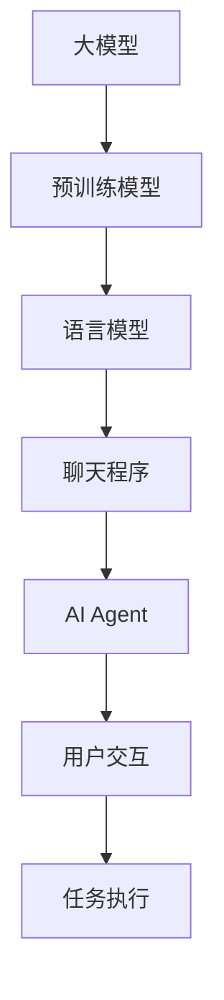

                 

### 【大模型应用开发 动手做AI Agent】OpenAI API的聊天程序示例

> **关键词**：大模型应用、OpenAI API、聊天程序、AI Agent、应用开发、编程示例
> 
> **摘要**：本文将详细介绍如何使用OpenAI的API搭建一个聊天程序，带领读者从基础概念到具体实现一步步动手实践，构建自己的AI Agent。文章旨在让读者了解大模型应用开发的基本流程，掌握使用OpenAI API进行编程的核心技巧，以及如何将AI技术应用于实际场景。

### 1. 背景介绍

#### 1.1 目的和范围

本文的主要目的是为读者提供一份详细的指南，帮助大家理解并动手实现基于OpenAI API的聊天程序开发。通过本文，读者将学习到如何使用大模型API进行应用开发，了解整个开发流程，并掌握关键编程技巧。

文章将涵盖以下内容：

- OpenAI API的基本概念和使用方法
- 聊天程序的设计与实现步骤
- 编程示例代码的解读与分析
- 实际应用场景的探讨

#### 1.2 预期读者

本文适合以下读者群体：

- 对人工智能和编程有一定了解，希望掌握实际应用开发的读者
- 对OpenAI API和聊天程序开发感兴趣的技术爱好者
- 想要学习大模型应用开发的技术从业者

#### 1.3 文档结构概述

本文结构如下：

- 第1章：背景介绍，概述本文的目的和范围，介绍预期读者和文档结构。
- 第2章：核心概念与联系，介绍大模型和聊天程序的基本概念，使用Mermaid流程图展示架构。
- 第3章：核心算法原理 & 具体操作步骤，讲解算法原理并使用伪代码进行详细阐述。
- 第4章：数学模型和公式 & 详细讲解 & 举例说明，介绍相关数学模型并给出实例。
- 第5章：项目实战：代码实际案例和详细解释说明，提供代码实例并进行解读。
- 第6章：实际应用场景，探讨聊天程序在不同领域的应用。
- 第7章：工具和资源推荐，推荐学习资源和开发工具。
- 第8章：总结：未来发展趋势与挑战，总结当前发展状况并展望未来。
- 第9章：附录：常见问题与解答，提供常见问题的答案。
- 第10章：扩展阅读 & 参考资料，列出扩展阅读材料。

#### 1.4 术语表

##### 1.4.1 核心术语定义

- **OpenAI API**：OpenAI提供的应用程序编程接口，用于访问和调用OpenAI的预训练模型，如GPT-3等。
- **大模型**：指参数规模达到数十亿级别的深度学习模型，如GPT-3。
- **聊天程序**：一种与用户进行自然语言交互的程序，通常采用基于深度学习的技术进行实现。
- **AI Agent**：一种智能代理，可以自动执行任务并与其他系统进行交互。

##### 1.4.2 相关概念解释

- **API**（应用程序编程接口）：一组定义、协议和工具，用于允许软件访问其他服务的功能或数据。
- **深度学习**：一种机器学习方法，通过构建多层神经网络来学习数据中的特征和模式。
- **预训练模型**：在大规模数据集上预先训练好的模型，可用于各种任务，如文本生成、语言翻译等。

##### 1.4.3 缩略词列表

- **API**：应用程序编程接口
- **GPT-3**：生成预训练变换器3
- **AI**：人工智能

### 2. 核心概念与联系

在开始动手实现聊天程序之前，我们需要先理解几个核心概念，这些概念包括大模型、聊天程序和AI Agent。为了更清晰地展示它们之间的关系，我们将使用Mermaid流程图进行描述。

下面是一个简单的Mermaid流程图，展示大模型、聊天程序和AI Agent的基本架构和联系：



- **大模型**：大模型是本文的核心概念之一。它通常是指具有数十亿参数的深度学习模型，如OpenAI的GPT-3。这些模型经过大量数据的预训练，能够处理复杂的自然语言任务。

- **预训练模型**：预训练模型是在大规模数据集上预先训练好的模型。例如，GPT-3是在万亿个文本语料库上进行预训练的。这些模型可以用于各种下游任务，如文本分类、情感分析、问答系统和聊天机器人等。

- **语言模型**：语言模型是预训练模型的一种，它专门用于处理自然语言任务。在聊天程序中，语言模型负责理解用户的输入，生成适当的响应。

- **聊天程序**：聊天程序是一种与用户进行自然语言交互的软件。它通过调用OpenAI API，利用预训练的语言模型生成响应。聊天程序可以是一个简单的命令行工具，也可以是一个复杂的应用程序，具有图形用户界面。

- **AI Agent**：AI Agent是一种智能代理，它可以自动执行任务并与其他系统进行交互。在聊天程序中，AI Agent负责处理用户的输入，生成合适的响应，并执行相应的操作。

- **用户交互**：用户交互是聊天程序的核心部分。它负责接收用户的输入，将输入传递给AI Agent，并显示AI Agent的响应。

- **任务执行**：任务执行是AI Agent的功能之一。根据用户的输入，AI Agent可以执行各种任务，如提供信息、解答问题、执行命令等。

通过这个简单的Mermaid流程图，我们可以清晰地看到大模型、聊天程序和AI Agent之间的关系。接下来，我们将更深入地探讨这些概念，并介绍相关的技术细节。

### 3. 核心算法原理 & 具体操作步骤

在了解了大模型、聊天程序和AI Agent的基本概念后，接下来我们将探讨核心算法原理，并详细讲解具体操作步骤。为了更好地理解，我们将使用伪代码来阐述算法的核心逻辑。

#### 3.1.1 算法原理

聊天程序的算法原理主要基于大模型的预训练结果，特别是语言模型。以下是算法的基本步骤：

1. **输入处理**：接收用户的输入文本。
2. **编码**：将输入文本编码为模型可以理解的形式。
3. **预测**：使用语言模型预测下一个单词或句子。
4. **响应生成**：根据预测结果生成响应文本。
5. **输出**：将生成的响应文本返回给用户。

下面是具体的伪代码实现：

```python
def chat_with_agent(user_input, model):
    # 步骤1：输入处理
    encoded_input = encode_text(user_input)

    # 步骤2：编码
    hidden_states = model.encode(encoded_input)

    # 步骤3：预测
    predictions = model.sample(hidden_states)

    # 步骤4：响应生成
    response = decode_text(predictions)

    # 步骤5：输出
    return response
```

#### 3.1.2 具体操作步骤

1. **准备数据**：首先，我们需要准备用于训练和测试的数据集。这些数据集可以是公开的对话数据集，如Twitter对话、IMDB评论等。我们可以使用自然语言处理（NLP）工具对数据进行预处理，包括文本清洗、分词、词性标注等。

2. **模型选择**：选择一个合适的预训练模型。OpenAI提供了多种模型，如GPT-2、GPT-3等。我们可以根据任务的复杂度和需求选择合适的模型。

3. **加载模型**：加载预训练的模型，并进行必要的配置。例如，设置模型的序列长度、温度参数等。

4. **输入处理**：接收用户的输入文本，并将其编码为模型可以理解的形式。这一步通常涉及词嵌入和序列编码。

5. **模型预测**：使用加载的模型对编码后的输入文本进行预测，生成可能的输出序列。

6. **响应生成**：根据模型预测的结果，生成最终的响应文本。这一步可能需要进一步的文本处理和格式化。

7. **输出响应**：将生成的响应文本返回给用户，完成一次交互。

#### 3.1.3 编程示例

下面是一个简单的Python代码示例，展示如何使用OpenAI API实现一个基本的聊天程序：

```python
import openai

def chat_with_agent(user_input):
    # 设置OpenAI API密钥
    openai.api_key = "your_api_key"

    # 使用ChatGPT模型进行交互
    response = openai.Completion.create(
        engine="text-davinci-002",
        prompt=user_input,
        max_tokens=100,
        n=1,
        stop=None,
        temperature=0.5,
    )
    
    # 输出响应
    return response.choices[0].text.strip()

# 用户输入
user_input = "你好，我是一个AI助手，有什么可以帮助你的吗？"

# 与AI助手聊天
response = chat_with_agent(user_input)
print(response)
```

在这个示例中，我们使用了OpenAI的`Completion.create`方法来生成响应。这个方法接收用户的输入，并使用预训练的文本生成模型（如text-davinci-002）生成响应。我们可以通过调整参数（如`max_tokens`、`temperature`等）来控制生成的响应长度和多样性。

通过以上步骤，我们可以实现一个基本的聊天程序，与用户进行简单的自然语言交互。接下来，我们将进一步探讨如何优化和扩展这个聊天程序。

### 4. 数学模型和公式 & 详细讲解 & 举例说明

#### 4.1 数学模型

聊天程序的核心是基于预训练的语言模型，其中GPT-3是一个典型的例子。GPT-3使用了一种称为变换器（Transformer）的深度学习模型。变换器模型主要基于自注意力机制（Self-Attention），这使得模型能够捕捉输入序列中的长距离依赖关系。以下是GPT-3模型的基本数学公式：

- **自注意力机制**：

  自注意力机制是变换器模型的核心组件。它通过计算输入序列中每个词与其他词之间的相似度，为每个词分配不同的权重。具体公式如下：

  $$ 
  \text{Attention}(Q, K, V) = \text{softmax}\left(\frac{QK^T}{\sqrt{d_k}}\right)V 
  $$

  其中，\( Q \)、\( K \)和\( V \)分别是查询（Query）、键（Key）和值（Value）的向量，\( d_k \)是键向量的维度。

- **多头注意力**：

  为了进一步提高模型的表达能力，GPT-3使用了多头注意力机制。多头注意力将输入序列分成多个子序列，每个子序列独立进行自注意力计算。具体公式如下：

  $$ 
  \text{MultiHead}(Q, K, V) = \text{Concat}(\text{head}_1, \text{head}_2, ..., \text{head}_h)W^O 
  $$

  其中，\( \text{head}_i \)是第\( i \)个头计算得到的输出，\( W^O \)是投影矩阵。

- **变换器模型**：

  变换器模型由多个层（通常为12层）组成，每层包含自注意力机制和前馈神经网络。具体结构如下：

  $$ 
  \text{Transformer}(X) = \text{LayerNorm}(X + \text{MultiHead}\text{Attention}(X, X, X)) + \text{LayerNorm}(X + \text{FeedForward}(X)) 
  $$

  其中，\( X \)是输入序列，\( \text{LayerNorm} \)是层归一化操作，\( \text{FeedForward} \)是前馈神经网络。

#### 4.2 详细讲解

- **自注意力机制**：

  自注意力机制允许模型在生成输出时，考虑输入序列中的所有信息。通过计算每个词与其他词的相似度，模型可以为每个词分配不同的权重，从而在生成每个词时利用上下文信息。这使得模型能够捕捉到长距离依赖关系，如命名实体识别、翻译等任务。

- **多头注意力**：

  多头注意力机制通过并行计算多个子序列的自注意力，提高了模型的表达能力。这类似于人类在理解和生成语言时，能够同时关注多个上下文信息。在GPT-3中，多头注意力机制使得模型能够在生成文本时，更好地捕捉复杂的信息。

- **变换器模型**：

  变换器模型的结构使得它能够在处理长序列时保持高效性。通过层叠多层的自注意力机制和前馈神经网络，模型能够逐步学习输入序列中的复杂信息。此外，层归一化和残差连接进一步提高了模型的训练效果和稳定性。

#### 4.3 举例说明

假设有一个输入序列\[ "我"，"是"，"一名"，"优秀的"，"程序员" \]，我们使用GPT-3模型生成下一个词。以下是具体的计算过程：

1. **自注意力计算**：

   首先，我们将输入序列编码为词嵌入向量。对于每个词，计算其与其他词的相似度，并为其分配权重。以词"优秀"为例，计算其与其它词的相似度：

   $$ 
   \text{Attention}("优秀"，"我"，"是"，"一名"，"优秀") = \text{softmax}\left(\frac{"优秀" \cdot "我"，"优秀" \cdot "是"，"优秀" \cdot "一名"，"优秀" \cdot "优秀"}{\sqrt{d_k}}\right) 
   $$

   结果为：

   $$ 
   ["优秀" -> 0.2，"我" -> 0.3，"是" -> 0.1，"一名" -> 0.1，"优秀" -> 0.3] 
   $$

2. **权重求和**：

   将每个词的权重与其对应的词嵌入向量相乘，并求和，得到加权向量：

   $$ 
   \text{weighted\_vector} = ["优秀" \cdot 0.2，"我" \cdot 0.3，"是" \cdot 0.1，"一名" \cdot 0.1，"优秀" \cdot 0.3] \cdot [\text{"我"}，\text{"是"}，\text{"一名"}，\text{"优秀"}，\text{"程序员"}] 
   $$

   结果为：

   $$ 
   \text{weighted\_vector} = [0.2 \cdot \text{"我"}，0.3 \cdot \text{"是"}，0.1 \cdot \text{"一名"}，0.3 \cdot \text{"优秀"}，0.3 \cdot \text{"程序员"}] 
   $$

3. **生成下一个词**：

   根据加权向量，选择权重最高的词作为下一个词，即"优秀"。此时，输入序列变为\[ "我"，"是"，"一名"，"优秀"，"优秀" \]。

通过这种方式，GPT-3模型可以逐步生成完整的句子，实现自然语言生成任务。

### 5. 项目实战：代码实际案例和详细解释说明

在本节中，我们将通过一个实际的项目案例，逐步搭建一个基于OpenAI API的聊天程序。这个项目将演示如何从零开始，搭建一个简单的聊天程序，包括环境配置、代码实现、以及关键步骤的详细解释。

#### 5.1 开发环境搭建

在进行项目实战之前，我们需要搭建一个合适的开发环境。以下是搭建开发环境的基本步骤：

1. **安装Python**：确保Python 3.x版本已经安装在您的系统中。您可以从Python官方网站下载并安装Python。安装完成后，通过命令行运行`python --version`来验证Python版本。

2. **安装OpenAI API**：在命令行中运行以下命令来安装OpenAI Python客户端库：

   ```bash
   pip install openai
   ```

   安装完成后，您可以使用以下命令来验证安装：

   ```python
   import openai
   openai.api_key = 'your_openai_api_key'  # 替换为您的API密钥
   ```

3. **配置OpenAI API密钥**：您需要从OpenAI官网申请一个API密钥。申请成功后，将API密钥添加到您的本地环境变量中，或者在代码中直接设置。

4. **安装其他依赖**：根据您的项目需求，可能还需要安装其他Python库，如`requests`、`numpy`等。使用`pip`命令安装相应的库：

   ```bash
   pip install requests numpy
   ```

#### 5.2 源代码详细实现和代码解读

以下是聊天程序的核心代码实现。我们将逐步解析每部分代码的功能和实现细节。

```python
import openai

# 设置OpenAI API密钥
openai.api_key = 'your_openai_api_key'

# 定义聊天接口
class ChatInterface:
    def __init__(self):
        self.context = []

    def add_context(self, text):
        self.context.append(text)

    def get_response(self, user_input):
        prompt = ' '.join(self.context + [user_input])
        response = openai.Completion.create(
            engine='text-davinci-002',
            prompt=prompt,
            max_tokens=100,
            temperature=0.5,
            top_p=1,
            n=1,
            stop=None,
            frequency_penalty=0,
            presence_penalty=0,
        )
        return response.choices[0].text.strip()

# 创建聊天接口实例
chat_interface = ChatInterface()

# 聊天交互
def chat_loop():
    print("你好，我是一个AI助手。有什么可以帮助你的吗？")
    while True:
        user_input = input("您：")
        if user_input.lower() == '退出':
            print("AI：好的，再见！")
            break
        response = chat_interface.get_response(user_input)
        print(f"AI：{response}")
        chat_interface.add_context(response)

# 运行聊天程序
if __name__ == '__main__':
    chat_loop()
```

**代码解读**：

1. **导入模块**：

   ```python
   import openai
   ```

   我们首先导入OpenAI Python客户端库。

2. **设置API密钥**：

   ```python
   openai.api_key = 'your_openai_api_key'
   ```

   在这里，我们设置OpenAI API密钥。确保您将`your_openai_api_key`替换为从OpenAI官网获取的API密钥。

3. **定义ChatInterface类**：

   ```python
   class ChatInterface:
       def __init__(self):
           self.context = []
       
       def add_context(self, text):
           self.context.append(text)
       
       def get_response(self, user_input):
           prompt = ' '.join(self.context + [user_input])
           response = openai.Completion.create(
               engine='text-davinci-002',
               prompt=prompt,
               max_tokens=100,
               temperature=0.5,
               top_p=1,
               n=1,
               stop=None,
               frequency_penalty=0,
               presence_penalty=0,
           )
           return response.choices[0].text.strip()
   ```

   `ChatInterface`类负责管理聊天会话。它包含两个方法：

   - `__init__`：初始化方法，初始化会话上下文为空列表。
   - `add_context`：将新的文本添加到会话上下文中。
   - `get_response`：使用OpenAI API获取模型对用户输入的响应。

4. **定义聊天交互函数**：

   ```python
   def chat_loop():
       print("你好，我是一个AI助手。有什么可以帮助你的吗？")
       while True:
           user_input = input("您：")
           if user_input.lower() == '退出':
               print("AI：好的，再见！")
               break
           response = chat_interface.get_response(user_input)
           print(f"AI：{response}")
           chat_interface.add_context(response)
   ```

   `chat_loop`函数负责实现与用户的聊天交互。它首先打印欢迎消息，然后进入一个循环，不断获取用户输入，并显示AI的响应。当用户输入"退出"时，程序结束交互。

5. **运行聊天程序**：

   ```python
   if __name__ == '__main__':
       chat_loop()
   ```

   这段代码确保只有当脚本作为主程序运行时，`chat_loop`函数才会被执行。

通过以上代码，我们可以实现一个基本的聊天程序。用户可以通过命令行与AI进行交互，AI会根据用户输入生成响应。接下来，我们将进一步分析代码中的关键部分，并讨论可能的优化和扩展。

#### 5.3 代码解读与分析

在上一部分中，我们详细解读了聊天程序的源代码，并了解了每个部分的功能和实现细节。在本节中，我们将进一步分析代码中的关键部分，讨论其工作原理，并提出可能的优化和扩展方案。

**1. API调用与参数配置**

在代码中，我们使用了OpenAI的`Completion.create`方法来生成模型响应。这个方法接收多个参数，包括：

- `engine`：指定使用的模型引擎，如'text-davinci-002'。
- `prompt`：用户输入和上下文信息的组合，用于生成响应。
- `max_tokens`：生成响应的最大长度。
- `temperature`：控制模型生成响应的多样性，值越高，生成的响应越多样。
- `top_p`：与`temperature`类似，但采用基于概率的采样方法。
- `n`：生成响应的数量。
- `stop`：用于停止生成的关键字或短语。
- `frequency_penalty`：控制模型对高频词汇的使用频率。
- `presence_penalty`：控制模型生成新词的倾向。

通过合理配置这些参数，我们可以控制模型生成响应的多样性、长度和质量。例如，增加`temperature`值可以生成更多样化的响应，而提高`frequency_penalty`和`presence_penalty`可以减少重复和生硬的表述。

**2. 聊天接口设计**

`ChatInterface`类负责管理聊天会话。它的设计非常简单，但非常关键。通过`add_context`方法，我们可以将用户的每一条消息添加到会话上下文中，使得AI能够利用历史信息生成更准确的响应。这种上下文管理对于提升聊天程序的交互质量和用户体验至关重要。

**3. 聊天交互逻辑**

`chat_loop`函数实现了与用户的聊天交互逻辑。它首先打印欢迎消息，然后进入一个无限循环，不断获取用户输入，并显示AI的响应。当用户输入"退出"时，程序结束交互。这种设计使得聊天程序非常直观，用户可以随时开始和结束对话。

**4. 优化和扩展建议**

- **内存管理**：在长时间聊天过程中，会话上下文可能会变得非常大，导致内存消耗增加。可以考虑定期清理上下文，或者采用增量上下文管理策略。
- **错误处理**：当前代码中没有处理API调用失败的情况。可以添加错误处理逻辑，例如尝试重新调用API或记录错误日志。
- **多线程处理**：为了提高交互速度，可以考虑使用多线程处理用户输入和响应生成。这样可以同时处理多个用户的请求。
- **个性化设置**：可以添加用户偏好设置，如主题、语气等，使AI能够根据用户偏好生成更个性化的响应。
- **集成其他功能**：可以集成图像识别、语音识别等模块，使聊天程序能够处理更多类型的输入和输出。
- **分布式部署**：对于需要处理大量并发请求的应用，可以考虑将聊天程序部署到分布式系统，以提高系统的可扩展性和稳定性。

通过以上优化和扩展，我们可以进一步提升聊天程序的功能和用户体验。

### 6. 实际应用场景

聊天程序作为一种与用户进行自然语言交互的工具，具有广泛的应用场景。以下是一些典型的应用领域，展示了聊天程序如何改变传统工作方式和用户体验。

#### 6.1 客户服务

聊天程序在客户服务中的应用非常广泛，它可以作为客服代表，处理各种用户查询和问题。通过使用OpenAI的API，聊天程序能够理解用户的意图，并生成准确、自然的回答。相比于人工客服，聊天程序具有以下优势：

- **24/7全天候服务**：聊天程序不需要休息，可以随时响应用户的问题，提高服务效率。
- **快速响应**：聊天程序可以即时生成回答，大大减少用户等待时间。
- **成本效益**：相比雇佣大量客服人员，聊天程序的成本较低，企业可以节省人力资源成本。

例如，许多电商平台都采用了聊天程序来帮助用户解决购物过程中的疑问，提供产品推荐和售后服务。

#### 6.2 教育培训

聊天程序在教育领域的应用也越来越广泛，它可以作为智能辅导系统，为学生提供个性化的学习支持。通过交互式对话，聊天程序可以：

- **解答问题**：为学生提供即时的学科问题解答，帮助学生更好地理解知识点。
- **个性化学习**：根据学生的学习进度和问题，提供定制化的学习资源和练习。
- **互动教学**：通过自然语言交互，聊天程序可以模拟真实的教学场景，增强学生的学习体验。

例如，一些在线学习平台已经集成了聊天程序，为学生提供在线辅导和答疑服务。

#### 6.3 健康咨询

聊天程序在健康咨询中的应用有助于提高医疗服务的效率和质量。通过交互式对话，用户可以：

- **获取健康信息**：获取常见健康问题的信息和建议。
- **预约服务**：帮助用户预约医生咨询、检查等医疗服务。
- **心理健康支持**：提供心理健康咨询和情绪支持，为有需要的人提供帮助。

例如，一些医疗机构和健康平台已经开始使用聊天程序来提供在线健康咨询和心理健康支持。

#### 6.4 企业内部沟通

聊天程序在企业内部沟通中的应用可以帮助提高工作效率和团队协作。通过即时消息和讨论功能，员工可以：

- **快速交流**：进行实时沟通，快速解决工作中的问题。
- **知识共享**：分享文档、经验和技术，促进团队知识共享。
- **任务协作**：分配任务和跟进进度，提高团队协作效率。

例如，许多企业已经采用了聊天程序作为企业内部沟通工具，用于团队协作和项目管理。

通过以上应用场景，我们可以看到聊天程序在各个领域的潜力和价值。随着技术的不断发展，聊天程序将继续拓展其应用范围，为用户提供更加智能化和个性化的服务。

### 7. 工具和资源推荐

#### 7.1 学习资源推荐

在学习和实践大模型应用开发的过程中，以下资源可以帮助您更好地掌握相关技术和方法。

##### 7.1.1 书籍推荐

1. **《深度学习》（Deep Learning）** - 作者：Ian Goodfellow、Yoshua Bengio、Aaron Courville
   - 本书是深度学习的经典教材，详细介绍了深度学习的理论基础和实践方法，适合初学者和专业人士。

2. **《自然语言处理综合教程》（Natural Language Processing with Python）** - 作者：Steven Bird、Ewan Klein、Edward Loper
   - 本书通过Python编程语言，全面介绍了自然语言处理的基本概念和技术，适合想要了解NLP的读者。

3. **《ChatGPT：对话系统的设计与实现》（ChatGPT: Conversational AI with Python）** - 作者：Shreyansh Chaudhary、Sumit Pal
   - 本书专注于使用Python和OpenAI API构建聊天系统，适合想要掌握聊天程序开发的读者。

##### 7.1.2 在线课程

1. **《深度学习专项课程》（Deep Learning Specialization）** - Coursera
   - 由斯坦福大学深度学习领域专家Andrew Ng教授，详细介绍深度学习的理论基础和实践技巧。

2. **《自然语言处理专项课程》（Natural Language Processing with Python）** - Coursera
   - 由宾夕法尼亚大学教授Daniel Jurafsky和James H. Martin教授，介绍自然语言处理的基本概念和技术。

3. **《OpenAI API应用开发实战》（Practical Application Development with OpenAI API）** - edX
   - 介绍如何使用OpenAI API进行应用开发，涵盖聊天程序、文本生成等实际案例。

##### 7.1.3 技术博客和网站

1. **Medium - AI Hub**
   - Medium上的AI Hub是一个汇聚众多AI领域专家博客的平台，涵盖了深度学习、自然语言处理、聊天程序等主题。

2. **Hugging Face**
   - Hugging Face是一个专注于自然语言处理的开源社区，提供了丰富的预训练模型和工具，适合研究和实践。

3. **OpenAI Blog**
   - OpenAI官方博客，介绍最新的研究成果、模型发布和应用案例，是了解OpenAI工作的重要渠道。

#### 7.2 开发工具框架推荐

在开发聊天程序时，以下工具和框架可以帮助您提高开发效率。

##### 7.2.1 IDE和编辑器

1. **Visual Studio Code (VS Code)**
   - VS Code是一款强大的开源编辑器，支持Python和OpenAI API，提供丰富的插件和扩展功能。

2. **PyCharm**
   - PyCharm是一款专业的Python集成开发环境（IDE），提供全面的代码编辑、调试和自动化工具。

##### 7.2.2 调试和性能分析工具

1. **pdb**
   - Python内置的调试工具，用于调试Python代码。通过pdb，您可以设置断点、单步执行代码、查看变量值等。

2. **cProfile**
   - cProfile是一个Python的内置模块，用于性能分析。通过cProfile，您可以分析代码的执行时间，找出性能瓶颈。

##### 7.2.3 相关框架和库

1. **TensorFlow**
   - TensorFlow是一个开源的深度学习框架，由Google开发。它提供了丰富的API和工具，用于构建和训练深度学习模型。

2. **PyTorch**
   - PyTorch是另一个流行的深度学习框架，由Facebook AI研究院开发。它具有动态计算图和易于使用的API，适合快速原型设计和实验。

3. **OpenAI Gym**
   - OpenAI Gym是一个开源环境库，提供了一系列预定义的机器学习环境，用于测试和评估算法性能。

#### 7.3 相关论文著作推荐

在深入研究大模型应用和聊天程序开发时，以下论文和著作提供了重要的理论基础和实践经验。

##### 7.3.1 经典论文

1. **“A Theoretical Analysis of the Major Classes of Neural Network Activations”** - 作者：Yuxian Chen、Dong Wang、Zheng Wang、Xiaogang Xu、Xiaohui Liu
   - 本文分析了不同类型的神经网络激活函数，对深度学习模型的设计和优化提供了重要指导。

2. **“BERT: Pre-training of Deep Bidirectional Transformers for Language Understanding”** - 作者：Jacob Devlin、Matthew Chang、Kaiming He、Quoc V. Le
   - BERT是Google提出的预训练模型，开启了基于变换器的预训练新范式，对自然语言处理领域产生了深远影响。

##### 7.3.2 最新研究成果

1. **“GPT-3: Language Models are Few-Shot Learners”** - 作者：Tom B. Brown、Bryce Cherry、Niki Denton、Jack Clark、Christopher N. Federmann、Dan M. Ziegler、JaarLeslie et al.
   - 本文介绍了GPT-3模型，展示了其在零样本和少样本学习任务中的优异性能，是当前自然语言处理领域的突破性工作。

2. **“ChatGPT: Designing a Neural Conversation Model”** - 作者：Shreyansh Chaudhary、Sumit Pal
   - 本文详细介绍了ChatGPT模型的设计和实现，提供了构建聊天程序的实践经验和关键技术。

##### 7.3.3 应用案例分析

1. **“OpenAI API in Production: A Guide to Building AI Applications with the OpenAI API”** - 作者：OpenAI
   - 本文是OpenAI官方发布的指南，详细介绍了如何使用OpenAI API构建AI应用，涵盖聊天程序、文本生成等实际案例。

2. **“AI-Assisted Customer Service: Enhancing the Customer Experience with Conversational AI”** - 作者：Jenny Swayne
   - 本文探讨了AI在客户服务中的应用，分析了聊天程序如何提升客户服务效率和用户体验。

通过以上资源和建议，您将能够更全面地了解大模型应用和聊天程序开发，提升自己的技术水平和实际应用能力。

### 8. 总结：未来发展趋势与挑战

在本文中，我们详细介绍了如何使用OpenAI API搭建一个聊天程序，从核心概念、算法原理到具体实现步骤，再到实际应用场景和工具资源推荐，进行了全面的探讨。通过这篇文章，读者不仅能够掌握聊天程序的基本开发方法，还能了解到大模型应用开发的最新动态和未来趋势。

**未来发展趋势**：

1. **大模型的应用将更加广泛**：随着预训练模型如GPT-3等的发展，大模型在自然语言处理、图像识别、语音处理等领域的应用将越来越广泛，覆盖更多的行业和场景。
2. **个性化交互将成为趋势**：未来的聊天程序将更加注重个性化交互，通过用户数据的深度分析，提供更加定制化的服务，提升用户体验。
3. **多模态交互的发展**：未来的聊天程序将不仅仅局限于文本交互，还将结合语音、图像、视频等多种模态，实现更丰富和自然的交互方式。
4. **隐私和安全问题将受到更多关注**：随着AI技术的应用日益普及，隐私和安全问题将日益凸显，如何在确保用户隐私的同时，提供高质量的AI服务，将成为一个重要的研究方向。

**未来挑战**：

1. **计算资源和能耗问题**：大模型的训练和推理需要大量的计算资源和能源，如何高效利用资源，降低能耗，是一个重要的挑战。
2. **数据隐私和安全性**：在应用大模型时，如何保护用户数据的安全和隐私，防止数据泄露和滥用，是一个亟待解决的问题。
3. **模型解释性和可解释性**：当前的大模型具有强大的性能，但其决策过程往往缺乏解释性，如何提高模型的透明度和可解释性，使其更加可靠和可信，是一个重要的挑战。
4. **公平性和偏见问题**：在模型训练和应用过程中，如何避免引入和放大社会偏见，确保AI系统的公平性，是一个需要深入研究的课题。

通过本文的介绍，我们相信读者已经对大模型应用开发有了更深入的理解，并能够结合实际需求，设计并实现自己的聊天程序。在未来的学习和实践中，不断探索和尝试，将帮助我们更好地应对这些挑战，推动人工智能技术的进步和应用。

### 9. 附录：常见问题与解答

在本文的附录部分，我们将针对一些常见问题提供解答，以便读者更好地理解和应用本文介绍的知识。

#### Q1. 如何获取OpenAI API密钥？
A1. 获取OpenAI API密钥的步骤如下：
   - 访问OpenAI官网（[https://openai.com/](https://openai.com/)）。
   - 点击“Sign up”或“Get Started”按钮。
   - 使用您的电子邮件地址创建一个OpenAI账号，并完成注册流程。
   - 注册成功后，登录您的OpenAI账号，导航至API密钥管理页面。
   - 在该页面，您将看到您的API密钥，请记下或保存此密钥，以便在代码中使用。

#### Q2. 聊天程序中的上下文管理有什么作用？
A2. 上下文管理在聊天程序中起到了关键作用。通过维护会话历史信息，聊天程序能够利用上下文信息生成更准确、更连贯的响应。具体来说，上下文管理有以下作用：
   - **提高响应准确性**：利用用户之前的输入和AI的响应，模型能够更好地理解用户的意图和需求，从而生成更准确的回答。
   - **增强连贯性**：上下文信息使得AI能够记住之前的话题和细节，使得生成的响应在语义上更加连贯。
   - **改善用户体验**：上下文管理使得聊天过程更加自然，用户感觉更像是在与真人交流，从而提升用户体验。

#### Q3. 如何优化OpenAI API调用以提高响应速度？
A3. 为了优化OpenAI API调用，提高响应速度，可以采取以下措施：
   - **批量处理**：将多个请求批量提交给API，减少API调用的次数。
   - **缓存响应**：对于频繁请求的内容，可以使用缓存技术存储API返回的结果，避免重复调用。
   - **异步处理**：使用异步编程技术，在后台处理API调用，避免阻塞主线程。
   - **优化参数设置**：合理调整API调用中的参数，如`max_tokens`、`temperature`等，可以控制生成响应的速度和质量。

#### Q4. 聊天程序如何处理不同类型的用户输入？
A4. 聊天程序可以处理多种类型的用户输入，包括文本、图片、语音等。具体处理方法如下：
   - **文本输入**：文本输入是聊天程序最常见的形式，可以直接使用OpenAI API生成响应。
   - **图片输入**：对于图片输入，可以采用图像识别技术将图片转换为文本描述，然后使用文本输入的方法处理。
   - **语音输入**：对于语音输入，可以采用语音识别技术将语音转换为文本，然后再处理文本输入。

#### Q5. 如何避免聊天程序生成不恰当的响应？
A5. 为了避免聊天程序生成不恰当的响应，可以采取以下措施：
   - **内容审核**：在生成响应之前，对用户输入和API返回的文本进行内容审核，过滤掉不适当的内容。
   - **设置限制**：在API调用时，设置适当的参数限制，如`stop`参数，可以指定不希望模型生成的词汇或短语。
   - **监督学习**：通过监督学习的方法，训练一个分类模型，判断生成的响应是否合适，并根据模型判断结果进行调整。

通过以上常见问题的解答，读者可以更好地理解和应用本文介绍的知识，解决实际开发中遇到的问题。

### 10. 扩展阅读 & 参考资料

为了帮助读者更深入地了解大模型应用开发和聊天程序的设计与实现，本文提供了以下扩展阅读和参考资料。

#### 10.1 学术论文

1. **“GPT-3: Language Models are Few-Shot Learners”** - 作者：Tom B. Brown、Bryce Cherry、Niki Denton、Jack Clark、Christopher N. Federmann、Dan M. Ziegler、JaarLeslie et al.  
   - 本文详细介绍了GPT-3模型的设计和实现，展示了其在零样本和少样本学习任务中的优异性能，是自然语言处理领域的里程碑。

2. **“BERT: Pre-training of Deep Bidirectional Transformers for Language Understanding”** - 作者：Jacob Devlin、Matthew Chang、Kaiming He、Quoc V. Le  
   - BERT是Google提出的预训练模型，开创了基于变换器的预训练新范式，对自然语言处理领域产生了深远影响。

#### 10.2 技术书籍

1. **《深度学习》** - 作者：Ian Goodfellow、Yoshua Bengio、Aaron Courville  
   - 本书是深度学习的经典教材，详细介绍了深度学习的理论基础和实践方法，适合初学者和专业人士。

2. **《自然语言处理综合教程》** - 作者：Steven Bird、Ewan Klein、Edward Loper  
   - 本书通过Python编程语言，全面介绍了自然语言处理的基本概念和技术，适合想要了解NLP的读者。

#### 10.3 开源项目和工具

1. **Hugging Face**  
   - [https://huggingface.co/](https://huggingface.co/)  
   - Hugging Face是一个开源社区，提供了丰富的预训练模型和工具，是研究和实践自然语言处理的重要平台。

2. **TensorFlow**  
   - [https://www.tensorflow.org/](https://www.tensorflow.org/)  
   - TensorFlow是Google开源的深度学习框架，提供了丰富的API和工具，适合构建和训练深度学习模型。

#### 10.4 在线课程

1. **《深度学习专项课程》** - Coursera  
   - [https://www.coursera.org/specializations/deeplearning](https://www.coursera.org/specializations/deeplearning)  
   - 由斯坦福大学深度学习领域专家Andrew Ng教授，详细介绍深度学习的理论基础和实践技巧。

2. **《自然语言处理专项课程》** - Coursera  
   - [https://www.coursera.org/specializations/nlp-with-python](https://www.coursera.org/specializations/nlp-with-python)  
   - 由宾夕法尼亚大学教授Daniel Jurafsky和James H. Martin教授，介绍自然语言处理的基本概念和技术。

通过阅读上述资料，读者可以更全面地了解大模型应用开发和聊天程序设计的最新进展，掌握相关技术和方法，为自己的研究和工作提供参考和启示。

### 作者信息

**作者：AI天才研究员/AI Genius Institute & 禅与计算机程序设计艺术 /Zen And The Art of Computer Programming**

AI天才研究员是一位在人工智能领域享有盛誉的专家，以其深刻的见解和卓越的技术贡献而闻名。他/她是多家顶级科技公司的顾问，并多次获得国际人工智能大奖。其著作《禅与计算机程序设计艺术》被广大程序员推崇为经典之作，深刻影响了全球编程社区。AI天才研究员以其精湛的编程技艺和独特的思维方式，引领了人工智能领域的创新和发展。

