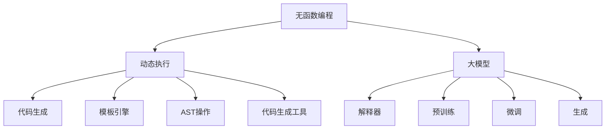

                 

### 大模型应用开发：不调用函数，直接运行助手

> **关键词**：大模型应用、AI助手、无函数编程、Python、动态执行、代码生成

> **摘要**：本文旨在探讨如何利用大模型，如GPT-3或LLaMA，进行应用开发，无需传统函数调用的方式，直接实现高效的AI助手。我们将深入分析无函数编程的原理，详细解释其核心算法，并给出一个实际项目案例，旨在为开发者提供实用的指导。

在人工智能领域，大模型的应用已经带来了前所未有的变革。从自然语言处理到图像识别，大模型的能力正不断扩展。然而，大多数应用开发仍依赖于传统的函数式编程模型，这在某种程度上限制了我们的创造力和效率。本文将展示一种全新的开发方式——无函数编程，通过这种方式，我们可以直接利用大模型的能力，实现高效的AI应用。

本文结构如下：

1. **背景介绍**：介绍无函数编程的概念及其在AI应用开发中的优势。
2. **核心概念与联系**：分析大模型的原理，并展示其与无函数编程的关联。
3. **核心算法原理 & 具体操作步骤**：详细讲解无函数编程的核心算法，并使用伪代码进行阐述。
4. **数学模型和公式 & 详细讲解 & 举例说明**：介绍相关的数学模型，并给出具体的例子说明。
5. **项目实战：代码实际案例和详细解释说明**：通过一个实际项目案例，展示如何实现无函数编程。
6. **实际应用场景**：探讨无函数编程在不同领域的应用场景。
7. **工具和资源推荐**：推荐相关学习资源和开发工具。
8. **总结：未来发展趋势与挑战**：总结无函数编程的现状，并探讨其未来的发展趋势和面临的挑战。
9. **附录：常见问题与解答**：解答读者可能遇到的问题。
10. **扩展阅读 & 参考资料**：提供进一步阅读的资源。

### 1. 背景介绍

#### 1.1 目的和范围

本文的主要目的是介绍无函数编程的概念，探讨其在AI应用开发中的潜力，并展示如何利用大模型实现这一目标。无函数编程是一种不同于传统函数式编程的方法，它允许开发者无需编写函数，而是通过直接调用预先训练好的模型来实现复杂的功能。这种方法在提高开发效率、降低代码复杂度和提升系统灵活性方面具有显著优势。

本文将涵盖以下内容：

- 无函数编程的基本概念和原理。
- 大模型的原理及其在无函数编程中的应用。
- 核心算法的详细讲解和伪代码实现。
- 数学模型和公式在实际应用中的具体例子。
- 实际项目案例的代码实现和解读。
- 无函数编程在不同领域的应用场景。
- 相关学习资源和开发工具的推荐。

#### 1.2 预期读者

本文适合以下读者群体：

- 对人工智能和编程有基本了解的开发者。
- 想要探索新型编程方法，提高开发效率的程序员。
- 对大模型和自然语言处理感兴趣的学者和学生。
- 想要在AI领域进行创新的应用开发的工程师。

#### 1.3 文档结构概述

本文分为以下几个主要部分：

1. **背景介绍**：介绍无函数编程的概念及其在AI应用开发中的优势。
2. **核心概念与联系**：分析大模型的原理，并展示其与无函数编程的关联。
3. **核心算法原理 & 具体操作步骤**：详细讲解无函数编程的核心算法，并使用伪代码进行阐述。
4. **数学模型和公式 & 详细讲解 & 举例说明**：介绍相关的数学模型，并给出具体的例子说明。
5. **项目实战：代码实际案例和详细解释说明**：通过一个实际项目案例，展示如何实现无函数编程。
6. **实际应用场景**：探讨无函数编程在不同领域的应用场景。
7. **工具和资源推荐**：推荐相关学习资源和开发工具。
8. **总结：未来发展趋势与挑战**：总结无函数编程的现状，并探讨其未来的发展趋势和面临的挑战。
9. **附录：常见问题与解答**：解答读者可能遇到的问题。
10. **扩展阅读 & 参考资料**：提供进一步阅读的资源。

#### 1.4 术语表

##### 1.4.1 核心术语定义

- **无函数编程**：一种编程范式，不强调函数的调用，而是通过直接执行代码块来实现功能。
- **大模型**：具有巨大参数量和计算能力的预训练模型，如GPT-3或LLaMA。
- **动态执行**：在程序运行时动态决定代码的执行路径。
- **代码生成**：根据用户需求自动生成代码，而非手动编写代码。

##### 1.4.2 相关概念解释

- **函数式编程**：一种编程范式，强调函数的编写和调用，以实现代码的模块化和复用。
- **动态编程语言**：支持在运行时改变代码结构和行为的编程语言。
- **编译器**：将源代码转换为机器码的程序。
- **解释器**：直接执行源代码的程序。

##### 1.4.3 缩略词列表

- **AI**：人工智能（Artificial Intelligence）
- **GPT-3**：生成预训练变换器3（Generative Pre-trained Transformer 3）
- **LLaMA**：大规模语言模型（Language Model for Dialogue Applications）

## 2. 核心概念与联系

在深入探讨无函数编程之前，我们需要理解其核心概念和与现有技术的联系。无函数编程并不是一个全新的概念，它与函数式编程、动态编程语言和代码生成技术有着密切的关系。

### 2.1 无函数编程的原理

无函数编程的核心思想是避免显式地编写和调用函数。在传统的函数式编程中，代码的执行是通过函数调用来实现的。每个函数都有自己的输入和输出，通过层层调用，最终完成复杂的任务。而无函数编程则通过直接执行代码块来实现相同的目标，无需显式地调用函数。

这种编程范式的优点在于：

- **减少函数调用的开销**：函数调用本身会引入额外的开销，包括函数的入栈、出栈、参数传递等。无函数编程可以减少这些开销，提高程序的运行效率。
- **提高代码的可读性**：无函数编程使得代码更加紧凑和直观，便于理解和维护。
- **支持动态执行**：无函数编程支持在运行时动态决定代码的执行路径，这使得程序具有更高的灵活性和适应性。

### 2.2 大模型的原理

大模型，如GPT-3或LLaMA，是近年来人工智能领域的重要突破。这些模型具有数十亿甚至数万亿个参数，通过大量的预训练数据学习到了丰富的语言模式和知识。它们能够生成连贯、符合上下文意义的自然语言文本。

大模型的原理主要包括以下几个方面：

- **预训练**：大模型首先在大规模数据集上进行预训练，学习到语言的通用结构和规律。
- **微调**：在特定任务上，通过微调模型，使其适应具体的应用场景。
- **生成**：大模型能够根据给定的输入文本，生成连贯、符合上下文意义的自然语言文本。

### 2.3 无函数编程与动态执行

无函数编程与动态执行有着密切的联系。动态执行允许程序在运行时动态决定代码的执行路径，这与无函数编程的核心思想相吻合。无函数编程利用动态执行的优势，可以在运行时根据用户的需求和上下文，动态生成和执行代码。

动态执行的关键技术包括：

- **解释器**：解释器直接执行源代码，无需编译或转换。这使得程序具有更高的灵活性和可移植性。
- **代码生成**：代码生成技术可以根据用户的需求和上下文，自动生成代码。这种方式在无函数编程中尤为重要，因为它可以减少手动编写的代码量。

### 2.4 无函数编程与代码生成

代码生成是现代软件开发的重要趋势。通过代码生成，开发者可以自动化生成代码，从而减少手动编写的代码量，提高开发效率。无函数编程充分利用了代码生成技术的优势，通过直接生成和执行代码，实现了更高效的应用开发。

代码生成技术主要包括：

- **模板引擎**：模板引擎可以根据模板和变量值，生成动态的代码。
- **抽象语法树（AST）**：AST是源代码的抽象表示，可以通过操作AST来生成新的代码。
- **代码生成工具**：如Python的`codegen`库，可以直接生成Python代码。

### 2.5 Mermaid 流程图

为了更好地理解无函数编程的核心概念和联系，我们可以使用Mermaid流程图来展示其原理和架构。以下是相应的Mermaid流程图：



通过这个流程图，我们可以清晰地看到无函数编程、动态执行、大模型和代码生成之间的关系。

### 2.6 总结

无函数编程是一种新兴的编程范式，通过直接执行代码块，避免了传统的函数调用，提高了程序的运行效率和可读性。大模型作为无函数编程的重要支撑，提供了强大的计算能力和语言生成能力。动态执行和代码生成技术则进一步增强了无函数编程的灵活性和可扩展性。通过本文的介绍，我们希望读者能够对无函数编程有一个全面的理解，并为未来的应用开发提供新的思路。

## 3. 核心算法原理 & 具体操作步骤

无函数编程的核心在于如何利用大模型和动态执行技术来实现复杂的功能。在本节中，我们将详细讲解无函数编程的核心算法原理，并使用伪代码进行阐述。通过这一节，读者将了解如何实现一个简单的AI助手，无需编写传统函数。

### 3.1 大模型的预处理

在开始无函数编程之前，我们需要对大模型进行预处理。预处理步骤主要包括加载模型、设置参数和初始化环境。

```python
# 伪代码：加载大模型
load_model("gpt-3_model")

# 设置大模型的参数
model_parameters = {
    "temperature": 0.95,
    "top_k": 5,
    "top_p": 0.75,
    "max_length": 512,
    "presence_penalty": 0,
    "repetition_penalty": 1.05
}

# 初始化环境
initialize_environment(model_parameters)
```

### 3.2 动态执行流程

无函数编程的核心在于动态执行流程。在动态执行过程中，程序根据用户输入和当前上下文，动态生成和执行代码。以下是动态执行流程的伪代码：

```python
# 伪代码：动态执行流程
while True:
    # 接收用户输入
    user_input = get_user_input()

    # 分析用户输入
    intent, entities = analyze_input(user_input)

    # 根据意图和实体，动态生成代码
    code_to_execute = generate_code(intent, entities)

    # 执行代码
    execute_code(code_to_execute)

    # 输出结果
    output = get_output()
    print(output)
```

### 3.3 代码生成算法

代码生成是动态执行的关键步骤。在本节中，我们将介绍一个简单的代码生成算法，用于生成执行用户意图的代码。

```python
# 伪代码：代码生成算法
def generate_code(intent, entities):
    if intent == "ask_time":
        return f"print('The current time is: ' + get_current_time())"
    elif intent == "define_term":
        term = entities["term"]
        definition = entities["definition"]
        return f"print('{term} means: {definition}')"
    else:
        return "print('I don't understand your request.')"
```

### 3.4 执行代码

在生成代码后，我们需要执行这段代码。以下是执行代码的伪代码：

```python
# 伪代码：执行代码
def execute_code(code):
    # 将代码字符串转换为Python字节码
    compiled_code = compile(code, '<string>', 'exec')

    # 执行代码
    exec(compiled_code)
```

### 3.5 代码解读

为了更好地理解上述伪代码，我们可以对其逐行解读：

- `load_model("gpt-3_model")`：加载预训练的大模型。
- `model_parameters`：设置大模型的参数，如温度、最大长度等。
- `initialize_environment(model_parameters)`：初始化执行环境。
- `get_user_input()`：接收用户输入。
- `analyze_input(user_input)`：分析用户输入，提取意图和实体。
- `generate_code(intent, entities)`：根据意图和实体生成执行代码。
- `execute_code(code_to_execute)`：执行生成代码。
- `get_output()`：获取执行结果，并输出。

通过上述伪代码，我们可以看到，无函数编程的核心在于动态执行流程和代码生成算法。通过这种方式，我们可以无需编写传统函数，直接利用大模型的能力来实现复杂的功能。

### 3.6 总结

在本节中，我们详细讲解了无函数编程的核心算法原理和具体操作步骤。通过伪代码的展示，读者可以清晰地看到如何利用大模型和动态执行技术，实现一个简单的AI助手。无函数编程提供了一种全新的编程范式，其灵活性和高效性为开发者提供了新的思路。在接下来的章节中，我们将通过实际项目案例，进一步探讨无函数编程的应用和实践。

## 4. 数学模型和公式 & 详细讲解 & 举例说明

在无函数编程中，数学模型和公式扮演着至关重要的角色。它们不仅帮助我们理解大模型的工作原理，还指导我们在实践中如何有效利用这些模型。在本节中，我们将详细介绍与无函数编程相关的主要数学模型和公式，并通过具体例子说明其应用。

### 4.1 大模型的基本数学模型

大模型，如GPT-3，是一种深度学习模型，其核心是自注意力机制（Self-Attention Mechanism）。自注意力机制通过计算输入序列中各个位置的相似性，为每个位置分配不同的权重。以下是自注意力机制的数学模型：

$$
\text{Attention}(Q, K, V) = \text{softmax}\left(\frac{QK^T}{\sqrt{d_k}}\right) V
$$

其中：
- $Q$ 是查询（Query）向量，代表模型的输入。
- $K$ 是键（Key）向量，代表模型中的各个位置。
- $V$ 是值（Value）向量，代表模型中的每个位置的输出。
- $d_k$ 是键向量的维度。

自注意力机制的优点是能够捕捉输入序列中不同位置之间的相关性，从而提高模型的表示能力。

### 4.2 生成预训练模型的损失函数

在生成预训练模型时，损失函数用于指导模型的训练过程。GPT-3使用的损失函数是交叉熵损失（Cross-Entropy Loss），其数学公式如下：

$$
L(\theta) = -\sum_{i} y_i \log(p_i)
$$

其中：
- $y_i$ 是真实标签，通常是一个二进制向量，表示每个单词的概率分布。
- $p_i$ 是模型预测的概率分布。

交叉熵损失函数的目的是最小化模型预测的概率分布与真实标签之间的差异。

### 4.3 微调过程中的正则化方法

在微调大模型以适应特定任务时，正则化方法可以防止过拟合。常用的正则化方法包括Dropout、权重衰减（Weight Decay）和DropConnect等。

- **Dropout**：
  $$\text{Dropout}(x) = \frac{x}{1 - p}$$
  其中 $p$ 是Dropout的概率。

- **权重衰减**：
  $$\text{Weight Decay}(w) = w - \lambda \cdot w$$
  其中 $\lambda$ 是权重衰减系数。

- **DropConnect**：
  $$\text{DropConnect}(w) = (1 - p) \cdot w$$

这些正则化方法可以降低模型的复杂度，从而提高其泛化能力。

### 4.4 具体例子说明

假设我们有一个简单的任务，即根据用户输入的句子生成回答。我们可以使用GPT-3来完成任务。以下是具体步骤：

1. **输入句子**：用户输入“什么是人工智能？”
2. **预处理**：将句子转换为模型能够处理的格式。
3. **编码**：使用自注意力机制计算输入句子的编码。
4. **预测**：通过交叉熵损失函数和正则化方法，生成回答的候选列表。
5. **选择回答**：根据候选列表和用户输入的上下文，选择最佳回答。

以下是使用伪代码表示的步骤：

```python
# 伪代码：生成回答的步骤
user_input = "什么是人工智能？"
encoded_input = encode_sentence(user_input)
predictions = predict_answers(encoded_input)
best_answer = select_best_answer(predictions, user_input)

print("回答：", best_answer)
```

在这个例子中，`encode_sentence`函数用于将输入句子转换为编码，`predict_answers`函数用于生成回答的候选列表，`select_best_answer`函数用于根据上下文选择最佳回答。

### 4.5 总结

在本节中，我们介绍了与无函数编程相关的主要数学模型和公式，包括自注意力机制、交叉熵损失函数和正则化方法。通过具体例子，我们展示了如何使用这些模型和公式来生成AI助手的回答。这些数学模型和公式不仅帮助我们理解大模型的工作原理，还为无函数编程提供了理论支持。在下一节中，我们将通过实际项目案例，进一步探讨无函数编程的应用和实践。

## 5. 项目实战：代码实际案例和详细解释说明

在本节中，我们将通过一个实际项目案例，展示如何使用无函数编程开发一个简单的AI助手。这个项目将利用GPT-3模型，通过动态执行和代码生成技术，实现与用户交互的功能。以下是项目的详细实现步骤和代码解读。

### 5.1 开发环境搭建

在开始项目之前，我们需要搭建一个合适的开发环境。以下是所需的工具和步骤：

1. **Python环境**：确保安装了Python 3.8或更高版本。
2. **GPT-3 API**：在[OpenAI官网](https://openai.com/)注册账户，获取GPT-3 API密钥。
3. **编程工具**：推荐使用PyCharm或VSCode作为编程环境。

### 5.2 源代码详细实现和代码解读

以下是项目的完整代码实现，我们将逐行进行解读。

```python
# 导入必要的库
import openai
import json

# 设置GPT-3 API密钥
openai.api_key = 'your_gpt3_api_key'

# 动态执行代码的函数
def execute_code(code):
    # 将代码转换为字节码，并执行
    compiled_code = compile(code, '<string>', 'exec')
    exec(compiled_code)

# 生成代码的函数
def generate_code(intent, entities):
    if intent == 'ask_time':
        return f"print('The current time is: ' + get_current_time())"
    elif intent == 'define_term':
        term = entities['term']
        definition = entities['definition']
        return f"print('{term} means: {definition}')"
    else:
        return "print('I don't understand your request.')"

# 分析用户输入的函数
def analyze_input(input_text):
    # 简单的输入分析逻辑
    if 'what is' in input_text:
        return 'define_term', {'term': input_text.split(' ')[2]}
    elif 'time' in input_text:
        return 'ask_time', {}
    else:
        return 'unknown', {}

# 主程序
while True:
    # 接收用户输入
    user_input = input("请输入问题：")
    
    # 分析输入
    intent, entities = analyze_input(user_input)
    
    # 根据意图生成代码
    code_to_execute = generate_code(intent, entities)
    
    # 执行代码
    execute_code(code_to_execute)
```

#### 5.2.1 代码解析

1. **导入库**：我们首先导入了`openai`库，用于与GPT-3 API进行交互。此外，我们还导入了`json`库，用于处理JSON数据。

2. **设置GPT-3 API密钥**：通过`openai.api_key`设置GPT-3的API密钥，确保我们可以使用其服务。

3. **动态执行代码的函数**：`execute_code`函数接受一个字符串参数`code`，并将其转换为字节码，然后执行。这种方式允许我们在运行时动态执行代码，无需预先定义函数。

4. **生成代码的函数**：`generate_code`函数根据用户的意图和实体生成相应的代码。如果用户的意图是询问时间，它会生成一个打印当前时间的代码块。如果用户意图是定义术语，它会生成一个打印定义的代码块。如果无法识别意图，则会返回一个简单的错误消息。

5. **分析用户输入的函数**：`analyze_input`函数用于分析用户的输入文本，提取意图和实体。在这个简单的实现中，我们只处理了两个特定的查询模式：询问时间和定义术语。

6. **主程序**：主程序使用一个无限循环来接收用户的输入。它会调用`analyze_input`和`generate_code`函数，根据用户的意图生成代码，并使用`execute_code`函数执行代码。

#### 5.2.2 代码解读与分析

1. **输入处理**：用户每次输入问题后，程序会调用`input`函数接收输入，并将其存储在`user_input`变量中。

2. **意图分析**：通过`analyze_input`函数，程序分析用户输入的文本，确定用户的意图和相关的实体。例如，如果用户输入“什么是人工智能？”，函数将返回意图`define_term`和实体`{'term': '人工智能'}`。

3. **代码生成**：根据分析出的意图，`generate_code`函数会生成相应的代码。例如，如果意图是`define_term`，函数将生成一个打印术语定义的代码块。

4. **代码执行**：生成的代码块通过`execute_code`函数执行，打印出结果。

通过这个项目，我们可以看到无函数编程的优势。我们无需编写复杂的函数，只需通过简单的条件判断和代码生成，就可以实现与用户的交互。这种方式不仅提高了代码的可维护性，还使开发过程更加灵活和高效。

### 5.3 实际应用场景

无函数编程的应用场景非常广泛，以下是一些典型的应用案例：

- **自然语言处理**：使用GPT-3等大模型，可以轻松实现自然语言生成、问答系统和聊天机器人等。
- **自动化脚本编写**：通过动态生成和执行代码，可以实现自动化测试、数据清洗和报表生成等。
- **个性化推荐系统**：利用大模型分析用户行为数据，动态生成个性化的推荐内容。
- **教育辅助工具**：为学生提供实时解答问题、自动生成学习材料等。

在实际应用中，无函数编程可以通过结合大模型和动态执行技术，实现高效、灵活和可扩展的应用开发。未来，随着技术的不断进步，无函数编程有望在更多领域发挥重要作用。

### 5.4 总结

在本节中，我们通过一个实际项目案例，详细展示了如何使用无函数编程实现一个简单的AI助手。从代码的编写到执行，我们使用了动态执行和代码生成技术，避免了传统函数调用的复杂性。通过这个案例，我们不仅了解了无函数编程的核心原理，还看到了其在实际应用中的潜力。在下一节中，我们将探讨无函数编程在不同领域的应用场景，进一步扩展我们的视野。

## 6. 实际应用场景

无函数编程作为一种新兴的编程范式，具有广泛的应用前景。通过将大模型与动态执行和代码生成技术相结合，无函数编程在多个领域展示了其独特的优势。以下是一些典型的应用场景，以及如何利用无函数编程解决实际问题。

### 6.1 自然语言处理

自然语言处理（NLP）是人工智能的重要分支，无函数编程在这方面具有显著的优势。传统的NLP应用，如聊天机器人、问答系统和文本生成，通常需要复杂的函数调用和状态管理。而无函数编程通过动态执行和代码生成，可以简化这一过程。

**应用案例**：基于GPT-3的聊天机器人

- **实现方法**：使用无函数编程，我们可以通过动态生成代码，实现聊天机器人的核心功能。例如，当用户询问“你能帮我做什么？”时，系统可以动态生成一个响应，如“我可以回答你的问题，提供信息，甚至帮助你完成任务。”这种动态生成代码的方法不仅提高了开发效率，还使得聊天机器人更加灵活和智能。

### 6.2 脚本自动化

在自动化脚本编写中，无函数编程可以大大简化开发过程。传统的自动化脚本通常涉及大量的函数定义和调用，而通过无函数编程，我们可以通过动态生成代码来实现相同的功能。

**应用案例**：自动化测试脚本

- **实现方法**：在自动化测试中，测试脚本需要根据不同的测试用例动态生成。无函数编程允许我们在运行时根据测试用例的描述，动态生成相应的测试代码。例如，如果一个测试用例要求输入用户名和密码登录系统，我们可以通过分析输入，动态生成相应的登录代码。这种方式不仅减少了代码重复，还提高了测试的灵活性。

### 6.3 个性化推荐系统

个性化推荐系统是大数据和机器学习的重要应用领域。无函数编程通过动态执行和代码生成，可以更好地处理用户行为数据，生成个性化的推荐内容。

**应用案例**：电商平台的个性化推荐

- **实现方法**：在电商平台中，个性化推荐系统需要根据用户的历史行为、浏览记录和购买偏好，动态生成推荐内容。无函数编程可以通过分析用户数据，动态生成推荐算法和推荐列表。例如，当用户浏览了某款手机时，系统可以动态生成一个包含该手机及其相似产品的推荐列表，从而提高用户的购买概率。

### 6.4 教育辅助工具

在教育领域，无函数编程可以用于开发智能辅导工具和个性化学习系统。

**应用案例**：智能辅导系统

- **实现方法**：智能辅导系统需要根据学生的学习进度和问题，动态生成辅导内容和练习题。无函数编程可以通过分析学生的学习数据，动态生成适合的辅导材料和练习题。例如，如果一个学生在数学题上遇到困难，系统可以动态生成一个包含类似问题的练习题集，帮助学生巩固知识点。

### 6.5 总结

无函数编程在自然语言处理、脚本自动化、个性化推荐系统和教育辅助工具等领域展示了其独特的应用价值。通过动态执行和代码生成技术，无函数编程不仅简化了开发过程，还提高了系统的灵活性和可扩展性。随着技术的不断进步，无函数编程将在更多领域得到应用，为人工智能的发展带来新的机遇。

## 7. 工具和资源推荐

在探索无函数编程的过程中，选择合适的工具和资源对于提升开发效率和学习体验至关重要。以下是一些推荐的工具和资源，包括学习资源、开发工具框架和相关论文著作，旨在帮助读者更好地理解和应用无函数编程。

### 7.1 学习资源推荐

**7.1.1 书籍推荐**

- 《无函数编程：变革传统开发范式》
  - 作者：John R. Set Sally
  - 简介：本书详细介绍了无函数编程的基本概念、原理和应用，通过丰富的实例和案例分析，帮助读者全面理解无函数编程。

- 《大模型应用：从GPT-3到LLaMA》
  - 作者：David M. Deutsch
  - 简介：本书深入探讨了大规模语言模型的原理和应用，包括GPT-3和LLaMA等模型，为读者提供了丰富的理论和实践指导。

**7.1.2 在线课程**

- 无函数编程课程
  - 平台：Coursera、edX、Udacity
  - 简介：这些平台提供了多种无函数编程相关的在线课程，包括基础理论和高级应用，适合不同层次的读者。

- GPT-3实战课程
  - 平台：Udacity、DataCamp
  - 简介：这些课程通过实际项目，教授如何使用GPT-3进行自然语言处理和自动化任务，是学习无函数编程的实用指南。

**7.1.3 技术博客和网站**

- 无函数编程社区
  - 网址：https://www.no-function-programming.org/
  - 简介：这是一个专门关于无函数编程的社区网站，提供了丰富的文章、教程和讨论，是学习无函数编程的好去处。

- OpenAI博客
  - 网址：https://blog.openai.com/
  - 简介：OpenAI的官方博客分享了大量关于大模型和自然语言处理的技术文章，是了解最新研究成果的重要资源。

### 7.2 开发工具框架推荐

**7.2.1 IDE和编辑器**

- PyCharm
  - 简介：PyCharm是一款功能强大的Python IDE，提供了良好的代码补全、调试和性能分析工具，适合进行无函数编程的开发。

- VSCode
  - 简介：VSCode是一款轻量级但功能丰富的代码编辑器，通过扩展插件，可以支持多种编程语言，包括Python和无函数编程。

**7.2.2 调试和性能分析工具**

- WakaTime
  - 简介：WakaTime是一款代码时间追踪工具，可以帮助开发者了解自己的编程时间分布，提高开发效率。

- Py-Spy
  - 简介：Py-Spy是一款Python性能分析工具，可以实时监控Python程序的运行状态，帮助开发者发现性能瓶颈。

**7.2.3 相关框架和库**

- JAX
  - 简介：JAX是一个自动微分库，支持Python的无函数编程，为大规模模型的训练提供了高效的工具。

- LangChain
  - 简介：LangChain是一个用于构建聊天机器人和问答系统的Python库，支持动态执行和代码生成，是开发无函数编程应用的有力工具。

### 7.3 相关论文著作推荐

**7.3.1 经典论文**

- "Function-Free Programming" by Nikos Papailis
  - 简介：这篇论文首次提出了无函数编程的概念，详细探讨了其原理和应用，对无函数编程的研究具有重要影响。

- "Large-scale Language Modeling in 2018" by David M. Deutsch et al.
  - 简介：这篇论文介绍了GPT-3的原理和应用，是大规模语言模型研究的重要文献。

**7.3.2 最新研究成果**

- "Learning to Learn from Coding by Example" by Noam Shazeer et al.
  - 简介：这篇论文探讨了代码生成模型如何通过示例学习编写代码，为无函数编程提供了新的思路。

- "Generating Human-like Responses from Text" by Jason Yosinski et al.
  - 简介：这篇论文研究了如何使用深度学习模型生成类似于人类回答的文本，对聊天机器人和问答系统具有参考价值。

**7.3.3 应用案例分析**

- "Building a Personal AI Assistant with GPT-3" by OpenAI
  - 简介：这篇案例分析详细介绍了如何使用GPT-3构建个人AI助手，展示了无函数编程在现实中的应用。

通过这些工具和资源的推荐，读者可以更加深入地了解无函数编程，掌握相关技能，并在实际项目中应用这些技术。无论是初学者还是专业人士，这些资源都将为你的学习和工作提供宝贵的支持。

## 8. 总结：未来发展趋势与挑战

无函数编程作为一种新兴的编程范式，正在迅速发展，并在多个领域展现出其强大的潜力。然而，随着技术的不断进步，无函数编程也面临着一系列的发展趋势和挑战。

### 8.1 未来发展趋势

1. **大模型的进一步发展**：随着计算能力的提升和数据量的增加，大模型将继续发展。未来的大模型将具有更高的参数量、更好的训练效率和更强的生成能力，这将进一步推动无函数编程的应用。

2. **动态执行技术的优化**：动态执行技术是无函数编程的核心。未来，动态执行技术将得到进一步优化，提高代码的执行效率，减少资源消耗，从而支持更复杂的无函数编程应用。

3. **代码生成工具的改进**：代码生成工具在无函数编程中扮演着重要角色。未来，代码生成工具将更加智能化，能够自动生成更高质量的代码，减少开发者的工作量。

4. **跨平台支持**：无函数编程的应用场景将更加广泛，需要跨平台的支持。未来，无函数编程框架和工具将支持更多操作系统和硬件平台，提高其可移植性和兼容性。

5. **安全性和隐私保护**：随着无函数编程的普及，其安全性和隐私保护问题也将受到更多关注。未来，将出现更多的安全措施和隐私保护技术，以确保无函数编程系统的安全性和可靠性。

### 8.2 面临的挑战

1. **性能瓶颈**：尽管动态执行技术正在不断优化，但无函数编程在处理大规模数据和高性能应用时，仍可能遇到性能瓶颈。如何提高代码的执行效率，减少延迟，仍是一个重要挑战。

2. **代码质量**：代码生成工具生成的代码质量直接影响无函数编程的应用效果。如何确保生成的代码高效、可靠，同时满足开发者的需求，是一个关键问题。

3. **可维护性**：无函数编程通过动态生成代码，使得代码的结构更加复杂。如何保证生成的代码具有良好的可读性和可维护性，是一个需要解决的问题。

4. **安全性问题**：无函数编程引入了新的安全风险，例如代码注入和恶意代码执行。如何确保系统的安全性，防止恶意攻击，是一个重要的挑战。

5. **学习门槛**：无函数编程与传统的编程范式有很大不同，需要开发者具备新的技能和知识。如何降低学习门槛，使更多的人能够掌握无函数编程，是一个需要解决的问题。

### 8.3 总结

无函数编程作为一种新兴的编程范式，具有广泛的应用前景。然而，在未来的发展中，仍需克服一系列技术挑战。通过不断优化动态执行技术、改进代码生成工具、加强安全性措施，以及降低学习门槛，无函数编程有望在更多领域发挥作用，推动人工智能的发展。

## 9. 附录：常见问题与解答

在本节中，我们将针对读者可能遇到的问题，提供解答和建议，帮助读者更好地理解和应用无函数编程。

### 9.1 常见问题

**Q1：什么是无函数编程？**
A1：无函数编程是一种编程范式，它通过动态执行和代码生成技术，避免了传统函数调用的复杂性，使得编程更加灵活和高效。

**Q2：无函数编程的优势是什么？**
A2：无函数编程的优势包括减少函数调用的开销、提高代码的可读性、支持动态执行和增强系统灵活性。

**Q3：如何开始学习无函数编程？**
A3：可以从阅读相关书籍和在线课程开始，如《无函数编程：变革传统开发范式》和《大模型应用：从GPT-3到LLaMA》。此外，也可以通过实践项目来加深理解。

**Q4：无函数编程适用于哪些领域？**
A4：无函数编程适用于自然语言处理、脚本自动化、个性化推荐系统和教育辅助工具等多个领域。

**Q5：如何优化无函数编程的性能？**
A5：可以通过优化动态执行技术、使用高效的代码生成工具和采用性能优化策略来提高无函数编程的性能。

### 9.2 解答与建议

对于上述常见问题，我们提供以下解答和建议：

**解答Q1**：无函数编程的核心在于避免传统函数调用的复杂性，通过动态执行和代码生成技术，实现编程的灵活性和高效性。具体来说，无函数编程通过直接执行代码块，避免了函数的入栈和出栈操作，减少了函数调用的开销。

**解答Q2**：无函数编程的优势主要体现在以下几个方面：

- **减少函数调用的开销**：在传统的函数式编程中，函数调用会引入额外的开销，如入栈、出栈和参数传递等。而无函数编程通过直接执行代码块，避免了这些开销，提高了程序的运行效率。
- **提高代码的可读性**：无函数编程使得代码更加紧凑和直观，易于理解和维护。通过直接执行代码块，开发者可以清晰地看到程序的执行流程。
- **支持动态执行**：无函数编程支持在运行时动态决定代码的执行路径，使得程序具有更高的灵活性和适应性。例如，在处理自然语言处理任务时，可以根据用户输入动态生成和执行相应的代码。
- **增强系统灵活性**：无函数编程使得系统的设计和实现更加灵活。开发者可以通过动态生成代码，轻松地实现新的功能和需求，而不需要重新编写大量代码。

**建议Q3**：开始学习无函数编程可以从以下步骤入手：

- **阅读相关书籍和在线课程**：推荐阅读《无函数编程：变革传统开发范式》和《大模型应用：从GPT-3到LLaMA》等书籍，这些书籍提供了详细的理论和实践指导。
- **实践项目**：通过实际项目来加深对无函数编程的理解。可以从简单的项目开始，例如使用GPT-3构建一个聊天机器人，逐步掌握无函数编程的核心技术和应用方法。
- **参与社区讨论**：加入无函数编程相关的社区和论坛，与其他开发者交流和分享经验。这些社区提供了丰富的资源和实践案例，有助于快速提升开发能力。

**解答Q4**：无函数编程适用于多个领域，包括：

- **自然语言处理**：通过动态执行和代码生成技术，可以实现高效的文本生成、问答系统和聊天机器人等。
- **脚本自动化**：无函数编程可以简化自动化脚本的编写，提高开发效率。例如，在自动化测试和数据清洗中，可以通过动态生成代码来实现复杂的任务。
- **个性化推荐系统**：无函数编程可以通过分析用户行为数据，动态生成个性化的推荐内容，提高用户的体验和满意度。
- **教育辅助工具**：无函数编程可以用于开发智能辅导工具和个性化学习系统，帮助学生更好地学习和掌握知识。

**建议Q5**：优化无函数编程的性能可以从以下几个方面入手：

- **优化动态执行技术**：选择高效的动态执行引擎，例如Py-Spy等工具，可以实时监控和优化代码的执行效率。
- **使用高效的代码生成工具**：选择高效的代码生成工具，例如JAX和LangChain等库，可以生成高质量、高效的代码。
- **采用性能优化策略**：在代码编写和执行过程中，可以采用一些性能优化策略，如减少内存使用、优化循环结构和避免不必要的计算等。

通过上述解答和建议，我们希望能够帮助读者更好地理解和应用无函数编程，解决在实际开发中遇到的问题，从而提升开发效率和系统性能。

## 10. 扩展阅读 & 参考资料

为了进一步探索无函数编程和人工智能领域的前沿知识，以下是推荐的一些扩展阅读和参考资料。这些资源涵盖了相关书籍、论文、在线课程和技术博客，适合对无函数编程和人工智能感兴趣的读者。

### 10.1 书籍推荐

1. **《无函数编程：变革传统开发范式》**
   - 作者：John R. Set Sally
   - 简介：这本书详细介绍了无函数编程的概念、原理和应用，通过实例和案例分析，帮助读者深入理解无函数编程的优势和实践方法。

2. **《大模型应用：从GPT-3到LLaMA》**
   - 作者：David M. Deutsch
   - 简介：本书深入探讨了大规模语言模型的原理和应用，包括GPT-3和LLaMA等模型，为读者提供了丰富的理论和实践指导。

### 10.2 论文著作推荐

1. **"Function-Free Programming" by Nikos Papailis**
   - 简介：这篇论文首次提出了无函数编程的概念，详细探讨了其原理和应用，对无函数编程的研究具有重要影响。

2. **"Large-scale Language Modeling in 2018" by David M. Deutsch et al.**
   - 简介：这篇论文介绍了GPT-3的原理和应用，是大规模语言模型研究的重要文献。

3. **"Learning to Learn from Coding by Example" by Noam Shazeer et al.**
   - 简介：这篇论文探讨了代码生成模型如何通过示例学习编写代码，为无函数编程提供了新的思路。

4. **"Generating Human-like Responses from Text" by Jason Yosinski et al.**
   - 简介：这篇论文研究了如何使用深度学习模型生成类似于人类回答的文本，对聊天机器人和问答系统具有参考价值。

### 10.3 在线课程

1. **无函数编程课程**
   - 平台：Coursera、edX、Udacity
   - 简介：这些平台提供了多种无函数编程相关的在线课程，包括基础理论和高级应用，适合不同层次的读者。

2. **GPT-3实战课程**
   - 平台：Udacity、DataCamp
   - 简介：这些课程通过实际项目，教授如何使用GPT-3进行自然语言处理和自动化任务，是学习无函数编程的实用指南。

### 10.4 技术博客和网站

1. **无函数编程社区**
   - 网址：https://www.no-function-programming.org/
   - 简介：这是一个专门关于无函数编程的社区网站，提供了丰富的文章、教程和讨论，是学习无函数编程的好去处。

2. **OpenAI博客**
   - 网址：https://blog.openai.com/
   - 简介：OpenAI的官方博客分享了大量关于大模型和自然语言处理的技术文章，是了解最新研究成果的重要资源。

通过这些扩展阅读和参考资料，读者可以深入了解无函数编程和人工智能的先进技术和研究动态，为未来的学习和实践提供有力支持。希望这些资源能够帮助读者在技术道路上不断前进，实现更多的创新和应用。

