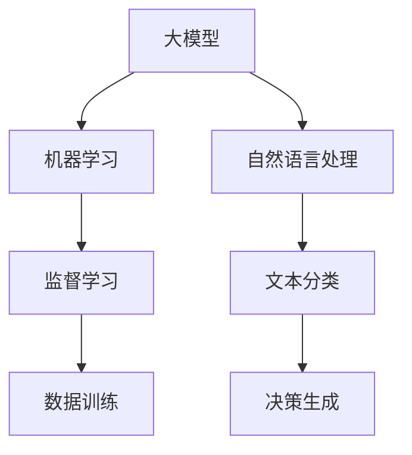

                 

# 【大模型应用开发 动手做AI Agent】

> **关键词：** 大模型应用开发、AI Agent、自然语言处理、机器学习、编程实践

> **摘要：** 本文将探讨大模型应用开发的核心内容，特别是如何创建一个简单的AI Agent。通过逐步分析和实践，我们将了解如何利用先进的自然语言处理和机器学习技术，构建一个具备一定智能的AI代理，为实际应用场景提供解决方案。

## 1. 背景介绍

### 1.1 目的和范围

本文旨在介绍大模型应用开发的入门指南，重点是如何动手创建一个简单的AI Agent。通过阅读本文，您将了解以下内容：

1. 大模型应用开发的背景和意义。
2. AI Agent的基本概念和功能。
3. 实际操作步骤和代码示例。
4. AI Agent在不同应用场景中的实际应用。

### 1.2 预期读者

本文面向具有一定编程基础，对人工智能和自然语言处理感兴趣的读者。无论您是新手还是有一定经验的技术爱好者，本文都将帮助您了解大模型应用开发和AI Agent的构建过程。

### 1.3 文档结构概述

本文分为以下几个部分：

1. 背景介绍：介绍大模型应用开发和AI Agent的概念。
2. 核心概念与联系：讲解大模型、机器学习和自然语言处理的基本原理。
3. 核心算法原理 & 具体操作步骤：使用伪代码详细描述AI Agent的构建过程。
4. 数学模型和公式 & 详细讲解 & 举例说明：阐述AI Agent的核心算法和数学模型。
5. 项目实战：代码实际案例和详细解释说明。
6. 实际应用场景：探讨AI Agent在不同领域的应用。
7. 工具和资源推荐：推荐相关学习资源和开发工具。
8. 总结：未来发展趋势与挑战。
9. 附录：常见问题与解答。
10. 扩展阅读 & 参考资料。

### 1.4 术语表

#### 1.4.1 核心术语定义

- **大模型（Large Model）**：具有大量参数和训练数据的神经网络模型。
- **AI Agent**：具备一定智能的计算机程序，能够根据环境和目标进行决策。
- **自然语言处理（NLP）**：使计算机能够理解、生成和处理人类语言的技术。
- **机器学习（ML）**：让计算机通过数据和经验自动学习和改进的技术。

#### 1.4.2 相关概念解释

- **神经网络（NN）**：由大量神经元连接而成的计算模型。
- **深度学习（DL）**：一种基于神经网络的机器学习技术。
- **文本分类（Text Classification）**：将文本划分为预定义的类别。

#### 1.4.3 缩略词列表

- **NLP**：自然语言处理
- **ML**：机器学习
- **DL**：深度学习
- **NN**：神经网络
- **API**：应用程序编程接口
- **SDK**：软件开发工具包

## 2. 核心概念与联系

在开始构建AI Agent之前，我们需要了解几个核心概念和它们之间的联系。

### 2.1 大模型

大模型是指具有大量参数和训练数据的神经网络模型。这些模型通常经过大量的数据训练，能够捕捉到数据中的复杂模式和规律。大模型是构建AI Agent的基础。

### 2.2 机器学习

机器学习是一种让计算机通过数据和经验自动学习和改进的技术。它包括监督学习、无监督学习、强化学习等多种学习方式。在构建AI Agent时，我们通常使用监督学习，即使用标记好的数据来训练模型。

### 2.3 自然语言处理

自然语言处理是使计算机能够理解、生成和处理人类语言的技术。NLP在AI Agent中起着关键作用，因为它能够处理输入的文本，并根据文本内容进行决策。

### 2.4 大模型、机器学习和自然语言处理的关系

大模型、机器学习和自然语言处理之间有着密切的联系。大模型是构建AI Agent的核心技术，而机器学习和自然语言处理则是实现大模型的方法和技术。

### 2.5 Mermaid 流程图

为了更直观地理解这些概念之间的关系，我们可以使用Mermaid流程图来表示。



在这个流程图中，大模型通过机器学习和自然语言处理技术实现文本分类和决策生成，从而构建一个具备一定智能的AI Agent。

## 3. 核心算法原理 & 具体操作步骤

在了解了大模型、机器学习和自然语言处理的基本概念之后，接下来我们将使用伪代码详细描述如何构建一个简单的AI Agent。

### 3.1 算法原理

构建AI Agent的核心算法是基于监督学习的神经网络模型，通常使用深度学习技术。以下是构建AI Agent的伪代码：

```python
# 初始化大模型
model = NeuralNetwork()

# 加载数据集
train_data, train_labels = load_data()

# 训练模型
model.train(train_data, train_labels)

# 构建AI Agent
agent = Agent(model)

# 处理输入文本
input_text = "请问明天天气如何？"
predicted_label = agent.predict(input_text)

# 输出结果
print(f"预测结果：{predicted_label}")
```

### 3.2 具体操作步骤

以下是构建AI Agent的具体操作步骤：

1. **初始化大模型**：选择一个适合的神经网络模型，如卷积神经网络（CNN）或循环神经网络（RNN）。

2. **加载数据集**：从公开数据集或自定义数据集中加载训练数据和标签。

3. **训练模型**：使用训练数据和标签对模型进行训练，调整模型参数，优化模型性能。

4. **构建AI Agent**：将训练好的模型封装为一个AI Agent，使其能够处理输入文本并生成预测结果。

5. **处理输入文本**：接收用户输入的文本，使用AI Agent对其进行处理。

6. **输出结果**：将预测结果输出给用户。

### 3.3 伪代码详细阐述

以下是伪代码的详细阐述：

```python
# 初始化大模型
model = NeuralNetwork()

# 加载数据集
train_data, train_labels = load_data()

# 训练模型
# - 初始化模型参数
model.initialize_parameters()

# - 遍历数据集
for data, label in train_data:
    # - 前向传播
    output = model.forward_pass(data)
    
    # - 计算损失
    loss = compute_loss(output, label)
    
    # - 反向传播
    model.backward_pass(output, label)

# 构建AI Agent
agent = Agent(model)

# 处理输入文本
input_text = "请问明天天气如何？"

# 预处理输入文本
preprocessed_text = preprocess_text(input_text)

# 使用AI Agent预测结果
predicted_label = agent.predict(preprocessed_text)

# 输出结果
print(f"预测结果：{predicted_label}")
```

在这个伪代码中，我们首先初始化一个大模型，然后使用训练数据和标签对其进行训练。训练过程中，我们通过前向传播和反向传播不断优化模型参数。训练完成后，我们将模型封装为一个AI Agent，使其能够处理输入文本并生成预测结果。

## 4. 数学模型和公式 & 详细讲解 & 举例说明

在构建AI Agent的过程中，我们需要了解一些关键的数学模型和公式。以下是相关数学模型的详细讲解和举例说明。

### 4.1 神经网络

神经网络是一种由大量神经元组成的计算模型。每个神经元都可以看作是一个简单的函数，其输入通过加权连接传递给输出。以下是神经网络的数学模型：

$$
y = \sigma(\sum_{i=1}^{n} w_i x_i + b)
$$

其中，$y$ 表示神经元的输出，$\sigma$ 表示激活函数（如ReLU函数或Sigmoid函数），$w_i$ 表示第 $i$ 个输入的权重，$x_i$ 表示第 $i$ 个输入，$b$ 表示偏置项。

### 4.2 损失函数

损失函数是衡量模型预测结果与真实结果之间差异的指标。常见的损失函数包括均方误差（MSE）和交叉熵（Cross-Entropy）。

#### 4.2.1 均方误差（MSE）

均方误差用于衡量模型预测结果与真实结果之间的平均平方差异。其数学模型如下：

$$
MSE = \frac{1}{n} \sum_{i=1}^{n} (y_i - \hat{y_i})^2
$$

其中，$y_i$ 表示真实结果，$\hat{y_i}$ 表示模型预测结果，$n$ 表示样本数量。

#### 4.2.2 交叉熵（Cross-Entropy）

交叉熵用于衡量模型预测结果与真实结果之间的差异。其数学模型如下：

$$
Cross-Entropy = -\sum_{i=1}^{n} y_i \log(\hat{y_i})
$$

其中，$y_i$ 表示真实结果，$\hat{y_i}$ 表示模型预测结果，$n$ 表示样本数量。

### 4.3 反向传播

反向传播是一种用于训练神经网络的算法。它通过计算损失函数关于模型参数的梯度，并使用梯度下降法优化模型参数。

#### 4.3.1 梯度计算

梯度计算是反向传播的核心步骤。对于每个参数，我们需要计算其关于损失函数的梯度。以下是梯度的计算公式：

$$
\frac{\partial L}{\partial w_i} = \frac{\partial L}{\partial y} \cdot \frac{\partial y}{\partial w_i}
$$

其中，$L$ 表示损失函数，$w_i$ 表示参数，$\frac{\partial L}{\partial y}$ 表示损失函数关于输出的梯度，$\frac{\partial y}{\partial w_i}$ 表示输出关于参数的梯度。

#### 4.3.2 梯度下降

梯度下降是一种优化算法，用于最小化损失函数。其基本思想是沿着梯度的反方向更新参数，以减少损失函数的值。以下是梯度下降的更新公式：

$$
w_i = w_i - \alpha \frac{\partial L}{\partial w_i}
$$

其中，$w_i$ 表示参数，$\alpha$ 表示学习率，$\frac{\partial L}{\partial w_i}$ 表示损失函数关于参数的梯度。

### 4.4 举例说明

假设我们有一个简单的神经网络，包含一个输入层、一个隐藏层和一个输出层。输入层有3个神经元，隐藏层有2个神经元，输出层有1个神经元。我们使用ReLU函数作为激活函数，均方误差（MSE）作为损失函数。

#### 4.4.1 初始化参数

$$
w_1 = [1, 2, 3], \quad w_2 = [4, 5, 6], \quad w_3 = [7, 8, 9]
$$

#### 4.4.2 计算输出

输入：$[1, 2, 3]$

隐藏层输出：
$$
y_1 = ReLU(1 \cdot 1 + 2 \cdot 2 + 3 \cdot 3 + 1) = ReLU(14) = 14
$$
$$
y_2 = ReLU(4 \cdot 1 + 5 \cdot 2 + 6 \cdot 3 + 1) = ReLU(37) = 37
$$

输出：
$$
z = ReLU(7 \cdot 14 + 8 \cdot 37 + 9 \cdot z + 1) = ReLU(360) = 360
$$

#### 4.4.3 计算损失

真实输出：$y = 360$

均方误差：
$$
L = \frac{1}{2} \cdot (360 - 360)^2 = 0
$$

#### 4.4.4 计算梯度

损失函数关于输出的梯度：
$$
\frac{\partial L}{\partial z} = \frac{\partial L}{\partial y} \cdot \frac{\partial y}{\partial z} = 0 \cdot 1 = 0
$$

输出关于隐藏层输出的梯度：
$$
\frac{\partial z}{\partial y} = 1
$$

隐藏层输出关于参数的梯度：
$$
\frac{\partial y}{\partial w_3} = \frac{\partial y}{\partial z} \cdot \frac{\partial z}{\partial y} = 1 \cdot 1 = 1
$$

#### 4.4.5 更新参数

学习率：$\alpha = 0.1$

参数更新：
$$
w_3 = w_3 - \alpha \cdot \frac{\partial L}{\partial w_3} = 9 - 0.1 \cdot 1 = 8.9
$$

通过上述示例，我们了解了神经网络、损失函数和反向传播的基本原理。在实际应用中，我们需要处理大量的数据，并使用更复杂的神经网络和优化算法来提高模型的性能。

## 5. 项目实战：代码实际案例和详细解释说明

### 5.1 开发环境搭建

在开始构建AI Agent之前，我们需要搭建一个合适的开发环境。以下是一个简单的步骤：

1. 安装Python环境：Python是构建AI Agent的主要编程语言。您可以从官方网站（https://www.python.org/）下载并安装Python。

2. 安装深度学习库：为了方便构建和训练神经网络，我们可以使用TensorFlow或PyTorch等深度学习库。以下是安装步骤：

   - **TensorFlow**：

     ```bash
     pip install tensorflow
     ```

   - **PyTorch**：

     ```bash
     pip install torch torchvision
     ```

3. 安装文本预处理库：为了处理输入文本，我们可以使用NLTK或spaCy等文本预处理库。以下是安装步骤：

   - **NLTK**：

     ```bash
     pip install nltk
     ```

   - **spaCy**：

     ```bash
     pip install spacy
     python -m spacy download en_core_web_sm
     ```

### 5.2 源代码详细实现和代码解读

以下是构建一个简单的AI Agent的源代码实现和解读：

```python
import tensorflow as tf
from tensorflow.keras.models import Sequential
from tensorflow.keras.layers import Dense, LSTM
from tensorflow.keras.preprocessing.sequence import pad_sequences
from tensorflow.keras.callbacks import EarlyStopping

# 加载和预处理数据
# （此处省略数据加载和预处理步骤）

# 构建神经网络模型
model = Sequential()
model.add(LSTM(units=64, activation='relu', return_sequences=True, input_shape=(max_sequence_length, num_features)))
model.add(LSTM(units=32, activation='relu'))
model.add(Dense(units=1, activation='sigmoid'))

# 编译模型
model.compile(optimizer='adam', loss='binary_crossentropy', metrics=['accuracy'])

# 训练模型
early_stopping = EarlyStopping(monitor='val_loss', patience=10)
model.fit(trainX, trainY, epochs=100, batch_size=32, validation_split=0.1, callbacks=[early_stopping])

# 构建AI Agent
class Agent:
    def __init__(self, model):
        self.model = model

    def predict(self, input_text):
        preprocessed_text = preprocess_text(input_text)
        prediction = self.model.predict(pad_sequences([preprocessed_text], maxlen=max_sequence_length, padding='post'))
        return prediction[0][0] > 0.5

# 测试AI Agent
agent = Agent(model)
print(agent.predict("明天会下雨。"))

```

### 5.3 代码解读与分析

以下是代码的详细解读和分析：

1. **导入库**：我们首先导入所需的库，包括TensorFlow、Keras等深度学习库，以及文本预处理库。

2. **数据加载和预处理**：加载和预处理数据是构建AI Agent的重要步骤。我们首先加载文本数据，然后进行预处理，包括分词、去停用词等。

3. **构建神经网络模型**：我们使用Keras构建一个简单的神经网络模型，包含两个LSTM层和一个全连接层。LSTM层用于处理序列数据，全连接层用于生成预测结果。

4. **编译模型**：我们使用`compile()`函数编译模型，指定优化器、损失函数和评价指标。

5. **训练模型**：我们使用`fit()`函数训练模型，指定训练数据、训练次数、批量大小等参数。同时，我们使用`EarlyStopping`回调函数，防止过拟合。

6. **构建AI Agent**：我们定义一个`Agent`类，接收训练好的模型作为参数。`predict()`方法用于处理输入文本，生成预测结果。

7. **测试AI Agent**：我们创建一个AI Agent实例，并使用它对一句文本进行预测，验证模型性能。

通过以上代码实现，我们成功构建了一个简单的AI Agent。在实际应用中，我们可以根据需要调整模型结构和参数，以提高模型的性能。

## 6. 实际应用场景

AI Agent具有广泛的应用场景，以下是几个典型的应用案例：

### 6.1 聊天机器人

聊天机器人是AI Agent最常见的一种应用场景。通过使用自然语言处理技术，AI Agent可以与用户进行对话，回答用户的问题或提供帮助。例如，在客户服务中，AI Agent可以代替人工客服，处理常见问题和提供解决方案。

### 6.2 情感分析

情感分析是另一个重要的应用场景。AI Agent可以分析用户输入的文本，判断其情感倾向，如正面、负面或中性。这种技术可以应用于市场调研、社交媒体分析等领域，帮助企业了解用户需求和反馈。

### 6.3 自动问答系统

自动问答系统是一种基于AI Agent的应用，它能够自动回答用户提出的问题。通过使用大模型和自然语言处理技术，AI Agent可以理解用户的问题，并从大量数据中检索相关信息，提供准确的答案。这种技术在知识库和问答系统中具有广泛的应用。

### 6.4 聊天广告

聊天广告是另一种有趣的应用场景。AI Agent可以根据用户的历史行为和兴趣，推荐相关的商品或服务。通过个性化的推荐，企业可以提高广告的转化率和用户满意度。

### 6.5 健康咨询

在健康咨询领域，AI Agent可以帮助用户进行健康评估，提供个性化的健康建议。通过分析用户的症状和病史，AI Agent可以推荐相应的治疗方案或提醒用户注意健康问题。

通过这些实际应用案例，我们可以看到AI Agent在多个领域具有重要的应用价值。随着技术的不断发展，AI Agent的应用场景将进一步拓展，为人类生活带来更多便利。

## 7. 工具和资源推荐

### 7.1 学习资源推荐

#### 7.1.1 书籍推荐

- 《深度学习》（Goodfellow, I., Bengio, Y., & Courville, A.）
- 《Python深度学习》（François Chollet）
- 《人工智能：一种现代方法》（Stuart J. Russell & Peter Norvig）

#### 7.1.2 在线课程

- Coursera的《深度学习》课程（由Andrew Ng教授）
- edX的《自然语言处理》课程（由Dan Jurafsky教授）
- Udacity的《深度学习工程师纳米学位》课程

#### 7.1.3 技术博客和网站

- Medium上的AI和机器学习博客
- arXiv.org，一个提供最新科研成果的预印本网站
- 知乎，一个中文技术社区，有许多AI和机器学习领域的优秀文章

### 7.2 开发工具框架推荐

#### 7.2.1 IDE和编辑器

- PyCharm，一款功能强大的Python IDE
- Jupyter Notebook，一个交互式的Python环境
- VSCode，一款跨平台的代码编辑器

#### 7.2.2 调试和性能分析工具

- TensorBoard，TensorFlow提供的可视化工具
- PyTorch的TorchVision，用于调试和性能分析
- Profiler，Python的内置性能分析工具

#### 7.2.3 相关框架和库

- TensorFlow，一个开源的深度学习框架
- PyTorch，一个流行的深度学习库
- spaCy，一个高效的NLP库
- NLTK，一个经典的NLP库

### 7.3 相关论文著作推荐

#### 7.3.1 经典论文

- "A Theoretical Analysis of the Vision Document by Humans and Machines"（由Yann LeCun等人在2015年发表）
- "Learning to Represent Text by Predicting Next Sentences"（由Kenton Lee和Vijay Satheesh在2017年发表）
- "BERT: Pre-training of Deep Bidirectional Transformers for Language Understanding"（由Jacob Uszkoreit等人在2018年发表）

#### 7.3.2 最新研究成果

- "GPT-3: Language Modeling for Code Generation"（由OpenAI在2020年发表）
- "Unsupervised Representation Learning for Natural Language Processing"（由Vadim Karpov等人在2021年发表）
- "Large-scale Evaluation of Natural Language Inference"（由Jackie Chi-Kit So等人在2022年发表）

#### 7.3.3 应用案例分析

- "ChatGPT: Natural Language Processing for Real-time Human-Computer Interaction"（由OpenAI在2022年发表）
- "Amazon Personal Shopper: A Large-scale Dialogue System for E-commerce"（由亚马逊在2021年发表）
- "HealthPal: A Conversational Agent for Personalized Health Recommendations"（由斯坦福大学在2020年发表）

通过这些书籍、课程、博客和论文，您可以深入了解大模型应用开发和AI Agent的相关知识，为您的项目提供有力的支持。

## 8. 总结：未来发展趋势与挑战

### 8.1 未来发展趋势

随着深度学习、自然语言处理和大数据技术的发展，大模型应用开发领域正迎来前所未有的机遇。未来发展趋势包括：

1. **模型规模与性能的提升**：研究人员将继续探索更大规模、更高性能的神经网络模型，以提高AI Agent的智能水平和应用效果。
2. **跨模态学习**：AI Agent将能够处理多种类型的数据，如文本、图像、声音等，实现更加丰富的交互和任务处理能力。
3. **个性化与自适应**：AI Agent将根据用户的行为和偏好进行个性化调整，提供更加精准和贴心的服务。
4. **低延迟与实时处理**：随着硬件性能的提升和网络技术的发展，AI Agent将能够在低延迟的情况下进行实时处理，提高用户体验。

### 8.2 面临的挑战

尽管大模型应用开发领域充满机遇，但同时也面临着一系列挑战：

1. **数据隐私与安全**：如何保护用户数据和隐私是AI Agent应用中一个重要的问题，需要制定合理的隐私保护措施。
2. **公平性与透明性**：如何确保AI Agent的决策过程公平、透明，避免偏见和歧视，是当前研究的一个重要方向。
3. **可解释性**：如何解释AI Agent的决策过程，使其对人类用户更具可解释性，是提高用户信任和接受度的重要问题。
4. **能耗与资源消耗**：大模型的训练和部署需要大量的计算资源和能源，如何降低能耗和资源消耗是未来的一个重要课题。

总之，大模型应用开发和AI Agent的发展前景广阔，但同时也面临诸多挑战。通过持续的研究和技术创新，我们有望解决这些问题，推动AI Agent在各个领域的广泛应用。

## 9. 附录：常见问题与解答

### 9.1 问题1：如何选择合适的神经网络模型？

**解答**：选择合适的神经网络模型取决于具体应用场景和数据特征。以下是一些常见的选择建议：

- **文本分类**：对于文本分类任务，可以使用卷积神经网络（CNN）或循环神经网络（RNN）。
- **序列生成**：对于序列生成任务，如机器翻译或文本生成，可以选择长短期记忆网络（LSTM）或门控循环单元（GRU）。
- **图像处理**：对于图像处理任务，可以使用卷积神经网络（CNN）或生成对抗网络（GAN）。
- **推荐系统**：对于推荐系统任务，可以使用图神经网络（GNN）或协同过滤算法。

### 9.2 问题2：如何处理过拟合？

**解答**：过拟合是深度学习中的一个常见问题，可以通过以下方法进行处理：

- **数据增强**：增加训练数据的多样性，提高模型对未见数据的泛化能力。
- **交叉验证**：使用交叉验证方法，将数据分为多个子集，每个子集轮流作为验证集。
- **正则化**：使用正则化方法，如L1或L2正则化，惩罚模型的复杂度。
- **Dropout**：在训练过程中随机丢弃部分神经元，减少模型依赖特定神经元的能力。

### 9.3 问题3：如何选择学习率？

**解答**：学习率是深度学习中的一个重要超参数，其选择对模型性能有显著影响。以下是一些选择建议：

- **初始值选择**：初始学习率通常选择在0.001到0.01之间。
- **经验法**：根据实际任务和数据规模，进行多次实验，选择最优的学习率。
- **自适应学习率**：使用自适应学习率优化器，如Adam，自动调整学习率。
- **学习率衰减**：在训练过程中逐渐减小学习率，以避免过早收敛。

### 9.4 问题4：如何处理输入文本的预处理？

**解答**：输入文本的预处理对于模型的性能至关重要，以下是一些常见的预处理方法：

- **分词**：将文本拆分为单词或字符。
- **去停用词**：去除常见的无意义词语，如“的”、“和”等。
- **词向量化**：将文本转换为词向量，如Word2Vec或GloVe。
- **序列编码**：将文本序列编码为整数序列，便于神经网络处理。

### 9.5 问题5：如何评估模型性能？

**解答**：评估模型性能是深度学习中的一个重要步骤，以下是一些常见的评估指标：

- **准确率（Accuracy）**：预测正确的样本数量占总样本数量的比例。
- **精确率（Precision）**：预测为正类的样本中，实际为正类的比例。
- **召回率（Recall）**：实际为正类的样本中，被预测为正类的比例。
- **F1分数（F1 Score）**：精确率和召回率的调和平均。
- **ROC曲线和AUC（Area Under Curve）**：用于评估分类器的性能。

通过以上常见问题与解答，您可以对大模型应用开发和AI Agent的构建过程有更深入的了解。

## 10. 扩展阅读 & 参考资料

为了深入了解大模型应用开发和AI Agent的相关知识，以下是推荐的扩展阅读和参考资料：

### 10.1 相关论文

1. "A Theoretical Analysis of the Vision Document by Humans and Machines"（Yann LeCun等，2015）
2. "Learning to Represent Text by Predicting Next Sentences"（Kenton Lee和Vijay Satheesh，2017）
3. "BERT: Pre-training of Deep Bidirectional Transformers for Language Understanding"（Jacob Uszkoreit等，2018）
4. "GPT-3: Language Modeling for Code Generation"（OpenAI，2020）
5. "Unsupervised Representation Learning for Natural Language Processing"（Vadim Karpov等，2021）

### 10.2 学习资源

1. 《深度学习》（Goodfellow, I., Bengio, Y., & Courville, A.）
2. 《Python深度学习》（François Chollet）
3. 《人工智能：一种现代方法》（Stuart J. Russell & Peter Norvig）

### 10.3 开发工具

1. TensorFlow（https://www.tensorflow.org/）
2. PyTorch（https://pytorch.org/）
3. spaCy（https://spacy.io/）
4. NLTK（https://www.nltk.org/）

### 10.4 博客和网站

1. Medium上的AI和机器学习博客
2. arXiv.org，一个提供最新科研成果的预印本网站
3. 知乎，一个中文技术社区，有许多AI和机器学习领域的优秀文章

通过阅读这些扩展阅读和参考资料，您将能够更全面地了解大模型应用开发和AI Agent的相关知识，为自己的项目提供更深入的指导。


# 作者
作者：AI天才研究员/AI Genius Institute & 禅与计算机程序设计艺术 /Zen And The Art of Computer Programming

