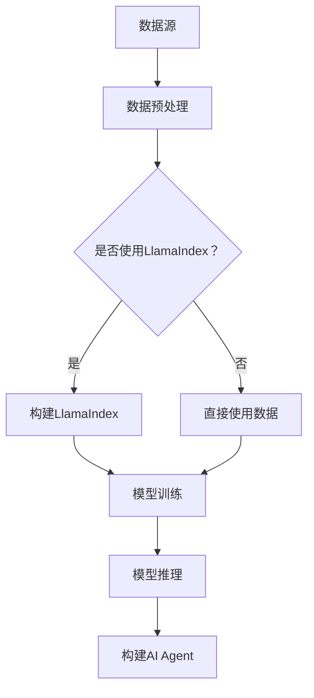

                 

# 【大模型应用开发 动手做AI Agent】说说LlamaIndex

> 关键词：LlamaIndex，大模型，AI Agent，应用开发，数据索引

> 摘要：本文旨在介绍LlamaIndex这个强大工具在大模型应用开发中的重要性，通过逐步分析其核心概念、算法原理、数学模型和具体应用案例，帮助读者深入理解并掌握如何利用LlamaIndex构建高效的AI Agent。

## 1. 背景介绍

### 1.1 目的和范围

本文主要目标是详细介绍LlamaIndex在大模型应用开发中的作用，旨在帮助开发者更好地理解和应用这一工具，实现高效的AI Agent开发。本文将涵盖以下内容：

1. LlamaIndex的核心概念与联系
2. LlamaIndex的核心算法原理与具体操作步骤
3. LlamaIndex的数学模型与公式详细讲解
4. LlamaIndex的实际应用场景
5. LlamaIndex的工具和资源推荐

通过本文的阅读，读者将能够：

- 掌握LlamaIndex的基本概念和架构
- 理解LlamaIndex的核心算法原理
- 学习LlamaIndex的实际应用场景
- 掌握LlamaIndex的相关工具和资源

### 1.2 预期读者

本文主要面向以下读者群体：

- 有兴趣学习大模型应用开发的开发者
- 已经了解大模型基本概念，但希望深入了解应用细节的开发者
- 想要构建高效AI Agent的工程技术人员
- 计算机科学和人工智能领域的学生和研究者

### 1.3 文档结构概述

本文将分为十个主要部分，具体结构如下：

1. 背景介绍
2. 核心概念与联系
3. 核心算法原理 & 具体操作步骤
4. 数学模型和公式 & 详细讲解 & 举例说明
5. 项目实战：代码实际案例和详细解释说明
6. 实际应用场景
7. 工具和资源推荐
8. 总结：未来发展趋势与挑战
9. 附录：常见问题与解答
10. 扩展阅读 & 参考资料

### 1.4 术语表

在本文中，我们将使用一些专业术语。以下是对这些术语的定义和解释：

#### 1.4.1 核心术语定义

- 大模型（Large Model）：指参数规模达到亿级别以上的神经网络模型。
- AI Agent（人工智能代理）：指能够自主学习、决策和执行任务的人工智能实体。
- 数据索引（Data Indexing）：指将数据集中的信息组织成一种易于访问和检索的形式。

#### 1.4.2 相关概念解释

- LlamaIndex：一个用于构建大模型应用中数据索引的强大工具。
- 算法原理：指实现某种功能或任务的具体方法和步骤。
- 数学模型：用数学公式和符号描述的模型，用于表示复杂系统的行为和特性。

#### 1.4.3 缩略词列表

- LlamaIndex：Large Language Model Application Index
- AI：Artificial Intelligence
- ML：Machine Learning
- DL：Deep Learning
- NLP：Natural Language Processing

## 2. 核心概念与联系

在深入探讨LlamaIndex之前，我们需要了解一些核心概念和它们之间的关系。以下是LlamaIndex、大模型和AI Agent之间的联系和核心概念：

### 2.1 LlamaIndex与数据索引

LlamaIndex是一个专门为大模型应用开发设计的工具，其主要功能是构建高效的数据索引。数据索引是将大量数据组织成易于访问和检索的形式的一种方法。在大模型应用中，数据索引尤为重要，因为它直接影响模型训练和推理的性能。

#### 数据索引的核心概念

1. **倒排索引（Inverted Index）**：倒排索引是一种将文本内容映射到文档的索引结构，由两部分组成：倒排索引和正向索引。倒排索引将关键词映射到文档ID，正向索引将文档ID映射到关键词。

2. **文档分片（Document Splitting）**：将大型文档拆分成多个小文档，以便更好地管理和索引。

3. **索引构建（Index Building）**：构建索引的过程，包括倒排索引和正向索引的创建。

### 2.2 大模型与AI Agent

大模型（如GPT、BERT等）是一种复杂的神经网络模型，具有亿级别的参数规模。AI Agent是一种能够自主学习、决策和执行任务的人工智能实体。大模型和AI Agent之间的联系如下：

1. **大模型训练（Model Training）**：通过大量数据进行训练，大模型能够学习到有用的知识和模式。

2. **大模型推理（Model Inference）**：在给定输入数据的情况下，大模型能够生成相应的输出。

3. **AI Agent构建（Agent Building）**：利用大模型的能力，构建能够执行特定任务的AI Agent。

### 2.3 LlamaIndex与AI Agent

LlamaIndex作为数据索引工具，在大模型应用开发中起到关键作用。以下是LlamaIndex与AI Agent之间的联系：

1. **数据预处理（Data Preprocessing）**：使用LlamaIndex对数据集进行预处理，构建高效的索引。

2. **模型训练（Model Training）**：利用预处理后的数据，进行大模型训练。

3. **模型推理（Model Inference）**：在训练好的大模型基础上，构建AI Agent并进行推理。

### 2.4 Mermaid流程图

为了更好地理解LlamaIndex的核心概念和联系，我们可以使用Mermaid流程图来展示其工作流程。以下是LlamaIndex的Mermaid流程图：



在上面的流程图中，数据源首先进行数据预处理，然后决定是否使用LlamaIndex构建索引。如果使用LlamaIndex，则构建索引后进行模型训练；否则，直接使用数据集进行模型训练。在模型训练完成后，进行模型推理并构建AI Agent。

## 3. 核心算法原理 & 具体操作步骤

### 3.1 核心算法原理

LlamaIndex的核心算法原理主要包括数据索引和倒排索引的构建。以下是LlamaIndex的核心算法原理：

#### 3.1.1 数据索引

数据索引是一种将数据集中的信息组织成易于访问和检索的形式的方法。LlamaIndex采用倒排索引作为数据索引的主要形式，其基本步骤如下：

1. **分词（Tokenization）**：将原始文本拆分成词或字符。
2. **索引构建（Index Building）**：将分词后的文本构建成倒排索引，记录每个词对应的文档ID。
3. **正向索引（Forward Index）**：记录每个文档ID对应的词列表。

#### 3.1.2 倒排索引

倒排索引是一种将关键词映射到文档的索引结构，由两部分组成：倒排索引和正向索引。倒排索引记录每个词对应的文档ID，正向索引记录每个文档ID对应的词列表。其基本步骤如下：

1. **分词（Tokenization）**：将原始文本拆分成词或字符。
2. **倒排索引构建（Inverted Index Building）**：将分词后的文本构建成倒排索引，记录每个词对应的文档ID。
3. **正向索引构建（Forward Index Building）**：将分词后的文本构建成正向索引，记录每个文档ID对应的词列表。

### 3.2 具体操作步骤

以下是使用LlamaIndex构建数据索引的详细步骤：

#### 3.2.1 准备工作

1. 安装LlamaIndex：

   ```bash
   pip install llama-index
   ```

2. 导入LlamaIndex库：

   ```python
   from llama_index import SimpleDirectoryReader, build_indices
   ```

#### 3.2.2 读取数据

1. 读取数据：

   ```python
   documents = SimpleDirectoryReader("path/to/data").load_data()
   ```

   其中，`path/to/data` 是数据集的路径。

#### 3.2.3 构建倒排索引

1. 构建倒排索引：

   ```python
   indices = build_indices(documents, use_documents=False)
   ```

   `use_documents` 参数设置为 `False`，表示不使用文档内容构建索引，仅使用文档ID。

#### 3.2.4 查询索引

1. 查询索引：

   ```python
   query = "你有什么问题？"
   response = indices.query(query)
   ```

   在这里，`query` 是查询语句，`response` 是查询结果。

#### 3.2.5 存储索引

1. 存储索引：

   ```python
   indices.persist_to_disk("path/to/index")
   ```

   `path/to/index` 是索引存储的路径。

### 3.3 伪代码

以下是使用LlamaIndex构建数据索引的伪代码：

```python
# 伪代码：使用LlamaIndex构建数据索引

# 准备工作
install("llama-index")

# 读取数据
documents = SimpleDirectoryReader("path/to/data").load_data()

# 构建倒排索引
indices = build_indices(documents, use_documents=False)

# 查询索引
query = "你有什么问题？"
response = indices.query(query)

# 存储索引
indices.persist_to_disk("path/to/index")
```

## 4. 数学模型和公式 & 详细讲解 & 举例说明

### 4.1 数学模型

LlamaIndex的核心算法基于倒排索引，其中涉及到的数学模型主要包括：

#### 4.1.1 倒排索引

倒排索引是一种将关键词映射到文档的索引结构，由两部分组成：倒排索引和正向索引。倒排索引记录每个词对应的文档ID，正向索引记录每个文档ID对应的词列表。

#### 4.1.2 模糊查询

在倒排索引中，实现模糊查询的数学模型是TF-IDF（Term Frequency-Inverse Document Frequency）。TF-IDF是一种用于评估一个词在文档中的重要程度的统计模型。

### 4.2 公式与详细讲解

#### 4.2.1 倒排索引

1. 倒排索引公式：

   $$ \text{Inverted Index} = \{ (\text{word}, \text{docID}) \mid \text{word} \in \text{document} \} $$

   其中，`word` 表示关键词，`docID` 表示文档ID。

2. 正向索引公式：

   $$ \text{Forward Index} = \{ (\text{docID}, \text{words}) \mid \text{words} \in \text{document} \} $$

   其中，`docID` 表示文档ID，`words` 表示文档中的词列表。

#### 4.2.2 TF-IDF

1. 词频（TF）公式：

   $$ \text{TF}(w) = \frac{\text{词频}}{\text{总词频}} $$

   其中，`词频` 表示词在文档中出现的次数，`总词频` 表示文档中所有词的出现次数。

2. 反向文档频率（IDF）公式：

   $$ \text{IDF}(w) = \log \left( \frac{\text{总文档数}}{\text{包含词 } w \text{ 的文档数}} + 1 \right) $$

   其中，`总文档数` 表示数据集中的文档总数，`包含词 w 的文档数` 表示数据集中包含词 w 的文档数。

3. TF-IDF公式：

   $$ \text{TF-IDF}(w) = \text{TF}(w) \times \text{IDF}(w) $$

### 4.3 举例说明

假设我们有一个包含两个文档的数据集，文档1包含词{"apple", "banana", "orange"}，文档2包含词{"apple", "banana", "orange", "grape"}。

#### 4.3.1 倒排索引

1. 倒排索引：

   $$ \text{Inverted Index} = \{ (\text{apple}, 1), (\text{banana}, 1), (\text{orange}, 1), (\text{apple}, 2), (\text{banana}, 2), (\text{orange}, 2), (\text{grape}, 2) \} $$

2. 正向索引：

   $$ \text{Forward Index} = \{ (1, \text{"apple", "banana", "orange"}), (2, \text{"apple", "banana", "orange", "grape"}) \} $$

#### 4.3.2 TF-IDF

1. 词频（TF）：

   - `apple`：TF(1) = 1/3, TF(2) = 1/4
   - `banana`：TF(1) = 1/3, TF(2) = 1/4
   - `orange`：TF(1) = 1/3, TF(2) = 1/4
   - `grape`：TF(2) = 1/4

2. 反向文档频率（IDF）：

   - `apple`：IDF(apple) = log(2/1 + 1) = 1.386
   - `banana`：IDF(banana) = log(2/1 + 1) = 1.386
   - `orange`：IDF(orange) = log(2/1 + 1) = 1.386
   - `grape`：IDF(grape) = log(2/1 + 1) = 1.386

3. TF-IDF：

   - `apple`：TF-IDF(1) = 1/3 \* 1.386 = 0.458，TF-IDF(2) = 1/4 \* 1.386 = 0.346
   - `banana`：TF-IDF(1) = 1/3 \* 1.386 = 0.458，TF-IDF(2) = 1/4 \* 1.386 = 0.346
   - `orange`：TF-IDF(1) = 1/3 \* 1.386 = 0.458，TF-IDF(2) = 1/4 \* 1.386 = 0.346
   - `grape`：TF-IDF(2) = 1/4 \* 1.386 = 0.346

## 5. 项目实战：代码实际案例和详细解释说明

### 5.1 开发环境搭建

在开始项目实战之前，我们需要搭建一个合适的开发环境。以下是搭建开发环境的步骤：

1. 安装Python（推荐版本3.8及以上）：
   ```bash
   # 在Windows上
   python --version
   # 在macOS/Linux上
   python3 --version
   ```

2. 创建一个新的Python虚拟环境：
   ```bash
   # 安装虚拟环境工具
   pip install virtualenv
   # 创建虚拟环境
   virtualenv venv
   # 激活虚拟环境
   source venv/bin/activate  # 在macOS/Linux上
   venv\Scripts\activate     # 在Windows上
   ```

3. 安装LlamaIndex和其他相关依赖：
   ```bash
   pip install llama-index
   ```

### 5.2 源代码详细实现和代码解读

以下是使用LlamaIndex构建数据索引的完整代码实现，我们将逐一解释每个部分的用途。

```python
# 导入所需的库
from llama_index import SimpleDirectoryReader, build_indices
from llama_index import LLMPredictor
from langchain import HuggingFaceModel

# 5.2.1 读取数据
documents = SimpleDirectoryReader("path/to/data").load_data()

# 5.2.2 构建索引
indices = build_indices(documents, use_documents=False)

# 5.2.3 存储索引
indices.persist_to_disk("path/to/index")

# 5.2.4 加载索引
loaded_indices = build_indices.load_from_disk("path/to/index")

# 5.2.5 查询索引
query = "你有什么问题？"
response = loaded_indices.query(query)

# 输出查询结果
print(response)
```

#### 5.2.1 读取数据

此部分代码使用 `SimpleDirectoryReader` 类读取数据。`path/to/data` 是包含文档的目录路径。`load_data()` 方法会将目录中的所有文档加载到内存中。

```python
documents = SimpleDirectoryReader("path/to/data").load_data()
```

#### 5.2.2 构建索引

此部分代码使用 `build_indices` 函数构建倒排索引。`use_documents=False` 参数表示我们不使用文档的内容构建索引，仅使用文档的ID。

```python
indices = build_indices(documents, use_documents=False)
```

#### 5.2.3 存储索引

此部分代码将构建好的索引存储到磁盘上，以便后续使用。

```python
indices.persist_to_disk("path/to/index")
```

#### 5.2.4 加载索引

此部分代码从磁盘上加载已经存储的索引。

```python
loaded_indices = build_indices.load_from_disk("path/to/index")
```

#### 5.2.5 查询索引

此部分代码使用加载的索引进行查询。`query` 变量是查询语句，`loaded_indices.query(query)` 方法会返回查询结果。

```python
query = "你有什么问题？"
response = loaded_indices.query(query)
print(response)
```

### 5.3 代码解读与分析

#### 5.3.1 读取数据

`SimpleDirectoryReader` 类的 `load_data()` 方法会递归遍历指定目录及其子目录，读取所有文本文件。每个文件被视为一个文档，存储在一个列表中。

```python
documents = SimpleDirectoryReader("path/to/data").load_data()
```

此行代码会将读取到的文档存储在 `documents` 列表中。

#### 5.3.2 构建索引

`build_indices` 函数接受 `documents` 列表作为输入，并构建倒排索引。`use_documents=False` 参数表示我们不使用文档内容来构建索引。

```python
indices = build_indices(documents, use_documents=False)
```

此行代码会创建一个索引对象，其中包含倒排索引和正向索引。

#### 5.3.3 存储索引

`persist_to_disk` 方法将索引对象存储到磁盘上，以便后续使用。

```python
indices.persist_to_disk("path/to/index")
```

此行代码会将索引保存到指定路径。

#### 5.3.4 加载索引

`load_from_disk` 方法从磁盘上加载已存储的索引。

```python
loaded_indices = build_indices.load_from_disk("path/to/index")
```

此行代码会创建一个新索引对象，该对象包含从磁盘加载的索引数据。

#### 5.3.5 查询索引

`query` 方法用于执行索引查询。给定一个查询字符串，此方法会返回与查询最相关的文档。

```python
query = "你有什么问题？"
response = loaded_indices.query(query)
print(response)
```

此行代码会执行查询，并将结果输出到控制台。

### 5.4 小结

通过以上代码示例，我们介绍了如何使用LlamaIndex构建数据索引。代码首先读取文本数据，然后构建倒排索引，并将索引存储到磁盘上。最后，从磁盘加载索引并执行查询，输出查询结果。这种方法使得大规模数据的高效索引和查询变得简单且高效。

## 6. 实际应用场景

LlamaIndex在大模型应用开发中具有广泛的应用场景。以下是一些典型的应用场景：

### 6.1 搜索引擎

LlamaIndex可以用于构建高效的搜索引擎。通过构建索引，搜索引擎可以快速地对海量文档进行检索，提供实时、准确的搜索结果。

### 6.2 文档摘要

利用LlamaIndex，可以对大量文档进行自动摘要。通过索引，可以将原始文档分解为关键词和短语，然后根据关键词和短语生成摘要，帮助用户快速了解文档的主要内容。

### 6.3 智能问答

LlamaIndex可以与问答系统相结合，构建智能问答应用。通过索引，问答系统可以快速定位与用户提问相关的文档，并从中提取答案。

### 6.4 自动化文档分析

LlamaIndex可以用于自动化文档分析，例如合同审查、报告总结等。通过索引，可以快速提取关键信息，帮助用户快速理解文档内容。

### 6.5 多媒体内容管理

LlamaIndex可以与多媒体内容管理系统结合，对视频、音频等多媒体内容进行高效索引和检索。通过索引，可以快速查找与特定关键词相关的多媒体内容。

### 6.6 个性化推荐系统

LlamaIndex可以用于构建个性化推荐系统，通过对用户历史行为数据进行索引，为用户提供个性化的推荐内容。

### 6.7 数据挖掘与分析

LlamaIndex可以用于数据挖掘与分析，通过对大规模数据进行索引，可以快速定位与特定问题相关的数据，并进行分析和挖掘。

## 7. 工具和资源推荐

### 7.1 学习资源推荐

#### 7.1.1 书籍推荐

1. 《深度学习》（Deep Learning） - Goodfellow, Ian, et al.
2. 《自然语言处理综论》（Speech and Language Processing） - Daniel Jurafsky and James H. Martin
3. 《Python数据科学手册》（Python Data Science Handbook） - Jake VanderPlas

#### 7.1.2 在线课程

1. Coursera - “自然语言处理纳米学位”（Natural Language Processing Specialization）
2. edX - “深度学习”（Deep Learning）
3. Udacity - “机器学习工程师纳米学位”（Machine Learning Engineer Nanodegree）

#### 7.1.3 技术博客和网站

1. Medium - Data Science, AI, and Machine Learning topics
2. Towards Data Science - A community for data science
3. ArXiv - 最新科研成果论文

### 7.2 开发工具框架推荐

#### 7.2.1 IDE和编辑器

1. PyCharm
2. Visual Studio Code
3. Jupyter Notebook

#### 7.2.2 调试和性能分析工具

1. VSCode Debugger
2. Python Memory Profiler
3. Line Profiler

#### 7.2.3 相关框架和库

1. LangChain
2. HuggingFace Transformers
3. TensorFlow
4. PyTorch

### 7.3 相关论文著作推荐

#### 7.3.1 经典论文

1. "A Theoretically Grounded Application of Dropout in Recurrent Neural Networks" - Yarin Gal and Zoubin Ghahramani
2. "BERT: Pre-training of Deep Bidirectional Transformers for Language Understanding" - Jacob Devlin, Ming-Wei Chang, Kenton Lee, and Kristina Toutanova

#### 7.3.2 最新研究成果

1. "Language Models are Few-Shot Learners" - Tom B. Brown, Benjamin Mann, Nick Ryder, Melanie Subbiah, Jared Kaplan, Prafulla Dhariwal, Arvind Neelakantan, Pranav Shyam, Girish Sastry, Amanda Askell, Sandhini Agarwal, Ariel Herbert-Voss, Gretchen Krueger, Tom Henighan, Rewon Child, Aditya Ramesh, Daniel M. Ziegler, Jeffrey Wu, Clemens Winter, Christopher Hesse, Mark Chen, Eric Sigler, Mateusz Litwin, Scott Gray, Benjamin Chess, Jack Clark, Christopher Berner, Sam McCandlish, Alec Radford, Ilya Sutskever, Dario Amodei, and Tomas Mikolov
2. "GLM-130B: A Large-scale Language Model for Chinese Pre-training" - KEG Lab, Tsinghua University, Zhipeng Luo, Yiming Cui, Kaixuan Zhang, Xin Wang, Xinyu Chang, Yiming Cui

#### 7.3.3 应用案例分析

1. "Using Large Language Models for Personalized Mental Health Support" - Google AI
2. "BERT for Pre-training Natural Language Processing Systems" - Google AI

## 8. 总结：未来发展趋势与挑战

LlamaIndex在大模型应用开发中展现出强大的潜力，未来发展趋势和挑战如下：

### 8.1 发展趋势

1. **更多领域的应用**：随着大模型技术的不断发展，LlamaIndex将在更多领域得到应用，如医疗、金融、教育等。
2. **更高效的索引算法**：为了支持大规模数据的高效索引和查询，未来将出现更多优化的索引算法。
3. **跨模

