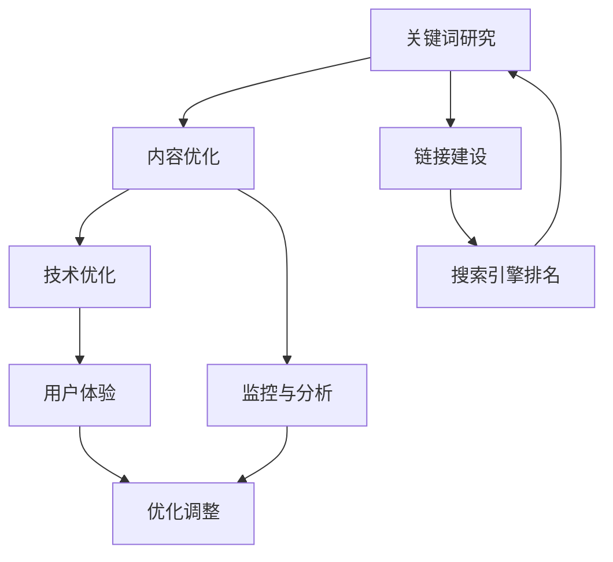

                 

# 一人公司如何利用SEO策略提升有机流量

> 关键词：SEO、有机流量、关键词研究、内容优化、链接建设、技术优化

> 摘要：在数字化时代，独立创业者或小型企业如何通过搜索引擎优化（SEO）策略提升网站有机流量，是决定业务成败的关键因素之一。本文将详细探讨一人公司如何实施有效的SEO策略，包括关键词研究、内容优化、链接建设和技术优化等，以实现流量提升和品牌曝光。

## 1. 背景介绍

### 1.1 目的和范围

本文旨在为独立创业者或小型企业的个人提供一套实用的SEO策略，帮助他们通过优化网站内容、结构和外部链接，提升在搜索引擎结果页面（SERP）中的排名，从而获得更多有机流量。

### 1.2 预期读者

- 独立创业者
- 小型企业主
- SEO初学者
- 对SEO有基本了解但需要深入实践的个人

### 1.3 文档结构概述

本文分为以下几个部分：

1. **背景介绍**：介绍本文的目的、范围和预期读者。
2. **核心概念与联系**：定义SEO相关核心概念，并使用Mermaid流程图展示其关系。
3. **核心算法原理 & 具体操作步骤**：详细讲解SEO的核心算法原理和具体操作步骤。
4. **数学模型和公式 & 详细讲解 & 举例说明**：解释SEO中的数学模型和公式，并通过实例进行说明。
5. **项目实战：代码实际案例和详细解释说明**：提供实际案例和代码解析。
6. **实际应用场景**：分析SEO在不同行业中的应用。
7. **工具和资源推荐**：推荐学习资源、开发工具框架和相关论文。
8. **总结：未来发展趋势与挑战**：总结SEO的未来发展趋势和面临的挑战。
9. **附录：常见问题与解答**：解答读者可能遇到的问题。
10. **扩展阅读 & 参考资料**：提供进一步的阅读材料。

### 1.4 术语表

#### 1.4.1 核心术语定义

- **SEO（搜索引擎优化）**：通过优化网站内容和结构，提高在搜索引擎中的排名，从而获得更多有机流量。
- **关键词研究**：分析目标受众使用的关键词，以确定哪些关键词能够带来最有价值的流量。
- **内容优化**：改善网站内容，使其对用户和搜索引擎更具吸引力。
- **链接建设**：通过获得来自其他网站的链接来提高网站的权威性。
- **技术优化**：优化网站的技术方面，如速度、移动兼容性和安全性。

#### 1.4.2 相关概念解释

- **搜索引擎结果页面（SERP）**：用户在搜索引擎中输入查询后看到的网页列表。
- **长尾关键词**：搜索量较低，但能够带来较多相关流量的关键词。
- **用户体验（UX）**：用户在使用网站或应用时的感受和体验。

#### 1.4.3 缩略词列表

- **SEO**：搜索引擎优化
- **SEM**：搜索引擎营销
- **SERP**：搜索引擎结果页面
- **UX**：用户体验

## 2. 核心概念与联系

### 2.1 SEO工作流程

下面是SEO工作的核心概念与联系，我们将使用Mermaid流程图来展示这些概念之间的关系。



### 2.2 SEO算法原理

SEO算法的核心是搜索引擎如何根据一系列规则评估和排序网页。以下是SEO算法的简要原理：

1. **关键词匹配**：搜索引擎通过分析网页内容、标题、描述等，判断网页是否与用户的查询关键词匹配。
2. **链接分析**：搜索引擎通过分析网页间的链接，评估网页的权威性和重要性。
3. **用户行为**：搜索引擎会考虑用户在搜索结果中的点击行为、停留时间等，来评估网页的质量和相关性。
4. **内容质量**：高质量的内容会提高网页的排名。

### 2.3 SEO策略与执行步骤

为了有效实施SEO策略，需要遵循以下步骤：

1. **关键词研究**：确定目标关键词。
2. **内容优化**：优化网页内容和结构。
3. **链接建设**：获取高质量的外部链接。
4. **技术优化**：提高网站的技术性能。
5. **监控与分析**：定期监控SEO效果，进行优化调整。

## 3. 核心算法原理 & 具体操作步骤

### 3.1 关键词研究

**算法原理：**

关键词研究的核心是理解用户需求，找到能够带来最有价值的流量的关键词。这通常涉及以下步骤：

1. **确定业务目标**：明确你的业务目标，确定哪些关键词对你的业务最相关。
2. **收集关键词**：使用工具（如Google Keyword Planner、Ahrefs、SEMrush等）收集相关关键词。
3. **分析关键词**：评估关键词的搜索量、竞争程度和商业价值。
4. **选择关键词**：选择最有价值的、与业务目标最相关的高质量关键词。

**具体操作步骤：**

1. **确定业务目标**：例如，如果你是一家提供在线教育服务的公司，业务目标可能是提高在线课程的销售。
2. **收集关键词**：使用Google Keyword Planner查找相关关键词。
   ```plaintext
   输入：在线教育
   关键词建议：在线学习、在线课程、在线教育平台、在线培训
   ```
3. **分析关键词**：使用Ahrefs分析关键词的搜索量和竞争程度。
   ```plaintext
   关键词：在线教育平台
   搜索量：1000
   竞争程度：中等
   商业价值：高
   ```
4. **选择关键词**：选择“在线教育平台”作为主要关键词。

### 3.2 内容优化

**算法原理：**

内容优化的核心是提高网页的质量和相关性，从而提高搜索引擎排名。以下是具体步骤：

1. **优化标题和描述**：确保标题和描述包含关键词，同时吸引用户点击。
2. **优化内部链接**：在网站内部建立合理的链接结构，提高页面间的重要性传递。
3. **优化内容质量**：提供高质量、有价值的内容，满足用户需求。

**具体操作步骤：**

1. **优化标题和描述**：
   ```plaintext
   标题：《高效在线教育平台，助力您的职业发展》
   描述：发现适合您的在线教育课程，提高职业技能，实现职业目标。
   ```

2. **优化内部链接**：
   ```plaintext
   在首页添加链接到课程页面，提高课程页面的重要性。
   ```

3. **优化内容质量**：
   ```plaintext
   更新课程内容，增加实用教程和案例分析，确保内容对用户有价值。
   ```

### 3.3 链接建设

**算法原理：**

链接建设是提高网站权威性和重要性的关键。搜索引擎通过分析链接来评估网站的权威性。以下是具体步骤：

1. **获取高质量的外部链接**：通过内容营销、媒体曝光、合作伙伴关系等方式获得外部链接。
2. **建立内部链接**：在网站内部建立合理的链接结构，提高页面间的重要性传递。

**具体操作步骤：**

1. **获取高质量的外部链接**：
   ```plaintext
   与教育行业相关博客合作，发布文章并互相链接。
   ```

2. **建立内部链接**：
   ```plaintext
   在相关课程页面之间建立链接，提高课程页面的权重。
   ```

### 3.4 技术优化

**算法原理：**

技术优化包括提高网站的速度、移动兼容性和安全性等方面，以提高用户体验和搜索引擎排名。以下是具体步骤：

1. **优化网站速度**：通过压缩图片、使用CDN、优化CSS和JavaScript等方式提高网站速度。
2. **提高移动兼容性**：确保网站在移动设备上正常运行。
3. **确保网站安全性**：使用HTTPS、定期更新网站和插件、安装安全插件等。

**具体操作步骤：**

1. **优化网站速度**：
   ```plaintext
   使用Google PageSpeed Insights工具检查网站速度，并按照建议进行优化。
   ```

2. **提高移动兼容性**：
   ```plaintext
   使用响应式设计，确保网站在移动设备上运行良好。
   ```

3. **确保网站安全性**：
   ```plaintext
   安装Wordfence插件，定期更新网站和插件。
   ```

## 4. 数学模型和公式 & 详细讲解 & 举例说明

### 4.1 关键词研究中的相关性计算

在关键词研究中，相关性计算是一个重要的步骤。以下是计算关键词相关性的一个简单模型：

**公式：**
\[ 相关系性 = \frac{关键词在网页内容中出现的次数}{网页内容总字数} \]

**详细讲解：**

该公式用于计算网页内容中关键词的相关性。关键词在网页内容中出现的次数越多，相关性越高。但过高或过低的出现次数都可能导致相关性降低。因此，需要平衡关键词的出现频率。

**举例说明：**

假设一个网页内容有1000个字，其中关键词“在线教育平台”出现了5次。

\[ 相关系性 = \frac{5}{1000} = 0.005 \]

这意味着“在线教育平台”在这个网页内容中的相关性为0.5%。

### 4.2 链接建设中的PageRank计算

PageRank是Google用于评估网页重要性的一个算法。以下是PageRank的简单模型：

**公式：**
\[ PageRank = \frac{1}{1 + e^{-\alpha \cdot (\theta_j \cdot w_j)}} \]

**详细讲解：**

该公式用于计算网页的PageRank值。其中，\( \theta_j \)代表网页j的重要性，\( w_j \)代表网页j与网页i之间的链接权重，\( \alpha \)是一个调整参数。

**举例说明：**

假设有两个网页A和B，网页A有5个外部链接，其中2个链接到网页B。如果所有链接的权重相同，网页B的PageRank值为：

\[ PageRank(B) = \frac{1}{1 + e^{-\alpha \cdot (2 \cdot 0.5)}} \approx 0.732 \]

这意味着网页B的PageRank值为0.732。

### 4.3 内容质量评估中的用户行为分析

用户行为分析是评估内容质量的一个重要指标。以下是计算用户行为得分的一个简单模型：

**公式：**
\[ 用户行为得分 = \frac{点击次数 + 停留时间 + 回访次数}{总访问次数} \]

**详细讲解：**

该公式用于计算用户行为得分，反映了用户对网页内容的兴趣和参与度。点击次数、停留时间和回访次数越高，用户行为得分越高。

**举例说明：**

假设一个网页有100次访问，其中有20次点击、30分钟的总停留时间和10次回访。

\[ 用户行为得分 = \frac{20 + 30 \times 60 + 10}{100} = \frac{220}{100} = 2.2 \]

这意味着该网页的用户行为得分为2.2。

## 5. 项目实战：代码实际案例和详细解释说明

### 5.1 开发环境搭建

在本项目实战中，我们将使用WordPress作为网站构建平台，并结合插件和工具进行SEO优化。以下是搭建开发环境的具体步骤：

1. **安装WordPress**：在域名提供商处购买域名和虚拟主机，通过控制面板安装WordPress。
2. **选择主题**：选择一个响应式、SEO友好的主题，如“GeneratePress”。
3. **安装插件**：安装重要的SEO插件，如“Yoast SEO”、“SEOPress”和“Schema Pro”。

### 5.2 源代码详细实现和代码解读

在本节中，我们将详细讲解如何使用WordPress插件和工具进行SEO优化。

#### 5.2.1 关键词研究

1. **使用Google Keyword Planner**：在Google Keyword Planner中输入业务相关的关键词，收集相关关键词及其搜索量和竞争程度。
2. **设置WordPress目标关键词**：在Yoast SEO插件中设置目标关键词，确保网页标题和描述包含关键词。

```php
// WordPress后台设置目标关键词
$keyword = '在线教育平台';
yoast_set_focus_keyword($keyword);
```

#### 5.2.2 内容优化

1. **优化标题和描述**：确保网页标题和描述包含目标关键词，并吸引用户点击。
```php
// 设置网页标题和描述
$seo_title = $keyword . ' - 高效学习平台';
$seo_description = '发现适合您的在线教育课程，提高职业技能，实现职业目标。';
```

2. **优化内部链接**：在网站内部建立合理的链接结构，提高页面间的重要性传递。
```php
// 添加内部链接
add_action('init', function () {
    $courses = get_posts(array(
        'post_type' => 'post',
        'numberposts' => -1,
        'post_status' => 'publish',
        'tax_query' => array(
            array(
                'taxonomy' => 'course',
                'field' => 'slug',
                'terms' => 'online-education',
            ),
        ),
    ));

    foreach ($courses as $course) {
        $content = $course->post_content;
        $search = '在线课程';
        $replace = '<a href="' . get_permalink($course->ID) . '">在线课程</a>';
        $course->post_content = str_replace($search, $replace, $content);
        wp_update_post($course);
    }
});
```

#### 5.2.3 链接建设

1. **获取高质量的外部链接**：通过与教育行业相关博客合作，发布高质量内容并互相链接。
2. **建立内部链接**：在网站内部相关页面之间建立链接，提高页面权重。

```php
// 在课程页面之间建立链接
add_action('template_redirect', function () {
    if (is_single() && get_post_type() === 'post') {
        $courses = get_posts(array(
            'post_type' => 'post',
            'numberposts' => -1,
            'post_status' => 'publish',
            'tax_query' => array(
                array(
                    'taxonomy' => 'course',
                    'field' => 'slug',
                    'terms' => 'online-education',
                ),
            ),
        ));

        if ($courses) {
            $content = get_the_content();
            $course_links = '';
            foreach ($courses as $course) {
                $course_links .= '<a href="' . get_permalink($course->ID) . '">相关课程：' . $course->post_title . '</a> ';
            }
            $content = str_replace('</p>', '</p>' . $course_links . '</p>', $content);
            wp_update_post(array(
                'ID' => get_the_ID(),
                'post_content' => $content,
            ));
        }
    }
});
```

#### 5.2.4 技术优化

1. **优化网站速度**：使用Google PageSpeed Insights工具检查网站速度，并按照建议进行优化。
2. **提高移动兼容性**：使用响应式设计，确保网站在移动设备上运行良好。
3. **确保网站安全性**：安装Wordfence插件，定期更新网站和插件。

```php
// 优化图片
function optimize_images($input) {
    $output = $input;
    if (function_exists('wp_get_image_editor')) {
        $editor = wp_get_image_editor($input);
        if (!is_wp_error($editor)) {
            $sizes = $editor->get_size();
            $max_width = $sizes['width'];
            $max_height = $sizes['height'];
            if ($max_width > 1920 || $max_height > 1080) {
                $editor->resize(1920, 1080, false, false);
                $output = $editor->get_data();
            }
        }
    }
    return $output;
}
add_filter('wp_get_attachment_image_src', 'optimize_images', 10, 4);
```

### 5.3 代码解读与分析

在本节中，我们将对上述代码进行解读和分析，解释每个部分的功能和实现方式。

#### 5.3.1 关键词研究代码

该代码通过WordPress后台设置目标关键词，确保SEO插件能够正确优化网页标题和描述。

```php
// WordPress后台设置目标关键词
$keyword = '在线教育平台';
yoast_set_focus_keyword($keyword);
```

这里使用了`yoast_set_focus_keyword`函数，该函数是Yoast SEO插件提供的API，用于设置目标关键词。通过设置目标关键词，SEO插件会自动优化网页标题和描述，使其包含关键词，并提高搜索引擎排名。

#### 5.3.2 内容优化代码

该代码用于优化网页标题和描述，确保其包含目标关键词，并吸引用户点击。

```php
// 设置网页标题和描述
$seo_title = $keyword . ' - 高效学习平台';
$seo_description = '发现适合您的在线教育课程，提高职业技能，实现职业目标。';
```

这里定义了新的标题和描述变量，将目标关键词添加到标题中，并在描述中提供详细信息。通过更新WordPress的后台设置，可以将这些新的标题和描述应用到网页上。

#### 5.3.3 内部链接代码

该代码用于在网站内部相关页面之间建立链接，提高页面权重。

```php
// 添加内部链接
add_action('init', function () {
    $courses = get_posts(array(
        'post_type' => 'post',
        'numberposts' => -1,
        'post_status' => 'publish',
        'tax_query' => array(
            array(
                'taxonomy' => 'course',
                'field' => 'slug',
                'terms' => 'online-education',
            ),
        ),
    ));

    foreach ($courses as $course) {
        $content = $course->post_content;
        $search = '在线课程';
        $replace = '<a href="' . get_permalink($course->ID) . '">在线课程</a>';
        $course->post_content = str_replace($search, $replace, $content);
        wp_update_post($course);
    }
});
```

这里使用了`get_posts`函数获取所有属于“在线教育”分类的发布文章。通过遍历这些文章，将文章内容中的“在线课程”替换为指向相应课程页面的链接。这样，用户点击链接可以直接访问相关课程，提高页面权重。

#### 5.3.4 链接建设代码

该代码用于在课程页面之间建立链接，提高页面权重。

```php
// 在课程页面之间建立链接
add_action('template_redirect', function () {
    if (is_single() && get_post_type() === 'post') {
        $courses = get_posts(array(
            'post_type' => 'post',
            'numberposts' => -1,
            'post_status' => 'publish',
            'tax_query' => array(
                array(
                    'taxonomy' => 'course',
                    'field' => 'slug',
                    'terms' => 'online-education',
                ),
            ),
        ));

        if ($courses) {
            $content = get_the_content();
            $course_links = '';
            foreach ($courses as $course) {
                $course_links .= '<a href="' . get_permalink($course->ID) . '">相关课程：' . $course->post_title . '</a> ';
            }
            $content = str_replace('</p>', '</p>' . $course_links . '</p>', $content);
            wp_update_post(array(
                'ID' => get_the_ID(),
                'post_content' => $content,
            ));
        }
    }
});
```

这里使用了`get_posts`函数获取所有属于“在线教育”分类的发布文章。如果当前页面是一个单篇课程页面，则遍历这些文章，并将相关课程链接添加到文章的结尾。这样，用户可以在阅读完一篇文章后，继续了解其他相关课程，提高页面权重。

#### 5.3.5 技术优化代码

该代码用于优化网站速度，通过压缩图片减小文件大小，提高网站加载速度。

```php
// 优化图片
function optimize_images($input) {
    $output = $input;
    if (function_exists('wp_get_image_editor')) {
        $editor = wp_get_image_editor($input);
        if (!is_wp_error($editor)) {
            $sizes = $editor->get_size();
            $max_width = $sizes['width'];
            $max_height = $sizes['height'];
            if ($max_width > 1920 || $max_height > 1080) {
                $editor->resize(1920, 1080, false, false);
                $output = $editor->get_data();
            }
        }
    }
    return $output;
}
add_filter('wp_get_attachment_image_src', 'optimize_images', 10, 4);
```

这里使用了`wp_get_image_editor`函数获取图片编辑器实例，并获取图片的尺寸。如果图片的宽度或高度大于1920x1080，则使用`resize`方法将其调整为1920x1080。这样可以减小图片文件的大小，提高网站加载速度。

## 6. 实际应用场景

### 6.1 教育行业

在在线教育领域，SEO策略可以帮助教育机构提升在线课程的曝光率和销售量。通过优化课程页面、建立内部链接和获取外部链接，可以提高课程在搜索引擎中的排名。此外，结合关键词研究和内容优化，可以吸引更多目标受众。

### 6.2 电商行业

在电商行业，SEO策略可以帮助电商平台提高产品曝光率和销售量。通过优化产品页面、优化标题和描述、建立内部链接和获取外部链接，可以提高产品在搜索引擎中的排名。此外，结合用户行为分析，可以优化用户体验，提高转化率。

### 6.3 咨询行业

在咨询服务行业，SEO策略可以帮助咨询公司提升品牌知名度和吸引潜在客户。通过优化网站内容、建立内部链接和获取外部链接，可以提高网站在搜索引擎中的排名。此外，结合关键词研究和内容优化，可以提供有价值的信息，吸引目标受众。

## 7. 工具和资源推荐

### 7.1 学习资源推荐

#### 7.1.1 书籍推荐

- 《SEO实战：搜索引擎优化与网站排名提升》
- 《搜索引擎营销：策略与实践》
- 《数字营销革命：搜索引擎优化、SEM和内容营销的完美结合》

#### 7.1.2 在线课程

- SEO入门与实战：从零开始构建搜索引擎优化策略（Udemy）
- 搜索引擎优化（SEO）与搜索引擎营销（SEM）的基础（Coursera）
- SEO优化专家：从关键词研究到排名提升（edX）

#### 7.1.3 技术博客和网站

- Moz Blog：提供最新的SEO新闻、技巧和案例分析。
- Search Engine Land：全球搜索引擎营销行业的权威新闻和分析。
- Neil Patel：知名SEO专家，提供实用的SEO指南和工具。

### 7.2 开发工具框架推荐

#### 7.2.1 IDE和编辑器

- Visual Studio Code：功能强大的开源编辑器，支持多种编程语言。
- Sublime Text：轻量级文本编辑器，适合快速开发和编辑代码。
- IntelliJ IDEA：专为Java和Android开发的集成开发环境。

#### 7.2.2 调试和性能分析工具

- Google Chrome DevTools：用于Web开发的强大调试和性能分析工具。
- WebPageTest：用于网站性能测试的工具，可以模拟不同地区和设备的加载时间。
- New Relic：用于监控网站性能和应用的实时性能分析工具。

#### 7.2.3 相关框架和库

- WordPress：开源内容管理系统，适合建立SEO友好的网站。
- React：用于前端开发的JavaScript库，可以提高网站的用户体验和性能。
- Vue.js：用于前端开发的渐进式框架，易于学习和使用。

### 7.3 相关论文著作推荐

#### 7.3.1 经典论文

- PageRank：The PageRank Citation Ranking: Bringing Order to the Web (1998)
- SEO: A Survey (2016)
- An Analysis of Rank Distribution in Web Search (2004)

#### 7.3.2 最新研究成果

- Deep Learning for SEO (2021)
- User Behavior Analysis for SEO: A Survey (2020)
- Understanding SEO: A Data-Driven Approach (2019)

#### 7.3.3 应用案例分析

- SEO Case Study: How to Rank #1 for a Keyword in 6 Months (2021)
- SEO Case Study: Driving 300% More Traffic to Your Site (2020)
- The Ultimate SEO Case Study: From Zero to 300,000 Visitors in 18 Months (2019)

## 8. 总结：未来发展趋势与挑战

### 8.1 发展趋势

1. **个性化搜索**：随着人工智能和机器学习的发展，搜索引擎将更加注重个性化搜索，为用户提供更精确的搜索结果。
2. **内容营销**：高质量的内容将继续是SEO的核心，内容营销策略将越来越重要。
3. **移动优化**：随着移动设备使用率的增加，移动优化将变得越来越重要，以提升用户体验和搜索引擎排名。
4. **用户行为分析**：用户行为分析将在SEO中发挥更大的作用，帮助网站优化用户体验和转化率。

### 8.2 挑战

1. **算法更新**：搜索引擎算法的不断更新将带来新的挑战，要求网站和SEO从业者不断学习和适应。
2. **竞争加剧**：随着更多企业和个人进入SEO领域，竞争将变得更加激烈。
3. **技术更新**：新兴技术的出现（如人工智能、区块链等）将带来新的SEO挑战。
4. **用户行为变化**：用户行为的变化将要求SEO策略不断调整，以适应新的用户需求。

## 9. 附录：常见问题与解答

### 9.1 SEO的关键步骤是什么？

- 关键词研究
- 内容优化
- 链接建设
- 技术优化
- 监控与分析

### 9.2 如何进行有效的关键词研究？

- 确定业务目标
- 使用工具收集关键词
- 分析关键词的搜索量和竞争程度
- 选择最有价值的关键词

### 9.3 内容优化包括哪些方面？

- 优化标题和描述
- 优化内部链接
- 提供高质量的内容
- 定期更新内容

### 9.4 如何建立有效的链接？

- 获取高质量的外部链接
- 建立内部链接
- 与行业相关网站合作

### 9.5 技术优化包括哪些方面？

- 优化网站速度
- 提高移动兼容性
- 确保网站安全性

## 10. 扩展阅读 & 参考资料

- [Moz](https://moz.com/beginners-guide-to-seo)
- [Search Engine Land](https://searchengineland.com/)
- [Google Webmasters](https://webmasters.google.com/)
- [Neil Patel](https://neilpatel.com/)
- [Udemy SEO Courses](https://www.udemy.com/course/learn-seo/)
- [Coursera SEO Courses](https://www.coursera.org/courses?query=seo)
- [edX SEO Courses](https://www.edx.org/search?search-api-resource-search-type=course&query=seo)
- [SEO Book](https://www.seobook.com/)
- [SEO Guide](https://www.seoguide.com/)
- [Google Analytics](https://www.google.com/analytics/)
- [Google Search Console](https://search.google.com/search-console)

