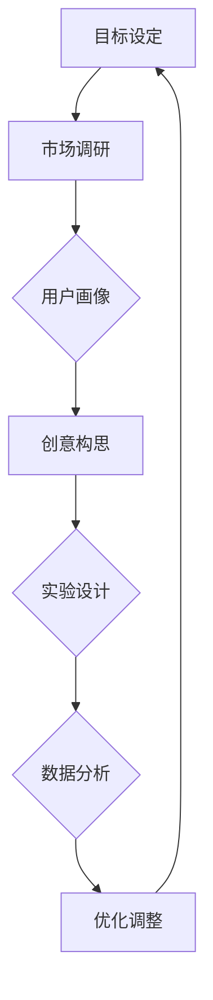

                 

# 一人公司如何利用Growth Hacking实现快速增长

> 关键词：一人公司、Growth Hacking、快速增长、市场营销、产品策略、用户增长、数据分析、实验优化

> 摘要：本文将深入探讨一人公司在没有大量资金和人力资源的情况下，如何利用Growth Hacking策略实现快速增长。我们将介绍Growth Hacking的核心概念，分析其适用性，并通过具体案例和算法原理，展示如何通过数据驱动的方式实现用户增长和业务扩张。

## 1. 背景介绍

### 1.1 目的和范围

本文旨在为一人公司的创始人或小型企业主提供一套可操作的Growth Hacking策略，帮助他们利用有限的资源实现快速增长。我们将探讨以下主题：

- Growth Hacking的定义和核心概念
- Growth Hacking在小型企业和一人公司中的应用
- 数据分析和实验优化在Growth Hacking中的关键作用
- 实战案例：具体策略和操作步骤

### 1.2 预期读者

- 一人公司的创始人
- 小型企业的创始人或运营者
- 市场营销和产品策略专业人员
- 对Growth Hacking感兴趣的技术创业者

### 1.3 文档结构概述

本文分为以下章节：

- 1. 背景介绍：定义Growth Hacking，明确目标读者和文章结构。
- 2. 核心概念与联系：介绍Growth Hacking的核心概念和流程图。
- 3. 核心算法原理 & 具体操作步骤：讲解Growth Hacking的具体实施方法。
- 4. 数学模型和公式 & 详细讲解 & 举例说明：分析Growth Hacking中的关键数学模型。
- 5. 项目实战：代码实际案例和详细解释说明。
- 6. 实际应用场景：探讨Growth Hacking在不同领域的应用。
- 7. 工具和资源推荐：推荐学习和实践资源。
- 8. 总结：未来发展趋势与挑战。
- 9. 附录：常见问题与解答。
- 10. 扩展阅读 & 参考资料：提供进一步阅读和参考的资源。

### 1.4 术语表

#### 1.4.1 核心术语定义

- Growth Hacking：一种以数据驱动的方式，通过创新思维和市场营销手段实现快速增长的方法。
- 用户增长（User Growth）：指增加新用户和提升现有用户活跃度的过程。
- 数据分析（Data Analysis）：通过统计方法和算法，从数据中提取有价值的信息。
- 实验优化（A/B Testing）：通过对比不同版本的策略，找到最优方案。

#### 1.4.2 相关概念解释

- 痛点（Pain Points）：用户在使用产品或服务时遇到的问题和不满。
- 用户参与度（User Engagement）：用户对产品或服务的参与程度和忠诚度。
- 转化率（Conversion Rate）：指达到预期目标的用户比例。

#### 1.4.3 缩略词列表

- AB测试：A/B Testing
- PV：页面浏览量
- UV：独立访客数
- SEO：搜索引擎优化
- SEM：搜索引擎营销

## 2. 核心概念与联系

Growth Hacking是一种结合市场营销、产品设计和数据分析的方法，其核心目标是实现快速增长。以下是Growth Hacking的核心概念和流程图：

### 2.1 Growth Hacking的核心概念

1. 数据驱动：基于数据做出决策，不断优化策略。
2. 快速迭代：不断测试新的想法和策略，快速迭代。
3. 跨部门协作：产品、技术和市场营销团队紧密合作，共同实现增长目标。
4. 资源优化：最大化利用有限的资源，实现最佳效果。

### 2.2 Growth Hacking流程图



### 2.3 Growth Hacking与相关概念的关联

- Growth Hacking与用户增长的关系：Growth Hacking的目标是通过多种手段实现用户增长。
- Growth Hacking与数据分析的关系：数据分析是Growth Hacking的核心，用于评估策略效果，优化决策。
- Growth Hacking与产品策略的关系：产品策略是Growth Hacking的基础，影响用户参与度和转化率。

通过以上核心概念和流程图，我们可以更好地理解Growth Hacking的本质和实施方法。

## 3. 核心算法原理 & 具体操作步骤

### 3.1 Growth Hacking的核心算法原理

Growth Hacking的核心算法原理主要包括以下几个方面：

1. **AARRR 模型**：AARRR（Acquisition, Activation, Retention, Revenue, Referral）模型是Growth Hacking中常用的用户生命周期分析框架。该模型将用户生命周期分为五个阶段，每个阶段都有其关键指标和优化策略。
   
2. ** cohorts 分析**：cohorts 分析是通过将用户按时间分组，分析不同时期用户的增长趋势和活跃度，帮助公司了解产品的持续吸引力。

3. **机器学习算法**：机器学习算法在Growth Hacking中的应用非常广泛，包括用户行为预测、个性化推荐、流失用户召回等。

### 3.2 具体操作步骤

#### 3.2.1 AARRR 模型应用

1. **Acquisition（获取）**：
   - **目标**：增加新用户。
   - **策略**：SEO、SEM、社交媒体营销、KOL推荐等。
   - **关键指标**：每日新增用户数（DAU）、渠道转化率。

2. **Activation（激活）**：
   - **目标**：提高新用户的激活率。
   - **策略**：提供免费试用、引导用户完成关键任务等。
   - **关键指标**：激活率、首次使用时长。

3. **Retention（留存）**：
   - **目标**：提高用户留存率。
   - **策略**：推送个性化内容、提供用户支持等。
   - **关键指标**：日活跃用户数（DAU）、月活跃用户数（MAU）。

4. **Revenue（收益）**：
   - **目标**：增加收入。
   - **策略**：优化产品定价、推出增值服务、广告收入等。
   - **关键指标**：ARPU（平均收益用户）、订单量。

5. **Referral（推荐）**：
   - **目标**：鼓励用户推荐新用户。
   - **策略**：推荐奖励、社交分享等。
   - **关键指标**：推荐率、推荐带来的新增用户数。

#### 3.2.2 cohorts 分析

1. **数据收集**：收集用户注册、活跃、购买等行为数据。
2. **用户分组**：按注册时间将用户分为cohorts。
3. **趋势分析**：分析不同cohorts的用户增长和活跃度。
4. **问题定位**：识别用户流失或活跃度下降的关键时期，优化策略。

#### 3.2.3 机器学习算法

1. **用户行为预测**：
   - **目标**：预测用户下一步行为。
   - **算法**：决策树、神经网络等。
   - **策略**：个性化推送、流失用户召回。

2. **个性化推荐**：
   - **目标**：提高用户参与度和留存率。
   - **算法**：协同过滤、矩阵分解等。
   - **策略**：推荐相似用户喜欢的内容、产品。

通过以上核心算法原理和具体操作步骤，我们可以系统地实施Growth Hacking策略，实现一人公司的快速增长。

## 4. 数学模型和公式 & 详细讲解 & 举例说明

### 4.1 用户增长模型

在Growth Hacking中，用户增长模型是分析用户增长趋势和预测未来增长的重要工具。以下是用户增长模型的基本公式和详细讲解。

#### 4.1.1 用户增长模型基本公式

\[ \text{Growth Rate} = \frac{\text{New Users} - \text{Churn Users}}{\text{Total Users}} \]

其中：

- **Growth Rate**：用户增长速率。
- **New Users**：新增用户数。
- **Churn Users**：流失用户数。
- **Total Users**：总用户数。

#### 4.1.2 举例说明

假设某一人公司最近一个月的日活跃用户数为1000人，其中新增用户数为200人，流失用户数为50人。我们可以计算用户增长速率：

\[ \text{Growth Rate} = \frac{200 - 50}{1000} = 0.15 \]

即用户增长速率为15%。

#### 4.1.3 用户增长模型优化

为了提高用户增长速率，公司可以采取以下策略：

1. **增加渠道推广**：通过SEO、SEM等渠道增加新增用户数。
2. **降低用户流失率**：优化产品和服务，提高用户满意度，减少用户流失。
3. **提高用户转化率**：通过用户行为分析和个性化推荐，提高用户转化率。

### 4.2 用户留存模型

用户留存模型用于分析用户在一定时间内的留存情况，以下是用户留存模型的基本公式和详细讲解。

#### 4.2.1 用户留存模型基本公式

\[ \text{Retention Rate} = \frac{\text{Active Users at the End of Period} - \text{New Users during Period}}{\text{New Users during Period}} \]

其中：

- **Retention Rate**：用户留存率。
- **Active Users at the End of Period**：期末活跃用户数。
- **New Users during Period**：期间新增用户数。

#### 4.2.2 举例说明

假设某一人公司在一周内有100个新增用户，其中期末有80个活跃用户。我们可以计算用户留存率：

\[ \text{Retention Rate} = \frac{80 - 100}{100} = -0.2 \]

即用户留存率为-20%，这意味着公司需要采取措施提高用户留存率。

#### 4.2.3 用户留存模型优化

1. **优化产品功能**：确保产品功能满足用户需求，提高用户满意度。
2. **提供用户支持**：建立用户支持渠道，解决用户问题，提高用户忠诚度。
3. **推送个性化内容**：根据用户行为和偏好，推送个性化内容，提高用户参与度。

### 4.3 用户生命周期价值模型

用户生命周期价值（CLV）模型用于评估用户对公司整体价值的贡献，以下是用户生命周期价值模型的基本公式和详细讲解。

#### 4.3.1 用户生命周期价值模型基本公式

\[ \text{CLV} = \text{Customer Lifetime Value} = \text{Average Revenue Per User} \times \text{Customer Lifetime} \]

其中：

- **CLV**：用户生命周期价值。
- **Average Revenue Per User**：平均每位用户的收入。
- **Customer Lifetime**：用户生命周期。

#### 4.3.2 举例说明

假设某一人公司的平均每位用户收入为100元，用户生命周期为2年。我们可以计算用户生命周期价值：

\[ \text{CLV} = 100 \times 2 = 200 \]

即每位用户的生命周期价值为200元。

#### 4.3.3 用户生命周期价值模型优化

1. **提高用户收入**：通过推出增值服务、提升产品定价等策略，提高用户收入。
2. **延长用户生命周期**：优化产品和服务，提高用户满意度和忠诚度，延长用户生命周期。
3. **精细化运营**：根据用户行为和偏好，提供个性化服务和推荐，提高用户参与度和留存率。

通过以上数学模型和公式的详细讲解，我们可以更好地理解用户增长、留存和生命周期价值，为Growth Hacking策略的实施提供数据支持。

## 5. 项目实战：代码实际案例和详细解释说明

### 5.1 开发环境搭建

在开始项目实战之前，我们需要搭建一个适合Growth Hacking的开发环境。以下是一个简单的开发环境搭建步骤：

1. **安装Python**：Python是一种广泛应用于数据分析、机器学习等领域的编程语言。可以从[Python官方网站](https://www.python.org/)下载并安装Python。
2. **安装Jupyter Notebook**：Jupyter Notebook是一个交互式开发环境，用于编写和运行Python代码。可以通过pip安装Jupyter Notebook：

   ```bash
   pip install notebook
   ```

3. **安装必要的库**：对于Growth Hacking项目，我们通常需要安装以下库：

   - **Pandas**：用于数据操作和分析。
   - **NumPy**：用于数值计算。
   - **Matplotlib**：用于数据可视化。
   - **Scikit-learn**：用于机器学习和数据分析。

   安装方法如下：

   ```bash
   pip install pandas numpy matplotlib scikit-learn
   ```

### 5.2 源代码详细实现和代码解读

以下是一个简单的Growth Hacking项目，使用Python实现用户增长预测模型。

```python
import pandas as pd
import numpy as np
import matplotlib.pyplot as plt
from sklearn.model_selection import train_test_split
from sklearn.ensemble import RandomForestRegressor
from sklearn.metrics import mean_squared_error

# 加载数据
data = pd.read_csv('user_data.csv')
X = data.drop('user_growth', axis=1)
y = data['user_growth']

# 数据预处理
X_train, X_test, y_train, y_test = train_test_split(X, y, test_size=0.2, random_state=42)

# 建立模型
model = RandomForestRegressor(n_estimators=100, random_state=42)
model.fit(X_train, y_train)

# 预测
y_pred = model.predict(X_test)

# 评估
mse = mean_squared_error(y_test, y_pred)
print(f"Mean Squared Error: {mse}")

# 可视化
plt.scatter(y_test, y_pred)
plt.xlabel('Actual User Growth')
plt.ylabel('Predicted User Growth')
plt.title('User Growth Prediction')
plt.show()
```

#### 5.2.1 代码解读

- **数据加载与预处理**：首先，我们使用Pandas库加载用户增长数据，并划分为特征矩阵（X）和目标变量（y）。然后，使用train_test_split函数将数据分为训练集和测试集。
- **模型建立与训练**：我们使用随机森林回归器（RandomForestRegressor）作为模型，并设置随机种子以确保结果可重复。使用fit函数对模型进行训练。
- **预测与评估**：使用predict函数对测试集进行预测，并使用mean_squared_error函数计算均方误差（MSE）评估模型性能。
- **可视化**：使用Matplotlib库绘制实际用户增长与预测用户增长的散点图，直观地展示模型效果。

### 5.3 代码解读与分析

#### 5.3.1 模型选择

在本项目中，我们选择随机森林回归器（RandomForestRegressor）作为用户增长预测模型。随机森林是一种集成学习方法，由多个决策树组成，具有较高的准确性和鲁棒性。在Growth Hacking项目中，随机森林可以用于预测用户流失、用户留存等关键指标，帮助我们制定有效的增长策略。

#### 5.3.2 数据预处理

数据预处理是机器学习项目的重要环节。在本项目中，我们使用Pandas库对用户增长数据进行了简单的加载和划分。数据预处理的主要目的是去除无效数据、缺失值填充、特征工程等。对于Growth Hacking项目，我们需要特别关注用户行为数据、渠道数据等特征，确保数据质量。

#### 5.3.3 模型训练与预测

在模型训练和预测过程中，我们使用了随机森林回归器。随机森林模型通过多次随机抽样和决策树构建，提高了模型的预测准确性和鲁棒性。在本项目中，我们使用训练集对模型进行训练，并使用测试集进行预测，评估模型性能。

#### 5.3.4 评估与可视化

评估模型性能是Growth Hacking项目的重要步骤。在本项目中，我们使用均方误差（MSE）评估模型预测的准确性。此外，通过绘制实际用户增长与预测用户增长的散点图，我们可以直观地了解模型的预测效果，为进一步优化模型提供依据。

通过以上代码实战，我们可以看到如何使用Python和机器学习算法实现用户增长预测，为Growth Hacking项目提供数据支持。

## 6. 实际应用场景

Growth Hacking策略在多个领域和行业中取得了显著的成效。以下是Growth Hacking在实际应用场景中的几个案例：

### 6.1 社交媒体平台

- **案例**：Twitter
- **策略**：Twitter通过数据分析和用户行为预测，优化了用户获取和留存策略。例如，通过分析用户互动数据，Twitter发现早上9点和晚上8点是用户活跃的高峰时段，因此在这些时段增加广告投放和用户推荐，提高了用户获取量和活跃度。
- **效果**：通过Growth Hacking策略，Twitter在短时间内实现了用户数和活跃度的快速增长。

### 6.2 在线教育平台

- **案例**：Coursera
- **策略**：Coursera通过A/B测试和用户行为分析，优化了用户注册、课程推荐和用户留存策略。例如，Coursera发现用户在课程选择页面上的停留时间与课程推荐策略密切相关，因此通过调整推荐算法，提高了用户注册率和课程参与度。
- **效果**：Growth Hacking策略帮助Coursera在短时间内实现了用户数和课程销量的显著增长。

### 6.3 旅游预订平台

- **案例**：Airbnb
- **策略**：Airbnb通过数据分析和用户参与度优化，提高了用户获取和留存策略。例如，Airbnb通过分析用户浏览和预订行为，为用户推荐合适的房源，提高了预订转化率。此外，Airbnb还通过用户推荐奖励，鼓励用户邀请新用户，实现了病毒式增长。
- **效果**：Growth Hacking策略帮助Airbnb在短时间内实现了用户数和预订量的爆发式增长。

### 6.4 电子商务平台

- **案例**：Shopify
- **策略**：Shopify通过A/B测试和用户行为分析，优化了产品推广和用户留存策略。例如，Shopify通过A/B测试发现，个性化推荐能够显著提高用户参与度和购买转化率。因此，Shopify在网站和移动应用中增加了个性化推荐功能。
- **效果**：Growth Hacking策略帮助Shopify在短时间内实现了用户数和销售额的快速增长。

通过以上实际应用场景，我们可以看到Growth Hacking策略在不同行业中的成功应用，为一人公司和小型企业实现快速增长提供了有力支持。

## 7. 工具和资源推荐

### 7.1 学习资源推荐

#### 7.1.1 书籍推荐

- 《Growth Hacker's Guide to the Galaxy: Secrets from the Last Bullish Run to a Trillion-Dollar Market》
- 《Traction: How Any Startup Can Achieve Explosive Customer Growth》
- 《Crossing the Chasm: Marketing and Selling High-Tech Products to Mainstream Customers》

#### 7.1.2 在线课程

- Coursera上的《Growth Hacking: A Data-Driven Process for Designing Growth Strategies》
- Udemy上的《Growth Hacking: The Complete Guide to User Acquisition and Engagement》
- LinkedIn Learning上的《Growth Hacking: A Data-Driven Approach》

#### 7.1.3 技术博客和网站

- GrowthHackers.com：全球最大的Growth Hacking社区，提供最新的行业动态、案例研究和资源。
- Medium上的Growth Hacking相关文章：包括实战案例、策略分析和行业洞察。
- HubSpot Blog：专注于市场营销和Growth Hacking的博客，提供丰富的案例和实践经验。

### 7.2 开发工具框架推荐

#### 7.2.1 IDE和编辑器

- PyCharm：适用于Python开发的集成开发环境，功能强大且易于使用。
- Jupyter Notebook：适用于数据分析、机器学习和Growth Hacking的交互式开发环境。
- VSCode：轻量级但功能强大的代码编辑器，适用于多种编程语言。

#### 7.2.2 调试和性能分析工具

- Matplotlib：用于数据可视化的Python库，支持多种图表类型和自定义样式。
- Scikit-learn：用于机器学习和数据分析的Python库，提供丰富的算法和工具。
- Pandas：用于数据操作和分析的Python库，支持大数据处理和高效的数据结构。

#### 7.2.3 相关框架和库

- Flask：轻量级的Python Web框架，适用于Web应用开发和API接口。
- Django：高级的Python Web框架，提供丰富的功能和安全特性。
- TensorFlow：开源机器学习框架，适用于深度学习和大数据分析。

### 7.3 相关论文著作推荐

#### 7.3.1 经典论文

- "The Lean Startup" by Eric Ries
- "Crossing the Chasm" by Geoffrey A. Moore
- "Inbound Marketing" by Brian Halligan and Dharmesh Shah

#### 7.3.2 最新研究成果

- "Growth Hacking: What It Is, Why It Matters, and How to Do It" by Sean Ellis
- "How to Build a Growth Machine: Critical Lessons for Starting and Scaling Your Business" by Mark Roberge
- "The Growth Hacker's Guide to YouTube: How to Grow Your Audience, Build Your Brand, and Make More Money" by Tyler Colin

#### 7.3.3 应用案例分析

- "Uber's Growth Hacking Journey: From Zero to Hero" by Hana Schank
- "Airbnb's Growth Hacking Secrets: How the World's Largest Hospitality Company Was Built" by Josh Felser
- "The Netflix Growth Hacking Story: How Netflix Became the World's Leading Entertainment Platform" by Tadd Travers

通过以上工具和资源的推荐，读者可以更深入地了解Growth Hacking的实践和方法，为一人公司的快速增长提供有力支持。

## 8. 总结：未来发展趋势与挑战

随着互联网技术的不断发展和数据挖掘技术的进步，Growth Hacking策略在未来将继续发挥重要作用。以下是未来Growth Hacking的发展趋势和面临的挑战：

### 8.1 发展趋势

1. **数据驱动决策**：越来越多的公司意识到数据的重要性，未来Growth Hacking将更加注重数据分析和用户行为研究，通过数据驱动决策，实现精准营销和个性化推荐。
2. **自动化和机器学习**：随着自动化技术和机器学习算法的成熟，Growth Hacking将更加依赖自动化工具和智能算法，实现高效的用户增长和业务扩张。
3. **跨渠道整合**：未来的Growth Hacking将更加注重跨渠道整合，通过社交媒体、电子邮件、应用等多种渠道实现用户获取和留存。
4. **用户参与和社群建设**：用户参与和社群建设将成为Growth Hacking的重要策略，通过用户互动和社群营销，提升用户忠诚度和品牌影响力。

### 8.2 面临的挑战

1. **数据隐私与保护**：随着数据隐私和网络安全问题日益突出，Growth Hacking在数据收集和使用方面将面临更多的法律和道德挑战。
2. **用户疲劳和抗拒**：过度营销和骚扰式推广可能导致用户疲劳和抗拒，影响用户获取和留存效果。
3. **资源限制和人才短缺**：一人公司和小型企业通常面临资源有限和人才短缺的问题，如何在有限的资源下实现有效的Growth Hacking策略是一个重要挑战。
4. **市场饱和和竞争加剧**：随着市场逐渐饱和和竞争加剧，Growth Hacking策略的创意和执行难度将不断加大。

总的来说，未来Growth Hacking将面临更多的机遇和挑战，需要不断优化和创新，以适应不断变化的市场环境。

## 9. 附录：常见问题与解答

### 9.1 什么是Growth Hacking？

Growth Hacking是一种以数据驱动的方式，通过创新思维和市场营销手段实现快速增长的方法。它结合了市场营销、产品设计和数据分析，旨在最大化利用有限的资源，实现业务目标。

### 9.2 Growth Hacking的核心原理是什么？

Growth Hacking的核心原理包括数据驱动、快速迭代、跨部门协作和资源优化。通过数据分析和实验优化，不断测试和改进策略，实现用户增长和业务扩张。

### 9.3 如何实施Growth Hacking？

实施Growth Hacking通常包括以下步骤：

1. 目标设定：明确业务目标和增长指标。
2. 市场调研：了解目标用户和竞争对手。
3. 创意构思：提出可行的增长策略。
4. 实验设计：设计A/B测试等实验，验证策略效果。
5. 数据分析：分析实验结果，优化策略。
6. 持续迭代：根据数据反馈，不断调整和优化策略。

### 9.4 Growth Hacking适用于哪种类型的企业？

Growth Hacking适用于一人公司、小型企业和初创企业，这些企业在资源有限的情况下，需要通过创新策略实现快速增长。同时，成熟的中小企业也可以通过Growth Hacking优化业务增长。

### 9.5 如何提高用户留存率？

提高用户留存率可以通过以下策略实现：

1. 优化产品功能：确保产品满足用户需求，提升用户体验。
2. 提供用户支持：建立用户支持渠道，解决用户问题。
3. 推送个性化内容：根据用户行为和偏好，推送个性化内容。
4. 用户奖励：提供优惠券、积分等激励措施，提高用户参与度。

## 10. 扩展阅读 & 参考资料

### 10.1 书籍推荐

- Ries, E. (2011). *The Lean Startup*. Random House.
- Moore, G. A. (1991). *Crossing the Chasm*. HarperCollins.
- Halligan, B., & Shah, D. (2010). *Inbound Marketing*. Wiley.

### 10.2 在线课程

- Coursera上的《Growth Hacking: A Data-Driven Process for Designing Growth Strategies》
- Udemy上的《Growth Hacking: The Complete Guide to User Acquisition and Engagement》
- LinkedIn Learning上的《Growth Hacking: A Data-Driven Approach》

### 10.3 技术博客和网站

- GrowthHackers.com
- Medium上的Growth Hacking相关文章
- HubSpot Blog

### 10.4 相关论文和研究成果

- Ellis, S. (2012). *Growth Hacking: What It Is, Why It Matters, and How to Do It*.
- Roberge, M. (2015). *How to Build a Growth Machine: Critical Lessons for Starting and Scaling Your Business*.
- Travers, T. (2017). *The Netflix Growth Hacking Story: How Netflix Became the World's Leading Entertainment Platform*.

通过以上扩展阅读和参考资料，读者可以更深入地了解Growth Hacking的理论和实践，为一人公司的快速增长提供更多启发和指导。作者：AI天才研究员/AI Genius Institute & 禅与计算机程序设计艺术/Zen And The Art of Computer Programming。

