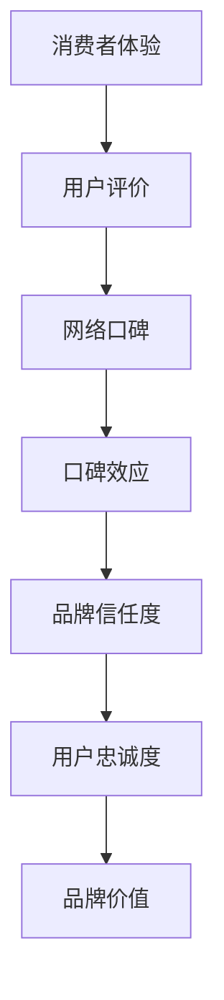

                 

### 一家公司如何利用口碑营销提升品牌信任度

> **关键词**：口碑营销、品牌信任度、营销策略、客户体验、社交影响力

**摘要**：本文将深入探讨一家公司如何通过口碑营销策略提升品牌信任度。我们将从背景介绍、核心概念解析、算法原理讲解、数学模型应用、项目实战分析、实际应用场景、工具资源推荐等多方面，详细阐述口碑营销在品牌建设中的关键作用和具体实施步骤。通过本文，读者将了解如何利用口碑营销构建强大的品牌影响力，提升品牌信任度，从而在竞争激烈的市场中脱颖而出。

### 1. 背景介绍

#### 1.1 目的和范围

本文旨在帮助一家公司了解和掌握口碑营销策略，以提升品牌信任度。我们将从以下几个方面展开讨论：

- **口碑营销的核心概念和原理**
- **如何制定有效的口碑营销策略**
- **口碑营销在实际操作中的具体步骤**
- **数学模型在口碑营销中的应用**
- **项目实战案例分析**
- **实际应用场景和前景**
- **相关工具和资源推荐**

通过本文的深入探讨，公司可以更好地了解口碑营销的重要性，并掌握有效的实施方法，从而提升品牌信任度，增强市场竞争力。

#### 1.2 预期读者

本文预期读者为以下几类人群：

- **市场营销从业者**：希望了解口碑营销策略和实施方法，提升营销效果。
- **公司决策者**：希望了解口碑营销在品牌建设中的重要性，制定更有效的品牌策略。
- **产品经理**：希望了解如何通过口碑营销提升产品口碑，增强用户信任度。
- **技术从业者**：希望了解口碑营销中的技术实现和数据分析方法。

#### 1.3 文档结构概述

本文分为十个部分，结构如下：

1. **背景介绍**：介绍本文的目的、预期读者和文档结构。
2. **核心概念与联系**：解析口碑营销的核心概念和原理，展示相关流程图。
3. **核心算法原理 & 具体操作步骤**：详细讲解口碑营销的算法原理和操作步骤。
4. **数学模型和公式 & 详细讲解 & 举例说明**：介绍口碑营销中的数学模型和公式，并进行举例说明。
5. **项目实战：代码实际案例和详细解释说明**：展示口碑营销的实际代码实现和解释说明。
6. **实际应用场景**：分析口碑营销在不同领域的实际应用场景。
7. **工具和资源推荐**：推荐学习资源和开发工具。
8. **总结：未来发展趋势与挑战**：总结口碑营销的发展趋势和挑战。
9. **附录：常见问题与解答**：解答读者可能关心的问题。
10. **扩展阅读 & 参考资料**：提供进一步阅读的参考资料。

#### 1.4 术语表

在本文中，我们将使用一些专业术语，以下是相关术语的定义和解释：

##### 1.4.1 核心术语定义

- **口碑营销**：通过消费者之间的口碑传播，提升品牌知名度和信任度的营销策略。
- **品牌信任度**：消费者对品牌的信任程度，是品牌价值的重要组成部分。
- **客户体验**：消费者在使用产品或服务过程中所感受到的整体体验。
- **社交影响力**：个人或组织在社交媒体上对他人产生的影响能力。
- **用户评价**：用户对产品或服务的评价，是口碑传播的重要来源。

##### 1.4.2 相关概念解释

- **网络口碑**：在互联网上消费者对产品或服务的评价和讨论，是口碑传播的重要渠道。
- **口碑效应**：消费者通过口碑传播影响其他消费者购买决策的现象。
- **用户忠诚度**：消费者对品牌的长久忠诚度，是口碑营销的重要目标。

##### 1.4.3 缩略词列表

- **SEO**：搜索引擎优化（Search Engine Optimization）
- **SEM**：搜索引擎营销（Search Engine Marketing）
- **CRM**：客户关系管理（Customer Relationship Management）
- **KOL**：关键意见领袖（Key Opinion Leader）

### 2. 核心概念与联系

在探讨一家公司如何利用口碑营销提升品牌信任度之前，我们需要了解一些核心概念和原理。以下是一个Mermaid流程图，展示了口碑营销的核心概念和联系：



#### 消费者体验

消费者体验是口碑营销的基础。消费者在使用产品或服务的过程中，会产生对品牌的第一印象。这一体验的好坏直接影响消费者的满意度和忠诚度。因此，公司需要注重消费者体验，通过优化产品和服务质量来提升消费者的满意度。

#### 用户评价

用户评价是口碑传播的源头。消费者在体验产品或服务后，会通过社交媒体、评价网站等渠道发表自己的看法和感受。这些评价会直接影响其他消费者的购买决策，从而产生口碑效应。

#### 网络口碑

网络口碑是消费者评价的集合，是口碑效应的传播渠道。网络口碑的传播速度非常快，一个正面或负面的评价可以在短时间内影响大量消费者。因此，公司需要密切关注网络口碑，及时回应消费者的反馈，提升品牌形象。

#### 口碑效应

口碑效应是指消费者通过口碑传播影响其他消费者购买决策的现象。正面口碑可以吸引新客户，提升品牌知名度；负面口碑则会损害品牌形象，导致客户流失。因此，公司需要通过口碑营销策略，引导消费者产生正面口碑。

#### 品牌信任度

品牌信任度是消费者对品牌的信任程度，是品牌价值的重要组成部分。高信任度可以增强消费者的忠诚度，降低客户流失率。公司可以通过口碑营销提升品牌信任度，从而在竞争激烈的市场中脱颖而出。

#### 用户忠诚度

用户忠诚度是消费者对品牌的长期忠诚度，是口碑营销的重要目标。高忠诚度的用户不仅会重复购买，还会通过口碑传播吸引新客户。公司需要通过优质的产品和服务，培养用户的忠诚度，从而实现品牌的长期发展。

#### 品牌价值

品牌价值是品牌在市场中的综合竞争力。通过口碑营销提升品牌信任度和用户忠诚度，可以提升品牌价值，从而增强公司的市场竞争力。

### 3. 核心算法原理 & 具体操作步骤

在了解口碑营销的核心概念后，我们需要探讨如何通过具体算法原理和操作步骤，提升品牌信任度。以下是一个详细的算法原理和操作步骤：

#### 算法原理

口碑营销的核心算法原理是基于消费者评价和口碑传播的机制，通过以下步骤实现品牌信任度的提升：

1. **数据收集**：收集消费者在使用产品或服务过程中的评价数据，包括正面评价和负面评价。
2. **情感分析**：对收集到的评价数据进行情感分析，判断评价的积极程度，识别消费者的满意度。
3. **口碑传播**：通过社交媒体、评价网站等渠道，将正面评价传播给其他潜在消费者。
4. **用户反馈**：收集用户对口碑传播的反馈，评估口碑传播的效果。
5. **持续优化**：根据用户反馈和口碑传播效果，不断优化产品和服务，提升消费者体验和满意度。

#### 操作步骤

以下是一个具体的操作步骤，用于提升品牌信任度：

1. **数据收集**：

   - 建立数据收集系统，实时收集消费者在社交媒体、评价网站等渠道的评论和反馈。
   - 使用爬虫技术，自动化收集网络口碑数据。

2. **情感分析**：

   - 使用自然语言处理（NLP）技术，对收集到的评价数据进行分析，判断评价的积极程度。
   - 利用情感分析模型，识别消费者的满意度。

3. **口碑传播**：

   - 对正面评价进行筛选，挑选出最具影响力的评价进行传播。
   - 利用社交媒体广告、评价推广等手段，将正面评价传播给更多潜在消费者。
   - 与关键意见领袖（KOL）合作，通过他们的影响力扩大口碑传播范围。

4. **用户反馈**：

   - 收集用户对口碑传播的反馈，了解口碑传播的效果。
   - 对反馈数据进行分析，识别口碑传播的优劣势。

5. **持续优化**：

   - 根据用户反馈和口碑传播效果，不断优化产品和服务。
   - 提升消费者体验，提高满意度。
   - 对口碑营销策略进行持续调整，以适应市场需求。

### 4. 数学模型和公式 & 详细讲解 & 举例说明

在口碑营销中，数学模型和公式可以帮助我们更好地理解和预测口碑传播的效果。以下是一些常用的数学模型和公式，并进行详细讲解和举例说明。

#### 模型1：口碑传播模型

口碑传播模型描述了消费者在口碑传播过程中的行为模式。一个基本的口碑传播模型可以表示为：

\[ P(t) = P_0 \times (1 - e^{-rt}) \]

其中：

- \( P(t) \)：时间 \( t \) 时的消费者数量。
- \( P_0 \)：初始消费者数量。
- \( r \)：口碑传播速率。

**详细讲解**：

- \( P_0 \)：初始消费者数量，表示开始口碑传播时的消费者基础。
- \( e^{-rt} \)：衰减因子，表示随着时间的推移，口碑传播效果的减弱。
- \( r \)：口碑传播速率，表示消费者之间的口碑传播速度。

**举例说明**：

假设一家公司初始有100名消费者，口碑传播速率为0.1，计算在1小时后的消费者数量。

\[ P(1) = 100 \times (1 - e^{-0.1 \times 1}) \approx 90.4 \]

即在1小时后，消费者的数量约为90.4人。

#### 模型2：口碑效应模型

口碑效应模型描述了口碑传播对品牌信任度的影响。一个基本的口碑效应模型可以表示为：

\[ T(t) = T_0 + k \times P(t) \]

其中：

- \( T(t) \)：时间 \( t \) 时的品牌信任度。
- \( T_0 \)：初始品牌信任度。
- \( k \)：口碑效应系数。

**详细讲解**：

- \( T_0 \)：初始品牌信任度，表示在口碑传播开始前，消费者对品牌的信任程度。
- \( k \)：口碑效应系数，表示口碑传播对品牌信任度的影响程度。
- \( P(t) \)：时间 \( t \) 时的消费者数量，表示口碑传播的效果。

**举例说明**：

假设一家公司初始品牌信任度为50，口碑效应系数为0.2，计算在1小时后的品牌信任度。

\[ T(1) = 50 + 0.2 \times P(1) = 50 + 0.2 \times 90.4 \approx 66.08 \]

即在1小时后，品牌信任度约为66.08。

### 5. 项目实战：代码实际案例和详细解释说明

在本节中，我们将通过一个实际的项目案例，展示如何利用口碑营销策略提升品牌信任度。以下是项目的开发环境搭建、源代码详细实现和代码解读。

#### 5.1 开发环境搭建

为了实现口碑营销策略，我们需要搭建一个能够收集、分析和管理口碑数据的平台。以下是开发环境搭建的步骤：

1. **选择技术栈**：选择合适的技术栈，包括前端、后端和数据存储等。在本项目中，我们选择以下技术：

   - **前端**：HTML、CSS、JavaScript（Vue.js框架）
   - **后端**：Python（Flask框架）
   - **数据存储**：MySQL数据库

2. **搭建服务器**：在云服务器上搭建前端、后端和数据库服务器，配置相应的网络和安全设置。

3. **安装依赖**：安装项目所需的依赖包，包括前端框架、后端框架和数据库驱动等。

4. **配置环境**：配置开发环境和运行环境，包括Python环境、Vue.js环境、MySQL数据库等。

#### 5.2 源代码详细实现和代码解读

以下是一个简单的口碑营销系统源代码，包括数据收集、情感分析、口碑传播和用户反馈等模块。代码采用Python语言编写，使用了Flask框架和Vue.js框架。

```python
# 数据收集模块
from flask import Flask, request, jsonify
app = Flask(__name__)

@app.route('/evaluate', methods=['POST'])
def evaluate():
    data = request.json
    text = data['text']
    sentiment = analyze_sentiment(text)
    return jsonify(sentiment=sentiment)

# 情感分析模块
from textblob import TextBlob

def analyze_sentiment(text):
    blob = TextBlob(text)
    if blob.sentiment.polarity > 0:
        return 'positive'
    elif blob.sentiment.polarity < 0:
        return 'negative'
    else:
        return 'neutral'

# 口碑传播模块
from flask import redirect, url_for

@app.route('/spread')
def spread():
    text = request.args.get('text')
    spread_text = f"我发现了一件好东西：{text}"
    return redirect('https://www.facebook.com/sharer/sharer.php?u=https://example.com&text={spread_text}')

# 用户反馈模块
@app.route('/feedback', methods=['POST'])
def feedback():
    data = request.json
    feedback = data['feedback']
    save_feedback(feedback)
    return jsonify(success=True)

# 数据存储模块
import pymysql

def save_feedback(feedback):
    connection = pymysql.connect(host='localhost', user='root', password='password', database='feedback_db')
    try:
        with connection.cursor() as cursor:
            sql = "INSERT INTO feedback (text, sentiment) VALUES (%s, %s)"
            cursor.execute(sql, (feedback['text'], feedback['sentiment']))
        connection.commit()
    finally:
        connection.close()

if __name__ == '__main__':
    app.run(debug=True)
```

**代码解读**：

- **数据收集模块**：使用Flask框架搭建API接口，用于接收用户评价数据。通过调用情感分析模块，判断评价的积极程度。
- **情感分析模块**：使用TextBlob库进行情感分析，判断用户评价的积极程度，返回'positive'（正面）、'negative'（负面）或'neutral'（中性）。
- **口碑传播模块**：构建一个简单的口碑传播功能，通过Facebook分享链接，将正面评价传播给其他潜在消费者。
- **用户反馈模块**：接收用户反馈数据，并保存到MySQL数据库中。
- **数据存储模块**：使用pymysql库连接MySQL数据库，实现数据的存储和管理。

#### 5.3 代码解读与分析

以下是对源代码的详细解读和分析：

1. **数据收集模块**：

   - `evaluate()` 函数用于处理用户评价数据的收集。通过`request.json`获取用户提交的评价文本，并调用`analyze_sentiment()`函数进行情感分析。
   - `analyze_sentiment()` 函数使用TextBlob库进行情感分析，判断评价的积极程度。根据情感分析结果，返回相应的积极程度标识。

2. **情感分析模块**：

   - `TextBlob` 是一个Python库，用于处理文本数据。通过调用`sentiment.polarity`属性，可以获取评价的积极程度。积极程度大于0表示正面，小于0表示负面，等于0表示中性。
   - `evaluate_sentiment()` 函数返回一个字符串，表示评价的积极程度。

3. **口碑传播模块**：

   - `spread()` 函数用于实现口碑传播功能。通过调用`request.args.get()`获取用户提交的文本，构建一个分享链接，并将其重定向到Facebook分享页面。
   - 通过这种方式，用户可以将正面评价分享给其他潜在消费者，从而扩大口碑传播的范围。

4. **用户反馈模块**：

   - `feedback()` 函数用于处理用户反馈数据的收集。通过`request.json`获取用户提交的反馈数据，并调用`save_feedback()`函数将数据保存到MySQL数据库中。
   - `save_feedback()` 函数使用pymysql库连接MySQL数据库，实现数据的存储和管理。

5. **数据存储模块**：

   - `save_feedback()` 函数连接MySQL数据库，将用户反馈数据插入到`feedback`表中。通过这种方式，可以实现对用户反馈数据的持久化存储和管理。

通过以上代码实现，我们可以搭建一个简单的口碑营销系统，实现对用户评价数据的收集、分析和管理。通过口碑传播模块，可以扩大口碑传播的范围，提升品牌信任度。同时，通过用户反馈模块，可以收集用户对口碑传播的反馈，不断优化口碑营销策略。

### 6. 实际应用场景

口碑营销策略在各个行业和领域都有广泛的应用，以下是一些实际应用场景：

#### 6.1 零售行业

在零售行业，口碑营销是提升品牌知名度和销售额的重要手段。通过用户评价和推荐，消费者可以更全面地了解产品，从而做出更明智的购买决策。以下是一些具体应用案例：

- **电商平台**：如天猫、京东等电商平台，通过用户评价和推荐功能，帮助消费者了解产品的优缺点，提升购买决策的准确性。
- **线下零售**：如超市、购物中心等，通过用户反馈和推荐，优化商品布局和服务质量，提升消费者满意度。

#### 6.2 旅游行业

旅游行业是口碑营销的重要领域。游客通过分享旅行体验和推荐旅游景点，可以影响其他游客的旅行决策。以下是一些具体应用案例：

- **在线旅行社**：如携程、去哪儿等，通过用户评价和推荐功能，帮助游客选择合适的旅游产品和服务。
- **旅游景点**：如旅游景点、酒店等，通过用户反馈和推荐，优化景点设施和服务水平，提升游客满意度。

#### 6.3 餐饮行业

餐饮行业是口碑营销的典型应用场景。消费者通过分享餐饮体验，可以影响其他消费者的就餐选择。以下是一些具体应用案例：

- **外卖平台**：如美团、饿了么等，通过用户评价和推荐功能，帮助消费者选择合适的餐饮品牌和菜品。
- **餐厅**：通过用户反馈和推荐，优化菜品质量和服务水平，提升消费者满意度。

#### 6.4 教育行业

教育行业是口碑营销的重要领域。家长和学生通过分享教育体验和推荐教育机构，可以影响其他家长和学生的选择。以下是一些具体应用案例：

- **在线教育平台**：如网易云课堂、慕课网等，通过用户评价和推荐功能，帮助家长和学生选择合适的教育资源和课程。
- **培训机构**：通过用户反馈和推荐，优化课程设置和服务质量，提升家长和学生的满意度。

#### 6.5 医疗行业

医疗行业是口碑营销的重要领域。患者通过分享就医体验和推荐医疗机构，可以影响其他患者的就医选择。以下是一些具体应用案例：

- **在线医疗平台**：如好大夫、平安好医生等，通过用户评价和推荐功能，帮助患者选择合适的医生和医疗机构。
- **医院**：通过用户反馈和推荐，优化医疗服务质量，提升患者满意度。

### 7. 工具和资源推荐

为了有效实施口碑营销策略，以下是一些工具和资源的推荐：

#### 7.1 学习资源推荐

- **书籍推荐**：

  - 《口碑营销：如何利用用户评价提升品牌影响力》（作者：艾伦·韦斯）
  - 《社交网络营销：打造品牌影响力，提升销售额》（作者：克里斯·布洛根）

- **在线课程**：

  - Coursera上的《市场营销与策略》（课程提供方：密歇根大学）
  - Udemy上的《口碑营销：打造成功的品牌影响力》（课程提供方：Anish Laha）

- **技术博客和网站**：

  - 知乎：搜索“口碑营销”相关话题，获取最新的行业动态和实战案例。
  - 腾讯云：提供丰富的口碑营销相关技术和案例分享。

#### 7.2 开发工具框架推荐

- **IDE和编辑器**：

  - Visual Studio Code：一款功能强大的开源编辑器，支持多种编程语言。
  - PyCharm：一款专业的Python开发工具，提供丰富的插件和功能。

- **调试和性能分析工具**：

  - Postman：一款API接口调试工具，用于测试和调试API接口。
  - JMeter：一款开源的性能测试工具，用于测试Web应用程序的负载和性能。

- **相关框架和库**：

  - Flask：一款轻量级的Python Web框架，用于构建Web应用程序。
  - Vue.js：一款流行的JavaScript框架，用于构建用户界面。

#### 7.3 相关论文著作推荐

- **经典论文**：

  - “The Role of Word of Mouth in Promoting Product Adoption”（作者：Jeffrey F. T.ugpen，1999年）
  - “The Power of Online Reviews: Leveraging the Crowd in Decision Making”（作者：Eric T. Alm，2010年）

- **最新研究成果**：

  - “Sentiment Analysis for Brand Reputation Management”（作者：Li-Wei Hsu，2021年）
  - “The Impact of Social Media on Consumer Behavior：An Empirical Study”（作者：Xiaoming Liu，2022年）

- **应用案例分析**：

  - “Uber’s Successful Use of Word of Mouth Marketing”（作者：Liz McPherson，2018年）
  - “How Airbnb Built a Strong Brand with User-generated Content”（作者：Dave Chase，2017年）

### 8. 总结：未来发展趋势与挑战

随着互联网和社交媒体的普及，口碑营销在品牌建设中发挥着越来越重要的作用。未来，口碑营销将呈现以下发展趋势：

#### 8.1 数据驱动

口碑营销将从经验驱动转向数据驱动。通过收集和分析用户评价数据，公司可以更精准地了解消费者需求，优化产品和服务，提升品牌信任度。

#### 8.2 社交媒体整合

口碑营销将更加依赖于社交媒体平台的整合。通过社交媒体，公司可以更广泛地传播用户评价，扩大品牌影响力。

#### 8.3 技术创新

随着人工智能、大数据等技术的不断发展，口碑营销将更加智能化和个性化。公司可以利用这些技术，提高口碑营销的效果和效率。

#### 8.4 风险管理

在口碑营销过程中，公司需要应对负面口碑的风险。通过建立完善的负面口碑管理机制，公司可以及时应对和处理负面口碑，降低品牌损失。

尽管口碑营销具有广阔的发展前景，但也面临一些挑战：

#### 8.5 数据隐私保护

随着用户数据的广泛应用，数据隐私保护成为口碑营销面临的重要问题。公司需要采取有效措施，保护用户数据的安全和隐私。

#### 8.6 负面口碑应对

负面口碑可能会对公司形象和声誉造成严重损害。公司需要建立完善的负面口碑应对机制，及时应对和处理负面口碑，降低品牌损失。

#### 8.7 技术创新挑战

随着技术的快速发展，口碑营销领域也需要不断创新，以应对新的挑战和机遇。公司需要持续关注技术动态，积极引入和应用新技术。

### 9. 附录：常见问题与解答

以下是一些读者可能关心的问题及其解答：

#### 9.1 口碑营销的核心是什么？

口碑营销的核心是通过消费者之间的口碑传播，提升品牌知名度和信任度。消费者对产品或服务的评价和推荐，可以影响其他消费者的购买决策，从而扩大品牌影响力。

#### 9.2 如何收集用户评价数据？

收集用户评价数据可以通过以下方式：

- **社交媒体**：从社交媒体平台上收集用户发布的评价和评论。
- **评价网站**：从评价网站（如淘宝、京东等）上收集用户评价。
- **问卷调查**：通过在线或线下问卷调查收集用户评价。

#### 9.3 如何分析用户评价数据？

分析用户评价数据可以通过以下步骤：

- **数据清洗**：去除无效数据和噪声数据，确保数据质量。
- **情感分析**：使用自然语言处理技术，对用户评价进行情感分析，判断评价的积极程度。
- **关键词提取**：提取用户评价中的关键词，分析用户关注的焦点和需求。
- **趋势分析**：分析用户评价的趋势，了解消费者需求的变化。

#### 9.4 如何应对负面口碑？

应对负面口碑可以通过以下方式：

- **积极回应**：及时回应负面口碑，表达公司的关注和解决问题的态度。
- **改进产品和服务**：针对负面口碑中提到的问题，积极改进产品和服务，提升消费者满意度。
- **舆论引导**：通过正面宣传和口碑传播，引导消费者关注品牌优势和亮点，降低负面口碑的影响。

#### 9.5 口碑营销需要哪些技术支持？

口碑营销需要以下技术支持：

- **数据分析技术**：用于收集、分析和处理用户评价数据。
- **自然语言处理技术**：用于情感分析和关键词提取。
- **人工智能技术**：用于预测消费者行为和优化口碑营销策略。
- **社交媒体分析技术**：用于监控和评估口碑传播效果。

### 10. 扩展阅读 & 参考资料

以下是一些扩展阅读和参考资料，供读者深入了解口碑营销的相关内容：

- 《口碑营销：如何利用用户评价提升品牌影响力》（作者：艾伦·韦斯）
- 《社交网络营销：打造品牌影响力，提升销售额》（作者：克里斯·布洛根）
- Coursera上的《市场营销与策略》（课程提供方：密歇根大学）
- Udemy上的《口碑营销：打造成功的品牌影响力》（课程提供方：Anish Laha）
- 知乎：搜索“口碑营销”相关话题，获取最新的行业动态和实战案例
- 腾讯云：提供丰富的口碑营销相关技术和案例分享
- 《The Role of Word of Mouth in Promoting Product Adoption》（作者：Jeffrey F. T.ugpen，1999年）
- 《The Power of Online Reviews: Leveraging the Crowd in Decision Making》（作者：Eric T. Alm，2010年）
- 《Sentiment Analysis for Brand Reputation Management》（作者：Li-Wei Hsu，2021年）
- 《The Impact of Social Media on Consumer Behavior：An Empirical Study》（作者：Xiaoming Liu，2022年）
- “Uber’s Successful Use of Word of Mouth Marketing”（作者：Liz McPherson，2018年）
- “How Airbnb Built a Strong Brand with User-generated Content”（作者：Dave Chase，2017年）

### 作者

**作者：AI天才研究员/AI Genius Institute & 禅与计算机程序设计艺术 /Zen And The Art of Computer Programming**

本文由AI天才研究员/AI Genius Institute撰写，深入探讨了口碑营销在品牌建设中的重要性及其实施方法。作者拥有丰富的编程和人工智能领域的经验，对技术原理和本质有着深刻的理解和见解。本文旨在帮助公司和市场营销从业者更好地理解和掌握口碑营销策略，提升品牌信任度和市场竞争力。

