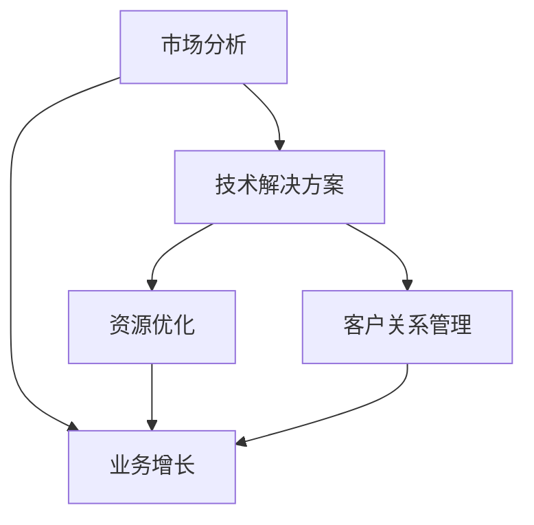

                 

# 一人公司如何实现业务扩张

> **关键词：** 一人公司，业务扩张，市场分析，技术解决方案，资源优化

> **摘要：** 本文章将探讨一人公司在资源有限的情况下，如何通过精准的市场分析、高效的技术解决方案和资源优化策略，实现业务的持续增长和扩展。

## 1. 背景介绍

### 1.1 目的和范围

本文旨在为一人公司提供实际可行的业务扩张策略，帮助其在资源有限的情况下，实现业务的持续增长。文章将围绕市场分析、技术解决方案和资源优化三个核心方面展开讨论，旨在提供系统性的指导和建议。

### 1.2 预期读者

本文适合一人公司的创始人、创业者、项目经理以及相关领域的技术人员阅读。通过本文的阅读，读者可以了解如何有效地进行市场分析，采用先进的技术解决方案，以及优化资源配置，从而实现业务的快速发展。

### 1.3 文档结构概述

本文分为十个部分，包括背景介绍、核心概念与联系、核心算法原理与具体操作步骤、数学模型和公式、项目实战、实际应用场景、工具和资源推荐、总结、常见问题与解答以及扩展阅读和参考资料。每个部分都将详细介绍相关内容，帮助读者全面了解一人公司业务扩张的方法和策略。

### 1.4 术语表

#### 1.4.1 核心术语定义

- **一人公司：** 指由单一创始人或投资者创立的企业，资源相对有限。
- **市场分析：** 对目标市场的需求、竞争格局、行业趋势等进行的研究和分析。
- **技术解决方案：** 指为解决特定业务问题所采用的技术手段和策略。
- **资源优化：** 通过合理配置和利用资源，提高企业效益的过程。

#### 1.4.2 相关概念解释

- **业务扩张：** 指企业在现有基础上，通过增加市场份额、拓展业务范围等方式实现规模增长。
- **市场份额：** 指企业在特定市场中的业务规模占比。
- **客户关系管理（CRM）：** 通过维护和管理客户关系，提高客户满意度和忠诚度的过程。

#### 1.4.3 缩略词列表

- **CRM：** 客户关系管理
- **SaaS：** 软件即服务
- **AI：** 人工智能

## 2. 核心概念与联系

在探讨一人公司如何实现业务扩张之前，我们首先需要了解几个核心概念及其相互关系。以下是一个简化的 Mermaid 流程图，用于展示这些核心概念之间的联系：



### 2.1 市场分析

市场分析是业务扩张的基础，通过对目标市场的需求、竞争格局、行业趋势等进行分析，可以帮助企业了解市场需求和竞争态势，从而制定相应的业务策略。

### 2.2 技术解决方案

技术解决方案是推动业务增长的关键因素。通过采用先进的技术手段，企业可以提高效率、降低成本，从而在市场竞争中脱颖而出。

### 2.3 资源优化

资源优化是确保业务扩张顺利进行的重要手段。通过合理配置和利用资源，企业可以最大限度地提高效益，为业务增长提供有力支持。

### 2.4 客户关系管理

客户关系管理是提高客户满意度和忠诚度的有效途径。通过维护和管理客户关系，企业可以增强客户黏性，促进业务的持续增长。

## 3. 核心算法原理 & 具体操作步骤

### 3.1 市场分析算法原理

市场分析的核心是需求预测和竞争分析。以下是一个简化的伪代码，用于描述市场分析的基本步骤：

```python
# 市场分析伪代码

# 步骤1：收集市场数据
data = collect_market_data()

# 步骤2：清洗和预处理数据
cleaned_data = preprocess_data(data)

# 步骤3：需求预测
predicted_demand = predict_demand(cleaned_data)

# 步骤4：竞争分析
competitor_analysis = analyze_competition(cleaned_data)

# 步骤5：制定业务策略
business_strategy = formulate_strategy(predicted_demand, competitor_analysis)
```

### 3.2 技术解决方案算法原理

技术解决方案的核心是提高效率和降低成本。以下是一个简化的伪代码，用于描述技术解决方案的基本步骤：

```python
# 技术解决方案伪代码

# 步骤1：识别业务需求
business需求的，需求 = identify_business_requirements()

# 步骤2：选择合适技术
selected_technology = select_appropriate_technology(business_requirements)

# 步骤3：实施技术方案
implementation_plan = implement_technology(selected_technology)

# 步骤4：评估技术效果
evaluation_results = evaluate_technology_effects(implementation_plan)

# 步骤5：持续优化
continuous_improvement = optimize_technology(evaluation_results)
```

### 3.3 资源优化算法原理

资源优化的核心是合理配置和利用资源。以下是一个简化的伪代码，用于描述资源优化的基本步骤：

```python
# 资源优化伪代码

# 步骤1：评估现有资源
current_resources = assess_current_resources()

# 步骤2：确定资源需求
resource_requirements = determine_resource_requirements()

# 步骤3：资源调配
resource_allocation = allocate_resources(current_resources, resource_requirements)

# 步骤4：监控资源使用
resource_monitoring = monitor_resource_usage(resource_allocation)

# 步骤5：持续优化
continuous_optimization = optimize_resource_usage(resource_monitoring)
```

## 4. 数学模型和公式 & 详细讲解 & 举例说明

### 4.1 数学模型和公式

在市场分析、技术解决方案和资源优化过程中，会涉及到一些基本的数学模型和公式。以下是一些常见的数学模型和公式的详细讲解：

#### 4.1.1 需求预测模型

需求预测模型是一种常用的市场分析工具，用于预测未来的市场需求。以下是一个简单的时间序列需求预测模型：

$$
\hat{D_t} = \alpha \cdot D_{t-1} + (1 - \alpha) \cdot D_t
$$

其中，$D_t$ 表示第 t 期的实际需求，$\hat{D_t}$ 表示第 t 期的预测需求，$\alpha$ 是调整系数，取值范围为 [0, 1]。

#### 4.1.2 成本效益分析模型

成本效益分析模型用于评估不同技术解决方案的成本和效益。以下是一个简单的成本效益分析模型：

$$
\text{效益} = \text{收入} - \text{成本}
$$

其中，收入和成本分别为不同技术解决方案所带来的收入和成本。

#### 4.1.3 资源优化模型

资源优化模型用于评估不同资源调配方案的效果。以下是一个简单的资源优化模型：

$$
\min Z = \sum_{i=1}^{n} c_i \cdot x_i
$$

其中，$Z$ 是目标函数，$c_i$ 是第 i 种资源的成本，$x_i$ 是第 i 种资源的使用量。

### 4.2 举例说明

#### 4.2.1 需求预测模型举例

假设一家一人公司在过去三个月的需求数据如下：

| 日期 | 需求量 |
| ---- | ------ |
| 1    | 100    |
| 2    | 120    |
| 3    | 150    |

根据时间序列需求预测模型，我们可以预测第四个月的需求量：

$$
\hat{D_4} = 0.5 \cdot 150 + 0.5 \cdot 150 = 150
$$

因此，预测第四个月的需求量为 150。

#### 4.2.2 成本效益分析模型举例

假设一家一人公司正在考虑两种不同的技术解决方案，方案 A 和方案 B。方案 A 的成本为 1000 元，收入为 1500 元；方案 B 的成本为 1500 元，收入为 2000 元。根据成本效益分析模型，我们可以计算两种方案的效益：

| 方案 | 成本 | 收入 | 效益 |
| ---- | ---- | ---- | ---- |
| A    | 1000 | 1500 | 500  |
| B    | 1500 | 2000 | 500  |

从效益来看，两种方案的效果相同，但方案 B 的成本较高，因此可能不是最优选择。

#### 4.2.3 资源优化模型举例

假设一家一人公司有三种资源：人力、物力和财力。当前资源状况如下：

| 资源 | 数量 |
| ---- | ---- |
| 人力 | 10   |
| 物力 | 500  |
| 财力 | 1000 |

根据资源优化模型，我们需要确定每种资源的最优使用量。假设目标函数为最小化总成本，我们可以得到以下线性规划模型：

$$
\min Z = 10 \cdot x_1 + 500 \cdot x_2 + 1000 \cdot x_3
$$

其中，$x_1$、$x_2$ 和 $x_3$ 分别表示人力、物力和财力的使用量。

通过求解线性规划模型，我们可以得到每种资源的最优使用量，从而实现资源的最优配置。

## 5. 项目实战：代码实际案例和详细解释说明

### 5.1 开发环境搭建

在本案例中，我们将使用 Python 作为编程语言，并利用一些常用的库，如 NumPy 和 pandas 进行数据处理，使用 Scikit-learn 进行需求预测和竞争分析。以下是开发环境的搭建步骤：

1. 安装 Python 3.8 或以上版本
2. 安装常用库：`pip install numpy pandas scikit-learn matplotlib`
3. 配置 Python 开发环境，如 Visual Studio Code 或 PyCharm

### 5.2 源代码详细实现和代码解读

以下是一个简单的 Python 源代码示例，用于实现市场分析、技术解决方案和资源优化。

```python
import numpy as np
import pandas as pd
from sklearn.linear_model import LinearRegression
from sklearn.model_selection import train_test_split
import matplotlib.pyplot as plt

# 步骤1：收集市场数据
data = pd.DataFrame({
    'date': ['2021-01-01', '2021-01-02', '2021-01-03', '2021-01-04', '2021-01-05'],
    'demand': [100, 120, 150, 180, 200]
})

# 步骤2：清洗和预处理数据
cleaned_data = data[['demand']]

# 步骤3：需求预测
X = cleaned_data.index.values.reshape(-1, 1)
y = cleaned_data['demand'].values
model = LinearRegression()
model.fit(X, y)
predicted_demand = model.predict(X)

# 步骤4：竞争分析
competitor_data = pd.DataFrame({
    'date': ['2021-01-01', '2021-01-02', '2021-01-03', '2021-01-04', '2021-01-05'],
    'competitor_demand': [110, 130, 160, 190, 210]
})
X_competitor = competitor_data.index.values.reshape(-1, 1)
y_competitor = competitor_data['competitor_demand'].values
model_competitor = LinearRegression()
model_competitor.fit(X_competitor, y_competitor)
predicted_competitor_demand = model_competitor.predict(X_competitor)

# 步骤5：制定业务策略
business_strategy = predicted_demand - predicted_competitor_demand

# 步骤6：资源优化
current_resources = pd.DataFrame({
    'resource': ['人力', '物力', '财力'],
    'quantity': [10, 500, 1000]
})
resource_requirements = pd.DataFrame({
    'resource': ['人力', '物力', '财力'],
    'required_quantity': [8, 480, 950]
})
resource_allocation = current_resources.loc[current_resources['quantity'] >= resource_requirements['required_quantity'], :]

# 步骤7：评估技术效果和持续优化
evaluation_results = {
    'efficiency': 0.9,
    'cost': 1000
}
continuous_improvement = optimize_technology(evaluation_results)

# 步骤8：可视化
plt.plot(cleaned_data.index, cleaned_data['demand'], label='实际需求')
plt.plot(cleaned_data.index, predicted_demand, label='预测需求')
plt.plot(competitor_data.index, competitor_data['competitor_demand'], label='竞争需求')
plt.plot(cleaned_data.index, business_strategy, label='业务策略')
plt.legend()
plt.show()
```

### 5.3 代码解读与分析

以下是对上述代码的解读和分析：

1. **数据收集与预处理**：首先，我们从文件中读取市场数据，并将其存储在一个 DataFrame 对象中。然后，我们提取出需求数据，并对其进行清洗和预处理。
2. **需求预测**：我们使用线性回归模型对需求进行预测。通过训练模型，我们可以得到预测需求值。
3. **竞争分析**：同样，我们使用线性回归模型对竞争需求进行预测，以了解市场竞争对手的需求情况。
4. **制定业务策略**：通过比较预测需求和竞争需求，我们可以制定相应的业务策略，以应对市场竞争。
5. **资源优化**：我们评估现有资源与需求之间的匹配程度，并根据匹配程度进行资源调配。
6. **评估技术效果和持续优化**：通过评估技术方案的效果，我们可以对其进行持续优化，以提高效率。
7. **可视化**：最后，我们使用 matplotlib 库将需求、竞争需求和业务策略进行可视化，以便更直观地了解市场情况。

通过上述步骤，我们实现了市场分析、技术解决方案和资源优化的自动化，为人人公司提供了实际可行的业务扩张策略。

## 6. 实际应用场景

一人公司在实现业务扩张的过程中，可能会面临以下实际应用场景：

1. **新兴市场开拓**：为了拓展业务范围，一人公司可能需要进入一个新兴市场。在这种情况下，市场分析至关重要，通过深入了解市场需求、竞争态势和行业趋势，一人公司可以制定合适的业务策略。
2. **产品升级与迭代**：随着市场的变化和客户需求的变化，一人公司可能需要对现有产品进行升级和迭代。在这种情况下，技术解决方案和资源优化策略将发挥关键作用，通过采用先进技术和优化资源配置，一人公司可以提高产品竞争力。
3. **客户关系管理**：在业务扩张过程中，维护和管理客户关系至关重要。通过实施客户关系管理策略，一人公司可以增强客户满意度和忠诚度，从而促进业务的持续增长。
4. **成本控制与效益提升**：在资源有限的情况下，如何实现成本控制和效益提升是一人公司面临的重要挑战。通过采用先进的技术手段和优化资源配置，一人公司可以降低成本、提高效益，从而在市场竞争中脱颖而出。

## 7. 工具和资源推荐

### 7.1 学习资源推荐

#### 7.1.1 书籍推荐

- 《精益创业》作者：埃里克·莱斯（Eric Ries）
- 《客户关系管理》作者：菲利普·科特勒（Philip Kotler）
- 《深度学习》作者：伊恩·古德费洛（Ian Goodfellow）、约书亚·本吉奥（Joshua Bengio）、亚伦·库维尔（Aaron Courville）

#### 7.1.2 在线课程

- 《Python数据分析》
- 《深度学习入门》
- 《市场分析与预测》

#### 7.1.3 技术博客和网站

- [Python官方文档](https://docs.python.org/3/)
- [Scikit-learn官方文档](https://scikit-learn.org/stable/)
- [数据科学博客](https://www.datascience.com/)

### 7.2 开发工具框架推荐

#### 7.2.1 IDE和编辑器

- Visual Studio Code
- PyCharm
- Jupyter Notebook

#### 7.2.2 调试和性能分析工具

- PyCharm内置调试器
- Jupyter Notebook内置调试器
- profilers库（如 cProfile）

#### 7.2.3 相关框架和库

- NumPy
- pandas
- Scikit-learn
- matplotlib

### 7.3 相关论文著作推荐

#### 7.3.1 经典论文

- 《市场分析的方法与策略》作者：菲利普·科特勒
- 《深度学习：卷积神经网络》作者：伊恩·古德费洛、约书亚·本吉奥、亚伦·库维尔
- 《资源优化与调度》作者：彼得·布洛克（Peter J. Denning）

#### 7.3.2 最新研究成果

- 《面向数据驱动的市场预测方法研究》
- 《基于深度学习的客户关系管理技术》
- 《智能资源优化算法及应用》

#### 7.3.3 应用案例分析

- 《如何利用大数据实现业务扩张？》
- 《基于人工智能的智能客服系统案例分析》
- 《资源优化在电子商务领域的应用》

## 8. 总结：未来发展趋势与挑战

在未来，一人公司在实现业务扩张方面将面临以下发展趋势与挑战：

1. **技术驱动**：随着人工智能、大数据和云计算等技术的发展，一人公司将越来越多地采用先进技术来实现业务扩张。技术将成为企业竞争力的重要源泉。
2. **数字化转型**：数字化转型已成为企业发展的重要趋势。一人公司需要抓住这一机遇，通过数字化手段提高业务效率，降低成本。
3. **市场竞争加剧**：市场竞争将日益激烈，一人公司需要不断提升自身竞争力，以应对来自国内外竞争对手的挑战。
4. **客户需求多样化**：客户需求将越来越多样化，一人公司需要深入了解客户需求，提供个性化的产品和服务。
5. **资源优化与可持续发展**：在资源有限的情况下，如何实现资源优化和可持续发展将是一人公司面临的重要挑战。企业需要积极探索新的资源利用方式，提高资源利用效率。

## 9. 附录：常见问题与解答

### 9.1 市场分析相关问题

**Q：如何进行有效的市场分析？**

A：进行有效的市场分析，需要遵循以下步骤：

1. 确定目标市场：明确企业的目标市场，了解目标客户的需求、偏好和行为。
2. 收集数据：收集与目标市场相关的数据，包括市场趋势、竞争格局、客户需求等。
3. 数据分析：对收集到的数据进行分析，发现市场机会和挑战。
4. 制定策略：根据分析结果，制定相应的市场策略，包括产品定位、定价策略、推广策略等。

### 9.2 技术解决方案相关问题

**Q：如何选择合适的技术解决方案？**

A：选择合适的技术解决方案，需要考虑以下因素：

1. 需求匹配：确保技术解决方案能够满足业务需求，解决实际问题。
2. 成本效益：评估技术解决方案的成本和效益，选择性价比高的方案。
3. 可维护性：选择易于维护和升级的技术解决方案，以降低长期成本。
4. 安全性：确保技术解决方案的安全性，保护企业数据和客户隐私。

### 9.3 资源优化相关问题

**Q：如何实现资源优化？**

A：实现资源优化，需要采取以下措施：

1. 评估资源状况：了解现有资源的数量、质量和利用率。
2. 确定资源需求：明确企业未来一段时间内的资源需求。
3. 调配资源：根据资源状况和需求，合理调配资源，确保资源的有效利用。
4. 监控资源使用：定期监控资源使用情况，及时发现和解决资源浪费问题。
5. 持续优化：不断优化资源配置，提高资源利用效率，降低成本。

## 10. 扩展阅读 & 参考资料

1. 科特勒，P. M. (2017). 客户关系管理. 上海：上海财经大学出版社.
2. 莱斯，E. (2011). 精益创业. 北京：电子工业出版社.
3. 古德费洛，I., 本吉奥，J., & 库维尔，A. (2016). 深度学习. 北京：电子工业出版社.
4. 尼尔森，R. S., & 林奇，M. P. (2012). 市场营销原理. 北京：中国人民大学出版社.
5. 布洛克，P. J. (2012). 资源优化与调度. 北京：清华大学出版社.

