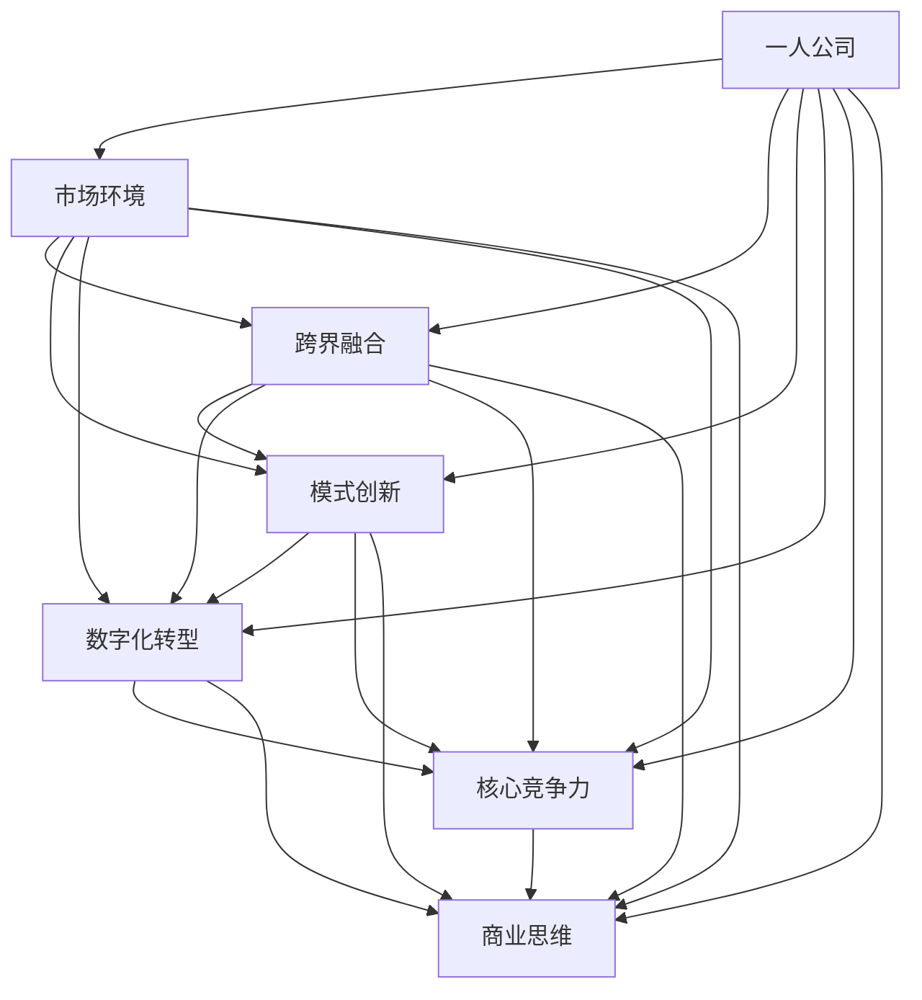

                 


# 一人公司如何实现业务的跨界融合与模式创新

> 关键词：一人公司、业务跨界、模式创新、数字化转型、创业策略、核心竞争力、商业思维
> 
> 摘要：本文将探讨一人公司在业务跨界融合与模式创新方面的策略与实践。通过分析一人公司的独特优势、市场环境、跨界融合的关键步骤以及创新的商业模式，帮助读者了解如何利用个人能力与资源，实现业务领域的拓展与模式创新，从而在竞争激烈的市场中脱颖而出。

## 1. 背景介绍

### 1.1 目的和范围

本文旨在为一人公司提供业务跨界融合与模式创新的策略指导，旨在帮助创业者通过深入理解和灵活运用跨界思维，实现业务拓展与模式创新，提升核心竞争力。

### 1.2 预期读者

本文适用于以下读者：

1. 一人公司的创始人或核心团队成员。
2. 对创业感兴趣，希望了解跨界融合与模式创新策略的读者。
3. 对数字化转型和新兴商业模式有研究兴趣的从业者。

### 1.3 文档结构概述

本文将分为以下部分：

1. 背景介绍：介绍本文的目的、范围、预期读者和文档结构。
2. 核心概念与联系：阐述一人公司的概念、市场环境、跨界融合与模式创新的核心概念及其相互关系。
3. 核心算法原理 & 具体操作步骤：详细讲解跨界融合与模式创新的算法原理与具体操作步骤。
4. 数学模型和公式 & 详细讲解 & 举例说明：介绍相关数学模型和公式，并通过实际案例进行详细说明。
5. 项目实战：分享具体项目案例，展示业务跨界融合与模式创新的实际应用。
6. 实际应用场景：分析一人公司在不同场景下的业务跨界融合与模式创新实践。
7. 工具和资源推荐：推荐相关学习资源、开发工具和框架。
8. 总结：对一人公司的未来发展趋势与挑战进行展望。
9. 附录：常见问题与解答。
10. 扩展阅读 & 参考资料：提供进一步学习的资料来源。

### 1.4 术语表

#### 1.4.1 核心术语定义

- 一人公司：指由单一创始人或核心团队成员运营的企业。
- 业务跨界：指企业通过拓展新业务领域，实现业务范围的多元化。
- 模式创新：指企业通过新的商业模式，实现业务效率、市场竞争力等方面的提升。

#### 1.4.2 相关概念解释

- 数字化转型：指企业利用数字技术，对业务流程、运营模式等进行全面的升级改造。
- 核心竞争力：指企业长期形成，能在竞争中保持竞争优势的能力。
- 商业思维：指企业对市场、客户、产品等方面的认知和决策能力。

#### 1.4.3 缩略词列表

- SaaS：Software as a Service（软件即服务）
- AI：Artificial Intelligence（人工智能）
- IoT：Internet of Things（物联网）
- CRM：Customer Relationship Management（客户关系管理）
- ERP：Enterprise Resource Planning（企业资源计划）

## 2. 核心概念与联系

为了更好地理解一人公司的业务跨界融合与模式创新，我们首先需要了解以下几个核心概念及其相互关系。

### 2.1 一人公司的概念

一人公司，顾名思义，是指由单一创始人或核心团队成员运营的企业。这种企业在组织结构、运营模式等方面具有独特的优势，如决策效率高、灵活性强、管理成本低等。

### 2.2 市场环境

当前市场环境充满了不确定性，竞争激烈，技术变革日新月异。在这种背景下，一人公司需要具备敏锐的市场洞察力，快速响应市场变化，以实现业务的跨界融合与模式创新。

### 2.3 跨界融合

跨界融合是指企业通过拓展新业务领域，实现业务范围的多元化。这种跨界融合不仅包括传统行业之间的跨界，还包括新兴技术与传统行业的融合。

### 2.4 模式创新

模式创新是指企业通过新的商业模式，实现业务效率、市场竞争力等方面的提升。这种创新可以是产品创新、服务创新，也可以是商业模式本身。

### 2.5 数字化转型

数字化转型是指企业利用数字技术，对业务流程、运营模式等进行全面的升级改造。数字化转型是跨界融合与模式创新的重要基础。

### 2.6 核心竞争力

核心竞争力是指企业长期形成，能在竞争中保持竞争优势的能力。在业务跨界融合与模式创新过程中，核心竞争力是企业取得成功的关键。

### 2.7 商业思维

商业思维是指企业对市场、客户、产品等方面的认知和决策能力。商业思维在业务跨界融合与模式创新过程中起着指导作用。

### 2.8 核心概念之间的联系

一人公司的概念、市场环境、跨界融合、模式创新、数字化转型、核心竞争力、商业思维之间存在着紧密的联系。一人公司需要根据市场环境，运用跨界融合与模式创新的思维，通过数字化转型提升核心竞争力，实现业务拓展与模式创新。

### 2.9 Mermaid 流程图

下面是描述一人公司业务跨界融合与模式创新的 Mermaid 流程图：



## 3. 核心算法原理 & 具体操作步骤

在业务跨界融合与模式创新的过程中，核心算法原理起着至关重要的作用。以下将详细讲解一人公司实现业务跨界融合与模式创新的算法原理与具体操作步骤。

### 3.1 算法原理

业务跨界融合与模式创新的算法原理可以概括为以下几个步骤：

1. **市场调研**：通过对市场环境的分析，了解市场需求、竞争对手、行业趋势等，为跨界融合提供依据。
2. **定位分析**：根据企业核心竞争力，确定跨界融合的目标领域，明确业务方向。
3. **资源整合**：整合企业内外部资源，包括技术、人才、资金等，为跨界融合提供支持。
4. **商业模式设计**：设计创新的商业模式，包括产品创新、服务创新、运营模式创新等，以提升企业竞争力。
5. **数字化转型**：利用数字技术，对业务流程、运营模式等进行全面的升级改造，实现业务跨界融合。
6. **持续优化**：根据市场反馈，不断调整和优化业务策略，提升企业核心竞争力。

### 3.2 具体操作步骤

以下是实现业务跨界融合与模式创新的具体操作步骤：

#### 3.2.1 市场调研

1. **确定调研目标**：明确调研目的，如市场需求分析、竞争对手分析、行业趋势分析等。
2. **收集数据**：通过文献调研、实地考察、问卷调查、访谈等方式，收集相关数据。
3. **数据分析**：对收集到的数据进行分析，提取有价值的信息，为跨界融合提供依据。

#### 3.2.2 定位分析

1. **评估自身优势**：分析企业核心竞争力，如技术优势、市场优势、资源优势等。
2. **确定目标领域**：根据自身优势，选择具有发展潜力、符合市场需求的目标领域。
3. **明确业务方向**：制定具体的业务战略，如产品定位、市场定位、目标客户群体等。

#### 3.2.3 资源整合

1. **内部资源整合**：充分利用企业内部资源，如技术团队、管理团队、运营团队等。
2. **外部资源整合**：与合作伙伴、供应商、投资者等建立合作关系，共同推进业务跨界融合。
3. **资源优化配置**：根据业务需求，对资源进行合理配置，确保资源利用效率最大化。

#### 3.2.4 商业模式设计

1. **产品创新**：开发具有独特性、市场竞争力强的产品，满足客户需求。
2. **服务创新**：提供差异化的服务，提升客户体验，增强客户粘性。
3. **运营模式创新**：通过技术创新、管理创新等手段，提高企业运营效率，降低成本。

#### 3.2.5 数字化转型

1. **业务流程数字化**：将业务流程进行数字化改造，提高流程效率。
2. **数据驱动决策**：利用大数据分析，支持业务决策，提升决策准确性。
3. **数字化转型战略规划**：制定数字化转型战略规划，明确目标、时间表、资源投入等。

#### 3.2.6 持续优化

1. **市场反馈**：定期收集市场反馈，了解客户需求和行业动态。
2. **业务调整**：根据市场反馈，对业务策略进行调整，优化业务模式。
3. **持续创新**：保持创新意识，持续探索新的业务机会，推动业务发展。

## 4. 数学模型和公式 & 详细讲解 & 举例说明

在业务跨界融合与模式创新的过程中，数学模型和公式起到了重要的指导作用。以下将介绍相关数学模型和公式，并通过实际案例进行详细讲解和举例说明。

### 4.1 数学模型

#### 4.1.1 跨界融合效益模型

跨界融合效益模型用于评估业务跨界融合对企业效益的影响。其公式如下：

\[ E = \frac{C_1 \cdot Q_1 + C_2 \cdot Q_2}{C_1 + C_2} \]

其中：

- \( E \)：跨界融合效益
- \( C_1 \)：原业务领域成本
- \( Q_1 \)：原业务领域收益
- \( C_2 \)：跨界业务领域成本
- \( Q_2 \)：跨界业务领域收益

#### 4.1.2 模式创新效益模型

模式创新效益模型用于评估模式创新对企业效益的影响。其公式如下：

\[ E' = \frac{R_1 \cdot Q_1 + R_2 \cdot Q_2}{R_1 + R_2} \]

其中：

- \( E' \)：模式创新效益
- \( R_1 \)：原商业模式收益
- \( Q_1 \)：原商业模式投入
- \( R_2 \)：新商业模式收益
- \( Q_2 \)：新商业模式投入

### 4.2 公式讲解

#### 4.2.1 跨界融合效益模型

跨界融合效益模型反映了跨界融合对企业效益的影响。通过公式可以看出，跨界融合效益取决于跨界业务领域的成本、收益以及原业务领域的成本、收益。

- 当跨界业务领域的成本 \( C_2 \) 小于原业务领域的成本 \( C_1 \) 时，跨界融合可以降低企业的总成本。
- 当跨界业务领域的收益 \( Q_2 \) 大于原业务领域的收益 \( Q_1 \) 时，跨界融合可以增加企业的总收益。

#### 4.2.2 模式创新效益模型

模式创新效益模型反映了模式创新对企业效益的影响。通过公式可以看出，模式创新效益取决于新旧商业模式的收益和投入。

- 当新模式创新的收益 \( R_2 \) 大于旧商业模式的收益 \( R_1 \) 时，模式创新可以增加企业的总收益。
- 当新模式创新的投入 \( Q_2 \) 小于旧商业模式的投入 \( Q_1 \) 时，模式创新可以降低企业的总投入。

### 4.3 举例说明

#### 4.3.1 跨界融合效益模型实例

假设一家传统制造业企业，原业务领域的成本为1000万元，收益为500万元。企业决定进入新兴的智能家居领域，智能家居领域的成本为300万元，收益为200万元。根据跨界融合效益模型，可以计算出跨界融合效益：

\[ E = \frac{1000 \cdot 500 + 300 \cdot 200}{1000 + 300} = 714.29 \]

跨界融合后的总成本为1300万元，总收益为700万元，跨界融合效益为714.29万元。

#### 4.3.2 模式创新效益模型实例

假设一家互联网公司，原商业模式的收益为200万元，投入为100万元。公司决定进行模式创新，新模式创新的收益为300万元，投入为150万元。根据模式创新效益模型，可以计算出模式创新效益：

\[ E' = \frac{200 \cdot 100 + 300 \cdot 150}{200 + 300} = 285.71 \]

模式创新后的总收益为500万元，总投入为250万元，模式创新效益为285.71万元。

通过以上实例，可以看出跨界融合和模式创新对企业的效益提升具有重要作用。

## 5. 项目实战：代码实际案例和详细解释说明

在本节中，我们将通过一个具体的项目实战案例，展示如何实现一人公司的业务跨界融合与模式创新。该项目将结合实际业务需求，运用所学的算法原理、数学模型和具体操作步骤，进行代码实现和详细解释说明。

### 5.1 开发环境搭建

为了进行项目实战，我们需要搭建一个适合开发的编程环境。以下是开发环境搭建的步骤：

1. 安装 Python 解释器：在官网下载并安装 Python 解释器（版本3.8及以上）。
2. 安装 IDE：选择一个适合 Python 开发的 IDE，如 PyCharm、Visual Studio Code 等。
3. 安装相关库：通过 pip 命令安装项目所需的库，如 NumPy、Pandas、Matplotlib 等。

```bash
pip install numpy pandas matplotlib
```

### 5.2 源代码详细实现和代码解读

以下是一个简单的业务跨界融合与模式创新的项目案例，用于分析一家传统制造业企业如何进入新兴的智能家居领域，并实现模式创新。该项目包括数据收集、数据预处理、跨界融合效益分析、模式创新效益分析等模块。

```python
import numpy as np
import pandas as pd
import matplotlib.pyplot as plt

# 5.2.1 数据收集
def data_collection():
    # 收集传统制造业和智能家居领域的相关数据
    manufacturing_data = {
        'cost': [1000],  # 成本
        'revenue': [500]  # 收益
    }
    smart_home_data = {
        'cost': [300],  # 成本
        'revenue': [200]  # 收益
    }
    return manufacturing_data, smart_home_data

# 5.2.2 数据预处理
def data_preprocessing(manufacturing_data, smart_home_data):
    # 对数据进行预处理，确保数据格式一致
    manufacturing_df = pd.DataFrame(manufacturing_data)
    smart_home_df = pd.DataFrame(smart_home_data)
    return manufacturing_df, smart_home_df

# 5.2.3 跨界融合效益分析
def benefit_analysis(manufacturing_df, smart_home_df):
    # 计算跨界融合效益
    E = (manufacturing_df['cost'][0] * manufacturing_df['revenue'][0] +
         smart_home_df['cost'][0] * smart_home_df['revenue'][0]) / (manufacturing_df['cost'][0] + smart_home_df['cost'][0])
    return E

# 5.2.4 模式创新效益分析
def innovation_analysis(original_revenue, original_cost, new_revenue, new_cost):
    # 计算模式创新效益
    E_prime = (original_revenue * original_cost + new_revenue * new_cost) / (original_revenue + new_revenue)
    return E_prime

# 5.2.5 主函数
def main():
    manufacturing_data, smart_home_data = data_collection()
    manufacturing_df, smart_home_df = data_preprocessing(manufacturing_data, smart_home_data)
    
    E = benefit_analysis(manufacturing_df, smart_home_df)
    print(f"跨界融合效益：{E}万元")
    
    original_revenue = 200
    original_cost = 100
    new_revenue = 300
    new_cost = 150
    E_prime = innovation_analysis(original_revenue, original_cost, new_revenue, new_cost)
    print(f"模式创新效益：{E_prime}万元")

    # 可视化展示效益分析结果
    plt.figure(figsize=(8, 6))
    plt.bar(['传统制造'], [original_revenue], width=0.3, label='原商业模式')
    plt.bar(['智能家居'], [new_revenue], width=0.3, label='新模式')
    plt.xlabel('商业模式')
    plt.ylabel('收益（万元）')
    plt.legend()
    plt.title('商业模式收益对比')
    plt.show()

if __name__ == "__main__":
    main()
```

### 5.3 代码解读与分析

#### 5.3.1 数据收集与预处理

在项目实战中，我们首先定义了数据收集和预处理函数。数据收集函数用于从传统制造业和智能家居领域收集相关数据，如成本和收益。数据预处理函数则对收集到的数据格式进行统一处理。

```python
def data_collection():
    manufacturing_data = {
        'cost': [1000],  # 成本
        'revenue': [500]  # 收益
    }
    smart_home_data = {
        'cost': [300],  # 成本
        'revenue': [200]  # 收益
    }
    return manufacturing_data, smart_home_data

def data_preprocessing(manufacturing_data, smart_home_data):
    manufacturing_df = pd.DataFrame(manufacturing_data)
    smart_home_df = pd.DataFrame(smart_home_data)
    return manufacturing_df, smart_home_df
```

通过这两个函数，我们可以轻松地获取和预处理相关数据，为后续的效益分析奠定基础。

#### 5.3.2 跨界融合效益分析

跨界融合效益分析函数用于计算跨界融合效益。该函数利用跨界融合效益模型，将传统制造业和智能家居领域的成本和收益代入公式，计算出跨界融合效益。

```python
def benefit_analysis(manufacturing_df, smart_home_df):
    E = (manufacturing_df['cost'][0] * manufacturing_df['revenue'][0] +
         smart_home_df['cost'][0] * smart_home_df['revenue'][0]) / (manufacturing_df['cost'][0] + smart_home_df['cost'][0])
    return E
```

在该函数中，我们首先将传统制造业和智能家居领域的成本和收益提取出来，然后代入跨界融合效益模型公式，计算出跨界融合效益。

#### 5.3.3 模式创新效益分析

模式创新效益分析函数用于计算模式创新效益。该函数利用模式创新效益模型，将新旧商业模式的收益和投入代入公式，计算出模式创新效益。

```python
def innovation_analysis(original_revenue, original_cost, new_revenue, new_cost):
    E_prime = (original_revenue * original_cost + new_revenue * new_cost) / (original_revenue + new_revenue)
    return E_prime
```

在该函数中，我们首先将新旧商业模式的收益和投入提取出来，然后代入模式创新效益模型公式，计算出模式创新效益。

#### 5.3.4 主函数

主函数是项目的核心部分，负责执行整个项目流程。首先，通过数据收集函数获取传统制造业和智能家居领域的相关数据，然后通过数据预处理函数对数据进行预处理。接着，利用跨界融合效益分析函数和模式创新效益分析函数，计算跨界融合效益和模式创新效益，并输出结果。最后，通过可视化展示效益分析结果。

```python
def main():
    manufacturing_data, smart_home_data = data_collection()
    manufacturing_df, smart_home_df = data_preprocessing(manufacturing_data, smart_home_data)
    
    E = benefit_analysis(manufacturing_df, smart_home_df)
    print(f"跨界融合效益：{E}万元")
    
    original_revenue = 200
    original_cost = 100
    new_revenue = 300
    new_cost = 150
    E_prime = innovation_analysis(original_revenue, original_cost, new_revenue, new_cost)
    print(f"模式创新效益：{E_prime}万元")

    # 可视化展示效益分析结果
    plt.figure(figsize=(8, 6))
    plt.bar(['传统制造'], [original_revenue], width=0.3, label='原商业模式')
    plt.bar(['智能家居'], [new_revenue], width=0.3, label='新模式')
    plt.xlabel('商业模式')
    plt.ylabel('收益（万元）')
    plt.legend()
    plt.title('商业模式收益对比')
    plt.show()

if __name__ == "__main__":
    main()
```

通过以上代码解读，我们可以清晰地了解项目实战的实现过程和关键步骤，为后续的业务跨界融合与模式创新提供有益的参考。

## 6. 实际应用场景

一人公司的业务跨界融合与模式创新在多个实际应用场景中取得了显著成效。以下是一些具体的应用场景及其案例分析：

### 6.1 传统制造业向智能制造转型

案例：一家传统制造企业通过引入人工智能和物联网技术，实现了向智能制造的转型。该公司开发了智能生产线监控系统，利用传感器实时采集生产线数据，并通过大数据分析优化生产流程，降低生产成本。此外，企业还推出了定制化的智能产品，满足客户个性化需求。

效果：智能制造转型提升了企业的生产效率、产品质量和客户满意度，实现了业务的跨界融合与模式创新。企业实现了从单一制造向智能制造、定制化生产的转变，提高了市场竞争力。

### 6.2 互联网公司进军金融科技领域

案例：一家互联网公司通过跨界融合与模式创新，进军金融科技领域。该公司利用大数据和人工智能技术，开发了智能投顾平台，为用户提供个性化的投资建议。此外，企业还推出了数字货币交易业务，拓展了业务范围。

效果：金融科技领域的跨界融合与模式创新，使互联网公司实现了业务拓展和商业模式创新。智能投顾平台和数字货币交易业务提升了企业盈利能力，增强了市场竞争力。

### 6.3 传统零售业向线上线下融合转型

案例：一家传统零售企业通过数字化转型，实现了线上线下融合转型。企业建立了电子商务平台，拓展了线上销售渠道。同时，企业还在线下门店引入智能支付、智能推荐等数字化技术，提升消费者购物体验。

效果：线上线下融合转型提升了企业的销售额和市场份额，实现了业务的跨界融合与模式创新。企业通过数字化手段优化了销售流程，降低了运营成本，提高了消费者满意度。

### 6.4 传统农业向智慧农业转型

案例：一家传统农业企业通过引入物联网、大数据和人工智能技术，实现了智慧农业转型。企业建立了农业物联网监控系统，实时监测作物生长环境和病虫害情况。此外，企业还利用大数据分析优化种植方案，提高产量和品质。

效果：智慧农业转型提升了企业的农业生产效率、农产品品质和市场竞争力。企业实现了从传统农业向智慧农业的转型升级，为业务的跨界融合与模式创新奠定了基础。

### 6.5 传统教育机构向在线教育转型

案例：一家传统教育机构通过数字化转型，实现了在线教育转型。企业开发了在线教育平台，提供丰富的教学资源和个性化学习服务。此外，企业还推出了直播授课、互动教学等创新教学模式，提升教学质量。

效果：在线教育转型拓展了教育机构的业务范围，提高了教育质量和市场竞争力。企业实现了从传统教育向在线教育的跨界融合与模式创新，为业务发展带来了新的机遇。

通过以上实际应用场景和案例分析，我们可以看到一人公司通过业务跨界融合与模式创新，实现了业务的转型升级和可持续发展。这些成功案例为其他企业提供了有益的借鉴和启示。

## 7. 工具和资源推荐

为了帮助读者更好地理解和实践一人公司的业务跨界融合与模式创新，以下推荐一些相关的学习资源、开发工具和框架。

### 7.1 学习资源推荐

#### 7.1.1 书籍推荐

1. 《智能时代：大数据与智能商业革命》
   作者：涂子沛
   简介：本书深入剖析了大数据和人工智能的商业应用，对智能商业革命进行了全面解读。

2. 《跨界思维：如何突破边界，创造商业奇迹》
   作者：[美] 约翰·霍金斯
   简介：本书探讨了跨界思维的重要性，通过案例分析，展示了跨界融合如何创造商业奇迹。

3. 《数字化转型：企业如何把握数字化时代的机遇》
   作者：陈睿
   简介：本书详细阐述了数字化转型的策略和方法，为企业提供了全面的数字化转型指南。

#### 7.1.2 在线课程

1. 《人工智能基础》
   平台：网易云课堂
   简介：本课程涵盖了人工智能的基本概念、技术原理和应用场景，适合初学者入门。

2. 《大数据分析实战》
   平台：慕课网
   简介：本课程通过实际案例，讲解了大数据分析的方法和技巧，适合有一定编程基础的学习者。

3. 《创业策略与商业模式创新》
   平台：腾讯课堂
   简介：本课程探讨了创业策略和商业模式创新的方法，适合创业者和学习创业者。

#### 7.1.3 技术博客和网站

1. InfoQ
   网址：https://www.infoq.cn/
   简介：InfoQ是一个专业的技术社区，提供包括大数据、人工智能、云计算等领域的最新资讯和深度文章。

2. GitHub
   网址：https://github.com/
   简介：GitHub是一个全球最大的代码托管平台，提供了丰富的开源项目和开发工具，适合编程学习。

3. Stack Overflow
   网址：https://stackoverflow.com/
   简介：Stack Overflow是一个编程问答社区，开发者可以在上面提问、回答问题，解决编程难题。

### 7.2 开发工具框架推荐

#### 7.2.1 IDE和编辑器

1. PyCharm
   网址：https://www.jetbrains.com/pycharm/
   简介：PyCharm是一款功能强大的Python IDE，适合进行人工智能、数据分析等编程开发。

2. Visual Studio Code
   网址：https://code.visualstudio.com/
   简介：Visual Studio Code是一款轻量级开源IDE，支持多种编程语言，适合各种开发场景。

3. Sublime Text
   网址：https://www.sublimetext.com/
   简介：Sublime Text是一款简洁高效的文本编辑器，适合进行编程、Markdown文档编写等。

#### 7.2.2 调试和性能分析工具

1. Jupyter Notebook
   网址：https://jupyter.org/
   简介：Jupyter Notebook是一款交互式计算环境，适用于数据分析、机器学习等应用。

2. Matplotlib
   网址：https://matplotlib.org/
   简介：Matplotlib是一款强大的数据可视化库，可用于生成各种类型的图表。

3. Profiler
   网址：https://www.jetbrains.com/developer-tools/profiler-for-python/
   简介：Profiler是一款Python性能分析工具，可用于监控代码的性能瓶颈。

#### 7.2.3 相关框架和库

1. TensorFlow
   网址：https://www.tensorflow.org/
   简介：TensorFlow是一款开源的机器学习和深度学习框架，适用于构建各种类型的人工智能模型。

2. PyTorch
   网址：https://pytorch.org/
   简介：PyTorch是一款开源的机器学习和深度学习框架，具有灵活、易用的特点。

3. Scikit-learn
   网址：https://scikit-learn.org/
   简介：Scikit-learn是一款开源的机器学习库，提供了丰富的机器学习算法和工具。

通过以上学习资源、开发工具和框架的推荐，读者可以更好地掌握业务跨界融合与模式创新的相关知识和技能，为自己的创业之路提供有力支持。

## 8. 总结：未来发展趋势与挑战

在未来，一人公司的业务跨界融合与模式创新将面临新的发展趋势与挑战。以下是对未来发展趋势与挑战的总结：

### 8.1 发展趋势

1. **数字化转型的加速**：随着大数据、人工智能、物联网等技术的不断发展，数字化转型将成为一人公司实现业务跨界融合与模式创新的重要驱动力。

2. **跨界融合的深化**：企业将在更广泛的领域进行跨界融合，如传统行业与新兴技术的融合、国内外市场的融合等，实现业务模式的创新。

3. **个性化定制与服务**：一人公司将更加注重客户需求，通过个性化定制和服务提升客户体验，实现业务跨界融合与模式创新。

4. **商业模式创新的多样化**：一人公司将在商业模式创新方面积极探索，通过技术创新、管理创新等手段，实现业务模式的多样化。

5. **生态系统建设的重视**：一人公司将重视生态系统建设，与合作伙伴、供应商等共同构建生态圈，实现资源共享和优势互补。

### 8.2 挑战

1. **技术瓶颈的突破**：一人公司在实现业务跨界融合与模式创新的过程中，将面临技术瓶颈的挑战，需要持续投入研发，突破关键技术。

2. **市场竞争的加剧**：跨界融合与模式创新将吸引更多企业参与竞争，一人公司需要不断提升核心竞争力，保持竞争优势。

3. **数据安全和隐私保护**：数字化转型过程中，数据安全和隐私保护成为关键问题，一人公司需要建立健全的数据安全管理体系。

4. **人才短缺**：业务跨界融合与模式创新需要具备多领域知识的人才，一人公司需要吸引和培养高素质的人才队伍。

5. **法规政策的合规性**：一人公司在业务拓展和模式创新过程中，需要关注相关法规政策的变化，确保合规经营。

总之，未来一人公司的业务跨界融合与模式创新将充满机遇与挑战。通过积极应对发展趋势，克服挑战，一人公司有望在竞争激烈的市场中实现持续发展。

## 9. 附录：常见问题与解答

### 9.1 跨界融合与模式创新的区别是什么？

跨界融合主要是指企业拓展新的业务领域，实现业务范围的多元化。而模式创新则是指企业通过新的商业模式，实现业务效率、市场竞争力等方面的提升。跨界融合侧重于业务领域拓展，模式创新侧重于商业模式创新。

### 9.2 一人公司如何找到适合自己的跨界方向？

一人公司可以通过以下途径找到适合自己的跨界方向：

1. **市场调研**：深入了解市场需求，分析行业趋势，寻找潜在的业务增长点。
2. **自身优势**：评估自身核心竞争力，如技术、人才、资源等，选择与自身优势相符的跨界方向。
3. **合作伙伴**：与合作伙伴共同探讨跨界方向，发挥各自优势，实现互补合作。
4. **用户需求**：关注用户需求，通过用户反馈和数据分析，发现潜在的业务机会。

### 9.3 跨界融合与模式创新的具体实施步骤是什么？

跨界融合与模式创新的具体实施步骤如下：

1. **市场调研**：了解市场需求、竞争对手、行业趋势等，为跨界融合提供依据。
2. **定位分析**：根据企业核心竞争力，确定跨界融合的目标领域，明确业务方向。
3. **资源整合**：整合企业内外部资源，为跨界融合提供支持。
4. **商业模式设计**：设计创新的商业模式，包括产品创新、服务创新、运营模式创新等。
5. **数字化转型**：利用数字技术，对业务流程、运营模式等进行全面的升级改造。
6. **持续优化**：根据市场反馈，不断调整和优化业务策略，提升企业核心竞争力。

### 9.4 跨界融合与模式创新的效益如何评估？

跨界融合与模式创新的效益可以通过以下方法进行评估：

1. **财务指标**：通过财务指标，如营业收入、净利润、投资回报率等，评估跨界融合与模式创新的效益。
2. **市场表现**：通过市场占有率、客户满意度、品牌知名度等指标，评估跨界融合与模式创新的效益。
3. **竞争力提升**：通过企业核心竞争力提升的程度，评估跨界融合与模式创新的效益。
4. **用户反馈**：通过用户反馈和调查问卷，了解跨界融合与模式创新对用户体验的影响。

### 9.5 一人公司在跨界融合与模式创新过程中需要注意哪些问题？

一人公司在跨界融合与模式创新过程中需要注意以下问题：

1. **战略规划**：制定明确的战略规划，确保跨界融合与模式创新的实施方向正确。
2. **风险管理**：评估跨界融合与模式创新过程中可能面临的风险，制定相应的风险控制措施。
3. **资源保障**：确保跨界融合与模式创新所需的资源得到充分保障，避免资源不足导致项目失败。
4. **人才培养**：吸引和培养具备多领域知识的人才，为跨界融合与模式创新提供人才支持。
5. **市场推广**：制定有效的市场推广策略，提高跨界融合与模式创新项目的知名度。

通过以上常见问题与解答，希望读者对一人公司的业务跨界融合与模式创新有更深入的了解。

## 10. 扩展阅读 & 参考资料

为了帮助读者进一步深入了解一人公司的业务跨界融合与模式创新，以下推荐一些扩展阅读资料和参考文献。

### 10.1 扩展阅读

1. 《创新与企业家精神》
   作者：彼得·德鲁克
   简介：本书是创新和企业家精神的经典之作，对商业模式创新、创业策略等方面进行了深入探讨。

2. 《跨界创新：如何实现企业持续增长》
   作者：史蒂夫·乔布斯
   简介：本书详细阐述了乔布斯在苹果公司如何通过跨界创新，推动企业持续增长的案例。

3. 《精益创业：新创企业的商业模式创新》
   作者：埃里克·莱斯
   简介：本书提出了精益创业的方法论，帮助创业者通过快速迭代和用户反馈，实现商业模式的创新。

### 10.2 参考资料

1. 《人工智能商业应用指南》
   作者：李开复
   简介：本书详细介绍了人工智能在商业领域的应用案例，包括人工智能、大数据、物联网等。

2. 《数字化转型手册》
   作者：迈克尔·韦斯考特
   简介：本书系统阐述了数字化转型的策略、方法与案例，为企业的数字化转型提供了全面指导。

3. 《商业模式创新：方法论与实践》
   作者：陈春花
   简介：本书探讨了商业模式创新的方法和策略，通过案例分析，展示了商业模式创新在企业中的应用。

通过以上扩展阅读和参考资料，读者可以深入了解一人公司的业务跨界融合与模式创新的理论和实践，为自己的创业之路提供有益借鉴。

### 作者信息

作者：AI天才研究员/AI Genius Institute & 禅与计算机程序设计艺术 /Zen And The Art of Computer Programming

感谢您阅读本文，希望本文能为您在业务跨界融合与模式创新方面提供有益的启示和指导。如有任何问题或建议，欢迎在评论区留言，期待与您共同探讨交流。祝您创业成功，业务繁荣！

