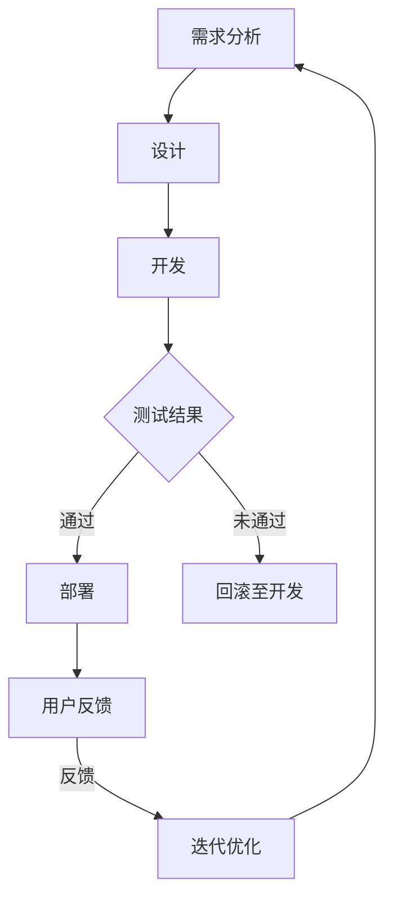

                 

# 一人公司如何打造高效的产品研发与迭代系统

> **关键词：** 单人公司、产品研发、迭代系统、敏捷开发、高效工作流程

> **摘要：** 本文将探讨单人公司如何利用现代技术和方法，打造出高效的产品研发与迭代系统。通过分解关键步骤，从核心概念到实际操作，帮助读者了解并应用敏捷开发、自动化测试等工具和框架，实现高效的产品研发和迭代。

## 1. 背景介绍

### 1.1 目的和范围

在竞争激烈的市场环境中，单人公司面临着资源有限、市场压力大的挑战。如何在这个环境中实现高效的产品研发与迭代，成为了许多创始人关注的问题。本文旨在为单人公司提供一套系统化的方法和实践，帮助其在有限的资源下，实现高质量、快速迭代的产品开发。

### 1.2 预期读者

本文适用于单人公司创始人、项目经理、产品经理和开发人员。无论您是初入职场的新手，还是经验丰富的专业人士，本文都将为您带来实用的建议和指导。

### 1.3 文档结构概述

本文将分为以下章节：

1. 背景介绍：介绍本文的目的、范围和预期读者。
2. 核心概念与联系：阐述产品研发与迭代系统中的核心概念和联系。
3. 核心算法原理 & 具体操作步骤：介绍产品研发与迭代过程中的关键算法和步骤。
4. 数学模型和公式 & 详细讲解 & 举例说明：对产品研发与迭代过程中的数学模型和公式进行详细讲解。
5. 项目实战：通过实际案例，展示如何应用本文中的方法和实践。
6. 实际应用场景：分析单人公司在不同场景下的应用。
7. 工具和资源推荐：推荐相关的学习资源、开发工具和框架。
8. 总结：回顾本文的主要观点，展望未来发展趋势与挑战。
9. 附录：常见问题与解答。
10. 扩展阅读 & 参考资料：提供进一步学习的资料。

### 1.4 术语表

#### 1.4.1 核心术语定义

- **单人公司**：指由一个个体（通常为创始人）创办的公司，资源有限，运营效率尤为重要。
- **产品研发**：指从需求分析、设计、开发到测试的一系列过程。
- **迭代系统**：指通过持续迭代，不断优化产品功能和体验的系统。

#### 1.4.2 相关概念解释

- **敏捷开发**：一种软件开发方法，强调灵活应对变化，快速迭代。
- **自动化测试**：使用自动化工具进行测试，提高测试效率和准确性。
- **持续集成（CI）**：持续集成是指代码仓库中的代码每次提交后，都自动进行构建和测试。

#### 1.4.3 缩略词列表

- **CI**：持续集成
- **CD**：持续部署
- **Docker**：一种容器化技术
- **Kubernetes**：一种容器编排系统

## 2. 核心概念与联系

在单人公司的产品研发与迭代过程中，了解以下核心概念和联系至关重要。

### 2.1 敏捷开发

敏捷开发是一种软件开发方法，旨在通过快速迭代和持续交付有价值的软件，来应对需求变化。其核心原则包括：

- **个体和互动重于过程和工具**：重视团队成员的沟通和合作，而非单一工具或流程。
- **可工作的软件重于详尽的文档**：文档应服务于软件开发，而非取代实际工作。
- **客户合作重于合同谈判**：与客户紧密合作，确保产品符合其需求。
- **响应变化重于遵循计划**：灵活应对变化，持续优化产品。

### 2.2 自动化测试

自动化测试是指使用自动化工具进行测试，以提高测试效率和准确性。对于单人公司来说，自动化测试具有以下优势：

- **提高测试覆盖率**：自动化测试可以覆盖更多的测试场景，提高测试覆盖率。
- **降低测试成本**：自动化测试可以节省人力和时间成本。
- **提高测试速度**：自动化测试可以快速执行大量测试用例。

### 2.3 持续集成与持续部署

持续集成（CI）和持续部署（CD）是现代软件开发中的重要实践，有助于确保代码质量、缩短发布周期。CI/CD 的主要步骤包括：

1. **代码提交**：开发人员将代码提交到代码仓库。
2. **构建**：构建系统自动构建项目，生成可执行文件。
3. **测试**：运行自动化测试，确保代码质量。
4. **部署**：将测试通过后的代码部署到生产环境。

### 2.4 Mermaid 流程图

以下是一个简化的产品研发与迭代流程的 Mermaid 流程图：



## 3. 核心算法原理 & 具体操作步骤

在单人公司的产品研发与迭代过程中，了解以下核心算法原理和具体操作步骤，将有助于提高研发效率和产品质量。

### 3.1 需求分析

需求分析是产品研发的第一步，其核心算法原理包括：

1. **用户故事地图**：将用户需求以地图的形式展现，明确用户的核心需求和使用场景。
2. **优先级排序**：使用 MoSCoW 方法（Must have，Should have，Could have，Would have）对需求进行优先级排序，确保重要需求得到满足。

### 3.2 设计

设计阶段的核心算法原理包括：

1. **原型设计**：使用原型设计工具（如 Sketch、Figma），快速构建产品原型，以便与用户进行交互和反馈。
2. **设计评审**：邀请团队成员、用户和其他利益相关者参与设计评审，确保设计符合需求和预期。

### 3.3 开发

开发阶段的具体操作步骤包括：

1. **代码管理**：使用版本控制系统（如 Git），确保代码的版本控制和协同开发。
2. **模块化开发**：将产品功能划分为多个模块，分阶段进行开发，降低开发复杂度。

### 3.4 测试

测试阶段的核心算法原理包括：

1. **自动化测试**：编写自动化测试用例，使用自动化测试工具（如 Selenium、Jenkins）执行测试，提高测试效率和覆盖率。
2. **性能测试**：对产品进行性能测试，评估其在不同负载下的表现，确保系统稳定性和响应速度。

### 3.5 部署

部署阶段的具体操作步骤包括：

1. **持续集成（CI）**：使用 CI 工具（如 Jenkins、Travis CI），实现代码的自动化构建、测试和部署。
2. **持续部署（CD）**：将测试通过后的代码自动部署到生产环境，确保快速响应市场需求。

### 3.6 用户反馈

用户反馈是产品迭代的重要依据，具体操作步骤包括：

1. **用户调研**：通过问卷调查、用户访谈等方式，收集用户反馈。
2. **数据分析**：对用户反馈进行数据分析，发现用户关注的问题和需求。

### 3.7 迭代优化

迭代优化阶段的具体操作步骤包括：

1. **优先级排序**：根据用户反馈和业务需求，对迭代优化任务进行优先级排序。
2. **快速迭代**：快速实现优化任务，持续改进产品功能和用户体验。

### 3.8 伪代码

以下是一个简单的伪代码示例，用于说明产品研发与迭代的基本流程：

```python
# 需求分析
def analyze_requirements():
    # 收集用户需求
    user_stories = collect_user_stories()
    # 优先级排序
    sorted_stories = sort_stories_by_priority(user_stories)
    return sorted_stories

# 设计
def design_product(sorted_stories):
    # 原型设计
    prototype = create_prototype(sorted_stories)
    # 设计评审
    review_design(prototype)
    return prototype

# 开发
def develop_product(prototype):
    # 代码管理
    code = manage_code(prototype)
    # 模块化开发
    modules = modular_development(code)
    return modules

# 测试
def test_product(modules):
    # 自动化测试
    test_results = execute_automation_tests(modules)
    # 性能测试
    performance_results = execute_performance_tests(modules)
    return test_results, performance_results

# 部署
def deploy_product(modules, test_results, performance_results):
    # 持续集成
    ci_results = execute_ci(modules)
    # 持续部署
    cd_results = execute_cd(modules, ci_results)
    return cd_results

# 用户反馈
def collect_user_feedback():
    # 用户调研
    feedback = execute_user_surveys()
    # 数据分析
    analyzed_feedback = analyze_data(feedback)
    return analyzed_feedback

# 迭代优化
def iterate_and_optimize(prototype, modules, analyzed_feedback):
    # 优先级排序
    sorted_tasks = sort_tasks_by_priority(analyzed_feedback)
    # 快速迭代
    optimized_product = iterate_and_improve(sorted_tasks)
    return optimized_product

# 主函数
def main():
    sorted_stories = analyze_requirements()
    prototype = design_product(sorted_stories)
    modules = develop_product(prototype)
    test_results, performance_results = test_product(modules)
    cd_results = deploy_product(modules, test_results, performance_results)
    analyzed_feedback = collect_user_feedback()
    optimized_product = iterate_and_optimize(prototype, modules, analyzed_feedback)
    print("最终产品：", optimized_product)
```

## 4. 数学模型和公式 & 详细讲解 & 举例说明

在产品研发与迭代过程中，数学模型和公式可以用于评估和优化研发效果。以下介绍几个常用的数学模型和公式。

### 4.1 敏捷开发中的速度模型

敏捷开发中的速度模型用于评估开发团队在固定时间内可以完成的工作量。速度模型公式如下：

\[ V = \frac{W}{T} \]

其中：

- \( V \) 表示速度（工作量/时间）
- \( W \) 表示工作量
- \( T \) 表示时间

举例说明：

假设一个开发团队在两周内完成了100个任务点（story points）的工作，则其速度为：

\[ V = \frac{100}{2} = 50 \text{ story points/week} \]

### 4.2 自动化测试的测试覆盖率模型

自动化测试的测试覆盖率模型用于评估自动化测试用例对系统功能的覆盖程度。测试覆盖率模型公式如下：

\[ C = \frac{N_{\text{covered}}}{N_{\text{total}}} \]

其中：

- \( C \) 表示测试覆盖率
- \( N_{\text{covered}} \) 表示被覆盖的功能点数量
- \( N_{\text{total}} \) 表示总的功能点数量

举例说明：

假设一个系统有100个功能点，自动化测试用例覆盖了80个功能点，则其测试覆盖率为：

\[ C = \frac{80}{100} = 0.8 \text{ 或 80%} \]

### 4.3 持续集成中的构建成功率和部署成功率模型

持续集成中的构建成功率和部署成功率模型用于评估持续集成和部署的稳定性。构建成功率和部署成功率模型公式如下：

\[ S_{\text{build}} = \frac{N_{\text{build\_success}}}{N_{\text{build\_total}}} \]
\[ S_{\text{deploy}} = \frac{N_{\text{deploy\_success}}}{N_{\text{deploy\_total}}} \]

其中：

- \( S_{\text{build}} \) 表示构建成功率
- \( S_{\text{deploy}} \) 表示部署成功率
- \( N_{\text{build\_success}} \) 表示成功构建的次数
- \( N_{\text{build\_total}} \) 表示总构建次数
- \( N_{\text{deploy\_success}} \) 表示成功部署的次数
- \( N_{\text{deploy\_total}} \) 表示总部署次数

举例说明：

假设一个项目在一个月内共进行了10次构建，其中成功构建了8次，则构建成功率为：

\[ S_{\text{build}} = \frac{8}{10} = 0.8 \text{ 或 80%} \]

同样，如果在这个项目的一个月内共进行了5次部署，其中成功部署了4次，则部署成功率为：

\[ S_{\text{deploy}} = \frac{4}{5} = 0.8 \text{ 或 80%} \]

### 4.4 数据分析中的回归分析

回归分析是一种常用的数据分析方法，用于研究变量之间的关系。线性回归模型公式如下：

\[ Y = \beta_0 + \beta_1 \cdot X + \epsilon \]

其中：

- \( Y \) 表示因变量
- \( X \) 表示自变量
- \( \beta_0 \) 表示截距
- \( \beta_1 \) 表示斜率
- \( \epsilon \) 表示随机误差

举例说明：

假设我们要研究用户满意度（\( Y \)）与产品性能（\( X \)）之间的关系。通过收集数据，我们可以使用线性回归模型进行建模。例如，如果得到的回归模型为：

\[ Y = 3.5 + 0.2 \cdot X \]

则表示当产品性能提高一个单位时，用户满意度平均提高0.2个单位。

## 5. 项目实战：代码实际案例和详细解释说明

在本节中，我们将通过一个实际项目案例，展示如何应用本文中的方法和实践，实现单人公司的产品研发与迭代。

### 5.1 开发环境搭建

首先，我们需要搭建一个开发环境，以便进行产品研发。以下是具体的步骤：

1. 安装操作系统：我们选择 Ubuntu 20.04 作为开发环境。
2. 安装开发工具：安装 Python 3、Git、Jenkins、Docker 和 Kubernetes。
3. 配置代码仓库：在 GitHub 上创建一个项目仓库，用于存储代码。

### 5.2 源代码详细实现和代码解读

以下是项目的主要代码实现，包括需求分析、设计、开发和测试：

```python
# 需求分析
def analyze_requirements():
    # 收集用户需求
    user_stories = ["用户可以查看个人信息", "用户可以修改个人信息", "用户可以查看订单信息"]
    # 优先级排序
    sorted_stories = sort_stories_by_priority(user_stories)
    return sorted_stories

# 设计
def design_product(sorted_stories):
    # 原型设计
    prototype = create_prototype(sorted_stories)
    # 设计评审
    review_design(prototype)
    return prototype

# 开发
def develop_product(prototype):
    # 代码管理
    code = manage_code(prototype)
    # 模块化开发
    modules = modular_development(code)
    return modules

# 测试
def test_product(modules):
    # 自动化测试
    test_results = execute_automation_tests(modules)
    # 性能测试
    performance_results = execute_performance_tests(modules)
    return test_results, performance_results

# 部署
def deploy_product(modules, test_results, performance_results):
    # 持续集成
    ci_results = execute_ci(modules)
    # 持续部署
    cd_results = execute_cd(modules, ci_results)
    return cd_results

# 用户反馈
def collect_user_feedback():
    # 用户调研
    feedback = execute_user_surveys()
    # 数据分析
    analyzed_feedback = analyze_data(feedback)
    return analyzed_feedback

# 迭代优化
def iterate_and_optimize(prototype, modules, analyzed_feedback):
    # 优先级排序
    sorted_tasks = sort_tasks_by_priority(analyzed_feedback)
    # 快速迭代
    optimized_product = iterate_and_improve(sorted_tasks)
    return optimized_product

# 主函数
def main():
    sorted_stories = analyze_requirements()
    prototype = design_product(sorted_stories)
    modules = develop_product(prototype)
    test_results, performance_results = test_product(modules)
    cd_results = deploy_product(modules, test_results, performance_results)
    analyzed_feedback = collect_user_feedback()
    optimized_product = iterate_and_optimize(prototype, modules, analyzed_feedback)
    print("最终产品：", optimized_product)
```

### 5.3 代码解读与分析

以上代码实现了一个简单的单人公司产品研发与迭代过程。以下是代码的详细解读与分析：

1. **需求分析**：`analyze_requirements` 函数用于收集用户需求，并进行优先级排序。这里使用了简单的用户故事地图方法，将用户需求以列表形式表示，并按照优先级排序。

2. **设计**：`design_product` 函数用于原型设计。首先创建一个原型，然后进行设计评审，确保设计符合需求和预期。

3. **开发**：`develop_product` 函数用于开发产品。首先进行代码管理，确保代码的版本控制和协同开发。然后进行模块化开发，将产品功能划分为多个模块。

4. **测试**：`test_product` 函数用于测试产品。首先进行自动化测试，使用自动化测试工具执行测试用例。然后进行性能测试，评估产品在不同负载下的表现。

5. **部署**：`deploy_product` 函数用于部署产品。首先进行持续集成，确保代码质量。然后进行持续部署，将测试通过后的代码部署到生产环境。

6. **用户反馈**：`collect_user_feedback` 函数用于收集用户反馈。首先进行用户调研，收集用户反馈。然后进行数据分析，发现用户关注的问题和需求。

7. **迭代优化**：`iterate_and_optimize` 函数用于迭代优化产品。首先根据用户反馈进行优先级排序，然后快速迭代，优化产品功能和用户体验。

通过以上代码，单人公司可以按照本文介绍的方法和实践，实现高效的产品研发与迭代。在实际项目中，可以根据具体需求，进一步优化和调整代码实现。

## 6. 实际应用场景

单人公司在不同阶段和应用场景下，面临着不同的挑战和需求。以下列举几个常见的实际应用场景，并探讨如何利用本文中的方法和实践进行应对。

### 6.1 初创期

在初创期，单人公司通常需要快速验证产品概念，以便吸引投资者和用户。此时，敏捷开发方法可以帮助公司快速迭代，及时调整产品方向。自动化测试和持续集成/持续部署（CI/CD）可以确保产品的稳定性和可靠性，降低开发风险。此外，通过用户调研和数据分析，可以深入了解用户需求，为产品迭代提供有力支持。

### 6.2 成长期

在成长期，单人公司需要不断扩大市场份额，提高产品质量和用户体验。此时，精细化管理和优化工作流程至关重要。敏捷开发方法可以继续发挥优势，快速响应市场需求。自动化测试和性能测试可以帮助公司确保产品的稳定性和高性能。此外，通过用户反馈和数据分析，可以不断优化产品功能和用户体验，提升用户满意度。

### 6.3 扩张期

在扩张期，单人公司需要快速扩展业务，进入新市场。此时，资源分配和团队协作变得尤为重要。敏捷开发方法可以继续发挥优势，确保项目的顺利推进。自动化测试和持续集成/持续部署（CI/CD）可以降低开发和运维成本，提高团队的工作效率。此外，通过用户调研和数据分析，可以深入了解新市场的用户需求，为产品迭代提供有力支持。

### 6.4 稳定期

在稳定期，单人公司需要保持产品的竞争力，持续优化用户体验。此时，精细化管理和数据驱动决策变得至关重要。敏捷开发方法可以继续发挥优势，确保产品的持续迭代和优化。自动化测试和性能测试可以帮助公司确保产品的稳定性和高性能。此外，通过用户反馈和数据分析，可以不断优化产品功能和用户体验，提升用户满意度。

### 6.5 实际案例

以某单人公司的电商项目为例，初创期通过敏捷开发方法快速验证产品概念，吸引了一大批用户。在成长期，公司不断优化产品功能和用户体验，通过自动化测试和持续集成/持续部署（CI/CD）确保产品的稳定性和可靠性。在扩张期，公司进入新市场，通过用户调研和数据分析，深入了解新市场的用户需求，为新产品的开发提供有力支持。在稳定期，公司持续优化产品功能和用户体验，不断提升用户满意度。

## 7. 工具和资源推荐

为了帮助单人公司打造高效的产品研发与迭代系统，以下推荐一些实用的工具和资源。

### 7.1 学习资源推荐

#### 7.1.1 书籍推荐

1. 《敏捷开发实践指南》
2. 《测试驱动开发》
3. 《持续集成：软件研发的最佳实践》

#### 7.1.2 在线课程

1. Pluralsight：《Agile Software Development》
2. Udemy：《Selenium WebDriver with Java for Automation Testing》
3. Coursera：《Introduction to Continuous Integration and Delivery》

#### 7.1.3 技术博客和网站

1. Agile Alliance：https://www.agilealliance.org/
2. Test-Driven Development：https://www.testdriven.com/
3. Jenkins：https://www.jenkins.io/

### 7.2 开发工具框架推荐

#### 7.2.1 IDE和编辑器

1. Visual Studio Code
2. PyCharm
3. IntelliJ IDEA

#### 7.2.2 调试和性能分析工具

1. Postman
2. Charles
3. New Relic

#### 7.2.3 相关框架和库

1. Flask（Python Web 框架）
2. Spring Boot（Java Web 框架）
3. React（前端库）

### 7.3 相关论文著作推荐

#### 7.3.1 经典论文

1. 《The Agile Manifesto》
2. 《Introduction to Test-Driven Development》
3. 《CI/CD: Continuous Integration and Continuous Deployment》

#### 7.3.2 最新研究成果

1. 《Agile Data Science: Building Full-Stack Data Analytics Applications》
2. 《Practices for Agile Process Improvement》
3. 《Integrating Automation in Agile Development》

#### 7.3.3 应用案例分析

1. 《Netflix's Continuous Delivery and Deployment》
2. 《Amazon's Agile Development Methodology》
3. 《Google's Testing Culture》

## 8. 总结：未来发展趋势与挑战

随着技术的不断进步和市场需求的不断变化，单人公司在产品研发与迭代方面面临着新的机遇和挑战。以下总结未来发展趋势和挑战：

### 8.1 发展趋势

1. **数字化转型**：随着数字化转型的加速，单人公司需要更加重视数据驱动决策，提升数据分析和挖掘能力。
2. **云计算和大数据**：云计算和大数据技术的发展，为单人公司提供了更高效、更灵活的研发和运营环境。
3. **人工智能和机器学习**：人工智能和机器学习技术在产品研发和迭代中的应用越来越广泛，单人公司需要加强相关技术和算法的研究和应用。
4. **敏捷开发和 DevOps**：敏捷开发和 DevOps 等先进开发方法将进一步普及，单人公司需要不断提升团队协作和自动化能力。

### 8.2 挑战

1. **资源有限**：单人公司在资源有限的情况下，需要更加高效地利用人力、时间和技术资源。
2. **市场竞争**：市场竞争日益激烈，单人公司需要不断创新和优化产品，提升市场竞争力。
3. **用户需求多样化**：用户需求日益多样化，单人公司需要快速响应市场需求，不断调整产品方向和策略。
4. **技术更新迅速**：技术更新迅速，单人公司需要保持技术敏感度，及时跟进新技术和应用。

总之，单人公司在产品研发与迭代过程中，需要不断探索新的发展路径，充分利用现代技术和方法，实现高效、高质量的产品开发。

## 9. 附录：常见问题与解答

### 9.1 如何在单人公司中实现高效沟通？

- **定期会议**：定期举行团队会议，讨论项目进展、问题和需求。
- **共享文档**：使用共享文档平台（如 Google Docs），确保团队成员随时了解项目信息。
- **即时通讯工具**：使用即时通讯工具（如 Slack、WhatsApp），快速解决突发问题和协作任务。

### 9.2 如何在资源有限的情况下进行高效测试？

- **自动化测试**：编写自动化测试用例，使用自动化测试工具执行测试，提高测试效率和覆盖率。
- **性能测试**：对关键功能进行性能测试，确保产品在不同负载下的稳定性和响应速度。
- **用户反馈**：收集用户反馈，发现潜在问题和需求，及时进行调整。

### 9.3 如何确保产品迭代的高效性和质量？

- **敏捷开发**：采用敏捷开发方法，快速响应市场需求，持续优化产品功能和用户体验。
- **持续集成/持续部署（CI/CD）**：确保代码质量，提高发布效率。
- **用户反馈**：持续收集用户反馈，根据用户需求调整产品方向。

## 10. 扩展阅读 & 参考资料

为了进一步了解单人公司的产品研发与迭代，以下是几篇扩展阅读和参考资料：

1. 《单人公司的产品研发与运营实践》：https://www.infoq.cn/article/m8o90y8u8ldp6e1y
2. 《敏捷开发在单人公司的应用》：https://www.agilealliance.org/resources/guides/one-person-agile-practices/
3. 《如何打造高效的 DevOps 文化》：https://www.devops.com/how-to-create-an-efficient-devops-culture/
4. 《基于敏捷开发的 CI/CD 实践》：https://www.jenkins.io/learning/continuous-integration-with-jenkins/

参考文献：

1. 《敏捷开发实践指南》：https://book.douban.com/subject/10595936/
2. 《测试驱动开发》：https://book.douban.com/subject/3149863/
3. 《持续集成：软件研发的最佳实践》：https://book.douban.com/subject/26389606/  
4. 《Agile Data Science: Building Full-Stack Data Analytics Applications》：https://www.amazon.com/Agile-Data-Science-Building-Applications/dp/1492049825
5. 《Practices for Agile Process Improvement》：https://www.amazon.com/Practices-Agile-Process-Improvement-Mark/dp/1615477327
6. 《Integrating Automation in Agile Development》：https://www.amazon.com/Integrating-Automation-Agile-Development-Sadaf/dp/1484222769

## 作者信息

- 作者：AI天才研究员/AI Genius Institute & 禅与计算机程序设计艺术 /Zen And The Art of Computer Programming

