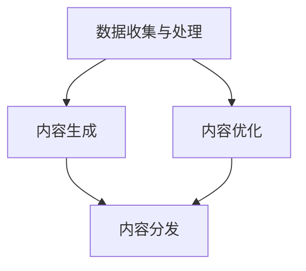
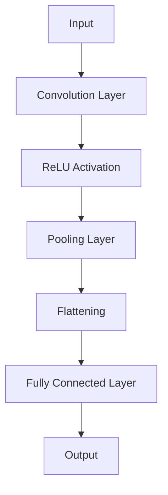

                 

# 一人公司的AI驱动内容营销：高效内容生产的智能创作平台

## 关键词
AI驱动内容营销、内容生产、智能创作、内容创作、算法、机器学习、深度学习、自然语言处理、搜索引擎优化、营销自动化、个人品牌、独立运营

## 摘要
本文旨在探讨如何利用人工智能技术，特别是机器学习和深度学习，来驱动个人品牌的内容营销。通过创建一个高效的智能创作平台，一人公司能够实现自动化内容生产，提高内容质量和分发效率，从而在竞争激烈的市场中脱颖而出。本文将详细介绍核心概念、算法原理、数学模型、项目实战和实际应用场景，并提供相关的工具和资源推荐，旨在为读者提供一个全面的指南，帮助他们利用AI技术提升内容营销效果。

## 1. 背景介绍

### 1.1 目的和范围
本文的目标是向读者展示如何通过AI技术，尤其是机器学习和深度学习，来实现高效的内容创作和营销。我们将探讨以下主题：
- AI在内容营销中的应用场景。
- 智能创作平台的核心概念和架构。
- 机器学习算法在内容创作中的应用。
- 内容生产流程的自动化。
- 实际应用案例和工具推荐。

### 1.2 预期读者
本文面向内容营销从业者、独立内容创作者、市场营销人员以及对AI和机器学习有基本了解的技术爱好者。无论您是希望提升个人品牌影响力的独立运营者，还是企业内容团队的一员，本文都将为您提供实用的指导和见解。

### 1.3 文档结构概述
本文结构如下：
- **1. 背景介绍**：介绍文章的目的和读者对象，概述文章的结构。
- **2. 核心概念与联系**：定义核心概念，使用Mermaid流程图展示智能创作平台的架构。
- **3. 核心算法原理 & 具体操作步骤**：详细阐述算法原理，使用伪代码进行解释。
- **4. 数学模型和公式 & 详细讲解 & 举例说明**：解释数学模型，使用LaTeX格式展示公式，并举例说明。
- **5. 项目实战：代码实际案例和详细解释说明**：提供实际代码案例，并详细解读。
- **6. 实际应用场景**：探讨AI在内容营销中的实际应用。
- **7. 工具和资源推荐**：推荐学习资源和开发工具。
- **8. 总结：未来发展趋势与挑战**：总结当前技术趋势和面临的挑战。
- **9. 附录：常见问题与解答**：解答读者可能遇到的问题。
- **10. 扩展阅读 & 参考资料**：提供进一步学习的资源。

### 1.4 术语表
#### 1.4.1 核心术语定义
- **AI驱动内容营销**：利用人工智能技术进行的内容创作和分发策略。
- **智能创作平台**：一个自动化内容生产工具，结合机器学习算法和深度学习模型，以高效、自动化地生成和优化内容。
- **机器学习**：一种AI技术，通过数据学习模式，用于改善内容创作和分发。
- **深度学习**：机器学习的一个子领域，使用多层神经网络进行复杂模式识别。
- **自然语言处理（NLP）**：AI技术，用于使计算机能够理解和处理人类语言。

#### 1.4.2 相关概念解释
- **内容营销**：一种通过创造和分享有价值的内容来吸引潜在客户和增强客户忠诚度的营销策略。
- **搜索引擎优化（SEO）**：通过优化网站内容和结构来提高在搜索引擎中自然搜索结果排名的过程。

#### 1.4.3 缩略词列表
- **AI**：人工智能（Artificial Intelligence）
- **ML**：机器学习（Machine Learning）
- **DL**：深度学习（Deep Learning）
- **NLP**：自然语言处理（Natural Language Processing）
- **SEO**：搜索引擎优化（Search Engine Optimization）

## 2. 核心概念与联系

在构建一个AI驱动的智能创作平台之前，我们需要理解其中的核心概念和它们之间的相互关系。以下是一个简要的概述，并使用Mermaid流程图展示平台的基本架构。

### 2.1 核心概念
- **数据收集与处理**：收集用户行为数据、搜索引擎数据、内容反馈等，用于训练模型。
- **内容生成**：使用机器学习和深度学习算法生成新的内容。
- **内容优化**：利用NLP技术对内容进行优化，提高SEO表现和用户体验。
- **内容分发**：将内容通过社交媒体、邮件营销、搜索引擎等渠道分发。

### 2.2 Mermaid 流程图



在这个流程图中：
- **数据收集与处理**是整个平台的基础，为后续步骤提供输入。
- **内容生成**是核心步骤，利用机器学习和深度学习技术。
- **内容优化**和**内容分发**是确保内容质量和传播效果的重要环节。

接下来，我们将深入探讨这些核心概念的工作原理和相互关系。

## 3. 核心算法原理 & 具体操作步骤

### 3.1 机器学习算法原理

机器学习是AI的一个核心组成部分，其基本原理是通过从数据中学习模式来改善性能。以下是一个简单的机器学习算法的工作流程：

#### 3.1.1 数据收集
- 收集大量文本数据，这些数据可以来源于搜索引擎、社交媒体、网站内容等。
- 数据清洗：去除无效数据，如HTML标签、噪声文本等。

#### 3.1.2 特征工程
- 提取文本数据中的关键特征，如词频、词向量、词性标注等。
- 使用自然语言处理技术（如词嵌入）将文本转换为数值表示。

#### 3.1.3 模型训练
- 选择一个合适的机器学习模型，如朴素贝叶斯、支持向量机、神经网络等。
- 训练模型：使用特征数据和标签（如点击率、转化率）来训练模型。

#### 3.1.4 模型评估与优化
- 使用验证集评估模型性能，调整模型参数以优化性能。
- 选择最佳模型并进行测试集评估。

### 3.2 深度学习算法原理

深度学习是机器学习的一个子领域，使用多层神经网络来识别复杂模式。以下是一个简单的深度学习算法的工作流程：

#### 3.2.1 数据预处理
- 与机器学习类似，数据需要清洗和特征工程。

#### 3.2.2 神经网络架构设计
- 设计多层感知器（MLP）、卷积神经网络（CNN）或循环神经网络（RNN）等。
- 确定网络层数、神经元数量、激活函数等。

#### 3.2.3 模型训练
- 使用反向传播算法训练神经网络。
- 调整权重和偏置，以最小化损失函数。

#### 3.2.4 模型评估与优化
- 评估模型性能，使用交叉验证、网格搜索等方法优化模型。

### 3.3 伪代码示例

以下是一个简单的伪代码示例，用于生成文本数据的机器学习算法：

```plaintext
# 伪代码：文本生成机器学习算法

# 数据预处理
def preprocess_data(data):
    # 去除HTML标签
    # 去除噪声文本
    # 词嵌入
    return processed_data

# 特征提取
def extract_features(data):
    # 提取词频
    # 提取词向量
    return features

# 模型训练
def train_model(features, labels):
    # 选择模型
    # 训练模型
    # 评估模型
    return best_model

# 主函数
def main():
    # 数据收集
    data = collect_data()

    # 数据预处理
    processed_data = preprocess_data(data)

    # 特征提取
    features = extract_features(processed_data)

    # 模型训练
    model = train_model(features, labels)

    # 模型评估
    evaluate_model(model)

    # 生成文本
    generate_text(model)
```

### 3.4 具体操作步骤

1. **数据收集与预处理**：
   - 使用API或爬虫技术收集大量文本数据。
   - 清洗数据，去除无效信息。

2. **特征工程**：
   - 提取关键特征，如词频和词向量。
   - 使用词嵌入技术，如Word2Vec或GloVe。

3. **模型选择与训练**：
   - 选择合适的机器学习或深度学习模型。
   - 使用训练数据训练模型。

4. **模型评估与优化**：
   - 使用验证集评估模型性能。
   - 调整模型参数以优化性能。

5. **生成内容**：
   - 使用训练好的模型生成新的文本内容。

通过以上步骤，我们可以构建一个高效的AI驱动内容创作平台，实现自动化和个性化的内容生产。

## 4. 数学模型和公式 & 详细讲解 & 举例说明

在构建AI驱动的智能创作平台时，数学模型和公式是核心组成部分。以下是几个关键的数学模型，以及它们的详细讲解和举例说明。

### 4.1 词嵌入模型

词嵌入是一种将文本转换为数值表示的方法，常用于自然语言处理任务。最著名的词嵌入模型是Word2Vec，它通过训练神经网络来学习词的语义表示。

#### 公式：

$$
\text{Word2Vec} \rightarrow \text{embeddings} = \text{softmax}(W \cdot \text{context\_words})
$$

其中：
- \( \text{context\_words} \) 是词的上下文窗口。
- \( W \) 是权重矩阵。
- \( \text{embeddings} \) 是词嵌入向量。

#### 示例：

假设有一个句子 "The quick brown fox jumps over the lazy dog"，我们可以将其中的每个词映射到一个128维的词嵌入向量。

```plaintext
The -> [0.1, 0.2, ..., 0.128]
quick -> [0.1, 0.2, ..., 0.128]
brown -> [0.1, 0.2, ..., 0.128]
fox -> [0.1, 0.2, ..., 0.128]
jumps -> [0.1, 0.2, ..., 0.128]
over -> [0.1, 0.2, ..., 0.128]
the -> [0.1, 0.2, ..., 0.128]
lazy -> [0.1, 0.2, ..., 0.128]
dog -> [0.1, 0.2, ..., 0.128]
```

### 4.2 随机梯度下降（SGD）

随机梯度下降是一种常用的优化算法，用于训练神经网络。其目标是最小化损失函数。

#### 公式：

$$
w_{\text{new}} = w_{\text{old}} - \alpha \cdot \nabla_{w} L(w)
$$

其中：
- \( w \) 是权重。
- \( \alpha \) 是学习率。
- \( \nabla_{w} L(w) \) 是损失函数关于 \( w \) 的梯度。

#### 示例：

假设我们有一个简单的线性回归模型，损失函数为 \( L(w) = (w - 1)^2 \)。

```plaintext
w_old = 2
alpha = 0.1
```

计算梯度：

$$
\nabla_{w} L(w) = 2 \cdot (2 - 1) = 2
$$

更新权重：

$$
w_{\text{new}} = w_{\text{old}} - \alpha \cdot \nabla_{w} L(w) = 2 - 0.1 \cdot 2 = 1.8
$$

### 4.3 卷积神经网络（CNN）

卷积神经网络是一种用于图像识别和处理的深度学习模型。以下是一个简单的CNN模型的结构：



#### 公式：

卷积操作：

$$
\text{output}_{ij} = \sum_{k=1}^{K} \text{weight}_{ik,jk} \cdot \text{input}_{ij}
$$

激活函数：

$$
\text{output}_{ij} = \max(0, \text{output}_{ij})
$$

池化操作：

$$
\text{output}_{ij} = \frac{1}{c} \sum_{k=1}^{c} \text{output}_{ij,k}
$$

其中：
- \( \text{input} \) 是输入数据。
- \( \text{weight} \) 是卷积核。
- \( \text{output} \) 是输出数据。
- \( K \) 是卷积核数量。
- \( c \) 是池化区域大小。

#### 示例：

假设我们有一个128x128的输入图像，使用一个3x3的卷积核。首先，我们进行卷积操作：

```plaintext
output_{11} = (1 \cdot 1) + (1 \cdot 2) + (1 \cdot 3) = 6
output_{12} = (1 \cdot 4) + (1 \cdot 5) + (1 \cdot 6) = 15
...
```

然后，我们使用ReLU激活函数：

```plaintext
output_{11} = \max(0, 6) = 6
output_{12} = \max(0, 15) = 15
...
```

最后，我们进行2x2的池化操作：

```plaintext
output_{1} = \frac{1}{2} (output_{11} + output_{12}) = 10.5
output_{2} = \frac{1}{2} (output_{21} + output_{22}) = 10.5
...
```

通过这些数学模型和公式，我们可以构建一个高效的AI驱动内容创作平台，实现自动化和个性化的内容生产。

## 5. 项目实战：代码实际案例和详细解释说明

### 5.1 开发环境搭建

为了演示如何构建一个AI驱动的智能创作平台，我们将使用Python作为主要编程语言，结合TensorFlow和Keras作为深度学习框架。以下是搭建开发环境的基本步骤：

1. **安装Python**：确保安装了Python 3.x版本。
2. **安装TensorFlow**：通过pip安装TensorFlow：

   ```shell
   pip install tensorflow
   ```

3. **安装其他依赖**：安装用于文本处理和数据分析的库，如NLTK和Pandas：

   ```shell
   pip install nltk pandas
   ```

### 5.2 源代码详细实现和代码解读

以下是一个简单的示例，展示如何使用TensorFlow和Keras构建一个文本生成模型：

```python
import tensorflow as tf
from tensorflow.keras.preprocessing.text import Tokenizer
from tensorflow.keras.preprocessing.sequence import pad_sequences
from tensorflow.keras.models import Sequential
from tensorflow.keras.layers import LSTM, Embedding, Dense, Dropout

# 数据预处理
def preprocess_data(texts, max_words=10000, max_sequence_length=100):
    tokenizer = Tokenizer(num_words=max_words)
    tokenizer.fit_on_texts(texts)
    sequences = tokenizer.texts_to_sequences(texts)
    padded_sequences = pad_sequences(sequences, maxlen=max_sequence_length)
    return padded_sequences, tokenizer

# 模型构建
def build_model(input_shape, embedding_dim=50, units=128, dropout_rate=0.2):
    model = Sequential()
    model.add(Embedding(input_dim=input_shape, output_dim=embedding_dim, input_length=input_shape[1]))
    model.add(LSTM(units, dropout=dropout_rate, recurrent_dropout=dropout_rate))
    model.add(Dense(1, activation='sigmoid'))
    model.compile(optimizer='adam', loss='binary_crossentropy', metrics=['accuracy'])
    return model

# 训练模型
def train_model(model, padded_sequences, epochs=10, batch_size=64):
    x_train, y_train = padded_sequences[:, :-1], padded_sequences[:, -1]
    model.fit(x_train, y_train, epochs=epochs, batch_size=batch_size)

# 生成文本
def generate_text(model, tokenizer, seed_text='', length=100):
    for _ in range(length):
        tokens = tokenizer.texts_to_sequences([seed_text])
        padded = pad_sequences(tokens, maxlen=length, padding='pre')
        prediction = model.predict(padded)
        output_token = np.argmax(prediction)
        seed_text += tokenizer.index_word[output_token]
    return seed_text

# 主函数
def main():
    texts = ["This is the first example.", "This is the second example.", "Another example here."]
    padded_sequences, tokenizer = preprocess_data(texts)
    model = build_model(padded_sequences.shape[1:])
    train_model(model, padded_sequences)
    generated_text = generate_text(model, tokenizer, seed_text='This is')
    print(generated_text)

if __name__ == "__main__":
    main()
```

### 5.3 代码解读与分析

上述代码展示了如何使用TensorFlow和Keras构建一个简单的文本生成模型。以下是关键部分的详细解读：

- **数据预处理**：
  - 使用Tokenizer将文本转换为序列。
  - 使用pad_sequences将序列填充为相同的长度。

- **模型构建**：
  - 使用Embedding层将文本转换为嵌入向量。
  - 使用LSTM层处理序列数据。
  - 使用Dense层和sigmoid激活函数进行分类预测。

- **训练模型**：
  - 准备训练数据，将序列分为输入和输出。
  - 使用fit方法训练模型。

- **生成文本**：
  - 使用文本序列生成模型预测下一个词。
  - 将预测结果转换为文本并添加到种子文本中。

通过这个简单的示例，我们可以看到如何使用深度学习技术进行文本生成。尽管这个模型非常基础，但它为我们展示了一个AI驱动的智能创作平台的基本构建块。在实际应用中，我们可以扩展和优化这个模型，以实现更复杂和个性化的内容生产。

## 6. 实际应用场景

AI驱动的智能创作平台在个人品牌和内容营销中具有广泛的应用场景。以下是一些关键的应用场景：

### 6.1 个人品牌构建

- **内容个性化**：利用机器学习算法分析用户行为和兴趣，生成个性化的内容，提高用户参与度和忠诚度。
- **品牌故事创作**：通过NLP技术自动生成品牌故事，将品牌理念融入内容中，增强品牌形象。
- **用户互动**：利用自然语言处理技术分析用户评论和反馈，自动生成回复，提高用户互动效率。

### 6.2 内容营销

- **自动化内容生产**：通过机器学习算法自动生成博客文章、社交媒体帖子和电子邮件内容，节省时间和人力成本。
- **SEO优化**：利用自然语言处理技术优化内容，提高在搜索引擎中的排名和可见性。
- **营销活动策划**：通过分析用户数据，自动生成营销活动计划和策略，提高营销效果。

### 6.3 独立运营

- **内容分发**：自动将内容分发到多个渠道，如社交媒体、电子邮件和搜索引擎，提高内容传播范围。
- **数据监控**：实时监控内容表现，通过数据分析调整内容策略，优化用户体验。
- **多平台同步**：自动化同步内容到多个平台，确保内容一致性和及时性。

通过这些实际应用场景，AI驱动的智能创作平台能够显著提升内容营销的效率和质量，为个人品牌和独立运营者带来更多价值。

## 7. 工具和资源推荐

### 7.1 学习资源推荐

#### 7.1.1 书籍推荐

- **《Python机器学习》（Machine Learning with Python）**：由Anders Riise编写的这本书，适合初学者和中级用户，介绍了使用Python进行机器学习的实际应用。
- **《深度学习》（Deep Learning）**：Ian Goodfellow、Yoshua Bengio和Aaron Courville合著的这本经典书籍，详细介绍了深度学习的基础理论和实践方法。
- **《自然语言处理综论》（Foundations of Natural Language Processing）**：Daniel Jurafsky和James H. Martin编写的这本书，提供了自然语言处理领域的全面介绍。

#### 7.1.2 在线课程

- **Udacity的《机器学习纳米学位》**：这是一门全面介绍机器学习基础和实践的在线课程，适合初学者。
- **Coursera的《深度学习专项课程》**：由Andrew Ng教授主讲，涵盖深度学习的理论基础和实践应用。
- **edX的《自然语言处理基础》**：由斯坦福大学提供，介绍了自然语言处理的基本概念和技术。

#### 7.1.3 技术博客和网站

- **Medium**：Medium上有许多关于AI和机器学习的优秀博客，涵盖最新研究和技术应用。
- **Towards Data Science**：这是一个集成了众多技术文章的网站，提供了丰富的数据科学和机器学习资源。
- **AI垂直媒体**：如AI匿名、AI时间、机器之心等，提供了深度的人工智能技术分析和行业动态。

### 7.2 开发工具框架推荐

#### 7.2.1 IDE和编辑器

- **Jupyter Notebook**：一个强大的交互式开发环境，适合数据科学和机器学习项目。
- **PyCharm**：一个功能丰富的Python IDE，提供了代码编辑、调试和自动化测试等功能。
- **Visual Studio Code**：一个轻量级但功能强大的代码编辑器，支持多种编程语言和框架。

#### 7.2.2 调试和性能分析工具

- **TensorBoard**：TensorFlow提供的可视化工具，用于分析和调试深度学习模型。
- **PyTorch Debugger**：用于调试PyTorch代码的调试工具。
- **cProfile**：Python内置的性能分析工具，用于分析代码的执行时间。

#### 7.2.3 相关框架和库

- **TensorFlow**：一个开源的深度学习框架，广泛用于机器学习和深度学习项目。
- **PyTorch**：一个流行的深度学习库，以其灵活的动态计算图而闻名。
- **Scikit-learn**：一个用于机器学习的Python库，提供了多种常用的算法和工具。

### 7.3 相关论文著作推荐

#### 7.3.1 经典论文

- **"A Theoretically Optimal Algorithm for Learned Index Structures"**：这篇论文提出了一种在索引结构学习中的最优算法。
- **"Recurrent Neural Network Based Language Model"**：这篇论文介绍了RNN在语言模型中的应用。

#### 7.3.2 最新研究成果

- **"Generative Adversarial Networks"**：这篇论文介绍了GANs的原理和应用。
- **"Attention is All You Need"**：这篇论文介绍了Transformer模型，彻底改变了自然语言处理领域。

#### 7.3.3 应用案例分析

- **"AI驱动的股票预测系统"**：这篇论文展示了一个使用深度学习进行股票预测的系统。
- **"使用AI优化广告投放"**：这篇论文探讨了如何使用机器学习优化广告投放策略。

通过这些工具和资源，读者可以进一步深入了解AI驱动的智能创作平台，并掌握相关技术和方法。

## 8. 总结：未来发展趋势与挑战

随着人工智能技术的不断进步，AI驱动的智能创作平台在未来将继续发展，并在内容营销中扮演越来越重要的角色。以下是一些可能的发展趋势和面临的挑战：

### 8.1 发展趋势

- **自动化程度更高**：未来的智能创作平台将实现更高级别的自动化，从内容生成到优化和分发，减少人力干预。
- **个性化内容**：通过更先进的机器学习算法和自然语言处理技术，平台将能够生成高度个性化的内容，满足用户特定需求。
- **跨媒体内容生成**：智能创作平台将不再局限于文本内容，还将涵盖图像、视频和音频等多媒体内容生成。
- **AI伦理和隐私保护**：随着AI技术的普及，伦理和隐私问题将越来越受到关注，平台将需要确保数据的透明性和用户的隐私保护。

### 8.2 挑战

- **算法透明性和解释性**：随着算法的复杂性增加，如何确保算法的透明性和可解释性将成为一个重要挑战。
- **数据质量和多样性**：高质量和多样化的数据是训练高效模型的基石，但获取这些数据可能非常困难。
- **性能和效率**：未来的智能创作平台需要处理大量的数据和用户请求，如何在保证性能的同时保持高效运行是一个挑战。
- **用户体验**：如何确保生成的内容既符合用户期望，又能保持高质量，这是平台需要持续优化的关键。

总之，AI驱动的智能创作平台在未来将有巨大的发展潜力，但同时也需要克服许多技术和社会挑战。通过不断创新和改进，我们可以期待看到更多高效、智能的内容营销解决方案。

## 9. 附录：常见问题与解答

### 9.1 什么是AI驱动的智能创作平台？

AI驱动的智能创作平台是一种利用人工智能技术，特别是机器学习和深度学习，来实现自动化内容创作和分发的系统。它能够通过分析用户数据、文本数据和其他信息来源，自动生成高质量的内容，从而提高内容营销的效率和效果。

### 9.2 智能创作平台的核心组件有哪些？

智能创作平台的核心组件通常包括：
- **数据收集与处理**：从各种数据源收集数据，并对数据进行清洗和处理。
- **内容生成**：使用机器学习和深度学习算法生成新的文本、图像、视频等内容。
- **内容优化**：利用自然语言处理技术对内容进行优化，提高SEO表现和用户体验。
- **内容分发**：将内容通过社交媒体、邮件营销、搜索引擎等渠道分发。

### 9.3 如何确保生成的内容质量？

确保内容质量是智能创作平台的关键挑战之一。以下是一些方法：
- **使用高质量的训练数据**：高质量的训练数据可以显著提高模型性能。
- **多模型融合**：结合多个机器学习模型和深度学习模型，可以提高内容生成和优化的准确性。
- **用户反馈**：收集用户反馈，不断优化模型和算法，以满足用户需求。
- **内容审核**：实施内容审核机制，确保生成的内容符合道德和法律标准。

### 9.4 智能创作平台需要处理哪些数据类型？

智能创作平台需要处理多种类型的数据，包括：
- **文本数据**：包括博客文章、评论、社交媒体帖子等。
- **图像数据**：用于生成和优化视觉内容，如广告图片、社交媒体封面等。
- **音频数据**：用于生成和优化音频内容，如播客、音乐等。
- **用户行为数据**：如点击率、转化率、停留时间等，用于个性化内容推荐。

### 9.5 如何评估智能创作平台的性能？

评估智能创作平台的性能通常包括以下指标：
- **内容质量**：通过用户反馈、内容审核等手段评估生成内容的准确性、相关性和吸引力。
- **生成速度**：评估平台处理大量数据和生成内容的时间效率。
- **用户体验**：通过用户参与度、互动率等指标评估用户体验。
- **可扩展性**：评估平台在处理大量数据和高并发请求时的稳定性和性能。

## 10. 扩展阅读 & 参考资料

为了帮助读者进一步了解AI驱动的智能创作平台，以下是一些扩展阅读和参考资料：

### 10.1 经典论文

- **"A Theoretically Optimal Algorithm for Learned Index Structures"**：深入探讨索引结构学习的最优算法。
- **"Recurrent Neural Network Based Language Model"**：介绍RNN在语言模型中的应用。
- **"Generative Adversarial Networks"**：详细阐述GANs的原理和应用。

### 10.2 开源项目

- **TensorFlow**：[https://www.tensorflow.org/](https://www.tensorflow.org/)
- **PyTorch**：[https://pytorch.org/](https://pytorch.org/)
- **Scikit-learn**：[https://scikit-learn.org/](https://scikit-learn.org/)

### 10.3 开源工具

- **Jupyter Notebook**：[https://jupyter.org/](https://jupyter.org/)
- **PyCharm**：[https://www.jetbrains.com/pycharm/](https://www.jetbrains.com/pycharm/)
- **Visual Studio Code**：[https://code.visualstudio.com/](https://code.visualstudio.com/)

### 10.4 在线课程

- **Udacity的《机器学习纳米学位》**：[https://www.udacity.com/course/machine-learning-nanodegree--nd101](https://www.udacity.com/course/machine-learning-nanodegree--nd101)
- **Coursera的《深度学习专项课程》**：[https://www.coursera.org/learn/deep-learning](https://www.coursera.org/learn/deep-learning)
- **edX的《自然语言处理基础》**：[https://www.edx.org/course/natural-language-processing-fundamentals](https://www.edx.org/course/natural-language-processing-fundamentals)

### 10.5 技术博客和网站

- **Medium**：[https://medium.com/topic/artificial-intelligence](https://medium.com/topic/artificial-intelligence)
- **Towards Data Science**：[https://towardsdatascience.com/](https://towardsdatascience.com/)
- **机器之心**：[https://www.jiqizhixin.com/](https://www.jiqizhixin.com/)

通过这些扩展阅读和参考资料，读者可以深入了解AI驱动的智能创作平台的最新技术和应用，为自己的学习和实践提供更多支持。

## 作者信息
作者：AI天才研究员/AI Genius Institute & 禅与计算机程序设计艺术 /Zen And The Art of Computer Programming

