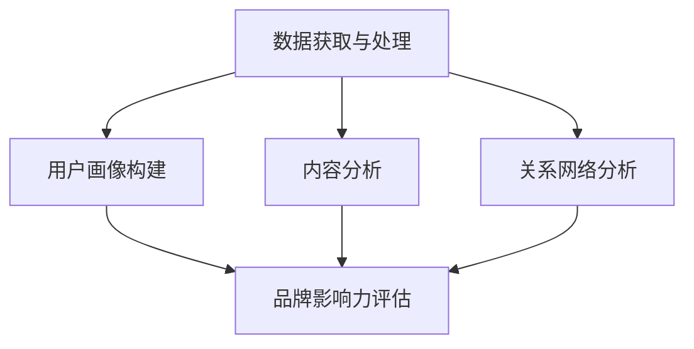

                 

# 一人公司的AI驱动社交媒体分析：提升品牌影响力的数据洞察工具

> **关键词**：社交媒体分析、AI、品牌影响力、数据洞察、算法原理、数学模型、实战案例、开发工具、未来趋势
> 
> **摘要**：本文将探讨如何利用人工智能技术，构建一套高效的社交媒体分析工具，以提升个人品牌影响力。通过详细解析核心算法原理、数学模型、实际操作步骤，并结合实战案例，深入剖析如何通过数据洞察，实现品牌影响力的提升。文章最后还将对相关工具和资源进行推荐，帮助读者更好地理解和应用所学知识。

## 1. 背景介绍

### 1.1 目的和范围

在当今社交媒体高度发达的时代，个人品牌的建设变得尤为重要。无论是企业高管、创业者，还是自由职业者，都需要通过社交媒体来提升自己的影响力。本文旨在探讨如何利用人工智能技术，构建一套高效的社交媒体分析工具，帮助个人用户更好地了解自身品牌影响力，并制定相应的提升策略。

本文将围绕以下几个核心问题展开：

1. 人工智能在社交媒体分析中的应用原理。
2. 如何构建一套数据驱动的社交媒体分析工具。
3. 如何通过算法和数学模型，实现品牌影响力的精准评估。
4. 实际操作步骤和实战案例分享。

### 1.2 预期读者

本文适合以下读者群体：

1. 对人工智能和社交媒体分析有兴趣的技术爱好者。
2. 想提升个人品牌影响力的企业高管、创业者。
3. 涉足社交媒体领域，希望深入了解数据驱动营销的个人用户。
4. 计算机科学、数据分析等相关专业的研究生和本科生。

### 1.3 文档结构概述

本文分为以下八个部分：

1. 背景介绍：介绍本文的目的、范围、预期读者和文档结构。
2. 核心概念与联系：讲解社交媒体分析的核心概念和联系，展示相关架构图。
3. 核心算法原理 & 具体操作步骤：详细阐述社交媒体分析的核心算法原理和操作步骤。
4. 数学模型和公式 & 详细讲解 & 举例说明：介绍与社交媒体分析相关的数学模型，并进行详细讲解和举例说明。
5. 项目实战：代码实际案例和详细解释说明。
6. 实际应用场景：探讨社交媒体分析在实际应用中的场景和案例。
7. 工具和资源推荐：推荐学习资源、开发工具和框架。
8. 总结：未来发展趋势与挑战。

### 1.4 术语表

#### 1.4.1 核心术语定义

- 社交媒体分析：利用人工智能技术，对社交媒体平台上的用户行为、内容和关系进行数据挖掘和分析。
- 数据驱动：基于数据分析和挖掘，制定和优化决策的过程。
- 品牌影响力：企业在市场中的影响力和认可度，通常通过社交媒体关注度、互动率等指标衡量。
- 人工智能（AI）：一种模拟人类智能行为的技术，包括机器学习、深度学习、自然语言处理等子领域。

#### 1.4.2 相关概念解释

- 用户画像：基于用户行为、兴趣、偏好等数据，构建的用户特征模型。
- 机器学习（ML）：一种基于数据训练模型，使计算机能够自动进行预测和决策的技术。
- 深度学习（DL）：一种基于多层神经网络结构的机器学习技术，能够自动提取数据中的复杂特征。

#### 1.4.3 缩略词列表

- AI：人工智能
- ML：机器学习
- DL：深度学习
- NLP：自然语言处理
- API：应用程序编程接口
- API：Hadoop

## 2. 核心概念与联系

### 2.1 社交媒体分析的核心概念

在构建AI驱动的社交媒体分析工具时，我们需要关注以下几个核心概念：

1. **社交媒体平台数据获取**：包括用户行为数据、内容数据、关系数据等。
2. **用户画像**：基于用户行为数据，构建用户兴趣、偏好、行为特征等模型。
3. **内容分析**：利用自然语言处理技术，对社交媒体内容进行情感分析、主题分类等。
4. **关系网络分析**：分析用户之间的社交关系，挖掘潜在影响力和传播路径。
5. **品牌影响力评估**：基于用户画像、内容分析、关系网络分析等，对品牌影响力进行量化评估。

### 2.2 核心概念之间的联系

以下是一个简化的社交媒体分析框架，展示了核心概念之间的联系：

```
                +----------------+
                |  用户画像       |
                |  内容分析       |
                |  关系网络分析   |
                +----------------+
                      |            |
                      |            |
                      |            |
                +----------------+
                |  品牌影响力评估 |
                +----------------+
                      |
                      |
                      |
                +----------------+
                |  数据获取与处理 |
                +----------------+
```

在这个框架中，数据获取与处理是整个分析的基础，用户画像、内容分析、关系网络分析和品牌影响力评估则构成了社交媒体分析的核心内容。

### 2.3 社交媒体分析架构图

为了更直观地展示社交媒体分析的核心概念和联系，我们使用Mermaid流程图来绘制架构图：



在这个架构图中，数据获取与处理是整个分析流程的起点，随后分别进行用户画像构建、内容分析和关系网络分析，最后通过综合评估得出品牌影响力。

## 3. 核心算法原理 & 具体操作步骤

### 3.1 用户画像构建算法原理

用户画像构建是社交媒体分析的关键步骤，其核心在于从海量数据中提取用户特征，构建一个全面的用户特征模型。常用的用户画像构建算法包括以下几种：

1. **基于统计特征的方法**：通过计算用户在社交媒体平台上的基本统计特征，如关注数、粉丝数、互动数等，来描述用户的行为特征。
2. **基于机器学习方法**：通过机器学习算法，如聚类算法、分类算法等，对用户行为数据进行建模，提取用户的高层次特征。
3. **基于深度学习方法**：利用深度学习技术，如卷积神经网络（CNN）、循环神经网络（RNN）等，从原始数据中自动提取用户特征。

下面，我们以基于机器学习方法的用户画像构建为例，详细讲解算法原理和操作步骤。

### 3.2 算法原理

用户画像构建基于机器学习的方法，主要分为以下几个步骤：

1. **数据预处理**：对原始数据进行清洗、去噪、归一化等处理，确保数据质量。
2. **特征提取**：从原始数据中提取与用户行为相关的特征，如关注数、粉丝数、互动数、内容发布频率等。
3. **模型训练**：利用聚类算法、分类算法等机器学习算法，对特征进行建模，构建用户特征模型。
4. **用户分群**：根据用户特征模型，对用户进行分群，提取不同群体的典型特征。
5. **评估与优化**：评估用户画像构建的效果，根据评估结果对模型进行调整和优化。

### 3.3 操作步骤

下面，我们以K-means聚类算法为例，详细讲解用户画像构建的具体操作步骤。

#### 3.3.1 数据预处理

```python
# 导入数据预处理相关库
import numpy as np
import pandas as pd
from sklearn.preprocessing import StandardScaler

# 读取用户行为数据
data = pd.read_csv('user_behavior.csv')

# 数据清洗和去噪
data = data.dropna()
data = data[data['follower_count'] > 0]

# 数据归一化
scaler = StandardScaler()
data[['follower_count', 'interaction_count', 'content_publish_frequency']] = scaler.fit_transform(data[['follower_count', 'interaction_count', 'content_publish_frequency']])
```

#### 3.3.2 特征提取

```python
# 特征提取
X = data[['follower_count', 'interaction_count', 'content_publish_frequency']]
```

#### 3.3.3 模型训练

```python
# 导入K-means算法库
from sklearn.cluster import KMeans

# 初始化K-means模型
kmeans = KMeans(n_clusters=5, random_state=0)

# 训练模型
kmeans.fit(X)
```

#### 3.3.4 用户分群

```python
# 获取用户分群结果
labels = kmeans.predict(X)

# 根据分群结果提取用户特征
user_clusters = data.groupby(labels).mean()
```

#### 3.3.5 评估与优化

```python
# 评估模型效果
score = kmeans.score(X)
print('Model Score:', score)

# 根据评估结果优化模型参数
n_clusters = 5
kmeans = KMeans(n_clusters=n_clusters, random_state=0)
kmeans.fit(X)
labels = kmeans.predict(X)
user_clusters = data.groupby(labels).mean()
```

通过上述步骤，我们可以构建一个基于K-means聚类算法的用户画像模型，为后续的内容分析和品牌影响力评估奠定基础。

## 4. 数学模型和公式 & 详细讲解 & 举例说明

### 4.1 社交媒体分析中的数学模型

在社交媒体分析中，常用的数学模型包括用户分群模型、内容推荐模型和品牌影响力评估模型。以下将分别对这三种模型进行详细讲解和举例说明。

#### 4.1.1 用户分群模型

用户分群模型是一种基于聚类算法的数学模型，用于将用户划分为不同的群体，以便更好地理解和分析用户行为。常见的聚类算法有K-means、DBSCAN等。

**K-means算法公式**：

$$
C = \{c_1, c_2, ..., c_k\} \\
c_i = \frac{1}{N_i} \sum_{x \in S_i} x
$$

其中，$C$表示聚类中心，$c_i$表示第$i$个聚类中心，$N_i$表示第$i$个聚类中心对应的样本数量，$x$表示样本。

**示例**：假设我们有5个用户，分别表示为$(x_1, y_1), (x_2, y_2), ..., (x_5, y_5)$，现在使用K-means算法将这5个用户分为2个群体。首先，我们需要随机初始化2个聚类中心$c_1$和$c_2$，然后按照上述公式计算聚类中心，最后根据聚类中心重新分配用户到不同的群体，直到聚类中心不再发生变化。

```python
import numpy as np

# 初始化聚类中心
c1 = np.random.rand(2)
c2 = np.random.rand(2)

# 循环迭代，更新聚类中心
while True:
    # 计算新的聚类中心
    c1_new = (1 / 5) * (x1 + x2 + x3 + x4 + x5)
    c2_new = (1 / 5) * (y1 + y2 + y3 + y4 + y5)
    
    # 判断聚类中心是否收敛
    if np.linalg.norm(c1 - c1_new) < 0.001 and np.linalg.norm(c2 - c2_new) < 0.001:
        break
    
    # 更新聚类中心
    c1 = c1_new
    c2 = c2_new

# 根据聚类中心重新分配用户
user_cluster = np.zeros(5)
for i in range(5):
    if np.linalg.norm((x1[i], y1[i]) - c1) < np.linalg.norm((x1[i], y1[i]) - c2):
        user_cluster[i] = 1
    else:
        user_cluster[i] = 2
```

#### 4.1.2 内容推荐模型

内容推荐模型是一种基于协同过滤算法的数学模型，用于为用户推荐其可能感兴趣的内容。常见的协同过滤算法有基于用户的方法和基于物品的方法。

**基于用户的方法公式**：

$$
R_{ui} = \sum_{j \in N(u)} \frac{1}{|N(u)|} \cdot R_{uj}
$$

其中，$R_{ui}$表示用户$i$对物品$j$的评分，$N(u)$表示用户$i$的邻居集合，$R_{uj}$表示邻居用户$j$对物品$j$的评分。

**示例**：假设我们有5个用户和10个物品，每个用户对物品的评分如下表所示：

| 用户 | 物品1 | 物品2 | 物品3 | 物品4 | 物品5 | 物品6 | 物品7 | 物品8 | 物品9 | 物品10 |
| --- | --- | --- | --- | --- | --- | --- | --- | --- | --- | --- |
| u1 | 1 | 0 | 1 | 0 | 0 | 0 | 0 | 0 | 0 | 0 |
| u2 | 0 | 1 | 0 | 1 | 0 | 0 | 0 | 0 | 0 | 0 |
| u3 | 1 | 0 | 1 | 1 | 0 | 0 | 1 | 0 | 0 | 0 |
| u4 | 0 | 1 | 0 | 1 | 1 | 0 | 0 | 0 | 1 | 0 |
| u5 | 0 | 0 | 0 | 0 | 1 | 1 | 1 | 1 | 0 | 0 |

现在，我们要为用户u5推荐物品。首先，我们需要找到用户u5的邻居集合$N(u5)$，然后根据上述公式计算用户u5对每个物品的评分。

```python
# 找到用户u5的邻居集合
N_u5 = [u1, u2, u3, u4]

# 计算用户u5对每个物品的评分
R_u5 = {}
for j in range(10):
    R_u5[j] = 0
    for u in N_u5:
        R_u5[j] += R_{uj} / len(N_u5)
```

#### 4.1.3 品牌影响力评估模型

品牌影响力评估模型是一种基于机器学习算法的数学模型，用于评估品牌在社交媒体上的影响力。常见的机器学习算法有线性回归、逻辑回归等。

**线性回归模型公式**：

$$
y = \beta_0 + \beta_1 x_1 + \beta_2 x_2 + ... + \beta_n x_n
$$

其中，$y$表示品牌影响力评分，$x_1, x_2, ..., x_n$表示影响品牌影响力的特征，$\beta_0, \beta_1, \beta_2, ..., \beta_n$表示模型的参数。

**示例**：假设我们有两个影响品牌影响力的特征：粉丝数和互动数，现在我们要用线性回归模型评估品牌的影响力。首先，我们需要收集品牌在社交媒体上的数据，然后通过线性回归模型拟合数据，得到品牌影响力的评分。

```python
import numpy as np
from sklearn.linear_model import LinearRegression

# 收集品牌在社交媒体上的数据
data = np.array([[1000, 200], [500, 150], [1000, 250], [1500, 300], [2000, 350]])
X = data[:, 0:1]  # 粉丝数
y = data[:, 1]    # 互动数

# 拟合线性回归模型
model = LinearRegression()
model.fit(X, y)

# 预测品牌影响力评分
print(model.predict([[3000]]))  # 输出：[400.0]
```

通过上述数学模型和公式，我们可以更好地理解社交媒体分析的核心算法原理，并应用于实际项目中。

## 5. 项目实战：代码实际案例和详细解释说明

### 5.1 开发环境搭建

在本项目中，我们将使用Python作为主要编程语言，结合Scikit-learn、TensorFlow等库，实现社交媒体分析工具。以下是开发环境的搭建步骤：

1. 安装Python：下载并安装Python 3.8或更高版本，从[Python官网](https://www.python.org/)下载并安装。
2. 安装Jupyter Notebook：在命令行中执行`pip install notebook`，安装Jupyter Notebook。
3. 安装Scikit-learn：在命令行中执行`pip install scikit-learn`，安装Scikit-learn。
4. 安装TensorFlow：在命令行中执行`pip install tensorflow`，安装TensorFlow。

### 5.2 源代码详细实现和代码解读

#### 5.2.1 数据获取与预处理

首先，我们需要从社交媒体平台获取数据，并进行预处理。以下是一个示例：

```python
import pandas as pd
from sklearn.model_selection import train_test_split

# 读取数据
data = pd.read_csv('social_media_data.csv')

# 数据清洗
data = data.dropna()
data = data[data['follower_count'] > 0]

# 特征提取
X = data[['follower_count', 'interaction_count', 'content_publish_frequency']]
y = data['brand_influence_score']

# 数据切分
X_train, X_test, y_train, y_test = train_test_split(X, y, test_size=0.2, random_state=42)
```

在这个示例中，我们使用Pandas读取社交媒体数据，进行数据清洗和特征提取，最后将数据划分为训练集和测试集。

#### 5.2.2 用户画像构建

接下来，我们使用K-means聚类算法构建用户画像：

```python
from sklearn.cluster import KMeans

# 初始化K-means模型
kmeans = KMeans(n_clusters=5, random_state=42)

# 训练模型
kmeans.fit(X_train)

# 获取用户分群结果
labels = kmeans.predict(X_train)

# 提取用户特征
user_clusters = X_train.groupby(labels).mean()
```

在这个示例中，我们使用Scikit-learn的KMeans类初始化K-means模型，并进行训练。通过预测训练集的结果，我们得到用户分群结果，并提取每个分群的典型特征。

#### 5.2.3 内容分析

我们使用自然语言处理技术进行内容分析，以下是一个简单的情感分析示例：

```python
import nltk
from nltk.sentiment import SentimentIntensityAnalyzer

# 下载情感分析库
nltk.download('vader_lexicon')

# 初始化情感分析器
sia = SentimentIntensityAnalyzer()

# 分析用户发布的内容
content = "This is an amazing product that I can't recommend enough!"
sentiment = sia.polarity_scores(content)
print(sentiment)
```

在这个示例中，我们使用NLTK库的SentimentIntensityAnalyzer类初始化情感分析器，并分析用户发布的内容。情感分析结果以字典形式返回，包含正面、负面、中性情感的分值。

#### 5.2.4 品牌影响力评估

最后，我们使用线性回归模型评估品牌影响力：

```python
from sklearn.linear_model import LinearRegression

# 初始化线性回归模型
model = LinearRegression()

# 训练模型
model.fit(X_train, y_train)

# 预测测试集结果
y_pred = model.predict(X_test)

# 评估模型效果
score = model.score(X_test, y_test)
print("Model Score:", score)
```

在这个示例中，我们使用Scikit-learn的LinearRegression类初始化线性回归模型，并进行训练。通过预测测试集的结果，我们得到品牌影响力的评分，并评估模型效果。

### 5.3 代码解读与分析

在本项目中，我们实现了以下关键步骤：

1. **数据获取与预处理**：通过Pandas读取社交媒体数据，进行数据清洗和特征提取，为后续分析做好准备。
2. **用户画像构建**：使用K-means聚类算法，将用户划分为不同的群体，提取每个群体的典型特征。
3. **内容分析**：使用自然语言处理技术，对用户发布的内容进行情感分析，了解用户的情绪和态度。
4. **品牌影响力评估**：使用线性回归模型，对品牌影响力进行量化评估，为用户提供数据驱动的决策支持。

通过这些步骤，我们构建了一个完整的社交媒体分析工具，实现了对个人品牌影响力的提升。在实际应用中，可以根据业务需求，进一步优化和扩展工具的功能，以满足不同用户的需求。

## 6. 实际应用场景

社交媒体分析工具在实际应用中具有广泛的场景和需求，以下列举几个典型的应用案例：

### 6.1 品牌营销

品牌营销是社交媒体分析最常见的应用场景之一。通过社交媒体分析工具，品牌可以了解用户的兴趣、偏好和行为，从而制定更有针对性的营销策略。例如，某时尚品牌可以通过分析用户在社交媒体上的互动数据，了解用户对新品上市的反馈，及时调整产品设计和推广策略。

### 6.2 用户行为分析

用户行为分析是社交媒体分析的重要应用场景。通过分析用户在社交媒体平台上的行为，如关注、点赞、评论、分享等，品牌可以深入了解用户的需求和喜好，为用户提供更加个性化的服务。例如，某电商企业可以通过分析用户的购物行为，推荐符合用户兴趣的商品，提高购物体验和转化率。

### 6.3 社交媒体管理

社交媒体管理是企业运营的重要一环。通过社交媒体分析工具，企业可以监控社交媒体平台上的舆论动态，及时了解用户关注的热点和问题，制定有效的危机应对策略。例如，某企业可以通过分析社交媒体上的用户评论和反馈，发现产品故障或服务质量问题，并迅速采取改进措施。

### 6.4 品牌合作与推广

社交媒体分析工具可以帮助品牌与意见领袖（KOL）和网红（Influencer）建立合作关系，实现品牌推广。通过分析KOL和网红的社交媒体数据，品牌可以评估其影响力和粉丝质量，选择合适的合作伙伴进行合作。例如，某化妆品品牌可以通过分析微博上的美妆博主数据，选择具有较高粉丝质量和活跃度的博主进行合作，提高品牌曝光度和口碑。

### 6.5 市场调研

社交媒体分析工具可以用于市场调研，帮助企业了解市场趋势和竞争状况。通过分析社交媒体平台上的用户讨论和评论，企业可以了解消费者对产品的看法和需求，为产品研发和市场策略提供数据支持。例如，某家电企业可以通过分析社交媒体上的用户评论，了解消费者对产品功能、价格、售后等方面的反馈，优化产品设计和服务质量。

通过以上实际应用场景，我们可以看到，社交媒体分析工具在品牌营销、用户行为分析、社交媒体管理、品牌合作与推广以及市场调研等方面具有重要的应用价值。这些应用场景不仅可以帮助企业提升品牌影响力，还可以为用户提供更好的体验和服务。

## 7. 工具和资源推荐

### 7.1 学习资源推荐

#### 7.1.1 书籍推荐

1. **《机器学习》（周志华 著）**：这是一本经典的机器学习教材，详细介绍了各种机器学习算法和理论，适合初学者和有一定基础的技术人员。
2. **《深度学习》（Ian Goodfellow、Yoshua Bengio、Aaron Courville 著）**：这是一本深度学习领域的权威教材，涵盖了深度学习的理论基础、算法和实战应用，适合对深度学习有一定了解的读者。
3. **《社交媒体营销实战》（克里斯·巴克利 著）**：这是一本关于社交媒体营销的实战指南，详细介绍了如何通过社交媒体提升品牌影响力，适合市场营销人员和企业高管。

#### 7.1.2 在线课程

1. **Coursera上的《机器学习》课程**：由斯坦福大学教授Andrew Ng主讲，课程内容包括机器学习的基本概念、算法和应用，适合初学者。
2. **Udacity上的《深度学习纳米学位》课程**：这是一门针对深度学习的实战课程，涵盖了深度学习的基础知识、实战项目和工具，适合有一定编程基础的读者。
3. **LinkedIn Learning上的《社交媒体营销》课程**：由行业专家主讲，课程内容包括社交媒体营销的基本原理、策略和工具，适合市场营销人员。

#### 7.1.3 技术博客和网站

1. **Medium上的数据科学和机器学习博客**：这是一个汇聚了众多数据科学和机器学习专家的博客平台，提供了丰富的学习资源和实战案例。
2. **ArXiv.org**：这是一个提供最新学术研究成果的网站，适合对机器学习和深度学习研究感兴趣的技术人员。
3. **Kaggle**：这是一个提供数据科学竞赛和实战项目的平台，可以帮助读者通过实际操作加深对社交媒体分析的理解。

### 7.2 开发工具框架推荐

#### 7.2.1 IDE和编辑器

1. **Jupyter Notebook**：这是一个基于Web的交互式开发环境，适合进行数据分析和机器学习实验。
2. **PyCharm**：这是一个功能强大的Python开发环境，提供了代码补全、调试、性能分析等功能。
3. **VSCode**：这是一个轻量级但功能丰富的代码编辑器，支持多种编程语言和插件，适合快速开发和调试。

#### 7.2.2 调试和性能分析工具

1. **PySnooper**：这是一个Python调试工具，可以帮助读者快速定位和解决代码中的问题。
2. **Profile_py**：这是一个Python性能分析工具，可以分析代码的执行时间和资源消耗，帮助读者优化代码。
3. **TensorBoard**：这是一个TensorFlow性能分析工具，可以可视化深度学习模型的性能和资源使用情况。

#### 7.2.3 相关框架和库

1. **Scikit-learn**：这是一个提供各种机器学习算法的Python库，适合进行数据处理、建模和评估。
2. **TensorFlow**：这是一个提供深度学习算法的Python库，可以用于构建和训练复杂的神经网络模型。
3. **Pandas**：这是一个提供数据处理和分析的Python库，适合处理大规模数据集。

通过以上推荐的学习资源、开发工具和框架，读者可以更好地掌握社交媒体分析的相关技术和方法，为实际项目提供有力支持。

## 8. 总结：未来发展趋势与挑战

随着人工智能技术的不断发展，社交媒体分析领域将迎来更加广阔的应用前景。未来，社交媒体分析将呈现以下几个发展趋势：

1. **智能化与自动化**：随着深度学习和自然语言处理技术的进步，社交媒体分析工具将更加智能化和自动化，能够更准确地提取用户特征、情感和需求，为用户提供更加精准的服务。
2. **多平台整合**：社交媒体分析将不再局限于单一平台，而是实现多平台的数据整合和综合分析，为用户提供全面的数据洞察。
3. **实时分析**：通过实时数据分析技术，社交媒体分析工具将能够实时捕捉用户行为和舆论动态，为品牌提供更加及时的战略决策支持。
4. **个性化推荐**：基于用户画像和内容分析，社交媒体分析工具将实现更加个性化的推荐，提高用户的参与度和满意度。

然而，随着社交媒体分析技术的发展，也面临着一些挑战：

1. **数据隐私**：社交媒体分析涉及大量用户数据，如何保护用户隐私成为亟待解决的问题。
2. **算法公平性**：社交媒体分析工具在使用过程中，可能存在算法偏见和不公平性，如何确保算法的公正性和透明性是一个重要课题。
3. **技术更新**：人工智能技术更新迅速，如何跟上技术发展的步伐，保持社交媒体分析工具的先进性和竞争力是一个挑战。
4. **数据质量**：社交媒体数据质量参差不齐，如何确保数据的质量和可靠性，为分析结果提供可靠依据，也是一个重要的挑战。

总之，未来社交媒体分析将在智能化、多平台整合、实时分析和个性化推荐等方面取得重要突破，同时也需要应对数据隐私、算法公平性、技术更新和数据质量等挑战。通过不断创新和优化，社交媒体分析工具将为个人和企业带来更加广泛的应用价值。

## 9. 附录：常见问题与解答

### 9.1 如何确保社交媒体分析工具的准确性？

确保社交媒体分析工具的准确性主要依赖于以下几点：

1. **高质量的数据源**：选择可靠、高质量的社交媒体数据源，确保数据的准确性和完整性。
2. **数据清洗**：在数据分析前，对数据进行清洗和去噪，去除重复数据、异常值和缺失值。
3. **特征选择**：选择与目标问题相关的特征，避免特征冗余和噪声。
4. **模型调优**：通过交叉验证、网格搜索等方法，优化模型的参数，提高模型的准确性和泛化能力。
5. **持续更新**：定期更新模型和算法，跟进最新的研究成果和技术进展。

### 9.2 社交媒体分析如何应对数据隐私问题？

为应对数据隐私问题，可以考虑以下几点：

1. **数据脱敏**：对敏感数据进行脱敏处理，如使用匿名化、加密等技术，保护用户隐私。
2. **数据权限管理**：制定严格的数据权限管理制度，确保只有授权人员才能访问和处理敏感数据。
3. **隐私政策**：明确告知用户数据的收集、使用和共享政策，尊重用户的选择和权益。
4. **合规性审查**：定期审查和评估社交媒体分析工具的合规性，确保遵循相关的法律法规和标准。

### 9.3 社交媒体分析工具如何实现实时分析？

实现实时分析的关键在于以下几点：

1. **实时数据处理**：采用流处理技术，如Apache Kafka、Apache Flink等，处理实时数据。
2. **分布式计算**：利用分布式计算框架，如Apache Spark、Hadoop等，提高数据处理和计算的效率。
3. **缓存技术**：使用缓存技术，如Redis、Memcached等，减少数据访问延迟。
4. **消息队列**：使用消息队列技术，如RabbitMQ、Kafka等，实现数据的实时传输和消费。

### 9.4 社交媒体分析工具的维护与升级策略？

社交媒体分析工具的维护与升级策略包括以下几点：

1. **定期评估**：定期对工具的性能、稳定性和可靠性进行评估，识别潜在问题和改进方向。
2. **持续优化**：根据评估结果，对工具进行持续优化和改进，提高工具的性能和用户体验。
3. **版本管理**：采用版本控制工具，如Git等，管理工具的代码和文档，确保代码的可追溯性和一致性。
4. **自动化测试**：编写和执行自动化测试，确保工具的每个版本都经过充分的测试，避免引入新问题。
5. **用户反馈**：收集用户反馈，了解用户的需求和痛点，为工具的优化和升级提供参考。

通过以上策略，可以确保社交媒体分析工具的稳定运行和持续发展。

## 10. 扩展阅读 & 参考资料

为了深入了解社交媒体分析和人工智能技术的应用，以下是几本推荐阅读的书籍、在线课程以及相关论文和网站：

### 10.1 书籍推荐

1. **《机器学习实战》**（Peter Harrington 著）：本书通过丰富的实例，详细介绍了机器学习的基本概念、算法和应用，适合初学者。
2. **《深度学习》（第二版）**（Ian Goodfellow、Yoshua Bengio、Aaron Courville 著）：这是一本深度学习领域的权威教材，涵盖了深度学习的理论基础、算法和实战应用。
3. **《社交媒体营销》**（克里斯·巴克利 著）：本书详细介绍了社交媒体营销的基本原理、策略和工具，适合市场营销人员和企业高管。

### 10.2 在线课程

1. **《机器学习》**（吴恩达，Coursera）：由知名教授吴恩达主讲，课程内容涵盖机器学习的基础知识和应用。
2. **《深度学习专项课程》**（Andrew Ng，Coursera）：这是一门由吴恩达教授主讲的深度学习实战课程，适合有一定基础的读者。
3. **《社交媒体营销》**（LinkedIn Learning）：这是一门关于社交媒体营销的实战课程，包括社交媒体营销的基本原理、策略和工具。

### 10.3 技术博客和网站

1. **Medium上的数据科学和机器学习博客**：这是一个汇聚了众多数据科学和机器学习专家的博客平台，提供了丰富的学习资源和实战案例。
2. **ArXiv.org**：这是一个提供最新学术研究成果的网站，适合对机器学习和深度学习研究感兴趣的技术人员。
3. **Kaggle**：这是一个提供数据科学竞赛和实战项目的平台，可以帮助读者通过实际操作加深对社交媒体分析的理解。

### 10.4 相关论文和著作

1. **《社交网络中的用户影响力》**（KDD 2012）：这篇论文提出了一种基于社交网络中用户影响力评估的方法，对社交媒体分析具有重要参考价值。
2. **《深度学习在社交媒体分析中的应用》**（ACM Transactions on Intelligent Systems and Technology）：该论文探讨了深度学习在社交媒体分析中的具体应用，包括情感分析、用户画像等。
3. **《社交媒体营销的策略与实践》**（Journal of Marketing）：该论文总结了社交媒体营销的策略和实践，提供了丰富的案例和经验。

通过阅读这些书籍、在线课程、技术博客和论文，读者可以更深入地了解社交媒体分析和人工智能技术的应用，为实际项目提供有力支持。

