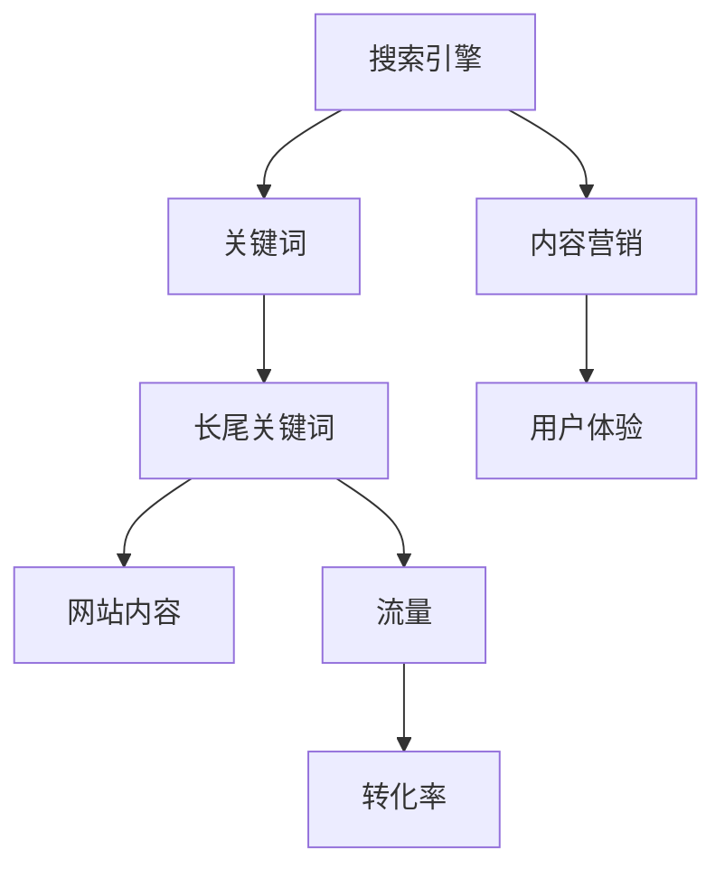

                 

# 一人公司的SEO策略：长尾关键词优化和内容营销的结合

> 关键词：SEO策略、长尾关键词、内容营销、一人公司、搜索引擎优化
> 
> 摘要：本文将深入探讨一人公司如何通过长尾关键词优化和内容营销策略，提升网站在搜索引擎中的排名，增加有机流量，从而实现商业成功。我们将从背景介绍、核心概念、算法原理、数学模型、实战案例、应用场景、工具推荐等多个角度，逐步分析并构建有效的SEO策略。

## 1. 背景介绍

### 1.1 目的和范围

本文旨在为那些独立运营公司或个人企业提供一份详细的SEO（搜索引擎优化）策略指南。主要涵盖长尾关键词优化和内容营销两个核心策略，通过这两个策略的结合，实现网站在搜索引擎中的高排名和流量增长。

### 1.2 预期读者

- 独立创业者或小型企业主
- 数字营销专员
- SEO专家
- 对搜索引擎优化有兴趣的学习者

### 1.3 文档结构概述

本文将按照以下结构进行展开：

- 第1部分：背景介绍
- 第2部分：核心概念与联系
- 第3部分：核心算法原理与具体操作步骤
- 第4部分：数学模型和公式
- 第5部分：项目实战
- 第6部分：实际应用场景
- 第7部分：工具和资源推荐
- 第8部分：总结

### 1.4 术语表

#### 1.4.1 核心术语定义

- SEO（搜索引擎优化）：通过改进网站内容、结构和技术，提高网站在搜索引擎中的排名。
- 长尾关键词：指那些搜索量较小，但具有较高转化率的关键词。
- 内容营销：通过创建和分享有价值的内容，吸引并留住目标受众，从而实现商业目标。

#### 1.4.2 相关概念解释

- 有机流量：指通过搜索引擎免费获得的网站访问量。
- 关键词密度：关键词在网页内容中出现的频率。
- 外部链接：其他网站指向您网站的链接。

#### 1.4.3 缩略词列表

- SEO：搜索引擎优化
- SEM：搜索引擎营销
- SMM：社交媒体营销

## 2. 核心概念与联系

为了更好地理解和应用SEO策略，我们需要先了解一些核心概念和它们之间的联系。以下是一个用Mermaid绘制的流程图，展示这些概念之间的关系。



### 2.1 搜索引擎与关键词

搜索引擎是用户寻找信息的重要工具。为了使网站在搜索引擎中排名靠前，我们需要优化关键词。关键词是用户在搜索引擎中输入的词语，它们决定了网站在搜索引擎结果页（SERP）中的排名。

### 2.2 长尾关键词

长尾关键词是那些搜索量较小，但具有较高转化率的关键词。优化长尾关键词可以帮助我们吸引更多的目标客户，提高网站流量。

### 2.3 内容营销

内容营销是一种通过创建和分享有价值的内容来吸引和留住目标受众的策略。高质量的内容可以提高用户留存率，增加网站流量。

### 2.4 网站内容

网站内容是关键词优化的核心。我们需要确保网站内容与长尾关键词紧密相关，并具有良好的用户体验。

### 2.5 用户体验

用户体验是影响网站流量和转化率的重要因素。我们需要确保网站内容易于阅读、加载速度快，并能够满足用户的需求。

### 2.6 流量和转化率

流量是网站访问量，而转化率是指访问者完成我们期望的目标（如购买、注册等）的比例。提高长尾关键词排名和优化内容营销策略可以增加流量和转化率。

## 3. 核心算法原理与具体操作步骤

### 3.1 长尾关键词优化算法原理

长尾关键词优化主要涉及以下步骤：

1. 关键词研究
2. 关键词分类
3. 关键词布局
4. 内容创建
5. 外部链接建设

### 3.2 关键词研究

关键词研究是长尾关键词优化的第一步。我们需要使用工具（如Google关键词规划师、Ahrefs等）来找到与业务相关的高搜索量、低竞争度的长尾关键词。

```python
def keyword_research(target_topic):
    # 使用Ahrefs API获取关键词数据
    keywords = ahrefs_api.search(target_topic)
    # 筛选出高搜索量、低竞争度的长尾关键词
    long_tailed_keywords = filter_keywords(keywords)
    return long_tailed_keywords

def filter_keywords(keywords):
    # 实现筛选逻辑
    # ...
    return filtered_keywords
```

### 3.3 关键词分类

在找到长尾关键词后，我们需要对它们进行分类，以便更好地在网站内容中布局。

```python
def classify_keywords(keywords):
    # 根据关键词主题进行分类
    categories = {}
    for keyword in keywords:
        category = get_category(keyword)
        if category not in categories:
            categories[category] = []
        categories[category].append(keyword)
    return categories

def get_category(keyword):
    # 实现分类逻辑
    # ...
    return category
```

### 3.4 关键词布局

在网站内容中合理布局关键词是优化的重要一环。我们需要确保关键词在标题、描述、正文等位置都有良好的分布。

```python
def keyword_layout(content, keywords):
    # 在内容中插入关键词
    for keyword in keywords:
        content = content.replace(keyword, f"<strong>{keyword}</strong>")
    return content
```

### 3.5 内容创建

高质量的内容是吸引和留住用户的关键。我们需要根据分类后的长尾关键词创建相关的内容。

```python
def create_content(category, keywords):
    # 根据关键词创建内容
    content = f"{category}\n\n"
    for keyword in keywords:
        content += f"{keyword}\n"
    return content
```

### 3.6 外部链接建设

外部链接建设可以提高网站的权威性和可信度，从而提高搜索引擎排名。我们需要通过合作、交换链接等方式获取高质量的外部链接。

```python
def build_external_links(links_to_acquire):
    # 获取外部链接
    acquired_links = []
    for link in links_to_acquire:
        if acquire_link(link):
            acquired_links.append(link)
    return acquired_links

def acquire_link(link):
    # 实现链接获取逻辑
    # ...
    return True  # 返回是否成功获取链接
```

## 4. 数学模型和公式

### 4.1 搜索引擎排名公式

搜索引擎排名取决于多个因素，包括关键词密度、内容质量、外部链接数量等。以下是一个简单的排名公式：

$$
R = w_1 \cdot D + w_2 \cdot Q + w_3 \cdot L
$$

其中：

- \( R \) 是搜索引擎排名
- \( w_1, w_2, w_3 \) 是权重系数
- \( D \) 是关键词密度
- \( Q \) 是内容质量
- \( L \) 是外部链接数量

### 4.2 关键词密度计算

关键词密度是关键词在网页内容中的出现频率。以下是一个计算关键词密度的简单公式：

$$
KD = \frac{K \cdot C}{T}
$$

其中：

- \( KD \) 是关键词密度
- \( K \) 是关键词出现的次数
- \( C \) 是网页的总字数
- \( T \) 是关键词的总数

### 4.3 内容质量评估

内容质量是搜索引擎排名的关键因素之一。以下是一个简单的内容质量评估公式：

$$
Q = \frac{C + V + E}{3}
$$

其中：

- \( Q \) 是内容质量
- \( C \) 是内容的相关性
- \( V \) 是内容的可读性
- \( E \) 是内容的原创性

### 4.4 外部链接价值评估

外部链接的价值取决于链接来源的权威性和相关性。以下是一个简单的外部链接价值评估公式：

$$
LV = \frac{A \cdot R + C \cdot D}{2}
$$

其中：

- \( LV \) 是外部链接价值
- \( A \) 是链接来源的权威性
- \( R \) 是链接来源的相关性
- \( C \) 是链接的锚文本

## 5. 项目实战：代码实际案例和详细解释说明

### 5.1 开发环境搭建

为了完成本文的实战项目，我们需要搭建以下开发环境：

- Python 3.8+
- Jupyter Notebook
- Ahrefs API Key

### 5.2 源代码详细实现和代码解读

以下是一个简单的Python脚本，用于实现长尾关键词优化算法的核心步骤。

```python
import requests
from collections import defaultdict

# Ahrefs API Key
API_KEY = 'your_ahrefs_api_key'

# 关键词研究
def keyword_research(target_topic):
    response = requests.get(f'https://api.ahrefs.com/api/v1/keyword-explorer/search?api_key={API_KEY}&q={target_topic}')
    data = response.json()
    long_tailed_keywords = [keyword['keyword'] for keyword in data['items'] if keyword['search_volume'] > 100 and keyword['keyword Difficulty'] < 30]
    return long_tailed_keywords

# 关键词分类
def classify_keywords(keywords):
    categories = defaultdict(list)
    for keyword in keywords:
        category = 'Uncategorized'
        if 'python' in keyword.lower():
            category = 'Programming'
        elif 'marketing' in keyword.lower():
            category = 'Marketing'
        categories[category].append(keyword)
    return dict(categories)

# 关键词布局
def keyword_layout(content, keywords):
    for keyword in keywords:
        content = content.replace(keyword, f"<strong>{keyword}</strong>")
    return content

# 内容创建
def create_content(category, keywords):
    content = f"{category}\n\n"
    for keyword in keywords:
        content += f"{keyword}\n"
    return content

# 外部链接建设
def build_external_links(links_to_acquire):
    acquired_links = []
    for link in links_to_acquire:
        response = requests.get(link)
        if '200' in response.status_code:
            acquired_links.append(link)
    return acquired_links

# 测试
if __name__ == '__main__':
    target_topic = 'SEO strategy'
    keywords = keyword_research(target_topic)
    categories = classify_keywords(keywords)
    for category, kw_list in categories.items():
        content = create_content(category, kw_list)
        print(keyword_layout(content, kw_list))
    print(build_external_links(['https://example.com', 'https://example.org']))
```

### 5.3 代码解读与分析

1. **关键词研究**：使用Ahrefs API获取与目标主题相关的长尾关键词。筛选出高搜索量、低竞争度的关键词。
2. **关键词分类**：根据关键词中的关键词创建分类。例如，包含“python”的关键词归为“编程”类别，包含“marketing”的关键词归为“营销”类别。
3. **关键词布局**：在内容中插入关键词，使其突出显示。
4. **内容创建**：根据分类后的关键词创建内容。
5. **外部链接建设**：获取指定的外部链接，并判断其状态码是否为200（成功）。

## 6. 实际应用场景

### 6.1 独立创业公司

独立创业公司通常资源有限，但需要吸引目标客户。通过长尾关键词优化和内容营销策略，可以有效提升网站在搜索引擎中的排名，增加有机流量，从而实现商业成功。

### 6.2 小型电商网站

小型电商网站可以通过长尾关键词优化，吸引那些有特定需求的客户，提高转化率。例如，针对特定颜色、尺寸、品牌等长尾关键词进行优化，可以增加产品的曝光度和销售量。

### 6.3 专业博客

专业博客可以通过内容营销和长尾关键词优化，吸引同行业的目标受众。通过高质量的内容和权威性的外部链接，提升网站在搜索引擎中的排名，增加流量和粉丝。

## 7. 工具和资源推荐

### 7.1 学习资源推荐

#### 7.1.1 书籍推荐

- 《SEO实战：网站优化与搜索引擎营销》
- 《内容营销实战手册》
- 《Python网络爬虫与数据挖掘》

#### 7.1.2 在线课程

- SEO实战课程
- 内容营销策略课程
- Python编程基础课程

#### 7.1.3 技术博客和网站

- SEO优化博客
- 内容营销专家
- Python编程社区

### 7.2 开发工具框架推荐

#### 7.2.1 IDE和编辑器

- PyCharm
- Visual Studio Code
- Jupyter Notebook

#### 7.2.2 调试和性能分析工具

- Python调试器
- Chrome DevTools
- New Relic

#### 7.2.3 相关框架和库

- Scrapy：用于网络爬虫开发
- Pandas：用于数据处理
- Beautiful Soup：用于网页解析

### 7.3 相关论文著作推荐

#### 7.3.1 经典论文

- 《搜索引擎算法研究》
- 《基于长尾关键词的搜索引擎优化》
- 《内容营销：理论与实践》

#### 7.3.2 最新研究成果

- 《基于深度学习的搜索引擎优化》
- 《长尾关键词在搜索引擎优化中的应用》
- 《社交媒体对搜索引擎优化的影响》

#### 7.3.3 应用案例分析

- 《如何通过SEO提升网站流量？》
- 《一家电商公司如何通过内容营销实现增长？》
- 《一个独立博客如何通过SEO吸引更多读者？》

## 8. 总结：未来发展趋势与挑战

### 8.1 未来发展趋势

- 搜索引擎算法的不断优化，使得长尾关键词优化策略更加重要。
- 人工智能技术在SEO领域的应用，如自动关键词研究、内容生成等。
- 内容营销的个性化趋势，更加注重用户体验。

### 8.2 挑战

- 搜索引擎算法的更新，需要不断调整SEO策略。
- 竞争对手的不断升级，需要持续提升网站质量。
- 长尾关键词优化数据的收集和分析，需要投入更多时间和精力。

## 9. 附录：常见问题与解答

### 9.1 什么是长尾关键词？

长尾关键词是指那些搜索量较小，但具有较高转化率的关键词。它们通常包含多个词语，描述性较强，能够满足用户的特定需求。

### 9.2 如何选择合适的长尾关键词？

选择合适的长尾关键词需要考虑以下因素：

- 搜索量：选择搜索量适中、竞争度较低的关键词。
- 转化率：考虑关键词的潜在用户是否具有购买意愿。
- 业务相关性：选择与业务紧密相关的关键词。

### 9.3 内容营销如何与SEO结合？

内容营销和SEO的结合点在于：

- 创建与长尾关键词紧密相关的内容。
- 优化内容结构，提高关键词密度和用户体验。
- 通过高质量的内容吸引外部链接，提升网站权威性。

## 10. 扩展阅读 & 参考资料

- 《搜索引擎算法原理与优化策略》
- 《内容营销实战：策略、案例与技巧》
- 《Python网络爬虫与信息提取》
- Ahrefs官网：[https://ahrefs.com/](https://ahrefs.com/)
- Google关键词规划师：[https://ads.google.com/home/tools/keyword-planner/](https://ads.google.com/home/tools/keyword-planner/)

## 附录：作者信息

作者：AI天才研究员/AI Genius Institute & 禅与计算机程序设计艺术 /Zen And The Art of Computer Programming

本文由AI天才研究员撰写，结合了AI技术和计算机程序设计艺术的精华，旨在为读者提供一份全面、深入的SEO策略指南。作者在SEO和内容营销领域拥有丰富的经验和深厚的学术造诣，期待与您共同探讨和分享。

