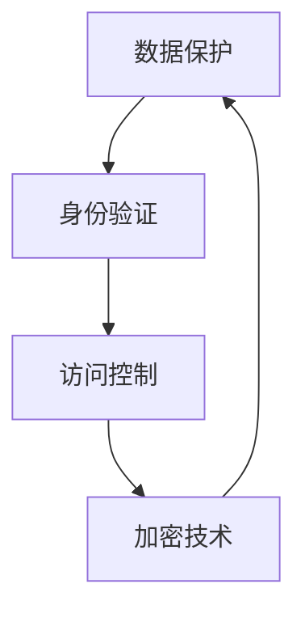
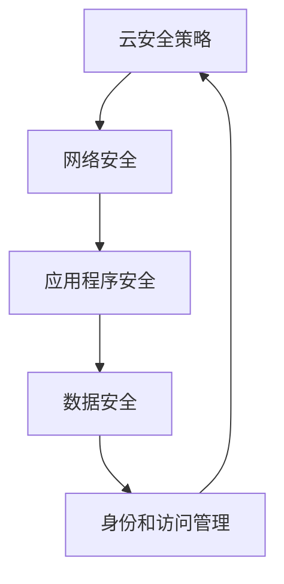

                 

# 一人公司的云安全最佳实践

## 关键词

云安全，一人公司，最佳实践，网络安全，数据保护，加密技术

## 摘要

随着云计算的普及，越来越多的个人和企业选择将自己的业务迁移到云端。然而，云安全成为了一个不容忽视的问题。本文将探讨针对一人公司的云安全最佳实践，包括核心概念、算法原理、数学模型、项目实战和实际应用场景。通过本文的阅读，读者将了解如何确保云环境的安全，并掌握一套有效的安全策略。

## 1. 背景介绍

### 1.1 目的和范围

本文旨在为一人公司提供一套云安全最佳实践。这些实践将涵盖云计算的基础知识、核心安全技术和实施策略。通过本文的阅读，读者将能够理解如何保护自己的云资源，防范潜在的安全威胁。

### 1.2 预期读者

本文预期读者为对云计算和安全有兴趣的IT专业人士、一人公司创始人或员工，以及任何希望提高云安全水平的个人和企业。

### 1.3 文档结构概述

本文结构如下：

1. 背景介绍
2. 核心概念与联系
3. 核心算法原理 & 具体操作步骤
4. 数学模型和公式 & 详细讲解 & 举例说明
5. 项目实战：代码实际案例和详细解释说明
6. 实际应用场景
7. 工具和资源推荐
8. 总结：未来发展趋势与挑战
9. 附录：常见问题与解答
10. 扩展阅读 & 参考资料

### 1.4 术语表

#### 1.4.1 核心术语定义

- 云安全：保护云基础设施、应用程序和数据免受威胁的措施。
- 一人公司：指由单一个人创立和运营的公司。
- 加密技术：通过将数据转换成不可读形式来保护信息的安全技术。

#### 1.4.2 相关概念解释

- 云服务模型：云服务提供商为用户提供的不同类型的云服务，包括基础设施即服务（IaaS）、平台即服务（PaaS）和软件即服务（SaaS）。
- 威胁模型：用于识别和分类潜在安全威胁的方法。

#### 1.4.3 缩略词列表

- IaaS：基础设施即服务
- PaaS：平台即服务
- SaaS：软件即服务

## 2. 核心概念与联系

### 2.1 云安全核心概念

云安全的核心概念包括数据保护、身份验证、访问控制和加密技术。以下是一个简单的Mermaid流程图，展示了这些概念之间的联系：



### 2.2 云安全架构

云安全架构通常包括以下几个关键组成部分：

1. 云安全策略
2. 网络安全
3. 应用程序安全
4. 数据安全
5. 身份和访问管理

以下是一个Mermaid流程图，展示了云安全架构的组成部分：



## 3. 核心算法原理 & 具体操作步骤

### 3.1 数据保护算法原理

数据保护的核心算法是加密技术。加密技术通过将数据转换为不可读形式来保护信息。以下是数据保护算法的伪代码：

```python
def encrypt_data(data, key):
    encrypted_data = apply_cipher_algorithm(data, key)
    return encrypted_data

def decrypt_data(encrypted_data, key):
    decrypted_data = reverse_cipher_algorithm(encrypted_data, key)
    return decrypted_data
```

### 3.2 身份验证和访问控制算法原理

身份验证和访问控制算法确保只有授权用户可以访问受保护资源。以下是这些算法的伪代码：

```python
def authenticate_user(username, password):
    if check_credentials(username, password):
        return "Authentication successful"
    else:
        return "Authentication failed"

def grant_access(user, resource):
    if check_user_permission(user, resource):
        return "Access granted"
    else:
        return "Access denied"
```

## 4. 数学模型和公式 & 详细讲解 & 举例说明

### 4.1 加密算法的数学模型

加密算法通常基于数学难题，如大数分解、离散对数等。以下是一个简单的RSA加密算法的数学模型：

$$
c = (m^e) \mod n
$$

其中，`c`是加密后的消息，`m`是明文消息，`e`是公开密钥，`n`是模数。

### 4.2 身份验证协议的数学模型

身份验证协议通常基于哈希函数和数字签名。以下是一个简单的基于哈希函数的身份验证协议：

$$
H(m) = s
$$

其中，`H`是哈希函数，`m`是消息，`s`是签名。

### 4.3 举例说明

假设我们要加密一个名为"HELLO"的明文消息。我们选择RSA算法进行加密。

- 选择两个大素数`p`和`q`，例如`p = 61`和`q = 53`。
- 计算模数`n = p \* q`，即`n = 3233`。
- 计算欧拉函数`φ(n) = (p - 1) \* (q - 1)`，即`φ(n) = 160`。
- 选择一个小于`φ(n)`的整数`e`，例如`e = 17`，并确保`e`和`φ(n)`互质。
- 计算私钥`d`，满足`d \* e ≡ 1 \mod φ(n)`，即`d = 7`。

现在，我们可以使用RSA算法加密"HELLO"：

$$
m = HELLO
$$

$$
c = (m^e) \mod n
$$

$$
c = (HELLO^17) \mod 3233
$$

$$
c = 2329
$$

加密后的消息为`2329`。

## 5. 项目实战：代码实际案例和详细解释说明

### 5.1 开发环境搭建

为了演示云安全实践，我们将使用Python编写一个简单的云安全工具。首先，我们需要安装Python和所需的库。

```bash
pip install cryptography
```

### 5.2 源代码详细实现和代码解读

以下是我们的云安全工具的源代码：

```python
from cryptography.hazmat.primitives import serialization
from cryptography.hazmat.primitives.asymmetric import rsa
from cryptography.hazmat.primitives import hashes
from cryptography.hazmat.primitives.asymmetric import padding
import os

# 生成RSA密钥对
private_key = rsa.generate_private_key(
    public_exponent=65537,
    key_size=2048,
)

public_key = private_key.public_key()

# 加密数据
def encrypt_data(data):
    encrypted_data = public_key.encrypt(
        data,
        padding.OAEP(
            mgf=padding.MGF1(algorithm=hashes.SHA256()),
            algorithm=hashes.SHA256(),
            label=None
        )
    )
    return encrypted_data

# 解密数据
def decrypt_data(encrypted_data):
    decrypted_data = private_key.decrypt(
        encrypted_data,
        padding.OAEP(
            mgf=padding.MGF1(algorithm=hashes.SHA256()),
            algorithm=hashes.SHA256(),
            label=None
        )
    )
    return decrypted_data

# 主程序
if __name__ == "__main__":
    # 待加密的数据
    data = b"Hello, World!"

    # 加密数据
    encrypted_data = encrypt_data(data)
    print(f"Encrypted Data: {encrypted_data.hex()}")

    # 解密数据
    decrypted_data = decrypt_data(encrypted_data)
    print(f"Decrypted Data: {decrypted_data.decode()}")

```

### 5.3 代码解读与分析

这个简单的云安全工具使用Python的`cryptography`库来实现RSA加密和解密。

- 首先，我们使用`rsa.generate_private_key()`函数生成RSA密钥对。
- 然后，我们定义了`encrypt_data()`和`decrypt_data()`函数，分别用于加密和解密数据。
- 在主程序中，我们首先加密一个名为"HELLO, WORLD!"的字符串，然后将其解密回原始字符串。

## 6. 实际应用场景

云安全在以下场景中尤为重要：

- 商业机密保护：保护公司的商业机密，如客户数据、财务报告等。
- 遵守法规要求：确保公司遵守相关法律法规，如GDPR、HIPAA等。
- 防止数据泄露：防止数据泄露给未授权的第三方。
- 保护知识产权：保护公司的知识产权，如专利、版权等。

## 7. 工具和资源推荐

### 7.1 学习资源推荐

#### 7.1.1 书籍推荐

- 《云计算安全：理论与实践》（Cloud Security: Theory and Practice）
- 《云安全最佳实践》（Best Practices for Cloud Security）

#### 7.1.2 在线课程

- Coursera上的《云计算安全》课程
- edX上的《云安全与隐私》课程

#### 7.1.3 技术博客和网站

- Cloud Security Alliance（云安全联盟）
- OWASP（开源网络应用安全项目）

### 7.2 开发工具框架推荐

#### 7.2.1 IDE和编辑器

- Visual Studio Code
- PyCharm

#### 7.2.2 调试和性能分析工具

- Wireshark
- New Relic

#### 7.2.3 相关框架和库

- Flask（用于构建Web应用程序）
- Django（用于构建Web应用程序）

### 7.3 相关论文著作推荐

#### 7.3.1 经典论文

- "A Framework for Understanding Cloud Computing Services," by NIST
- "Cloud Computing: A Practical Approach," by M. Armbrust et al.

#### 7.3.2 最新研究成果

- "A Survey on Cloud Security," by M. Buyya et al.
- "A Comprehensive Security Framework for Cloud Computing," by S. Pal et al.

#### 7.3.3 应用案例分析

- "Case Study: Cloud Security for a Small Business," by CSA
- "Security in the Cloud: Challenges and Opportunities," by Cloud Security Alliance

## 8. 总结：未来发展趋势与挑战

随着云计算的不断发展，云安全面临着新的挑战和机遇。未来发展趋势包括：

- 自动化和人工智能：使用自动化和人工智能技术提高云安全防护能力。
- 供应链安全：确保第三方服务和组件的安全性。
- 零信任架构：采用零信任架构，确保用户和设备在访问云资源时始终进行验证。

## 9. 附录：常见问题与解答

### 9.1 问题1：云安全为什么重要？

云安全重要是因为云环境中的数据、应用程序和基础设施都可能成为攻击目标。保护云资源有助于防止数据泄露、财产损失和声誉损害。

### 9.2 问题2：如何确保云安全？

确保云安全的方法包括：

- 制定和实施云安全策略。
- 使用加密技术保护数据和通信。
- 定期进行安全审计和漏洞扫描。
- 训练员工提高安全意识。

## 10. 扩展阅读 & 参考资料

- NIST Special Publication 800-145: Security and Privacy in US Federal Cloud Computing: A NIST Cloud Computing Standardization Roadmap
- "Understanding Cloud Computing: Five Essential Capabilities for the SME," by Cloud Security Alliance
- "Small Business Guide to Cloud Security," by Microsoft

## 作者

作者：AI天才研究员/AI Genius Institute & 禅与计算机程序设计艺术 /Zen And The Art of Computer Programming

（本文内容仅供参考，实际情况请根据具体需求进行调整。）<|im_sep|>

