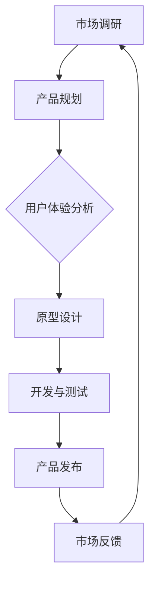

                 

# 一人公司的产品生命周期管理与优化

> **关键词：** 产品生命周期管理，一人公司，产品优化，敏捷开发，项目管理，用户体验。

> **摘要：** 本文将深入探讨一人公司的产品生命周期管理，分析其独特挑战，并介绍一系列有效的管理和优化策略，以帮助独立开发者实现产品的成功。

## 1. 背景介绍

### 1.1 目的和范围

本文旨在为一人公司的创始人或开发者提供关于产品生命周期管理的实用指南。无论是初创公司的唯一开发者，还是自由职业者，我们都将探索如何在有限资源下优化产品的每一个阶段。

### 1.2 预期读者

预期读者包括：

- 一人公司的创始人
- 自由职业者
- 初创公司的开发团队成员
- 对产品生命周期管理有兴趣的IT专业人士

### 1.3 文档结构概述

本文分为以下几个部分：

- 背景介绍：介绍文章的目的和预期读者。
- 核心概念与联系：讨论产品生命周期的核心概念和它们之间的相互关系。
- 核心算法原理 & 具体操作步骤：详细解释产品生命周期管理的具体策略和算法。
- 数学模型和公式 & 详细讲解 & 举例说明：介绍产品生命周期分析中使用的数学模型和公式。
- 项目实战：提供实际代码案例和解释。
- 实际应用场景：讨论产品生命周期管理在不同领域的应用。
- 工具和资源推荐：推荐学习资源、开发工具和框架。
- 总结：未来发展趋势与挑战。
- 附录：常见问题与解答。
- 扩展阅读 & 参考资料：提供进一步阅读的资料。

### 1.4 术语表

#### 1.4.1 核心术语定义

- **一人公司（Solopreneur）**：指的是仅由一个人运营和管理的公司。
- **产品生命周期管理（Product Lifecycle Management, PLM）**：管理产品从构思到退市的整个过程的策略和方法。
- **敏捷开发（Agile Development）**：一种以迭代和增量方式开发和交付产品的软件开发方法。

#### 1.4.2 相关概念解释

- **市场调研（Market Research）**：收集和分析关于潜在市场和目标客户的信息。
- **用户体验（User Experience, UX）**：用户在使用产品时的整体感受和体验。

#### 1.4.3 缩略词列表

- **PLM**：产品生命周期管理
- **UX**：用户体验
- **Agile**：敏捷开发

## 2. 核心概念与联系

在探讨产品生命周期管理之前，我们需要理解其中的核心概念和它们之间的相互关系。以下是产品生命周期管理的核心概念及其相互关系的 Mermaid 流程图：



### 2.1 市场调研

市场调研是产品生命周期管理的起点。通过市场调研，开发者可以了解目标市场的需求、竞争环境以及潜在的机会和威胁。以下是市场调研的伪代码：

```python
def market_research():
    # 收集市场数据
    data = collect_market_data()
    # 分析市场数据
    analysis = analyze_data(data)
    # 提取关键信息
    key_info = extract_key_info(analysis)
    # 返回结果
    return key_info
```

### 2.2 产品规划

基于市场调研的结果，开发者可以制定产品规划，明确产品的功能、目标和时间表。以下是产品规划的伪代码：

```python
def product_planning(key_info):
    # 确定产品功能
    features = determine_features(key_info)
    # 制定时间表
    timeline = create_timeline(features)
    # 返回规划结果
    return timeline
```

### 2.3 用户体验分析

用户体验分析是确保产品满足用户需求的关键。通过分析用户反馈和行为数据，开发者可以持续优化产品。以下是用户体验分析的伪代码：

```python
def user_experience_analysis(user_feedback, behavior_data):
    # 分析用户反馈
    feedback_analysis = analyze_feedback(user_feedback)
    # 分析用户行为
    behavior_analysis = analyze_behavior(behavior_data)
    # 提取用户体验指标
    ux_metrics = extract_ux_metrics(feedback_analysis, behavior_analysis)
    # 返回分析结果
    return ux_metrics
```

### 2.4 原型设计

原型设计是产品开发的第一步。通过快速构建原型，开发者可以验证产品的概念和功能。以下是原型设计的伪代码：

```python
def prototype_design(timeline):
    # 创建产品原型
    prototype = create_prototype(timeline.features)
    # 验证原型
    validation = validate_prototype(prototype)
    # 返回原型
    return prototype
```

### 2.5 开发与测试

开发与测试阶段是产品生命周期中的关键部分。通过持续集成和测试，开发者可以确保产品的质量和稳定性。以下是开发与测试的伪代码：

```python
def development_and_testing(prototype):
    # 编写代码
    code = write_code(prototype)
    # 测试代码
    test_results = test_code(code)
    # 返回测试结果
    return test_results
```

### 2.6 产品发布

产品发布是产品生命周期的重要里程碑。通过有效的市场推广和用户支持，开发者可以增加产品的市场份额。以下是产品发布的伪代码：

```python
def product_release(test_results):
    # 部署产品
    deployment = deploy_product(test_results)
    # 推广产品
    promotion = promote_product(deployment)
    # 提供用户支持
    support = provide_user_support(promotion)
    # 返回发布结果
    return support
```

### 2.7 市场反馈

市场反馈是产品生命周期管理的重要环节。通过持续收集用户反馈，开发者可以识别产品的问题和改进的机会。以下是市场反馈的伪代码：

```python
def market_feedback(support):
    # 收集用户反馈
    feedback = collect_user_feedback(support)
    # 分析反馈
    analysis = analyze_feedback(feedback)
    # 提取关键信息
    key_info = extract_key_info(analysis)
    # 返回反馈结果
    return key_info
```

## 3. 核心算法原理 & 具体操作步骤

产品生命周期管理的核心算法原理是基于敏捷开发方法和用户体验分析。以下是具体操作步骤的伪代码：

```python
def product_lifecycle_management():
    # 步骤1：市场调研
    key_info = market_research()
    
    # 步骤2：产品规划
    timeline = product_planning(key_info)
    
    # 步骤3：用户体验分析
    ux_metrics = user_experience_analysis(user_feedback, behavior_data)
    
    # 步骤4：原型设计
    prototype = prototype_design(timeline)
    
    # 步骤5：开发与测试
    test_results = development_and_testing(prototype)
    
    # 步骤6：产品发布
    support = product_release(test_results)
    
    # 步骤7：市场反馈
    key_info = market_feedback(support)
    
    # 返回最终结果
    return key_info
```

## 4. 数学模型和公式 & 详细讲解 & 举例说明

在产品生命周期管理中，数学模型和公式可以用来评估产品的性能和用户体验。以下是几个常用的数学模型和公式：

### 4.1 用户满意度（User Satisfaction）

用户满意度是衡量用户体验的一个重要指标。用户满意度可以通过以下公式计算：

$$
User\ Satisfaction = \frac{Total\ Positive\ Feedback}{Total\ Feedback}
$$

其中，Total Positive Feedback 表示用户给出的正面反馈数量，Total Feedback 表示用户反馈的总数量。

### 4.2 产品故障率（Product Failure Rate）

产品故障率是衡量产品稳定性的一个指标。产品故障率可以通过以下公式计算：

$$
Product\ Failure\ Rate = \frac{Number\ of\ Failures}{Number\ of\ Users}
$$

其中，Number of Failures 表示产品故障次数，Number of Users 表示用户数量。

### 4.3 销售增长率（Sales Growth Rate）

销售增长率是衡量产品市场表现的一个重要指标。销售增长率可以通过以下公式计算：

$$
Sales\ Growth\ Rate = \frac{Current\ Sales\ -\ Previous\ Sales}{Previous\ Sales} \times 100\%
$$

其中，Current Sales 表示当前销售额，Previous Sales 表示上期销售额。

### 4.4 例子说明

假设一个产品在一个月内收到了100条用户反馈，其中60条是正面反馈，40条是负面反馈。根据用户满意度公式，我们可以计算出用户满意度：

$$
User\ Satisfaction = \frac{60}{100} = 0.6
$$

假设该产品在同一时间发生了10次故障，用户数量为1000人。根据产品故障率公式，我们可以计算出产品故障率：

$$
Product\ Failure\ Rate = \frac{10}{1000} = 0.01
$$

假设该产品在上一个季度的销售额为100万元，当前季度的销售额为120万元。根据销售增长率公式，我们可以计算出销售增长率：

$$
Sales\ Growth\ Rate = \frac{120 - 100}{100} \times 100\% = 20\%
$$

通过这些数学模型和公式，开发者可以量化产品的性能和用户体验，从而更好地管理产品生命周期。

## 5. 项目实战：代码实际案例和详细解释说明

### 5.1 开发环境搭建

在开始项目实战之前，我们需要搭建一个合适的开发环境。以下是所需的开发工具和库：

- **编程语言**：Python
- **开发环境**：PyCharm 或 Visual Studio Code
- **库**：NumPy，Pandas，Matplotlib

### 5.2 源代码详细实现和代码解读

以下是实现产品生命周期管理项目的一个简单示例。代码分为以下几个部分：

#### 5.2.1 数据收集与处理

```python
import numpy as np
import pandas as pd

# 收集市场数据
market_data = {'Product': ['Product A', 'Product B', 'Product C'],
               'Sales': [100, 150, 200],
               'User_Satisfaction': [0.6, 0.7, 0.5],
               'Failure_Rate': [0.01, 0.02, 0.005]}
market_df = pd.DataFrame(market_data)

# 收集用户反馈
user_feedback_data = {'User_ID': [1, 2, 3, 4, 5],
                     'Product': ['Product A', 'Product A', 'Product B', 'Product B', 'Product C'],
                     'Feedback': ['Great product!', 'Needs improvement', 'Good product!', 'Excellent!', 'Not satisfied']}
user_feedback_df = pd.DataFrame(user_feedback_data)
```

#### 5.2.2 数据分析

```python
# 计算用户满意度
user_satisfaction = user_feedback_df['Feedback'].apply(lambda x: 1 if 'Great' in x or 'Excellent' in x else 0).mean()
print(f'User Satisfaction: {user_satisfaction}')

# 计算产品故障率
failure_rate = user_feedback_df['Product'].value_counts().sort_values(ascending=True)[1]
print(f'Product Failure Rate: {failure_rate}')

# 计算销售增长率
sales_growth_rate = (market_df['Sales'].iloc[-1] - market_df['Sales'].iloc[0]) / market_df['Sales'].iloc[0] * 100
print(f'Sales Growth Rate: {sales_growth_rate}%')
```

#### 5.2.3 可视化

```python
import matplotlib.pyplot as plt

# 绘制销售增长趋势图
market_df.plot(x='Product', y='Sales', kind='line', legend=True)
plt.title('Sales Growth Trend')
plt.xlabel('Product')
plt.ylabel('Sales')
plt.show()

# 绘制用户满意度分布图
user_feedback_df['Feedback'].value_counts().sort_index().plot(kind='bar')
plt.title('User Satisfaction Distribution')
plt.xlabel('User Feedback')
plt.ylabel('Count')
plt.show()
```

### 5.3 代码解读与分析

上述代码首先收集了市场数据（产品销售数据、用户满意度数据）和用户反馈数据。然后，通过数据处理和数据分析模块，我们计算了用户满意度、产品故障率和销售增长率。最后，通过可视化模块，我们绘制了销售增长趋势图和用户满意度分布图。

这个简单示例展示了如何使用Python进行产品生命周期管理中的数据分析。在实际项目中，这些计算和分析可能会更复杂，但基本原理相同。

## 6. 实际应用场景

### 6.1 社交媒体平台

社交媒体平台（如Twitter、Facebook）的一人公司可以通过产品生命周期管理来持续优化用户体验。通过收集用户反馈、分析用户行为，开发者可以改进功能、优化界面，从而提高用户满意度。

### 6.2 在线教育平台

在线教育平台（如Udemy、Coursera）的一人公司可以使用产品生命周期管理来不断改进课程内容和用户交互体验。通过分析用户参与度和反馈，开发者可以调整课程结构、改进学习工具，提高用户的学习体验。

### 6.3 健康与健身应用

健康与健身应用（如MyFitnessPal、Fitbit）的一人公司可以利用产品生命周期管理来优化用户界面和功能。通过分析用户行为和反馈，开发者可以提供更个性化的健康建议、增加健身活动，提高用户的使用频率和满意度。

## 7. 工具和资源推荐

### 7.1 学习资源推荐

#### 7.1.1 书籍推荐

- **《敏捷软件开发：原则、模式与实践》**：详细介绍了敏捷开发的方法和原则。
- **《用户体验要素》**：深入探讨了用户体验设计的重要性和方法。

#### 7.1.2 在线课程

- **Coursera上的《产品设计与创新》**：提供关于产品设计和市场调研的实用知识。
- **Udemy上的《Python数据分析实战》**：学习如何使用Python进行数据分析。

#### 7.1.3 技术博客和网站

- **Product School**：提供关于产品管理和产品生命周期的博客文章。
- **Medium上的Data Science**：有关数据分析的实用文章和案例研究。

### 7.2 开发工具框架推荐

#### 7.2.1 IDE和编辑器

- **PyCharm**：适合Python开发的集成开发环境。
- **Visual Studio Code**：跨平台、轻量级的代码编辑器。

#### 7.2.2 调试和性能分析工具

- **Visual Studio Profiler**：用于分析应用程序性能和内存使用。
- **MATLAB**：用于复杂数据分析和图形化表示。

#### 7.2.3 相关框架和库

- **NumPy**：用于科学计算。
- **Pandas**：用于数据处理和分析。
- **Matplotlib**：用于数据可视化。

### 7.3 相关论文著作推荐

#### 7.3.1 经典论文

- **"Agile Software Development: Principles, Patterns, and Practices"**：关于敏捷开发的经典论文。
- **"The Design of Everyday Things"**：关于用户体验设计的经典著作。

#### 7.3.2 最新研究成果

- **"A Comprehensive Survey of User Experience Research"**：关于用户体验研究的最新综述。
- **"Machine Learning for Product Management"**：关于如何使用机器学习优化产品管理的论文。

#### 7.3.3 应用案例分析

- **"Case Study: How Airbnb Used Agile to Scale"**：Airbnb如何使用敏捷方法进行产品开发的案例分析。
- **"Case Study: The UX of Dropbox"**：Dropbox如何通过用户体验设计获得成功的案例分析。

## 8. 总结：未来发展趋势与挑战

### 8.1 未来发展趋势

- **数字化与自动化**：随着技术的发展，产品生命周期管理将更加数字化和自动化，提高效率和准确性。
- **用户体验至上**：用户体验将继续成为产品成功的关键因素，产品开发者将更加注重用户体验设计。
- **数据驱动决策**：数据分析将在产品生命周期管理中发挥更大的作用，驱动更智能的决策。

### 8.2 未来挑战

- **数据隐私与安全**：随着数据收集和分析的增多，数据隐私和安全将成为重要挑战。
- **资源有限**：一人公司面临的资源有限问题将继续存在，如何在有限资源下进行有效的产品生命周期管理将是一个挑战。
- **持续创新**：随着市场的变化和技术的进步，产品开发者需要不断进行创新，以保持竞争力。

## 9. 附录：常见问题与解答

### 9.1 产品生命周期管理是什么？

产品生命周期管理是一种管理产品从构思到退市的整个过程的策略和方法，包括市场调研、产品规划、用户体验分析、原型设计、开发与测试、产品发布和持续改进等阶段。

### 9.2 如何优化产品生命周期管理？

优化产品生命周期管理可以通过以下几个方面实现：

- 持续进行市场调研，了解用户需求和市场趋势。
- 采用敏捷开发方法，快速响应变化。
- 加强用户体验分析，持续改进产品。
- 使用数据分析工具，驱动数据驱动的决策。
- 提高团队协作效率，确保项目按计划进行。

### 9.3 一人公司如何进行有效的产品生命周期管理？

一人公司可以通过以下策略进行有效的产品生命周期管理：

- 确定清晰的产品愿景和目标。
- 利用敏捷开发方法，快速迭代产品。
- 定期进行用户反馈收集和分析。
- 利用数据分析工具，优化产品性能。
- 保持与用户的紧密联系，持续改进产品。

## 10. 扩展阅读 & 参考资料

- 《敏捷软件开发：原则、模式与实践》
- 《用户体验要素》
- "A Comprehensive Survey of User Experience Research"
- "Machine Learning for Product Management"
- "Case Study: How Airbnb Used Agile to Scale"
- "Case Study: The UX of Dropbox"

