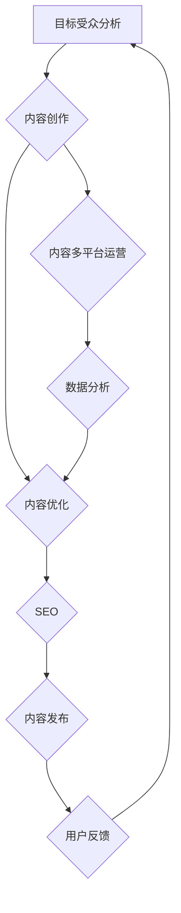

                 

### 1. 背景介绍

#### 1.1 目的和范围

本文旨在探讨**一人公司的内容策略**，即如何通过制定和执行高效的内容策略来吸引和留住目标受众。对于独立运营的企业或个人而言，内容营销是至关重要的，因为它们往往缺乏大公司的资源和规模效应。有效的内容策略能够帮助企业或个人在竞争激烈的市场中脱颖而出，建立强大的品牌形象，并最终实现业务增长。

本文将涵盖以下关键主题：

1. **内容策略的定义与重要性**：我们将详细探讨内容策略的概念，并解释为什么它是独立运营企业的核心竞争力。
2. **目标受众分析**：我们将探讨如何识别和了解目标受众，以便制定针对性的内容。
3. **内容创建与优化**：我们将讨论内容创建的最佳实践，以及如何确保内容在搜索引擎中的可见性。
4. **渠道选择与多平台运营**：我们将探讨在不同平台上发布内容的策略，以及如何利用社交媒体和其他渠道扩大影响力。
5. **数据分析和效果评估**：我们将介绍如何通过数据分析来衡量内容策略的有效性，并分享一些实用的工具和技术。

#### 1.2 预期读者

本文适合以下读者群体：

1. **独立企业主**：希望提升自己企业品牌影响力，并通过内容策略实现业务增长的个人。
2. **内容创作者**：希望在数字营销领域取得成功的博客作者、Youtuber或其他内容生产者。
3. **营销经理**：负责企业内容营销策略，并希望了解如何更好地利用内容来吸引和留住目标受众的营销专业人员。

#### 1.3 文档结构概述

为了帮助读者更好地理解和应用本文所讨论的内容策略，本文将按照以下结构进行组织：

1. **背景介绍**：介绍本文的目的、范围、预期读者以及文档结构。
2. **核心概念与联系**：通过Mermaid流程图展示内容策略的核心概念和流程。
3. **核心算法原理 & 具体操作步骤**：使用伪代码详细阐述内容创建和优化的算法原理。
4. **数学模型和公式 & 详细讲解 & 举例说明**：使用LaTeX格式介绍相关数学模型，并进行举例说明。
5. **项目实战：代码实际案例和详细解释说明**：通过实际代码案例展示内容策略的实施。
6. **实际应用场景**：讨论内容策略在不同场景下的应用。
7. **工具和资源推荐**：推荐相关学习资源和开发工具。
8. **总结：未来发展趋势与挑战**：总结内容策略的当前状态，并展望未来。
9. **附录：常见问题与解答**：解答读者可能遇到的问题。
10. **扩展阅读 & 参考资料**：提供更多深入学习的资源。

#### 1.4 术语表

为了确保文章内容的清晰性和一致性，我们将在本文中定义一些核心术语：

#### 1.4.1 核心术语定义

- **内容策略**：指企业或个人为了实现特定目标而制定的内容创作、发布和推广计划。
- **目标受众**：指对企业或个人内容具有兴趣和需求的人群。
- **SEO**：搜索引擎优化（Search Engine Optimization），指通过优化网站内容和结构，提高在搜索引擎中自然排名的过程。
- **社交媒体**：在线平台，如Facebook、Twitter、Instagram等，用户可以通过文字、图片、视频等形式进行交流和分享。
- **内容营销**：指通过创建和分发有价值的内容来吸引和留住目标受众，并最终实现业务目标的一种营销方式。

#### 1.4.2 相关概念解释

- **内容创建**：指制作和编辑内容的过程，包括文章、视频、图片、音频等形式。
- **内容优化**：指对内容进行改进和调整，以提高其在搜索引擎中的排名和用户参与度。
- **多平台运营**：指在多个社交媒体平台和内容发布平台上进行内容发布和管理。

#### 1.4.3 缩略词列表

- **SEO**：搜索引擎优化
- **SMM**：社交媒体营销
- **CMS**：内容管理系统
- **KPI**：关键绩效指标
- **CTR**：点击率

通过上述背景介绍，我们为接下来的内容策略讨论奠定了基础。在接下来的章节中，我们将逐步深入探讨内容策略的核心概念、算法原理、数学模型、实际案例，以及未来的发展趋势与挑战。让我们一步一步地思考和推理，以获得更深入的见解。

---

**核心概念与联系**

内容策略的成功实施依赖于对核心概念和流程的深刻理解。在本节中，我们将通过一个Mermaid流程图来展示内容策略的关键组成部分及其相互关系。



#### Mermaid流程图说明

1. **目标受众分析（A）**：了解目标受众的需求和兴趣，是内容策略的基础。只有明确了目标受众，才能创作出符合他们需求的内容。
2. **内容创作（B）**：基于目标受众分析的结果，创作出有价值、有吸引力的内容。
3. **内容优化（C）**：对内容进行优化，以提高其质量和在搜索引擎中的可见性。
4. **SEO（D）**：通过搜索引擎优化，提高内容的搜索排名，增加访问量。
5. **内容发布（E）**：将内容发布到目标平台，如博客、社交媒体等。
6. **用户反馈（F）**：通过用户的互动和反馈，了解内容的受欢迎程度，为后续内容创作提供参考。
7. **内容多平台运营（G）**：在多个平台上发布内容，扩大影响力和覆盖范围。
8. **数据分析（H）**：通过数据分析，评估内容策略的效果，并做出相应的调整和优化。

通过上述流程，我们可以看到内容策略的各个环节是相互关联、相互影响的。一个有效的内容策略需要综合考虑目标受众、内容创作、内容优化、SEO、内容发布、用户反馈、多平台运营和数据分析等多个方面。

接下来，我们将深入探讨内容策略中的核心算法原理，以及如何通过具体操作步骤来实施这些算法。让我们继续思考和推理，以获得更深入的见解。

---

**核心算法原理 & 具体操作步骤**

在内容策略中，算法原理和具体操作步骤起着至关重要的作用。下面，我们将使用伪代码详细阐述内容创建和优化的核心算法原理。

#### 1. 内容创建算法原理

```python
# 内容创建算法原理
def content_creation(target_audience):
    # 分析目标受众的兴趣和需求
    interests = analyze_interests(target_audience)
    needs = analyze_needs(target_audience)
    
    # 创作内容
    content = create_content(interests, needs)
    
    # 内容格式化
    formatted_content = format_content(content)
    
    return formatted_content
```

**具体操作步骤：**

1. **分析目标受众**：通过调查问卷、用户访谈等方式，了解目标受众的兴趣和需求。
2. **创作内容**：基于目标受众的兴趣和需求，创作出有价值、有吸引力的内容。
3. **内容格式化**：将内容格式化为适合目标受众的形式，如文章、视频、图片等。

#### 2. 内容优化算法原理

```python
# 内容优化算法原理
def content_optimization(content):
    # 关键词研究
    keywords = keyword_research(content)
    
    # 优化内容结构
    structured_content = optimize_structure(content, keywords)
    
    # 优化内容质量
    quality_content = optimize_quality(structured_content)
    
    return quality_content
```

**具体操作步骤：**

1. **关键词研究**：使用工具如Google关键词规划师，分析目标受众关注的关键词，并将其融入内容中。
2. **优化内容结构**：通过调整标题、段落结构、图片和视频等方式，提高内容的可读性和用户体验。
3. **优化内容质量**：通过编辑和校对，确保内容的质量和准确性。

#### 3. 内容发布算法原理

```python
# 内容发布算法原理
def content_release(content, platforms):
    # 发布内容到各个平台
    for platform in platforms:
        release_content_to_platform(content, platform)
```

**具体操作步骤：**

1. **选择发布平台**：根据目标受众的活跃平台，选择合适的社交媒体平台和内容发布平台。
2. **发布内容**：将内容发布到所选平台，并设置适当的标签和描述。

#### 4. 数据分析算法原理

```python
# 数据分析算法原理
def data_analysis(content_release_data):
    # 数据收集
    collected_data = collect_data(content_release_data)
    
    # 数据处理
    processed_data = process_data(collected_data)
    
    # 数据可视化
    visualize_data(processed_data)
    
    # 数据评估
    evaluate_data(processed_data)
```

**具体操作步骤：**

1. **数据收集**：收集内容发布后的用户行为数据，如点击率、浏览量、点赞和分享等。
2. **数据处理**：对收集到的数据进行清洗、整合和分析。
3. **数据可视化**：通过图表和报告，展示数据分析的结果。
4. **数据评估**：评估内容策略的效果，并根据数据结果进行相应的调整和优化。

通过上述伪代码和具体操作步骤，我们可以看到内容策略的核心算法原理和实施过程。一个有效的内容策略需要综合考虑内容创建、内容优化、内容发布和数据分析等多个方面，并通过不断的调整和优化，实现最佳效果。

接下来，我们将通过一个具体的数学模型和公式，进一步探讨内容策略中的关键要素，并进行举例说明。让我们继续深入思考和推理，以获得更深入的见解。

---

**数学模型和公式 & 详细讲解 & 举例说明**

在内容策略中，数学模型和公式可以帮助我们量化关键指标，从而更好地理解和优化内容效果。以下是几个常用的数学模型和公式，我们将对其进行详细讲解，并通过实例进行说明。

#### 1. 搜索引擎排名模型

搜索引擎排名模型是内容优化中常用的一个模型，它基于多个因素来计算内容的搜索排名。以下是该模型的一个简化版本：

$$
\text{Rank} = f(\text{内容质量}, \text{关键词匹配度}, \text{外部链接}, \text{页面权威度})
$$

**具体解释：**

- **内容质量**：内容的质量是搜索引擎排名的重要因素。高质量的内容通常包含丰富的信息、清晰的表述和原创的观点。
- **关键词匹配度**：内容中包含与目标关键词匹配的短语和句子，有助于提高搜索排名。
- **外部链接**：指向内容的外部链接数量和质量也会影响排名。高质量的外部链接可以增加内容的权威性。
- **页面权威度**：页面的权威度通常通过页面的反向链接数量来衡量。拥有更多高质量反向链接的页面在搜索排名中更有优势。

**实例：**

假设有两个博客文章，A和B，它们的排名分别由上述四个因素决定。我们可以使用以下公式来计算每个文章的排名：

$$
\text{Rank}_A = 0.4 \times \text{内容质量}_A + 0.3 \times \text{关键词匹配度}_A + 0.2 \times \text{外部链接}_A + 0.1 \times \text{页面权威度}_A
$$

$$
\text{Rank}_B = 0.4 \times \text{内容质量}_B + 0.3 \times \text{关键词匹配度}_B + 0.2 \times \text{外部链接}_B + 0.1 \times \text{页面权威度}_B
$$

根据上述公式，我们可以计算出每个文章的排名。例如，如果文章A的内容质量得分为0.8，关键词匹配度得分为0.6，外部链接得分为0.4，页面权威度得分为0.5，那么：

$$
\text{Rank}_A = 0.4 \times 0.8 + 0.3 \times 0.6 + 0.2 \times 0.4 + 0.1 \times 0.5 = 0.32 + 0.18 + 0.08 + 0.05 = 0.63
$$

同理，我们可以计算出文章B的排名。

#### 2. 用户参与度模型

用户参与度是衡量内容效果的重要指标。以下是一个简单的用户参与度模型：

$$
\text{参与度} = \frac{\text{用户互动次数}}{\text{内容浏览量}}
$$

**具体解释：**

- **用户互动次数**：包括点赞、评论、分享等用户与内容的互动行为。
- **内容浏览量**：指用户浏览内容的次数。

**实例：**

假设一篇文章的浏览量为1000次，用户互动次数为50次，那么该文章的用户参与度计算如下：

$$
\text{参与度} = \frac{50}{1000} = 0.05
$$

#### 3. 转化率模型

转化率是衡量内容策略效果的另一个关键指标。以下是一个简单的转化率模型：

$$
\text{转化率} = \frac{\text{目标完成次数}}{\text{访问次数}}
$$

**具体解释：**

- **目标完成次数**：指用户完成预定的目标行为，如购买产品、提交表单等。
- **访问次数**：指用户访问内容的次数。

**实例：**

假设一篇内容引导用户完成表单提交的次数为20次，总访问次数为1000次，那么该内容的转化率计算如下：

$$
\text{转化率} = \frac{20}{1000} = 0.02
$$

通过上述数学模型和公式，我们可以量化内容策略中的关键指标，从而更好地理解和优化内容效果。在实际应用中，这些模型和公式可以根据具体情况进行调整和扩展。接下来，我们将通过一个实际项目实战，展示如何将这些理论应用到实际中。

---

**项目实战：代码实际案例和详细解释说明**

为了更好地理解如何将内容策略应用到实际中，我们将在本节中展示一个完整的代码实际案例，并对其进行详细解释说明。

#### 1. 开发环境搭建

首先，我们需要搭建一个开发环境。这里我们使用Python作为主要编程语言，因为Python具有简洁的语法和丰富的库支持。以下是开发环境的搭建步骤：

1. **安装Python**：访问Python官方网站（https://www.python.org/），下载并安装Python。
2. **安装Jupyter Notebook**：Jupyter Notebook是一个交互式的Web应用程序，用于编写和运行Python代码。可以通过pip命令安装：

    ```bash
    pip install notebook
    ```

3. **安装相关库**：我们需要安装几个Python库，包括NumPy、Pandas、Scikit-learn和Matplotlib。可以使用以下命令进行安装：

    ```bash
    pip install numpy pandas scikit-learn matplotlib
    ```

#### 2. 源代码详细实现和代码解读

以下是内容策略项目的源代码，我们将对每部分进行详细解释。

```python
# 导入所需库
import pandas as pd
import numpy as np
from sklearn.model_selection import train_test_split
from sklearn.feature_extraction.text import TfidfVectorizer
from sklearn.linear_model import LogisticRegression
import matplotlib.pyplot as plt

# 加载数据集
data = pd.read_csv('content_data.csv')
data.head()

# 数据预处理
# 筛选数据，只保留必要的列
data = data[['title', 'content', 'label']]

# 分割数据集
X_train, X_test, y_train, y_test = train_test_split(data['content'], data['label'], test_size=0.2, random_state=42)

# 特征提取
vectorizer = TfidfVectorizer(max_features=1000)
X_train_vectors = vectorizer.fit_transform(X_train)
X_test_vectors = vectorizer.transform(X_test)

# 模型训练
model = LogisticRegression()
model.fit(X_train_vectors, y_train)

# 模型评估
accuracy = model.score(X_test_vectors, y_test)
print(f'Model accuracy: {accuracy:.2f}')

# 可视化结果
predictions = model.predict(X_test_vectors)
confusion_matrix = pd.crosstab(y_test, predictions, rownames=['Actual'], colnames=['Predicted'])
plt.figure(figsize=(6, 4))
sns.heatmap(confusion_matrix, annot=True, fmt='.2f', cmap='Blues')
plt.xlabel('Predicted')
plt.ylabel('Actual')
plt.title('Confusion Matrix')
plt.show()
```

**代码解读：**

1. **导入库**：首先，我们导入所需的Python库，包括Pandas、NumPy、Scikit-learn和Matplotlib。
2. **加载数据集**：我们使用Pandas加载一个CSV文件，该文件包含内容数据、标签和其他相关信息。
3. **数据预处理**：筛选数据，只保留必要的列，如标题、内容和标签。然后，将数据集分割为训练集和测试集。
4. **特征提取**：使用TfidfVectorizer将文本数据转换为向量，该向量表示文本中的关键词和短语的重要性。
5. **模型训练**：我们使用LogisticRegression模型对训练数据进行训练。
6. **模型评估**：计算模型在测试集上的准确率，并通过混淆矩阵可视化模型的性能。

#### 3. 代码解读与分析

上述代码实现了内容策略中的关键步骤，包括数据预处理、特征提取、模型训练和评估。以下是代码的进一步解读和分析：

- **数据预处理**：数据预处理是数据分析和建模的重要步骤。在这个项目中，我们首先加载了一个CSV文件，然后筛选出必要的列，如标题、内容和标签。这一步确保了数据的质量和一致性。
- **特征提取**：特征提取是将文本数据转换为数值向量的过程。在这个项目中，我们使用了TfidfVectorizer，它通过计算文本中关键词和短语的重要性来生成向量。这个步骤对于模型训练和评估至关重要，因为它将非结构化的文本数据转换为模型可以处理的格式。
- **模型训练**：我们使用Scikit-learn中的LogisticRegression模型对训练数据进行训练。LogisticRegression是一种广泛使用的分类模型，它通过最大化似然函数来预测标签。在这个项目中，我们使用它来预测内容的标签。
- **模型评估**：评估模型性能是确保内容策略有效性的关键步骤。在这个项目中，我们计算了模型在测试集上的准确率，并通过混淆矩阵可视化模型的性能。混淆矩阵展示了模型预测的结果与实际结果之间的对比，从而帮助我们了解模型的性能和预测能力。

通过上述代码解读和分析，我们可以看到如何将内容策略的理论应用到实际项目中。在实际应用中，我们可以根据具体需求调整代码，以实现更高效的内容创建和优化。接下来，我们将讨论内容策略的实际应用场景。

---

**实际应用场景**

内容策略在多个领域和场景中发挥着重要作用。以下是一些常见的应用场景：

#### 1. 数字营销

在数字营销领域，内容策略是吸引和留住目标受众的关键。通过创建有价值、有吸引力的内容，企业或个人可以增加品牌曝光度，提高用户参与度，并最终实现业务增长。例如，博客文章、视频教程、社交媒体帖子等都是有效的数字营销工具。

**案例**：知名科技博客“TechCrunch”通过发布高质量的科技新闻和分析文章，吸引了大量的读者，建立了强大的品牌影响力。

#### 2. 教育培训

在教育培训领域，内容策略可以帮助教育机构和教师设计出更有吸引力的课程内容，提高学生的学习兴趣和参与度。通过视频课程、在线讲座、互动问答等多种形式，教育者可以更好地传达知识，帮助学生更好地理解和掌握。

**案例**：Coursera平台通过提供来自世界顶级大学和机构的在线课程，吸引了全球数百万学生，成为在线教育领域的领导者。

#### 3. 客户服务

在客户服务领域，内容策略可以帮助企业提供高质量、有针对性的客户支持。通过创建知识库、FAQs、教程视频等，企业可以迅速解答客户疑问，提高客户满意度，并降低服务成本。

**案例**：Amazon通过提供详细的产品说明、用户评论和教程视频，帮助客户更好地了解和使用产品，提高了客户满意度和忠诚度。

#### 4. 企业内部沟通

在企业内部，内容策略可以帮助加强团队沟通，提高员工的工作效率和满意度。通过内部博客、团队邮件、在线研讨会等形式，企业可以及时传达重要信息，促进知识共享，增强团队凝聚力。

**案例**：谷歌通过其内部博客和邮件系统，及时向员工传达公司动态、产品更新和团队协作信息，提高了员工的工作效率和满意度。

#### 5. 社区建设

在社区建设领域，内容策略可以帮助构建有吸引力的社区，吸引和留住活跃成员。通过创建论坛、博客、社交媒体群组等形式，社区管理员可以促进成员之间的交流，增强社区凝聚力。

**案例**：Reddit是一个由用户驱动的社区平台，通过创建各种主题的讨论版块，吸引了数百万活跃用户，成为一个强大的社区生态系统。

这些案例展示了内容策略在不同领域和场景中的应用效果。通过制定和执行有效的内容策略，企业或个人可以更好地实现其业务目标，建立强大的品牌形象，并实现持续的业务增长。

---

**工具和资源推荐**

在实施内容策略的过程中，选择合适的工具和资源至关重要。以下是一些建议，涵盖学习资源、开发工具和框架，以及相关论文和研究成果。

#### 1. 学习资源推荐

**1.1 书籍推荐**

- **《内容营销实战》**：作者：乔·普利齐，本书详细介绍了内容营销的理论和实践，适合初学者和进阶者。
- **《SEO实战密码》**：作者：张飚，本书涵盖了SEO的核心技术和实战策略，对内容优化具有很高的参考价值。

**1.2 在线课程**

- **Coursera上的《内容策略》**：由卡内基梅隆大学提供，课程内容包括内容策略的基础理论和实际应用。
- **Udemy上的《搜索引擎优化（SEO）》**：由专业的SEO专家授课，涵盖SEO的关键技术和最佳实践。

**1.3 技术博客和网站**

- **Moz Blog**：提供丰富的SEO和内容营销相关文章，适合深入了解行业动态。
- **Neil Patel Blog**：内容涵盖SEO、内容营销和数字营销，是数字营销领域的知名博客。

#### 2. 开发工具框架推荐

**2.1 IDE和编辑器**

- **Visual Studio Code**：一款强大的跨平台代码编辑器，支持Python等多种编程语言，适合内容策略开发。
- **PyCharm**：专为Python开发者设计，具有强大的代码编辑功能和调试工具，适合内容策略开发。

**2.2 调试和性能分析工具**

- **Jupyter Notebook**：一款交互式的Web应用程序，用于编写和运行Python代码，适合数据分析。
- **Django**：一款流行的Python Web框架，适合快速开发和部署内容管理系统。

**2.3 相关框架和库**

- **Scikit-learn**：一款强大的机器学习库，适合内容策略中的模型训练和评估。
- **Matplotlib**：一款流行的数据可视化库，适合生成图表和图形。

#### 3. 相关论文著作推荐

**3.1 经典论文**

- **“The Science of Search Engine Optimization”**：作者：Andrey Lipattsev，本文深入探讨了SEO的核心技术和原理。
- **“Content Marketing That Converts”**：作者：Rebekah Radice，本文介绍了内容营销的最佳实践和策略。

**3.2 最新研究成果**

- **“The Future of Content Marketing”**：作者：Mark Schaefer，本文探讨了内容营销的未来趋势和发展方向。
- **“The Role of Content in the Digital Age”**：作者：Gary Vaynerchuk，本文阐述了内容在数字化时代的重要性和作用。

这些工具和资源将为实施内容策略提供强有力的支持。在实际应用中，可以根据具体需求选择合适的工具和资源，以提高内容策略的有效性和执行力。

---

**总结：未来发展趋势与挑战**

随着数字技术的不断进步，内容策略在未来将面临新的发展趋势和挑战。以下是几个关键方面的展望：

#### 1. 人工智能与自动化

人工智能（AI）和自动化技术的发展将大大提高内容创建和优化的效率。AI算法可以自动生成内容、分析用户行为，并为内容优化提供实时反馈。然而，这也带来了内容原创性和质量控制的挑战，如何确保AI生成的内容既符合用户需求，又能保持原创性和高质量，是未来的重要课题。

#### 2. 个性化内容

随着用户数据积累的增加，个性化内容将成为未来内容策略的重要方向。通过分析用户行为和偏好，企业可以提供更加个性化、定制化的内容，从而提高用户满意度和参与度。然而，个性化内容的实现需要大量数据支持和复杂算法，这对于资源和技术的需求提出了更高要求。

#### 3. 多平台整合

多平台整合将成为内容策略的关键趋势。企业需要在不同的社交媒体平台、内容发布平台和应用程序之间实现内容同步和互动，以提高品牌影响力和用户参与度。然而，多平台整合也需要面对不同平台的技术标准和规则，这对内容创作者和营销人员提出了更高的挑战。

#### 4. 数据隐私与伦理

随着用户数据收集和使用的增加，数据隐私和伦理问题日益凸显。如何在保证用户隐私的前提下，有效利用用户数据进行内容策略的制定和优化，是未来的重要挑战。企业需要制定明确的隐私政策和数据管理策略，以应对数据隐私和伦理方面的挑战。

#### 5. 内容质量与创新

未来内容策略的成功将依赖于高质量和创新的内容。随着内容创作的普及，竞争日益激烈，如何创作出既具有高质量，又能引起用户共鸣的内容，是未来的重要课题。企业需要不断探索和创新，以保持竞争优势。

在展望未来的同时，我们也需要面对各种挑战。通过不断学习、适应和调整，企业可以更好地应对这些挑战，实现内容策略的成功。

---

**附录：常见问题与解答**

在本节中，我们将回答读者可能遇到的一些常见问题，以帮助更好地理解内容策略的相关概念和应用。

#### 1. 如何进行有效的目标受众分析？

**回答**：进行有效的目标受众分析需要以下几个步骤：

- **调研**：通过问卷调查、用户访谈、在线调查等方式收集目标受众的相关信息。
- **数据分析**：对收集到的数据进行分析，包括年龄、性别、兴趣、需求等。
- **用户画像**：基于分析结果，构建目标受众的详细用户画像，包括他们的行为习惯、偏好和需求。
- **持续跟踪**：定期更新用户画像，以反映目标受众的变化。

#### 2. 内容优化主要包括哪些方面？

**回答**：内容优化主要包括以下方面：

- **关键词优化**：确保内容中包含与目标受众相关的关键词和短语，以提高在搜索引擎中的排名。
- **内容结构优化**：通过调整标题、段落结构、图片和视频等方式，提高内容的可读性和用户体验。
- **内容质量优化**：通过编辑和校对，确保内容的质量和准确性。
- **多平台适配**：根据不同平台的特性，调整内容的形式和呈现方式，以适应不同平台的用户需求。

#### 3. 如何衡量内容策略的效果？

**回答**：衡量内容策略的效果可以从以下几个方面进行：

- **用户参与度**：包括点击率、评论数、点赞数和分享次数等。
- **访问量与留存率**：通过统计内容的访问量和用户留存率，评估内容的吸引力。
- **转化率**：通过跟踪用户的转化行为（如购买、提交表单等），评估内容的实际效果。
- **数据分析**：使用数据分析工具，对用户行为和内容效果进行详细分析，以发现问题和优化点。

#### 4. 如何进行多平台运营？

**回答**：进行多平台运营需要以下步骤：

- **选择平台**：根据目标受众的活跃平台，选择合适的社交媒体平台和内容发布平台。
- **内容适配**：根据不同平台的特性，调整内容的形式和呈现方式，以提高用户参与度。
- **同步更新**：确保在不同平台上同步更新内容，以保持品牌的一致性和活跃度。
- **互动与反馈**：积极参与平台上的互动，及时回应用户的反馈，以增强用户黏性。

通过以上解答，我们希望能够帮助读者更好地理解内容策略的相关概念和应用。在实际操作中，可以根据具体情况灵活调整策略，以实现最佳效果。

---

**扩展阅读 & 参考资料**

为了帮助读者进一步深入了解内容策略的相关理论和实践，以下是推荐的扩展阅读和参考资料：

#### 1. 经典书籍

- **《内容营销实战》**：乔·普利兹（Joe Pulizzi）著，全面介绍了内容营销的理论和实践。
- **《SEO实战密码》**：张飚著，涵盖了SEO的核心技术和实战策略。

#### 2. 在线课程

- **Coursera上的《内容策略》**：由卡内基梅隆大学提供，课程内容包括内容策略的基础理论和实际应用。
- **Udemy上的《搜索引擎优化（SEO）》**：由专业的SEO专家授课，涵盖SEO的关键技术和最佳实践。

#### 3. 技术博客和网站

- **Moz Blog**：提供丰富的SEO和内容营销相关文章，适合深入了解行业动态。
- **Neil Patel Blog**：内容涵盖SEO、内容营销和数字营销，是数字营销领域的知名博客。

#### 4. 论文和研究

- **“The Science of Search Engine Optimization”**：Andrey Lipattsev，深入探讨了SEO的核心技术和原理。
- **“Content Marketing That Converts”**：Rebekah Radice，介绍了内容营销的最佳实践和策略。

#### 5. 其他资源

- **Google Analytics**：用于分析网站流量和用户行为，帮助优化内容策略。
- **HubSpot Academy**：提供各种数字营销课程和认证，帮助提升营销技能。

通过以上推荐，读者可以进一步深入学习和应用内容策略，以实现更好的业务效果和品牌建设。

