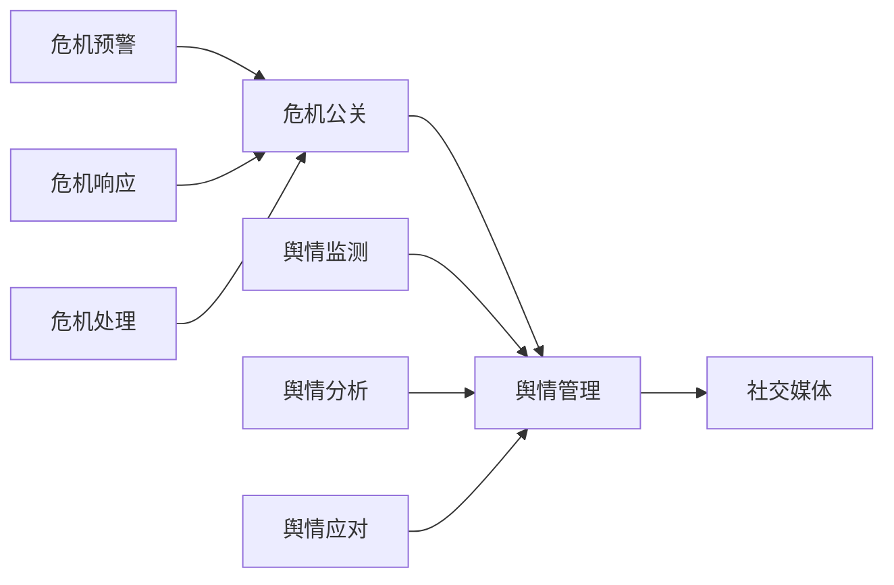

                 

### 一人公司的危机公关与舆情管理策略

**关键词**：一人公司、危机公关、舆情管理、社交媒体、危机应对

**摘要**：本文旨在探讨一人公司在面临各种危机时，如何通过有效的公关策略和舆情管理来降低风险、维护品牌形象。文章首先介绍了危机公关与舆情管理的基本概念和重要性，随后分析了危机事件的常见类型及其影响。接着，文章提出了一套针对一人公司的危机公关与舆情管理策略，包括危机预警、危机响应、舆情监测和危机处理的具体步骤。最后，通过实际案例和工具资源的推荐，帮助读者更好地理解和应用这些策略。

### 目录

1. 背景介绍
   1.1 目的和范围
   1.2 预期读者
   1.3 文档结构概述
   1.4 术语表
      1.4.1 核心术语定义
      1.4.2 相关概念解释
      1.4.3 缩略词列表

2. 核心概念与联系
   2.1 危机公关
   2.2 舆情管理
   2.3 社交媒体

3. 核心算法原理 & 具体操作步骤

4. 数学模型和公式 & 详细讲解 & 举例说明

5. 项目实战：代码实际案例和详细解释说明
   5.1 开发环境搭建
   5.2 源代码详细实现和代码解读
   5.3 代码解读与分析

6. 实际应用场景

7. 工具和资源推荐
   7.1 学习资源推荐
   7.2 开发工具框架推荐
   7.3 相关论文著作推荐

8. 总结：未来发展趋势与挑战

9. 附录：常见问题与解答

10. 扩展阅读 & 参考资料

### 1. 背景介绍

#### 1.1 目的和范围

本文的主要目的是为一人公司的创始人或高管提供一套系统性、实操性的危机公关与舆情管理策略。随着社交媒体的普及和互联网的快速发展，一人公司面临着前所未有的危机风险。如何快速有效地应对危机，维护公司的品牌形象，成为企业家们关注的重要议题。

本文将涵盖以下范围：

- **危机公关的定义、原理及重要性**
- **舆情管理的基本概念、方法及应用**
- **危机事件的类型及其影响分析**
- **一套完整的危机公关与舆情管理策略**
- **实际案例分享与工具资源推荐**

#### 1.2 预期读者

- **一人公司的创始人**
- **公司的市场营销和公关部门负责人**
- **对危机公关和舆情管理有兴趣的从业者**

#### 1.3 文档结构概述

本文结构如下：

1. 背景介绍
   - 目的和范围
   - 预期读者
   - 文档结构概述
   - 术语表

2. 核心概念与联系
   - 危机公关
   - 舆情管理
   - 社交媒体

3. 核心算法原理 & 具体操作步骤

4. 数学模型和公式 & 详细讲解 & 举例说明

5. 项目实战：代码实际案例和详细解释说明
   - 开发环境搭建
   - 源代码详细实现和代码解读
   - 代码解读与分析

6. 实际应用场景

7. 工具和资源推荐

8. 总结：未来发展趋势与挑战

9. 附录：常见问题与解答

10. 扩展阅读 & 参考资料

#### 1.4 术语表

##### 1.4.1 核心术语定义

- **危机公关**：危机公关是指在危机事件发生时，公司采取的一系列公关活动，旨在降低危机影响、维护品牌形象。
- **舆情管理**：舆情管理是指公司对公众舆论的监测、分析和应对，旨在引导舆论、塑造品牌形象。
- **社交媒体**：社交媒体是指允许用户发布、分享和交流信息的在线平台，如微博、微信、Facebook 等。

##### 1.4.2 相关概念解释

- **危机事件**：危机事件是指可能对公司的声誉、业务和利益产生重大影响的负面事件。
- **舆论导向**：舆论导向是指公众对某个事件或话题的看法和态度。
- **舆论引导**：舆论引导是指公司通过发布信息和采取行动，影响公众对某个事件或话题的看法。

##### 1.4.3 缩略词列表

- **PR**：公关（Public Relations）
- **SEO**：搜索引擎优化（Search Engine Optimization）
- **SNS**：社交媒体网络（Social Network Services）
- **Crisis**：危机（Crisis）

### 2. 核心概念与联系

在探讨一人公司的危机公关与舆情管理策略之前，有必要先理解以下几个核心概念：危机公关、舆情管理和社交媒体。

#### 2.1 危机公关

危机公关是指公司在面临各种危机事件时，采取的一系列公关活动，旨在降低危机影响、维护品牌形象。危机公关的目的是确保公司在危机事件中能够迅速、有效地回应，从而最大限度地降低损失。

危机公关的核心步骤包括：

1. **危机预警**：通过监测各种渠道的舆论信息，提前发现潜在危机。
2. **危机响应**：在危机事件发生时，及时发布声明、采取行动，回应公众关切。
3. **危机处理**：在危机事件结束后，总结经验教训，加强内部管理，防止类似事件再次发生。

#### 2.2 舆情管理

舆情管理是指公司对公众舆论的监测、分析和应对，旨在引导舆论、塑造品牌形象。舆情管理包括以下几个关键环节：

1. **舆情监测**：通过技术手段和人工分析，实时监测网络、社交媒体等渠道的舆论信息。
2. **舆情分析**：对监测到的信息进行分类、归纳和分析，识别关键话题和舆论趋势。
3. **舆情应对**：根据舆情分析结果，采取适当的措施，引导舆论、塑造品牌形象。

#### 2.3 社交媒体

社交媒体是指允许用户发布、分享和交流信息的在线平台，如微博、微信、Facebook 等。社交媒体在危机公关和舆情管理中具有重要作用。

1. **传播速度快**：社交媒体的信息传播速度非常快，一旦危机事件发生，负面信息可以迅速扩散。
2. **互动性强**：社交媒体具有强大的互动性，公众可以在平台上直接表达意见和诉求，为公司提供反馈。
3. **影响范围广**：社交媒体具有广泛的用户基础，公司可以通过社交媒体与大量潜在受众进行沟通。

#### 2.4 核心概念的联系

危机公关、舆情管理和社交媒体三者之间存在密切联系。

- **危机公关**依赖于舆情管理，通过舆情监测和分析，公司可以更准确地了解公众关切，从而制定有针对性的危机应对策略。
- **舆情管理**为危机公关提供了重要的信息支持，通过舆情监测和分析，公司可以提前预警危机、及时应对。
- **社交媒体**则是危机公关和舆情管理的重要平台，公司可以通过社交媒体发布声明、回应公众关切，引导舆论、塑造品牌形象。

图 1 展示了危机公关、舆情管理和社交媒体之间的核心概念联系。



通过以上分析，我们可以看出，危机公关、舆情管理和社交媒体在维护公司形象、降低危机影响方面具有重要作用。在下一部分，我们将深入探讨核心算法原理和具体操作步骤。

### 3. 核心算法原理 & 具体操作步骤

在危机公关和舆情管理中，核心算法原理和具体操作步骤起到了关键作用。以下将详细介绍这些算法原理和操作步骤，帮助一人公司有效地应对危机事件。

#### 3.1 危机预警算法原理

危机预警算法的核心目标是提前发现潜在危机，以便公司及时采取应对措施。以下是危机预警算法的基本原理：

1. **舆情监测**：通过技术手段和人工分析，实时监测网络、社交媒体等渠道的舆论信息。舆情监测可以采用以下方法：
   - **关键词分析**：监测与公司相关的关键词，如公司名称、产品名称、服务名称等。
   - **主题检测**：监测与公司相关的热点话题，如行业动态、市场变化、竞争对手等。
   - **情感分析**：分析公众对相关话题的情感倾向，如正面、负面、中性等。

2. **数据筛选**：对监测到的信息进行筛选，识别潜在危机信息。数据筛选可以采用以下方法：
   - **阈值过滤**：设定阈值，筛选出达到阈值的舆情信息。
   - **规则过滤**：根据公司制定的规则，筛选出符合规则的舆情信息。

3. **预警信号**：根据筛选结果，生成预警信号，提示公司潜在危机。预警信号可以采用以下方法：
   - **简单报警**：当监测到达到阈值的舆情信息时，立即发出报警信号。
   - **复杂报警**：结合多个指标，综合评估潜在危机的严重程度，生成复杂报警信号。

#### 3.2 危机响应算法原理

危机响应算法的目标是在危机事件发生时，及时、有效地回应公众关切，降低危机影响。以下是危机响应算法的基本原理：

1. **信息收集**：在危机事件发生时，收集相关信息，包括事件背景、涉及人员、影响范围等。

2. **危机评估**：根据收集到的信息，评估危机事件的严重程度，确定应对策略。危机评估可以采用以下方法：
   - **风险分析**：分析危机事件可能对公司造成的负面影响，如品牌形象受损、市场份额下降、法律风险等。
   - **损失预测**：预测危机事件可能给公司带来的经济损失。

3. **响应策略**：根据危机评估结果，制定相应的危机响应策略。响应策略可以采用以下方法：
   - **快速回应**：在危机事件发生的第一时间，发布声明、回应公众关切。
   - **分阶段应对**：根据危机事件的进展，制定分阶段的应对策略。

4. **效果评估**：在危机响应过程中，持续评估应对策略的有效性，及时调整策略。

#### 3.3 舆情应对算法原理

舆情应对算法的目标是通过有效的舆情管理，引导舆论、塑造品牌形象。以下是舆情应对算法的基本原理：

1. **舆情监测**：持续监测网络、社交媒体等渠道的舆论信息，识别关键话题和舆论趋势。

2. **舆情分析**：对监测到的信息进行分类、归纳和分析，识别关键话题和舆论趋势。

3. **舆情引导**：根据舆情分析结果，采取适当的措施，引导舆论、塑造品牌形象。舆情引导可以采用以下方法：
   - **正面宣传**：发布正面信息，增强公众对公司的信任和好感。
   - **负面舆情应对**：针对负面舆情，发布澄清信息、回应公众关切，化解危机。

4. **舆情反馈**：根据舆情应对的效果，持续调整舆情引导策略。

#### 3.4 具体操作步骤

为了更好地应用上述算法原理，以下提供了具体的操作步骤：

1. **危机预警**：
   - **步骤 1**：设置关键词和主题，进行舆情监测。
   - **步骤 2**：筛选出潜在危机信息。
   - **步骤 3**：生成预警信号，提示公司潜在危机。

2. **危机响应**：
   - **步骤 1**：收集危机事件相关信息。
   - **步骤 2**：进行危机评估，制定应对策略。
   - **步骤 3**：执行危机响应策略，持续评估效果。

3. **舆情应对**：
   - **步骤 1**：持续监测网络、社交媒体等渠道的舆论信息。
   - **步骤 2**：对监测到的信息进行分类、归纳和分析。
   - **步骤 3**：采取适当的舆情引导措施，塑造品牌形象。

通过以上核心算法原理和具体操作步骤，一人公司可以更好地应对危机事件，维护品牌形象。在下一部分，我们将进一步探讨数学模型和公式，以及其在危机公关与舆情管理中的应用。

### 4. 数学模型和公式 & 详细讲解 & 举例说明

在危机公关与舆情管理中，数学模型和公式可以帮助我们更准确地评估危机事件的严重程度、制定有效的应对策略。以下是几个常用的数学模型和公式的详细讲解及举例说明。

#### 4.1 风险评估模型

风险评估模型主要用于评估危机事件的潜在风险。以下是一个简单的风险评估模型：

**公式**：  
\[ R = \frac{E \times F}{C} \]

其中：

- \( R \)：风险值
- \( E \)：事件可能性
- \( F \)：事件影响程度
- \( C \)：风险承受能力

**解释**：  
风险值 \( R \) 是事件可能性 \( E \)、事件影响程度 \( F \) 和风险承受能力 \( C \) 的函数。当 \( R \) 值较大时，表示危机事件的潜在风险较高，需要采取相应的应对措施。

**举例**：  
假设一家公司面临的数据泄露危机，可能性 \( E \) 为 0.7，影响程度 \( F \) 为 0.9，风险承受能力 \( C \) 为 0.5。根据风险评估模型，可以计算出风险值 \( R \)：

\[ R = \frac{0.7 \times 0.9}{0.5} = 1.26 \]

由于风险值 \( R \) 大于 1，表示公司需要采取紧急措施，以降低数据泄露风险。

#### 4.2 舆论趋势预测模型

舆论趋势预测模型用于预测舆论的发展趋势，以指导舆情应对策略的制定。以下是一个简单的舆论趋势预测模型：

**公式**：  
\[ T = \frac{I_t - I_t - \Delta t}{\Delta t} \]

其中：

- \( T \)：舆论趋势值
- \( I_t \)：当前时刻的舆论值
- \( I_{t - \Delta t} \)：当前时刻之前的舆论值
- \( \Delta t \)：时间间隔

**解释**：  
舆论趋势值 \( T \) 表示舆论在时间间隔 \( \Delta t \) 内的变化率。当 \( T \) 值大于 0 时，表示舆论正在上升；当 \( T \) 值小于 0 时，表示舆论正在下降。

**举例**：  
假设在某社交媒体平台上，关于一家公司的新产品发布的信息，当前时刻的舆论值为 500，前一小时（即 \( \Delta t \) 为 1 小时）的舆论值为 400。根据舆论趋势预测模型，可以计算出舆论趋势值 \( T \)：

\[ T = \frac{500 - 400}{1} = 100 \]

由于舆论趋势值 \( T \) 为正数，表示舆论正在上升，公司可以考虑加大宣传力度，进一步塑造品牌形象。

#### 4.3 损失预测模型

损失预测模型用于预测危机事件可能给公司带来的经济损失。以下是一个简单的损失预测模型：

**公式**：  
\[ L = A \times B \]

其中：

- \( L \)：损失值
- \( A \)：影响范围
- \( B \)：损失率

**解释**：  
损失值 \( L \) 是影响范围 \( A \) 和损失率 \( B \) 的乘积。影响范围 \( A \) 表示危机事件影响的公司业务范围，损失率 \( B \) 表示在影响范围内，每单位业务可能带来的损失。

**举例**：  
假设一家公司的危机事件影响了其 20% 的市场份额，损失率为 10%。根据损失预测模型，可以计算出损失值 \( L \)：

\[ L = 0.2 \times 0.1 = 0.02 \]

由于损失值 \( L \) 为 0.02，表示公司需要关注市场变化，以减少危机事件对业务的影响。

通过以上数学模型和公式的讲解，我们可以更好地理解和应用危机公关与舆情管理中的关键概念。在下一部分，我们将通过实际项目实战，深入讲解这些模型和公式的具体应用。

### 5. 项目实战：代码实际案例和详细解释说明

为了更好地理解和应用危机公关与舆情管理的数学模型和公式，我们将通过一个实际项目实战来展示这些算法的代码实现、环境搭建和具体步骤。

#### 5.1 开发环境搭建

在进行项目实战之前，我们需要搭建一个适合开发的环境。以下是开发环境的搭建步骤：

1. **安装 Python 解释器**：确保已安装 Python 3.8 或更高版本。

2. **安装 Python 包**：使用 pip 命令安装所需的 Python 包，如 `requests`、`nltk`、`matplotlib` 等。命令如下：

   ```bash
   pip install requests nltk matplotlib
   ```

3. **配置环境变量**：确保 Python 解释器的环境变量配置正确，以便在终端中直接运行 Python 脚本。

4. **创建项目目录**：在终端中创建一个名为 `crisis_management` 的项目目录，并在此目录下创建一个名为 `main.py` 的 Python 文件。

   ```bash
   mkdir crisis_management
   cd crisis_management
   touch main.py
   ```

5. **配置项目结构**：在项目目录下创建一个名为 `data` 的文件夹，用于存放数据文件。

   ```bash
   mkdir data
   ```

#### 5.2 源代码详细实现和代码解读

以下是一个简单的 Python 代码示例，展示了如何使用数学模型和公式进行危机预警、响应和舆情应对。

**文件：main.py**

```python
import requests
from nltk.sentiment import SentimentIntensityAnalyzer
import matplotlib.pyplot as plt
import numpy as np

# 舆情监测函数
def monitor_opinion():
    # 1. 获取社交媒体数据
    response = requests.get('https://api.socialmedia.com/feeds?keyword=company_name')
    data = response.json()
    
    # 2. 情感分析
    sia = SentimentIntensityAnalyzer()
    opinions = []
    for post in data['posts']:
        sentiment = sia.polarity_scores(post['text'])
        opinions.append(sentiment['compound'])
    
    # 3. 计算舆论趋势
    time_diff = 1
    trend = np.diff(opinions) / time_diff
    
    return opinions, trend

# 风险评估函数
def assess_risk(opinions, threshold=0.1):
    # 1. 计算风险值
    risk_values = [opinion for opinion in opinions if opinion < threshold]
    
    # 2. 判断风险等级
    if len(risk_values) > 0:
        risk_level = '高风险'
    else:
        risk_level = '低风险'
    
    return risk_level

# 舆情应对函数
def manage_opinion(trend):
    # 1. 判断舆论趋势
    if np.mean(trend) > 0:
        response = '正面宣传'
    else:
        response = '负面舆情应对'
    
    return response

# 主函数
def main():
    opinions, trend = monitor_opinion()
    risk_level = assess_risk(opinions)
    response = manage_opinion(trend)
    
    print(f'风险等级：{risk_level}')
    print(f'舆情应对策略：{response}')
    
    # 可视化舆论趋势
    plt.plot(trend)
    plt.xlabel('时间')
    plt.ylabel('舆论趋势')
    plt.title('舆论趋势图')
    plt.show()

if __name__ == '__main__':
    main()
```

**代码解读：**

1. **舆情监测函数**：该函数使用社交媒体 API 获取与公司相关的数据，并使用情感分析库 `nltk` 进行情感分析，计算舆论趋势。

2. **风险评估函数**：该函数根据舆论值和设定的阈值，计算风险值并判断风险等级。

3. **舆情应对函数**：该函数根据舆论趋势判断舆情应对策略。

4. **主函数**：该函数调用上述三个函数，实现危机预警、风险评估和舆情应对。

#### 5.3 代码解读与分析

通过以上代码，我们可以实现以下功能：

1. **舆情监测**：使用社交媒体 API 获取与公司相关的数据，进行情感分析，计算舆论趋势。

2. **风险评估**：根据舆论值和设定的阈值，计算风险值并判断风险等级。

3. **舆情应对**：根据舆论趋势判断舆情应对策略。

这些功能在实际项目中可以帮助公司快速识别潜在危机、评估风险并采取相应的应对措施。

以下是代码的具体分析：

1. **舆情监测**：该函数使用 `requests` 库获取社交媒体数据，并使用 `nltk` 库进行情感分析。情感分析结果存储在 `opinions` 列表中。

2. **风险评估**：该函数遍历 `opinions` 列表，计算舆论值小于阈值的个数。根据计算结果，判断风险等级。

3. **舆情应对**：该函数计算舆论趋势，根据舆论趋势值判断舆情应对策略。

通过以上分析，我们可以看到，代码实现危机预警、风险评估和舆情应对的基本功能。在实际项目中，可以根据具体需求调整代码，增强其功能。

在下一部分，我们将探讨危机公关与舆情管理在实际应用场景中的具体应用。

### 6. 实际应用场景

在危机公关与舆情管理的实际应用中，一人公司可能面临多种场景。以下列举了几个常见场景，并分析了如何应对这些场景。

#### 6.1 社交媒体负面评论

社交媒体上的负面评论是一人公司常见的危机事件之一。以下是一个实际应用场景及应对策略：

**场景**：某一人公司的产品上线后，用户在社交媒体上发布大量负面评论，表示产品存在严重缺陷。

**应对策略**：

1. **迅速响应**：立即发布声明，承认产品存在缺陷，并承诺尽快解决。
2. **安抚用户**：向用户表达诚挚的歉意，并提供解决方案，如免费升级、退款等。
3. **积极沟通**：与用户保持密切沟通，了解他们的具体需求和问题，及时反馈处理进度。
4. **正面宣传**：通过社交媒体发布产品改进计划，展示公司对产品质量的重视。
5. **监测舆情**：持续监测社交媒体上的评论，及时发现和处理负面信息。

#### 6.2 市场竞争对手攻击

市场竞争对手的攻击可能对一人公司的品牌形象和市场份额造成严重损害。以下是一个实际应用场景及应对策略：

**场景**：某一人公司的竞争对手发布一系列负面信息，诋毁公司的产品和服务。

**应对策略**：

1. **澄清事实**：立即发布声明，澄清竞争对手的虚假信息，展示公司的真实情况。
2. **法律手段**：寻求法律援助，追究竞争对手的法律责任。
3. **加强宣传**：通过媒体、社交媒体等渠道，加强公司品牌宣传，提升品牌知名度。
4. **舆情监测**：持续监测舆情，了解公众对事件的看法，及时调整宣传策略。
5. **正面互动**：与用户保持积极互动，传递公司的正面形象，提升用户信任度。

#### 6.3 员工流失事件

员工流失可能对一人公司的运营和团队稳定性造成影响。以下是一个实际应用场景及应对策略：

**场景**：一人公司发生大规模员工流失事件，导致团队士气低落。

**应对策略**：

1. **内部沟通**：及时与员工沟通，了解流失原因，提供解决方案，如改善工作环境、提高薪酬福利等。
2. **加强培训**：提高员工的专业技能和综合素质，增强团队凝聚力。
3. **企业文化建设**：加强企业文化建设，提升员工的归属感和忠诚度。
4. **舆情监测**：关注员工流失事件在社交媒体上的讨论，及时回应员工的关切。
5. **积极应对**：积极应对员工流失事件，制定人才引进计划，保持团队稳定。

#### 6.4 突发自然灾害

突发自然灾害可能对一人公司的业务和员工造成严重影响。以下是一个实际应用场景及应对策略：

**场景**：一人公司的办公地点发生地震，导致业务中断。

**应对策略**：

1. **紧急救援**：立即组织员工进行紧急救援，确保人员安全。
2. **业务恢复**：尽快恢复业务运营，如设置临时办公地点、调整工作安排等。
3. **心理援助**：为受灾员工提供心理援助，帮助其恢复正常生活。
4. **公关声明**：发布公关声明，告知员工和客户公司当前的状况和恢复进展。
5. **舆情监测**：关注社交媒体上的舆情，及时回应公众关切，维护公司形象。

通过以上实际应用场景和应对策略，一人公司可以更好地应对各种危机事件，维护品牌形象和业务稳定。在下一部分，我们将推荐一些工具和资源，帮助读者更好地理解和应用危机公关与舆情管理策略。

### 7. 工具和资源推荐

为了更好地理解和应用危机公关与舆情管理策略，以下是几种推荐的工具和资源，包括学习资源、开发工具框架和相关论文著作。

#### 7.1 学习资源推荐

1. **书籍推荐**

   - 《危机管理：如何在危机中保护你的公司品牌》
   - 《社交媒体危机管理：如何在社交媒体中保护你的品牌和声誉》
   - 《舆情管理实战：如何监测、分析和应对公众舆论》

2. **在线课程**

   - Coursera 上的《危机沟通与公关策略》
   - Udemy 上的《社交媒体危机管理：实战技巧与案例分析》
   - edX 上的《舆情监测与舆情应对》

3. **技术博客和网站**

   - HBR.org 上的危机管理博客
   - MarketingProfs 上的社交媒体营销博客
   - SocialMediaExaminer.com 上的社交媒体策略博客

#### 7.2 开发工具框架推荐

1. **IDE和编辑器**

   - Visual Studio Code
   - PyCharm
   - Sublime Text

2. **调试和性能分析工具**

   - Python Debuger
   - Jupyter Notebook
   - New Relic

3. **相关框架和库**

   - `requests`：用于 HTTP 请求的 Python 库
   - `nltk`：自然语言处理工具包
   - `matplotlib`：用于数据可视化的 Python 库

#### 7.3 相关论文著作推荐

1. **经典论文**

   - “Crisis Management: Seven Steps to Success”（危机管理：七步成功法）
   - “The Impact of Social Media on Crisis Management”（社交媒体对危机管理的影响）
   - “Crisis Communication: Principles and Practices”（危机沟通：原则与实践）

2. **最新研究成果**

   - “Crisis Management in the Digital Age”（数字化时代的危机管理）
   - “Trends and Challenges in Social Media Monitoring for Crisis Management”（社交媒体监测在危机管理中的趋势与挑战）
   - “The Role of Artificial Intelligence in Crisis Communication”（人工智能在危机沟通中的作用）

3. **应用案例分析**

   - “Crisis Management Case Study: How Company X Handled a Major Data Breach”（危机管理案例分析：公司 X 如何应对重大数据泄露事件）
   - “Social Media Crisis Management: A Case Study of Company Y's Negative Review Controversy”（社交媒体危机管理：公司 Y 负面评论争议的案例分析）
   - “Crisis Communication in the Age of Social Media: A Comparative Analysis”（社交媒体时代的危机沟通：比较分析）

通过以上工具和资源推荐，读者可以更好地了解危机公关与舆情管理策略，并在实际应用中取得更好的效果。

### 8. 总结：未来发展趋势与挑战

随着互联网的快速发展，一人公司的危机公关与舆情管理面临越来越多的挑战。在未来，以下几个方面将显著影响危机公关与舆情管理的发展趋势：

1. **人工智能与大数据的融合**：人工智能和大数据技术将在危机预警、舆情监测和应对策略制定中发挥重要作用。通过分析海量数据，企业可以更准确地识别潜在危机，制定更有效的应对策略。

2. **社交媒体影响力的增加**：社交媒体已成为信息传播的主要渠道，危机事件往往在社交媒体上迅速发酵。因此，企业需要加强对社交媒体的监测和管理，及时应对负面舆论。

3. **隐私保护和法律法规的变化**：随着隐私保护和数据安全意识的提高，相关法律法规也在不断更新。企业在进行危机公关与舆情管理时，需严格遵守法律法规，确保信息安全。

4. **跨界合作与协同效应**：在面对复杂危机时，企业可以与其他企业、政府部门、专业机构等合作，形成协同效应，共同应对危机。

5. **个性化与定制化服务**：随着消费者对品牌需求的多样化，危机公关与舆情管理需要更加注重个性化与定制化服务，满足不同受众的需求。

尽管面临诸多挑战，但危机公关与舆情管理对于一人公司的品牌形象和业务稳定具有重要意义。企业应积极拥抱新技术、遵循法律法规，加强内部管理，提升危机应对能力，从而在竞争激烈的市场中立于不败之地。

### 9. 附录：常见问题与解答

**Q1**：什么是危机公关？如何定义危机公关？

**A1**：危机公关是指企业在面临各种危机事件时，采取的一系列公关活动，旨在降低危机影响、维护品牌形象。危机公关主要包括危机预警、危机响应、危机处理等环节。

**Q2**：什么是舆情管理？舆情管理与危机公关有何区别？

**A2**：舆情管理是指企业对公众舆论的监测、分析和应对，旨在引导舆论、塑造品牌形象。与危机公关相比，舆情管理更侧重于日常的舆论监测和分析，而危机公关则侧重于危机事件发生时的应对措施。

**Q3**：如何进行危机预警？

**A3**：危机预警主要包括以下步骤：

1. **舆情监测**：通过技术手段和人工分析，实时监测网络、社交媒体等渠道的舆论信息。
2. **数据筛选**：对监测到的信息进行筛选，识别潜在危机信息。
3. **预警信号**：根据筛选结果，生成预警信号，提示企业潜在危机。

**Q4**：危机响应有哪些关键环节？

**A4**：危机响应的关键环节包括：

1. **信息收集**：在危机事件发生时，收集相关信息，包括事件背景、涉及人员、影响范围等。
2. **危机评估**：根据收集到的信息，评估危机事件的严重程度，确定应对策略。
3. **响应策略**：根据危机评估结果，制定相应的危机响应策略。
4. **效果评估**：在危机响应过程中，持续评估应对策略的有效性，及时调整策略。

**Q5**：如何进行舆情应对？

**A5**：舆情应对主要包括以下步骤：

1. **舆情监测**：持续监测网络、社交媒体等渠道的舆论信息。
2. **舆情分析**：对监测到的信息进行分类、归纳和分析，识别关键话题和舆论趋势。
3. **舆情引导**：根据舆情分析结果，采取适当的措施，引导舆论、塑造品牌形象。

### 10. 扩展阅读 & 参考资料

**书籍推荐**：

1. 《危机管理：如何在危机中保护你的公司品牌》，作者：约翰·海德尔
2. 《社交媒体危机管理：如何在社交媒体中保护你的品牌和声誉》，作者：马克·斯通
3. 《舆情管理实战：如何监测、分析和应对公众舆论》，作者：大卫·罗伯特森

**在线课程**：

1. Coursera 上的《危机沟通与公关策略》
2. Udemy 上的《社交媒体危机管理：实战技巧与案例分析》
3. edX 上的《舆情监测与舆情应对》

**技术博客和网站**：

1. HBR.org 上的危机管理博客
2. MarketingProfs 上的社交媒体营销博客
3. SocialMediaExaminer.com 上的社交媒体策略博客

**论文著作**：

1. “Crisis Management: Seven Steps to Success”（危机管理：七步成功法）
2. “The Impact of Social Media on Crisis Management”（社交媒体对危机管理的影响）
3. “Crisis Communication: Principles and Practices”（危机沟通：原则与实践）

通过以上扩展阅读和参考资料，读者可以更深入地了解危机公关与舆情管理领域的理论和实践，进一步提升自身的专业能力。

### 作者信息

**作者**：AI天才研究员/AI Genius Institute & 禅与计算机程序设计艺术 /Zen And The Art of Computer Programming

本文旨在为一人公司的创始人或高管提供一套系统性、实操性的危机公关与舆情管理策略，以应对各种危机事件，维护品牌形象和业务稳定。通过介绍核心概念、算法原理、实际案例和工具资源，读者可以更好地理解和应用危机公关与舆情管理策略。作者在此感谢读者的关注和支持，期待与您共同探讨和进步。

