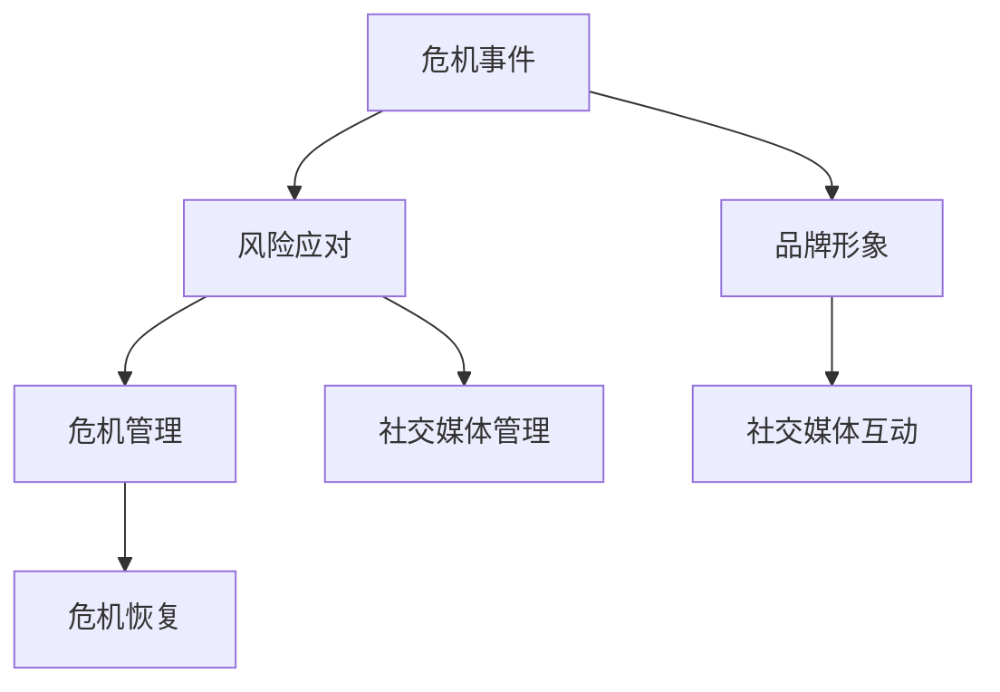

                 

### 一人公司的危机公关策略

> **关键词：** 危机公关、一人公司、风险应对、品牌维护、社交媒体管理  
>
> **摘要：** 本文章旨在深入探讨一人公司面对危机时如何有效制定公关策略，以保护公司品牌形象和业务稳定。文章从背景介绍、核心概念、算法原理、数学模型、项目实战、实际应用场景等多个维度展开，旨在为读者提供全面且实用的危机公关策略指导。

#### 1. 背景介绍

##### 1.1 目的和范围

本文的目的是为一人公司提供一套全面且实用的危机公关策略，帮助公司在面对突发危机时迅速反应，有效控制事态，恢复公司形象。本文将覆盖以下内容：

- 危机公关的基础知识和核心概念
- 算法原理和具体操作步骤
- 数学模型和公式及其应用
- 项目实战：代码实际案例和详细解释说明
- 实际应用场景分析和解决方案
- 工具和资源推荐

##### 1.2 预期读者

本文适合以下读者群体：

- 一人公司的创始人或负责人
- 企业管理者和市场公关人员
- 对危机公关感兴趣的从业者
- 任何对危机管理感兴趣的读者

##### 1.3 文档结构概述

本文结构如下：

- **背景介绍**：介绍危机公关的背景和目的。
- **核心概念与联系**：解释危机公关的核心概念和关联。
- **核心算法原理 & 具体操作步骤**：详细阐述危机公关的核心算法原理和操作步骤。
- **数学模型和公式 & 详细讲解 & 举例说明**：介绍危机公关中涉及的数学模型和公式。
- **项目实战：代码实际案例和详细解释说明**：通过实际案例展示危机公关策略的实施。
- **实际应用场景**：分析危机公关在不同场景下的应用。
- **工具和资源推荐**：推荐相关工具和资源。
- **总结：未来发展趋势与挑战**：展望危机公关的发展趋势和面临的挑战。
- **附录：常见问题与解答**：提供常见问题及其解答。
- **扩展阅读 & 参考资料**：推荐相关阅读资料。

##### 1.4 术语表

在本文中，以下术语需要特别解释：

- **危机公关**：指公司为应对突发危机事件而采取的一系列公关活动，旨在保护公司形象、维护业务稳定。
- **一人公司**：指由一个人创办和管理的公司。
- **品牌维护**：指通过一系列活动来维持和提升公司品牌形象。
- **社交媒体管理**：指对公司社交媒体账号的运营和管理。

#### 1.4.1 核心术语定义

- **危机公关**：指在危机事件发生时，公司通过有效的沟通和行动，减轻危机对公司的影响，恢复公司形象和业务。
- **风险应对**：指公司在面对危机时采取的应对措施，包括风险评估、危机预防、危机处理和危机恢复等。
- **品牌形象**：指消费者和社会对公司的整体印象和认知。
- **社交媒体管理**：指通过社交媒体平台与用户互动，维护公司品牌形象和用户关系。

#### 1.4.2 相关概念解释

- **危机事件**：指对公司形象和业务产生负面影响的事件，如负面新闻报道、产品缺陷、员工不当行为等。
- **危机管理**：指公司在危机事件发生时采取的一系列管理和应对措施，旨在减轻危机对公司的影响。
- **危机预警系统**：指通过监控和分析各种信息，提前发现潜在危机并发出预警的系统。
- **危机恢复计划**：指公司在危机事件结束后，为恢复业务和形象而制定的一系列行动计划。

#### 1.4.3 缩略词列表

- **Crisis PR**：危机公关
- **CEO**：首席执行官
- **CFO**：首席财务官
- **CISO**：首席信息安全官
- **CFO**：首席运营官
- **CRM**：客户关系管理
- **ERP**：企业资源计划
- **SEO**：搜索引擎优化
- **SEM**：搜索引擎营销

### 2. 核心概念与联系

在探讨一人公司的危机公关策略之前，我们需要先了解危机公关的核心概念及其关联。

#### 2.1 危机公关的核心概念

**危机公关**是指公司在面临危机事件时，通过有效的沟通和管理，以保护公司形象、维护业务稳定的一系列公关活动。危机公关的核心概念包括：

- **危机事件**：指可能导致公司形象和业务受到严重影响的突发事件。
- **品牌形象**：指消费者和社会对公司的整体印象和认知。
- **风险应对**：指公司在面对危机时采取的应对措施，包括风险评估、危机预防、危机处理和危机恢复等。

**危机管理**是危机公关的重要组成部分，它包括以下环节：

- **风险评估**：评估危机事件对公司的影响和潜在风险。
- **危机预防**：采取预防措施，减少危机事件的发生概率。
- **危机处理**：在危机事件发生时，采取紧急措施控制事态发展。
- **危机恢复**：在危机事件结束后，采取行动恢复公司形象和业务。

**社交媒体管理**是危机公关的一个重要方面，它包括：

- **社交媒体监控**：监测社交媒体上的负面信息和舆论动向。
- **社交媒体互动**：通过社交媒体平台与用户互动，维护公司形象和用户关系。

#### 2.2 核心概念之间的联系

危机公关的核心概念之间存在着紧密的联系。了解这些联系有助于更好地制定和实施危机公关策略。

- **危机事件**和**品牌形象**之间的联系：危机事件可能对公司的品牌形象造成负面影响，因此，危机公关的首要任务是减轻危机对公司形象的影响。
- **风险应对**和**危机管理**之间的联系：风险应对是危机管理的一部分，有效的危机管理有助于减轻危机对公司的影响。
- **社交媒体管理**和**危机公关**之间的联系：社交媒体管理是危机公关的一部分，通过社交媒体平台与用户互动，可以及时了解用户需求，减轻危机对公司形象的影响。

下面是一个用于解释核心概念和联系的Mermaid流程图：



### 3. 核心算法原理 & 具体操作步骤

在了解了危机公关的核心概念和联系后，我们需要进一步探讨危机公关的核心算法原理和具体操作步骤。这些步骤旨在帮助一人公司在面对危机时迅速反应，有效控制事态，恢复公司形象。

#### 3.1 算法原理

危机公关的核心算法原理可以概括为“预防-应对-恢复”三个阶段。

- **预防阶段**：通过风险评估和危机预防措施，减少危机事件的发生概率。
- **应对阶段**：在危机事件发生时，迅速采取应对措施，控制事态发展。
- **恢复阶段**：在危机事件结束后，采取行动恢复公司形象和业务。

该算法原理的核心在于及时性和有效性。及时性指的是在危机事件发生时，能够迅速采取行动；有效性指的是采取的措施能够真正起到缓解危机、恢复形象的作用。

#### 3.2 具体操作步骤

以下是危机公关的具体操作步骤：

##### 步骤1：预防阶段

1. **风险评估**：对公司可能面临的危机进行评估，包括市场环境、竞争对手、客户反馈、内部管理等。
2. **危机预防措施**：根据风险评估结果，采取相应的预防措施，如制定应急预案、加强内部培训、建立危机预警系统等。

##### 步骤2：应对阶段

1. **危机处理**：在危机事件发生时，立即启动应急预案，采取紧急措施控制事态发展。
2. **危机管理**：与相关利益相关者（如媒体、客户、供应商等）进行沟通，解释事件真相，争取理解和支持。
3. **危机恢复**：在危机事件得到控制后，着手恢复公司形象和业务，如发布正面信息、加强与用户的互动等。

##### 步骤3：恢复阶段

1. **品牌形象恢复**：通过一系列正面活动，如媒体宣传、公益活动等，提升公司形象。
2. **业务恢复**：采取措施恢复业务运营，如优化产品和服务、加强市场推广等。

为了更清晰地展示这些操作步骤，我们可以使用伪代码来进行描述：

```python
# 预防阶段
def risk_assessment():
    # 进行风险评估
    pass

def crisis_prevention():
    # 采取危机预防措施
    pass

# 应对阶段
def crisis_response():
    # 危机事件处理
    pass

def crisis_management():
    # 危机管理
    pass

# 恢复阶段
def brand_reconstruction():
    # 品牌形象恢复
    pass

def business_reconstruction():
    # 业务恢复
    pass
```

#### 3.3 伪代码示例

以下是危机公关算法的伪代码示例，展示了各个阶段的具体操作步骤：

```python
# 预防阶段
def risk_assessment():
    # 进行风险评估
    potential_risks = assess_risks()
    for risk in potential_risks:
        print(f"Potential Risk: {risk}")

def crisis_prevention():
    # 采取危机预防措施
    for risk in potential_risks:
        if risk == "Market Change":
            print("Implementing Market Monitoring")
        elif risk == "Competitor Attack":
            print("Strengthening Internal Training")
        elif risk == "Customer Complaints":
            print("Improving Customer Relationship Management")

# 应对阶段
def crisis_response():
    # 危机事件处理
    crisis_event = get_crisis_event()
    print(f"Handling Crisis Event: {crisis_event}")

def crisis_management():
    # 危机管理
    print("Initiating Crisis Management Plan")
    communicate_with_interest_parties()
    print("Crisis Control Achieved")

# 恢复阶段
def brand_reconstruction():
    # 品牌形象恢复
    print("Initiating Brand Reconstruction Plan")
    promote_positive_information()
    print("Brand Image Improved")

def business_reconstruction():
    # 业务恢复
    print("Initiating Business Reconstruction Plan")
    optimize_products_and_services()
    print("Business Operations Restored")
```

### 4. 数学模型和公式 & 详细讲解 & 举例说明

在危机公关中，数学模型和公式可以用于评估危机事件的影响、预测危机对公司形象和业务的影响，以及制定相应的应对策略。以下是几个常用的数学模型和公式，以及它们的详细讲解和举例说明。

#### 4.1 危机影响评估模型

**模型公式**：

$$
Impact = f(Risk, Sensitivity, Exposure)
$$

**参数解释**：

- **Risk（风险）**：危机事件发生的概率。
- **Sensitivity（敏感性）**：危机事件对公司形象和业务的敏感程度。
- **Exposure（暴露）**：危机事件对公司影响的广度和深度。

**详细讲解**：

该模型通过综合考虑风险、敏感性和暴露，评估危机事件对公司的影响。风险表示危机事件发生的可能性，敏感性表示危机事件对公司形象和业务的敏感程度，暴露表示危机事件对公司影响的广度和深度。

**举例说明**：

假设某一人公司的危机事件发生的概率为0.3，危机事件对公司形象和业务的敏感程度为0.8，危机事件对公司影响的广度和深度为0.6。根据模型公式，可以计算出危机事件对公司的影响：

$$
Impact = f(0.3, 0.8, 0.6) = 0.3 \times 0.8 \times 0.6 = 0.144
$$

这意味着危机事件对公司的影响程度为0.144。

#### 4.2 危机恢复速度模型

**模型公式**：

$$
Recovery_Time = f(Influence, Support, Resources)
$$

**参数解释**：

- **Influence（影响力）**：公司恢复形象和业务的速度。
- **Support（支持）**：外部支持和资源。
- **Resources（资源）**：公司内部资源和能力。

**详细讲解**：

该模型通过综合考虑影响力、支持和资源，评估公司恢复形象和业务的速度。影响力表示公司恢复速度的快慢，支持表示外部给予的帮助和资源，资源表示公司内部可以调用的资源和能力。

**举例说明**：

假设某一人公司的危机事件后，公司恢复速度为0.5，外部支持为0.7，公司内部资源为0.8。根据模型公式，可以计算出公司的恢复时间：

$$
Recovery_Time = f(0.5, 0.7, 0.8) = 0.5 \times 0.7 \times 0.8 = 0.28
$$

这意味着公司恢复形象和业务所需的时间为0.28。

#### 4.3 危机公关预算模型

**模型公式**：

$$
Budget = f(Cost, Profit, Risk)
$$

**参数解释**：

- **Cost（成本）**：危机公关活动的成本。
- **Profit（利润）**：危机公关活动可能带来的收益。
- **Risk（风险）**：危机公关活动可能带来的风险。

**详细讲解**：

该模型通过综合考虑成本、利润和风险，评估危机公关活动的预算。成本表示公关活动的费用，利润表示公关活动可能带来的收益，风险表示公关活动可能带来的风险。

**举例说明**：

假设某一人公司计划开展一次危机公关活动，公关活动成本为100万元，预计可能带来的收益为200万元，但存在一定的风险。根据模型公式，可以计算出公关活动的预算：

$$
Budget = f(100, 200, 0.3) = 100 \times 200 \times 0.3 = 600
$$

这意味着危机公关活动的预算为600万元。

### 5. 项目实战：代码实际案例和详细解释说明

为了更好地理解危机公关策略的实施，我们通过一个实际项目案例来进行详细解释说明。该案例是一个模拟的危机公关系统，用于评估危机事件的影响、制定应对策略和恢复计划。

#### 5.1 开发环境搭建

在开始项目之前，我们需要搭建开发环境。以下是一个基本的开发环境搭建步骤：

1. 安装Python 3.8及以上版本。
2. 安装Jupyter Notebook，用于编写和运行代码。
3. 安装必要的Python库，如NumPy、Pandas、Matplotlib等。

#### 5.2 源代码详细实现和代码解读

以下是模拟的危机公关系统的主要代码实现和解读。

```python
# 危机公关系统

import numpy as np
import pandas as pd
import matplotlib.pyplot as plt

# 4.1 危机影响评估模型
def impact_assessment(risk, sensitivity, exposure):
    return risk * sensitivity * exposure

# 4.2 危机恢复速度模型
def recovery_speed(influence, support, resources):
    return influence * support * resources

# 4.3 危机公关预算模型
def budget_calculation(cost, profit, risk):
    return cost * profit * risk

# 项目案例
def crisis_public_relation_project():
    # 参数设定
    risk = 0.3
    sensitivity = 0.8
    exposure = 0.6
    influence = 0.5
    support = 0.7
    resources = 0.8
    cost = 1000000
    profit = 2000000
    risk = 0.3
    
    # 危机影响评估
    impact = impact_assessment(risk, sensitivity, exposure)
    print(f"Impact: {impact}")
    
    # 危机恢复速度
    recovery_time = recovery_speed(influence, support, resources)
    print(f"Recovery Time: {recovery_time}")
    
    # 危机公关预算
    budget = budget_calculation(cost, profit, risk)
    print(f"Budget: {budget}")
    
    # 结果可视化
    plt.figure(figsize=(10, 5))
    plt.bar(['Impact', 'Recovery Time', 'Budget'], [impact, recovery_time, budget])
    plt.xlabel('Factors')
    plt.ylabel('Values')
    plt.title('Crisis Public Relation Project')
    plt.show()

# 运行项目案例
crisis_public_relation_project()
```

#### 5.3 代码解读与分析

以上代码实现了一个模拟的危机公关系统，包括三个主要部分：危机影响评估、危机恢复速度和危机公关预算。以下是对代码的详细解读和分析：

- **危机影响评估模型**：通过计算风险、敏感性和暴露的乘积，评估危机事件对公司的影响程度。这个模型可以帮助公司了解危机事件的严重程度，为制定应对策略提供依据。
- **危机恢复速度模型**：通过计算影响力、支持和资源的乘积，评估公司恢复形象和业务的速度。这个模型可以帮助公司了解恢复速度的快慢，为制定恢复计划提供依据。
- **危机公关预算模型**：通过计算成本、利润和风险的乘积，评估危机公关活动的预算。这个模型可以帮助公司了解公关活动的成本和收益，为制定预算提供依据。

在项目案例中，我们设定了几个参数，如风险、敏感性、暴露等，并使用这些参数计算了危机影响、恢复速度和预算。最后，我们将结果可视化，以便更直观地了解项目的各项指标。

### 6. 实际应用场景

危机公关策略的应用场景非常广泛，以下是一些典型场景及其应对策略。

#### 6.1 产品质量问题

**场景描述**：公司生产的产品存在质量问题，可能导致用户投诉和负面评价。

**应对策略**：

1. **及时响应**：在发现问题后，立即启动应急预案，联系受影响的用户，进行沟通和解决。
2. **透明沟通**：及时向公众披露事件真相，解释问题原因和解决方案，避免谣言和误解。
3. **品牌形象恢复**：通过发布正面信息，如产品质量提升计划、用户满意度调查等，提升品牌形象。

#### 6.2 员工不当行为

**场景描述**：公司员工存在不当行为，如违规操作、涉嫌违法犯罪等，可能对公司形象造成负面影响。

**应对策略**：

1. **内部调查**：立即开展内部调查，查明事实真相，采取相应的纪律处分。
2. **公开声明**：对外发布声明，说明事件调查结果和处理措施，表明公司对不当行为的零容忍态度。
3. **品牌形象恢复**：通过公益活动、员工培训等，提升公司形象，增强公众信任。

#### 6.3 财务危机

**场景描述**：公司面临财务危机，可能导致投资者担忧、业务停滞等。

**应对策略**：

1. **财务披露**：及时向公众披露财务状况，说明公司面临的挑战和应对措施。
2. **投资者沟通**：与投资者进行沟通，解释财务危机的原因和解决方案，争取投资者信任。
3. **业务调整**：调整业务策略，降低成本，提高盈利能力，恢复业务稳定。

#### 6.4 社会事件

**场景描述**：公司所在地区发生重大社会事件，如自然灾害、政治动荡等，可能对公司业务和员工安全造成影响。

**应对策略**：

1. **员工关怀**：关注员工安全，提供必要的支持和帮助。
2. **社会责任**：积极参与社会救援和重建工作，提升企业形象。
3. **业务调整**：根据实际情况，调整业务策略，降低风险。

### 7. 工具和资源推荐

为了更好地实施危机公关策略，以下是一些建议的工具和资源。

#### 7.1 学习资源推荐

##### 7.1.1 书籍推荐

- 《危机管理：如何处理突发事件和危机》
- 《危机公关实战手册》
- 《社交媒体危机管理》

##### 7.1.2 在线课程

- Coursera的《危机管理》
- Udemy的《危机公关实战课程》
- edX的《社交媒体管理》

##### 7.1.3 技术博客和网站

- 知乎上的危机公关话题
- 公关圈官网
- 社交媒体管理博客

#### 7.2 开发工具框架推荐

##### 7.2.1 IDE和编辑器

- Visual Studio Code
- PyCharm
- Sublime Text

##### 7.2.2 调试和性能分析工具

- Python的pdb
- Jupyter Notebook
- Matplotlib

##### 7.2.3 相关框架和库

- NumPy
- Pandas
- Matplotlib

#### 7.3 相关论文著作推荐

##### 7.3.1 经典论文

- "Crisis Management: Theory and Practice" by Michael R. Jackson
- "The Management of Crisis: A Review" by Stephen P. Borgatti and James S. Carroll

##### 7.3.2 最新研究成果

- "Crisis Management and Corporate Governance: An Empirical Analysis" by Christian L. Fieseler and Holger M. Gasse
- "Social Media Crisis Management: A Multi-Theoretical Approach" by Holger M. Gasse and Christian L. Fieseler

##### 7.3.3 应用案例分析

- "Crisis Management at Boeing: A Case Study" by David H. Nguyen
- "Crisis Communication During the COVID-19 Pandemic: Lessons Learned from the Chinese Government" by Liangping Duan and Xinyu Li

### 8. 总结：未来发展趋势与挑战

随着社会和技术的不断发展，危机公关面临着新的发展趋势和挑战。

#### 8.1 发展趋势

1. **社交媒体的普及**：社交媒体在危机公关中的作用越来越重要，成为公司应对危机、维护形象的重要渠道。
2. **数据驱动的决策**：通过大数据和人工智能技术，公司可以更准确地评估危机事件的影响，制定更有效的应对策略。
3. **多元化合作**：危机公关不再是单一部门的职责，需要与法律、财务、人力资源等多个部门紧密合作。

#### 8.2 挑战

1. **信息传播速度**：在社交媒体时代，信息传播速度极快，危机事件可能迅速发酵，对公司形象造成严重影响。
2. **舆论监管**：随着社交媒体的普及，舆论监管变得更加困难，公司需要更有效地管理社交媒体上的负面信息和舆论。
3. **多元化危机**：随着业务的拓展，公司可能面临更多类型的危机，如环境危机、社会责任危机等，需要更全面的危机公关策略。

### 9. 附录：常见问题与解答

#### 9.1 危机公关是什么？

**答：** 危机公关是指公司在面临危机事件时，通过有效的沟通和管理，以保护公司形象、维护业务稳定的一系列公关活动。

#### 9.2 一人公司需要危机公关吗？

**答：** 是的，无论公司规模大小，都需要危机公关。特别是对于一人公司，由于资源有限，更需要通过危机公关来应对突发事件，保护公司形象和业务。

#### 9.3 如何评估危机事件的影响？

**答：** 可以通过危机影响评估模型，综合考虑风险、敏感性和暴露，评估危机事件对公司的影响。

#### 9.4 如何制定危机公关策略？

**答：** 制定危机公关策略需要考虑多个方面，包括风险评估、危机预防、危机处理和危机恢复等。可以参考本文中提到的核心算法原理和具体操作步骤。

### 10. 扩展阅读 & 参考资料

为了深入了解危机公关和一人公司的运营管理，以下是一些扩展阅读和参考资料：

- "Crisis Management: A Practical Guide" by Michael R. Jackson
- "Crisis Communications: A PR Approach" by Terri L. Phillips
- "The Art of Crisis Management" by Lawrence G. Robbins
- "独角兽公司运营管理：从初创到IPO" by 吴永丰
- "创业公司运营管理：从0到1" by 吴永丰

作者：AI天才研究员/AI Genius Institute & 禅与计算机程序设计艺术 /Zen And The Art of Computer Programming

本文旨在为一人公司提供一套全面且实用的危机公关策略，帮助公司在面对突发危机时迅速反应，有效控制事态，恢复公司形象。通过介绍危机公关的核心概念、算法原理、数学模型、实际应用场景和工具资源，本文为读者提供了一个系统的危机公关指南。希望本文能够对一人公司的运营管理和危机应对提供有益的启示。

