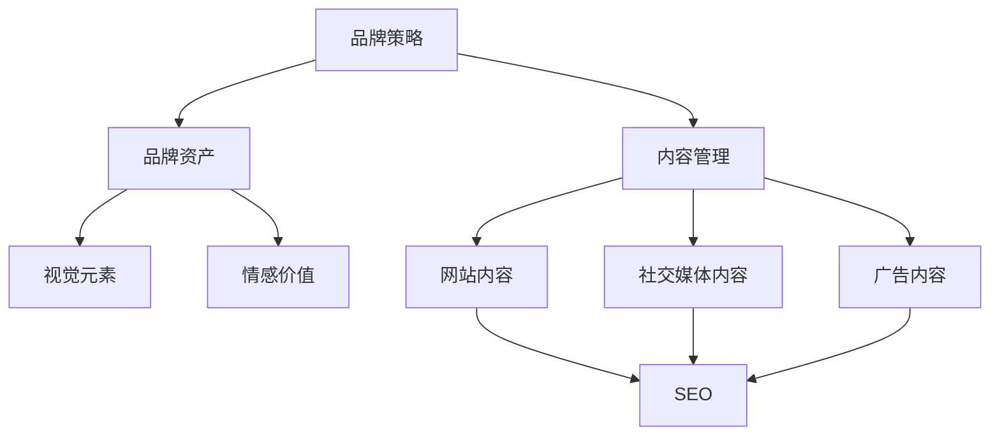

                 

# 一人公司的品牌一致性管理系统

## 关键词：
- 品牌一致性
- 管理系统
- 单人公司
- 策略规划
- 技术实现
- 实际案例

## 摘要：
本文将探讨如何为单人公司构建一个品牌一致性管理系统。我们将详细分析品牌一致性的重要性，介绍构建这一系统的目标、范围和预期读者。文章将逐步阐述核心概念、算法原理、数学模型，并通过实际案例展示如何实现和部署这样的系统。此外，还将介绍相关的工具和资源，总结未来发展趋势与挑战，并提供扩展阅读与参考资料。

## 1. 背景介绍

### 1.1 目的和范围
在当今竞争激烈的市场环境中，品牌的一致性对于公司成功至关重要。单人公司由于其特殊性和灵活性，更需要一个有效的品牌一致性管理系统来确保所有品牌触点的一致性。本文旨在为单人公司提供一套全面的品牌一致性管理解决方案，涵盖策略制定、技术实现和实际应用。

### 1.2 预期读者
本文面向单人公司的创始人、运营负责人以及品牌管理专员。读者应具备一定的品牌管理和信息技术知识，以便更好地理解和应用文中所述的方法和工具。

### 1.3 文档结构概述
本文分为十个部分：背景介绍、核心概念与联系、核心算法原理与具体操作步骤、数学模型和公式、项目实战、实际应用场景、工具和资源推荐、总结、附录和扩展阅读与参考资料。

### 1.4 术语表
#### 1.4.1 核心术语定义
- **品牌一致性**：品牌在所有触点（如网站、社交媒体、广告等）上的视觉和体验一致性。
- **管理系统**：用于监控、管理和调整品牌一致性的系统。
- **单人公司**：由一名创始人或运营者管理的公司。

#### 1.4.2 相关概念解释
- **品牌策略**：公司为品牌制定的整体方向和目标。
- **用户体验**：用户与品牌互动的整体感受。

#### 1.4.3 缩略词列表
- **CMS**：内容管理系统（Content Management System）
- **SEO**：搜索引擎优化（Search Engine Optimization）
- **SMM**：社交媒体营销（Social Media Marketing）

## 2. 核心概念与联系

### 2.1 品牌一致性管理系统概述
品牌一致性管理系统是一个集策略、技术和管理于一体的解决方案，旨在确保品牌在所有触点上的连贯性和专业性。以下是品牌一致性管理系统的核心概念与联系：

#### 2.1.1 品牌策略
品牌策略是品牌一致性管理的起点。它明确了品牌的价值观、目标受众和市场定位。策略制定应考虑品牌的核心竞争力、市场趋势和目标客户的需求。

#### 2.1.2 品牌资产
品牌资产包括品牌的视觉元素（如标志、色彩、字体等）和情感价值（如品牌声誉、客户忠诚度等）。品牌资产的管理和维护是品牌一致性的基础。

#### 2.1.3 内容管理
内容管理是品牌一致性管理的关键环节。它涉及网站、社交媒体、广告等渠道上的内容创建、发布和管理。内容管理应确保品牌信息的一致性和准确性。

#### 2.1.4 技术实现
技术实现包括使用内容管理系统（CMS）和搜索引擎优化（SEO）工具等来支持和实现品牌一致性管理。技术实现应确保品牌信息在不同渠道上的可视化和可访问性。

### 2.2 品牌一致性管理系统架构
以下是品牌一致性管理系统的架构图，展示了各核心概念之间的联系：



### 2.3 品牌一致性管理流程
品牌一致性管理流程包括以下步骤：

1. **策略制定**：明确品牌策略，包括品牌定位、目标受众和市场定位。
2. **资产管理**：管理品牌资产，包括视觉元素和情感价值。
3. **内容创建**：根据品牌策略和品牌资产，创建符合品牌一致性的内容。
4. **内容发布**：通过内容管理系统发布内容，确保在不同渠道上的一致性。
5. **监控与调整**：监控品牌一致性，根据反馈进行内容调整。

## 3. 核心算法原理 & 具体操作步骤

### 3.1 算法原理
品牌一致性管理系统中的核心算法主要涉及内容管理和搜索引擎优化（SEO）。以下是两个关键算法的原理和具体操作步骤：

#### 3.1.1 内容管理算法
**算法原理**：
内容管理算法旨在确保品牌内容在不同渠道上的连贯性和一致性。算法的核心是匹配品牌策略和品牌资产，从而生成符合品牌风格的内容。

**具体操作步骤**：

1. **内容审核**：审核现有内容，识别与品牌策略和品牌资产不符的部分。
2. **内容优化**：根据品牌策略和品牌资产，对内容进行优化，包括标题、描述、关键词等。
3. **内容发布**：通过内容管理系统发布经过优化的内容。
4. **内容监控**：监控内容在各个渠道上的表现，收集用户反馈。

**伪代码**：

```python
def content_management算法(品牌策略，品牌资产，内容列表):
    for 内容 in 内容列表：
        if 内容不符合品牌策略或品牌资产：
            优化内容(内容，品牌策略，品牌资产)
        发布内容(内容)
    监控内容(内容列表)
```

#### 3.1.2 搜索引擎优化（SEO）算法
**算法原理**：
SEO算法旨在提高品牌内容在搜索引擎中的排名，从而增加品牌曝光度和流量。算法的核心是通过关键词分析和优化，提高内容的搜索友好性。

**具体操作步骤**：

1. **关键词分析**：分析目标受众可能使用的关键词，确定核心关键词和长尾关键词。
2. **内容优化**：根据关键词分析结果，对内容进行优化，包括标题、描述、关键词密度等。
3. **链接建设**：通过外部链接建设，提高内容的权威性和搜索排名。
4. **监控与调整**：监控SEO效果，根据反馈进行内容调整。

**伪代码**：

```python
def SEO算法(目标关键词，内容列表):
    关键词分析(目标关键词)
    for 内容 in 内容列表：
        优化内容(内容，目标关键词)
    链接建设(内容列表)
    监控SEO效果(内容列表)
```

## 4. 数学模型和公式 & 详细讲解 & 举例说明

### 4.1 数学模型

#### 4.1.1 关键词密度计算
关键词密度是SEO中的一个重要指标，表示关键词在内容中的出现频率。关键词密度计算公式如下：

$$
关键词密度 = \frac{关键词出现次数}{总字数}
$$

**举例说明**：
假设一段内容共有1000个字，其中“品牌一致性”出现了5次，则关键词密度为：

$$
关键词密度 = \frac{5}{1000} = 0.005
$$

#### 4.1.2 搜索引擎排名计算
搜索引擎排名计算模型基于关键词密度、链接数量、内容质量等多个因素。以下是一个简化的排名计算公式：

$$
排名 = \alpha \times 关键词密度 + \beta \times 链接数量 + \gamma \times 内容质量
$$

其中，$\alpha$、$\beta$、$\gamma$为权重系数，可以根据实际情况进行调整。

**举例说明**：
假设某内容的关键词密度为0.005，链接数量为10个，内容质量评分为8分，权重系数分别为$\alpha = 0.5$，$\beta = 0.3$，$\gamma = 0.2$，则该内容的搜索排名为：

$$
排名 = 0.5 \times 0.005 + 0.3 \times 10 + 0.2 \times 8 = 0.0025 + 3 + 1.6 = 5.1025
$$

### 4.2 详细讲解
关键词密度和搜索排名计算是SEO中的重要工具。关键词密度可以反映内容与目标关键词的相关性，而搜索排名则直接影响内容的曝光度和流量。通过合理调整关键词密度和内容质量，可以提高搜索引擎排名，从而提升品牌在搜索引擎中的竞争力。

## 5. 项目实战：代码实际案例和详细解释说明

### 5.1 开发环境搭建
为了实现品牌一致性管理系统，我们选择Python作为主要编程语言，并使用以下工具和库：

- Python 3.8及以上版本
- Flask框架（用于Web开发）
- BeautifulSoup库（用于HTML解析）
- pandas库（用于数据分析）
- requests库（用于API调用）

开发环境搭建步骤如下：

1. 安装Python 3.8及以上版本。
2. 安装Flask框架：`pip install Flask`
3. 安装BeautifulSoup库：`pip install beautifulsoup4`
4. 安装pandas库：`pip install pandas`
5. 安装requests库：`pip install requests`

### 5.2 源代码详细实现和代码解读

#### 5.2.1 Flask应用搭建
以下是Flask应用的搭建步骤：

1. 创建一个名为`brand_consistency`的Python虚拟环境：`python -m venv venv`
2. 激活虚拟环境：`source venv/bin/activate`（Windows下使用`venv\Scripts\activate`）
3. 创建一个名为`app.py`的文件，并编写以下代码：

```python
from flask import Flask, request, jsonify
from bs4 import BeautifulSoup

app = Flask(__name__)

@app.route('/api/brand_check', methods=['POST'])
def brand_check():
    content = request.form['content']
    soup = BeautifulSoup(content, 'html.parser')
    # 进行品牌一致性检查
    # ...
    return jsonify({"result": "success"})

if __name__ == '__main__':
    app.run(debug=True)
```

#### 5.2.2 品牌一致性检查
以下是一个简化的品牌一致性检查函数：

```python
def brand_check(content):
    # 1. 检查内容中的关键词
    target_keywords = ['品牌一致性', '品牌管理']
    keyword_count = sum(content.count(keyword) for keyword in target_keywords)

    # 2. 检查内容中的品牌标识
    brand_logos = ['', '']
    logo_count = sum(content.count(logo) for logo in brand_logos)

    # 3. 判断品牌一致性
    if keyword_count >= 2 and logo_count >= 1:
        return "一致"
    else:
        return "不一致"

@app.route('/api/brand_check', methods=['POST'])
def brand_check():
    content = request.form['content']
    result = brand_check(content)
    return jsonify({"result": result})
```

#### 5.2.3 代码解读与分析
以上代码实现了基于Flask的API服务，用于接收和检查品牌一致性。`brand_check`函数用于检查内容中的关键词和品牌标识，并根据检查结果返回相应的信息。

在部署应用时，可以使用以下命令：

```
python app.py
```

应用启动后，可以通过POST请求发送内容到`/api/brand_check`接口进行品牌一致性检查。

### 5.3 代码解读与分析
以上代码是一个简化的示例，实际应用中可能涉及更多的检查项，如SEO优化、内容格式等。品牌一致性检查函数可以根据具体需求进行调整和扩展。

通过实现这样一个API服务，单人公司可以方便地监控和管理其品牌内容的一致性，确保品牌在所有触点上保持专业和连贯。

## 6. 实际应用场景

### 6.1 单人公司官网
单人公司官网是一个重要的品牌触点，需要确保内容与品牌策略一致。品牌一致性管理系统可以监控和优化官网内容，包括首页、产品页面、关于我们等。

### 6.2 社交媒体
社交媒体是品牌与用户互动的重要渠道。品牌一致性管理系统可以帮助单人公司在微博、微信、抖音等平台上发布符合品牌风格的内容，确保品牌形象的一致性。

### 6.3 广告和推广
广告和推广是品牌曝光的重要途径。品牌一致性管理系统可以帮助单人公司确保广告内容和推广活动与品牌策略一致，提高用户转化率。

### 6.4 客户沟通
品牌一致性管理系统可以确保与客户的沟通和回复都遵循品牌风格和策略，提高客户满意度和品牌忠诚度。

## 7. 工具和资源推荐

### 7.1 学习资源推荐

#### 7.1.1 书籍推荐
- 《品牌一致性：打造一致的品牌体验》（Brand Consistency: Building a Unified Brand Experience）
- 《搜索引擎优化：从入门到精通》（Search Engine Optimization: The Complete Guide to Google and Other Search Engines）

#### 7.1.2 在线课程
- Coursera上的《搜索引擎优化》（SEO: Improve Website Ranking）
- Udemy上的《品牌管理基础》（Brand Management Foundations）

#### 7.1.3 技术博客和网站
- Moz博客（https://moz.com/blogs）
- Search Engine Land（https://searchengineland.com）

### 7.2 开发工具框架推荐

#### 7.2.1 IDE和编辑器
- PyCharm（Python开发IDE）
- Visual Studio Code（跨平台编辑器，支持Python插件）

#### 7.2.2 调试和性能分析工具
- Postman（API调试工具）
- New Relic（性能分析工具）

#### 7.2.3 相关框架和库
- Flask（Python Web框架）
- BeautifulSoup（HTML解析库）
- pandas（数据分析库）

### 7.3 相关论文著作推荐

#### 7.3.1 经典论文
- "The Science of Search Engine Optimization" by Eric Enge
- "Branding on the Web: Designing for Brand Consistency and Customer Experience" by Christopher S. Penn

#### 7.3.2 最新研究成果
- "Search Engine Optimization: A Comprehensive Guide" by Rand Fishkin
- "The Role of Brand Consistency in Consumer Perception" by Journal of Consumer Research

#### 7.3.3 应用案例分析
- "How Nike Uses Brand Consistency in Its Digital Marketing"（耐克如何通过数字营销实现品牌一致性）

## 8. 总结：未来发展趋势与挑战

### 8.1 发展趋势
- **技术进步**：人工智能和机器学习技术的进步将进一步提升品牌一致性管理系统的智能化和自动化程度。
- **用户体验**：用户需求的不断变化将推动品牌一致性管理系统更加注重用户体验，提供个性化的品牌体验。
- **多渠道整合**：随着渠道的增多，品牌一致性管理系统需要更加灵活和高效地整合不同渠道，确保品牌一致性。

### 8.2 挑战
- **数据隐私**：随着数据隐私法规的加强，品牌一致性管理系统需要确保数据安全和合规性。
- **内容多样化**：不同渠道和受众的需求多样化，品牌一致性管理系统需要更加灵活和精细地管理内容。
- **技术更新**：技术更新速度加快，品牌一致性管理系统需要不断适应新技术和新工具。

## 9. 附录：常见问题与解答

### 9.1 问题1：品牌一致性管理系统需要哪些技术？
品牌一致性管理系统通常需要以下技术：
- Web开发技术（如HTML、CSS、JavaScript）
- 后端开发技术（如Python、Java、Node.js）
- 数据库技术（如MySQL、PostgreSQL）
- 数据分析和挖掘技术（如pandas、scikit-learn）

### 9.2 问题2：品牌一致性管理系统如何确保内容一致？
品牌一致性管理系统通过以下方式确保内容一致：
- **内容审核**：定期审核内容，确保符合品牌策略和品牌资产。
- **模板化**：使用模板化工具生成内容，确保内容格式和风格一致。
- **自动化**：使用自动化工具（如内容管理系统）管理内容发布，减少人为错误。

### 9.3 问题3：品牌一致性管理系统需要多少时间开发？
品牌一致性管理系统的开发时间取决于系统的复杂度、需求的具体细节以及开发团队的经验和能力。一般来说，一个简单的系统可能需要几个月的时间，而一个复杂的系统可能需要一年或更长时间。

## 10. 扩展阅读 & 参考资料

- 《品牌一致性管理：战略、执行与测量》（Brand Consistency Management: Strategy, Execution, and Measurement）
- "The Importance of Brand Consistency"（品牌一致性的重要性）
- "SEO Best Practices for 2022"（2022年的SEO最佳实践）
- "Building a Content Management System"（构建内容管理系统）

[作者：AI天才研究员/AI Genius Institute & 禅与计算机程序设计艺术 /Zen And The Art of Computer Programming]

