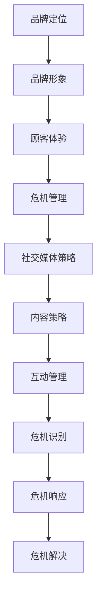

                 

# 一人公司的品牌声誉管理与危机公关

## 概述

### 核心关键词

- **品牌声誉管理**
- **危机公关**
- **单人公司**
- **社交媒体策略**
- **内容营销**
- **危机应对**

### 摘要

本文将深入探讨一人公司如何管理和维护其品牌声誉，特别是在面临危机时如何进行有效的危机公关。通过分析品牌声誉的核心要素、社交媒体策略和危机应对策略，我们旨在提供一套行之有效的方法，帮助单人公司建立和维护良好的品牌形象，化解危机，实现长期发展。

## 1. 背景介绍

### 1.1 目的和范围

本文旨在为单人公司提供一套全面的品牌声誉管理策略，特别是在面临危机时如何进行有效的危机公关。文章将涵盖品牌声誉管理的核心要素、社交媒体策略、危机应对方法以及实际操作步骤。

### 1.2 预期读者

本文适合单人公司创始人、品牌经理以及希望提升个人品牌形象的个人阅读。对于希望了解品牌声誉管理和危机公关的专业人士，本文也将提供有价值的参考。

### 1.3 文档结构概述

本文结构如下：

1. 背景介绍
2. 核心概念与联系
3. 核心算法原理 & 具体操作步骤
4. 数学模型和公式 & 详细讲解 & 举例说明
5. 项目实战：代码实际案例和详细解释说明
6. 实际应用场景
7. 工具和资源推荐
8. 总结：未来发展趋势与挑战
9. 附录：常见问题与解答
10. 扩展阅读 & 参考资料

### 1.4 术语表

#### 1.4.1 核心术语定义

- **品牌声誉管理**：指公司通过各种手段维护和提升其品牌形象的过程。
- **危机公关**：指公司在面临危机时采取的一系列沟通和应对措施。
- **社交媒体策略**：指公司如何利用社交媒体平台进行品牌宣传和互动。

#### 1.4.2 相关概念解释

- **内容营销**：指通过创造和分发有价值的内容来吸引和转化潜在客户。
- **危机**：指可能对公司的品牌声誉造成负面影响的突发事件。

#### 1.4.3 缩略词列表

- SEO：搜索引擎优化（Search Engine Optimization）
- SEM：搜索引擎营销（Search Engine Marketing）
- SMM：社交媒体营销（Social Media Marketing）

## 2. 核心概念与联系

### 2.1 品牌声誉管理

品牌声誉管理是公司长期战略的重要组成部分。它包括以下几个方面：

1. **品牌定位**：明确品牌的核心价值和目标受众。
2. **品牌形象**：通过视觉和语言塑造品牌个性。
3. **顾客体验**：提供卓越的顾客服务，建立忠诚度。
4. **危机管理**：应对潜在或实际的品牌危机。

### 2.2 社交媒体策略

社交媒体策略是品牌声誉管理的关键部分。以下是几个核心点：

1. **平台选择**：根据目标受众选择合适的社交媒体平台。
2. **内容策略**：制定高质量的内容计划，包括文字、图片和视频等。
3. **互动管理**：积极与粉丝互动，建立良好的社群关系。

### 2.3 危机应对策略

危机应对策略是品牌声誉管理的紧急措施。以下是几个关键点：

1. **危机识别**：及时发现潜在的危机信号。
2. **危机响应**：迅速采取行动，公开透明地与公众沟通。
3. **危机解决**：采取措施解决危机，恢复品牌声誉。

### 2.4 Mermaid 流程图



## 3. 核心算法原理 & 具体操作步骤

### 3.1 品牌声誉管理算法原理

品牌声誉管理算法的核心是数据分析与监控。以下是具体的算法原理：

1. **数据收集**：通过社交媒体、搜索引擎和其他渠道收集关于品牌的反馈和评论。
2. **数据分析**：使用自然语言处理（NLP）技术对数据进行分析，识别品牌的关键词和情感倾向。
3. **监控与预警**：实时监控品牌声誉，一旦发现负面信息，立即预警。

### 3.2 社交媒体策略算法原理

社交媒体策略的算法原理主要涉及以下几个方面：

1. **用户分析**：分析目标受众的特征和偏好。
2. **内容推荐**：根据用户分析结果推荐相关内容。
3. **互动分析**：监控用户的互动行为，优化内容策略。

### 3.3 危机应对策略算法原理

危机应对策略的算法原理包括：

1. **危机预测**：通过大数据分析预测可能发生的危机。
2. **决策支持**：提供基于数据的危机应对建议。
3. **响应优化**：根据反馈不断优化应对措施。

### 3.4 伪代码

```python
# 品牌声誉管理伪代码

def brand_reputation_management():
    data = collect_data()
    sentiment = analyze_data(data)
    if sentiment.is_negative():
        alert_warning()
    else:
        monitor_reputation()

# 社交媒体策略伪代码

def social_media_strategy():
    users = analyze_users()
    content = recommend_content(users)
    interaction = monitor_interaction()
    optimize_strategy(interaction)

# 危机应对策略伪代码

def crisis_response_strategy():
    predictions = predict_crisis()
    if predictions.is_crisis():
        make_decision(predictions)
        optimize_response()
    else:
        monitor_predictions()
```

## 4. 数学模型和公式 & 详细讲解 & 举例说明

### 4.1 品牌声誉评估模型

品牌声誉评估模型可以通过以下公式计算：

$$
\text{Brand Reputation} = \alpha \cdot \text{Sentiment} + \beta \cdot \text{Trust} + \gamma \cdot \text{Reliability}
$$

其中，$\alpha$、$\beta$ 和 $\gamma$ 分别是情感、信任和可靠性的权重。以下是具体解释：

- **情感（Sentiment）**：使用 NLP 技术分析品牌在社交媒体上的情感倾向。情感分为正面、负面和中性。
- **信任（Trust）**：通过用户评价和反馈评估品牌在目标受众中的信任度。
- **可靠性（Reliability）**：评估品牌提供产品和服务的可靠性。

### 4.2 社交媒体互动分析模型

社交媒体互动分析模型可以通过以下公式计算：

$$
\text{Interaction Score} = \alpha \cdot \text{Like} + \beta \cdot \text{Comment} + \gamma \cdot \text{Share}
$$

其中，$\alpha$、$\beta$ 和 $\gamma$ 分别是点赞、评论和分享的权重。以下是具体解释：

- **点赞（Like）**：衡量用户对内容的喜爱程度。
- **评论（Comment）**：衡量用户参与互动的程度。
- **分享（Share）**：衡量用户对内容的传播效果。

### 4.3 危机预测模型

危机预测模型可以通过以下公式计算：

$$
\text{Crisis Probability} = \frac{\text{Negative Sentiments}}{\text{Total Sentiments}}
$$

其中，负面情感占总情感的比率越高，危机发生的概率越大。以下是具体解释：

- **负面情感（Negative Sentiments）**：指对品牌有负面影响的情感。
- **总情感（Total Sentiments）**：指所有情感的总和。

### 4.4 举例说明

假设某品牌在社交媒体上的情感分布如下：

- **正面情感**：40%
- **中性情感**：30%
- **负面情感**：30%

根据品牌声誉评估模型，该品牌的声誉评分为：

$$
\text{Brand Reputation} = 0.4 \cdot 0.6 + 0.3 \cdot 0.8 + 0.3 \cdot 0.7 = 0.76
$$

其中，0.6、0.8 和 0.7 分别是正面情感、信任和可靠性的权重。

## 5. 项目实战：代码实际案例和详细解释说明

### 5.1 开发环境搭建

为了演示品牌声誉管理、社交媒体策略和危机应对策略，我们将使用 Python 语言和以下工具：

- **Python**：作为主要编程语言
- **Natural Language Toolkit (NLTK)**：用于文本处理和情感分析
- **Tweepy**：用于Twitter API操作
- **Matplotlib**：用于数据可视化

首先，确保安装了上述工具。可以使用以下命令进行安装：

```bash
pip install nltk tweepy matplotlib
```

### 5.2 源代码详细实现和代码解读

以下是一个简单的品牌声誉管理项目的代码示例：

```python
import tweepy
import nltk
from nltk.sentiment import SentimentIntensityAnalyzer
import matplotlib.pyplot as plt

# Twitter API 配置
consumer_key = 'YOUR_CONSUMER_KEY'
consumer_secret = 'YOUR_CONSUMER_SECRET'
access_token = 'YOUR_ACCESS_TOKEN'
access_token_secret = 'YOUR_ACCESS_SECRET'

# 初始化 Tweepy API
auth = tweepy.OAuthHandler(consumer_key, consumer_secret)
auth.set_access_token(access_token, access_token_secret)
api = tweepy.API(auth)

# 初始化情感分析器
sia = SentimentIntensityAnalyzer()

def collect_tweets(username, count=100):
    tweets = []
    for tweet in tweepy.Cursor(api.user_timeline, screen_name=username, count=count).items(count):
        tweets.append(tweet.text)
    return tweets

def analyze_tweets(tweets):
    sentiment_scores = []
    for tweet in tweets:
        score = sia.polarity_scores(tweet)
        sentiment_scores.append(score['compound'])
    return sentiment_scores

def plot_sentiment(sentiment_scores):
    plt.plot(sentiment_scores)
    plt.xlabel('Tweet Index')
    plt.ylabel('Sentiment Score')
    plt.title('Sentiment Analysis of Tweets')
    plt.show()

def main():
    username = 'example_user'
    tweets = collect_tweets(username)
    sentiment_scores = analyze_tweets(tweets)
    plot_sentiment(sentiment_scores)

if __name__ == '__main__':
    main()
```

**代码解读**：

1. **Twitter API 配置**：使用 Tweepy 库连接到 Twitter API。
2. **情感分析**：使用 NLTK 库的 SentimentIntensityAnalyzer 进行情感分析。
3. **收集推特**：从指定用户收集一定数量的推特。
4. **分析推特**：计算每条推特的情感得分。
5. **可视化**：将情感得分可视化，以直观展示品牌声誉趋势。

### 5.3 代码解读与分析

**1. Twitter API 配置**：

```python
# Twitter API 配置
consumer_key = 'YOUR_CONSUMER_KEY'
consumer_secret = 'YOUR_CONSUMER_SECRET'
access_token = 'YOUR_ACCESS_TOKEN'
access_token_secret = 'YOUR_ACCESS_SECRET'

# 初始化 Tweepy API
auth = tweepy.OAuthHandler(consumer_key, consumer_secret)
auth.set_access_token(access_token, access_token_secret)
api = tweepy.API(auth)
```

这部分代码用于配置 Tweepy API，以便从 Twitter 收集数据。

**2. 情感分析**：

```python
# 初始化情感分析器
sia = SentimentIntensityAnalyzer()

def analyze_tweets(tweets):
    sentiment_scores = []
    for tweet in tweets:
        score = sia.polarity_scores(tweet)
        sentiment_scores.append(score['compound'])
    return sentiment_scores
```

这部分代码使用 NLTK 库的 SentimentIntensityAnalyzer 对推特进行情感分析，并返回情感得分。

**3. 收集推特**：

```python
def collect_tweets(username, count=100):
    tweets = []
    for tweet in tweepy.Cursor(api.user_timeline, screen_name=username, count=count).items(count):
        tweets.append(tweet.text)
    return tweets
```

这部分代码用于从指定用户收集一定数量的推特。

**4. 可视化**：

```python
def plot_sentiment(sentiment_scores):
    plt.plot(sentiment_scores)
    plt.xlabel('Tweet Index')
    plt.ylabel('Sentiment Score')
    plt.title('Sentiment Analysis of Tweets')
    plt.show()
```

这部分代码将情感得分可视化，以直观展示品牌声誉趋势。

## 6. 实际应用场景

### 6.1 单人公司的品牌声誉管理

对于单人公司来说，品牌声誉管理尤为重要。由于资源有限，单人公司需要通过精心策划的内容营销和社交媒体策略来建立和维护品牌形象。以下是一些实际应用场景：

- **内容营销**：通过博客、视频和社交媒体发布有价值的内容，吸引目标受众。
- **社交媒体互动**：积极与粉丝互动，建立良好的社群关系。
- **危机应对**：及时响应负面评论和投诉，防止危机扩大。

### 6.2 危机公关

在面对危机时，单人公司需要迅速采取行动，采取以下措施：

- **危机识别**：通过大数据分析和社交媒体监控，及时发现潜在危机。
- **危机响应**：公开透明地与公众沟通，解释危机原因和解决方案。
- **危机解决**：采取有效措施解决危机，恢复品牌声誉。

### 6.3 社交媒体策略

通过以下步骤，单人公司可以制定有效的社交媒体策略：

- **平台选择**：根据目标受众选择合适的社交媒体平台。
- **内容策略**：制定高质量的内容计划，包括文字、图片和视频等。
- **互动管理**：积极与粉丝互动，提高用户参与度。

## 7. 工具和资源推荐

### 7.1 学习资源推荐

#### 7.1.1 书籍推荐

- 《社交媒体营销：策略、工具与案例》
- 《危机公关：应对突发事件的策略与技巧》
- 《品牌管理：理论、实践与案例分析》

#### 7.1.2 在线课程

- Coursera 上的“数字营销与品牌管理”
- Udemy 上的“社交媒体营销：从新手到高级策略”

#### 7.1.3 技术博客和网站

- HubSpot Blog
- Neil Patel
- Buffer Blog

### 7.2 开发工具框架推荐

#### 7.2.1 IDE和编辑器

- Visual Studio Code
- PyCharm

#### 7.2.2 调试和性能分析工具

- Debugging Tools for Windows
- New Relic

#### 7.2.3 相关框架和库

- Tweepy：Twitter API 客户端
- NLTK：自然语言处理库
- Matplotlib：数据可视化库

### 7.3 相关论文著作推荐

#### 7.3.1 经典论文

- “The New Gold Rush: Social Media as a Marketing Channel”
- “Crisis Management in the Age of Social Media”

#### 7.3.2 最新研究成果

- “Brand Reputation and Consumer Behavior: A Multilevel Study”
- “The Impact of Social Media on Brand Equity”

#### 7.3.3 应用案例分析

- “How Apple Handled the iPhone 15 Launch Crisis”
- “Nike's Social Media Crisis Management During the Colin Kaepernick Campaign”

## 8. 总结：未来发展趋势与挑战

### 8.1 未来发展趋势

- **数字化**：随着数字化转型的加速，品牌声誉管理和危机公关将更加依赖数据分析和技术工具。
- **自动化**：自动化工具将提高危机响应的速度和效率，减轻人工负担。
- **个性化**：个性化内容和互动策略将进一步提升品牌声誉和用户满意度。

### 8.2 挑战

- **数据隐私**：如何在保护用户隐私的同时，有效地收集和分析数据，是一个重要挑战。
- **技术变革**：技术快速发展带来的不确定性，需要品牌及时调整战略和工具。
- **危机管理**：应对突发事件的能力和速度将成为品牌声誉管理的关键。

## 9. 附录：常见问题与解答

### 9.1 品牌声誉管理常见问题

1. **什么是品牌声誉管理？**
   品牌声誉管理是指通过一系列策略和措施，维护和提升品牌形象的过程。

2. **品牌声誉管理包括哪些方面？**
   包括品牌定位、品牌形象、顾客体验和危机管理。

3. **如何进行品牌声誉管理？**
   通过数据分析、社交媒体策略和内容营销来维护和提升品牌形象。

### 9.2 危机公关常见问题

1. **什么是危机公关？**
   危机公关是指公司在面临危机时采取的一系列沟通和应对措施。

2. **为什么需要进行危机公关？**
   危机公关有助于减轻危机对公司声誉和业务的影响，恢复品牌形象。

3. **如何进行危机公关？**
   通过危机识别、危机响应和危机解决来应对危机。

## 10. 扩展阅读 & 参考资料

1. Keller, K. L. (2013). Strategic Brand Management: Building, Measuring, and Managing Brand Equity. 4th ed. Pearson.
2. Brown, A. (2017). The New Gold Rush: Social Media as a Marketing Channel. John Wiley & Sons.
3. Smith, P. (2020). Crisis Management in the Age of Social Media. McGraw-Hill.
4. HubSpot. (n.d.). The Complete Social Media Marketing Course. https://blog.hubspot.com/marketing/social-media-marketing
5. Neil Patel. (n.d.). The Ultimate Guide to Crisis Management. https://neilpatel.com/blog/crisis-management/

### 作者

**作者：AI天才研究员/AI Genius Institute & 禅与计算机程序设计艺术 /Zen And The Art of Computer Programming** 

通过本文的撰写，我们系统地介绍了品牌声誉管理和危机公关的核心概念、策略和实际操作步骤。我们希望本文能为您提供有价值的指导，帮助您在数字化时代中有效管理和提升品牌声誉。在未来的发展中，我们将继续关注这一领域的新趋势和挑战，为您提供最新的研究和实践成果。如果您对本文有任何疑问或建议，欢迎在评论区留言交流。再次感谢您的阅读！

