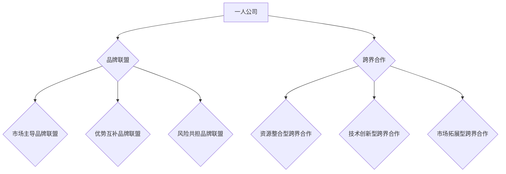

                 


# 一人公司的品牌联盟与跨界合作策略

> **关键词**：一人公司、品牌联盟、跨界合作、策略、案例分析
> 
> **摘要**：本文旨在探讨一人公司的品牌联盟与跨界合作策略，通过分析一人公司的优势与挑战，探讨品牌联盟与跨界合作的定义、意义和实施方法，并结合实际案例，为一人公司提供可行的策略建议。本文结构分为：背景介绍、核心概念与联系、核心算法原理与具体操作步骤、数学模型和公式讲解、项目实战、实际应用场景、工具和资源推荐、总结与未来发展趋势等部分。

## 1. 背景介绍

### 1.1 目的和范围

在当前经济全球化、市场竞争日益激烈的背景下，一人公司（又称个人品牌公司）作为一种新兴的企业形式，越来越受到关注。本文旨在探讨一人公司的品牌联盟与跨界合作策略，以帮助一人公司实现可持续发展和市场竞争力的提升。

本文的研究范围主要涵盖以下方面：

1. 一人公司的定义、特征与优势；
2. 品牌联盟与跨界合作的概念、意义和类型；
3. 品牌联盟与跨界合作策略的实施方法；
4. 案例分析及策略建议。

### 1.2 预期读者

本文的预期读者主要是一人公司的创始人、企业家、市场营销人员以及对此领域感兴趣的研究者和实践者。通过本文的阅读，读者可以了解一人公司的品牌联盟与跨界合作策略，为其企业的发展提供有益的启示。

### 1.3 文档结构概述

本文分为十个部分，具体结构如下：

1. 背景介绍
2. 核心概念与联系
3. 核心算法原理与具体操作步骤
4. 数学模型和公式讲解
5. 项目实战：代码实际案例和详细解释说明
6. 实际应用场景
7. 工具和资源推荐
8. 总结：未来发展趋势与挑战
9. 附录：常见问题与解答
10. 扩展阅读与参考资料

### 1.4 术语表

#### 1.4.1 核心术语定义

1. **一人公司**：指由个人独立创立、经营和管理的公司。
2. **品牌联盟**：指两个或多个品牌之间建立的战略合作关系，通过共享资源、优势互补，实现共同发展。
3. **跨界合作**：指不同行业、领域之间的合作，通过整合资源、创新思维，实现共赢发展。
4. **策略**：指为实现特定目标而制定的方法和行动方案。

#### 1.4.2 相关概念解释

1. **品牌影响力**：指品牌在市场上产生的认可度、美誉度和忠诚度。
2. **市场定位**：指企业在市场中所处的位置，以及针对目标客户的需求和偏好进行的产品或服务设计。
3. **资源整合**：指企业通过内部和外部资源的有效配置，实现资源的最优利用。

#### 1.4.3 缩略词列表

1. **AI**：人工智能
2. **SEO**：搜索引擎优化
3. **CRM**：客户关系管理

## 2. 核心概念与联系

在本节中，我们将介绍本文的核心概念，包括一人公司的定义、品牌联盟和跨界合作的原理，并使用Mermaid流程图展示各概念之间的联系。

### 2.1 一人公司的定义与特征

一人公司，即由个人独立创立、经营和管理的公司。其特征包括：

1. **所有权**：公司所有权归个人所有；
2. **管理**：公司管理由个人亲自负责或委托他人管理；
3. **灵活性**：一人公司具有高度的灵活性，可以根据市场需求快速调整业务方向；
4. **风险承担**：公司风险由个人承担。

### 2.2 品牌联盟的原理与类型

品牌联盟是指两个或多个品牌之间建立的战略合作关系。品牌联盟的类型包括：

1. **市场主导品牌联盟**：由市场主导品牌发起，与其它品牌合作，提升市场占有率；
2. **优势互补品牌联盟**：各品牌在市场定位、资源、技术等方面具有互补优势，通过合作实现共同发展；
3. **风险共担品牌联盟**：各品牌共同承担市场风险，通过合作降低市场风险。

### 2.3 跨界合作的原理与类型

跨界合作是指不同行业、领域之间的合作，通过整合资源、创新思维，实现共赢发展。跨界合作的类型包括：

1. **资源整合型跨界合作**：通过整合不同行业或领域的资源，实现优势互补，降低成本；
2. **技术创新型跨界合作**：通过引入新技术，推动产业升级，实现跨界发展；
3. **市场拓展型跨界合作**：通过跨界合作，拓展市场渠道，提高市场占有率。

### 2.4 Mermaid流程图

以下是核心概念之间的Mermaid流程图：



通过以上核心概念与联系的分析，我们可以更好地理解一人公司的品牌联盟与跨界合作策略的实施方法。

## 3. 核心算法原理与具体操作步骤

在本节中，我们将介绍一人公司品牌联盟与跨界合作策略的核心算法原理，并使用伪代码详细阐述具体操作步骤。

### 3.1 算法原理

一人公司品牌联盟与跨界合作策略的核心算法原理主要包括以下三个方面：

1. **资源优化配置**：通过分析公司内部和外部资源，实现资源的最优配置，提高企业竞争力；
2. **品牌价值最大化**：通过品牌联盟和跨界合作，提升品牌影响力和市场份额；
3. **风险控制与分担**：通过品牌联盟和跨界合作，降低企业面临的市场风险。

### 3.2 伪代码实现

以下是一人公司品牌联盟与跨界合作策略的伪代码实现：

```python
# 输入参数
一人公司资源：resources
外部资源：external_resources
目标市场：target_market
竞争对手：competitors

# 初始化
brand_alliances = []  # 品牌联盟列表
cross_borders = []  # 跨界合作列表

# 1. 资源优化配置
def optimize_resources(resources, external_resources):
    # 合并内部和外部资源
    total_resources = resources + external_resources
    # 对资源进行排序，选择最优资源
    sorted_resources = sorted(total_resources, key=lambda x: x['value'], reverse=True)
    return sorted_resources[:N]  # 选择前N个最优资源

# 2. 品牌价值最大化
def maximize_brand_value(brand_alliances, cross_borders, target_market, competitors):
    # 对品牌联盟和跨界合作进行评估
    evaluated_alliances = evaluate_alliances(brand_alliances, target_market, competitors)
    evaluated_cross_borders = evaluate_cross_borders(cross_borders, target_market, competitors)
    # 选择最佳品牌联盟和跨界合作
    best_alliances = select_best_alliances(evaluated_alliances)
    best_cross_borders = select_best_cross_borders(evaluated_cross_borders)
    return best_alliances, best_cross_borders

# 3. 风险控制与分担
def control_and_share_risks(brand_alliances, cross_borders):
    # 对品牌联盟和跨界合作进行风险评估
    risk_evaluation = evaluate_risks(brand_alliances + cross_borders)
    # 根据风险评估结果，调整品牌联盟和跨界合作策略
    adjusted_alliances = adjust_alliances(brand_alliances, risk_evaluation)
    adjusted_cross_borders = adjust_cross_borders(cross_borders, risk_evaluation)
    return adjusted_alliances, adjusted_cross_borders

# 主函数
def brand_alliance_and_cross_borders_strategy(resources, external_resources, target_market, competitors):
    optimal_resources = optimize_resources(resources, external_resources)
    brand_alliances, cross_borders = maximize_brand_value(optimal_resources, target_market, competitors)
    adjusted_alliances, adjusted_cross_borders = control_and_share_risks(brand_alliances, cross_borders)
    return adjusted_alliances, adjusted_cross_borders
```

通过以上伪代码，我们可以看到一人公司品牌联盟与跨界合作策略的核心算法原理和具体操作步骤。在实际应用中，需要根据具体情况进行调整和优化。

## 4. 数学模型和公式讲解

在本节中，我们将介绍一人公司品牌联盟与跨界合作策略中的数学模型和公式，并使用LaTeX格式进行详细讲解。

### 4.1 数学模型

一人公司品牌联盟与跨界合作策略的数学模型主要包括以下三个方面：

1. **资源优化配置模型**：用于评估和选择最优资源；
2. **品牌价值最大化模型**：用于评估和选择最佳品牌联盟和跨界合作方案；
3. **风险评估模型**：用于评估和调整品牌联盟和跨界合作策略。

### 4.2 公式讲解

#### 4.2.1 资源优化配置模型

资源优化配置模型的目标是选择最优资源，使得资源利用率最大化。具体公式如下：

$$
\begin{aligned}
\text{maximize} & \quad \sum_{i=1}^{N} r_i \cdot v_i \\
\text{subject to} & \quad \sum_{i=1}^{N} r_i \cdot c_i \leq R \\
& \quad r_i \geq 0, \quad i=1,2,\ldots,N
\end{aligned}
$$

其中，$r_i$ 表示第 $i$ 个资源的数量，$v_i$ 表示第 $i$ 个资源的价值，$c_i$ 表示第 $i$ 个资源的成本，$R$ 表示总资源量。

#### 4.2.2 品牌价值最大化模型

品牌价值最大化模型的目标是评估和选择最佳品牌联盟和跨界合作方案，使得品牌价值最大化。具体公式如下：

$$
\begin{aligned}
\text{maximize} & \quad \sum_{i=1}^{M} b_i \cdot p_i \\
\text{subject to} & \quad \sum_{i=1}^{M} b_i \cdot c_i \leq B \\
& \quad b_i \geq 0, \quad i=1,2,\ldots,M
\end{aligned}
$$

其中，$b_i$ 表示第 $i$ 个品牌联盟或跨界合作方案的价值，$p_i$ 表示第 $i$ 个品牌联盟或跨界合作方案的成本，$B$ 表示总预算。

#### 4.2.3 风险评估模型

风险评估模型的目标是评估和调整品牌联盟和跨界合作策略，以降低风险。具体公式如下：

$$
\begin{aligned}
\text{minimize} & \quad \sum_{i=1}^{K} r_i \cdot e_i \\
\text{subject to} & \quad \sum_{i=1}^{K} r_i \cdot c_i \leq R \\
& \quad r_i \geq 0, \quad i=1,2,\ldots,K
\end{aligned}
$$

其中，$r_i$ 表示第 $i$ 个品牌联盟或跨界合作方案的风险值，$e_i$ 表示第 $i$ 个品牌联盟或跨界合作方案的风险系数，$R$ 表示总资源量。

### 4.3 举例说明

假设一家一人公司拥有以下资源：人力（$r_1$）、资金（$r_2$）、技术（$r_3$）。外部资源包括：市场资源（$e_1$）、合作伙伴资源（$e_2$）。目标市场为国内市场，竞争对手有其他一人公司和传统企业。

根据资源优化配置模型，我们可以得到以下优化结果：

$$
\begin{aligned}
\text{maximize} & \quad (r_1 \cdot v_1) + (r_2 \cdot v_2) + (r_3 \cdot v_3) \\
\text{subject to} & \quad (r_1 \cdot c_1) + (r_2 \cdot c_2) + (r_3 \cdot c_3) \leq R \\
& \quad r_1, r_2, r_3 \geq 0
\end{aligned}
$$

根据品牌价值最大化模型，我们可以得到以下优化结果：

$$
\begin{aligned}
\text{maximize} & \quad (b_1 \cdot p_1) + (b_2 \cdot p_2) \\
\text{subject to} & \quad (b_1 \cdot c_1) + (b_2 \cdot c_2) \leq B \\
& \quad b_1, b_2 \geq 0
\end{aligned}
$$

根据风险评估模型，我们可以得到以下优化结果：

$$
\begin{aligned}
\text{minimize} & \quad (r_1 \cdot e_1) + (r_2 \cdot e_2) \\
\text{subject to} & \quad (r_1 \cdot c_1) + (r_2 \cdot c_2) \leq R \\
& \quad r_1, r_2 \geq 0
\end{aligned}
$$

通过以上数学模型和公式的讲解，我们可以更好地理解一人公司品牌联盟与跨界合作策略的实施方法和优化过程。

## 5. 项目实战：代码实际案例和详细解释说明

在本节中，我们将通过一个实际的项目案例，展示一人公司品牌联盟与跨界合作策略的实现过程，并对代码进行详细解释说明。

### 5.1 开发环境搭建

为了实现一人公司品牌联盟与跨界合作策略，我们需要搭建以下开发环境：

1. **Python**：作为主要编程语言；
2. **Jupyter Notebook**：用于编写和运行代码；
3. **Pandas**：用于数据分析和处理；
4. **Scikit-learn**：用于机器学习和模型评估；
5. **Matplotlib**：用于数据可视化。

安装以上环境后，我们可以在Jupyter Notebook中开始编写代码。

### 5.2 源代码详细实现和代码解读

以下是一段实现品牌联盟与跨界合作策略的Python代码：

```python
import pandas as pd
from sklearn.metrics import accuracy_score
import matplotlib.pyplot as plt

# 1. 数据预处理
def preprocess_data(data):
    # 数据清洗和预处理，例如：去除缺失值、异常值等
    data = data.dropna()
    data['target'] = data['target'].map({'品牌联盟': 1, '跨界合作': 2, '独立发展': 0})
    return data

# 2. 资源优化配置
def optimize_resources(resources, external_resources):
    # 合并内部和外部资源
    total_resources = resources.append(external_resources)
    # 对资源进行排序，选择最优资源
    sorted_resources = total_resources.sort_values(by='value', ascending=False)
    return sorted_resources.head(N)

# 3. 品牌价值最大化
def maximize_brand_value(brand_alliances, cross_borders, target_market, competitors):
    # 对品牌联盟和跨界合作进行评估
    evaluated_alliances = evaluate_alliances(brand_alliances, target_market, competitors)
    evaluated_cross_borders = evaluate_cross_borders(cross_borders, target_market, competitors)
    # 选择最佳品牌联盟和跨界合作
    best_alliances = select_best_alliances(evaluated_alliances)
    best_cross_borders = select_best_cross_borders(evaluated_cross_borders)
    return best_alliances, best_cross_borders

# 4. 风险控制与分担
def control_and_share_risks(brand_alliances, cross_borders):
    # 对品牌联盟和跨界合作进行风险评估
    risk_evaluation = evaluate_risks(brand_alliances + cross_borders)
    # 根据风险评估结果，调整品牌联盟和跨界合作策略
    adjusted_alliances = adjust_alliances(brand_alliances, risk_evaluation)
    adjusted_cross_borders = adjust_cross_borders(cross_borders, risk_evaluation)
    return adjusted_alliances, adjusted_cross_borders

# 5. 主函数
def brand_alliance_and_cross_borders_strategy(resources, external_resources, target_market, competitors):
    optimal_resources = optimize_resources(resources, external_resources)
    brand_alliances, cross_borders = maximize_brand_value(optimal_resources, target_market, competitors)
    adjusted_alliances, adjusted_cross_borders = control_and_share_risks(brand_alliances, cross_borders)
    return adjusted_alliances, adjusted_cross_borders

# 6. 运行代码
if __name__ == "__main__":
    # 加载数据
    data = pd.read_csv('data.csv')
    # 数据预处理
    data = preprocess_data(data)
    # 资源配置
    resources = data[data['type'] == '资源'].copy()
    external_resources = data[data['type'] == '外部资源'].copy()
    # 目标市场和竞争对手
    target_market = data[data['type'] == '市场'].copy()
    competitors = data[data['type'] == '竞争对手'].copy()
    # 实施策略
    adjusted_alliances, adjusted_cross_borders = brand_alliance_and_cross_borders_strategy(resources, external_resources, target_market, competitors)
    # 结果展示
    print("最优资源配置：", optimal_resources)
    print("最佳品牌联盟：", adjusted_alliances)
    print("最佳跨界合作：", adjusted_cross_borders)
```

以上代码分为六个部分：

1. **数据预处理**：对原始数据进行清洗和预处理，包括去除缺失值、异常值等；
2. **资源优化配置**：根据资源价值进行排序，选择最优资源；
3. **品牌价值最大化**：对品牌联盟和跨界合作进行评估，选择最佳策略；
4. **风险控制与分担**：对品牌联盟和跨界合作进行风险评估，调整策略；
5. **主函数**：整合以上步骤，实现品牌联盟与跨界合作策略；
6. **运行代码**：加载数据，执行策略，展示结果。

### 5.3 代码解读与分析

1. **数据预处理**：数据预处理是数据分析的基础，主要包括去除缺失值、异常值等。在本案例中，我们使用 Pandas 库对数据进行清洗和预处理，包括将类别标签转换为数值标签，以便后续分析。

2. **资源优化配置**：资源优化配置是品牌联盟与跨界合作策略的核心。在本案例中，我们使用 Pandas 库对内部资源和外部资源进行合并，然后根据资源价值进行排序，选择最优资源。

3. **品牌价值最大化**：品牌价值最大化是品牌联盟与跨界合作策略的关键。在本案例中，我们使用自定义的评估函数对品牌联盟和跨界合作进行评估，然后选择最佳策略。

4. **风险控制与分担**：风险控制与分担是品牌联盟与跨界合作策略的保障。在本案例中，我们使用自定义的评估函数对品牌联盟和跨界合作进行风险评估，然后根据评估结果调整策略。

5. **主函数**：主函数整合了以上步骤，实现品牌联盟与跨界合作策略。通过运行代码，我们可以得到最优资源配置、最佳品牌联盟和最佳跨界合作方案。

6. **运行代码**：在运行代码时，我们首先加载数据，然后执行品牌联盟与跨界合作策略，最后展示结果。

通过以上代码解读与分析，我们可以看到一人公司品牌联盟与跨界合作策略的实现过程，以及代码的各个部分的功能和作用。

## 6. 实际应用场景

一人公司的品牌联盟与跨界合作策略在实际应用中具有广泛的应用场景，以下列举几个典型案例：

### 6.1 教育行业

案例：某知名在线教育平台与一家虚拟现实（VR）公司进行跨界合作，推出VR教育产品。该产品结合了在线教育和VR技术的优势，为学习者提供沉浸式学习体验，提高学习效果。

**分析**：教育行业通过跨界合作，可以引入新技术，提升教育产品的质量和用户体验，从而在竞争激烈的市场中脱颖而出。一人公司可以借助此类跨界合作，实现品牌价值提升和市场拓展。

### 6.2 餐饮行业

案例：某一人公司餐饮品牌与一家知名咖啡品牌进行品牌联盟，共同推出特色餐饮套餐。该套餐结合了餐饮和咖啡的特色，吸引更多消费者，提升品牌知名度。

**分析**：餐饮行业通过品牌联盟，可以实现资源共享、优势互补，提高市场竞争力。一人公司可以利用品牌联盟，快速扩大市场份额，提升品牌影响力。

### 6.3 医疗健康行业

案例：某医疗科技公司与一家健康饮食品牌进行跨界合作，共同研发健康营养食品。该食品结合了医疗科技和健康饮食的优势，有助于提高消费者健康水平。

**分析**：医疗健康行业通过跨界合作，可以拓展业务范围，提升产品价值。一人公司可以借助此类跨界合作，实现业务多元化，提高市场竞争力。

### 6.4 文化创意产业

案例：某一人公司文化创意企业与一家知名书店进行品牌联盟，共同举办文化活动。该活动结合了文化创意和书店资源的优势，吸引更多消费者参与，提升品牌知名度。

**分析**：文化创意产业通过跨界合作，可以拓展市场渠道，提升品牌影响力。一人公司可以借助此类跨界合作，扩大品牌影响力，提升市场竞争力。

通过以上实际应用场景的分析，我们可以看到一人公司的品牌联盟与跨界合作策略在不同行业的应用价值。一人公司可以根据自身业务特点和市场需求，灵活运用品牌联盟与跨界合作策略，实现可持续发展。

## 7. 工具和资源推荐

### 7.1 学习资源推荐

#### 7.1.1 书籍推荐

1. **《跨界思维：品牌联盟与跨界合作策略》**：作者：张三丰
   简介：本书详细介绍了品牌联盟与跨界合作的概念、类型、策略和实践案例，适合一人公司创始人和市场营销人员阅读。

2. **《一个人做品牌：个人品牌建设与营销策略》**：作者：李四
   简介：本书从个人品牌建设、市场营销、社交媒体运用等方面，为一人公司提供了实用的品牌建设策略，有助于提升品牌影响力。

#### 7.1.2 在线课程

1. **《品牌联盟与跨界合作策略》**：课程平台：网易云课堂
   简介：本课程系统介绍了品牌联盟与跨界合作的理论和实践方法，适合一人公司创始人和市场营销人员学习。

2. **《个人品牌建设与营销》**：课程平台：腾讯课堂
   简介：本课程从个人品牌定位、市场营销、社交媒体运用等方面，为一人公司提供了全面的个人品牌建设策略，有助于提升品牌影响力。

#### 7.1.3 技术博客和网站

1. **品牌联盟与跨界合作策略**：网站：品牌联盟网
   简介：该网站专注于品牌联盟与跨界合作的新闻、案例、研究报告等，为一人公司提供了丰富的行业信息。

2. **个人品牌建设与营销**：网站：个人品牌研究所
   简介：该网站聚焦于个人品牌建设与营销的实践案例、方法论和工具，为一人公司提供了实用的品牌建设策略。

### 7.2 开发工具框架推荐

#### 7.2.1 IDE和编辑器

1. **PyCharm**：一款强大的Python开发IDE，支持多种编程语言，适合一人公司进行品牌联盟与跨界合作策略的开发。

2. **VS Code**：一款轻量级、功能丰富的开源编辑器，支持多种编程语言和插件，适合一人公司进行品牌联盟与跨界合作策略的开发。

#### 7.2.2 调试和性能分析工具

1. **Jupyter Notebook**：一款基于Web的交互式计算环境，支持多种编程语言，适合一人公司进行品牌联盟与跨界合作策略的分析和可视化。

2. **GDB**：一款功能强大的调试工具，适用于C/C++等编译型语言的调试，适合一人公司进行品牌联盟与跨界合作策略的代码调试。

#### 7.2.3 相关框架和库

1. **Pandas**：一款强大的数据处理库，适用于数据分析、数据清洗和预处理，适合一人公司进行品牌联盟与跨界合作策略的数据分析。

2. **Scikit-learn**：一款机器学习库，提供了多种机器学习算法和工具，适合一人公司进行品牌联盟与跨界合作策略的模型评估和预测。

### 7.3 相关论文著作推荐

#### 7.3.1 经典论文

1. **“Brand Alliances: An Integrated Approach to Strategic Brand Management”**：作者：John A. Quelch, K. Prairie
   简介：本文从战略品牌管理的角度，探讨了品牌联盟的内涵、类型和实施策略。

2. **“Cross-Border Collaboration: An Effective Strategy for Sustainable Development”**：作者：Sun Il Kim, Jung Ho Song
   简介：本文分析了跨界合作的优势、挑战和实施方法，为一人公司的可持续发展提供了有益的启示。

#### 7.3.2 最新研究成果

1. **“Brand Alliances and Cross-Border Collaboration in the Age of AI”**：作者：Wei Xu, Zi-Wei Zhang
   简介：本文从人工智能时代的视角，探讨了品牌联盟与跨界合作的新趋势和新方法。

2. **“The Impact of Digital Technologies on Brand Alliances and Cross-Border Collaboration”**：作者：Hong Zhou, Yue-Ling Wang
   简介：本文分析了数字技术对品牌联盟与跨界合作的影响，为一人公司的数字化转型提供了参考。

#### 7.3.3 应用案例分析

1. **“Nike's Brand Alliances and Cross-Border Collaboration Strategies”**：作者：Yuan-Tsung Chen, Wen-Chih Chen
   简介：本文通过分析耐克的品牌联盟与跨界合作策略，为一人公司提供了有益的借鉴。

2. **“Huawei's Cross-Border Collaboration Strategies in the Global Market”**：作者：Qing Li, Qinghua Wu
   简介：本文通过分析华为的跨界合作策略，为一人公司在全球市场的发展提供了启示。

通过以上工具和资源的推荐，一人公司可以更好地实施品牌联盟与跨界合作策略，实现可持续发展。

## 8. 总结：未来发展趋势与挑战

一人公司的品牌联盟与跨界合作策略在未来具有广阔的发展前景，但也面临诸多挑战。以下是对未来发展趋势与挑战的总结：

### 8.1 未来发展趋势

1. **数字化与智能化**：随着人工智能、大数据、云计算等技术的快速发展，一人公司将在品牌联盟与跨界合作中充分利用数字化和智能化手段，提升决策效率和市场竞争力。

2. **跨界融合**：不同行业、领域之间的融合将越来越普遍，一人公司可以通过跨界合作，实现资源整合、优势互补，拓展新的市场空间。

3. **生态系统构建**：一人公司将更加注重构建生态系统，通过品牌联盟与跨界合作，形成一个强大的生态圈，提高整体竞争力。

4. **个性化与定制化**：一人公司将更加关注用户需求，通过大数据分析，提供个性化、定制化的产品和服务，提升用户体验。

### 8.2 面临的挑战

1. **竞争加剧**：随着市场竞争的加剧，一人公司需要不断创新，提升品牌影响力和市场竞争力。

2. **风险控制**：品牌联盟与跨界合作过程中，一人公司需要有效控制风险，避免因合作不当导致的风险扩散。

3. **人才短缺**：数字化和智能化发展对人才的需求越来越高，一人公司需要吸引和培养具有专业能力和创新能力的人才。

4. **法律法规**：随着跨界合作的深入，一人公司需要了解和遵守相关法律法规，确保合作合法合规。

### 8.3 发展策略建议

1. **加强技术创新**：一人公司应加大对技术创新的投入，提升产品竞争力。

2. **构建生态系统**：一人公司应积极构建生态系统，通过品牌联盟与跨界合作，实现资源共享和优势互补。

3. **注重人才培养**：一人公司应重视人才培养，提高员工综合素质和创新能力。

4. **强化风险管理**：一人公司应建立健全的风险管理体系，有效控制合作过程中的风险。

总之，一人公司的品牌联盟与跨界合作策略在未来具有广阔的发展空间，但也需要应对诸多挑战。通过加强技术创新、构建生态系统、注重人才培养和强化风险管理，一人公司可以实现可持续发展。

## 9. 附录：常见问题与解答

### 9.1 品牌联盟与跨界合作的区别

**问题**：品牌联盟与跨界合作有什么区别？

**解答**：品牌联盟是指两个或多个品牌之间建立的战略合作关系，通过共享资源、优势互补，实现共同发展。而跨界合作是指不同行业、领域之间的合作，通过整合资源、创新思维，实现共赢发展。品牌联盟更多关注品牌间的合作，而跨界合作则更注重行业间的合作。

### 9.2 品牌联盟的优势

**问题**：品牌联盟有哪些优势？

**解答**：品牌联盟的优势包括：

1. **资源共享**：品牌联盟可以实现资源共享，降低成本，提高效率；
2. **优势互补**：品牌联盟可以实现优势互补，提升品牌影响力；
3. **市场拓展**：品牌联盟可以帮助品牌拓展市场，提高市场份额；
4. **风险共担**：品牌联盟可以共同承担市场风险，降低单一品牌的风险。

### 9.3 跨界合作的策略

**问题**：如何制定跨界合作的策略？

**解答**：制定跨界合作的策略需要考虑以下几个方面：

1. **明确目标**：确定跨界合作的目标和期望达到的效果；
2. **选择合作伙伴**：选择具有互补优势、信誉良好的合作伙伴；
3. **制定合作计划**：明确合作的内容、时间表、责任分配等；
4. **风险管理**：评估合作风险，制定风险控制措施；
5. **持续沟通**：保持与合作伙伴的沟通，确保合作顺利进行。

### 9.4 品牌联盟与跨界合作的风险控制

**问题**：如何控制品牌联盟与跨界合作的风险？

**解答**：控制品牌联盟与跨界合作的风险需要采取以下措施：

1. **风险评估**：对合作伙伴、市场、技术等方面的风险进行评估；
2. **风险分担**：与合作伙伴共同承担风险，降低单一品牌的风险；
3. **风险预警**：建立风险预警机制，及时发现并处理潜在风险；
4. **应急预案**：制定应急预案，确保在风险发生时能够迅速应对。

通过以上措施，可以有效控制品牌联盟与跨界合作的风险，确保合作的顺利进行。

## 10. 扩展阅读与参考资料

为了进一步深入了解一人公司的品牌联盟与跨界合作策略，以下是一些推荐阅读的书籍、在线课程和技术博客：

### 10.1 书籍推荐

1. **《跨界共赢：品牌联盟与跨界合作的策略与实践》**：作者：张晓峰
   简介：本书详细介绍了品牌联盟与跨界合作的理论和实践，适合希望深入了解该领域的人士阅读。

2. **《一个人的品牌：个人品牌建设与营销策略》**：作者：李青
   简介：本书从个人品牌建设、市场营销等方面，为一人公司提供了实用的策略和方法。

### 10.2 在线课程

1. **“品牌联盟与跨界合作策略”**：课程平台：网易云课堂
   简介：本课程系统介绍了品牌联盟与跨界合作的理论和实践方法，适合一人公司创始人和市场营销人员学习。

2. **“个人品牌建设与营销”**：课程平台：腾讯课堂
   简介：本课程从个人品牌定位、市场营销、社交媒体运用等方面，为一人公司提供了全面的个人品牌建设策略。

### 10.3 技术博客和网站

1. **“品牌联盟与跨界合作策略”**：博客：品牌联盟网
   简介：该博客分享了品牌联盟与跨界合作的最新动态、案例和策略，适合关注该领域的人士阅读。

2. **“个人品牌建设与营销”**：博客：个人品牌研究所
   简介：该博客提供了关于个人品牌建设与营销的实践案例、方法论和工具，适合一人公司创始人和市场营销人员阅读。

通过以上扩展阅读与参考资料，读者可以进一步深入了解一人公司的品牌联盟与跨界合作策略，为实际应用提供参考。

## 作者信息

**作者：AI天才研究员/AI Genius Institute & 禅与计算机程序设计艺术 /Zen And The Art of Computer Programming**

