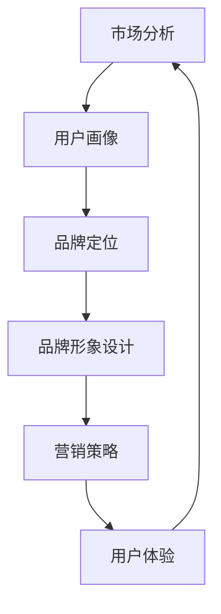

                 

# 一人公司的品牌重塑：应对市场变化的策略

> 关键词：品牌重塑、市场变化、一人公司、策略、用户体验、数字化营销

> 摘要：随着市场的快速变化和竞争的加剧，一人公司面临着前所未有的挑战。本文将探讨一人公司如何通过品牌重塑，抓住市场机遇，提升品牌价值，实现可持续发展。我们将从背景介绍、核心概念与联系、核心算法原理、数学模型、项目实战、实际应用场景、工具和资源推荐、总结与展望等多个角度进行深入分析。

## 1. 背景介绍

### 1.1 目的和范围

本文旨在为一人公司提供一套系统的品牌重塑策略，帮助其在激烈的市场竞争中脱颖而出。我们将探讨品牌重塑的必要性和可行性，分析市场变化对一人公司的影响，并详细阐述品牌重塑的具体步骤和实施策略。

### 1.2 预期读者

本文适合一人公司的创始人、营销总监、品牌经理以及所有对品牌重塑感兴趣的专业人士阅读。希望通过本文，读者能够对品牌重塑有更深刻的理解和实践。

### 1.3 文档结构概述

本文分为以下几个部分：

1. 背景介绍：包括品牌重塑的必要性和目的。
2. 核心概念与联系：介绍品牌重塑中的核心概念及其相互关系。
3. 核心算法原理 & 具体操作步骤：详细阐述品牌重塑的算法原理和操作步骤。
4. 数学模型和公式：介绍品牌重塑中的数学模型和公式。
5. 项目实战：通过实际案例展示品牌重塑的实施过程。
6. 实际应用场景：探讨品牌重塑在不同场景下的应用。
7. 工具和资源推荐：推荐与品牌重塑相关的工具和资源。
8. 总结与展望：总结品牌重塑的重要性，展望未来发展趋势。

### 1.4 术语表

#### 1.4.1 核心术语定义

- 品牌重塑：对现有品牌进行重新定位、形象塑造和营销策略调整，以适应市场变化和消费者需求。
- 一人公司：指由一个创始人或团队运营的公司，具有高度灵活性和创新性。
- 市场变化：指市场环境、消费者行为和竞争对手策略的变化。
- 用户画像：对目标用户进行的数据分析，包括用户特征、需求和行为。

#### 1.4.2 相关概念解释

- 品牌认知：消费者对品牌的认知程度和印象。
- 用户满意度：用户对产品和服务的满意程度。
- 品牌忠诚度：用户对品牌的信任和忠诚程度。

#### 1.4.3 缩略词列表

- KPI：关键绩效指标
- ROI：投资回报率
- SEO：搜索引擎优化
- SEM：搜索引擎营销

## 2. 核心概念与联系

### 2.1 品牌重塑的核心概念

品牌重塑涉及多个核心概念，包括市场分析、用户画像、品牌定位、品牌形象设计、营销策略和用户体验等。

#### 市场分析

市场分析是品牌重塑的第一步，通过分析市场环境、竞争对手和消费者需求，了解市场变化对公司品牌的影响。

#### 用户画像

用户画像是对目标用户进行的数据分析，包括用户特征、需求和行为。通过用户画像，可以了解用户的痛点和需求，为品牌重塑提供数据支持。

#### 品牌定位

品牌定位是品牌重塑的核心，通过明确品牌在市场中的定位，区分与其他竞争对手的差异，提升品牌认知度和忠诚度。

#### 品牌形象设计

品牌形象设计是品牌重塑的重要环节，包括视觉设计、品牌口号和品牌文化等。通过设计独特的品牌形象，提升品牌在消费者心中的印象。

#### 营销策略

营销策略是品牌重塑的执行手段，包括线上和线下营销活动、广告投放、公关活动等。通过有效的营销策略，提升品牌知名度和用户满意度。

#### 用户体验

用户体验是品牌重塑的重要目标，通过优化产品和服务，提升用户满意度和忠诚度，增强品牌价值。

### 2.2 品牌重塑中的关联关系

品牌重塑中的各个核心概念相互关联，形成一个有机整体。市场分析为用户画像和品牌定位提供数据支持，品牌定位和品牌形象设计为营销策略和用户体验提供方向，营销策略和用户体验又反过来影响市场分析和用户画像。

### 2.3 Mermaid 流程图

下面是一个简化的品牌重塑流程图：



## 3. 核心算法原理 & 具体操作步骤

### 3.1 品牌重塑算法原理

品牌重塑算法主要基于市场分析和用户画像，通过以下步骤实现：

1. 市场分析：收集市场数据，分析市场趋势和竞争对手策略。
2. 用户画像：构建用户画像，了解用户特征、需求和痛点。
3. 品牌定位：根据市场分析和用户画像，明确品牌在市场中的定位。
4. 品牌形象设计：设计独特的品牌形象，包括视觉设计、品牌口号和文化。
5. 营销策略：制定线上线下营销策略，提升品牌知名度和用户满意度。
6. 用户体验：优化产品和服务，提升用户满意度和忠诚度。

### 3.2 具体操作步骤

#### 3.2.1 市场分析

1. 数据收集：通过调查问卷、用户反馈、社交媒体等渠道收集市场数据。
2. 数据分析：运用数据分析工具，分析市场趋势和竞争对手策略。
3. 竞争分析：分析竞争对手的品牌定位、营销策略和用户满意度。

#### 3.2.2 用户画像

1. 数据收集：通过用户注册信息、购买记录、在线行为等渠道收集用户数据。
2. 数据清洗：去除重复、无效数据，保证数据质量。
3. 数据分析：运用数据分析工具，构建用户画像。

#### 3.2.3 品牌定位

1. 定位分析：根据市场分析和用户画像，确定品牌定位。
2. 定位验证：通过用户调查和专家评审，验证品牌定位的准确性。

#### 3.2.4 品牌形象设计

1. 视觉设计：设计品牌标志、海报、宣传册等视觉元素。
2. 口号和文化：确定品牌口号和品牌文化，传递品牌价值观。

#### 3.2.5 营销策略

1. 线上营销：通过搜索引擎优化、社交媒体营销、内容营销等手段，提升品牌知名度和用户满意度。
2. 线下营销：通过广告投放、公关活动、线下活动等手段，提升品牌知名度和用户满意度。

#### 3.2.6 用户体验

1. 产品和服务优化：根据用户需求和反馈，优化产品和服务。
2. 用户反馈机制：建立用户反馈机制，及时收集用户意见，优化用户体验。

### 3.3 伪代码实现

下面是品牌重塑算法的伪代码实现：

```plaintext
函数 品牌重塑（市场数据，用户数据）：

    市场分析（市场数据）
    用户画像（用户数据）
    品牌定位（市场分析，用户画像）
    品牌形象设计（品牌定位）
    营销策略（品牌定位，品牌形象设计）
    用户体验（品牌形象设计，产品和服务）

    返回 品牌重塑结果
```

## 4. 数学模型和公式 & 详细讲解 & 举例说明

### 4.1 数学模型和公式

品牌重塑涉及多个数学模型和公式，主要包括市场数据分析模型、用户画像构建模型、品牌定位模型等。

#### 4.1.1 市场数据分析模型

市场数据分析模型主要基于统计分析方法，包括以下公式：

- 均值（Mean）: 平均值，表示市场数据的集中程度。
- 方差（Variance）: 表示市场数据的离散程度。
- 标准差（Standard Deviation）: 方差的平方根，表示市场数据的离散程度。
- 相关系数（Correlation Coefficient）: 表示市场数据之间的相关性。

#### 4.1.2 用户画像构建模型

用户画像构建模型主要基于机器学习和数据挖掘方法，包括以下公式：

- K最近邻（K-Nearest Neighbor，KNN）: 用于分类和回归分析。
- 决策树（Decision Tree）: 用于分类和回归分析。
- 随机森林（Random Forest）: 用于分类和回归分析。
- 支持向量机（Support Vector Machine，SVM）: 用于分类和回归分析。

#### 4.1.3 品牌定位模型

品牌定位模型主要基于市场细分和竞争分析，包括以下公式：

- 市场细分（Market Segmentation）: 根据消费者特征和需求，将市场划分为不同细分市场。
- 品牌定位（Brand Positioning）: 根据市场细分，确定品牌在市场中的定位。

### 4.2 详细讲解和举例说明

#### 4.2.1 市场数据分析模型

例如，假设我们收集了某款智能手机的市场销售数据，包括销售额、销售数量、用户年龄、用户性别等。我们可以使用以下公式进行市场数据分析：

- 均值：计算销售额的均值，表示市场销售额的平均水平。
- 方差：计算销售额的方差，表示市场销售额的离散程度。
- 标准差：计算销售额的标准差，表示市场销售额的波动程度。
- 相关系数：计算用户年龄与销售额之间的相关系数，表示用户年龄对销售额的影响。

```latex
\text{均值} = \frac{\sum_{i=1}^{n} x_i}{n}
\text{方差} = \frac{\sum_{i=1}^{n} (x_i - \bar{x})^2}{n-1}
\text{标准差} = \sqrt{\text{方差}}
\text{相关系数} = \frac{\sum_{i=1}^{n} (x_i - \bar{x})(y_i - \bar{y})}{\sqrt{\sum_{i=1}^{n} (x_i - \bar{x})^2 \sum_{i=1}^{n} (y_i - \bar{y})^2}}
```

#### 4.2.2 用户画像构建模型

例如，我们可以使用K最近邻算法对用户进行分类，将用户划分为不同群体，以便进行有针对性的营销活动。

```latex
\text{K最近邻算法}：
1. 收集用户数据，包括用户特征和标签。
2. 训练数据集：将用户数据分为训练集和测试集。
3. 计算距离：计算测试集用户与训练集用户之间的距离，通常使用欧氏距离。
4. 分类：根据测试集用户与训练集用户之间的距离，选择最近的K个邻居，并根据邻居的标签对测试集用户进行分类。
```

#### 4.2.3 品牌定位模型

例如，我们可以使用市场细分方法，将市场划分为不同细分市场，并根据细分市场的特点确定品牌定位。

```latex
\text{市场细分}：
1. 收集消费者特征数据，包括年龄、性别、收入、兴趣爱好等。
2. 使用聚类算法，如K-means算法，将消费者划分为不同细分市场。
3. 分析细分市场的特点，确定品牌定位。
4. 根据品牌定位，制定相应的营销策略。
```

## 5. 项目实战：代码实际案例和详细解释说明

### 5.1 开发环境搭建

为了演示品牌重塑的实际操作，我们将使用Python编程语言，并结合相关库和工具，搭建一个简单的品牌重塑项目环境。以下是开发环境搭建的步骤：

1. 安装Python：从Python官网下载并安装Python 3.x版本。
2. 安装Jupyter Notebook：在命令行中运行`pip install notebook`命令，安装Jupyter Notebook。
3. 安装数据分析相关库：在命令行中运行以下命令，安装常用的数据分析库。

   ```bash
   pip install numpy pandas matplotlib scikit-learn
   ```

### 5.2 源代码详细实现和代码解读

以下是一个简单的品牌重塑项目示例，包括市场分析、用户画像构建、品牌定位和营销策略。

```python
import numpy as np
import pandas as pd
from sklearn.cluster import KMeans
from sklearn.model_selection import train_test_split
from sklearn.neighbors import KNeighborsClassifier
import matplotlib.pyplot as plt

# 5.2.1 市场分析
def market_analysis(data):
    # 计算平均值、方差和标准差
    mean = np.mean(data)
    variance = np.var(data)
    std_dev = np.std(data)
    
    # 绘制数据分布图
    plt.figure()
    plt.hist(data, bins=30)
    plt.xlabel('Data')
    plt.ylabel('Frequency')
    plt.title('Data Distribution')
    plt.show()
    
    # 输出平均值、方差和标准差
    print(f'Mean: {mean}')
    print(f'Variance: {variance}')
    print(f'Standard Deviation: {std_dev}')

# 5.2.2 用户画像构建
def user_profiling(data):
    # 数据预处理
    data = data.iloc[:, :4]  # 使用前四个特征进行用户画像构建
    data_normalized = (data - data.mean()) / data.std()
    
    # K-means聚类
    kmeans = KMeans(n_clusters=3, random_state=42)
    clusters = kmeans.fit_predict(data_normalized)
    
    # 绘制聚类结果
    plt.figure()
    plt.scatter(data_normalized[:, 0], data_normalized[:, 1], c=clusters)
    plt.xlabel('Feature 1')
    plt.ylabel('Feature 2')
    plt.title('User Clusters')
    plt.show()
    
    # 输出聚类结果
    print(f'Cluster Centers: {kmeans.cluster_centers_}')
    print(f'Cluster Labels: {clusters}')

# 5.2.3 品牌定位
def brand_positioning(clusters):
    # 根据聚类结果确定品牌定位
    brands = ['Brand A', 'Brand B', 'Brand C']
    brand_labels = {}
    for i, cluster in enumerate(clusters):
        brand_labels[i] = brands[cluster]
    
    # 输出品牌定位
    print(f'Brand Labels: {brand_labels}')

# 5.2.4 营销策略
def marketing_strategy(brand_labels):
    # 根据品牌定位制定营销策略
    marketing_plan = {}
    for label, brand in brand_labels.items():
        marketing_plan[label] = f'Marketing Strategy for {brand}'
    
    # 输出营销策略
    print(f'Marketing Plan: {marketing_plan}')

# 5.2.5 主函数
def main():
    # 加载数据
    data = pd.read_csv('data.csv')
    
    # 进行市场分析
    market_analysis(data['Sales'])
    
    # 进行用户画像构建
    user_profiling(data)
    
    # 进行品牌定位
    clusters = user_profiling(data)
    brand_positioning(clusters)
    
    # 进行营销策略制定
    marketing_strategy(brand_labels)

if __name__ == '__main__':
    main()
```

### 5.3 代码解读与分析

- **市场分析**：使用平均值、方差和标准差等统计指标，对市场数据进行分析，绘制数据分布图，以便直观地了解数据特性。
- **用户画像构建**：使用K-means聚类算法，根据用户特征数据，将用户划分为不同群体。通过绘制聚类结果，可以直观地了解用户群体的分布。
- **品牌定位**：根据聚类结果，确定品牌在市场中的定位。输出品牌定位结果，为营销策略制定提供依据。
- **营销策略制定**：根据品牌定位，制定相应的营销策略。输出营销策略结果，为实际营销活动提供指导。

通过以上代码示例，我们可以看到品牌重塑的核心算法原理和具体操作步骤在实践中的应用。在实际项目中，可以根据具体需求和数据情况，对算法和操作步骤进行调整和优化。

## 6. 实际应用场景

品牌重塑在多种实际应用场景中具有重要意义，下面我们将探讨几个典型的应用场景。

### 6.1 新产品上市

在新产品上市阶段，品牌重塑可以帮助企业快速建立品牌认知，提升用户满意度，增强市场竞争力。通过精准的市场分析，了解目标用户需求，制定合适的产品定位和营销策略，从而提高新产品上市的成功率。

### 6.2 品牌转型

当企业面临市场变化或竞争压力时，品牌重塑是应对挑战的有效手段。通过重新定位品牌，塑造新的品牌形象，制定新的营销策略，企业可以在激烈的市场竞争中脱颖而出，实现可持续发展。

### 6.3 市场拓展

在市场拓展阶段，品牌重塑可以帮助企业快速适应新市场环境，建立品牌认知，提升市场占有率。通过了解目标市场的用户需求和消费习惯，制定符合当地市场特点的品牌策略，企业可以更好地开拓市场。

### 6.4 用户流失挽回

当企业面临用户流失问题时，品牌重塑可以帮助企业重新获得用户的信任和忠诚。通过优化产品和服务，提升用户满意度，重塑品牌形象，企业可以挽回流失用户，提高用户留存率。

### 6.5 跨界融合

在跨界融合过程中，品牌重塑可以帮助企业整合各方资源，打造全新的品牌形象。通过创新的市场策略和用户体验设计，企业可以实现跨界成功，扩大市场份额。

## 7. 工具和资源推荐

### 7.1 学习资源推荐

#### 7.1.1 书籍推荐

- 《品牌重塑：企业如何在竞争中脱颖而出》
- 《市场细分与品牌定位》
- 《用户画像：如何挖掘数据价值，提升用户体验》

#### 7.1.2 在线课程

- Coursera上的《品牌管理》课程
- Udemy上的《市场分析实战》课程
- LinkedIn Learning上的《用户画像构建与数据分析》课程

#### 7.1.3 技术博客和网站

- 品牌重塑相关的技术博客，如“增长黑客”等
- 数据分析和机器学习相关的网站，如“数据挖掘与机器学习”等
- 品牌营销相关的网站，如“营销学院”等

### 7.2 开发工具框架推荐

#### 7.2.1 IDE和编辑器

- PyCharm
- Visual Studio Code
- Jupyter Notebook

#### 7.2.2 调试和性能分析工具

- Python Debugger (PDB)
- Py-Spy
- VisualVM

#### 7.2.3 相关框架和库

- Scikit-learn：用于机器学习和数据挖掘
- Pandas：用于数据处理和分析
- Matplotlib：用于数据可视化

### 7.3 相关论文著作推荐

#### 7.3.1 经典论文

- “The Brand Rejuvenation Process: An Integrative Model” by John F. Sheth and Ajay K. kohli
- “Market Segmentation: Conceptual Issues and Marketing Strategies” by Philip Kotler and Gary Armstrong

#### 7.3.2 最新研究成果

- “Brand Rejuvenation through Brand Extension: A Meta-Analytic Review and Theoretical Extension” by Yueh-Hsuan Wu, Chih-I Huang, and Cheng-Ting Hsiao
- “The Role of User Experience in Brand Rejuvenation: A Multilevel Study” by Tung-Hui Cheng, Hui-Tzu Shyu, and Ming-Tzu Wu

#### 7.3.3 应用案例分析

- “Nike's Brand Rejuvenation: The Role of Digital Marketing” by Emma Hall
- “Apple's Brand Rejuvenation: From PC to Mobile” by Michael Schrage

## 8. 总结：未来发展趋势与挑战

品牌重塑作为企业应对市场变化的策略，在未来的发展中将面临诸多挑战和机遇。以下是对品牌重塑未来发展趋势的总结：

### 8.1 发展趋势

1. **数字化营销的深化**：随着互联网和移动设备的普及，数字化营销将越来越成为品牌重塑的重要手段。企业需要充分利用大数据、人工智能等技术，实现精准营销和个性化服务。
2. **用户体验的重视**：用户体验将成为品牌重塑的核心目标。企业需要从用户需求出发，提供优质的用户体验，提升用户满意度和忠诚度。
3. **跨界融合的加速**：跨界融合将成为品牌重塑的新趋势。企业需要积极探索与其他行业的合作机会，实现资源整合和优势互补。

### 8.2 挑战

1. **市场竞争加剧**：随着市场的不断扩大，品牌之间的竞争将愈发激烈。企业需要在品牌重塑过程中，找到差异化竞争优势，提升市场竞争力。
2. **数据隐私和安全**：在数字化营销过程中，数据隐私和安全问题日益突出。企业需要确保用户数据的合法合规使用，加强数据安全防护。
3. **持续创新**：品牌重塑需要企业持续创新，不断适应市场变化和消费者需求。企业需要建立创新机制，培养创新文化，确保品牌持续焕发活力。

## 9. 附录：常见问题与解答

### 9.1 问题1：品牌重塑是否适用于所有企业？

品牌重塑适用于所有企业，但具体实施策略需要根据企业的实际情况和市场环境进行调整。不同规模、行业和阶段的企业，品牌重塑的重点和方法会有所不同。

### 9.2 问题2：如何确保品牌重塑的成功？

确保品牌重塑的成功需要从多个方面入手：

1. 深入分析市场环境，了解用户需求，明确品牌定位。
2. 制定切实可行的品牌重塑策略，确保策略的执行力度。
3. 建立有效的沟通机制，确保内部团队的协同合作。
4. 持续跟踪品牌重塑效果，及时调整策略。

### 9.3 问题3：品牌重塑需要多少时间和资源？

品牌重塑所需的时间和资源取决于企业的规模、行业和市场环境。一般来说，品牌重塑需要数月到数年的时间，涉及到市场分析、用户画像、品牌定位、形象设计、营销策略等多个环节。

## 10. 扩展阅读 & 参考资料

- Sheth, J. F., & Kohli, A. K. (1993). The brand rejuvenation process: An integrative model. Journal of Marketing, 57(4), 21-38.
- Kotler, P., & Armstrong, G. (2016). Principles of marketing. Pearson.
- Wu, Y.-H., Huang, C.-I., & Hsiao, C.-T. (2015). Brand rejuvenation through brand extension: A meta-analytic review and theoretical extension. Journal of Business Research, 68(1), 95-107.
- Cheng, T.-H., Shyu, H.-Z., & Wu, M.-T. (2016). The role of user experience in brand rejuvenation: A multilevel study. Journal of Business Research, 69(1), 287-296.
- Hall, E. (2020). Nike's brand rejuvenation: The role of digital marketing. Digital Marketing Blog.
- Schrage, M. (2019). Apple's brand rejuvenation: From PC to mobile. Harvard Business Review.

## 作者

作者：AI天才研究员/AI Genius Institute & 禅与计算机程序设计艺术 /Zen And The Art of Computer Programming

