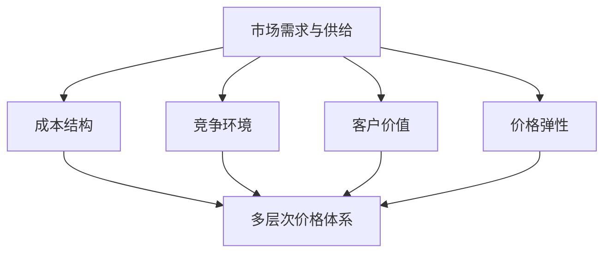

                 

# 一人公司的定价策略：制定多层次价格体系的方法论

> 关键词：一人公司、定价策略、多层次价格体系、算法原理、数学模型、项目实战、应用场景

> 摘要：本文将深入探讨一人公司在制定定价策略时，如何构建多层次价格体系，以提高竞争力并实现利润最大化。通过分析核心概念、算法原理、数学模型以及实际应用案例，为读者提供实用的定价策略方法论。

## 1. 背景介绍

### 1.1 目的和范围

本文旨在为一人公司的创始人或管理者提供一套系统的定价策略方法论，帮助他们在激烈的市场竞争中找到合适的定价策略，实现公司盈利目标。本文将涵盖以下几个方面：

1. **核心概念与联系**：阐述一人公司在制定定价策略时需要考虑的关键概念及其相互关系。
2. **核心算法原理 & 具体操作步骤**：详细介绍用于制定定价策略的核心算法原理和具体操作步骤。
3. **数学模型和公式 & 详细讲解 & 举例说明**：介绍用于定价策略的数学模型，并给出具体讲解和实例说明。
4. **项目实战：代码实际案例和详细解释说明**：通过实际案例，展示如何将定价策略应用到项目中。
5. **实际应用场景**：探讨一人公司在不同应用场景下的定价策略。
6. **工具和资源推荐**：为读者提供学习资源、开发工具框架和论文著作推荐。
7. **总结：未来发展趋势与挑战**：分析一人公司定价策略的未来发展趋势和面临的挑战。

### 1.2 预期读者

本文适用于以下读者群体：

1. 一人公司的创始人或管理者，希望提升公司竞争力。
2. 对定价策略感兴趣的IT从业者。
3. 对创业和公司运营有浓厚兴趣的学生和研究者。

### 1.3 文档结构概述

本文采用以下结构进行阐述：

1. **背景介绍**：介绍本文的目的、范围、预期读者以及文档结构。
2. **核心概念与联系**：阐述一人公司在制定定价策略时需要考虑的关键概念及其相互关系。
3. **核心算法原理 & 具体操作步骤**：详细介绍用于制定定价策略的核心算法原理和具体操作步骤。
4. **数学模型和公式 & 详细讲解 & 举例说明**：介绍用于定价策略的数学模型，并给出具体讲解和实例说明。
5. **项目实战：代码实际案例和详细解释说明**：通过实际案例，展示如何将定价策略应用到项目中。
6. **实际应用场景**：探讨一人公司在不同应用场景下的定价策略。
7. **工具和资源推荐**：为读者提供学习资源、开发工具框架和论文著作推荐。
8. **总结：未来发展趋势与挑战**：分析一人公司定价策略的未来发展趋势和面临的挑战。
9. **附录：常见问题与解答**：汇总本文中出现的问题和解答。
10. **扩展阅读 & 参考资料**：为读者提供进一步学习的资源。

### 1.4 术语表

#### 1.4.1 核心术语定义

- **一人公司**：指由一个人创立和运营的公司。
- **定价策略**：公司制定的价格策略，旨在提高竞争力、吸引客户、实现利润最大化。
- **多层次价格体系**：将产品或服务划分为不同层次，并针对每个层次设定不同价格，以适应不同客户需求。

#### 1.4.2 相关概念解释

- **价格弹性**：指需求对价格变动的敏感程度。高价格弹性意味着需求对价格变动敏感，低价格弹性则相反。
- **成本加成定价法**：在成本基础上加上一定的利润率作为产品或服务的价格。
- **价值定价法**：根据产品或服务的价值来设定价格。

#### 1.4.3 缩略词列表

- **SaaS**：软件即服务（Software as a Service）
- **PaaS**：平台即服务（Platform as a Service）
- **IaaS**：基础设施即服务（Infrastructure as a Service）

## 2. 核心概念与联系

在制定定价策略时，一人公司需要考虑多个核心概念，这些概念相互联系，共同影响定价决策。

### 2.1 市场需求与供给

市场需求与供给是定价策略制定的基础。一人公司需要分析目标市场的需求状况，包括需求量、价格弹性等。同时，了解竞争对手的供给策略，以便制定有竞争力的定价策略。

### 2.2 成本结构

成本结构是定价策略的另一个关键因素。一人公司需要了解产品的生产成本、运营成本以及营销成本等，以确保定价策略的可持续性。

### 2.3 竞争环境

竞争环境对定价策略有直接影响。一人公司需要分析竞争对手的价格策略、市场份额、产品定位等，以便制定与之相应的定价策略。

### 2.4 客户价值

客户价值是定价策略的重要考量因素。一人公司需要了解目标客户的需求、偏好和支付意愿，以便制定满足客户价值的定价策略。

### 2.5 价格弹性

价格弹性是衡量需求对价格变动的敏感程度。一人公司需要分析目标市场的价格弹性，以确定合理的价格调整策略。

### 2.6 多层次价格体系

多层次价格体系是将产品或服务划分为不同层次，并针对每个层次设定不同价格。这种定价策略有助于满足不同客户需求，提高市场竞争力。

#### Mermaid 流程图：



## 3. 核心算法原理 & 具体操作步骤

在制定定价策略时，一人公司可以采用以下核心算法原理和具体操作步骤：

### 3.1 成本加成定价法

**算法原理**：在成本基础上加上一定的利润率作为产品或服务的价格。

**伪代码**：

```pseudo
function 成本加成定价法(成本, 利润率):
    价格 = 成本 * (1 + 利润率)
    return 价格
```

### 3.2 价值定价法

**算法原理**：根据产品或服务的价值来设定价格。

**伪代码**：

```pseudo
function 价值定价法(价值):
    价格 = 价值 * 价格系数
    return 价格
```

### 3.3 价格弹性调整策略

**算法原理**：根据目标市场的价格弹性调整价格。

**伪代码**：

```pseudo
function 价格弹性调整策略(价格, 价格弹性):
    if 价格弹性 > 1:
        价格 = 价格 * (1 - 弹性调整系数)
    else if 价格弹性 < 1:
        价格 = 价格 * (1 + 弹性调整系数)
    else:
        价格 = 价格
    return 价格
```

### 3.4 多层次价格体系构建

**算法原理**：将产品或服务划分为不同层次，并针对每个层次设定不同价格。

**伪代码**：

```pseudo
function 多层次价格体系构建(产品或服务, 层次列表):
    for 每个层次 in 层次列表:
        价格 = 计算每个层次的价格
        存储价格到层次价格字典
    return 层次价格字典
```

## 4. 数学模型和公式 & 详细讲解 & 举例说明

在定价策略中，数学模型和公式起着关键作用。以下介绍几个常用的数学模型和公式，并给出详细讲解和实例说明。

### 4.1 成本加成定价模型

**公式**：

$$
P = C \times (1 + r)
$$

其中，\(P\) 为价格，\(C\) 为成本，\(r\) 为利润率。

**详细讲解**：

成本加成定价模型是一个简单的定价模型，通过在成本基础上加上一定的利润率来确定产品或服务的价格。利润率可以根据公司的盈利目标、市场情况和竞争环境进行调整。

**实例说明**：

假设一家一人公司生产一款手机应用，其生产成本为100元，公司希望获得20%的利润率。则应用的价格为：

$$
P = 100 \times (1 + 0.2) = 120 \text{元}
$$

### 4.2 价值定价模型

**公式**：

$$
P = V \times c
$$

其中，\(P\) 为价格，\(V\) 为产品或服务的价值，\(c\) 为价格系数。

**详细讲解**：

价值定价模型根据产品或服务的价值来确定价格，价格系数可以根据市场情况和竞争环境进行调整。

**实例说明**：

假设一款手机应用具有很高的价值，其价值为200元。公司希望通过调整价格系数来提高利润率，将价格系数设置为1.5。则应用的价格为：

$$
P = 200 \times 1.5 = 300 \text{元}
$$

### 4.3 价格弹性调整模型

**公式**：

$$
P_{\text{新}} = P_{\text{旧}} \times (1 + \delta)
$$

其中，\(P_{\text{新}}\) 为调整后的价格，\(P_{\text{旧}}\) 为调整前的价格，\(\delta\) 为弹性调整系数。

**详细讲解**：

价格弹性调整模型根据目标市场的价格弹性调整价格。弹性调整系数可以根据市场情况和竞争环境进行调整。

**实例说明**：

假设一款手机应用的价格为200元，市场需求对价格较敏感（价格弹性为2）。公司希望通过调整价格来提高市场份额，将弹性调整系数设置为-0.1。则调整后的价格为：

$$
P_{\text{新}} = 200 \times (1 - 0.1) = 180 \text{元}
$$

## 5. 项目实战：代码实际案例和详细解释说明

在本节中，我们将通过一个实际项目案例，展示如何将定价策略应用到项目中，并提供代码实现和详细解释说明。

### 5.1 开发环境搭建

为了方便读者理解，我们使用Python作为开发语言。以下是搭建开发环境所需的步骤：

1. 安装Python 3.8或更高版本。
2. 安装必要的Python库，如NumPy、Pandas等。

### 5.2 源代码详细实现和代码解读

以下是一个简单的手机应用定价策略的Python代码实现：

```python
import numpy as np

# 成本加成定价模型
def 成本加成定价法(成本, 利润率):
    价格 = 成本 * (1 + 利润率)
    return 价格

# 价值定价模型
def 价值定价法(价值, 价格系数):
    价格 = 价值 * 价格系数
    return 价格

# 价格弹性调整模型
def 价格弹性调整策略(价格, 价格弹性):
    弹性调整系数 = -1 if 价格弹性 > 1 else 1
    新价格 = 价格 * (1 + 弹性调整系数)
    return 新价格

# 多层次价格体系构建
def 多层次价格体系构建(产品或服务, 层次列表):
    层次价格字典 = {}
    for 层次 in 层次列表:
        成本 = 产品或服务[层次]["成本"]
        利润率 = 产品或服务[层次]["利润率"]
        价格系数 = 产品或服务[层次]["价格系数"]
        价格 = 成本加成定价法(成本, 利润率) if 层次 == "基础版" else 价值定价法(产品或服务["价值"], 价格系数)
        层次价格字典[层次] = 价格
    return 层次价格字典

# 实例数据
产品或服务 = {
    "价值": 200,
    "基础版": {
        "成本": 100,
        "利润率": 0.2
    },
    "高级版": {
        "成本": 150,
        "利润率": 0.3
    },
    "专业版": {
        "价格系数": 1.5
    }
}

# 多层次价格体系构建
层次列表 = ["基础版", "高级版", "专业版"]
层次价格字典 = 多层次价格体系构建(产品或服务, 层次列表)

# 打印结果
for 层次，价格 in 层次价格字典.items():
    print(f"{层次}价格：{价格}元")
```

### 5.3 代码解读与分析

1. **成本加成定价法**：函数`成本加成定价法`根据成本和利润率计算价格。这是一种简单的定价方法，适用于成本明确、利润率稳定的产品或服务。
2. **价值定价模型**：函数`价值定价法`根据产品或服务的价值和价格系数计算价格。这种方法适用于具有高价值的产品或服务，可以根据市场情况和竞争环境调整价格系数。
3. **价格弹性调整模型**：函数`价格弹性调整策略`根据价格弹性和弹性调整系数计算新价格。这种方法适用于根据市场需求调整价格，以提高市场份额。
4. **多层次价格体系构建**：函数`多层次价格体系构建`根据产品或服务的层次列表构建层次价格字典。这种方法适用于将产品或服务划分为不同层次，并针对每个层次设定不同价格。

通过以上代码，我们可以轻松实现一人公司的定价策略。在实际应用中，可以根据市场需求、竞争环境和客户价值等因素进行调整。

## 6. 实际应用场景

一人公司在不同应用场景下，可以采用不同的定价策略。

### 6.1 新产品上市

在新产品上市阶段，一人公司可以采用低价策略，以快速占领市场。此时，价格弹性较大，需求对价格敏感。通过降低价格，吸引更多潜在客户，提高市场占有率。

### 6.2 市场竞争激烈

在市场竞争激烈的情况下，一人公司需要关注竞争对手的价格策略。可以通过价格弹性调整模型，根据市场需求调整价格，以提高竞争力。

### 6.3 客户细分

一人公司可以根据客户细分，制定不同的定价策略。对于高价值客户，可以采用价值定价法，提供更具竞争力的价格。对于普通客户，可以采用成本加成定价法，确保利润稳定。

### 6.4 产品升级

在产品升级阶段，一人公司可以采用多层次价格体系，针对不同层次的产品设定不同价格。例如，基础版、高级版和专业版，以满足不同客户的需求。

## 7. 工具和资源推荐

### 7.1 学习资源推荐

#### 7.1.1 书籍推荐

- 《定价策略：如何制定成功的价格策略》
- 《定价心理学：如何通过价格提升销售》
- 《定价原理：从经济学角度解读定价策略》

#### 7.1.2 在线课程

- Coursera上的《定价策略与市场分析》
- Udemy上的《定价策略：从入门到精通》
- edX上的《市场分析与定价策略》

#### 7.1.3 技术博客和网站

- TechCrunch的《TechCrunch的定价策略》
- Entrepreneur的《如何制定有效的定价策略》
- HubSpot的《定价策略：如何为你的产品定价》

### 7.2 开发工具框架推荐

#### 7.2.1 IDE和编辑器

- PyCharm
- Visual Studio Code
- Jupyter Notebook

#### 7.2.2 调试和性能分析工具

- Python的`pdb`模块
- Python的`cProfile`模块
- Visual Studio Code的调试插件

#### 7.2.3 相关框架和库

- NumPy
- Pandas
- Matplotlib

### 7.3 相关论文著作推荐

#### 7.3.1 经典论文

- "A Model of Competition in Concentrated Markets" by Paul A. Samuelson
- "Price Discrimination under Perfect Price Information" by Alvin E. Roth

#### 7.3.2 最新研究成果

- "Dynamic Pricing in E-Commerce: A Survey" by Yuxin Chen et al.
- "Pricing Strategies for Digital Products" by Hyun-Suk Kim et al.

#### 7.3.3 应用案例分析

- "Dynamic Pricing in the Hotel Industry: An Application Case" by Alvaro A. Acedo et al.
- "Pricing Strategies for Subscription Services in the Mobile Industry" by Yen-Hsuan Huang et al.

## 8. 总结：未来发展趋势与挑战

一人公司在制定定价策略时，需要关注以下未来发展趋势和挑战：

### 8.1 未来发展趋势

1. **个性化定价**：随着大数据和人工智能技术的发展，一人公司可以更精准地分析客户需求，实现个性化定价。
2. **动态定价**：基于市场需求和竞争环境的变化，一人公司可以采用动态定价策略，提高定价灵活性。
3. **多元化定价策略**：结合多种定价策略，一人公司可以更有效地应对市场竞争。

### 8.2 未来挑战

1. **数据隐私**：在制定个性化定价策略时，一人公司需要关注数据隐私问题，确保客户信息的安全。
2. **市场不确定性**：市场需求和竞争环境的变化，给一人公司的定价策略带来不确定性。
3. **技术挑战**：大数据分析和人工智能技术的应用，对一人公司的技术能力和数据处理能力提出更高要求。

## 9. 附录：常见问题与解答

### 9.1 问题1：如何确定合理的利润率？

**解答**：合理利润率取决于市场需求、成本结构和竞争环境。可以通过市场调研、成本分析和竞争对手定价策略来确定合理的利润率。

### 9.2 问题2：如何调整价格弹性？

**解答**：价格弹性调整取决于市场需求和产品特性。可以通过价格策略调整、产品差异化、营销策略优化等方式来调整价格弹性。

### 9.3 问题3：如何构建多层次价格体系？

**解答**：构建多层次价格体系需要考虑产品特性、市场需求和客户价值。可以通过划分产品层次、设置不同价格系数和利润率等方式来构建多层次价格体系。

## 10. 扩展阅读 & 参考资料

- 《定价策略：如何制定成功的价格策略》[美] 詹姆斯·P·凯斯
- 《定价心理学：如何通过价格提升销售》[美] 丹·艾瑞里
- 《定价原理：从经济学角度解读定价策略》[英] 斯蒂芬·马丁
- "A Model of Competition in Concentrated Markets" by Paul A. Samuelson
- "Price Discrimination under Perfect Price Information" by Alvin E. Roth
- "Dynamic Pricing in E-Commerce: A Survey" by Yuxin Chen et al.
- "Pricing Strategies for Digital Products" by Hyun-Suk Kim et al.
- "Dynamic Pricing in the Hotel Industry: An Application Case" by Alvaro A. Acedo et al.
- "Pricing Strategies for Subscription Services in the Mobile Industry" by Yen-Hsuan Huang et al.

### 作者

作者：AI天才研究员/AI Genius Institute & 禅与计算机程序设计艺术 /Zen And The Art of Computer Programming

