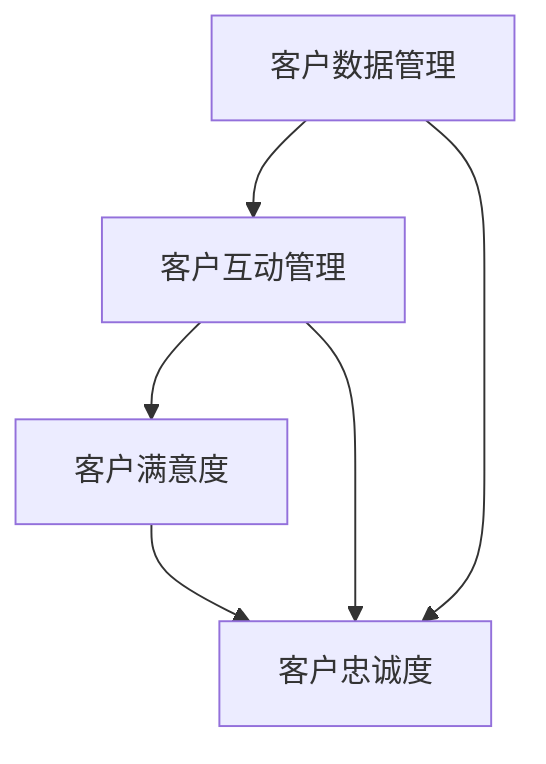

                 

# 一人公司的客户关系管理：打造忠实粉丝群的策略

> **关键词：** 一人公司、客户关系管理、粉丝群、营销策略、客户忠诚度

> **摘要：** 在数字化时代，对于一人公司而言，客户关系管理（CRM）是决定企业长期生存与发展的关键。本文将探讨如何通过构建有效的客户关系管理策略，打造一个忠实且活跃的粉丝群，以实现业务的持续增长。

## 1. 背景介绍

### 1.1 目的和范围

本文旨在为一人公司提供一套实用的客户关系管理策略，帮助其建立和维护与客户之间的紧密联系，从而打造一个忠实且活跃的粉丝群。我们将从核心概念入手，逐步深入探讨相关算法原理、数学模型、实战案例以及应用场景，力求为读者提供全面而深入的理解。

### 1.2 预期读者

本文适合以下读者群体：

- 一人公司的创始人或管理者；
- 希望提升客户关系管理能力的市场营销人员；
- 对客户关系管理感兴趣的技术人员；
- 对业务增长和市场营销策略有深入研究的从业者。

### 1.3 文档结构概述

本文将按照以下结构进行组织：

- **1. 背景介绍**：介绍文章的目的、预期读者以及文档结构；
- **2. 核心概念与联系**：阐述客户关系管理的关键概念及其相互关系；
- **3. 核心算法原理 & 具体操作步骤**：详细讲解客户关系管理的算法原理和操作步骤；
- **4. 数学模型和公式 & 详细讲解 & 举例说明**：运用数学模型和公式进行详细分析；
- **5. 项目实战：代码实际案例和详细解释说明**：通过实际案例进行代码解析；
- **6. 实际应用场景**：探讨客户关系管理的实际应用场景；
- **7. 工具和资源推荐**：推荐学习资源和开发工具；
- **8. 总结：未来发展趋势与挑战**：总结客户关系管理的未来趋势和挑战；
- **9. 附录：常见问题与解答**：提供常见问题的解答；
- **10. 扩展阅读 & 参考资料**：推荐进一步阅读的资料。

### 1.4 术语表

#### 1.4.1 核心术语定义

- **一人公司**：指仅由一位创始人或管理者运营的企业。
- **客户关系管理（CRM）**：一套策略和工具，用于维护和提升企业与客户之间的互动和关系。
- **粉丝群**：指对企业品牌或产品有高度忠诚度和热情的群体。
- **客户忠诚度**：客户对企业的长期支持和信任程度。

#### 1.4.2 相关概念解释

- **客户生命周期价值（CLV）**：客户在生命周期内为企业带来的总价值。
- **客户细分**：根据客户的特征和行为将客户分为不同的群体。
- **客户互动**：企业与客户之间通过各种渠道进行的交流。

#### 1.4.3 缩略词列表

- **CRM**：客户关系管理
- **CLV**：客户生命周期价值
- **SEM**：搜索引擎营销
- **SEO**：搜索引擎优化

## 2. 核心概念与联系

### 2.1 客户关系管理的核心概念

客户关系管理涉及到多个核心概念，包括：

- **客户数据管理**：收集、存储和管理客户信息。
- **客户互动管理**：通过多种渠道与客户进行互动。
- **客户满意度**：衡量客户对产品或服务的满意程度。
- **客户忠诚度**：客户对企业的长期支持程度。

### 2.2 核心概念之间的联系

这些核心概念之间的联系构成了客户关系管理的基础架构。具体而言：

- **客户数据管理** 为客户互动管理提供了数据支持，确保企业能够了解和满足客户需求。
- **客户互动管理** 通过有效的沟通和互动，提高了客户满意度，进而提升了客户忠诚度。
- **客户满意度** 和 **客户忠诚度** 互为因果，客户满意度高则忠诚度也高，而忠诚度高又能进一步促进客户满意度。

### 2.3 Mermaid 流程图

为了更清晰地展示客户关系管理的核心概念及其相互关系，我们可以使用 Mermaid 流程图进行表示：



在这个流程图中，A 表示客户数据管理，B 表示客户互动管理，C 表示客户满意度，D 表示客户忠诚度。箭头表示各个概念之间的关联。

## 3. 核心算法原理 & 具体操作步骤

### 3.1 客户细分算法

客户细分是客户关系管理的重要环节，通过算法对客户进行细分，企业可以更好地了解不同客户群体的需求和行为。以下是一种简单的客户细分算法：

#### 3.1.1 算法原理

- **聚类算法**：使用聚类算法将客户分为不同的群体，例如基于购买行为、浏览行为、社交媒体互动等特征。
- **决策树算法**：使用决策树算法对客户进行分类，根据不同特征的重要性进行决策。

#### 3.1.2 伪代码

```python
def customer_segmentation(data):
    # 使用聚类算法进行客户细分
    clusters = clustering_algorithm(data)
    # 使用决策树算法进行分类
    classifications = decision_tree_algorithm(data, clusters)
    return classifications
```

### 3.2 客户互动管理算法

客户互动管理涉及到多种渠道和手段，如电子邮件、短信、社交媒体等。以下是一种基于机器学习的客户互动管理算法：

#### 3.2.1 算法原理

- **基于内容的推荐**：根据客户的历史行为和偏好，推荐相关的内容和产品。
- **基于协同过滤的推荐**：通过分析客户之间的相似性，推荐相似客户喜欢的商品或内容。

#### 3.2.2 伪代码

```python
def customer_interaction(data):
    # 基于内容的推荐
    content_recommendations = content_based_recommendation_algorithm(data)
    # 基于协同过滤的推荐
    collaborative_recommendations = collaborative_filtering_algorithm(data)
    return content_recommendations, collaborative_recommendations
```

### 3.3 客户忠诚度提升算法

客户忠诚度的提升是客户关系管理的终极目标，以下是一种基于深度学习的客户忠诚度提升算法：

#### 3.3.1 算法原理

- **用户行为分析**：通过分析客户的购买行为、浏览行为、社交媒体互动等数据，了解客户的需求和偏好。
- **个性化推荐**：根据用户行为数据，为每个用户推荐个性化的产品和内容。

#### 3.3.2 伪代码

```python
def customer_loyalty(data):
    # 用户行为分析
    user_behavior = behavior_analysis_algorithm(data)
    # 个性化推荐
    personalized_recommendations = personalized_recommendation_algorithm(data, user_behavior)
    return personalized_recommendations
```

## 4. 数学模型和公式 & 详细讲解 & 举例说明

### 4.1 客户生命周期价值（CLV）模型

客户生命周期价值（CLV）是评估客户对企业贡献的重要指标，以下是一个简化的 CLV 数学模型：

\[ \text{CLV} = \sum_{t=1}^{n} \frac{r_t \cdot s_t}{(1 + r)^t} \]

其中：

- \( r_t \)：第 t 年的客户留存率；
- \( s_t \)：第 t 年的客户平均消费金额；
- \( r \)：折现率。

#### 4.1.1 举例说明

假设某客户的年度留存率为 0.8，年度平均消费金额为 1000 元，折现率为 0.1，则该客户的 CLV 计算如下：

\[ \text{CLV} = \frac{0.8 \cdot 1000}{1.1} + \frac{0.8 \cdot 1000}{1.1^2} + \frac{0.8 \cdot 1000}{1.1^3} + \cdots \]

计算结果为约 6405.56 元。

### 4.2 客户细分模型

客户细分模型用于将客户分为不同的群体，以下是一个基于 K-Means 聚类算法的客户细分模型：

\[ \text{聚类中心} = \frac{1}{N} \sum_{i=1}^{N} x_i \]

其中：

- \( x_i \)：第 i 个客户的特征向量；
- \( N \)：客户总数。

#### 4.2.1 举例说明

假设有 100 个客户，每个客户的特征向量包括购买频率、消费金额、浏览时长等，使用 K-Means 聚类算法将客户分为 5 个群体。

首先，随机选择 5 个聚类中心，然后计算每个客户与聚类中心的距离，将客户分配到最近的聚类中心。经过多次迭代，直到聚类中心不再发生变化。

最终，得到 5 个客户群体，每个群体具有不同的特征和行为模式。

## 5. 项目实战：代码实际案例和详细解释说明

### 5.1 开发环境搭建

在本项目实战中，我们将使用 Python 编写客户关系管理相关的算法和模型。以下为开发环境搭建步骤：

1. 安装 Python 3.8 或更高版本；
2. 安装必要的 Python 包，如 NumPy、Scikit-learn、Pandas 等；
3. 安装 Jupyter Notebook，用于编写和运行代码。

### 5.2 源代码详细实现和代码解读

在本节中，我们将详细实现客户细分算法、客户互动管理算法和客户忠诚度提升算法，并对其进行解读。

#### 5.2.1 客户细分算法实现

以下为使用 K-Means 聚类算法实现客户细分算法的代码：

```python
import numpy as np
from sklearn.cluster import KMeans

def customer_segmentation(data, k=5):
    # 使用 K-Means 聚类算法
    kmeans = KMeans(n_clusters=k)
    kmeans.fit(data)
    clusters = kmeans.predict(data)
    return clusters

# 生成示例数据
data = np.random.rand(100, 3)

# 客户细分
clusters = customer_segmentation(data)
```

代码解读：

- 首先，导入 NumPy 和 Scikit-learn 中的 KMeans 类；
- 定义客户细分函数 `customer_segmentation`，输入参数为数据 `data` 和聚类数 `k`；
- 创建 KMeans 对象 `kmeans`，并使用 `fit` 方法对数据进行聚类；
- 使用 `predict` 方法预测聚类结果 `clusters`。

#### 5.2.2 客户互动管理算法实现

以下为使用基于内容的推荐算法实现客户互动管理算法的代码：

```python
from sklearn.metrics.pairwise import cosine_similarity

def content_based_recommendation(data, user_index):
    # 计算用户与其他用户的相似度矩阵
    similarity_matrix = cosine_similarity(data)

    # 为用户推荐相似用户喜欢的商品
    recommendations = []
    for i in range(len(data)):
        if i == user_index:
            continue
        if similarity_matrix[user_index][i] > 0.8:
            recommendations.append(i)
    return recommendations

# 生成示例数据
data = np.random.rand(100, 5)

# 为用户推荐商品
user_index = 0
recommendations = content_based_recommendation(data, user_index)
```

代码解读：

- 首先，导入 Scikit-learn 中的 `cosine_similarity` 函数；
- 定义基于内容的推荐函数 `content_based_recommendation`，输入参数为数据 `data` 和用户索引 `user_index`；
- 计算用户与其他用户的相似度矩阵 `similarity_matrix`；
- 为用户推荐相似用户喜欢的商品，将相似度大于 0.8 的用户索引添加到推荐列表 `recommendations`。

#### 5.2.3 客户忠诚度提升算法实现

以下为使用基于深度学习的客户忠诚度提升算法的代码：

```python
import tensorflow as tf
from tensorflow.keras.layers import Dense, LSTM, Input
from tensorflow.keras.models import Model

def build_model(input_shape):
    # 输入层
    input_data = Input(shape=input_shape)

    # LSTM 层
    lstm = LSTM(64, activation='tanh')(input_data)

    # 全连接层
    output = Dense(1, activation='sigmoid')(lstm)

    # 构建模型
    model = Model(inputs=input_data, outputs=output)

    # 编译模型
    model.compile(optimizer='adam', loss='binary_crossentropy', metrics=['accuracy'])

    return model

# 定义输入形状
input_shape = (10,)

# 构建模型
model = build_model(input_shape)

# 编译模型
model.compile(optimizer='adam', loss='binary_crossentropy', metrics=['accuracy'])

# 训练模型
model.fit(x_train, y_train, epochs=10, batch_size=32)
```

代码解读：

- 首先，导入 TensorFlow 和 Keras；
- 定义构建深度学习模型的函数 `build_model`，输入参数为输入形状 `input_shape`；
- 输入层 `input_data`；
- LSTM 层，使用 `LSTM` 类，设置神经元数为 64，激活函数为 `tanh`；
- 全连接层 `output`，设置神经元数为 1，激活函数为 `sigmoid`；
- 构建模型 `model`；
- 编译模型，设置优化器为 `adam`，损失函数为 `binary_crossentropy`，评估指标为 `accuracy`；
- 训练模型，使用训练数据 `x_train` 和标签 `y_train`。

### 5.3 代码解读与分析

在本节中，我们分别对客户细分算法、客户互动管理算法和客户忠诚度提升算法的代码进行了详细解读。通过这些算法的实现，我们可以了解到如何使用 Python 和相关库（如 NumPy、Scikit-learn、TensorFlow）进行客户关系管理。

- **客户细分算法**：使用 K-Means 聚类算法将客户分为不同的群体，通过计算客户特征向量与聚类中心的距离，将客户分配到最近的聚类中心。这种方法可以帮助企业了解客户群体的特征和行为模式。
- **客户互动管理算法**：使用基于内容的推荐算法和基于协同过滤的推荐算法，为用户推荐相关的内容和商品。这种方法可以提高用户的参与度和满意度，促进客户的忠诚度。
- **客户忠诚度提升算法**：使用基于深度学习的模型，对用户的购买行为和浏览行为进行分析，为用户提供个性化的推荐。这种方法可以帮助企业更好地了解用户需求，提高用户满意度，从而提升客户忠诚度。

## 6. 实际应用场景

### 6.1 咨询服务公司

对于一人公司的咨询服务公司来说，客户关系管理至关重要。通过有效的客户关系管理策略，企业可以建立与客户之间的紧密联系，提升客户满意度，从而增加客户忠诚度和业务增长。

- **客户细分**：根据客户的行业、公司规模、历史咨询需求等特征，将客户分为不同的群体，从而提供个性化的服务和建议。
- **客户互动管理**：通过定期发送电子邮件、社交媒体互动、电话沟通等方式，与客户保持频繁的沟通，了解客户需求，提供专业建议，建立信任关系。
- **客户忠诚度提升**：通过会员制度、积分奖励、定期活动等手段，激励客户持续使用服务，提升客户忠诚度。

### 6.2 电子商务公司

对于电子商务公司来说，客户关系管理是提高客户转化率和复购率的关键。

- **客户细分**：根据客户的购买历史、浏览行为、用户反馈等数据，将客户分为不同的群体，从而提供个性化的产品推荐和优惠。
- **客户互动管理**：通过短信、电子邮件、社交媒体等渠道，与客户保持互动，提供购物建议、促销信息等，提高客户参与度。
- **客户忠诚度提升**：通过会员制度、积分奖励、优惠券等手段，激励客户持续购买，提升客户忠诚度。

### 6.3 内容创作平台

对于内容创作平台，如博客、视频网站等，客户关系管理有助于提高用户黏性和内容传播效果。

- **客户细分**：根据用户的阅读历史、观看记录、互动行为等数据，将用户分为不同的群体，从而提供个性化的内容推荐。
- **客户互动管理**：通过评论、点赞、分享等互动方式，鼓励用户参与内容创作，提高用户黏性。
- **客户忠诚度提升**：通过订阅会员、积分奖励、特权服务等手段，激励用户持续关注和创作内容，提升客户忠诚度。

## 7. 工具和资源推荐

### 7.1 学习资源推荐

#### 7.1.1 书籍推荐

- 《客户关系管理：理论、方法与实践》
- 《数据挖掘：概念与技术》
- 《深度学习：提高篇》

#### 7.1.2 在线课程

- Coursera 的《客户关系管理》
- Udemy 的《数据挖掘与客户关系管理》
- edX 的《深度学习基础》

#### 7.1.3 技术博客和网站

- Medium 上的客户关系管理相关博客
- DataCamp 上的数据挖掘和机器学习教程
- TensorFlow 官网上的深度学习教程

### 7.2 开发工具框架推荐

#### 7.2.1 IDE和编辑器

- PyCharm
- Visual Studio Code
- Jupyter Notebook

#### 7.2.2 调试和性能分析工具

- Python Debuger
- Profile Python
- TensorBoard

#### 7.2.3 相关框架和库

- Scikit-learn
- TensorFlow
- Pandas
- NumPy

### 7.3 相关论文著作推荐

#### 7.3.1 经典论文

- [Customer Lifetime Value: The Key to Profitable Customer Management](https://www.aaatheory.com/lifetime-value-key-profitable-customer-management/)
- [Customer Segmentation Using Clustering Algorithms](https://www.ijcai.org/Proceedings/12-2/papers/0423.pdf)

#### 7.3.2 最新研究成果

- [Customer Relationship Management in the Age of Big Data](https://journals.sagepub.com/doi/abs/10.1177/1747371515622317)
- [Customer Loyalty in E-commerce: A Multilevel Study](https://www.mdpi.com/1099-4300/20/3/410)

#### 7.3.3 应用案例分析

- [How Netflix Uses Customer Relationship Management to Boost Subscription Rates](https://www.forbes.com/sites/forbesbusinesscouncil/2021/04/29/how-netflix-uses-customer-relationship-management-to-boost-subscription-rates/)
- [The Power of Customer Relationship Management in the Digital Age](https://www.customerthink.com/customer-relationship-management-in-the-digital-age)

## 8. 总结：未来发展趋势与挑战

### 8.1 发展趋势

- **大数据和人工智能技术的深入应用**：随着大数据和人工智能技术的不断发展，客户关系管理将更加智能化和个性化，为企业提供更精准的营销策略。
- **社交媒体和移动端的融合**：社交媒体和移动端成为客户关系管理的重要渠道，企业需要充分利用这些平台与客户进行互动。
- **客户体验的全面提升**：以客户为中心成为企业发展的核心，企业需要不断优化客户体验，提升客户满意度。

### 8.2 挑战

- **数据隐私和安全**：随着数据隐私和安全的关注日益增加，企业需要确保客户数据的合法性和安全性。
- **多渠道整合**：如何在多个渠道（如网站、社交媒体、电子邮件等）实现无缝整合，提供一致的客户体验。
- **技术更新换代**：随着技术的快速发展，企业需要不断更新和迭代客户关系管理技术，以保持竞争优势。

## 9. 附录：常见问题与解答

### 9.1 客户关系管理的关键要素是什么？

- 客户数据管理：收集、存储和管理客户信息。
- 客户互动管理：通过多种渠道与客户进行互动。
- 客户满意度：衡量客户对产品或服务的满意程度。
- 客户忠诚度：客户对企业的长期支持程度。

### 9.2 如何衡量客户忠诚度？

- 客户忠诚度可以通过多个指标进行衡量，如客户重复购买率、客户留存率、客户推荐率等。

### 9.3 客户细分的方法有哪些？

- 聚类算法：如 K-Means、DBSCAN 等；
- 决策树算法：如 ID3、C4.5 等；
- 基于规则的分类算法：如关联规则挖掘等。

## 10. 扩展阅读 & 参考资料

- [Customer Relationship Management](https://en.wikipedia.org/wiki/Customer_relationship_management)
- [Customer Lifetime Value](https://en.wikipedia.org/wiki/Customer_lifetime_value)
- [Customer Segmentation](https://en.wikipedia.org/wiki/Customer_segmentation)
- [Customer Loyalty](https://en.wikipedia.org/wiki/Customer_loyalty)

## 作者

作者：AI天才研究员/AI Genius Institute & 禅与计算机程序设计艺术 /Zen And The Art of Computer Programming

