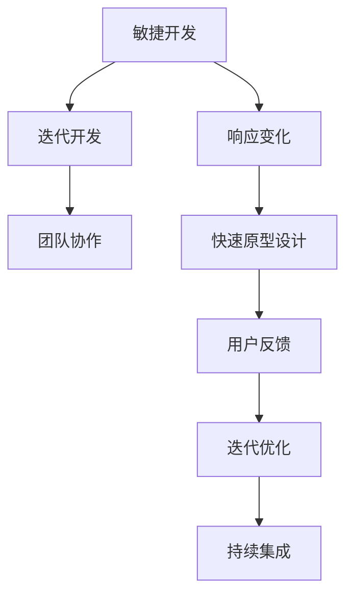

                 

# 一人公司的敏捷产品开发与快速原型设计

> **关键词：** 一人公司，敏捷开发，原型设计，迭代开发，快速反馈，最小可行性产品（MVP）

> **摘要：** 本文将探讨如何在一人公司的环境中，利用敏捷产品开发方法和快速原型设计技术，实现高效的产品开发和迭代。我们将从背景介绍、核心概念、算法原理、数学模型、实战案例、实际应用场景等多个方面，详细阐述一人公司敏捷产品开发与快速原型设计的全过程和方法论。

## 1. 背景介绍

### 1.1 目的和范围

本文旨在为一人公司的创业者或开发者提供一套完整的产品开发与快速原型设计的方法论。我们将从多个角度出发，包括但不限于敏捷开发的核心原则、快速原型设计的步骤、算法原理的讲解、数学模型的运用等，来帮助读者深入理解并掌握一人公司敏捷产品开发与快速原型设计的实践方法。

### 1.2 预期读者

本文适合以下读者群体：

- 一人公司的创始人或开发者
- 产品经理，尤其是对于敏捷开发有浓厚兴趣的产品经理
- 对于软件工程和敏捷开发有一定了解的技术爱好者
- 想要深入了解敏捷开发与快速原型设计的技术专家

### 1.3 文档结构概述

本文将按照以下结构进行展开：

1. **背景介绍**：介绍一人公司敏捷产品开发与快速原型设计的目的、范围和预期读者。
2. **核心概念与联系**：通过Mermaid流程图展示核心概念和原理的联系。
3. **核心算法原理 & 具体操作步骤**：详细讲解敏捷开发与快速原型设计的算法原理，并用伪代码进行描述。
4. **数学模型和公式 & 详细讲解 & 举例说明**：运用数学模型和公式，解释核心概念和应用。
5. **项目实战：代码实际案例和详细解释说明**：通过实战案例，展示敏捷产品开发与快速原型设计的具体实现。
6. **实际应用场景**：分析敏捷产品开发与快速原型设计的实际应用场景。
7. **工具和资源推荐**：推荐相关学习资源、开发工具和框架。
8. **总结：未来发展趋势与挑战**：总结本文的核心观点，探讨未来发展趋势和挑战。
9. **附录：常见问题与解答**：解答读者可能遇到的一些常见问题。
10. **扩展阅读 & 参考资料**：提供更多参考资料，供读者深入学习。

### 1.4 术语表

#### 1.4.1 核心术语定义

- **敏捷开发**：一种软件开发方法论，强调迭代、增量和灵活响应变化。
- **快速原型设计**：通过快速构建原型，验证产品概念和用户需求。
- **最小可行性产品（MVP）**：具备基本功能的可运行产品，用于验证产品概念和市场可行性。
- **迭代开发**：将软件开发过程分为多个迭代周期，每个迭代周期完成部分功能，并逐步完善。

#### 1.4.2 相关概念解释

- **用户故事**：描述用户需求和功能的简单语句。
- **看板（Kanban）**：一种可视化管理工具，用于跟踪和管理项目进度。
- **Scrum**：一种流行的敏捷开发框架，强调迭代和团队合作。

#### 1.4.3 缩略词列表

- **MVP**：最小可行性产品（Minimum Viable Product）
- **Sprint**：迭代周期（通常为2-4周）
- **Scrum Master**：Scrum团队中的角色，负责确保团队遵循Scrum实践。
- **PO**：产品负责人（Product Owner），负责定义产品需求和优先级。

## 2. 核心概念与联系

敏捷产品开发和快速原型设计是一人公司成功的关键。为了更好地理解这两个概念，我们首先需要了解它们的基本原理和联系。

### 2.1 敏捷开发的基本原理

敏捷开发的核心原则包括：

- **客户满意**：通过快速交付和不断迭代，确保客户需求得到满足。
- **迭代开发**：将项目分为多个短期迭代，每次迭代交付部分功能。
- **团队协作**：鼓励跨功能团队合作，提高项目效率。
- **响应变化**：灵活应对需求变化，快速调整开发计划。

### 2.2 快速原型设计的基本原理

快速原型设计旨在通过快速构建原型来验证产品概念和用户需求。其核心原理包括：

- **原型快速构建**：使用简单的工具和技术，快速构建原型。
- **用户反馈**：通过与用户互动，收集反馈，优化产品。
- **迭代优化**：根据用户反馈，不断迭代优化原型。

### 2.3 敏捷开发与快速原型设计的联系

敏捷开发和快速原型设计紧密相连，相辅相成。敏捷开发为快速原型设计提供了方法论和框架，而快速原型设计则为敏捷开发提供了验证和反馈的途径。具体来说：

- **原型驱动开发**：通过快速原型设计，验证产品概念，指导开发方向。
- **迭代优化**：在敏捷开发的每个迭代中，使用快速原型设计收集用户反馈，优化产品。
- **持续集成**：将原型设计和开发过程紧密结合，实现持续集成和交付。

### 2.4 Mermaid流程图展示



通过这个Mermaid流程图，我们可以清晰地看到敏捷开发与快速原型设计之间的联系和互动。

## 3. 核心算法原理 & 具体操作步骤

### 3.1 敏捷开发算法原理

敏捷开发的核心算法原理包括迭代开发和用户故事映射。

#### 迭代开发

迭代开发是一种将项目分为多个短期迭代的方法，每个迭代周期通常为2-4周。以下是迭代开发的伪代码：

```
for each Sprint do
    begin
        define User Stories
        prioritize User Stories
        plan Sprint Backlog
        develop User Stories
        review and Retrospect
    end
```

#### 用户故事映射

用户故事映射是一种将用户需求转化为具体功能的方法。以下是用户故事映射的伪代码：

```
User Story Mapping Algorithm
Input: User Stories
Output: Priority Ranking

for each User Story do
    begin
        gather User Feedback
        evaluate User Story Value
        rank User Story
    end

return sorted User Stories by Priority Ranking
```

### 3.2 快速原型设计算法原理

快速原型设计算法原理包括原型快速构建、用户反馈和迭代优化。

#### 原型快速构建

原型快速构建的伪代码如下：

```
Prototype Building Algorithm
Input: Product Concept
Output: Prototype

select Prototyping Tool
collect User Requirements
build Basic Prototype
validate Prototype with Users
```

#### 用户反馈

用户反馈的伪代码如下：

```
User Feedback Algorithm
Input: Prototype
Output: User Feedback

display Prototype to Users
collect User Feedback
analyze User Feedback
```

#### 迭代优化

迭代优化的伪代码如下：

```
Iterative Optimization Algorithm
Input: User Feedback
Output: Optimized Prototype

apply User Feedback to Prototype
build New Prototype
validate New Prototype with Users
repeat until User Satisfaction
```

通过这些算法原理和伪代码，我们可以看到敏捷开发和快速原型设计在实践中的应用步骤和逻辑。

## 4. 数学模型和公式 & 详细讲解 & 举例说明

### 4.1 数学模型在敏捷开发中的应用

在敏捷开发中，数学模型可以帮助我们更准确地评估项目的进度、风险和资源分配。以下是几个常用的数学模型：

#### 1. 项目进度评估

项目进度评估通常使用**甘特图**（Gantt Chart）和**关键路径法**（Critical Path Method，CPM）。甘特图通过图表形式展示项目的进度和任务分配，而关键路径法则通过计算各个任务的最早开始时间和最迟完成时间，来确定项目的关键路径。

**甘特图示例：**

```
项目进度评估（Gantt Chart）
Task       | Start      | End
---------------------------
任务A       | 2023-01-01 | 2023-01-07
任务B       | 2023-01-08 | 2023-01-14
任务C       | 2023-01-15 | 2023-01-21
```

**关键路径法示例：**

```
任务A（3天） --> 任务B（7天） --> 任务C（6天）
关键路径：3 + 7 + 6 = 16天
```

#### 2. 项目风险评估

项目风险评估通常使用**蒙特卡罗模拟**（Monte Carlo Simulation）来评估项目的风险和不确定性。蒙特卡罗模拟通过模拟大量随机样本，计算项目完成时间和成本的期望值、标准差和置信区间。

**蒙特卡罗模拟示例：**

```
输入参数：任务A持续时间（3-6天），任务B持续时间（7-9天），任务C持续时间（6-8天）
模拟次数：1000次
输出参数：完成时间期望值、标准差和置信区间
```

### 4.2 数学模型在快速原型设计中的应用

在快速原型设计中，数学模型可以帮助我们评估用户满意度、优化原型设计和预测市场反应。

#### 1. 用户满意度评估

用户满意度评估通常使用**Net Promoter Score**（NPS）和**Customer Satisfaction Score**（CSAT）。NPS通过询问用户是否愿意推荐产品来评估用户满意度，而CSAT则通过直接询问用户对产品的满意度来评估。

**NPS示例：**

```
NPS = (百分比满意用户 - 百分比不满意用户) * 100
NPS = (80% - 20%) * 100 = 60
```

**CSAT示例：**

```
CSAT = 满意用户数 / 总用户数 * 100%
CSAT = 80 / 100 * 100% = 80%
```

#### 2. 原型优化设计

原型优化设计通常使用**A/B测试**（A/B Testing）来比较不同原型设计的用户反馈和效果。A/B测试通过将用户分为两组，分别展示不同原型，然后比较两组用户的反馈和满意度。

**A/B测试示例：**

```
组A：展示原型A
组B：展示原型B
比较：满意度、使用频率、转化率等指标
输出：最优原型
```

### 4.3 数学模型在市场预测中的应用

在市场预测中，数学模型可以帮助我们预测产品的市场反应和销售情况。常用的数学模型包括**时间序列分析**（Time Series Analysis）和**回归分析**（Regression Analysis）。

**时间序列分析示例：**

```
输入数据：历史销售数据
输出参数：趋势、周期性、季节性
```

**回归分析示例：**

```
输入数据：自变量（如广告投入、促销活动等）和因变量（如销售量）
输出参数：回归方程、预测值
```

通过这些数学模型和公式，我们可以更准确地评估项目进度、用户满意度、原型优化设计和市场预测，从而提高敏捷产品开发和快速原型设计的效率和质量。

## 5. 项目实战：代码实际案例和详细解释说明

### 5.1 开发环境搭建

为了实现敏捷产品开发和快速原型设计，我们需要搭建一个合适的开发环境。以下是搭建开发环境的步骤：

1. **安装操作系统**：选择一个适合的操作系统，如Windows、macOS或Linux。
2. **安装编程语言**：选择一种编程语言，如Python、Java或JavaScript，并安装相应的编译器和开发工具。
3. **安装版本控制工具**：选择一种版本控制工具，如Git，用于管理代码版本。
4. **安装数据库和中间件**：根据项目需求，选择合适的数据库和中间件，如MySQL、PostgreSQL或Redis。
5. **安装集成开发环境（IDE）**：选择一个适合的IDE，如Visual Studio Code、Eclipse或IntelliJ IDEA。

### 5.2 源代码详细实现和代码解读

#### 5.2.1 原型设计

在这个案例中，我们以一个简单的在线购物平台为例，设计一个快速原型。以下是核心代码实现：

```python
# Python代码：购物平台原型

class Product:
    def __init__(self, name, price):
        self.name = name
        self.price = price

class ShoppingCart:
    def __init__(self):
        self.products = []

    def add_product(self, product):
        self.products.append(product)

    def remove_product(self, product):
        self.products.remove(product)

    def total_price(self):
        total = 0
        for product in self.products:
            total += product.price
        return total

class ShoppingCartApp:
    def __init__(self):
        self.cart = ShoppingCart()

    def start(self):
        print("欢迎使用购物车应用")
        while True:
            print("\n请选择操作：\n1. 添加商品\n2. 删除商品\n3. 结算\n4. 退出")
            choice = input("请输入操作编号：")
            if choice == "1":
                product_name = input("请输入商品名称：")
                product_price = float(input("请输入商品价格："))
                product = Product(product_name, product_price)
                self.cart.add_product(product)
                print(f"{product_name} 添加成功！")
            elif choice == "2":
                product_name = input("请输入要删除的商品名称：")
                product = Product(product_name, 0)  # 模拟删除商品
                self.cart.remove_product(product)
                print(f"{product_name} 删除成功！")
            elif choice == "3":
                total = self.cart.total_price()
                print(f"购物车总金额：{total}元")
                break
            elif choice == "4":
                print("感谢使用购物车应用，再见！")
                break
            else:
                print("无效操作，请重新输入。")
```

#### 5.2.2 代码解读

- **Product类**：定义了商品的基本信息，包括名称和价格。
- **ShoppingCart类**：实现了购物车的基本功能，包括添加商品、删除商品和计算总金额。
- **ShoppingCartApp类**：实现了购物车应用的主程序，包括启动界面和用户交互逻辑。

### 5.3 代码解读与分析

- **模块划分**：代码分为三个模块，分别处理商品、购物车和应用程序的逻辑，符合面向对象编程的原则。
- **功能实现**：通过简单的类和对象实现了购物车的基本功能，符合敏捷开发的迭代开发原则。
- **用户体验**：应用提供了简单的命令行界面，便于用户操作，符合快速原型设计的要求。

通过这个实战案例，我们可以看到敏捷产品开发和快速原型设计的具体实现过程。在实际开发中，可以根据具体需求对原型进行迭代和优化，逐步完善功能。

## 6. 实际应用场景

敏捷产品开发和快速原型设计在实际应用中具有广泛的应用场景。以下是一些典型的实际应用场景：

### 6.1 创业公司

对于创业公司来说，敏捷产品开发和快速原型设计是一种高效的产品开发方法。通过快速构建原型，验证产品概念，公司可以快速获得市场反馈，及时调整产品方向。同时，迭代开发可以确保产品在不断发展过程中始终保持与用户需求的一致性。

### 6.2 新产品开发

在新产品开发过程中，敏捷产品开发和快速原型设计可以帮助团队快速验证产品可行性，减少开发风险。通过快速构建原型，团队可以及时发现和解决潜在问题，确保产品在上市前达到预期效果。

### 6.3 产品优化

对于已有产品，敏捷产品开发和快速原型设计可以帮助团队不断优化产品功能。通过收集用户反馈，团队可以快速调整产品方向，提升用户体验。同时，迭代开发可以确保产品在优化过程中始终保持与市场需求的一致性。

### 6.4 企业内部应用

在企业内部应用中，敏捷产品开发和快速原型设计可以帮助团队快速开发并部署内部工具和系统。通过快速构建原型，团队可以快速验证应用方案，确保系统在实际使用中满足需求。

### 6.5 教育培训

在教育培训领域，敏捷产品开发和快速原型设计可以帮助教师和学生快速构建教学应用和工具。通过快速原型设计，教师和学生可以更好地理解课程内容和教学目标，提高教学效果。

通过这些实际应用场景，我们可以看到敏捷产品开发和快速原型设计在各个领域的重要性和优势。

## 7. 工具和资源推荐

### 7.1 学习资源推荐

#### 7.1.1 书籍推荐

1. 《敏捷开发实践指南》
2. 《Scrum敏捷开发方法》
3. 《快速原型设计：敏捷开发中的迭代设计》

#### 7.1.2 在线课程

1. Coursera的《敏捷开发基础》
2. Udemy的《敏捷开发与Scrum实战》
3. Pluralsight的《敏捷产品开发实战》

#### 7.1.3 技术博客和网站

1. Martin Fowler的博客
2. 《敏捷开发之巅》
3. 《敏捷开发实践社区》

### 7.2 开发工具框架推荐

#### 7.2.1 IDE和编辑器

1. Visual Studio Code
2. IntelliJ IDEA
3. Eclipse

#### 7.2.2 调试和性能分析工具

1. Chrome DevTools
2. JMeter
3. New Relic

#### 7.2.3 相关框架和库

1. React
2. Angular
3. Spring Boot

### 7.3 相关论文著作推荐

#### 7.3.1 经典论文

1. 《敏捷开发方法论》
2. 《敏捷软件开发的原则和实践》
3. 《最小可行性产品：快速迭代开发的关键》

#### 7.3.2 最新研究成果

1. 《敏捷开发在初创企业中的应用》
2. 《敏捷开发与人工智能的结合》
3. 《敏捷开发在复杂项目中的应用》

#### 7.3.3 应用案例分析

1. 《某创业公司如何通过敏捷开发成功上市》
2. 《大型企业在敏捷开发中的实践与探索》
3. 《敏捷开发在教育培训领域的应用案例》

通过这些工具和资源，开发者可以更好地理解和应用敏捷产品开发和快速原型设计的方法。

## 8. 总结：未来发展趋势与挑战

随着技术的不断发展，敏捷产品开发和快速原型设计在未来将面临以下发展趋势和挑战：

### 发展趋势

1. **人工智能与敏捷开发的结合**：人工智能的引入将进一步提高敏捷开发的效率和准确性，例如，通过机器学习算法预测市场需求、优化迭代计划等。
2. **DevOps文化的普及**：DevOps文化的普及将使得敏捷开发与基础设施、运维和安全性更好地融合，实现更快速、更可靠的持续交付。
3. **跨领域应用的扩展**：敏捷开发不仅局限于软件开发领域，还将扩展到更多领域，如硬件开发、生物技术等，实现更广泛的创新和突破。

### 挑战

1. **团队协作与管理**：在敏捷开发中，跨功能团队合作至关重要，但同时也带来了管理和沟通的挑战。如何有效地管理和协调团队成员，确保项目顺利进行，是未来的一大挑战。
2. **用户需求的快速变化**：随着市场竞争的加剧，用户需求变化越来越快，如何快速响应和适应这些变化，同时保证产品质量和开发效率，是敏捷开发面临的重要挑战。
3. **数据安全和隐私保护**：在敏捷开发中，快速迭代和持续交付可能会带来数据安全和隐私保护的问题。如何确保在快速开发过程中，数据的安全性和隐私性得到有效保护，是未来需要解决的关键问题。

通过积极应对这些发展趋势和挑战，敏捷产品开发和快速原型设计将继续在软件工程领域发挥重要作用，推动技术的创新和发展。

## 9. 附录：常见问题与解答

### 9.1 敏捷开发与传统的瀑布开发相比有哪些优势？

**解答：**

- **快速响应变化**：敏捷开发强调快速响应需求变化，通过迭代开发和持续交付，可以更好地适应市场需求。
- **用户参与**：敏捷开发强调用户参与，通过用户故事和迭代反馈，确保产品开发与用户需求一致。
- **高效团队合作**：敏捷开发鼓励跨功能团队合作，提高项目效率。
- **持续改进**：敏捷开发强调持续改进，通过不断迭代和反馈，优化产品质量和开发过程。

### 9.2 快速原型设计与用户体验设计有何区别？

**解答：**

- **快速原型设计**：侧重于验证产品概念和功能，通常使用简单的工具和技术快速构建原型，以获取用户反馈。
- **用户体验设计**：侧重于优化产品的交互和视觉设计，以提高用户体验。用户体验设计通常涉及更详细的设计工作，如交互设计、视觉设计等。

### 9.3 如何在敏捷开发中确保数据安全和隐私保护？

**解答：**

- **数据安全策略**：制定明确的数据安全策略，包括数据加密、访问控制、安全审计等。
- **安全开发流程**：在敏捷开发过程中，将安全开发和测试纳入每个迭代，确保安全需求得到满足。
- **安全培训和教育**：对团队成员进行安全培训和教育，提高他们的安全意识和技能。

### 9.4 敏捷开发中如何处理需求变化？

**解答：**

- **用户故事映射**：通过用户故事映射，明确用户需求，并将其转化为可执行的任务。
- **迭代计划**：在每次迭代计划中，根据用户需求和优先级，合理安排任务和资源。
- **持续沟通**：与用户和利益相关者保持密切沟通，及时了解需求变化，快速调整开发计划。

## 10. 扩展阅读 & 参考资料

本文涉及了许多敏捷产品开发和快速原型设计的相关概念和技术，以下提供一些扩展阅读和参考资料，供读者深入学习和实践：

1. 《敏捷实践指南》 - 作者：Jeff Sutherland
2. 《用户故事地图》 - 作者：Jeff Patton
3. 《敏捷软件开发：原则、实践与模式》 - 作者：Alistair Cockburn
4. 《Scrum敏捷开发方法》 - 作者：Ken Schwaber & Jeff Sutherland
5. 《敏捷开发与敏捷测试》 - 作者：Jeff Morgan
6. 《快速原型设计：敏捷开发中的迭代设计》 - 作者：Steve Mulder & John Bennett
7. 《敏捷项目管理》 - 作者：Mike Cohn

此外，以下网站和博客也提供了丰富的敏捷开发资源：

1. [Scrum Guide](https://www.scrum.org/)
2. [Agile Alliance](https://www.agilealliance.org/)
3. [Cockburn's Wiki](http://www.c2.com/cgi/wiki?Agile)
4. [Martin Fowler的博客](https://www.martinfowler.com/bliki/Agile.html)

通过这些扩展阅读和参考资料，读者可以更深入地了解敏捷产品开发和快速原型设计的理论和实践。希望本文能为您的敏捷开发之旅提供有益的指导和启示。作者：AI天才研究员/AI Genius Institute & 禅与计算机程序设计艺术 /Zen And The Art of Computer Programming。

