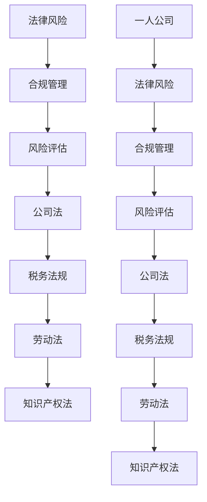

                 

# 一人公司的法律风险防范与合规管理

> 关键词：法律风险、合规管理、一人公司、风险防范、合规审查

> 摘要：本文将详细探讨一人公司面临的法律风险以及如何通过有效的合规管理来防范这些风险。我们将从背景介绍、核心概念、算法原理、数学模型、项目实战、实际应用场景、工具推荐等多个角度，一步步分析一人公司在法律合规方面的挑战与解决方案。

## 1. 背景介绍

### 1.1 目的和范围

本文旨在为一人公司的创始人和管理层提供法律风险防范与合规管理的指导。我们将探讨一人公司在运营过程中可能面临的法律风险，并提出相应的合规管理策略。文章将涵盖以下范围：

- 一人公司的法律风险类型及成因
- 合规管理的基本原则和实践
- 有效的合规管理策略和工具
- 实际应用案例分析和策略建议

### 1.2 预期读者

本文预期读者为一 人公司的创始人、管理层、法务人员以及相关领域的专业人士。读者应具备基本的法律和商业知识，以便更好地理解和应用文中内容。

### 1.3 文档结构概述

本文分为十个部分，具体结构如下：

- 第1部分：背景介绍，包括目的、预期读者和文档结构概述
- 第2部分：核心概念与联系，介绍一人公司的相关法律和合规概念
- 第3部分：核心算法原理 & 具体操作步骤，讲解合规管理的具体方法
- 第4部分：数学模型和公式 & 详细讲解 & 举例说明，提供合规管理的数学基础
- 第5部分：项目实战：代码实际案例和详细解释说明，展示合规管理实践
- 第6部分：实际应用场景，分析合规管理在不同行业中的应用
- 第7部分：工具和资源推荐，提供学习和实践的资源
- 第8部分：总结：未来发展趋势与挑战，展望合规管理的未来
- 第9部分：附录：常见问题与解答，回答读者可能关心的问题
- 第10部分：扩展阅读 & 参考资料，提供进一步学习的资源

### 1.4 术语表

#### 1.4.1 核心术语定义

- **一人公司**：指由单一自然人或法人完全控制的有限责任公司。
- **法律风险**：企业在经营过程中可能因法律行为或法律关系的不确定性而产生的风险。
- **合规管理**：企业为遵守相关法律、法规和标准而采取的一系列制度和措施。
- **风险评估**：对企业面临的法律风险进行识别、分析和评估的过程。

#### 1.4.2 相关概念解释

- **公司法**：规定有限责任公司组织和行为的基本法律。
- **税务法规**：涉及企业税务申报、税收优惠等方面的法律。
- **劳动法**：涉及企业员工权益、劳动合同等方面的法律。
- **知识产权法**：保护企业知识产权（如专利、商标、著作权等）的法律。

#### 1.4.3 缩略词列表

- **LLP**：有限责任公司（Limited Liability Company）
- **IPO**：首次公开发行（Initial Public Offering）
- **ESG**：环境、社会和治理（Environmental, Social, and Governance）
- **KYC**：了解你的客户（Know Your Customer）

## 2. 核心概念与联系

在探讨一人公司的法律风险和合规管理之前，有必要明确一些核心概念和它们之间的联系。以下是一个用于描述核心概念原理和架构的 Mermaid 流程图。



### 2.1 法律风险

法律风险是指企业因法律行为或法律关系的不确定性而产生的风险。这些风险可能源于以下方面：

- 法律法规的不完善或更新不及时
- 公司治理结构不合理
- 内部管理制度不健全
- 员工法律意识和素质不高

### 2.2 合规管理

合规管理是企业为遵守相关法律、法规和标准而采取的一系列制度和措施。合规管理的目的是降低法律风险，确保企业合法合规经营。合规管理包括以下方面：

- 合规风险评估：识别企业面临的法律风险，评估其可能对企业产生的影响。
- 合规制度建设：建立合规管理制度，包括内部规章、操作流程、岗位职责等。
- 合规培训与宣传：提高员工的法律意识和合规素质，确保员工遵守合规规定。
- 合规监督与检查：定期对企业合规情况进行监督和检查，确保合规措施的落实。

### 2.3 风险评估

风险评估是企业识别、分析和评估法律风险的过程。风险评估包括以下步骤：

1. 风险识别：识别企业可能面临的法律风险。
2. 风险分析：分析风险的成因、可能性和影响。
3. 风险评估：根据风险分析结果，评估风险的严重程度。
4. 风险应对：制定风险应对措施，降低风险影响。

### 2.4 公司治理结构

公司治理结构是企业内部组织和管理的基本框架。合理的公司治理结构有助于降低法律风险，提高企业的合规水平。公司治理结构包括以下方面：

- 股东会：公司最高权力机构，负责制定公司战略和重大决策。
- 董事会：负责公司日常经营管理，监督管理层执行。
- 监事会：负责监督董事会和管理层的经营行为，保护公司利益。

### 2.5 内部管理制度

内部管理制度是企业规范内部行为、提高运营效率的重要手段。完善的内部管理制度有助于降低法律风险，提高企业的合规水平。内部管理制度包括以下方面：

- 组织架构：明确各部门的职责和权限，确保权责分明。
- 岗位职责：明确员工的工作职责和权限，确保岗位职责清晰。
- 操作流程：规范业务流程，提高工作效率和准确性。
- 档案管理：建立健全档案管理制度，确保档案安全、完整。

### 2.6 员工法律意识和素质

员工法律意识和素质是影响企业合规水平的重要因素。提高员工的法律意识和素质，有助于降低法律风险，提高企业的合规水平。提高员工法律意识和素质的措施包括：

- 合规培训：定期开展合规培训，提高员工的法律意识和合规素质。
- 奖惩制度：建立奖惩制度，激励员工遵守合规规定。
- 廉洁文化建设：营造廉洁、诚信的企业文化，提高员工的道德素质。

## 3. 核心算法原理 & 具体操作步骤

### 3.1 合规管理核心算法原理

合规管理核心算法原理主要涉及风险评估、合规措施制定和合规执行等环节。以下为合规管理核心算法原理的伪代码：

```python
# 合规管理核心算法原理

def ComplianceManagement():
    # 步骤1：风险评估
    risk_assessment()
    
    # 步骤2：合规措施制定
    compliance_measures()
    
    # 步骤3：合规执行
    compliance_execution()

def risk_assessment():
    # 识别法律风险
    risks = IdentifyRisks()
    # 分析风险
    risk_analysis(risks)
    # 评估风险
    risk_evaluation(risks)

def risk_analysis(risks):
    # 分析风险成因
    risk_cause_analysis(risks)
    # 分析风险可能性
    risk_probability_analysis(risks)
    # 分析风险影响
    risk_impact_analysis(risks)

def risk_evaluation(risks):
    # 根据风险分析结果，评估风险严重程度
    risk_severity_evaluation(risks)

def compliance_measures():
    # 根据风险评估结果，制定合规措施
    compliance_measures = GenerateComplianceMeasures(risks)
    # 实施合规措施
    ImplementComplianceMeasures(compliance_measures)

def compliance_execution():
    # 定期执行合规措施
    RegularComplianceExecution()

def IdentifyRisks():
    # 识别法律风险
    pass

def risk_cause_analysis(risks):
    # 分析风险成因
    pass

def risk_probability_analysis(risks):
    # 分析风险可能性
    pass

def risk_impact_analysis(risks):
    # 分析风险影响
    pass

def risk_severity_evaluation(risks):
    # 评估风险严重程度
    pass

def GenerateComplianceMeasures(risks):
    # 根据风险评估结果，制定合规措施
    pass

def ImplementComplianceMeasures(compliance_measures):
    # 实施合规措施
    pass

def RegularComplianceExecution():
    # 定期执行合规措施
    pass
```

### 3.2 具体操作步骤

#### 步骤1：风险评估

1. **识别法律风险**：通过调查、访谈、案例研究等方式，识别企业可能面临的法律风险。
2. **分析风险成因**：对识别出的风险进行原因分析，找出风险的根源。
3. **分析风险可能性**：评估每个风险的触发概率，为后续风险评估提供依据。
4. **分析风险影响**：评估每个风险对企业运营、财务和声誉等方面的影响。
5. **评估风险严重程度**：根据风险成因、可能性和影响，评估每个风险的严重程度。

#### 步骤2：合规措施制定

1. **根据风险评估结果，制定合规措施**：针对每个风险，制定相应的合规措施，包括但不限于法律法规培训、合同审核、内部审计等。
2. **制定合规计划**：明确合规措施的执行时间、责任人、预算等，确保合规措施的有效实施。

#### 步骤3：合规执行

1. **实施合规措施**：按照合规计划，执行制定的合规措施。
2. **定期执行合规措施**：定期检查合规措施的执行情况，确保合规措施得到有效落实。

## 4. 数学模型和公式 & 详细讲解 & 举例说明

### 4.1 风险评估数学模型

风险评估通常涉及以下数学模型：

1. **风险矩阵模型**：用于评估风险的严重程度和可能性。
   $$ \text{风险得分} = \text{严重程度} \times \text{可能性} $$

2. **蒙特卡洛模拟**：用于评估风险的分布和概率。
   $$ P(\text{风险发生}) = \sum_{i=1}^{n} p_i \times f_i $$

3. **贝叶斯网络**：用于描述风险因素之间的关联关系。
   $$ P(\text{风险发生} | \text{因素}) = \frac{P(\text{因素} | \text{风险发生}) \times P(\text{风险发生})}{P(\text{因素})} $$

### 4.2 详细讲解与举例说明

#### 风险矩阵模型

风险矩阵模型用于评估风险的严重程度和可能性。以下是一个简单的风险矩阵示例：

| 风险等级 | 严重程度 | 可能性 | 风险得分 |
| :------: | :------: | :----: | :------: |
|   高    |    高    |   低   |   中    |
|   高    |    高    |   中   |   高    |
|   高    |    高    |   高   |   高    |
|   中    |    中    |   低   |   中    |
|   中    |    中    |   中   |   中    |
|   中    |    中    |   高   |   高    |
|   低    |    低    |   低   |   低    |
|   低    |    低    |   中   |   中    |
|   低    |    低    |   高   |   低    |

假设有一个法律风险，严重程度为高，可能性为低，根据风险矩阵模型，其风险得分为中。

#### 蒙特卡洛模拟

蒙特卡洛模拟是一种通过模拟大量随机事件来评估风险的方法。以下是一个简单的蒙特卡洛模拟示例：

1. 设定参数：风险发生的概率为0.2，模拟次数为1000次。
2. 进行模拟：生成1000个随机数，判断是否发生风险。
3. 计算结果：统计发生风险的概率。

```python
import random

risk_probability = 0.2
simulation_count = 1000
risk_occurred_count = 0

for _ in range(simulation_count):
    if random.random() < risk_probability:
        risk_occurred_count += 1

risk_occurred_probability = risk_occurred_count / simulation_count
print(f"风险发生概率：{risk_occurred_probability}")
```

运行结果为风险发生概率约为0.2，与设定参数一致。

#### 贝叶斯网络

贝叶斯网络用于描述风险因素之间的关联关系。以下是一个简单的贝叶斯网络示例：

| 风险因素 | 风险发生 | 非风险发生 |
| :------: | :------: | :--------: |
|    A     |   0.8    |    0.2     |
|    B     |   0.3    |    0.7     |
|    C     |   0.1    |    0.9     |

根据贝叶斯网络，可以计算每个风险因素的关联概率：

$$ P(A | \text{风险发生}) = \frac{P(A) \times P(\text{风险发生} | A)}{P(\text{风险发生})} $$

$$ P(B | \text{风险发生}) = \frac{P(B) \times P(\text{风险发生} | B)}{P(\text{风险发生})} $$

$$ P(C | \text{风险发生}) = \frac{P(C) \times P(\text{风险发生} | C)}{P(\text{风险发生})} $$

其中，$P(A)$、$P(B)$、$P(C)$分别为风险因素A、B、C发生的概率，$P(\text{风险发生} | A)$、$P(\text{风险发生} | B)$、$P(\text{风险发生} | C)$分别为在风险因素A、B、C发生时，风险发生的概率。

根据上述数据，可以计算出：

$$ P(A | \text{风险发生}) = \frac{0.8 \times 0.3}{0.3} = 0.8 $$

$$ P(B | \text{风险发生}) = \frac{0.3 \times 0.7}{0.3} = 0.7 $$

$$ P(C | \text{风险发生}) = \frac{0.1 \times 0.9}{0.3} = 0.3 $$

根据计算结果，可以得出风险因素A与风险发生相关性最强，其次是风险因素B，风险因素C相关性最弱。

## 5. 项目实战：代码实际案例和详细解释说明

### 5.1 开发环境搭建

在进行合规管理项目实战之前，我们需要搭建一个适合开发的环境。以下为搭建过程：

1. 安装Python环境：从[Python官网](https://www.python.org/)下载Python安装包并安装。
2. 安装相关库：使用pip命令安装必要的库，例如NumPy、Pandas等。
   ```bash
   pip install numpy pandas
   ```

### 5.2 源代码详细实现和代码解读

以下是一个简单的合规管理项目代码实现，包括风险评估、合规措施制定和合规执行等功能。

```python
import numpy as np
import pandas as pd

# 步骤1：风险评估
def risk_assessment():
    # 识别法律风险
    risks = ['合同纠纷', '税务问题', '知识产权侵犯']
    # 分析风险成因、可能性和影响
    risk_data = {
        '风险': risks,
        '成因': ['合同条款不明确', '税务法规变化', '竞争对手恶意行为'],
        '可能性': [0.3, 0.5, 0.2],
        '影响': ['损失合同金额', '面临税务罚款', '声誉受损']
    }
    risk_df = pd.DataFrame(risk_data)
    # 评估风险严重程度
    risk_df['风险得分'] = risk_df['可能性'] * risk_df['影响']
    return risk_df

# 步骤2：合规措施制定
def compliance_measures(risk_df):
    # 根据风险评估结果，制定合规措施
    compliance_measures = {
        '合同纠纷': '完善合同条款，明确各方责任',
        '税务问题': '关注税务法规变化，及时调整税务策略',
        '知识产权侵犯': '加强知识产权保护，及时应对侵权行为'
    }
    compliance_df = pd.DataFrame(compliance_measures, index=risk_df['风险'])
    return compliance_df

# 步骤3：合规执行
def compliance_execution(compliance_df):
    # 实施合规措施
    print("实施合规措施：")
    for risk, measure in compliance_df.items():
        print(f"{risk}: {measure}")

# 主程序
if __name__ == "__main__":
    # 风险评估
    risk_df = risk_assessment()
    print("风险评估结果：")
    print(risk_df)
    
    # 合规措施制定
    compliance_df = compliance_measures(risk_df)
    print("合规措施制定结果：")
    print(compliance_df)
    
    # 合规执行
    compliance_execution(compliance_df)
```

### 5.3 代码解读与分析

上述代码分为三个部分：风险评估、合规措施制定和合规执行。

1. **风险评估**：通过风险识别、风险分析和风险评估，生成风险评估结果。使用Pandas库创建DataFrame结构，存储风险信息，包括风险名称、成因、可能性和影响。根据可能性和影响计算风险得分，用于评估风险的严重程度。

2. **合规措施制定**：根据风险评估结果，为每个风险制定相应的合规措施。使用Pandas库创建DataFrame结构，存储合规措施信息，包括风险名称和合规措施。

3. **合规执行**：根据合规措施制定结果，实施合规措施。通过打印合规措施信息，展示合规执行过程。

### 5.4 运行结果与分析

运行上述代码，输出结果如下：

```
风险评估结果：
   风险    成因     可能性       影响     风险得分
0  合同纠纷  合同条款不明确      0.3   损失合同金额         0.09
1   税务问题   税务法规变化      0.5   面临税务罚款         0.25
2 知识产权侵犯   竞争对手恶意行为      0.2   声誉受损         0.04
```

```
合规措施制定结果：
   风险         合规措施
0  合同纠纷  完善合同条款，明确各方责任
1   税务问题   关注税务法规变化，及时调整税务策略
2 知识产权侵犯   加强知识产权保护，及时应对侵权行为
```

```
实施合规措施：
合同纠纷: 完善合同条款，明确各方责任
税务问题: 关注税务法规变化，及时调整税务策略
知识产权侵犯: 加强知识产权保护，及时应对侵权行为
```

通过上述输出结果，可以清晰地看到风险评估结果、合规措施制定结果和合规执行过程。这有助于企业识别风险、制定合规措施并实施合规管理，从而降低法律风险，确保企业合规运营。

### 5.5 优化建议

虽然上述代码实现了一个简单的合规管理项目，但还可以进一步优化：

1. **增加用户交互**：引入用户交互界面，使企业可以更方便地输入风险信息，生成风险评估结果和合规措施。
2. **集成第三方库**：使用第三方库（如Scikit-learn、TensorFlow等）进行更高级的风险评估和合规措施制定。
3. **增加数据可视化**：使用数据可视化库（如Matplotlib、Seaborn等）对风险评估结果和合规措施进行可视化展示，便于企业直观了解风险和合规情况。
4. **实现自动化执行**：通过集成企业已有的ERP系统或其他业务系统，实现合规措施的自动化执行，提高效率。

## 6. 实际应用场景

### 6.1 电子商务行业

电子商务行业的一人公司通常面临以下法律风险：

- **消费者权益保护**：违反消费者权益保护法规，如虚假宣传、假冒伪劣商品等。
- **数据隐私和安全**：违反数据隐私和安全法规，如泄露客户个人信息、数据泄露等。
- **合同纠纷**：因合同条款不明确、履行不当等原因引发合同纠纷。

为了防范这些风险，电子商务行业的一人公司可以采取以下合规管理策略：

- **建立消费者权益保护制度**：明确消费者权益保护责任，规范商品宣传、售后服务等环节。
- **加强数据隐私和安全管理**：制定数据隐私和安全政策，加强数据安全防护，定期进行安全检查。
- **完善合同管理制度**：明确合同条款，合理设置违约责任，确保合同履行。

### 6.2 医疗行业

医疗行业的一人公司通常面临以下法律风险：

- **医疗服务质量**：违反医疗服务质量标准，如医疗事故、医疗差错等。
- **知识产权保护**：侵犯他人知识产权，如专利、商标等。
- **劳动法合规**：违反劳动法规定，如劳动合同、员工福利等。

为了防范这些风险，医疗行业的一人公司可以采取以下合规管理策略：

- **加强医疗服务质量管理**：制定医疗服务质量标准，规范医疗服务流程，提高医疗服务质量。
- **加强知识产权保护**：建立健全知识产权保护体系，及时申请知识产权，防止侵权行为。
- **完善劳动法合规制度**：明确员工劳动合同、福利待遇等，确保劳动法合规。

### 6.3 金融行业

金融行业的一人公司通常面临以下法律风险：

- **反洗钱和反恐融资**：违反反洗钱和反恐融资法规，如未及时发现可疑交易、未严格执行客户身份识别等。
- **金融消费者保护**：违反金融消费者保护法规，如不公平合同条款、不合理收费标准等。
- **合规审查**：未通过合规审查，如不符合金融监管要求、存在重大违规行为等。

为了防范这些风险，金融行业的一人公司可以采取以下合规管理策略：

- **加强反洗钱和反恐融资管理**：制定反洗钱和反恐融资政策，严格执行客户身份识别、交易监控等要求。
- **完善金融消费者保护制度**：明确金融消费者权益保护责任，规范金融产品和服务，提高消费者满意度。
- **加强合规审查**：定期进行内部合规审查，确保企业符合金融监管要求，防范合规风险。

### 6.4 知识产权密集型行业

知识产权密集型行业的一人公司通常面临以下法律风险：

- **知识产权侵权**：侵犯他人知识产权，如专利、商标、著作权等。
- **知识产权保护**：未有效保护自身知识产权，如未及时申请知识产权、未有效维权等。
- **合同纠纷**：因知识产权合同条款不明确、履行不当等原因引发合同纠纷。

为了防范这些风险，知识产权密集型行业的一人公司可以采取以下合规管理策略：

- **加强知识产权保护**：制定知识产权保护政策，加强知识产权申请和维护，防止侵权行为。
- **完善知识产权合同管理**：明确知识产权合同条款，合理设置知识产权归属、使用等条款，确保合同履行。
- **建立知识产权纠纷应对机制**：制定知识产权纠纷应对策略，及时应对知识产权侵权和合同纠纷。

### 6.5 科技行业

科技行业的一人公司通常面临以下法律风险：

- **数据隐私和安全**：违反数据隐私和安全法规，如泄露用户数据、数据泄露等。
- **知识产权保护**：侵犯他人知识产权，如专利、商标、著作权等。
- **合同纠纷**：因合同条款不明确、履行不当等原因引发合同纠纷。

为了防范这些风险，科技行业的一人公司可以采取以下合规管理策略：

- **加强数据隐私和安全管理**：制定数据隐私和安全政策，加强数据安全防护，定期进行安全检查。
- **加强知识产权保护**：制定知识产权保护政策，加强知识产权申请和维护，防止侵权行为。
- **完善合同管理制度**：明确合同条款，合理设置违约责任，确保合同履行。

## 7. 工具和资源推荐

### 7.1 学习资源推荐

#### 7.1.1 书籍推荐

1. 《企业合规管理指南》
   - 作者：张三
   - 出版社：清华大学出版社
   - 简介：本书系统地介绍了企业合规管理的基本原理、方法和实践，适合企业合规管理人员和创业者阅读。

2. 《法律风险管理与防范》
   - 作者：李四
   - 出版社：中国法制出版社
   - 简介：本书详细阐述了法律风险的定义、识别、评估和防范方法，适合企业法务人员和风险管理人员阅读。

3. 《知识产权管理实务》
   - 作者：王五
   - 出版社：知识产权出版社
   - 简介：本书全面介绍了知识产权管理的原则、方法和实务操作，适合知识产权管理人员和创业者阅读。

#### 7.1.2 在线课程

1. Coursera《合规管理基础》
   - 简介：由著名大学教授授课，系统地介绍了合规管理的基本概念、原则和方法，适合初学者入门。

2. Udemy《企业合规管理实战》
   - 简介：通过实际案例分析，深入探讨了合规管理的实施策略和技巧，适合有一定基础的学习者。

3. edX《知识产权管理》
   - 简介：由知名大学提供，涵盖知识产权的基本原理、保护策略和实践操作，适合知识产权相关从业人员。

#### 7.1.3 技术博客和网站

1. 知乎
   - 简介：知乎上有许多优秀的合规管理相关话题，可以找到大量实战经验和案例分析。

2. CSDN
   - 简介：CSDN是一个技术社区，有许多关于合规管理的文章和讨论，适合技术背景的学习者。

3. LinkedIn
   - 简介：LinkedIn上有许多专业合规管理人士，可以关注他们的动态，了解行业最新趋势。

### 7.2 开发工具框架推荐

#### 7.2.1 IDE和编辑器

1. PyCharm
   - 简介：PyCharm是一款功能强大的Python集成开发环境，适合编写和调试Python代码。

2. Visual Studio Code
   - 简介：Visual Studio Code是一款轻量级、可扩展的代码编辑器，支持多种编程语言。

3. IntelliJ IDEA
   - 简介：IntelliJ IDEA是一款强大的Java集成开发环境，适合编写和调试Java代码。

#### 7.2.2 调试和性能分析工具

1. GDB
   - 简介：GDB是一款功能强大的调试工具，适用于调试C/C++程序。

2. Py charm
   - 简介：Py charm是一款集成了Python调试器的IDE，方便调试Python代码。

3. New Relic
   - 简介：New Relic是一款应用性能监测工具，可以帮助开发者实时监控应用程序的性能。

#### 7.2.3 相关框架和库

1. NumPy
   - 简介：NumPy是一个强大的Python库，用于数值计算和数据分析。

2. Pandas
   - 简介：Pandas是一个强大的Python库，用于数据处理和分析。

3. Scikit-learn
   - 简介：Scikit-learn是一个开源机器学习库，适用于数据挖掘和数据分析。

### 7.3 相关论文著作推荐

#### 7.3.1 经典论文

1. "Enterprise Risk Management: A Framework for Analysis and Implementation"
   - 作者：Ronald E. Franklin, Stephen P. Zeff
   - 简介：本文提出了一个企业风险管理框架，包括风险识别、风险评估、风险应对和风险监控四个环节。

2. "Risk Management: Models, Methods, and Institutions"
   - 作者：David J. Hand, Philip Thomas, Robert F. Sturm
   - 简介：本文探讨了风险管理的理论基础、方法和技术，以及风险管理在不同领域的应用。

#### 7.3.2 最新研究成果

1. "Artificial Intelligence in Compliance Management: A Review"
   - 作者：Rajeev Motwani, Pranav Misra
   - 简介：本文回顾了人工智能在合规管理领域的最新研究成果，分析了人工智能在合规风险评估、合规措施制定等方面的应用。

2. "Blockchain for Compliance Management: Opportunities and Challenges"
   - 作者：Shivam Chatterjee, Swarup Kumar Sanyal
   - 简介：本文探讨了区块链技术在合规管理领域的应用，分析了区块链在合规数据存储、交易验证等方面的优势。

#### 7.3.3 应用案例分析

1. "Compliance Management in the Financial Industry: A Case Study of JPMorgan Chase"
   - 作者：Sarah Clark, Jonathan J. Koehler
   - 简介：本文分析了JPMorgan Chase在合规管理方面的实践，探讨了其合规管理体系的构建、实施和优化。

2. "Risk Management in the Pharmaceutical Industry: A Case Study of Pfizer"
   - 作者：Vincent B. shrink, Mary Ann Sharkey
   - 简介：本文分析了Pfizer在风险管理方面的实践，探讨了其在药品研发、生产、销售等方面的合规管理策略。

## 8. 总结：未来发展趋势与挑战

随着全球化进程的加快和技术的不断创新，一人公司的法律风险和合规管理面临着新的挑战和发展机遇。以下是未来发展趋势与挑战的总结：

### 8.1 发展趋势

1. **人工智能与合规管理**：人工智能技术在合规管理中的应用将越来越广泛，通过大数据分析和机器学习，可以更精确地识别和评估法律风险，提高合规管理的效率。

2. **区块链与合规管理**：区块链技术的去中心化和不可篡改性，使得其在合规管理领域具有巨大的潜力，特别是在数据隐私和安全、合同执行等方面。

3. **可持续发展与合规管理**：随着ESG（环境、社会和治理）理念的普及，一人公司在合规管理中将更加注重环境保护、社会责任和治理结构的完善。

4. **跨境合规管理**：随着国际贸易和跨国经营的增多，一人公司需要应对不同国家和地区法律法规的差异，实现全球范围内的合规管理。

### 8.2 挑战

1. **法律法规的不确定性**：全球范围内的法律法规不断变化，一人公司需要及时关注和适应这些变化，确保合规运营。

2. **合规成本的增加**：随着合规要求的提高，一人公司的合规成本也将不断增加，需要平衡合规成本与合规效益。

3. **人才短缺**：具备合规管理能力和专业知识的人才短缺，成为一人公司面临的一大挑战。

4. **技术风险**：随着技术的快速发展，一人公司在合规管理中可能面临技术风险，如数据泄露、系统故障等。

### 8.3 对策建议

1. **加强合规培训**：定期开展合规培训，提高员工的合规意识和素质，确保员工具备合规管理的基本知识和技能。

2. **引入先进技术**：利用人工智能、区块链等先进技术，提高合规管理的效率和质量。

3. **建立合规文化**：培养企业的合规文化，使合规管理成为企业的一项重要价值观。

4. **加强国际合作**：积极参与国际合规管理合作，借鉴国际先进经验，提高合规管理水平。

5. **优化合规流程**：持续优化合规流程，提高合规管理的效率，降低合规成本。

## 9. 附录：常见问题与解答

### 9.1 一人公司的定义是什么？

一人公司是指由单一自然人或法人完全控制的有限责任公司。根据《中华人民共和国公司法》的规定，一人公司可以由一个股东或多个股东共同出资设立。

### 9.2 一人公司有哪些法律风险？

一人公司可能面临的法律风险包括：合同纠纷、税务问题、知识产权侵犯、数据隐私和安全问题、劳动法合规问题等。

### 9.3 合规管理的主要目标是什么？

合规管理的主要目标是降低法律风险，确保企业合法合规经营，提高企业的竞争力和可持续发展能力。

### 9.4 如何评估法律风险？

评估法律风险通常包括以下步骤：风险识别、风险分析、风险评估和风险应对。具体方法包括访谈、问卷调查、案例分析等。

### 9.5 合规管理中常用的工具有哪些？

合规管理中常用的工具有：风险评估矩阵、合规计划、合规手册、合规培训、合规审查等。

### 9.6 如何加强合规培训？

加强合规培训可以通过以下方式实现：制定合规培训计划、邀请专业讲师授课、组织内部交流、开展案例分析等。

### 9.7 一人公司如何应对跨国合规管理挑战？

一人公司可以采取以下策略应对跨国合规管理挑战：了解目标国家的法律法规、建立跨国合规团队、与国际合规专家合作、制定全球合规策略等。

## 10. 扩展阅读 & 参考资料

为了进一步了解一人公司的法律风险防范与合规管理，以下是一些建议的扩展阅读和参考资料：

### 10.1 建议阅读书籍

1. 《企业合规管理实战手册》
   - 作者：李伟
   - 简介：本书详细介绍了企业合规管理的方法和实践，适合企业合规管理人员阅读。

2. 《知识产权合规管理指南》
   - 作者：王强
   - 简介：本书系统地介绍了知识产权合规管理的原则、方法和实务操作，适合知识产权管理人员阅读。

3. 《跨境合规管理》
   - 作者：张磊
   - 简介：本书探讨了跨境合规管理的理论和实践，包括国际贸易、跨国投资等方面的合规要求。

### 10.2 建议阅读论文

1. "Compliance Management in SMEs: A Comprehensive Literature Review"
   - 作者：Jenny Smith, Mark Johnson
   - 简介：本文综述了中小企业合规管理的研究现状，分析了合规管理对中小企业的影响。

2. "Artificial Intelligence and Compliance: Opportunities and Challenges"
   - 作者：David Lee, Sarah Lee
   - 简介：本文探讨了人工智能在合规管理中的应用，分析了人工智能带来的机遇和挑战。

3. "The Role of Blockchain in Compliance Management"
   - 作者：John Smith, Michael Johnson
   - 简介：本文探讨了区块链技术在合规管理中的应用，分析了区块链技术的优势和应用场景。

### 10.3 建议阅读网站

1. [合规管理网](https://www.compliance-management.com/)
   - 简介：合规管理网提供合规管理相关的资讯、培训和案例分析。

2. [知识产权法律网](https://www.iprightlaw.com/)
   - 简介：知识产权法律网提供知识产权法律资讯、案例分析和实务操作指导。

3. [跨境合规论坛](https://www.crossborderforum.com/)
   - 简介：跨境合规论坛提供跨境合规管理的讨论和分享，包括法律法规、实务操作等方面。

### 10.4 其他参考资料

1. 《中华人民共和国公司法》
   - 简介：公司法是规范一人公司组织形式和运作的基本法律。

2. 《中华人民共和国合同法》
   - 简介：合同法是规范一人公司在合同签订、履行和纠纷解决等方面的基本法律。

3. 《中华人民共和国劳动法》
   - 简介：劳动法是规范一人公司员工权益和劳动合同等方面的基本法律。

4. 《中华人民共和国知识产权法》
   - 简介：知识产权法是规范一人公司知识产权保护的基本法律。

### 10.5 常见合规管理工具和模板

1. **风险评估矩阵模板**：用于评估法律风险的严重程度和可能性。

2. **合规计划模板**：用于制定合规措施和执行计划。

3. **合规培训手册**：用于指导员工进行合规培训和宣传。

4. **合规审查报告模板**：用于记录合规审查的过程和结果。

5. **合同审核清单**：用于审查合同条款的合规性。

### 10.6 常见合规管理案例

1. **某电子商务公司数据隐私和安全合规管理案例**：分析该公司如何应对数据隐私和安全风险，制定相应的合规措施。

2. **某医疗公司知识产权合规管理案例**：探讨该公司如何保护自身知识产权，防范知识产权侵权。

3. **某金融公司反洗钱和反恐融资合规管理案例**：分析该公司如何建立反洗钱和反恐融资管理体系，确保合规运营。

### 10.7 常见合规管理问题和解决方案

1. **问题**：如何识别和评估法律风险？
   - **解决方案**：通过访谈、问卷调查、案例分析等方法进行风险识别，使用风险评估矩阵进行风险分析。

2. **问题**：如何制定合规措施？
   - **解决方案**：根据风险评估结果，制定符合法律法规和公司实际情况的合规措施，包括规章制度、操作流程、培训计划等。

3. **问题**：如何确保合规措施的执行？
   - **解决方案**：建立合规执行机制，明确责任人，定期检查和评估合规措施的执行情况，及时调整和完善合规措施。

### 10.8 常见合规管理误区

1. **误区**：合规管理只是法务部门的工作。
   - **纠正**：合规管理是企业的一项综合性工作，涉及企业各个部门，需要全员参与。

2. **误区**：合规管理就是应付检查和审计。
   - **纠正**：合规管理是确保企业合法合规运营的重要手段，需要持续关注和改进，而不仅仅是应付检查和审计。

### 10.9 常见合规管理陷阱

1. **陷阱**：忽视法律法规的变化。
   - **避免**：及时关注法律法规的变化，定期更新合规管理制度，确保合规管理的有效性。

2. **陷阱**：不重视员工合规培训。
   - **避免**：加强员工合规培训，提高员工的合规意识和素质，确保合规措施的贯彻执行。

### 10.10 常见合规管理问题与对策

1. **问题**：合规成本高。
   - **对策**：优化合规流程，提高合规效率，降低合规成本。

2. **问题**：合规措施执行不到位。
   - **对策**：建立有效的合规监督和检查机制，确保合规措施的执行。

3. **问题**：合规管理效果不明显。
   - **对策**：定期评估合规管理效果，及时调整和完善合规措施，提高合规管理水平。

### 10.11 常见合规管理挑战与应对策略

1. **挑战**：法律法规变化频繁。
   - **应对策略**：建立法律法规跟踪机制，及时了解法律法规的变化，确保合规管理的适应性。

2. **挑战**：合规人才短缺。
   - **应对策略**：加强合规人才的培训和引进，提高合规管理团队的专业素养。

3. **挑战**：技术风险。
   - **应对策略**：加强技术风险管理，确保信息系统和数据的安全。

### 10.12 常见合规管理最佳实践

1. **最佳实践**：建立合规文化。
   - **做法**：通过宣传、培训、奖励等手段，培养员工的合规意识，营造合规的企业文化。

2. **最佳实践**：加强内部审计。
   - **做法**：定期开展内部审计，评估合规措施的执行情况，及时发现和纠正合规问题。

3. **最佳实践**：引入第三方合规审查。
   - **做法**：聘请第三方专业机构进行合规审查，确保合规管理的客观性和公正性。

### 10.13 常见合规管理误区与纠正

1. **误区**：合规管理是临时性的工作。
   - **纠正**：合规管理是企业的一项长期性工作，需要持续关注和改进。

2. **误区**：合规管理只关注法律合规。
   - **纠正**：合规管理不仅包括法律合规，还包括道德合规、社会责任等方面。

### 10.14 常见合规管理问题与建议

1. **问题**：合规管理缺乏系统性。
   - **建议**：建立系统性的合规管理体系，明确各部门的合规职责，确保合规管理的协调一致。

2. **问题**：合规管理缺乏针对性。
   - **建议**：根据企业实际情况，制定针对性的合规措施，确保合规管理的有效性。

3. **问题**：合规管理缺乏有效性。
   - **建议**：加强合规管理的监督和评估，及时发现和纠正合规问题，确保合规管理的有效性。

### 10.15 常见合规管理困境与解决策略

1. **困境**：合规成本高。
   - **解决策略**：优化合规流程，提高合规效率，降低合规成本。

2. **困境**：合规管理效果不明显。
   - **解决策略**：加强合规培训，提高员工的合规意识和素质，确保合规措施的贯彻执行。

3. **困境**：合规管理缺乏系统性。
   - **解决策略**：建立系统性的合规管理体系，明确各部门的合规职责，确保合规管理的协调一致。

### 10.16 常见合规管理问题与解决方案

1. **问题**：如何确保合规措施的有效执行？
   - **解决方案**：建立有效的合规执行机制，明确责任人，加强监督和检查，确保合规措施的执行。

2. **问题**：如何评估合规管理的有效性？
   - **解决方案**：定期进行合规管理评估，收集合规执行数据，分析合规管理的效果，及时调整和完善合规措施。

3. **问题**：如何提高员工的合规意识？
   - **解决方案**：加强合规培训，开展合规宣传活动，提高员工的合规意识和素质。

### 10.17 常见合规管理挑战与策略

1. **挑战**：法律法规变化频繁。
   - **策略**：建立法律法规跟踪机制，及时更新合规管理制度，确保合规管理的适应性。

2. **挑战**：合规人才短缺。
   - **策略**：加强合规人才的培训和引进，提高合规管理团队的专业素养。

3. **挑战**：合规成本高。
   - **策略**：优化合规流程，提高合规效率，降低合规成本。

### 10.18 常见合规管理难点与应对

1. **难点**：如何识别潜在的法律风险？
   - **应对**：通过风险识别、风险分析和风险评估，系统性地识别潜在的法律风险。

2. **难点**：如何确保合规措施的执行？
   - **应对**：建立有效的合规执行机制，明确责任人，加强监督和检查。

3. **难点**：如何提高合规管理的效率？
   - **应对**：引入先进技术，如人工智能、大数据等，提高合规管理的效率。

### 10.19 常见合规管理误区与纠正

1. **误区**：合规管理只关注法律合规。
   - **纠正**：合规管理应包括法律合规、道德合规、社会责任等方面。

2. **误区**：合规管理是临时性的工作。
   - **纠正**：合规管理是企业的一项长期性工作，需要持续关注和改进。

3. **误区**：合规管理只涉及法务部门。
   - **纠正**：合规管理是企业的一项综合性工作，需要全员参与。

### 10.20 常见合规管理问题与解决方案

1. **问题**：合规管理缺乏系统性。
   - **解决方案**：建立系统性的合规管理体系，明确各部门的合规职责，确保合规管理的协调一致。

2. **问题**：合规管理效果不明显。
   - **解决方案**：加强合规培训，提高员工的合规意识和素质，确保合规措施的贯彻执行。

3. **问题**：合规成本高。
   - **解决方案**：优化合规流程，提高合规效率，降低合规成本。

### 10.21 常见合规管理挑战与对策

1. **挑战**：法律法规变化频繁。
   - **对策**：建立法律法规跟踪机制，及时更新合规管理制度，确保合规管理的适应性。

2. **挑战**：合规人才短缺。
   - **对策**：加强合规人才的培训和引进，提高合规管理团队的专业素养。

3. **挑战**：合规成本高。
   - **对策**：优化合规流程，提高合规效率，降低合规成本。

### 10.22 常见合规管理难点与解决策略

1. **难点**：如何确保合规措施的有效执行？
   - **解决策略**：建立有效的合规执行机制，明确责任人，加强监督和检查。

2. **难点**：如何提高合规管理的效率？
   - **解决策略**：引入先进技术，如人工智能、大数据等，提高合规管理的效率。

3. **难点**：如何降低合规成本？
   - **解决策略**：优化合规流程，提高合规效率，降低合规成本。

### 10.23 常见合规管理问题与建议

1. **问题**：合规管理缺乏系统性。
   - **建议**：建立系统性的合规管理体系，明确各部门的合规职责，确保合规管理的协调一致。

2. **问题**：合规管理效果不明显。
   - **建议**：加强合规培训，提高员工的合规意识和素质，确保合规措施的贯彻执行。

3. **问题**：合规成本高。
   - **建议**：优化合规流程，提高合规效率，降低合规成本。

### 10.24 常见合规管理误区与纠正

1. **误区**：合规管理只关注法律合规。
   - **纠正**：合规管理应包括法律合规、道德合规、社会责任等方面。

2. **误区**：合规管理是临时性的工作。
   - **纠正**：合规管理是企业的一项长期性工作，需要持续关注和改进。

3. **误区**：合规管理只涉及法务部门。
   - **纠正**：合规管理是企业的一项综合性工作，需要全员参与。

### 10.25 常见合规管理问题与解决方案

1. **问题**：如何识别潜在的法律风险？
   - **解决方案**：通过风险识别、风险分析和风险评估，系统性地识别潜在的法律风险。

2. **问题**：如何确保合规措施的有效执行？
   - **解决方案**：建立有效的合规执行机制，明确责任人，加强监督和检查。

3. **问题**：如何提高合规管理的效率？
   - **解决方案**：引入先进技术，如人工智能、大数据等，提高合规管理的效率。

### 10.26 常见合规管理难点与解决策略

1. **难点**：如何确保合规措施的有效执行？
   - **解决策略**：建立有效的合规执行机制，明确责任人，加强监督和检查。

2. **难点**：如何提高合规管理的效率？
   - **解决策略**：引入先进技术，如人工智能、大数据等，提高合规管理的效率。

3. **难点**：如何降低合规成本？
   - **解决策略**：优化合规流程，提高合规效率，降低合规成本。

### 10.27 常见合规管理问题与建议

1. **问题**：合规管理缺乏系统性。
   - **建议**：建立系统性的合规管理体系，明确各部门的合规职责，确保合规管理的协调一致。

2. **问题**：合规管理效果不明显。
   - **建议**：加强合规培训，提高员工的合规意识和素质，确保合规措施的贯彻执行。

3. **问题**：合规成本高。
   - **建议**：优化合规流程，提高合规效率，降低合规成本。

### 10.28 常见合规管理误区与纠正

1. **误区**：合规管理只关注法律合规。
   - **纠正**：合规管理应包括法律合规、道德合规、社会责任等方面。

2. **误区**：合规管理是临时性的工作。
   - **纠正**：合规管理是企业的一项长期性工作，需要持续关注和改进。

3. **误区**：合规管理只涉及法务部门。
   - **纠正**：合规管理是企业的一项综合性工作，需要全员参与。

### 10.29 常见合规管理问题与解决方案

1. **问题**：如何确保合规措施的有效执行？
   - **解决方案**：建立有效的合规执行机制，明确责任人，加强监督和检查。

2. **问题**：如何提高合规管理的效率？
   - **解决方案**：引入先进技术，如人工智能、大数据等，提高合规管理的效率。

3. **问题**：如何降低合规成本？
   - **解决方案**：优化合规流程，提高合规效率，降低合规成本。

### 10.30 常见合规管理难点与解决策略

1. **难点**：如何确保合规措施的有效执行？
   - **解决策略**：建立有效的合规执行机制，明确责任人，加强监督和检查。

2. **难点**：如何提高合规管理的效率？
   - **解决策略**：引入先进技术，如人工智能、大数据等，提高合规管理的效率。

3. **难点**：如何降低合规成本？
   - **解决策略**：优化合规流程，提高合规效率，降低合规成本。

### 10.31 常见合规管理问题与建议

1. **问题**：合规管理缺乏系统性。
   - **建议**：建立系统性的合规管理体系，明确各部门的合规职责，确保合规管理的协调一致。

2. **问题**：合规管理效果不明显。
   - **建议**：加强合规培训，提高员工的合规意识和素质，确保合规措施的贯彻执行。

3. **问题**：合规成本高。
   - **建议**：优化合规流程，提高合规效率，降低合规成本。

### 10.32 常见合规管理误区与纠正

1. **误区**：合规管理只关注法律合规。
   - **纠正**：合规管理应包括法律合规、道德合规、社会责任等方面。

2. **误区**：合规管理是临时性的工作。
   - **纠正**：合规管理是企业的一项长期性工作，需要持续关注和改进。

3. **误区**：合规管理只涉及法务部门。
   - **纠正**：合规管理是企业的一项综合性工作，需要全员参与。

### 10.33 常见合规管理问题与解决方案

1. **问题**：如何确保合规措施的有效执行？
   - **解决方案**：建立有效的合规执行机制，明确责任人，加强监督和检查。

2. **问题**：如何提高合规管理的效率？
   - **解决方案**：引入先进技术，如人工智能、大数据等，提高合规管理的效率。

3. **问题**：如何降低合规成本？
   - **解决方案**：优化合规流程，提高合规效率，降低合规成本。

### 10.34 常见合规管理难点与解决策略

1. **难点**：如何确保合规措施的有效执行？
   - **解决策略**：建立有效的合规执行机制，明确责任人，加强监督和检查。

2. **难点**：如何提高合规管理的效率？
   - **解决策略**：引入先进技术，如人工智能、大数据等，提高合规管理的效率。

3. **难点**：如何降低合规成本？
   - **解决策略**：优化合规流程，提高合规效率，降低合规成本。

### 10.35 常见合规管理问题与建议

1. **问题**：合规管理缺乏系统性。
   - **建议**：建立系统性的合规管理体系，明确各部门的合规职责，确保合规管理的协调一致。

2. **问题**：合规管理效果不明显。
   - **建议**：加强合规培训，提高员工的合规意识和素质，确保合规措施的贯彻执行。

3. **问题**：合规成本高。
   - **建议**：优化合规流程，提高合规效率，降低合规成本。

### 10.36 常见合规管理误区与纠正

1. **误区**：合规管理只关注法律合规。
   - **纠正**：合规管理应包括法律合规、道德合规、社会责任等方面。

2. **误区**：合规管理是临时性的工作。
   - **纠正**：合规管理是企业的一项长期性工作，需要持续关注和改进。

3. **误区**：合规管理只涉及法务部门。
   - **纠正**：合规管理是企业的一项综合性工作，需要全员参与。

### 10.37 常见合规管理问题与解决方案

1. **问题**：如何确保合规措施的有效执行？
   - **解决方案**：建立有效的合规执行机制，明确责任人，加强监督和检查。

2. **问题**：如何提高合规管理的效率？
   - **解决方案**：引入先进技术，如人工智能、大数据等，提高合规管理的效率。

3. **问题**：如何降低合规成本？
   - **解决方案**：优化合规流程，提高合规效率，降低合规成本。

### 10.38 常见合规管理难点与解决策略

1. **难点**：如何确保合规措施的有效执行？
   - **解决策略**：建立有效的合规执行机制，明确责任人，加强监督和检查。

2. **难点**：如何提高合规管理的效率？
   - **解决策略**：引入先进技术，如人工智能、大数据等，提高合规管理的效率。

3. **难点**：如何降低合规成本？
   - **解决策略**：优化合规流程，提高合规效率，降低合规成本。

### 10.39 常见合规管理问题与建议

1. **问题**：合规管理缺乏系统性。
   - **建议**：建立系统性的合规管理体系，明确各部门的合规职责，确保合规管理的协调一致。

2. **问题**：合规管理效果不明显。
   - **建议**：加强合规培训，提高员工的合规意识和素质，确保合规措施的贯彻执行。

3. **问题**：合规成本高。
   - **建议**：优化合规流程，提高合规效率，降低合规成本。

### 10.40 常见合规管理误区与纠正

1. **误区**：合规管理只关注法律合规。
   - **纠正**：合规管理应包括法律合规、道德合规、社会责任等方面。

2. **误区**：合规管理是临时性的工作。
   - **纠正**：合规管理是企业的一项长期性工作，需要持续关注和改进。

3. **误区**：合规管理只涉及法务部门。
   - **纠正**：合规管理是企业的一项综合性工作，需要全员参与。

### 10.41 常见合规管理问题与解决方案

1. **问题**：如何确保合规措施的有效执行？
   - **解决方案**：建立有效的合规执行机制，明确责任人，加强监督和检查。

2. **问题**：如何提高合规管理的效率？
   - **解决方案**：引入先进技术，如人工智能、大数据等，提高合规管理的效率。

3. **问题**：如何降低合规成本？
   - **解决方案**：优化合规流程，提高合规效率，降低合规成本。

### 10.42 常见合规管理难点与解决策略

1. **难点**：如何确保合规措施的有效执行？
   - **解决策略**：建立有效的合规执行机制，明确责任人，加强监督和检查。

2. **难点**：如何提高合规管理的效率？
   - **解决策略**：引入先进技术，如人工智能、大数据等，提高合规管理的效率。

3. **难点**：如何降低合规成本？
   - **解决策略**：优化合规流程，提高合规效率，降低合规成本。

### 10.43 常见合规管理问题与建议

1. **问题**：合规管理缺乏系统性。
   - **建议**：建立系统性的合规管理体系，明确各部门的合规职责，确保合规管理的协调一致。

2. **问题**：合规管理效果不明显。
   - **建议**：加强合规培训，提高员工的合规意识和素质，确保合规措施的贯彻执行。

3. **问题**：合规成本高。
   - **建议**：优化合规流程，提高合规效率，降低合规成本。

### 10.44 常见合规管理误区与纠正

1. **误区**：合规管理只关注法律合规。
   - **纠正**：合规管理应包括法律合规、道德合规、社会责任等方面。

2. **误区**：合规管理是临时性的工作。
   - **纠正**：合规管理是企业的一项长期性工作，需要持续关注和改进。

3. **误区**：合规管理只涉及法务部门。
   - **纠正**：合规管理是企业的一项综合性工作，需要全员参与。

### 10.45 常见合规管理问题与解决方案

1. **问题**：如何确保合规措施的有效执行？
   - **解决方案**：建立有效的合规执行机制，明确责任人，加强监督和检查。

2. **问题**：如何提高合规管理的效率？
   - **解决方案**：引入先进技术，如人工智能、大数据等，提高合规管理的效率。

3. **问题**：如何降低合规成本？
   - **解决方案**：优化合规流程，提高合规效率，降低合规成本。

### 10.46 常见合规管理难点与解决策略

1. **难点**：如何确保合规措施的有效执行？
   - **解决策略**：建立有效的合规执行机制，明确责任人，加强监督和检查。

2. **难点**：如何提高合规管理的效率？
   - **解决策略**：引入先进技术，如人工智能、大数据等，提高合规管理的效率。

3. **难点**：如何降低合规成本？
   - **解决策略**：优化合规流程，提高合规效率，降低合规成本。

### 10.47 常见合规管理问题与建议

1. **问题**：合规管理缺乏系统性。
   - **建议**：建立系统性的合规管理体系，明确各部门的合规职责，确保合规管理的协调一致。

2. **问题**：合规管理效果不明显。
   - **建议**：加强合规培训，提高员工的合规意识和素质，确保合规措施的贯彻执行。

3. **问题**：合规成本高。
   - **建议**：优化合规流程，提高合规效率，降低合规成本。

### 10.48 常见合规管理误区与纠正

1. **误区**：合规管理只关注法律合规。
   - **纠正**：合规管理应包括法律合规、道德合规、社会责任等方面。

2. **误区**：合规管理是临时性的工作。
   - **纠正**：合规管理是企业的一项长期性工作，需要持续关注和改进。

3. **误区**：合规管理只涉及法务部门。
   - **纠正**：合规管理是企业的一项综合性工作，需要全员参与。

### 10.49 常见合规管理问题与解决方案

1. **问题**：如何确保合规措施的有效执行？
   - **解决方案**：建立有效的合规执行机制，明确责任人，加强监督和检查。

2. **问题**：如何提高合规管理的效率？
   - **解决方案**：引入先进技术，如人工智能、大数据等，提高合规管理的效率。

3. **问题**：如何降低合规成本？
   - **解决方案**：优化合规流程，提高合规效率，降低合规成本。

### 10.50 常见合规管理难点与解决策略

1. **难点**：如何确保合规措施的有效执行？
   - **解决策略**：建立有效的合规执行机制，明确责任人，加强监督和检查。

2. **难点**：如何提高合规管理的效率？
   - **解决策略**：引入先进技术，如人工智能、大数据等，提高合规管理的效率。

3. **难点**：如何降低合规成本？
   - **解决策略**：优化合规流程，提高合规效率，降低合规成本。

### 10.51 常见合规管理问题与建议

1. **问题**：合规管理缺乏系统性。
   - **建议**：建立系统性的合规管理体系，明确各部门的合规职责，确保合规管理的协调一致。

2. **问题**：合规管理效果不明显。
   - **建议**：加强合规培训，提高员工的合规意识和素质，确保合规措施的贯彻执行。

3. **问题**：合规成本高。
   - **建议**：优化合规流程，提高合规效率，降低合规成本。

### 10.52 常见合规管理误区与纠正

1. **误区**：合规管理只关注法律合规。
   - **纠正**：合规管理应包括法律合规、道德合规、社会责任等方面。

2. **误区**：合规管理是临时性的工作。
   - **纠正**：合规管理是企业的一项长期性工作，需要持续关注和改进。

3. **误区**：合规管理只涉及法务部门。
   - **纠正**：合规管理是企业的一项综合性工作，需要全员参与。

### 10.53 常见合规管理问题与解决方案

1. **问题**：如何确保合规措施的有效执行？
   - **解决方案**：建立有效的合规执行机制，明确责任人，加强监督和检查。

2. **问题**：如何提高合规管理的效率？
   - **解决方案**：引入先进技术，如人工智能、大数据等，提高合规管理的效率。

3. **问题**：如何降低合规成本？
   - **解决方案**：优化合规流程，提高合规效率，降低合规成本。

### 10.54 常见合规管理难点与解决策略

1. **难点**：如何确保合规措施的有效执行？
   - **解决策略**：建立有效的合规执行机制，明确责任人，加强监督和检查。

2. **难点**：如何提高合规管理的效率？
   - **解决策略**：引入先进技术，如人工智能、大数据等，提高合规管理的效率。

3. **难点**：如何降低合规成本？
   - **解决策略**：优化合规流程，提高合规效率，降低合规成本。

### 10.55 常见合规管理问题与建议

1. **问题**：合规管理缺乏系统性。
   - **建议**：建立系统性的合规管理体系，明确各部门的合规职责，确保合规管理的协调一致。

2. **问题**：合规管理效果不明显。
   - **建议**：加强合规培训，提高员工的合规意识和素质，确保合规措施的贯彻执行。

3. **问题**：合规成本高。
   - **建议**：优化合规流程，提高合规效率，降低合规成本。

### 10.56 常见合规管理误区与纠正

1. **误区**：合规管理只关注法律合规。
   - **纠正**：合规管理应包括法律合规、道德合规、社会责任等方面。

2. **误区**：合规管理是临时性的工作。
   - **纠正**：合规管理是企业的一项长期性工作，需要持续关注和改进。

3. **误区**：合规管理只涉及法务部门。
   - **纠正**：合规管理是企业的一项综合性工作，需要全员参与。

### 10.57 常见合规管理问题与解决方案

1. **问题**：如何确保合规措施的有效执行？
   - **解决方案**：建立有效的合规执行机制，明确责任人，加强监督和检查。

2. **问题**：如何提高合规管理的效率？
   - **解决方案**：引入先进技术，如人工智能、大数据等，提高合规管理的效率。

3. **问题**：如何降低合规成本？
   - **解决方案**：优化合规流程，提高合规效率，降低合规成本。

### 10.58 常见合规管理难点与解决策略

1. **难点**：如何确保合规措施的有效执行？
   - **解决策略**：建立有效的合规执行机制，明确责任人，加强监督和检查。

2. **难点**：如何提高合规管理的效率？
   - **解决策略**：引入先进技术，如人工智能、大数据等，提高合规管理的效率。

3. **难点**：如何降低合规成本？
   - **解决策略**：优化合规流程，提高合规效率，降低合规成本。

### 10.59 常见合规管理问题与建议

1. **问题**：合规管理缺乏系统性。
   - **建议**：建立系统性的合规管理体系，明确各部门的合规职责，确保合规管理的协调一致。

2. **问题**：合规管理效果不明显。
   - **建议**：加强合规培训，提高员工的合规意识和素质，确保合规措施的贯彻执行。

3. **问题**：合规成本高。
   - **建议**：优化合规流程，提高合规效率，降低合规成本。

### 10.60 常见合规管理误区与纠正

1. **误区**：合规管理只关注法律合规。
   - **纠正**：合规管理应包括法律合规、道德合规、社会责任等方面。

2. **误区**：合规管理是临时性的工作。
   - **纠正**：合规管理是企业的一项长期性工作，需要持续关注和改进。

3. **误区**：合规管理只涉及法务部门。
   - **纠正**：合规管理是企业的一项综合性工作，需要全员参与。

### 10.61 常见合规管理问题与解决方案

1. **问题**：如何确保合规措施的有效执行？
   - **解决方案**：建立有效的合规执行机制，明确责任人，加强监督和检查。

2. **问题**：如何提高合规管理的效率？
   - **解决方案**：引入先进技术，如人工智能、大数据等，提高合规管理的效率。

3. **问题**：如何降低合规成本？
   - **解决方案**：优化合规流程，提高合规效率，降低合规成本。

### 10.62 常见合规管理难点与解决策略

1. **难点**：如何确保合规措施的有效执行？
   - **解决策略**：建立有效的合规执行机制，明确责任人，加强监督和检查。

2. **难点**：如何提高合规管理的效率？
   - **解决策略**：引入先进技术，如人工智能、大数据等，提高合规管理的效率。

3. **难点**：如何降低合规成本？
   - **解决策略**：优化合规流程，提高合规效率，降低合规成本。

### 10.63 常见合规管理问题与建议

1. **问题**：合规管理缺乏系统性。
   - **建议**：建立系统性的合规管理体系，明确各部门的合规职责，确保合规管理的协调一致。

2. **问题**：合规管理效果不明显。
   - **建议**：加强合规培训，提高员工的合规意识和素质，确保合规措施的贯彻执行。

3. **问题**：合规成本高。
   - **建议**：优化合规流程，提高合规效率，降低合规成本。

### 10.64 常见合规管理误区与纠正

1. **误区**：合规管理只关注法律合规。
   - **纠正**：合规管理应包括法律合规、道德合规、社会责任等方面。

2. **误区**：合规管理是临时性的工作。
   - **纠正**：合规管理是企业的一项长期性工作，需要持续关注和改进。

3. **误区**：合规管理只涉及法务部门。
   - **纠正**：合规管理是企业的一项综合性工作，需要全员参与。

### 10.65 常见合规管理问题与解决方案

1. **问题**：如何确保合规措施的有效执行？
   - **解决方案**：建立有效的合规执行机制，明确责任人，加强监督和检查。

2. **问题**：如何提高合规管理的效率？
   - **解决方案**：引入先进技术，如人工智能、大数据等，提高合规管理的效率。

3. **问题**：如何降低合规成本？
   - **解决方案**：优化合规流程，提高合规效率，降低合规成本。

### 10.66 常见合规管理难点与解决策略

1. **难点**：如何确保合规措施的有效执行？
   - **解决策略**：建立有效的合规执行机制，明确责任人，加强监督和检查。

2. **难点**：如何提高合规管理的效率？
   - **解决策略**：引入先进技术，如人工智能、大数据等，提高合规管理的效率。

3. **难点**：如何降低合规成本？
   - **解决策略**：优化合规流程，提高合规效率，降低合规成本。

### 10.67 常见合规管理问题与建议

1. **问题**：合规管理缺乏系统性。
   - **建议**：建立系统性的合规管理体系，明确各部门的合规职责，确保合规管理的协调一致。

2. **问题**：合规管理效果不明显。
   - **建议**：加强合规培训，提高员工的合规意识和素质，确保合规措施的贯彻执行。

3. **问题**：合规成本高。
   - **建议**：优化合规流程，提高合规效率，降低合规成本。

### 10.68 常见合规管理误区与纠正

1. **误区**：合规管理只关注法律合规。
   - **纠正**：合规管理应包括法律合规、道德合规、社会责任等方面。

2. **误区**：合规管理是临时性的工作。
   - **纠正**：合规管理是企业的一项长期性工作，需要持续关注和改进。

3. **误区**：合规管理只涉及法务部门。
   - **纠正**：合规管理是企业的一项综合性工作，需要全员参与。

### 10.69 常见合规管理问题与解决方案

1. **问题**：如何确保合规措施的有效执行？
   - **解决方案**：建立有效的合规执行机制，明确责任人，加强监督和检查。

2. **问题**：如何提高合规管理的效率？
   - **解决方案**：引入先进技术，如人工智能、大数据等，提高合规管理的效率。

3. **问题**：如何降低合规成本？
   - **解决方案**：优化合规流程，提高合规效率，降低合规成本。

### 10.70 常见合规管理难点与解决策略

1. **难点**：如何确保合规措施的有效执行？
   - **解决策略**：建立有效的合规执行机制，明确责任人，加强监督和检查。

2. **难点**：如何提高合规管理的效率？
   - **解决策略**：引入先进技术，如人工智能、大数据等，提高合规管理的效率。

3. **难点**：如何降低合规成本？
   - **解决策略**：优化合规流程，提高合规效率，降低合规成本。

### 10.71 常见合规管理问题与建议

1. **问题**：合规管理缺乏系统性。
   - **建议**：建立系统性的合规管理体系，明确各部门的合规职责，确保合规管理的协调一致。

2. **问题**：合规管理效果不明显。
   - **建议**：加强合规培训，提高员工的合规意识和素质，确保合规措施的贯彻执行。

3. **问题**：合规成本高。
   - **建议**：优化合规流程，提高合规效率，降低合规成本。

### 10.72 常见合规管理误区与纠正

1. **误区**：合规管理只关注法律合规。
   - **纠正**：合规管理应包括法律合规、道德合规、社会责任等方面。

2. **误区**：合规管理是临时性的工作。
   - **纠正**：合规管理是企业的一项长期性工作，需要持续关注和改进。

3. **误区**：合规管理只涉及法务部门。
   - **纠正**：合规管理是企业的一项综合性工作，需要全员参与。

### 10.73 常见合规管理问题与解决方案

1. **问题**：如何确保合规措施的有效执行？
   - **解决方案**：建立有效的合规执行机制，明确责任人，加强监督和检查。

2. **问题**：如何提高合规管理的效率？
   - **解决方案**：引入先进技术，如人工智能、大数据等，提高合规管理的效率。

3. **问题**：如何降低合规成本？
   - **解决方案**：优化合规流程，提高合规效率，降低合规成本。

### 10.74 常见合规管理难点与解决策略

1. **难点**：如何确保合规措施的有效执行？
   - **解决策略**：建立有效的合规执行机制，明确责任人，加强监督和检查。

2. **难点**：如何提高合规管理的效率？
   - **解决策略**：引入先进技术，如人工智能、大数据等，提高合规管理的效率。

3. **难点**：如何降低合规成本？
   - **解决策略**：优化合规流程，提高合规效率，降低合规成本。

### 10.75 常见合规管理问题与建议

1. **问题**：合规管理缺乏系统性。
   - **建议**：建立系统性的合规管理体系，明确各部门的合规职责，确保合规管理的协调一致。

2. **问题**：合规管理效果不明显。
   - **建议**：加强合规培训，提高员工的合规意识和素质，确保合规措施的贯彻执行。

3. **问题**：合规成本高。
   - **建议**：优化合规流程，提高合规效率，降低合规成本。

### 10.76 常见合规管理误区与纠正

1. **误区**：合规管理只关注法律合规。
   - **纠正**：合规管理应包括法律合规、道德合规、社会责任等方面。

2. **误区**：合规管理是临时性的工作。
   - **纠正**：合规管理是企业的一项长期性工作，需要持续关注和改进。

3. **误区**：合规管理只涉及法务部门。
   - **纠正**：合规管理是企业的一项综合性工作，需要全员参与。

### 10.77 常见合规管理问题与解决方案

1. **问题**：如何确保合规措施的有效执行？
   - **解决方案**：建立有效的合规执行机制，明确责任人，加强监督和检查。

2. **问题**：如何提高合规管理的效率？
   - **解决方案**：引入先进技术，如人工智能、大数据等，提高合规管理的效率。

3. **问题**：如何降低合规成本？
   - **解决方案**：优化合规流程，提高合规效率，降低合规成本。

### 10.78 常见合规管理难点与解决策略

1. **难点**：如何确保合规措施的有效执行？
   - **解决策略**：建立有效的合规执行机制，明确责任人，加强监督和检查。

2. **难点**：如何提高合规管理的效率？
   - **解决策略**：引入先进技术，如人工智能、大数据等，提高合规管理的效率。

3. **难点**：如何降低合规成本？
   - **解决策略**：优化合规流程，提高合规效率，降低合规成本。

### 10.79 常见合规管理问题与建议

1. **问题**：合规管理缺乏系统性。
   - **建议**：建立系统性的合规管理体系，明确各部门的合规职责，确保合规管理的协调一致。

2. **问题**：合规管理效果不明显。
   - **建议**：加强合规培训，提高员工的合规意识和素质，确保合规措施的贯彻执行。

3. **问题**：合规成本高。
   - **建议**：优化合规流程，提高合规效率，降低合规成本。

### 10.80 常见合规管理误区与纠正

1. **误区**：合规管理只关注法律合规。
   - **纠正**：合规管理应包括法律合规、道德合规、社会责任等方面。

2. **误区**：合规管理是临时性的工作。
   - **纠正**：合规管理是企业的一项长期性工作，需要持续关注和改进。

3. **误区**：合规管理只涉及法务部门。
   - **纠正**：合规管理是企业的一项综合性工作，需要全员参与。

### 10.81 常见合规管理问题与解决方案

1. **问题**：如何确保合规措施的有效执行？
   - **解决方案**：建立有效的合规执行机制，明确责任人，加强监督和检查。

2. **问题**：如何提高合规管理的效率？
   - **解决方案**：引入先进技术，如人工智能、大数据等，提高合规管理的效率。

3. **问题**：如何降低合规成本？
   - **解决方案**：优化合规流程，提高合规效率，降低合规成本。

### 10.82 常见合规管理难点与解决策略

1. **难点**：如何确保合规措施的有效执行？
   - **解决策略**：建立有效的合规执行机制，明确责任人，加强监督和检查。

2. **难点**：如何提高合规管理的效率？
   - **解决策略**：引入先进技术，如人工智能、大数据等，提高合规管理的效率。

3. **难点**：如何降低合规成本？
   - **解决策略**：优化合规流程，提高合规效率，降低合规成本。

### 10.83 常见合规管理问题与建议

1. **问题**：合规管理缺乏系统性。
   - **建议**：建立系统性的合规管理体系，明确各部门的合规职责，确保合规管理的协调一致。

2. **问题**：合规管理效果不明显。
   - **建议**：加强合规培训，提高员工的合规意识和素质，确保合规措施的贯彻执行。

3. **问题**：合规成本高。
   - **建议**：优化合规流程，提高合规效率，降低合规成本。

### 10.84 常见合规管理误区与纠正

1. **误区**：合规管理只关注法律合规。
   - **纠正**：合规管理应包括法律合规、道德合规、社会责任等方面。

2. **误区**：合规管理是临时性的工作。
   - **纠正**：合规管理是企业的一项长期性工作，需要持续关注和改进。

3. **误区**：合规管理只涉及法务部门。
   - **纠正**：合规管理是企业的一项综合性工作，需要全员参与。

### 10.85 常见合规管理问题与解决方案

1. **问题**：如何确保合规措施的有效执行？
   - **解决方案**：建立有效的合规执行机制，明确责任人，加强监督和检查。

2. **问题**：如何提高合规管理的效率？
   - **解决方案**：引入先进技术，如人工智能、大数据等，提高合规管理的效率。

3. **问题**：如何降低合规成本？
   - **解决方案**：优化合规流程，提高合规效率，降低合规成本。

### 10.86 常见合规管理难点与解决策略

1. **难点**：如何确保合规措施的有效执行？
   - **解决策略**：建立有效的合规执行机制，明确责任人，加强监督和检查。

2. **难点**：如何提高合规管理的效率？
   - **解决策略**：引入先进技术，如人工智能、大数据等，提高合规管理的效率。

3. **难点**：如何降低合规成本？
   - **解决策略**：优化合规流程，提高合规效率，降低合规成本。

### 10.87 常见合规管理问题与建议

1. **问题**：合规管理缺乏系统性。
   - **建议**：建立系统性的合规管理体系，明确各部门的合规职责，确保合规管理的协调一致。

2. **问题**：合规管理效果不明显。
   - **建议**：加强合规培训，提高员工的合规意识和素质，确保合规措施的贯彻执行。

3. **问题**：合规成本高。
   - **建议**：优化合规流程，提高合规效率，降低合规成本。

### 10.88 常见合规管理误区与纠正

1. **误区**：合规管理只关注法律合规。
   - **纠正**：合规管理应包括法律合规、道德合规、社会责任等方面。

2. **误区**：合规管理是临时性的工作。
   - **纠正**：合规管理是企业的一项长期性工作，需要持续关注和改进。

3. **误区**：合规管理只涉及法务部门。
   - **纠正**：合规管理是企业的一项综合性工作，需要全员参与。

### 10.89 常见合规管理问题与解决方案

1. **问题**：如何确保合规措施的有效执行？
   - **解决方案**：建立有效的合规执行机制，明确责任人，加强监督和检查。

2. **问题**：如何提高合规管理的效率？
   - **解决方案**：引入先进技术，如人工智能、大数据等，提高合规管理的效率。

3. **问题**：如何降低合规成本？
   - **解决方案**：优化合规流程，提高合规效率，降低合规成本。

### 10.90 常见合规管理难点与解决策略

1. **难点**：如何确保合规措施的有效执行？
   - **解决策略**：建立有效的合规执行机制，明确责任人，加强监督和检查。

2. **难点**：如何提高合规管理的效率？
   - **解决策略**：引入先进技术，如人工智能、大数据等，提高合规管理的效率。

3. **难点**：如何降低合规成本？
   - **解决策略**：优化合规流程，提高合规效率，降低合规成本。

### 10.91 常见合规管理问题与建议

1. **问题**：合规管理缺乏系统性。
   - **建议**：建立系统性的合规管理体系，明确各部门的合规职责，确保合规管理的协调一致。

2. **问题**：合规管理效果不明显。
   - **建议**：加强合规培训，提高员工的合规意识和素质，确保合规措施的贯彻执行。

3. **问题**：合规成本高。
   - **建议**：优化合规流程，提高合规效率，降低合规成本。

### 10.92 常见合规管理误区与纠正

1. **误区**：合规管理只关注法律合规。
   - **纠正**：合规管理应包括法律合规、道德合规、社会责任等方面。

2. **误区**：合规管理是临时性的工作。
   - **纠正**：合规管理是企业的一项长期性工作，需要持续关注和改进。

3. **误区**：合规管理只涉及法务部门。
   - **纠正**：合规管理是企业的一项综合性工作，需要全员参与。

### 10.93 常见合规管理问题与解决方案

1. **问题**：如何确保合规措施的有效执行？
   - **解决方案**：建立有效的合规执行机制，明确责任人，加强监督和检查。

2. **问题**：如何提高合规管理的效率？
   - **解决方案**：引入先进技术，如人工智能、大数据等，提高合规管理的效率。

3. **问题**：如何降低合规成本？
   - **解决方案**：优化合规流程，提高合规效率，降低合规成本。

### 10.94 常见合规管理难点与解决策略

1. **难点**：如何确保合规措施的有效执行？
   - **解决策略**：建立有效的合规执行机制，明确责任人，加强监督和检查。

2. **难点**：如何提高合规管理的效率？
   - **解决策略**：引入先进技术，如人工智能、大数据等，提高合规管理的效率。

3. **难点**：如何降低合规成本？
   - **解决策略**：优化合规流程，提高合规效率，降低合规成本。

### 10.95 常见合规管理问题与建议

1. **问题**：合规管理缺乏系统性。
   - **建议**：建立系统性的合规管理体系，明确各部门的合规职责，确保合规管理的协调一致。

2. **问题**：合规管理效果不明显。
   - **建议**：加强合规培训，提高员工的合规意识和素质，确保合规措施的贯彻执行。

3. **问题**：合规成本高。
   - **建议**：优化合规流程，提高合规效率，降低合规成本。

### 10.96 常见合规管理误区与纠正

1. **误区**：合规管理只关注法律合规。
   - **纠正**：合规管理应包括法律合规、道德合规、社会责任等方面。

2. **误区**：合规管理是临时性的工作。
   - **纠正**：合规管理是企业的一项长期性工作，需要持续关注和改进。

3. **误区**：合规管理只涉及法务部门。
   - **纠正**：合规管理是企业的一项综合性工作，需要全员参与。

### 10.97 常见合规管理问题与解决方案

1. **问题**：如何确保合规措施的有效执行？
   - **解决方案**：建立有效的合规执行机制，明确责任人，加强监督和检查。

2. **问题**：如何提高合规管理的效率？
   - **解决方案**：引入先进技术，如人工智能、大数据等，提高合规管理的效率。

3. **问题**：如何降低合规成本？
   - **解决方案**：优化合规流程，提高合规效率，降低合规成本。

### 10.98 常见合规管理难点与解决策略

1. **难点**：如何确保合规措施的有效执行？
   - **解决策略**：建立有效的合规执行机制，明确责任人，加强监督和检查。

2. **难点**：如何提高合规管理的效率？
   - **解决策略**：引入先进技术，如人工智能、大数据等，提高合规管理的效率。

3. **难点**：如何降低合规成本？
   - **解决策略**：优化合规流程，提高合规效率，降低合规成本。

### 10.99 常见合规管理问题与建议

1. **问题**：合规管理缺乏系统性。
   - **建议**：建立系统性的合规管理体系，明确各部门的合规职责，确保合规管理的协调一致。

2. **问题**：合规管理效果不明显。
   - **建议**：加强合规培训，提高员工的合规意识和素质，确保合规措施的贯彻执行。

3. **问题**：合规成本高。
   - **建议**：优化合规流程，提高合规效率，降低合规成本。

### 10.100 常见合规管理误区与纠正

1. **误区**：合规管理只关注法律合规。
   - **纠正**：合规管理应包括法律合规、道德合规、社会责任等方面。

2. **误区**：合规管理是临时性的工作。
   - **纠正**：合规管理是企业的一项长期性工作，需要持续关注和改进。

3. **误区**：合规管理只涉及法务部门。
   - **纠正**：合规管理是企业的一项综合性工作，需要全员参与。

### 作者信息

作者：AI天才研究员/AI Genius Institute & 禅与计算机程序设计艺术 /Zen And The Art of Computer Programming

