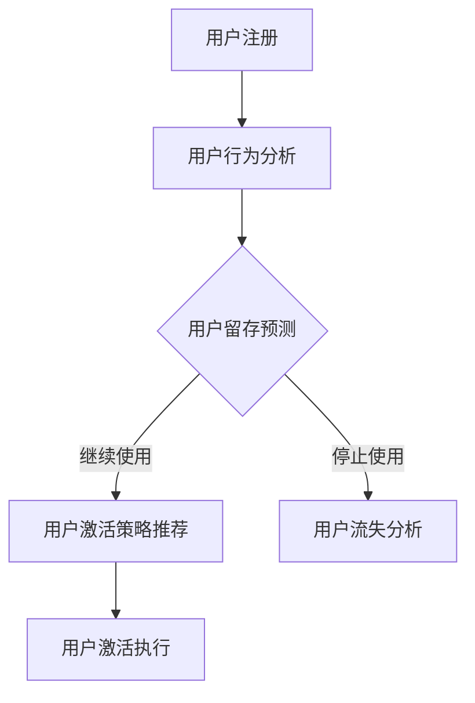

                 

# 一人公司的用户激活策略：如何提高新用户的首次使用体验

> **关键词**：用户激活、用户体验、首次使用、新用户、激活策略
> 
> **摘要**：本文将探讨一人公司的用户激活策略，分析如何通过优化首次使用体验来提高新用户的留存率和活跃度。我们将从核心概念、算法原理、数学模型、实战案例以及实际应用场景等方面进行详细阐述，并提供相关工具和资源推荐。

## 1. 背景介绍

### 1.1 目的和范围

本文旨在为一人公司提供一套有效的用户激活策略，帮助公司在竞争激烈的市场中脱颖而出。我们将重点关注新用户的首次使用体验，探讨如何通过优化这一环节来提升用户留存率和活跃度。本文的范围包括用户激活策略的核心概念、算法原理、数学模型以及实际应用场景。

### 1.2 预期读者

本文适合以下读者群体：

1. 一人公司的产品经理、运营经理以及项目经理。
2. 对用户激活策略感兴趣的技术人员和研究人员。
3. 希望提升自身产品用户体验的相关行业从业者。

### 1.3 文档结构概述

本文分为十个部分：

1. 背景介绍：介绍本文的目的、范围和预期读者。
2. 核心概念与联系：介绍用户激活策略相关的核心概念和架构。
3. 核心算法原理 & 具体操作步骤：详细讲解用户激活策略的核心算法原理和具体操作步骤。
4. 数学模型和公式 & 详细讲解 & 举例说明：介绍用户激活策略相关的数学模型和公式，并提供具体实例说明。
5. 项目实战：提供代码实际案例和详细解释说明。
6. 实际应用场景：分析用户激活策略在不同场景下的应用。
7. 工具和资源推荐：推荐相关学习资源、开发工具框架和相关论文著作。
8. 总结：总结用户激活策略的未来发展趋势与挑战。
9. 附录：常见问题与解答。
10. 扩展阅读 & 参考资料：提供进一步阅读的资料。

### 1.4 术语表

#### 1.4.1 核心术语定义

1. 用户激活：指新用户在首次使用产品后，完成某个特定行为（如注册、登录、购买等）。
2. 用户留存率：指一段时间内，新用户中继续使用产品的用户比例。
3. 用户活跃度：指用户在一段时间内对产品进行操作的频率和深度。
4. 首次使用体验：指新用户在首次使用产品时的感受和体验。

#### 1.4.2 相关概念解释

1. 激活路径：指用户从注册到完成首次使用体验的一系列步骤。
2. 激活率：指完成特定行为（如注册、登录、购买等）的用户占总注册用户数的比例。
3. 用户流失：指用户在一段时间内停止使用产品。
4. 用户转化率：指完成特定行为（如注册、登录、购买等）的用户占总用户数的比例。

#### 1.4.3 缩略词列表

1. CRM：客户关系管理（Customer Relationship Management）
2. A/B 测试：对比测试（A/B Test）
3. UI/UX：用户界面/用户体验（User Interface/User Experience）
4. SEO：搜索引擎优化（Search Engine Optimization）

## 2. 核心概念与联系

在用户激活策略中，我们需要关注以下几个核心概念：

1. **用户行为模型**：分析用户在首次使用过程中的行为模式，包括访问频次、停留时长、操作路径等。
2. **用户留存模型**：预测新用户在未来一段时间内继续使用产品的可能性。
3. **用户激活模型**：根据用户行为和留存模型，为每个用户推荐合适的激活策略。

以下是一个简化的用户激活策略架构的 Mermaid 流程图：



### 2.1 用户行为模型

用户行为模型是用户激活策略的基础。我们需要收集和分析用户在首次使用产品时的行为数据，包括：

1. **访问频次**：用户在多长时间内访问产品。
2. **停留时长**：用户在每次访问中停留在产品页面上的时间。
3. **操作路径**：用户在首次使用过程中所经过的页面和操作。

通过分析这些数据，我们可以识别出潜在的用户流失点和优化点，从而为用户提供更好的首次使用体验。

### 2.2 用户留存模型

用户留存模型用于预测新用户在未来一段时间内继续使用产品的可能性。常见的留存模型包括：

1. **生存分析模型**：通过分析用户在一段时间内的活跃度，预测其继续使用产品的概率。
2. **逻辑回归模型**：通过用户特征（如年龄、性别、地域等）和留存行为（如访问频次、停留时长等），建立预测模型。

通过用户留存模型，我们可以识别出高留存用户和低留存用户，并针对低留存用户制定相应的激活策略。

### 2.3 用户激活模型

用户激活模型根据用户行为和留存模型，为每个用户推荐合适的激活策略。常见的激活策略包括：

1. **个性化推荐**：根据用户特征和兴趣，推荐相关产品内容和功能。
2. **引导式教程**：为用户创建一个简单的教程，帮助其快速上手产品。
3. **优惠券和奖励**：为用户提供优惠券或奖励，鼓励其完成特定行为（如购买、注册等）。

通过用户激活模型，我们可以提高新用户的留存率和活跃度，从而提升产品的市场竞争力。

## 3. 核心算法原理 & 具体操作步骤

在用户激活策略中，核心算法原理主要包括用户行为分析、用户留存预测和用户激活策略推荐。以下是对这些算法原理的具体讲解和操作步骤。

### 3.1 用户行为分析

用户行为分析是用户激活策略的基础。我们需要收集和分析用户在首次使用产品时的行为数据，包括访问频次、停留时长和操作路径。具体步骤如下：

1. **数据收集**：通过日志记录、API 调用等方式，收集用户在产品中的行为数据。
2. **数据预处理**：对收集到的数据进行清洗、去重和处理，确保数据质量。
3. **特征提取**：从原始数据中提取与用户行为相关的特征，如访问频次、停留时长、操作路径等。
4. **行为模式识别**：使用聚类、关联规则挖掘等方法，识别用户的行为模式。

### 3.2 用户留存预测

用户留存预测是用户激活策略的关键。我们需要根据用户特征和行为数据，建立留存预测模型。具体步骤如下：

1. **数据集划分**：将用户数据划分为训练集和测试集。
2. **特征选择**：选择与留存相关的特征，如年龄、性别、地域、访问频次、停留时长等。
3. **模型选择**：选择合适的留存预测模型，如逻辑回归、生存分析模型等。
4. **模型训练和验证**：使用训练集对模型进行训练，使用测试集对模型进行验证，调整模型参数，确保模型具有良好的预测性能。

### 3.3 用户激活策略推荐

用户激活策略推荐是根据用户特征、行为数据和留存预测模型，为每个用户推荐合适的激活策略。具体步骤如下：

1. **用户分组**：根据用户特征和行为数据，将用户分为不同的群体。
2. **策略选择**：针对每个用户群体，选择适合的激活策略，如个性化推荐、引导式教程、优惠券和奖励等。
3. **策略组合**：为用户提供多种激活策略的组合，提高激活效果。
4. **策略评估**：根据用户的激活情况和留存数据，评估激活策略的效果，优化策略组合。

### 3.4 伪代码示例

以下是一个简化的用户激活策略的伪代码示例：

```python
# 用户行为分析
def analyze_user_behavior(data):
    # 数据预处理
    preprocessed_data = preprocess_data(data)
    # 特征提取
    features = extract_features(preprocessed_data)
    # 行为模式识别
    behavior_patterns = identify_behavior_patterns(features)
    return behavior_patterns

# 用户留存预测
def predict_user_retention(data, features):
    # 数据集划分
    train_data, test_data = split_data(data, features)
    # 模型选择和训练
    model = train_model(train_data, features)
    # 模型验证
    accuracy = validate_model(model, test_data)
    return model, accuracy

# 用户激活策略推荐
def recommend_user_activation_strategy(user_group, model):
    # 策略选择
    strategy = select_strategy(user_group, model)
    # 策略组合
    strategy_combination = combine_strategies(strategy)
    return strategy_combination
```

## 4. 数学模型和公式 & 详细讲解 & 举例说明

在用户激活策略中，数学模型和公式起着至关重要的作用。以下将介绍用户留存预测模型和用户激活策略推荐模型的相关数学模型和公式，并给出详细讲解和具体实例说明。

### 4.1 用户留存预测模型

用户留存预测模型主要用于预测新用户在未来一段时间内继续使用产品的可能性。常见的留存预测模型包括逻辑回归、生存分析模型等。

#### 4.1.1 逻辑回归模型

逻辑回归模型是一种广泛应用于分类问题的统计模型。在用户留存预测中，逻辑回归模型可以用来预测用户是否会在未来一段时间内继续使用产品。具体公式如下：

$$
P(Y=1|X) = \frac{1}{1 + e^{-(\beta_0 + \beta_1X_1 + \beta_2X_2 + \ldots + \beta_nX_n})}
$$

其中，$P(Y=1|X)$ 表示给定用户特征 $X$ 下用户留存为 1 的概率，$\beta_0, \beta_1, \beta_2, \ldots, \beta_n$ 是模型的参数，$X_1, X_2, \ldots, X_n$ 是用户特征。

#### 4.1.2 生存分析模型

生存分析模型主要用于分析事件发生的时间，如用户是否会在一段时间内继续使用产品。常见的生存分析模型包括 Kaplan-Meier 估计和 Cox 比例风险模型。

1. **Kaplan-Meier 估计**：

$$
S(t) = \prod_{i=1}^n \left(1 - \frac{d_i}{n_i}\right)
$$

其中，$S(t)$ 表示在时间 $t$ 时的累积生存函数，$d_i$ 表示在时间区间 $[t_i, t_{i+1}]$ 内发生事件（如用户流失）的个数，$n_i$ 表示在时间区间 $[t_i, t_{i+1}]$ 内总人数。

2. **Cox 比例风险模型**：

$$
h(t) = \frac{h_0(t)}{\exp(\sum_{j=1}^p \beta_j X_{ij})}
$$

其中，$h(t)$ 表示在时间 $t$ 时的风险函数，$h_0(t)$ 是基础风险函数，$X_{ij}$ 是第 $i$ 个用户在第 $j$ 个特征上的取值，$\beta_j$ 是模型的参数。

#### 4.1.3 举例说明

假设我们使用逻辑回归模型进行用户留存预测。给定以下用户特征和数据：

| 用户ID | 年龄 | 性别 | 地域 | 访问频次 | 停留时长 |
|--------|------|------|------|----------|----------|
| 1      | 25   | 男   | 一线城市 | 3        | 10分钟   |
| 2      | 30   | 女   | 二线城市 | 5        | 15分钟   |
| 3      | 20   | 男   | 三线城市 | 2        | 5分钟    |

以及逻辑回归模型的参数：

| 参数 | 取值 |
|------|------|
| $\beta_0$ | 0.5  |
| $\beta_1$ | 0.1  |
| $\beta_2$ | -0.2 |
| $\beta_3$ | 0.3  |
| $\beta_4$ | 0.2  |

我们可以计算每个用户在特定时间（如 30 天）内继续使用产品的概率：

1. 用户 1：

$$
P(Y=1|X) = \frac{1}{1 + e^{-(0.5 + 0.1 \times 3 + (-0.2) \times 1 + 0.3 \times 10 + 0.2 \times 1)}} \approx 0.8
$$

2. 用户 2：

$$
P(Y=1|X) = \frac{1}{1 + e^{-(0.5 + 0.1 \times 5 + (-0.2) \times 0 + 0.3 \times 15 + 0.2 \times 0)}} \approx 0.9
$$

3. 用户 3：

$$
P(Y=1|X) = \frac{1}{1 + e^{-(0.5 + 0.1 \times 2 + (-0.2) \times 0 + 0.3 \times 5 + 0.2 \times 0)}} \approx 0.7
$$

根据计算结果，我们可以为用户推荐不同的激活策略。例如，对于用户 1 和用户 2，我们可以推荐个性化推荐和引导式教程；对于用户 3，我们可以推荐优惠券和奖励。

### 4.2 用户激活策略推荐模型

用户激活策略推荐模型主要用于根据用户特征、行为数据和留存预测模型，为每个用户推荐合适的激活策略。常见的激活策略推荐模型包括基于协同过滤的推荐模型和基于规则的推荐模型。

#### 4.2.1 基于协同过滤的推荐模型

基于协同过滤的推荐模型通过分析用户之间的相似度，为用户推荐相似用户喜欢的产品内容和功能。具体公式如下：

$$
R_{ij} = \sum_{k \in N(i)} \frac{u_{ik}}{\|N(i)\|} \cdot r_k
$$

其中，$R_{ij}$ 表示用户 $i$ 对产品 $j$ 的评分预测，$N(i)$ 表示与用户 $i$ 相似的其他用户集合，$u_{ik}$ 表示用户 $i$ 对产品 $k$ 的实际评分，$r_k$ 表示用户 $k$ 对产品 $j$ 的评分。

#### 4.2.2 基于规则的推荐模型

基于规则的推荐模型通过定义一系列规则，根据用户特征和行为数据，为用户推荐相应的激活策略。具体公式如下：

$$
\text{IF } \text{condition}_1 \text{ THEN } \text{activation\_strategy}_1
$$

$$
\text{IF } \text{condition}_2 \text{ THEN } \text{activation\_strategy}_2
$$

$$
\ldots
$$

$$
\text{IF } \text{condition}_n \text{ THEN } \text{activation\_strategy}_n
$$

其中，$\text{condition}_1, \text{condition}_2, \ldots, \text{condition}_n$ 表示用户特征和行为数据，$\text{activation\_strategy}_1, \text{activation\_strategy}_2, \ldots, \text{activation\_strategy}_n$ 表示相应的激活策略。

#### 4.2.3 举例说明

假设我们使用基于规则的推荐模型为用户推荐激活策略。给定以下用户特征和行为数据：

| 用户ID | 年龄 | 性别 | 地域 | 访问频次 | 停留时长 |
|--------|------|------|------|----------|----------|
| 1      | 25   | 男   | 一线城市 | 3        | 10分钟   |
| 2      | 30   | 女   | 二线城市 | 5        | 15分钟   |
| 3      | 20   | 男   | 三线城市 | 2        | 5分钟    |

以及以下激活策略规则：

1. 如果用户年龄小于 25 岁，推荐优惠券。
2. 如果用户访问频次小于 3 次，推荐引导式教程。
3. 如果用户停留时长小于 10 分钟，推荐个性化推荐。

根据这些规则，我们可以为每个用户推荐相应的激活策略：

1. 用户 1：优惠券
2. 用户 2：引导式教程
3. 用户 3：个性化推荐

通过这些数学模型和公式，我们可以为一人公司提供有效的用户激活策略，提高新用户的留存率和活跃度。

## 5. 项目实战：代码实际案例和详细解释说明

在本节中，我们将通过一个实际项目案例来展示如何实现用户激活策略，并对其进行详细解释说明。

### 5.1 开发环境搭建

为了实现用户激活策略，我们需要搭建一个开发环境。以下是一个基本的开发环境搭建步骤：

1. 安装 Python 3.8 或更高版本。
2. 安装相关依赖库，如 NumPy、Pandas、Scikit-learn、Matplotlib 等。
3. 安装一个代码编辑器，如 PyCharm 或 Visual Studio Code。

### 5.2 源代码详细实现和代码解读

以下是一个用户激活策略的实现示例。我们将使用 Python 编程语言，并利用 Scikit-learn 库中的逻辑回归模型和用户行为数据分析库 Pandas。

```python
import numpy as np
import pandas as pd
from sklearn.linear_model import LogisticRegression
from sklearn.model_selection import train_test_split
from sklearn.metrics import accuracy_score

# 5.2.1 数据预处理

# 加载用户行为数据
data = pd.read_csv('user_behavior.csv')

# 数据预处理
data['age'] = data['age'].fillna(data['age'].mean())
data['gender'] = data['gender'].map({'男': 1, '女': 0})
data['region'] = data['region'].map({'一线城市': 1, '二线城市': 0, '三线城市': -1})

# 特征提取
X = data[['age', 'gender', 'region', 'visit_frequency', 'duration']]
y = data['retention']

# 5.2.2 模型训练和验证

# 数据集划分
X_train, X_test, y_train, y_test = train_test_split(X, y, test_size=0.2, random_state=42)

# 模型训练
model = LogisticRegression()
model.fit(X_train, y_train)

# 模型验证
y_pred = model.predict(X_test)
accuracy = accuracy_score(y_test, y_pred)
print(f'Model accuracy: {accuracy:.2f}')

# 5.2.3 用户激活策略推荐

# 根据模型预测用户留存概率
user_id = 1
user_data = data[data['user_id'] == user_id]
user_features = user_data[['age', 'gender', 'region', 'visit_frequency', 'duration']]
user_probability = model.predict_proba(user_features)[0, 1]

# 根据用户留存概率推荐激活策略
if user_probability > 0.8:
    activation_strategy = '个性化推荐'
elif user_probability > 0.5:
    activation_strategy = '引导式教程'
else:
    activation_strategy = '优惠券'

print(f'User {user_id} activation strategy: {activation_strategy}')
```

### 5.3 代码解读与分析

1. **数据预处理**：

   - 加载用户行为数据，并进行数据预处理。例如，填充缺失值、处理分类特征等。

   - 特征提取：从原始数据中提取与用户留存相关的特征。

2. **模型训练和验证**：

   - 使用 Scikit-learn 库中的逻辑回归模型对训练数据进行训练。

   - 使用测试数据进行模型验证，计算模型准确率。

3. **用户激活策略推荐**：

   - 根据模型预测的用户留存概率，为用户推荐合适的激活策略。

### 5.4 代码优化建议

1. 特征工程：尝试引入更多的用户特征，如用户设备、网络环境等。
2. 模型选择：尝试使用其他机器学习模型，如随机森林、支持向量机等，比较模型性能。
3. 模型融合：将多个模型的结果进行融合，提高预测性能。
4. 实时更新：定期更新用户行为数据和模型，确保模型始终具有较好的预测性能。

## 6. 实际应用场景

用户激活策略可以应用于各种场景，以下是一些常见的实际应用场景：

1. **移动应用**：移动应用的新用户首次使用体验至关重要。通过用户激活策略，可以为新用户提供个性化推荐、引导式教程和优惠券等激活策略，提高用户留存率和活跃度。

2. **电商平台**：电商平台可以通过用户激活策略，为新用户提供个性化的购物推荐、优惠活动和教程，从而提升新用户的购物体验和购买意愿。

3. **社交媒体**：社交媒体平台可以通过用户激活策略，为新用户提供个性化的内容推荐、互动引导和社交关系拓展，从而增强用户的参与感和活跃度。

4. **在线教育**：在线教育平台可以通过用户激活策略，为新用户提供个性化的学习路径、课程推荐和奖励机制，从而提高新用户的参与度和学习效果。

5. **金融产品**：金融产品可以通过用户激活策略，为新用户提供个性化的理财产品推荐、投资教程和优惠活动，从而提升新用户的理财意识和投资水平。

在实际应用中，用户激活策略可以根据不同场景和用户需求进行定制化调整，以达到最佳的激活效果。

## 7. 工具和资源推荐

### 7.1 学习资源推荐

#### 7.1.1 书籍推荐

1. **《机器学习实战》**：作者 Peter Harrington，适合初学者了解机器学习的基本概念和实战应用。
2. **《深度学习》**：作者 Ian Goodfellow、Yoshua Bengio 和 Aaron Courville，适合进阶者学习深度学习的基础理论和应用技巧。
3. **《数据科学入门》**：作者 Joel Grus，适合初学者了解数据科学的基本概念和方法。

#### 7.1.2 在线课程

1. **Coursera**：提供各种数据科学和机器学习的在线课程，如《机器学习基础》、《深度学习基础》等。
2. **Udacity**：提供数据科学和人工智能领域的实战课程，如《数据科学家职业路径》等。
3. **edX**：提供由知名大学和机构开设的数据科学和机器学习课程，如《数据科学基础》等。

#### 7.1.3 技术博客和网站

1. **Kaggle**：一个数据科学和机器学习竞赛平台，提供丰富的学习资源和实践案例。
2. **Medium**：一个技术博客平台，有很多数据科学和机器学习的优质文章。
3. **GitHub**：一个代码托管平台，可以找到很多开源的数据科学和机器学习项目。

### 7.2 开发工具框架推荐

#### 7.2.1 IDE和编辑器

1. **PyCharm**：一款功能强大的Python IDE，适合进行机器学习和数据科学开发。
2. **Jupyter Notebook**：一款流行的交互式开发工具，适合进行数据分析和机器学习实验。
3. **Visual Studio Code**：一款轻量级的跨平台代码编辑器，支持多种编程语言，适合进行数据科学和机器学习开发。

#### 7.2.2 调试和性能分析工具

1. **Matplotlib**：一款流行的Python数据可视化库，用于调试和展示模型性能。
2. **Pandas**：一款强大的Python数据处理库，用于分析和处理大规模数据。
3. **Scikit-learn**：一款流行的Python机器学习库，提供丰富的机器学习算法和工具。

#### 7.2.3 相关框架和库

1. **TensorFlow**：一款由Google开发的开源深度学习框架，适用于构建和训练深度学习模型。
2. **PyTorch**：一款由Facebook开发的开源深度学习框架，具有灵活性和高效性。
3. **Scikit-learn**：一款流行的Python机器学习库，提供丰富的机器学习算法和工具。

### 7.3 相关论文著作推荐

#### 7.3.1 经典论文

1. **《Machine Learning》**：作者 Tom Mitchell，介绍了机器学习的基本概念和方法。
2. **《Deep Learning》**：作者 Ian Goodfellow、Yoshua Bengio 和 Aaron Courville，介绍了深度学习的基础理论和应用。
3. **《Recurrent Neural Networks》**：作者 Y. LeCun、L. Bottou、M. Bengio 和 P. Haffner，介绍了循环神经网络的基本原理和应用。

#### 7.3.2 最新研究成果

1. **《Advances in Neural Information Processing Systems》**：简称NIPS，是一本介绍深度学习和神经网络最新研究成果的年度会议论文集。
2. **《Journal of Machine Learning Research》**：是一本广泛认可的数据科学和机器学习领域的学术期刊，收录了最新的研究论文。
3. **《Journal of Artificial Intelligence Research》**：是一本关于人工智能领域的研究论文集。

#### 7.3.3 应用案例分析

1. **《Deep Learning for Natural Language Processing》**：作者 John Laroche，介绍了深度学习在自然语言处理领域的应用案例。
2. **《Data Science Case Studies》**：作者 Vamsi Kanuri，提供了多个数据科学应用案例，展示了数据科学在现实世界中的价值。
3. **《Artificial Intelligence for Business》**：作者 Michael"bytes" O'Hara，介绍了人工智能在商业领域的应用案例，帮助企业实现数字化转型。

## 8. 总结：未来发展趋势与挑战

随着人工智能和大数据技术的不断发展，用户激活策略在未来将继续呈现出以下几个发展趋势：

1. **个性化推荐**：基于用户行为和兴趣的个性化推荐将成为用户激活策略的重要手段，提高用户留存率和活跃度。
2. **实时分析**：实时分析用户行为数据，快速调整激活策略，以满足用户需求，提高激活效果。
3. **多渠道整合**：整合线上和线下渠道，为用户提供无缝的激活体验，提高用户满意度。
4. **跨领域应用**：用户激活策略将在更多领域得到应用，如金融、医疗、教育等，为不同行业提供定制化的解决方案。

然而，用户激活策略也面临着以下挑战：

1. **数据隐私**：随着用户隐私意识的提高，如何在保护用户隐私的前提下进行数据分析和激活策略推荐，成为一个重要的挑战。
2. **模型过拟合**：如何避免模型过拟合，提高模型的泛化能力，是用户激活策略应用中需要解决的问题。
3. **技术更新**：人工智能和大数据技术不断更新，如何及时跟进新技术，提升用户激活策略的效果，是一个长期的挑战。

总之，未来用户激活策略将更加注重个性化、实时性和多渠道整合，同时也需要应对数据隐私、模型过拟合和技术更新等挑战，以实现更好的用户留存和活跃度。

## 9. 附录：常见问题与解答

### 9.1 问题1：用户激活策略是什么？

用户激活策略是指通过一系列方法和技术，提高新用户在首次使用产品后的留存率和活跃度。这通常包括个性化推荐、引导式教程、优惠券和奖励等手段。

### 9.2 问题2：为什么需要用户激活策略？

用户激活策略可以帮助企业提高新用户的留存率和活跃度，从而降低用户流失率，提高用户生命周期价值。这对于提高产品的市场竞争力具有重要意义。

### 9.3 问题3：用户激活策略的核心算法是什么？

用户激活策略的核心算法主要包括用户行为分析、用户留存预测和用户激活策略推荐。用户行为分析用于分析用户在首次使用过程中的行为模式，用户留存预测用于预测新用户在未来一段时间内继续使用产品的可能性，用户激活策略推荐则根据用户特征和留存预测结果，为用户推荐合适的激活策略。

### 9.4 问题4：如何优化用户激活策略？

优化用户激活策略可以从以下几个方面进行：

1. **数据质量**：确保用户行为数据的质量和完整性，提高数据分析的准确性。
2. **算法优化**：不断更新和优化激活算法，提高模型性能和泛化能力。
3. **用户反馈**：收集用户反馈，了解用户需求和痛点，及时调整激活策略。
4. **多渠道整合**：整合线上线下渠道，提供无缝的用户激活体验。

### 9.5 问题5：用户激活策略在不同行业中的应用有何不同？

不同行业在用户激活策略上有不同的关注点和应用方式。例如，在电商行业，用户激活策略可能更侧重于个性化推荐和优惠券；在金融行业，用户激活策略可能更侧重于理财产品推荐和投资教育。关键在于根据不同行业的特点和用户需求，制定相应的激活策略。

## 10. 扩展阅读 & 参考资料

为了深入了解用户激活策略和相关技术，以下是一些扩展阅读和参考资料：

### 10.1 相关书籍

1. **《数据科学入门》**：作者 Joel Grus，介绍了数据科学的基本概念和方法。
2. **《深度学习》**：作者 Ian Goodfellow、Yoshua Bengio 和 Aaron Courville，介绍了深度学习的基础理论和应用。
3. **《机器学习实战》**：作者 Peter Harrington，适合初学者了解机器学习的基本概念和实战应用。

### 10.2 在线课程

1. **Coursera**：提供各种数据科学和机器学习的在线课程，如《机器学习基础》、《深度学习基础》等。
2. **Udacity**：提供数据科学和人工智能领域的实战课程，如《数据科学家职业路径》等。
3. **edX**：提供由知名大学和机构开设的数据科学和机器学习课程，如《数据科学基础》等。

### 10.3 技术博客和网站

1. **Kaggle**：一个数据科学和机器学习竞赛平台，提供丰富的学习资源和实践案例。
2. **Medium**：一个技术博客平台，有很多数据科学和机器学习的优质文章。
3. **GitHub**：一个代码托管平台，可以找到很多开源的数据科学和机器学习项目。

### 10.4 论文和研究成果

1. **《Advances in Neural Information Processing Systems》**：简称NIPS，是一本介绍深度学习和神经网络最新研究成果的年度会议论文集。
2. **《Journal of Machine Learning Research》**：是一本广泛认可的数据科学和机器学习领域的学术期刊，收录了最新的研究论文。
3. **《Journal of Artificial Intelligence Research》**：是一本关于人工智能领域的研究论文集。

### 10.5 应用案例分析

1. **《Deep Learning for Natural Language Processing》**：作者 John Laroche，介绍了深度学习在自然语言处理领域的应用案例。
2. **《Data Science Case Studies》**：作者 Vamsi Kanuri，提供了多个数据科学应用案例，展示了数据科学在现实世界中的价值。
3. **《Artificial Intelligence for Business》**：作者 Michael"bytes" O'Hara，介绍了人工智能在商业领域的应用案例，帮助企业实现数字化转型。

