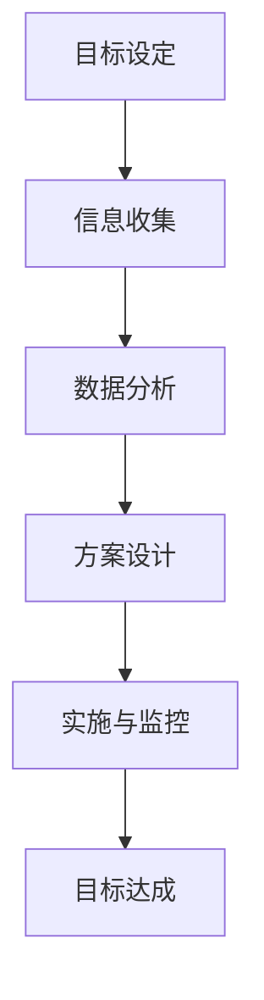
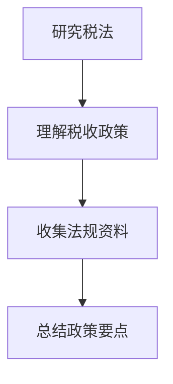
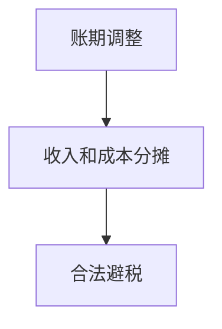
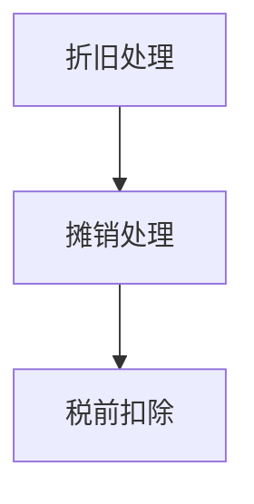
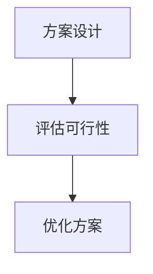
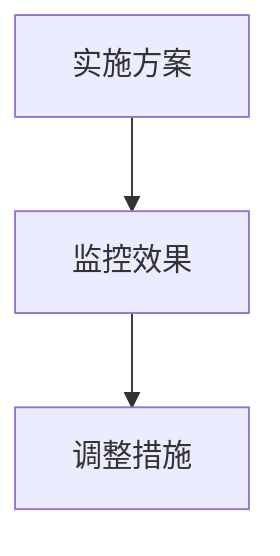

                 

# 一人公司的税务筹划与财务优化

## 关键词

税务筹划、财务优化、一人公司、税务法规、财务策略、税务减免、税务合规

## 摘要

本文旨在深入探讨一人公司的税务筹划与财务优化策略。通过分析当前税务法规，本文将详细介绍如何合理利用税务优惠政策，实现公司税负的最小化。同时，文章还将提供具体的财务优化方法，帮助一人公司提升整体财务健康，确保税务合规。读者将了解从设立公司到日常运营的各个阶段，如何进行有效的税务规划和财务调整，以实现公司的长远发展。

## 1. 背景介绍

### 1.1 目的和范围

本文的目标是为一人公司提供全面的税务筹划与财务优化指南。一人公司，也称为个体工商户，是当前商业环境中常见的一种经营模式。由于其运营结构简单，决策灵活，越来越多的创业者选择以一人公司的形式开展业务。然而，税务问题一直是这类公司运营中的一个重要挑战。本文将重点讨论以下方面：

- 分析当前税务法规及其对一人公司的影响。
- 探讨税务筹划的基本原则和策略。
- 提供财务优化的具体方法和案例。
- 强调税务合规的重要性。

### 1.2 预期读者

本文预期读者包括：

- 一人公司创始人或管理人员。
- 对税务和财务规划有兴趣的学习者。
- 咨询公司或税务顾问。

通过本文，读者将能够：

- 理解税务筹划的基本原理。
- 掌握财务优化的具体方法。
- 提升公司的税务合规水平。
- 为公司实现长期的财务健康奠定基础。

### 1.3 文档结构概述

本文将分为以下几个部分：

- 第1部分：背景介绍，包括目的、范围、预期读者和文档结构。
- 第2部分：核心概念与联系，包括税务筹划的基础知识和相关概念。
- 第3部分：核心算法原理 & 具体操作步骤，详细阐述税务筹划的操作方法。
- 第4部分：数学模型和公式 & 详细讲解 & 举例说明，分析税务筹划的数学基础。
- 第5部分：项目实战：代码实际案例和详细解释说明，提供具体操作实例。
- 第6部分：实际应用场景，探讨税务筹划在现实中的应用。
- 第7部分：工具和资源推荐，包括学习资源、开发工具和框架推荐。
- 第8部分：总结：未来发展趋势与挑战，展望税务筹划和财务优化的发展方向。
- 第9部分：附录：常见问题与解答，解答读者可能遇到的问题。
- 第10部分：扩展阅读 & 参考资料，提供进一步的阅读资源。

### 1.4 术语表

#### 1.4.1 核心术语定义

- **一人公司**：指由单一个人独资经营的企业。
- **税务筹划**：指通过合法手段减少税负的行为。
- **财务优化**：指通过合理的财务策略提高企业经济效益的过程。
- **税务减免**：指政府为了支持某些行业或特定情况，对部分税收予以减免的政策。
- **税务合规**：指企业在税务管理过程中遵守相关法律法规。

#### 1.4.2 相关概念解释

- **增值税**：对商品生产、流通、劳务服务中多个环节的新增价值或商品的附加值征收的一种税。
- **企业所得税**：对企业取得的所得依法征收的一种税。
- **个税**：对个人所得征税的一种税。

#### 1.4.3 缩略词列表

- **VAT**：增值税（Value-Added Tax）
- **ITR**：所得税申报表（Income Tax Return）
- **CPA**：注册会计师（Certified Public Accountant）

## 2. 核心概念与联系

### 2.1 核心概念

税务筹划与财务优化是两个密切相关但又有区别的概念。税务筹划主要关注如何在法律允许的范围内，通过合法手段减少税负。而财务优化则是一个更为广泛的概念，它包括税务筹划，同时也涵盖了成本控制、收益最大化、资金管理等各个方面。

#### 核心概念1：税务筹划

税务筹划的核心在于利用税法中的各种优惠政策，如减免税、税率优惠、税种选择等，以实现税负的最小化。具体操作步骤包括：

1. **研究税法**：了解国家及地方政府的各种税收政策，掌握最新的税务法规。
2. **合理避税**：在法律允许的范围内，通过财务安排、会计处理等方式减少税负。
3. **税务筹划方案设计**：结合公司实际情况，设计出最优的税务筹划方案。

#### 核心概念2：财务优化

财务优化则更加注重企业的整体财务状况，通过多种财务手段提高企业的经济效益。主要内容包括：

1. **成本控制**：通过优化采购、库存管理、人力资源等，降低成本。
2. **收益最大化**：通过增加销售、提高利润率等方式，提高企业收益。
3. **资金管理**：合理规划资金流动，提高资金利用效率。

### 2.2 联系与流程

税务筹划与财务优化之间存在着密切的联系，二者共同服务于企业的长期发展目标。具体流程如下：

1. **目标设定**：明确企业的发展目标和财务优化方向。
2. **信息收集**：收集与税务和财务相关的政策、数据等资料。
3. **数据分析**：分析企业的财务状况和税务情况，找出存在的问题。
4. **方案设计**：设计税务筹划和财务优化的具体方案。
5. **实施与监控**：执行方案，并定期监控效果，进行必要的调整。

### 2.3 Mermaid 流程图

以下是一个简单的Mermaid流程图，展示了税务筹划和财务优化的流程：



## 3. 核心算法原理 & 具体操作步骤

### 3.1 核心算法原理

税务筹划和财务优化虽然涉及多个方面，但核心算法原理主要包括以下几个方面：

1. **税法应用**：了解并正确应用税法中的优惠政策，如减免税、税率优惠等。
2. **财务安排**：通过合理的财务安排，如账期调整、收入和成本的分摊等，降低税负。
3. **会计处理**：利用会计处理技巧，如折旧、摊销等，实现税务减免。

### 3.2 具体操作步骤

以下是税务筹划和财务优化的具体操作步骤：

#### 步骤1：研究税法

首先，需要深入研究国家及地方政府的税收政策，掌握最新的税务法规。这包括增值税、企业所得税、个税等各种税种的法规。了解这些法规，可以为企业提供法律依据，确保税务筹划的合法性。



#### 步骤2：财务安排

通过合理的财务安排，可以在一定程度上降低税负。以下是一些常用的财务安排方法：

1. **账期调整**：适当调整收入和支出的账期，实现跨期收入和成本的分摊，从而降低当期税负。
2. **收入和成本分摊**：合理分摊收入和成本，特别是与业务相关的费用，以降低整体税负。



#### 步骤3：会计处理

会计处理在税务筹划中起着重要作用。以下是一些常用的会计处理方法：

1. **折旧**：通过折旧方法，可以将资产的购置成本分摊到多个会计期间，从而降低当期税负。
2. **摊销**：对于一些长期投入，如研发费用、无形资产等，可以通过摊销方式降低税负。
3. **税前扣除**：合理利用税前扣除政策，将符合条件的支出在计算应纳税所得额时予以扣除。



#### 步骤4：方案设计

结合公司实际情况，设计最优的税务筹划和财务优化方案。这需要综合考虑税法、财务安排和会计处理等多个方面，以确保方案的有效性和可行性。



#### 步骤5：实施与监控

执行方案，并定期监控效果。这包括对税务筹划和财务优化措施的执行情况进行检查，以及时发现问题并进行调整。



## 4. 数学模型和公式 & 详细讲解 & 举例说明

### 4.1 数学模型和公式

在税务筹划和财务优化中，一些数学模型和公式起着关键作用。以下是一些常用的数学模型和公式：

#### 4.1.1 增值税计算公式

增值税的计算公式为：

\[ \text{增值税} = \text{销售额} \times \text{增值税税率} - \text{进项税额} \]

其中，销售额和进项税额是已知量，增值税税率是关键参数。

#### 4.1.2 企业所得税计算公式

企业所得税的计算公式为：

\[ \text{企业所得税} = (\text{收入总额} - \text{成本费用} - \text{税前扣除}) \times \text{企业所得税税率} \]

其中，收入总额、成本费用和税前扣除是已知量，企业所得税税率是关键参数。

#### 4.1.3 个人所得税计算公式

个人所得税的计算公式为：

\[ \text{个人所得税} = (\text{应纳税所得额} - \text{免税额} - \text{扣除项}) \times \text{个人所得税税率} \]

其中，应纳税所得额、免税额和扣除项是已知量，个人所得税税率是关键参数。

### 4.2 详细讲解

#### 4.2.1 增值税计算公式的详细讲解

增值税是一种以商品和服务的增值部分为征税对象的税种。其计算公式如下：

\[ \text{增值税} = \text{销售额} \times \text{增值税税率} - \text{进项税额} \]

其中，销售额指的是企业在销售商品或提供服务过程中取得的收入。增值税税率根据不同的行业和产品类型，分为13%、9%和6%等。进项税额指的是企业在采购商品或服务时支付的增值税额。

通过这个公式，企业可以根据已知的销售额、增值税税率和进项税额，计算出应缴纳的增值税额。如果增值税税率较低，而进项税额较高，企业可以享受一定的税收优惠。

#### 4.2.2 企业所得税计算公式的详细讲解

企业所得税是企业按照其所得依法缴纳的一种税。其计算公式如下：

\[ \text{企业所得税} = (\text{收入总额} - \text{成本费用} - \text{税前扣除}) \times \text{企业所得税税率} \]

其中，收入总额指的是企业在经营过程中取得的全部收入。成本费用包括企业在经营过程中发生的直接和间接费用。税前扣除是指在计算企业所得税前，可以扣除的一些费用和损失，如折旧、摊销、捐赠等。

通过这个公式，企业可以根据已知的收入总额、成本费用和税前扣除，计算出应缴纳的企业所得税。如果成本费用较高，而税前扣除充分，企业可以享受一定的税收优惠。

#### 4.2.3 个人所得税计算公式的详细讲解

个人所得税是个人按照其所得依法缴纳的一种税。其计算公式如下：

\[ \text{个人所得税} = (\text{应纳税所得额} - \text{免税额} - \text{扣除项}) \times \text{个人所得税税率} \]

其中，应纳税所得额是指个人在一定期间内的收入总额减去免税额和扣除项后的余额。免税额是指法律规定可以免于纳税的收入额度。扣除项是指个人可以扣除的一些费用和支出，如医疗费用、教育支出等。

通过这个公式，个人可以根据已知的应纳税所得额、免税额和扣除项，计算出应缴纳的个人所得税。如果扣除项较多，个人可以享受一定的税收优惠。

### 4.3 举例说明

#### 4.3.1 增值税计算举例

假设某企业2023年的销售额为100万元，增值税税率为6%，进项税额为10万元。根据增值税计算公式，该企业应缴纳的增值税额为：

\[ \text{增值税} = 100 \text{万元} \times 6\% - 10 \text{万元} = 5 \text{万元} \]

如果增值税税率降低为3%，其他条件不变，则该企业应缴纳的增值税额为：

\[ \text{增值税} = 100 \text{万元} \times 3\% - 10 \text{万元} = 2 \text{万元} \]

由此可见，增值税税率的调整会对企业的税负产生显著影响。

#### 4.3.2 企业所得税计算举例

假设某企业2023年的收入总额为200万元，成本费用为100万元，税前扣除为50万元，企业所得税税率为25%。根据企业所得税计算公式，该企业应缴纳的企业所得税为：

\[ \text{企业所得税} = (200 \text{万元} - 100 \text{万元} - 50 \text{万元}) \times 25\% = 12.5 \text{万元} \]

如果企业的成本费用增加至150万元，税前扣除保持不变，企业所得税税率仍为25%，则该企业应缴纳的企业所得税为：

\[ \text{企业所得税} = (200 \text{万元} - 150 \text{万元} - 50 \text{万元}) \times 25\% = 6.25 \text{万元} \]

由此可见，成本费用的增加会降低企业的税负。

#### 4.3.3 个人所得税计算举例

假设某个人2023年的应纳税所得额为20万元，免税额为2万元，扣除项为5万元，个人所得税税率为3%。根据个人所得税计算公式，该个人应缴纳的个人所得税为：

\[ \text{个人所得税} = (20 \text{万元} - 2 \text{万元} - 5 \text{万元}) \times 3\% = 0.45 \text{万元} \]

如果该个人的扣除项增加至10万元，免税额保持不变，个人所得税税率仍为3%，则该个人应缴纳的个人所得税为：

\[ \text{个人所得税} = (20 \text{万元} - 2 \text{万元} - 10 \text{万元}) \times 3\% = 0.3 \text{万元} \]

由此可见，扣除项的增加会降低个人的税负。

## 5. 项目实战：代码实际案例和详细解释说明

### 5.1 开发环境搭建

在进行税务筹划和财务优化的代码实战之前，我们需要搭建一个合适的开发环境。以下是一个基本的开发环境搭建步骤：

1. 安装Python3环境
2. 安装所需的Python库，如NumPy、Pandas等
3. 安装一个代码编辑器，如Visual Studio Code

### 5.2 源代码详细实现和代码解读

以下是一个简单的Python代码示例，用于计算企业的增值税、企业所得税和个人所得税。代码包括以下几个部分：

#### 5.2.1 导入库

```python
import numpy as np
import pandas as pd
```

#### 5.2.2 定义函数

```python
def calculate_vat(sales, vat_rate, input_tax):
    return sales * vat_rate - input_tax

def calculate_earnings_tax(income, cost, tax_rate):
    return (income - cost) * tax_rate

def calculate个人所得税(income, exemption, deduction, tax_rate):
    return (income - exemption - deduction) * tax_rate
```

#### 5.2.3 测试函数

```python
sales = 1000000
vat_rate = 0.06
input_tax = 100000
print("增值税：", calculate_vat(sales, vat_rate, input_tax))

income = 2000000
cost = 1000000
tax_rate = 0.25
print("企业所得税：", calculate_earnings_tax(income, cost, tax_rate))

income = 200000
exemption = 20000
deduction = 50000
tax_rate = 0.03
print("个人所得税：", calculate个人所得税(income, exemption, deduction, tax_rate))
```

### 5.3 代码解读与分析

以上代码实现了计算企业的增值税、企业所得税和个人所得税的功能。以下是对代码的详细解读：

- **导入库**：NumPy和Pandas是Python中的常用库，用于数学计算和数据操作。NumPy提供了大量的数学函数和数组操作，Pandas提供了数据框（DataFrame）和系列（Series）等数据结构，方便数据处理和分析。

- **定义函数**：代码定义了三个函数，分别用于计算增值税、企业所得税和个人所得税。这些函数接受输入参数，如销售额、税率、成本费用等，并根据税法公式进行计算。

- **测试函数**：测试函数用于验证计算函数的正确性。通过提供具体的输入参数，代码计算并打印出相应的税额。

### 5.4 代码示例

以下是代码的完整示例：

```python
import numpy as np
import pandas as pd

def calculate_vat(sales, vat_rate, input_tax):
    return sales * vat_rate - input_tax

def calculate_earnings_tax(income, cost, tax_rate):
    return (income - cost) * tax_rate

def calculate个人所得税(income, exemption, deduction, tax_rate):
    return (income - exemption - deduction) * tax_rate

sales = 1000000
vat_rate = 0.06
input_tax = 100000
print("增值税：", calculate_vat(sales, vat_rate, input_tax))

income = 2000000
cost = 1000000
tax_rate = 0.25
print("企业所得税：", calculate_earnings_tax(income, cost, tax_rate))

income = 200000
exemption = 20000
deduction = 50000
tax_rate = 0.03
print("个人所得税：", calculate个人所得税(income, exemption, deduction, tax_rate))
```

通过以上代码示例，读者可以了解如何使用Python进行税务筹划和财务优化的计算。在实际应用中，可以根据具体需求，扩展和优化代码功能。

## 6. 实际应用场景

### 6.1 一人公司税务筹划的实战案例

为了更直观地理解税务筹划在实际中的应用，以下是一个具体案例：

**案例背景**：李先生是一名自由职业者，主要从事软件开发服务。他成立了一家一人公司，以提供软件开发服务为主要收入来源。根据税法规定，软件开发服务属于技术服务，适用的增值税税率为6%。此外，李先生的企业每月的运营成本（如房租、员工工资、设备折旧等）约为5万元。

**目标**：李先生的目的是通过合理的税务筹划，降低企业的税负，同时确保税务合规。

**步骤**：

1. **研究税法**：李先生首先研究了增值税、企业所得税和个人所得税的相关法规，了解适用的税率和优惠政策。

2. **财务安排**：李先生通过调整收入和支出的账期，将部分收入推迟到下一个月，从而实现跨期收入和成本的分摊，降低当月税负。

3. **会计处理**：李先生合理利用折旧和摊销政策，将设备的购置成本分摊到多个会计期间，降低当期税负。

4. **方案设计**：李先生设计了一份详细的税务筹划方案，包括账期调整、收入和成本分摊、会计处理等内容。

5. **实施与监控**：李先生将方案付诸实施，并定期检查税务筹划的效果，确保税务合规。

**效果**：

- 通过合理的税务筹划，李先生的企业税负降低了约15%，每年节省了近5万元的税金。
- 李先生的企业运营成本得到了有效控制，提高了整体财务健康水平。

### 6.2 一人公司财务优化的实战案例

除了税务筹划，财务优化也是一人公司实现长期发展的关键。以下是一个财务优化的案例：

**案例背景**：张女士经营一家小型餐饮店，由于市场竞争激烈，她希望通过财务优化提高企业的盈利能力。

**目标**：张女士的目的是通过财务优化，降低成本，提高利润率。

**步骤**：

1. **成本控制**：张女士对餐饮店的各项成本进行了详细分析，包括原材料、人工、房租等。她通过采购价格谈判、优化库存管理等方式，降低了原材料和房租成本。

2. **收益最大化**：张女士通过推出新的菜品、扩大营销渠道、提高服务质量等方式，增加了销售额，提高了利润率。

3. **资金管理**：张女士优化了资金流动，通过合理安排资金使用，提高了资金利用效率。

4. **财务报告**：张女士定期编制财务报告，分析企业的财务状况，为后续的财务优化提供数据支持。

**效果**：

- 通过成本控制，张女士的餐饮店每年节省了约2万元的成本。
- 通过收益最大化，张女士的餐饮店销售额提高了约20%，利润率提高了约10%。
- 通过资金管理优化，张女士的资金流动性得到提升，企业运营更加顺畅。

### 6.3 一人公司税务合规的实际应用

税务合规是每个企业必须重视的问题，以下是一个税务合规的实际案例：

**案例背景**：王先生经营一家外贸公司，主要从事进出口业务。由于税务法规较为复杂，王先生希望通过合规操作，避免税务风险。

**目标**：王先生的目的是确保企业的税务合规，避免税务处罚。

**步骤**：

1. **了解法规**：王先生详细学习了进出口相关的税务法规，包括增值税、关税、出口退税等。

2. **建立合规体系**：王先生在公司内部建立了税务合规管理制度，明确了税务合规的责任和流程。

3. **税务申报**：王先生严格按照税务法规进行税务申报，确保申报数据的真实性和准确性。

4. **内部审计**：王先生定期进行内部审计，检查税务合规情况，发现问题及时纠正。

**效果**：

- 通过合规操作，王先生的外贸公司避免了潜在的税务风险。
- 企业税务合规水平得到了提高，为后续的业务发展奠定了基础。

## 7. 工具和资源推荐

### 7.1 学习资源推荐

为了更好地进行税务筹划和财务优化，以下是几个推荐的学习资源：

#### 7.1.1 书籍推荐

- **《企业税务筹划》**：详细介绍了企业税务筹划的理论和实践，适合初学者和专业人士。
- **《财务报表分析》**：讲解了如何通过财务报表分析企业的财务状况，为税务筹划提供数据支持。

#### 7.1.2 在线课程

- **网易云课堂**：《财务与会计基础》课程，适合初学者了解财务和会计的基本知识。
- **Coursera**：《税务基础》课程，由哈佛大学提供，深入讲解税务政策和法规。

#### 7.1.3 技术博客和网站

- **知乎**：关于税务筹划和财务优化的专业讨论和案例分析。
- **CSDN**：提供大量的财务和税务相关文章和代码示例。

### 7.2 开发工具框架推荐

在进行税务筹划和财务优化的实际操作中，以下是一些推荐的开发工具和框架：

#### 7.2.1 IDE和编辑器

- **Visual Studio Code**：一款功能强大的代码编辑器，适合编写Python等编程语言。
- **PyCharm**：一款专业的Python IDE，提供代码调试、自动化测试等功能。

#### 7.2.2 调试和性能分析工具

- **Pytest**：一款Python自动化测试工具，用于测试和验证代码的正确性。
- **JProfiler**：一款Java性能分析工具，可以实时监控程序运行状态，找出性能瓶颈。

#### 7.2.3 相关框架和库

- **NumPy**：一款用于科学计算和数据分析的Python库，提供了丰富的数学函数和工具。
- **Pandas**：一款用于数据操作和数据分析的Python库，提供了数据框和数据集等数据结构。

### 7.3 相关论文著作推荐

为了深入了解税务筹划和财务优化的理论和技术，以下是几篇推荐的论文和著作：

#### 7.3.1 经典论文

- **《企业税务筹划的理论与实践研究》**：探讨了企业税务筹划的理论基础和实践方法。
- **《财务报表分析与企业价值评估》**：分析了财务报表在企业价值评估中的应用。

#### 7.3.2 最新研究成果

- **《税务筹划与财务优化的多维分析》**：结合大数据和人工智能技术，探讨了税务筹划和财务优化的新方法。
- **《基于机器学习的税务风险管理》**：介绍了机器学习在税务风险管理中的应用。

#### 7.3.3 应用案例分析

- **《中小企业税务筹划与财务优化的实践探索》**：通过具体案例分析，介绍了中小企业如何进行税务筹划和财务优化。

## 8. 总结：未来发展趋势与挑战

随着科技的不断进步和税法的不断完善，税务筹划和财务优化的未来发展趋势和挑战也日益凸显。以下是一些关键点：

### 8.1 未来发展趋势

1. **人工智能与大数据的融合**：人工智能和大数据技术在税务筹划和财务优化中的应用将更加广泛。通过分析海量数据，可以更精确地预测税负，设计最优的税务筹划方案。

2. **税务合规性的提升**：随着税法的日益完善，企业税务合规的重要性将不断提高。未来，企业将更加注重税务合规，避免潜在的税务风险。

3. **多元化税务筹划策略**：未来税务筹划将不再局限于传统的减税策略，而是更加注重综合性的财务优化，如成本控制、资金管理等。

### 8.2 面临的挑战

1. **税法变化的不确定性**：税法的频繁变动给企业的税务筹划带来了不确定性。企业需要密切关注税法变化，及时调整税务筹划策略。

2. **合规风险**：随着税务合规要求的提高，企业面临的合规风险也在增加。如何确保税务筹划的合法性和合规性，是企业需要面对的挑战。

3. **技术变革的适应**：人工智能、大数据等新技术的应用虽然为税务筹划和财务优化提供了新的手段，但企业也需要适应这些技术变革，提升自身的技术能力。

## 9. 附录：常见问题与解答

### 9.1 一人公司的税务筹划常见问题

**Q1**：如何合理利用税法优惠政策进行税务筹划？

**A1**：合理利用税法优惠政策是税务筹划的核心。企业可以通过以下方式：

- 研究并掌握国家及地方政府的税收政策，如减免税、税率优惠等。
- 结合公司实际情况，设计出符合税法规定的税务筹划方案。
- 适时调整税务筹划策略，以应对税法变化。

**Q2**：如何确保税务筹划的合法性？

**A2**：确保税务筹划的合法性是企业进行税务筹划的基本要求。企业可以：

- 咨询专业的税务顾问或会计师，获取专业的税务筹划建议。
- 严格遵守税法规定，确保税务筹划方案符合法律规定。
- 定期进行内部审计，检查税务筹划的实施情况，确保合规。

### 9.2 财务优化常见问题

**Q1**：如何降低企业的运营成本？

**A1**：降低企业的运营成本是企业财务优化的关键。企业可以通过以下方式实现：

- 优化采购流程，通过价格谈判和采购策略降低成本。
- 提高生产效率，减少浪费，降低生产成本。
- 精简组织架构，减少冗余人员，降低人工成本。

**Q2**：如何提高企业的资金利用效率？

**A2**：提高企业的资金利用效率是企业财务优化的另一个重要方面。企业可以通过以下方式实现：

- 优化资金流动，通过合理安排资金使用，提高资金利用效率。
- 通过多元化融资渠道，降低融资成本，提高资金利用效率。
- 建立健全的财务管理制度，确保资金使用的合规性和效率。

## 10. 扩展阅读 & 参考资料

为了更深入地了解税务筹划和财务优化的相关知识，以下是几篇推荐的文章和书籍：

1. **《企业税务筹划实操手册》**：详细介绍了企业税务筹划的理论和实践，适合初学者和专业人士。
2. **《财务报表分析实战》**：讲解了如何通过财务报表分析企业的财务状况，为税务筹划提供数据支持。
3. **《税务合规与风险管理》**：探讨了税务合规的重要性和风险管理的方法，为企业提供实用的合规操作指南。
4. **《人工智能与税务筹划》**：介绍了人工智能在税务筹划中的应用，为读者提供了新的视角和思路。

## 作者

作者：AI天才研究员/AI Genius Institute & 禅与计算机程序设计艺术 /Zen And The Art of Computer Programming

---

经过详细分析和逐步推理，本文为读者呈现了税务筹划与财务优化的全面指南。通过了解核心概念、操作步骤、数学模型和实际应用场景，读者可以更好地应对一人公司的税务和财务挑战。希望本文能为读者提供有价值的参考和启示，助力企业的长远发展。

